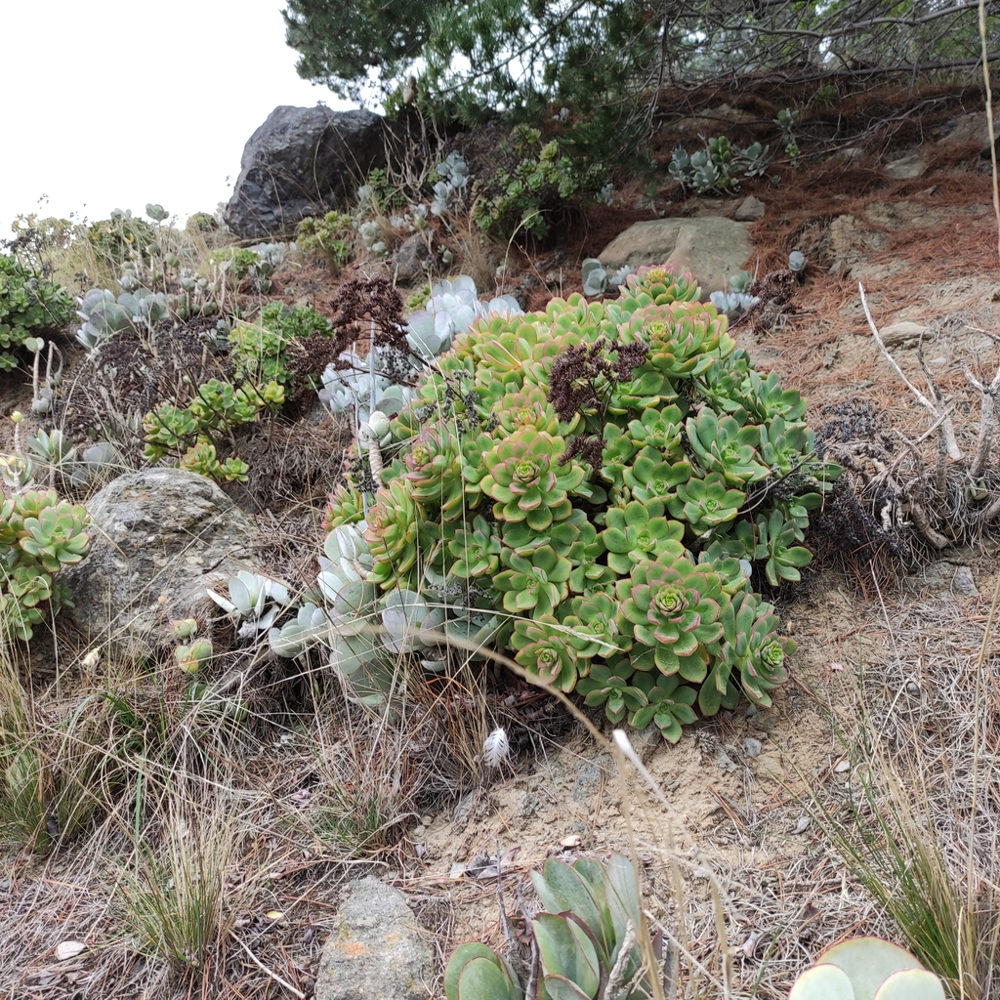
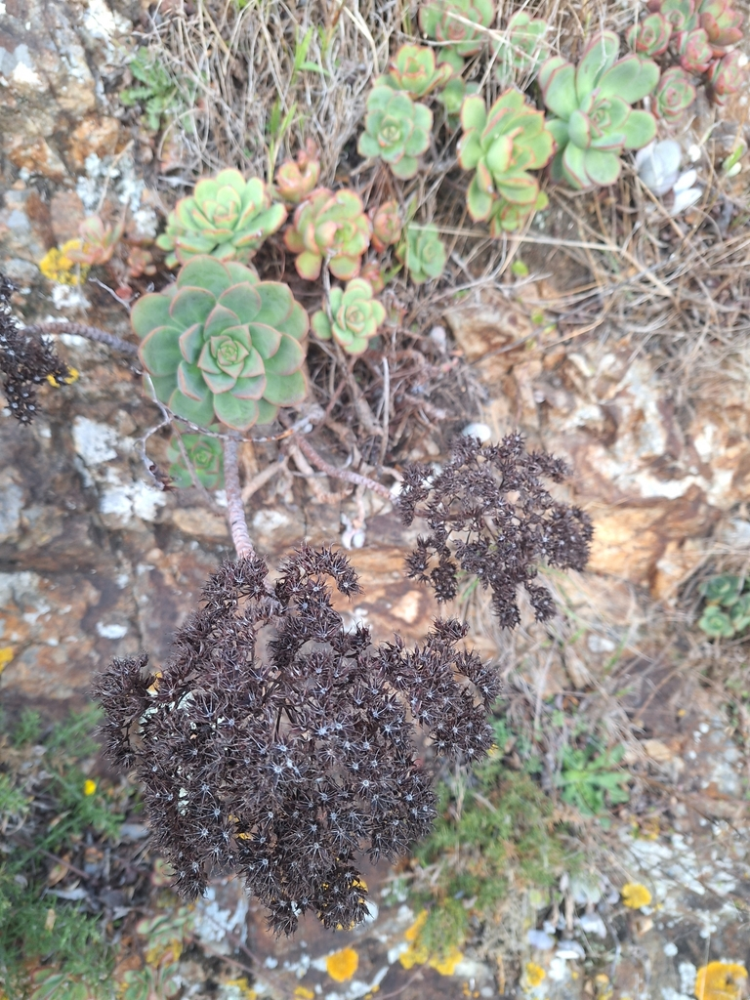
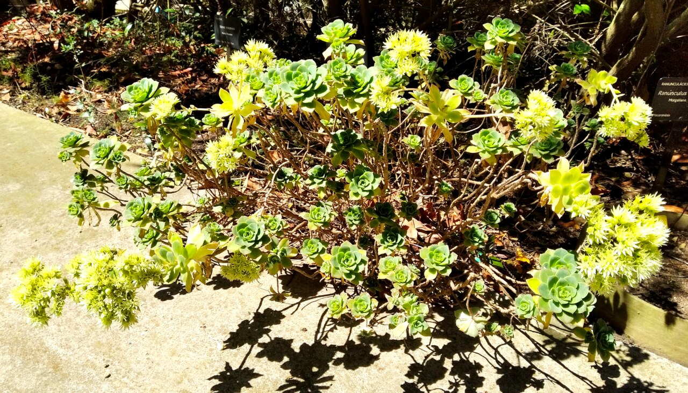
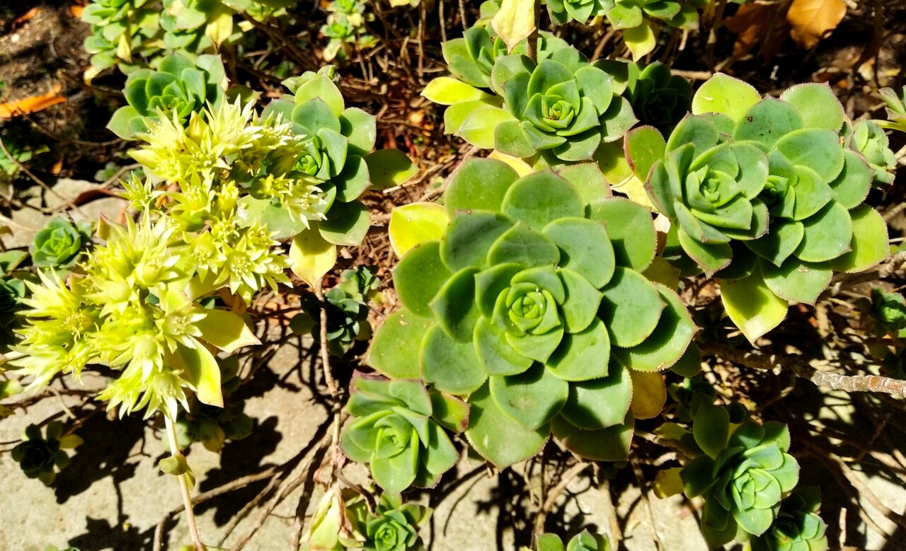
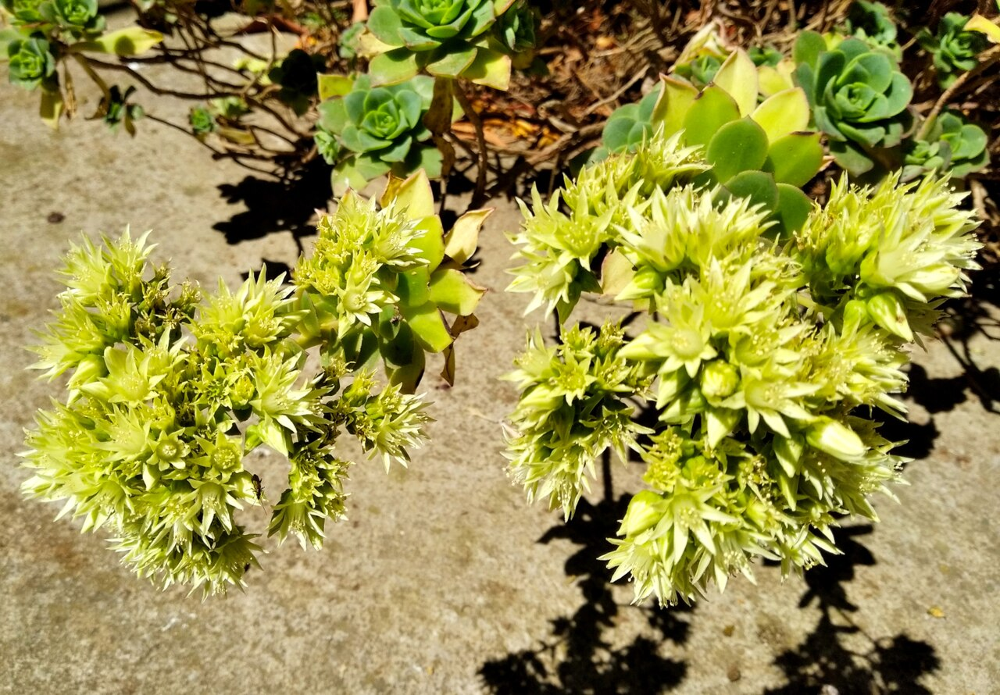
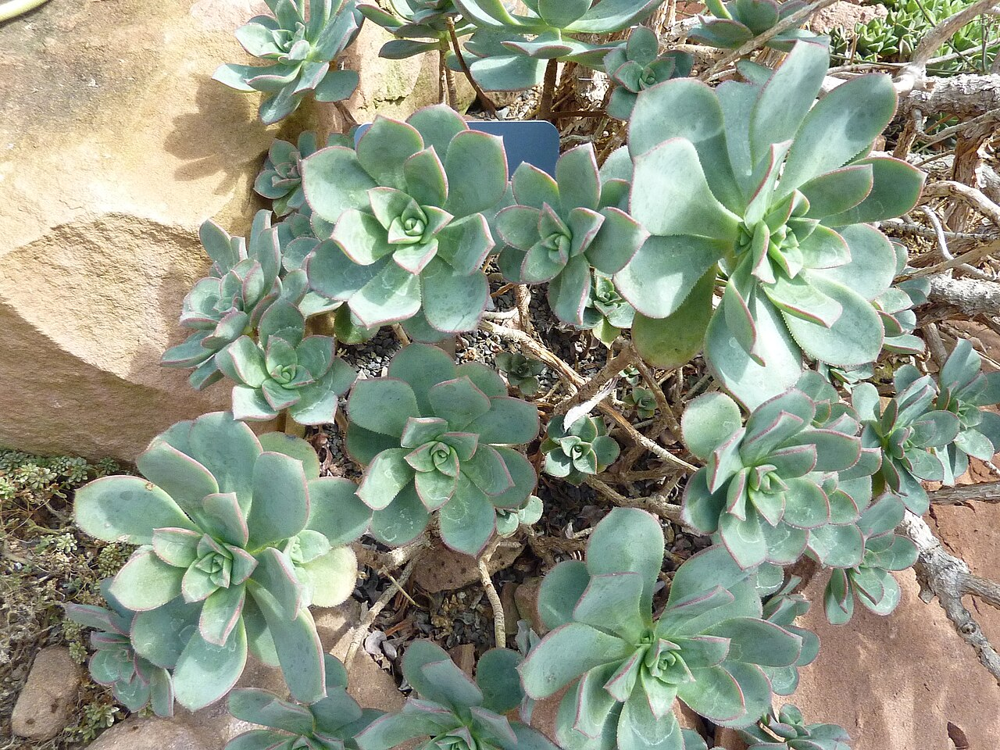
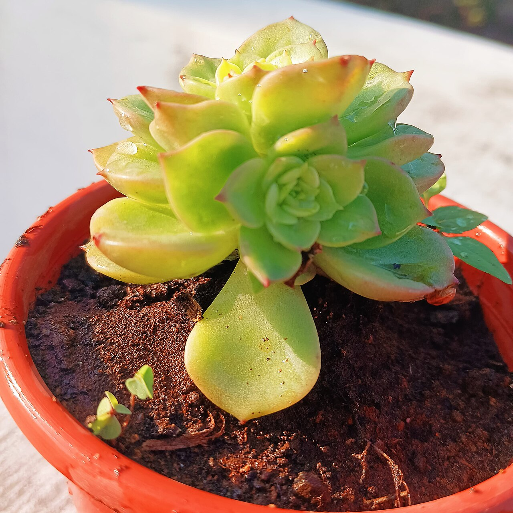

# Kiwi aeonium photo archive

_Aeonium haworthii Dream Color_ - Succulent-05

Collection label ID: `#4`.

Species-reference photographs may show the underlying species; the collection plant is the variegated cultivar Dream Color.

Collection research: [open the plant profile](../../../docs/plants/succulents/aeonium-haworthii-dream-color.md).

## Gallery

_habitat_ - [Aeonium haworthii Dream Color in habitat](https://www.inaturalist.org/observations/134526203); (c) Jenny Saito, some rights reserved (CC BY); [CC BY](https://creativecommons.org/licenses/by/4.0/).

_habitat_ - [Aeonium haworthii Dream Color in habitat](https://www.inaturalist.org/observations/208947488); (c) Heidi Meudt, some rights reserved (CC BY); [CC BY](https://creativecommons.org/licenses/by/4.0/).

_flower_ - [Aeonium haworthii 1w.jpg](https://commons.wikimedia.org/wiki/File:Aeonium_haworthii_1w.jpg); Consultaplantas; [CC BY-SA 4.0](https://creativecommons.org/licenses/by-sa/4.0).

_flower_ - [Aeonium haworthii 2w.jpg](https://commons.wikimedia.org/wiki/File:Aeonium_haworthii_2w.jpg); Consultaplantas; [CC BY-SA 4.0](https://creativecommons.org/licenses/by-sa/4.0).

_flower_ - [Aeonium haworthii 3w.jpg](https://commons.wikimedia.org/wiki/File:Aeonium_haworthii_3w.jpg); Consultaplantas; [CC BY-SA 4.0](https://creativecommons.org/licenses/by-sa/4.0).

_habit_ - [Aeonium haworthii.jpg](https://commons.wikimedia.org/wiki/File:Aeonium_haworthii.jpg); James Steakley; [CC BY-SA 3.0](https://creativecommons.org/licenses/by-sa/3.0).

_habit_ - [Image is Aeonium haworthii, also known as Haworth's aeonium or pinwheel..jpg](https://commons.wikimedia.org/wiki/File:Image_is_Aeonium_haworthii,_also_known_as_Haworth%27s_aeonium_or_pinwheel..jpg); Jothisettu; [CC0](https://creativecommons.org/publicdomain/zero/1.0/deed.en).

## File details

| File                                                                                         | Subject | Source                                                                                                                                      | Creator                                       | License                                                          |
| -------------------------------------------------------------------------------------------- | ------- | ------------------------------------------------------------------------------------------------------------------------------------------- | --------------------------------------------- | ---------------------------------------------------------------- |
| [inaturalist-134526203-229317594-habitat.jpg](./inaturalist-134526203-229317594-habitat.jpg) | habitat | [iNaturalist](https://www.inaturalist.org/observations/134526203)                                                                           | (c) Jenny Saito, some rights reserved (CC BY) | [CC BY](https://creativecommons.org/licenses/by/4.0/)            |
| [inaturalist-208947488-369734471-habitat.jpg](./inaturalist-208947488-369734471-habitat.jpg) | habitat | [iNaturalist](https://www.inaturalist.org/observations/208947488)                                                                           | (c) Heidi Meudt, some rights reserved (CC BY) | [CC BY](https://creativecommons.org/licenses/by/4.0/)            |
| [commons-106239426-habit.jpg](./commons-106239426-habit.jpg)                                 | flower  | [Wikimedia Commons](https://commons.wikimedia.org/wiki/File:Aeonium_haworthii_1w.jpg)                                                       | Consultaplantas                               | [CC BY-SA 4.0](https://creativecommons.org/licenses/by-sa/4.0)   |
| [commons-106239427-habit.jpg](./commons-106239427-habit.jpg)                                 | flower  | [Wikimedia Commons](https://commons.wikimedia.org/wiki/File:Aeonium_haworthii_2w.jpg)                                                       | Consultaplantas                               | [CC BY-SA 4.0](https://creativecommons.org/licenses/by-sa/4.0)   |
| [commons-106239428-habit.jpg](./commons-106239428-habit.jpg)                                 | flower  | [Wikimedia Commons](https://commons.wikimedia.org/wiki/File:Aeonium_haworthii_3w.jpg)                                                       | Consultaplantas                               | [CC BY-SA 4.0](https://creativecommons.org/licenses/by-sa/4.0)   |
| [commons-12119169-habit.jpg](./commons-12119169-habit.jpg)                                   | habit   | [Wikimedia Commons](https://commons.wikimedia.org/wiki/File:Aeonium_haworthii.jpg)                                                          | James Steakley                                | [CC BY-SA 3.0](https://creativecommons.org/licenses/by-sa/3.0)   |
| [commons-177386570-flower.jpg](./commons-177386570-flower.jpg)                               | habit   | [Wikimedia Commons](https://commons.wikimedia.org/wiki/File:Image_is_Aeonium_haworthii,_also_known_as_Haworth%27s_aeonium_or_pinwheel..jpg) | Jothisettu                                    | [CC0](https://creativecommons.org/publicdomain/zero/1.0/deed.en) |

Metadata and SHA-256 hashes are also available in [the global manifest](../photo-manifest.json).
