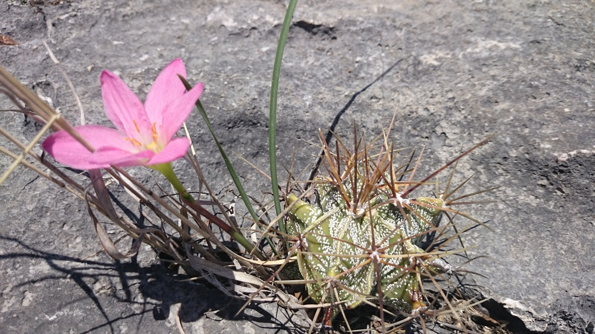
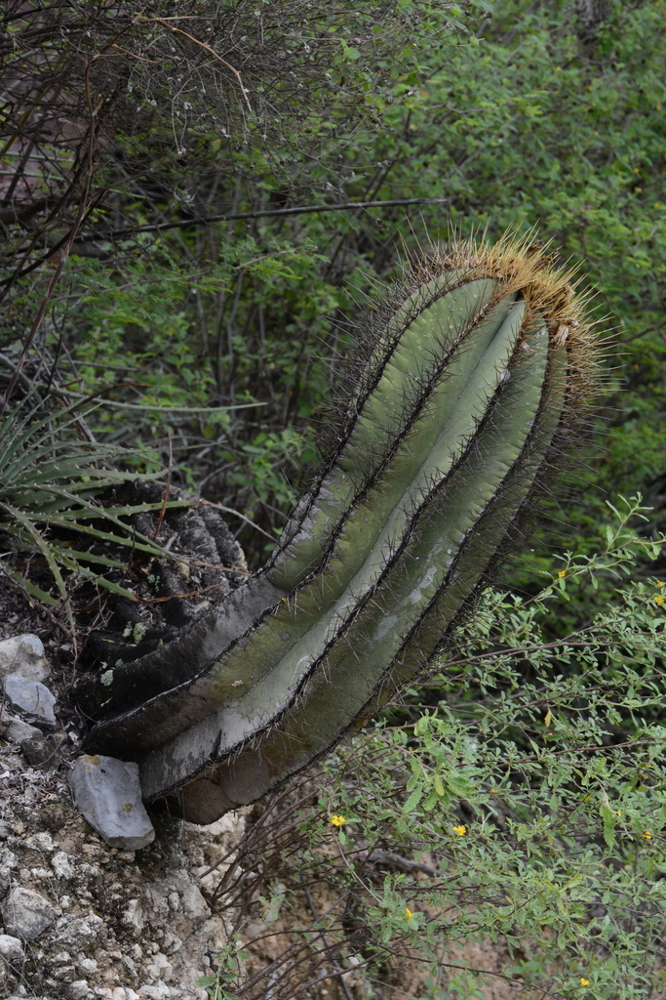
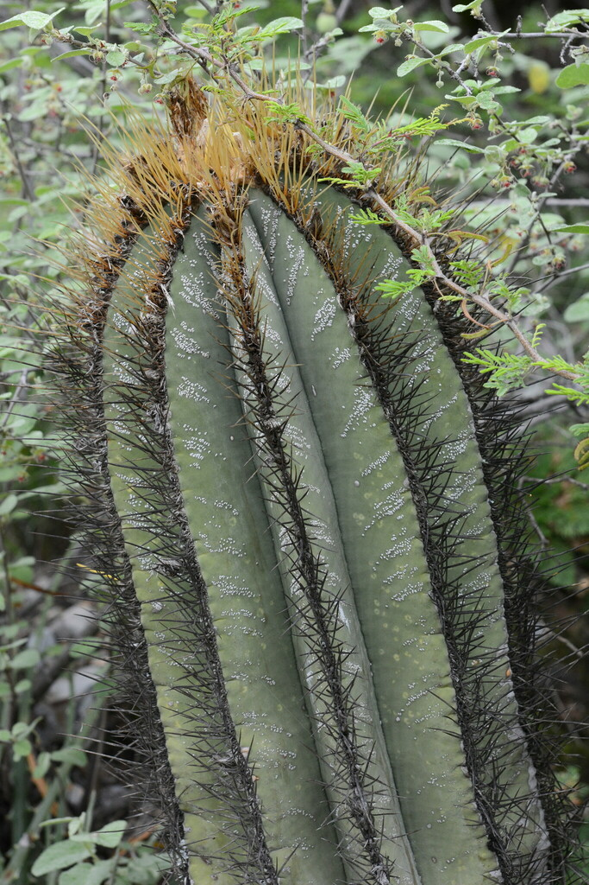
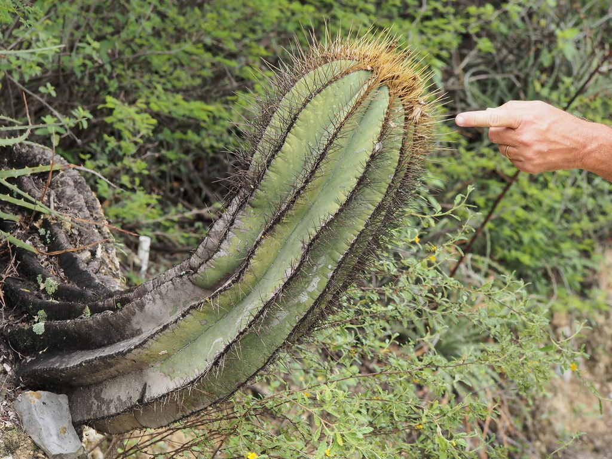
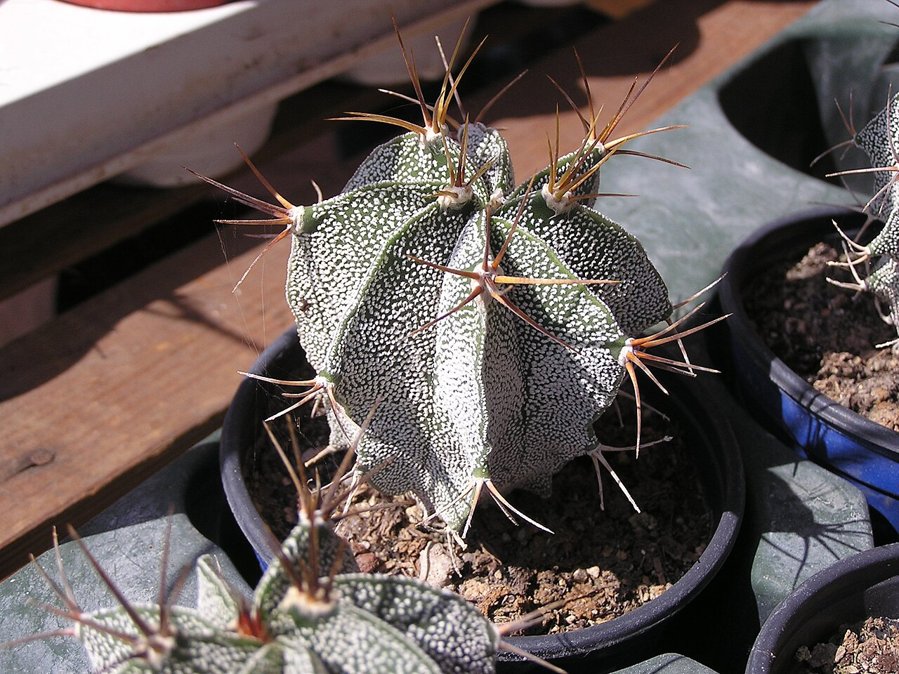
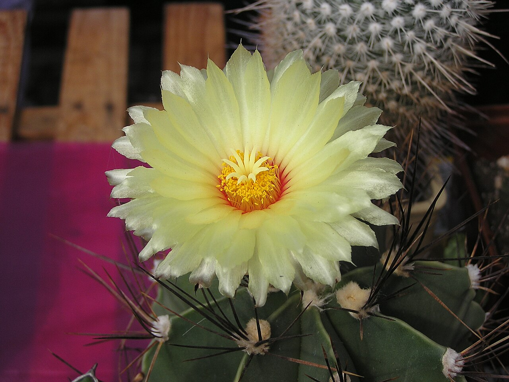
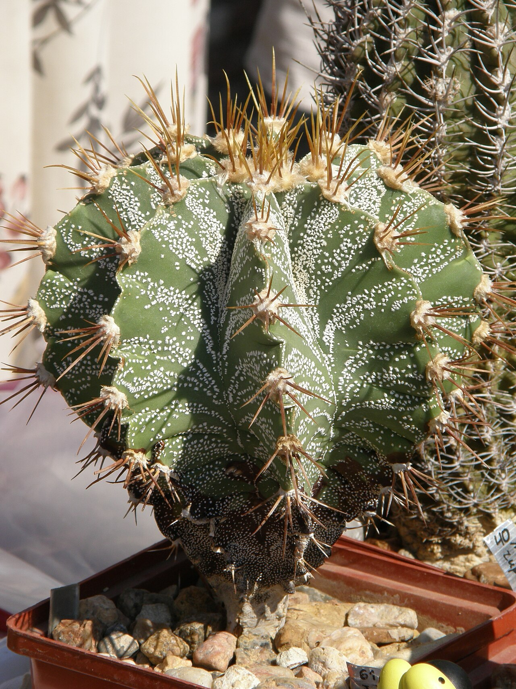
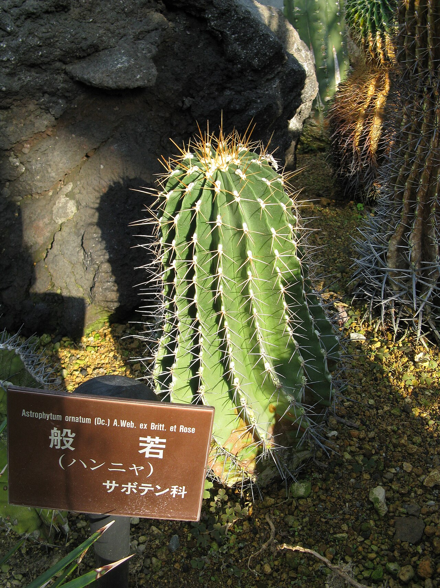
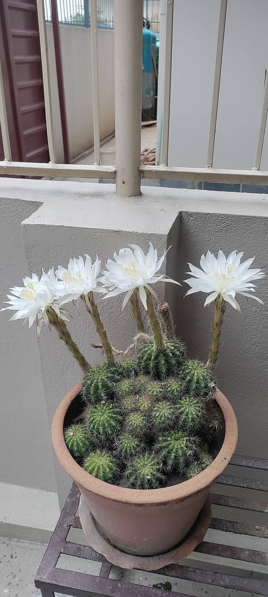
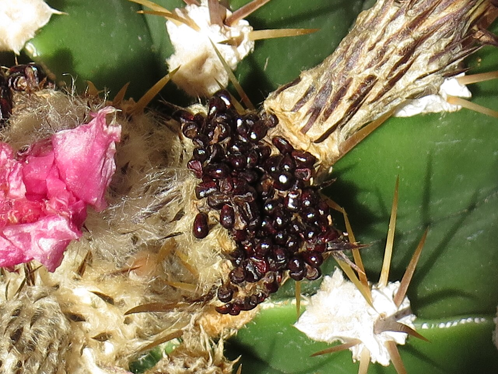

# Monk's hood cactus photo archive

_Astrophytum ornatum_ - Starter-12

Collection label ID: `C3`.

Species-reference photographs.

Collection research: [open the plant profile](../../../docs/plants/starter/astrophytum-ornatum.md).

## Gallery

_habitat_ - [Astrophytum ornatum in habitat](https://www.inaturalist.org/observations/1457100); (c) Sandino Guerrero, some rights reserved (CC BY); [CC BY](https://creativecommons.org/licenses/by/4.0/).

_habitat_ - [Astrophytum ornatum in habitat](https://www.inaturalist.org/observations/228290415); (c) Rosario Douglas, some rights reserved (CC BY); [CC BY](https://creativecommons.org/licenses/by/4.0/).

_habitat_ - [Astrophytum ornatum in habitat](https://www.inaturalist.org/observations/228315928); (c) Rosario Douglas, some rights reserved (CC BY); [CC BY](https://creativecommons.org/licenses/by/4.0/).

_habitat_ - [Astrophytum ornatum in habitat](https://www.inaturalist.org/observations/228318115); (c) Rosario Douglas, some rights reserved (CC BY); [CC BY](https://creativecommons.org/licenses/by/4.0/).

_habit_ - [2010. Выставка цветов в Донецке на день города 01.jpg](https://commons.wikimedia.org/wiki/File:2010._%D0%92%D1%8B%D1%81%D1%82%D0%B0%D0%B2%D0%BA%D0%B0_%D1%86%D0%B2%D0%B5%D1%82%D0%BE%D0%B2_%D0%B2_%D0%94%D0%BE%D0%BD%D0%B5%D1%86%D0%BA%D0%B5_%D0%BD%D0%B0_%D0%B4%D0%B5%D0%BD%D1%8C_%D0%B3%D0%BE%D1%80%D0%BE%D0%B4%D0%B0_01.jpg); Andrey Butko; [CC BY-SA 3.0](https://creativecommons.org/licenses/by-sa/3.0).

_habit_ - [2010. Выставка цветов в Донецке на день города 49.jpg](https://commons.wikimedia.org/wiki/File:2010._%D0%92%D1%8B%D1%81%D1%82%D0%B0%D0%B2%D0%BA%D0%B0_%D1%86%D0%B2%D0%B5%D1%82%D0%BE%D0%B2_%D0%B2_%D0%94%D0%BE%D0%BD%D0%B5%D1%86%D0%BA%D0%B5_%D0%BD%D0%B0_%D0%B4%D0%B5%D0%BD%D1%8C_%D0%B3%D0%BE%D1%80%D0%BE%D0%B4%D0%B0_49.jpg); Andrey Butko; [CC BY-SA 3.0](https://creativecommons.org/licenses/by-sa/3.0).

_habit_ - [2010. Выставка цветов в Донецке на день города 70.jpg](https://commons.wikimedia.org/wiki/File:2010._%D0%92%D1%8B%D1%81%D1%82%D0%B0%D0%B2%D0%BA%D0%B0_%D1%86%D0%B2%D0%B5%D1%82%D0%BE%D0%B2_%D0%B2_%D0%94%D0%BE%D0%BD%D0%B5%D1%86%D0%BA%D0%B5_%D0%BD%D0%B0_%D0%B4%D0%B5%D0%BD%D1%8C_%D0%B3%D0%BE%D1%80%D0%BE%D0%B4%D0%B0_70.jpg); Andrey Butko; [CC BY-SA 3.0](https://creativecommons.org/licenses/by-sa/3.0).

_flower_ - [Astrophytum ornatum1.jpg](https://commons.wikimedia.org/wiki/File:Astrophytum_ornatum1.jpg); KENPEI; [CC BY 3.0](https://creativecommons.org/licenses/by/3.0).

_flower_ - [Cactus Flower 2.jpg](https://commons.wikimedia.org/wiki/File:Cactus_Flower_2.jpg); Janak Bhatta; [CC BY-SA 4.0](https://creativecommons.org/licenses/by-sa/4.0).

_fruit-seed_ - [Astrophytum ornatum seeds.jpg](https://commons.wikimedia.org/wiki/File:Astrophytum_ornatum_seeds.jpg); Petar43; [CC BY-SA 4.0](https://creativecommons.org/licenses/by-sa/4.0).

## File details

| File                                                                                         | Subject    | Source                                                                                                                                                                                                                                                                                       | Creator                                            | License                                                        |
| -------------------------------------------------------------------------------------------- | ---------- | -------------------------------------------------------------------------------------------------------------------------------------------------------------------------------------------------------------------------------------------------------------------------------------------- | -------------------------------------------------- | -------------------------------------------------------------- |
| [inaturalist-1457100-1806664-habitat.jpg](./inaturalist-1457100-1806664-habitat.jpg)         | habitat    | [iNaturalist](https://www.inaturalist.org/observations/1457100)                                                                                                                                                                                                                              | (c) Sandino Guerrero, some rights reserved (CC BY) | [CC BY](https://creativecommons.org/licenses/by/4.0/)          |
| [inaturalist-228290415-405090075-habitat.jpg](./inaturalist-228290415-405090075-habitat.jpg) | habitat    | [iNaturalist](https://www.inaturalist.org/observations/228290415)                                                                                                                                                                                                                            | (c) Rosario Douglas, some rights reserved (CC BY)  | [CC BY](https://creativecommons.org/licenses/by/4.0/)          |
| [inaturalist-228315928-405140077-habitat.jpg](./inaturalist-228315928-405140077-habitat.jpg) | habitat    | [iNaturalist](https://www.inaturalist.org/observations/228315928)                                                                                                                                                                                                                            | (c) Rosario Douglas, some rights reserved (CC BY)  | [CC BY](https://creativecommons.org/licenses/by/4.0/)          |
| [inaturalist-228318115-405143950-habitat.jpg](./inaturalist-228318115-405143950-habitat.jpg) | habitat    | [iNaturalist](https://www.inaturalist.org/observations/228318115)                                                                                                                                                                                                                            | (c) Rosario Douglas, some rights reserved (CC BY)  | [CC BY](https://creativecommons.org/licenses/by/4.0/)          |
| [commons-11493644-habit.jpg](./commons-11493644-habit.jpg)                                   | habit      | [Wikimedia Commons](https://commons.wikimedia.org/wiki/File:2010._%D0%92%D1%8B%D1%81%D1%82%D0%B0%D0%B2%D0%BA%D0%B0_%D1%86%D0%B2%D0%B5%D1%82%D0%BE%D0%B2_%D0%B2_%D0%94%D0%BE%D0%BD%D0%B5%D1%86%D0%BA%D0%B5_%D0%BD%D0%B0_%D0%B4%D0%B5%D0%BD%D1%8C_%D0%B3%D0%BE%D1%80%D0%BE%D0%B4%D0%B0_01.jpg) | Andrey Butko                                       | [CC BY-SA 3.0](https://creativecommons.org/licenses/by-sa/3.0) |
| [commons-11493810-habit.jpg](./commons-11493810-habit.jpg)                                   | habit      | [Wikimedia Commons](https://commons.wikimedia.org/wiki/File:2010._%D0%92%D1%8B%D1%81%D1%82%D0%B0%D0%B2%D0%BA%D0%B0_%D1%86%D0%B2%D0%B5%D1%82%D0%BE%D0%B2_%D0%B2_%D0%94%D0%BE%D0%BD%D0%B5%D1%86%D0%BA%D0%B5_%D0%BD%D0%B0_%D0%B4%D0%B5%D0%BD%D1%8C_%D0%B3%D0%BE%D1%80%D0%BE%D0%B4%D0%B0_49.jpg) | Andrey Butko                                       | [CC BY-SA 3.0](https://creativecommons.org/licenses/by-sa/3.0) |
| [commons-11493864-habit.jpg](./commons-11493864-habit.jpg)                                   | habit      | [Wikimedia Commons](https://commons.wikimedia.org/wiki/File:2010._%D0%92%D1%8B%D1%81%D1%82%D0%B0%D0%B2%D0%BA%D0%B0_%D1%86%D0%B2%D0%B5%D1%82%D0%BE%D0%B2_%D0%B2_%D0%94%D0%BE%D0%BD%D0%B5%D1%86%D0%BA%D0%B5_%D0%BD%D0%B0_%D0%B4%D0%B5%D0%BD%D1%8C_%D0%B3%D0%BE%D1%80%D0%BE%D0%B4%D0%B0_70.jpg) | Andrey Butko                                       | [CC BY-SA 3.0](https://creativecommons.org/licenses/by-sa/3.0) |
| [commons-12068750-flower.jpg](./commons-12068750-flower.jpg)                                 | flower     | [Wikimedia Commons](https://commons.wikimedia.org/wiki/File:Astrophytum_ornatum1.jpg)                                                                                                                                                                                                        | KENPEI                                             | [CC BY 3.0](https://creativecommons.org/licenses/by/3.0)       |
| [commons-132276155-flower.jpg](./commons-132276155-flower.jpg)                               | flower     | [Wikimedia Commons](https://commons.wikimedia.org/wiki/File:Cactus_Flower_2.jpg)                                                                                                                                                                                                             | Janak Bhatta                                       | [CC BY-SA 4.0](https://creativecommons.org/licenses/by-sa/4.0) |
| [commons-94123806-fruit-seed.jpg](./commons-94123806-fruit-seed.jpg)                         | fruit-seed | [Wikimedia Commons](https://commons.wikimedia.org/wiki/File:Astrophytum_ornatum_seeds.jpg)                                                                                                                                                                                                   | Petar43                                            | [CC BY-SA 4.0](https://creativecommons.org/licenses/by-sa/4.0) |

Metadata and SHA-256 hashes are also available in [the global manifest](../photo-manifest.json).
