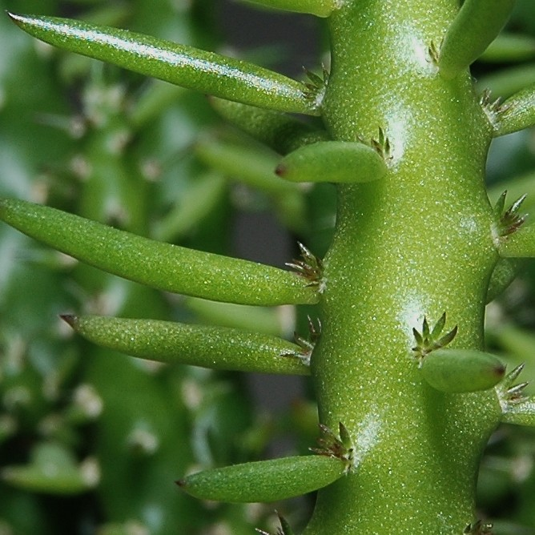
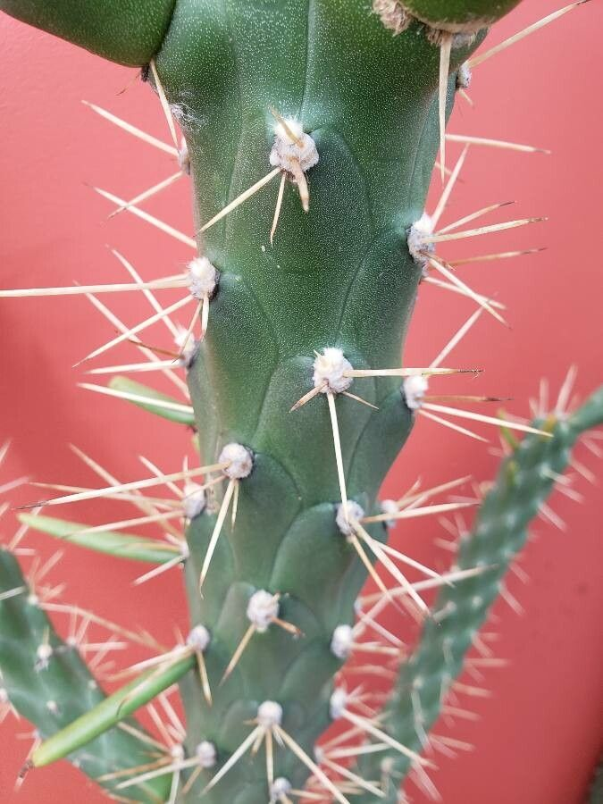
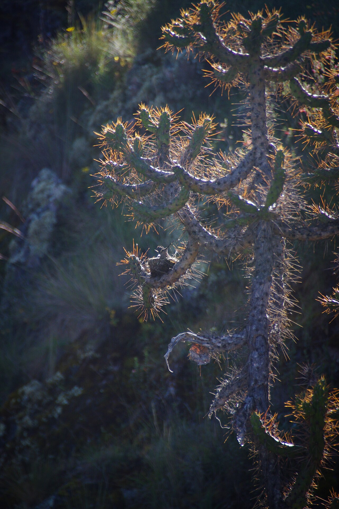
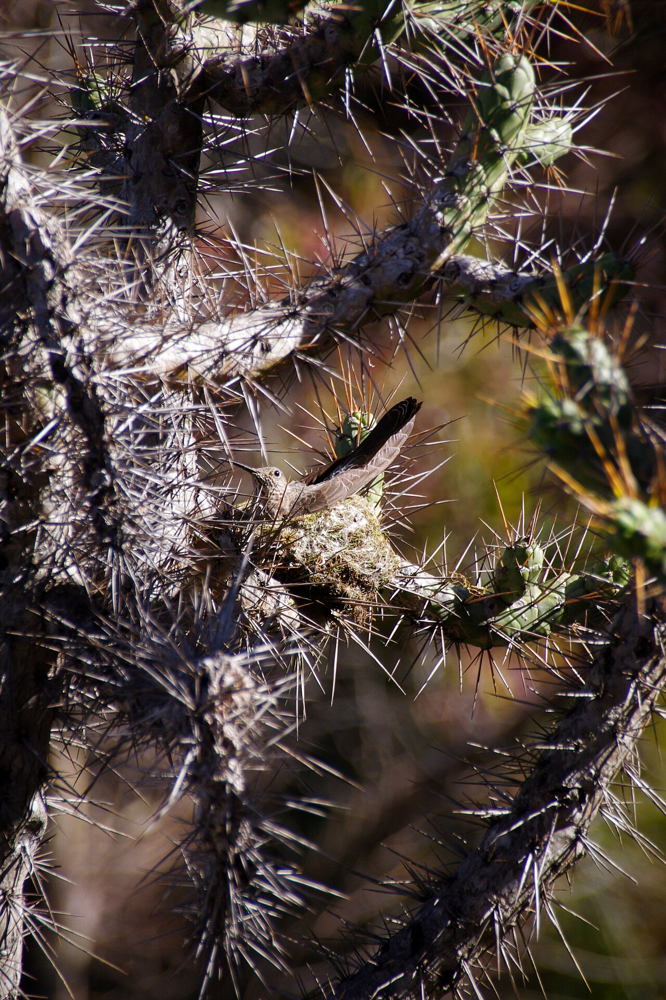
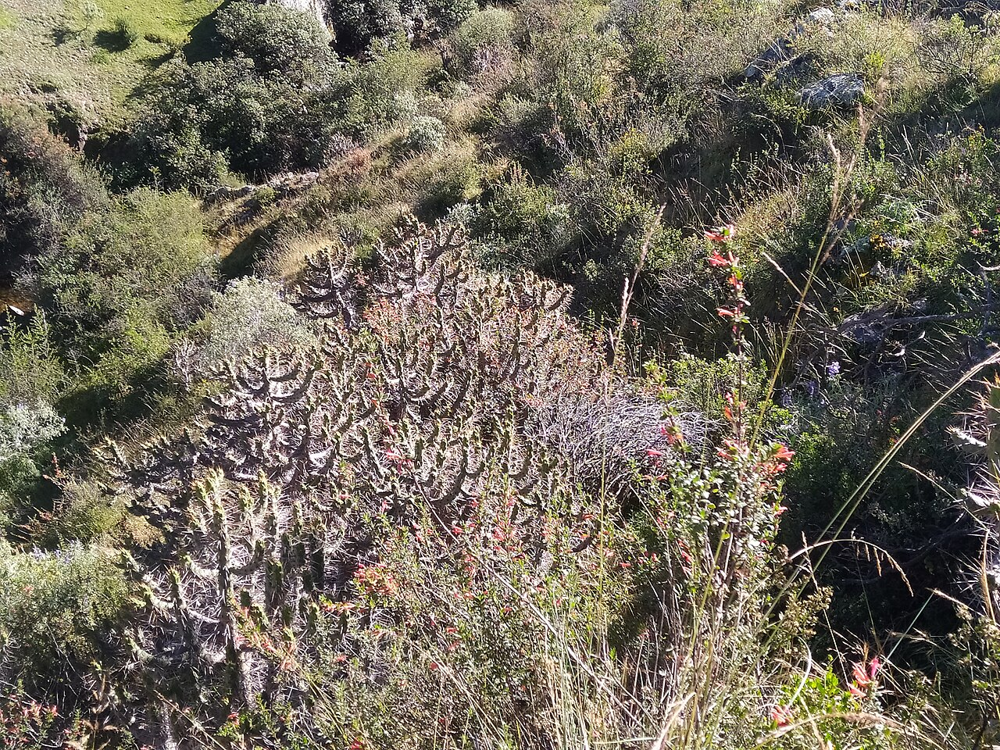
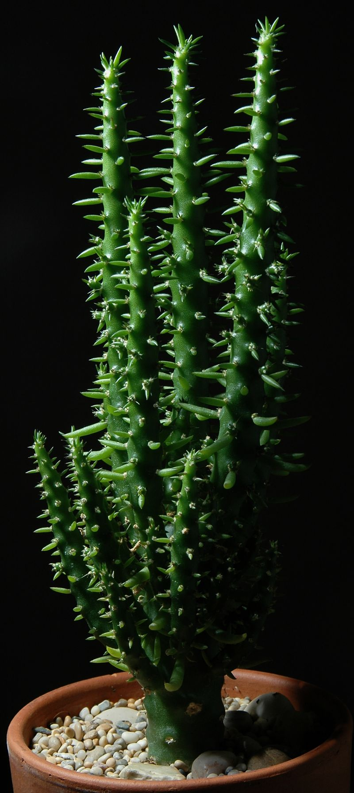

# Eve's needle cactus photo archive

_Austrocylindropuntia subulata_ - Cactus-07

Collection label ID: `H3`. Tracker ID: `P26`.

Species-reference photographs. The collection plant was received and
owner-inspected on 2026-08-28; these licensed images do not document its arrival
condition, individual form, or exact identity.

Collection research: [open the plant profile](../../../docs/plants/cacti/austrocylindropuntia-subulata.md).

## Gallery

_habit_ - [Austrocylindropuntia subulata1000.jpg](https://commons.wikimedia.org/wiki/File:Austrocylindropuntia_subulata1000.jpg); Christer Johansson; [CC BY-SA 2.5](https://creativecommons.org/licenses/by-sa/2.5).

_detail_ - [Austrocylindropuntia subulata spines.jpg](https://commons.wikimedia.org/wiki/File:Austrocylindropuntia_subulata_spines.jpg); Willow Coville; [CC BY-SA 4.0](https://creativecommons.org/licenses/by-sa/4.0).

_habit_ - [Colibri en su nido.jpg](https://commons.wikimedia.org/wiki/File:Colibri_en_su_nido.jpg); Mael Martin; [CC BY-SA 4.0](https://creativecommons.org/licenses/by-sa/4.0).

_habit_ - [Colibri gigante empollando en su nido en un cactus.jpg](https://commons.wikimedia.org/wiki/File:Colibri_gigante_empollando_en_su_nido_en_un_cactus.jpg); Mael Martin; [CC BY-SA 4.0](https://creativecommons.org/licenses/by-sa/4.0).

_habit_ - [Austrocylindropuntia subulata en el distrito de Cajacay.jpg](https://commons.wikimedia.org/wiki/File:Austrocylindropuntia_subulata_en_el_distrito_de_Cajacay.jpg); Lidsay Brito; [CC BY-SA 4.0](https://creativecommons.org/licenses/by-sa/4.0).

_habit_ - [Cacti1004.jpg](https://commons.wikimedia.org/wiki/File:Cacti1004.jpg); Christer Johansson; [CC BY-SA 2.5](https://creativecommons.org/licenses/by-sa/2.5).

## File details

| File                                                           | Subject | Source                                                                                                                   | Creator            | License                                                        |
| -------------------------------------------------------------- | ------- | ------------------------------------------------------------------------------------------------------------------------ | ------------------ | -------------------------------------------------------------- |
| [commons-1029664-habit.jpg](./commons-1029664-habit.jpg)       | habit   | [Wikimedia Commons](https://commons.wikimedia.org/wiki/File:Austrocylindropuntia_subulata1000.jpg)                       | Christer Johansson | [CC BY-SA 2.5](https://creativecommons.org/licenses/by-sa/2.5) |
| [commons-115942016-detail.jpg](./commons-115942016-detail.jpg) | detail  | [Wikimedia Commons](https://commons.wikimedia.org/wiki/File:Austrocylindropuntia_subulata_spines.jpg)                    | Willow Coville     | [CC BY-SA 4.0](https://creativecommons.org/licenses/by-sa/4.0) |
| [commons-118100070-habit.jpg](./commons-118100070-habit.jpg)   | habit   | [Wikimedia Commons](https://commons.wikimedia.org/wiki/File:Colibri_en_su_nido.jpg)                                      | Mael Martin        | [CC BY-SA 4.0](https://creativecommons.org/licenses/by-sa/4.0) |
| [commons-118100071-habit.jpg](./commons-118100071-habit.jpg)   | habit   | [Wikimedia Commons](https://commons.wikimedia.org/wiki/File:Colibri_gigante_empollando_en_su_nido_en_un_cactus.jpg)      | Mael Martin        | [CC BY-SA 4.0](https://creativecommons.org/licenses/by-sa/4.0) |
| [commons-118625826-habit.jpg](./commons-118625826-habit.jpg)   | habit   | [Wikimedia Commons](https://commons.wikimedia.org/wiki/File:Austrocylindropuntia_subulata_en_el_distrito_de_Cajacay.jpg) | Lidsay Brito       | [CC BY-SA 4.0](https://creativecommons.org/licenses/by-sa/4.0) |
| [commons-1280415-habit.jpg](./commons-1280415-habit.jpg)       | habit   | [Wikimedia Commons](https://commons.wikimedia.org/wiki/File:Cacti1004.jpg)                                               | Christer Johansson | [CC BY-SA 2.5](https://creativecommons.org/licenses/by-sa/2.5) |

Metadata and SHA-256 hashes are also available in [the global manifest](../photo-manifest.json).
