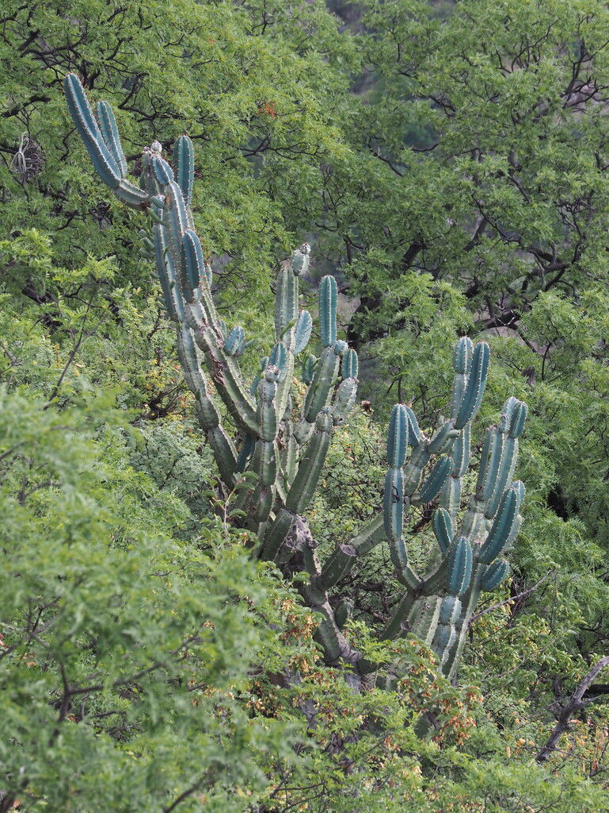
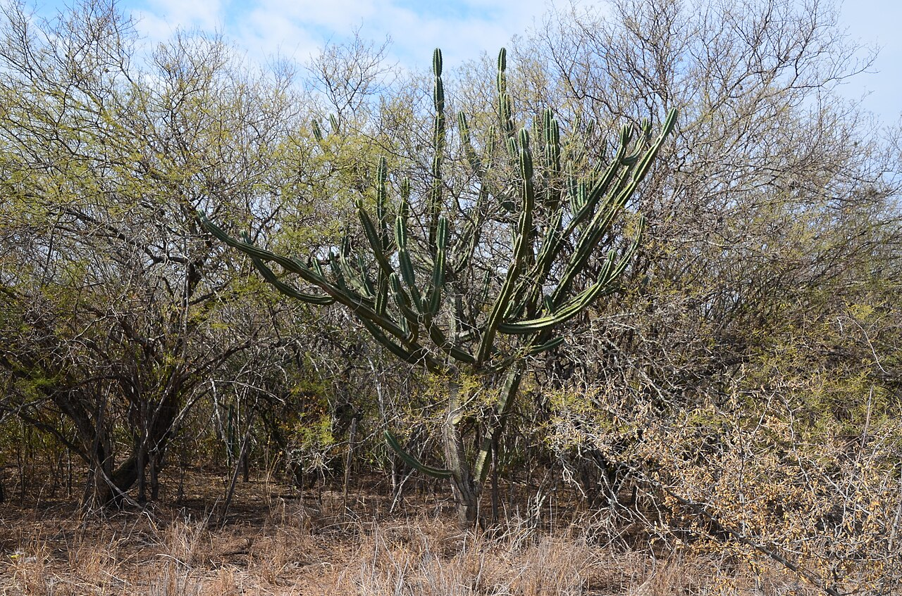
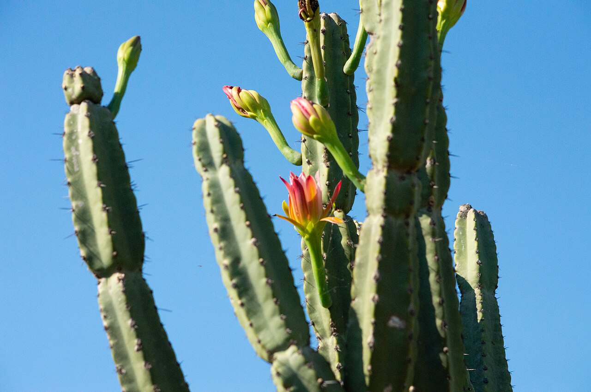
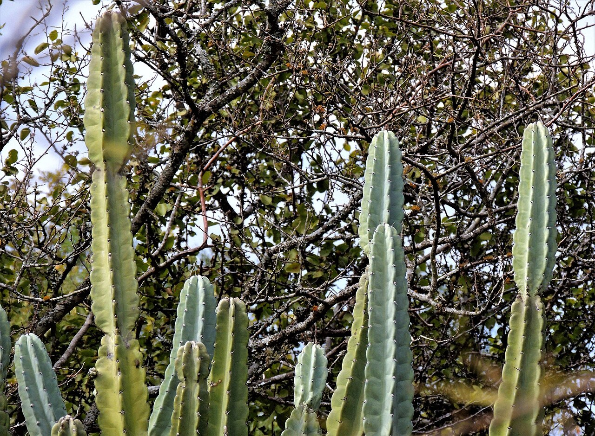

# Ming Thing photo archive

_Cereus forbesii_ - Starter-10

Collection label ID: `D3`.

The archive mixes normal species references with any reusable Ming Thing images found; the collection plant is the monstrose cultivar.

Collection research: [open the plant profile](../../../docs/plants/starter/cereus-forbesii-ming-thing.md).

## Gallery

_habitat_ - [Cereus forbesii in habitat](https://www.inaturalist.org/observations/260769278); (c) Tomás Carranza Perales, some rights reserved (CC BY); [CC BY](https://creativecommons.org/licenses/by/4.0/).

_habitat_ - [Cereus forbesii in habitat](https://www.inaturalist.org/observations/338005617); (c) Rosario Douglas, some rights reserved (CC BY); [CC BY](https://creativecommons.org/licenses/by/4.0/).

_habitat_ - [Cereus forbesii in habitat](https://www.inaturalist.org/observations/341810210); (c) Rosario Douglas, some rights reserved (CC BY); [CC BY](https://creativecommons.org/licenses/by/4.0/).

_habit_ - [Cereus forbesii 1.jpg](https://commons.wikimedia.org/wiki/File:Cereus_forbesii_1.jpg); Hugo Hulsberg; [CC0](http://creativecommons.org/publicdomain/zero/1.0/deed.en).

_habit_ - [Cereus forbesii 2.jpg](https://commons.wikimedia.org/wiki/File:Cereus_forbesii_2.jpg); Tomás Carranza Perales; [CC BY 4.0](https://creativecommons.org/licenses/by/4.0).

_habit_ - [Cereus forbesii 3.jpg](https://commons.wikimedia.org/wiki/File:Cereus_forbesii_3.jpg); Étienne Lacroix-Carignan; [CC0](http://creativecommons.org/publicdomain/zero/1.0/deed.en).

_habit_ - [Cereus forbesii 4.jpg](https://commons.wikimedia.org/wiki/File:Cereus_forbesii_4.jpg); aacocucci; [CC BY 4.0](https://creativecommons.org/licenses/by/4.0).

_habit_ - [Cereus forbesii 6.jpg](https://commons.wikimedia.org/wiki/File:Cereus_forbesii_6.jpg); Lauu; [CC BY 4.0](https://creativecommons.org/licenses/by/4.0).

_flower_ - [Cereus forbesii 7.jpg](https://commons.wikimedia.org/wiki/File:Cereus_forbesii_7.jpg); Jose Luis Navarro; [CC BY 4.0](https://creativecommons.org/licenses/by/4.0).

_habit_ - [Cereus forbesii 8.jpg](https://commons.wikimedia.org/wiki/File:Cereus_forbesii_8.jpg); Hugo Hulsberg; [CC0](http://creativecommons.org/publicdomain/zero/1.0/deed.en).

## File details

| File                                                                                         | Subject | Source                                                                             | Creator                                                  | License                                                         |
| -------------------------------------------------------------------------------------------- | ------- | ---------------------------------------------------------------------------------- | -------------------------------------------------------- | --------------------------------------------------------------- |
| [inaturalist-260769278-468355463-habitat.jpg](./inaturalist-260769278-468355463-habitat.jpg) | habitat | [iNaturalist](https://www.inaturalist.org/observations/260769278)                  | (c) Tomás Carranza Perales, some rights reserved (CC BY) | [CC BY](https://creativecommons.org/licenses/by/4.0/)           |
| [inaturalist-338005617-614583778-habitat.jpg](./inaturalist-338005617-614583778-habitat.jpg) | habitat | [iNaturalist](https://www.inaturalist.org/observations/338005617)                  | (c) Rosario Douglas, some rights reserved (CC BY)        | [CC BY](https://creativecommons.org/licenses/by/4.0/)           |
| [inaturalist-341810210-622325898-habitat.jpg](./inaturalist-341810210-622325898-habitat.jpg) | habitat | [iNaturalist](https://www.inaturalist.org/observations/341810210)                  | (c) Rosario Douglas, some rights reserved (CC BY)        | [CC BY](https://creativecommons.org/licenses/by/4.0/)           |
| [commons-165026891-habit.jpg](./commons-165026891-habit.jpg)                                 | habit   | [Wikimedia Commons](https://commons.wikimedia.org/wiki/File:Cereus_forbesii_1.jpg) | Hugo Hulsberg                                            | [CC0](http://creativecommons.org/publicdomain/zero/1.0/deed.en) |
| [commons-165026913-habit.jpg](./commons-165026913-habit.jpg)                                 | habit   | [Wikimedia Commons](https://commons.wikimedia.org/wiki/File:Cereus_forbesii_2.jpg) | Tomás Carranza Perales                                   | [CC BY 4.0](https://creativecommons.org/licenses/by/4.0)        |
| [commons-165026921-habit.jpg](./commons-165026921-habit.jpg)                                 | habit   | [Wikimedia Commons](https://commons.wikimedia.org/wiki/File:Cereus_forbesii_3.jpg) | Étienne Lacroix-Carignan                                 | [CC0](http://creativecommons.org/publicdomain/zero/1.0/deed.en) |
| [commons-165026948-habit.jpg](./commons-165026948-habit.jpg)                                 | habit   | [Wikimedia Commons](https://commons.wikimedia.org/wiki/File:Cereus_forbesii_4.jpg) | aacocucci                                                | [CC BY 4.0](https://creativecommons.org/licenses/by/4.0)        |
| [commons-171229062-habit.jpg](./commons-171229062-habit.jpg)                                 | habit   | [Wikimedia Commons](https://commons.wikimedia.org/wiki/File:Cereus_forbesii_6.jpg) | Lauu                                                     | [CC BY 4.0](https://creativecommons.org/licenses/by/4.0)        |
| [commons-171229085-habit.jpg](./commons-171229085-habit.jpg)                                 | flower  | [Wikimedia Commons](https://commons.wikimedia.org/wiki/File:Cereus_forbesii_7.jpg) | Jose Luis Navarro                                        | [CC BY 4.0](https://creativecommons.org/licenses/by/4.0)        |
| [commons-171229098-habit.jpg](./commons-171229098-habit.jpg)                                 | habit   | [Wikimedia Commons](https://commons.wikimedia.org/wiki/File:Cereus_forbesii_8.jpg) | Hugo Hulsberg                                            | [CC0](http://creativecommons.org/publicdomain/zero/1.0/deed.en) |

Metadata and SHA-256 hashes are also available in [the global manifest](../photo-manifest.json).
