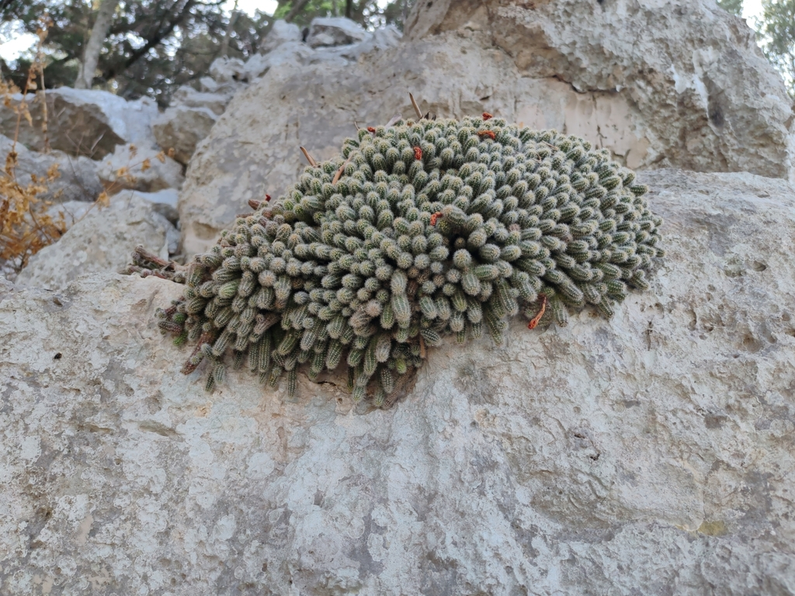
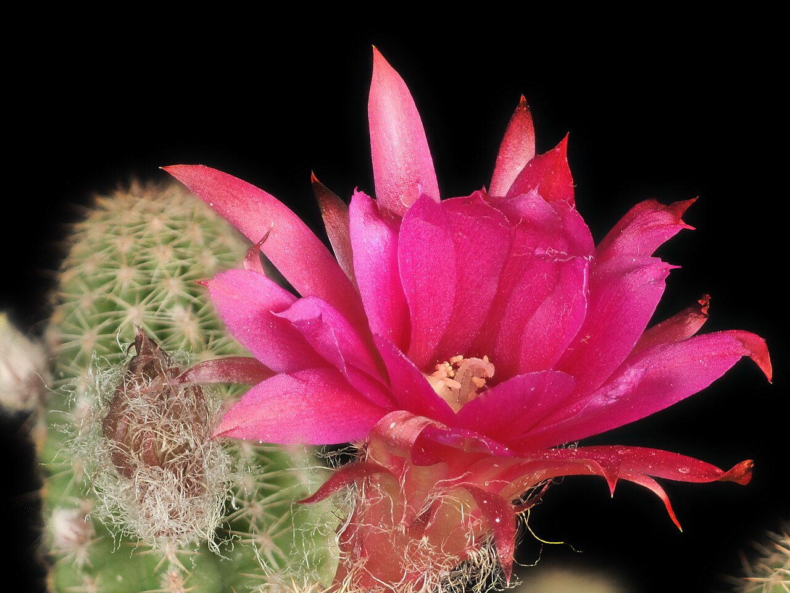
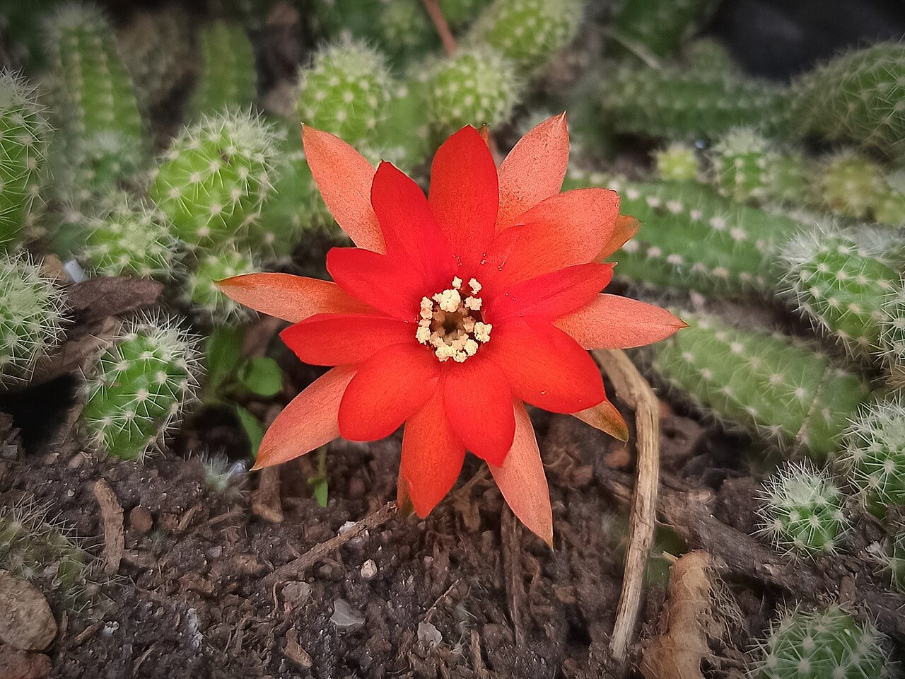
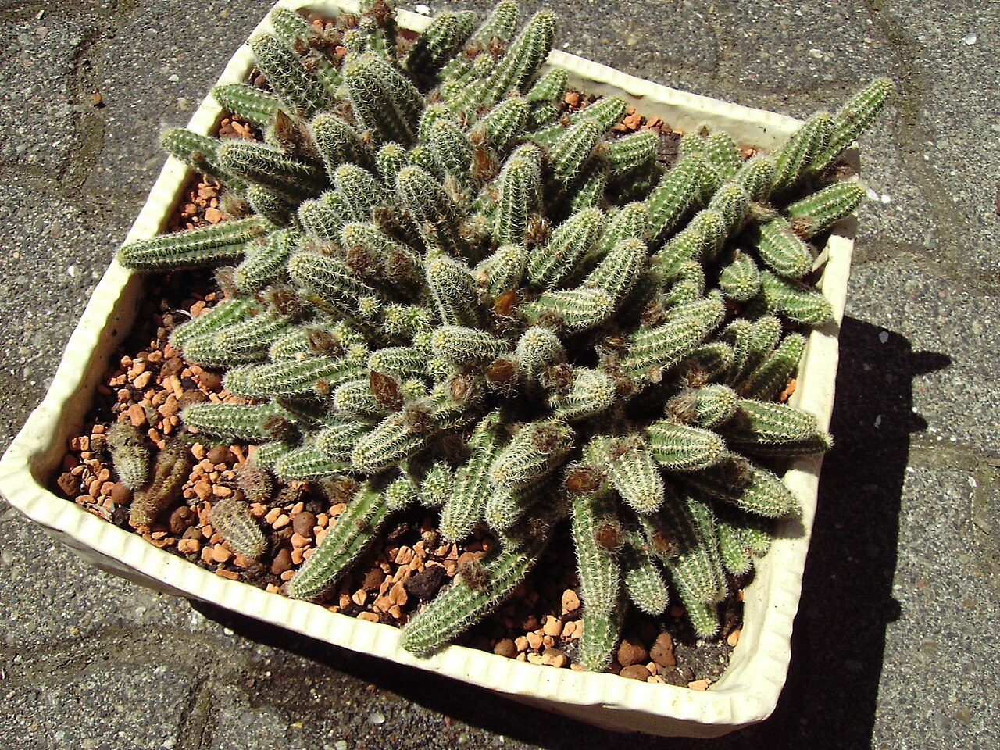
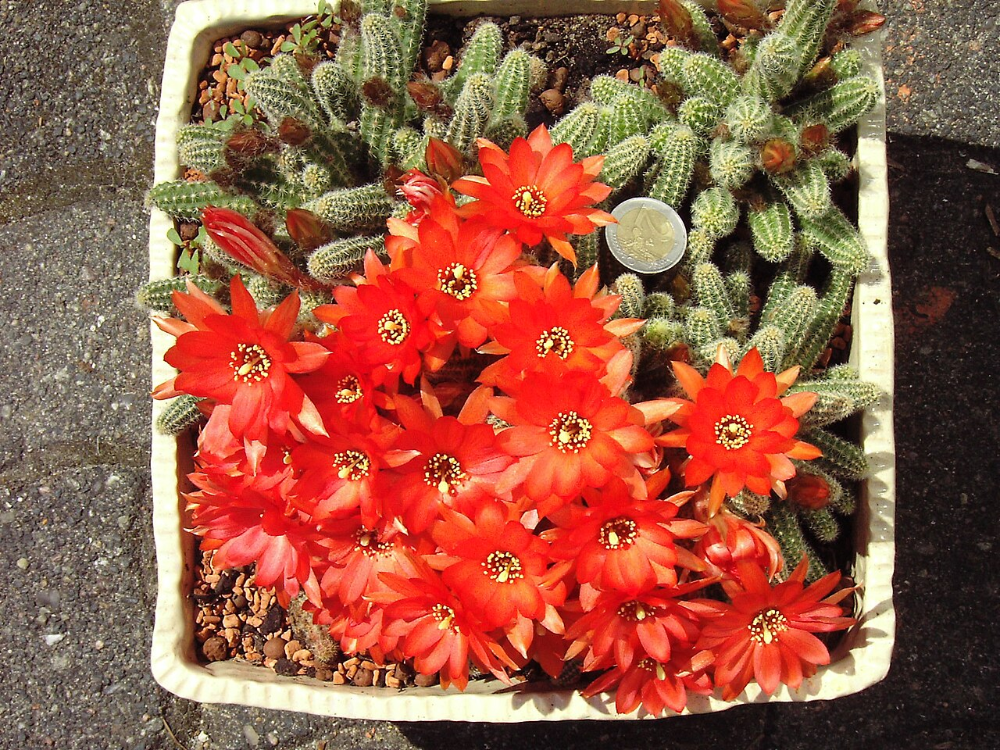
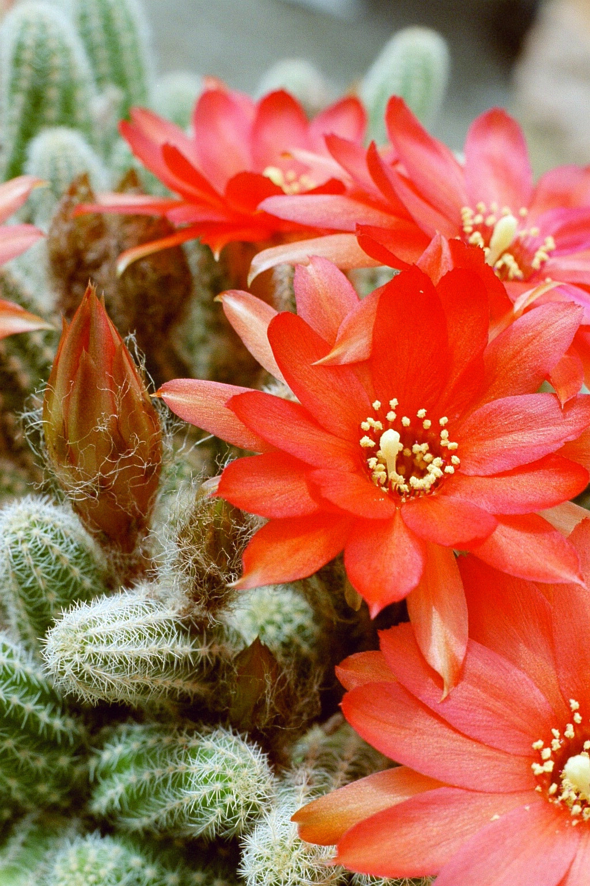
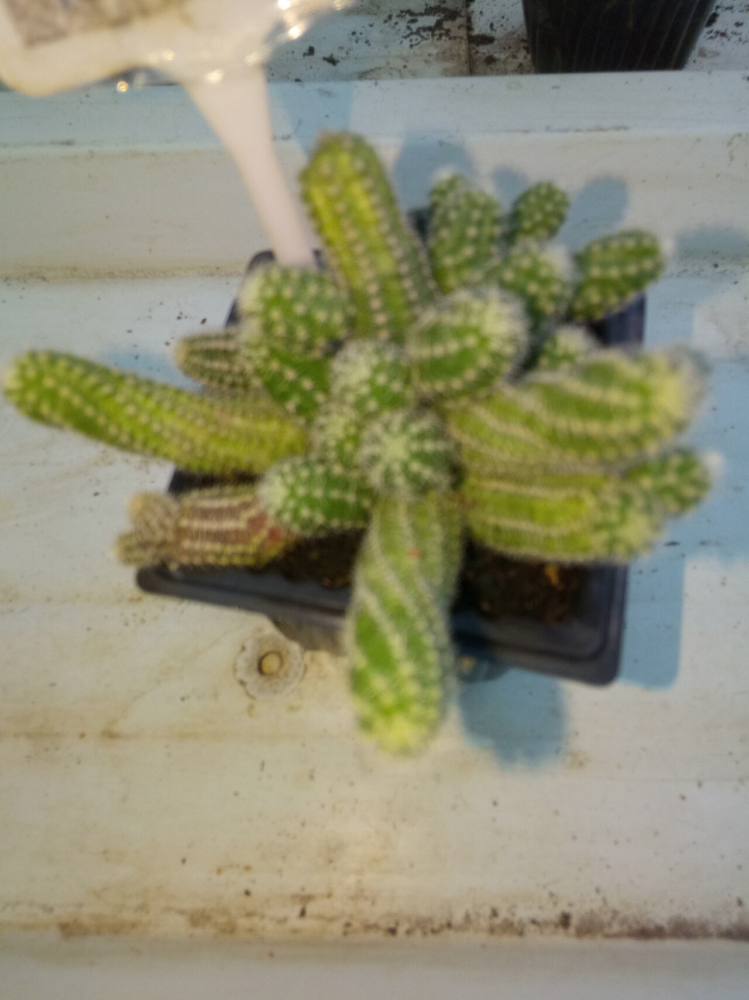
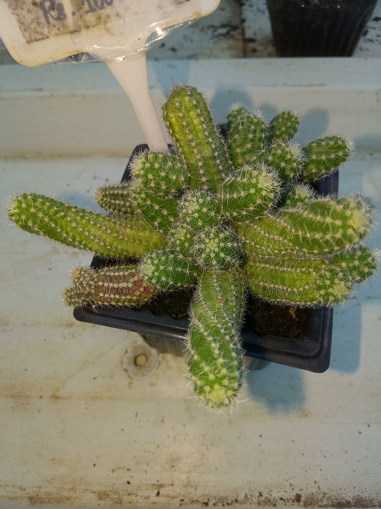

# Chamaelobivia / peanut cactus hybrid photo archive

_Echinopsis hybrid, Chamaelobivia Group_ - Cactus-02

Collection label ID: `E2`.

Peanut-cactus ancestry reference photographs; the collection plant is a horticultural hybrid with no known wild range or cultivar name.

Collection research: [open the plant profile](../../../docs/plants/cacti/chamaelobivia-hybrid.md).

## Gallery

_habitat_ - [Echinopsis hybrid, Chamaelobivia Group in habitat](https://www.inaturalist.org/observations/300146696); (c) Ljaž, some rights reserved (CC BY); [CC BY](https://creativecommons.org/licenses/by/4.0/).

_flower_ - [2015-04-04-16.15.31 ZS PMax Echinopsis chamaecereus-1 (17030412636).jpg](<https://commons.wikimedia.org/wiki/File:2015-04-04-16.15.31_ZS_PMax_Echinopsis_chamaecereus-1_(17030412636).jpg>); John Rusk from Berkeley, CA, United States of America; [CC BY 2.0](https://creativecommons.org/licenses/by/2.0).

_flower_ - [Flor de Echinopsis chamaecereus.jpg](https://commons.wikimedia.org/wiki/File:Flor_de_Echinopsis_chamaecereus.jpg); Juan Carlos Fonseca Mata; [CC BY-SA 4.0](https://creativecommons.org/licenses/by-sa/4.0).

_habit_ - [Echinopsis chamaecereus.2006-06-01.1.uellue.jpg](https://commons.wikimedia.org/wiki/File:Echinopsis_chamaecereus.2006-06-01.1.uellue.jpg); Dieter Weber ( User:Uellue ); [CC BY-SA 3.0](https://creativecommons.org/licenses/by-sa/3.0/).

_flower_ - [Echinopsis chamaecereus.2006-06-09.1.uellue.jpg](https://commons.wikimedia.org/wiki/File:Echinopsis_chamaecereus.2006-06-09.1.uellue.jpg); Dieter Weber ( User:Uellue ); [CC BY-SA 3.0](https://creativecommons.org/licenses/by-sa/3.0/).

_flower_ - [Echinopsis chamaecereus.2006-06-09.2.uellue.jpg](https://commons.wikimedia.org/wiki/File:Echinopsis_chamaecereus.2006-06-09.2.uellue.jpg); Dieter Weber ( User:Uellue ); [CC BY-SA 3.0](https://creativecommons.org/licenses/by-sa/3.0/).

_habit_ - [Echilopsis chomaecereus-2-sunny brook-yercaud-salem-India.jpg](https://commons.wikimedia.org/wiki/File:Echilopsis_chomaecereus-2-sunny_brook-yercaud-salem-India.jpg); Yercaud-elango; [CC BY-SA 4.0](https://creativecommons.org/licenses/by-sa/4.0).

_habit_ - [Echilopsis chomaecereus-1-sunny brook-yercaud-salem-India.jpg](https://commons.wikimedia.org/wiki/File:Echilopsis_chomaecereus-1-sunny_brook-yercaud-salem-India.jpg); Yercaud-elango; [CC BY-SA 4.0](https://creativecommons.org/licenses/by-sa/4.0).

## File details

| File                                                                                         | Subject | Source                                                                                                                                 | Creator                                               | License                                                         |
| -------------------------------------------------------------------------------------------- | ------- | -------------------------------------------------------------------------------------------------------------------------------------- | ----------------------------------------------------- | --------------------------------------------------------------- |
| [inaturalist-300146696-540776088-habitat.jpg](./inaturalist-300146696-540776088-habitat.jpg) | habitat | [iNaturalist](https://www.inaturalist.org/observations/300146696)                                                                      | (c) Ljaž, some rights reserved (CC BY)                | [CC BY](https://creativecommons.org/licenses/by/4.0/)           |
| [commons-104860800-flower.jpg](./commons-104860800-flower.jpg)                               | flower  | [Wikimedia Commons](<https://commons.wikimedia.org/wiki/File:2015-04-04-16.15.31_ZS_PMax_Echinopsis_chamaecereus-1_(17030412636).jpg>) | John Rusk from Berkeley, CA, United States of America | [CC BY 2.0](https://creativecommons.org/licenses/by/2.0)        |
| [commons-105123675-flower.jpg](./commons-105123675-flower.jpg)                               | flower  | [Wikimedia Commons](https://commons.wikimedia.org/wiki/File:Flor_de_Echinopsis_chamaecereus.jpg)                                       | Juan Carlos Fonseca Mata                              | [CC BY-SA 4.0](https://creativecommons.org/licenses/by-sa/4.0)  |
| [commons-1125335-habit.jpg](./commons-1125335-habit.jpg)                                     | habit   | [Wikimedia Commons](https://commons.wikimedia.org/wiki/File:Echinopsis_chamaecereus.2006-06-01.1.uellue.jpg)                           | Dieter Weber ( User:Uellue )                          | [CC BY-SA 3.0](https://creativecommons.org/licenses/by-sa/3.0/) |
| [commons-1125352-habit.jpg](./commons-1125352-habit.jpg)                                     | flower  | [Wikimedia Commons](https://commons.wikimedia.org/wiki/File:Echinopsis_chamaecereus.2006-06-09.1.uellue.jpg)                           | Dieter Weber ( User:Uellue )                          | [CC BY-SA 3.0](https://creativecommons.org/licenses/by-sa/3.0/) |
| [commons-1125359-habit.jpg](./commons-1125359-habit.jpg)                                     | flower  | [Wikimedia Commons](https://commons.wikimedia.org/wiki/File:Echinopsis_chamaecereus.2006-06-09.2.uellue.jpg)                           | Dieter Weber ( User:Uellue )                          | [CC BY-SA 3.0](https://creativecommons.org/licenses/by-sa/3.0/) |
| [commons-115609100-flower.jpg](./commons-115609100-flower.jpg)                               | habit   | [Wikimedia Commons](https://commons.wikimedia.org/wiki/File:Echilopsis_chomaecereus-2-sunny_brook-yercaud-salem-India.jpg)             | Yercaud-elango                                        | [CC BY-SA 4.0](https://creativecommons.org/licenses/by-sa/4.0)  |
| [commons-115609102-flower.jpg](./commons-115609102-flower.jpg)                               | habit   | [Wikimedia Commons](https://commons.wikimedia.org/wiki/File:Echilopsis_chomaecereus-1-sunny_brook-yercaud-salem-India.jpg)             | Yercaud-elango                                        | [CC BY-SA 4.0](https://creativecommons.org/licenses/by-sa/4.0)  |

Metadata and SHA-256 hashes are also available in [the global manifest](../photo-manifest.json).
