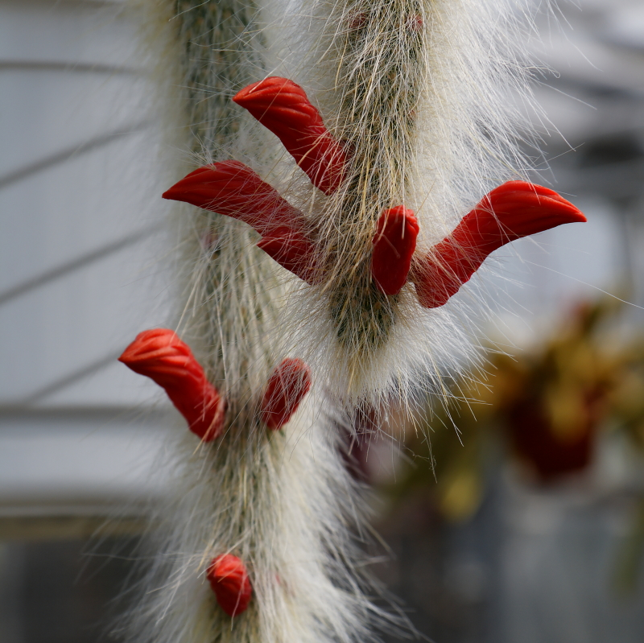
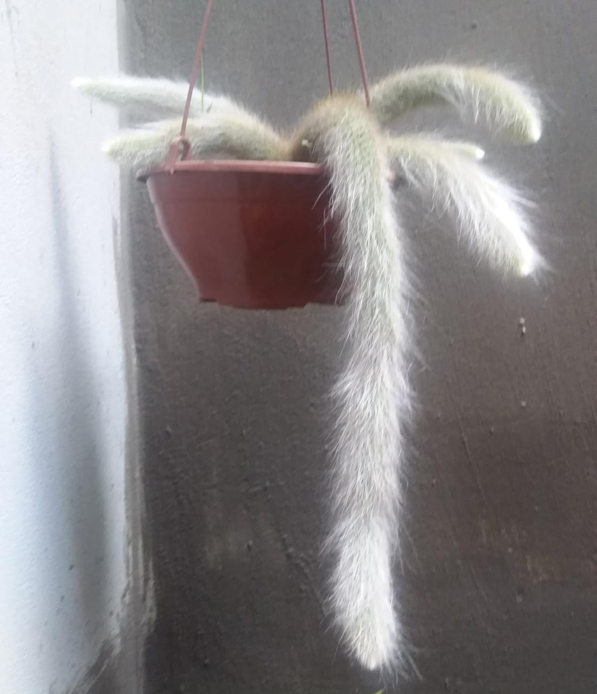
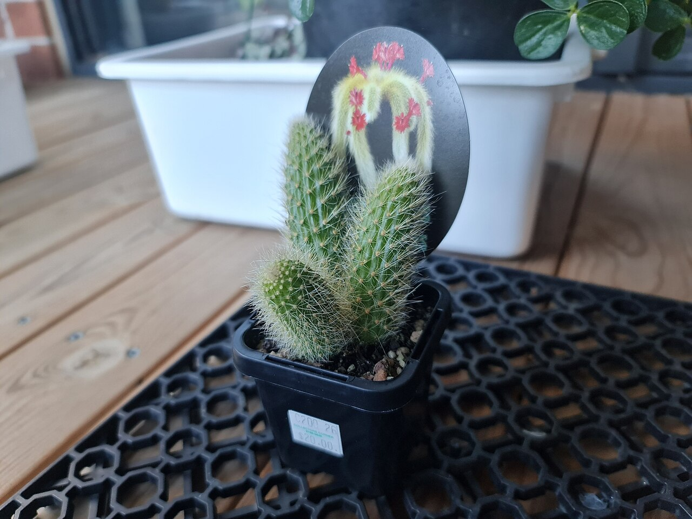
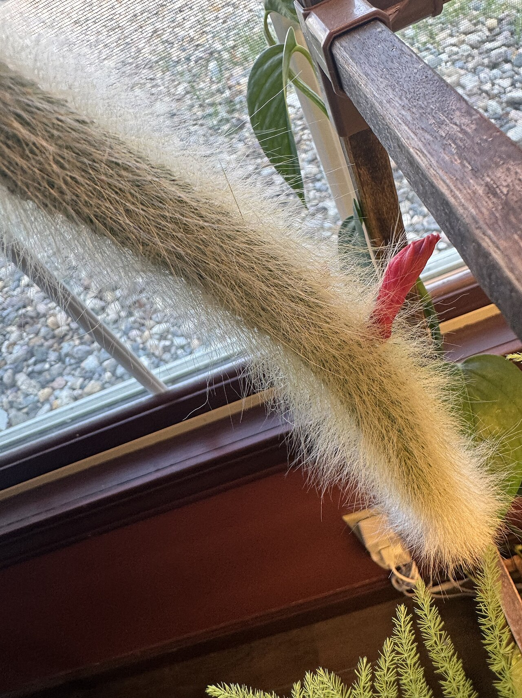
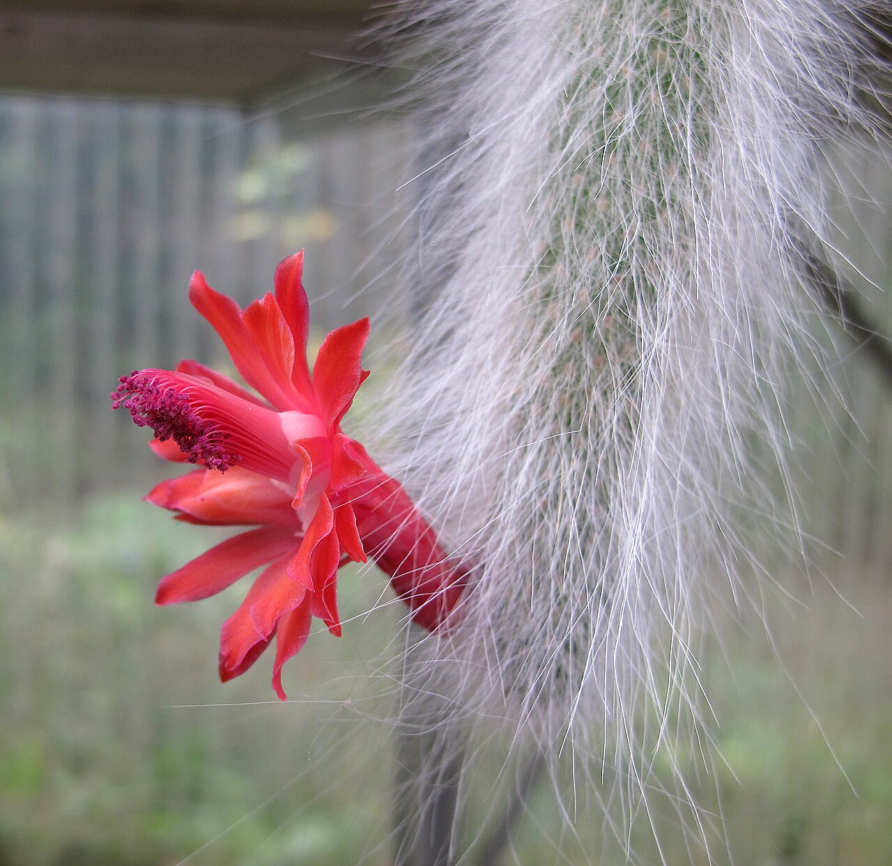
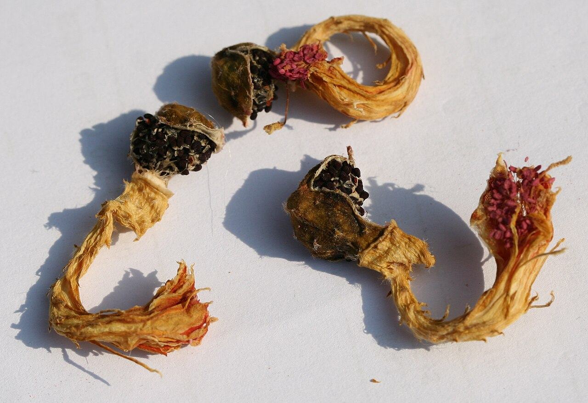

# Monkey tail cactus photo archive

*Cleistocactus colademononis* - Rehab-02

Species-reference photographs.

Collection research: [open the plant profile](../../../docs/plants/rehab/cleistocactus-colademononis.md).

## Gallery

*habit* - [IMG 0508-Cleistocactus winteri ssp. colademono.jpg](<https://commons.wikimedia.org/wiki/File:IMG_0508-Cleistocactus_winteri_ssp._colademono.jpg>); C T Johansson; [CC BY 3.0](<https://creativecommons.org/licenses/by/3.0>).

*habit* - [Cacto rabo de macaco.jpg](<https://commons.wikimedia.org/wiki/File:Cacto_rabo_de_macaco.jpg>); ZENILTON GONDIM SILVA; [CC BY-SA 4.0](<https://creativecommons.org/licenses/by-sa/4.0>).

*habitat* - [Cleistocactus colademononis 1.jpeg](<https://commons.wikimedia.org/wiki/File:Cleistocactus_colademononis_1.jpeg>); Lek Khauv; [CC BY 4.0](<https://creativecommons.org/licenses/by/4.0>).

*habitat* - [Cleistocactus colademononis 2.jpeg](<https://commons.wikimedia.org/wiki/File:Cleistocactus_colademononis_2.jpeg>); Tyler; [CC BY 4.0](<https://creativecommons.org/licenses/by/4.0>).

*flower* - [Cleistocactus colademononis mit Blüte 01.jpg](<https://commons.wikimedia.org/wiki/File:Cleistocactus_colademononis_mit_Bl%C3%BCte_01.jpg>); MMFE; [CC BY-SA 3.0](<https://creativecommons.org/licenses/by-sa/3.0>).

*fruit-seed* - [Cleistocactus colademononis fruits.jpg](<https://commons.wikimedia.org/wiki/File:Cleistocactus_colademononis_fruits.jpg>); Michael Wolf ( Webseite ); [CC BY-SA 3.0](<https://creativecommons.org/licenses/by-sa/3.0>).

## File details

| File | Subject | Source | Creator | License |
| --- | --- | --- | --- | --- |
| [commons-11169955-habit.jpg](./commons-11169955-habit.jpg) | habit | [Wikimedia Commons](<https://commons.wikimedia.org/wiki/File:IMG_0508-Cleistocactus_winteri_ssp._colademono.jpg>) | C T Johansson | [CC BY 3.0](<https://creativecommons.org/licenses/by/3.0>) |
| [commons-140489996-habit.jpg](./commons-140489996-habit.jpg) | habit | [Wikimedia Commons](<https://commons.wikimedia.org/wiki/File:Cacto_rabo_de_macaco.jpg>) | ZENILTON GONDIM SILVA | [CC BY-SA 4.0](<https://creativecommons.org/licenses/by-sa/4.0>) |
| [commons-174872052-habitat.jpg](./commons-174872052-habitat.jpg) | habitat | [Wikimedia Commons](<https://commons.wikimedia.org/wiki/File:Cleistocactus_colademononis_1.jpeg>) | Lek Khauv | [CC BY 4.0](<https://creativecommons.org/licenses/by/4.0>) |
| [commons-174872068-habitat.jpg](./commons-174872068-habitat.jpg) | habitat | [Wikimedia Commons](<https://commons.wikimedia.org/wiki/File:Cleistocactus_colademononis_2.jpeg>) | Tyler | [CC BY 4.0](<https://creativecommons.org/licenses/by/4.0>) |
| [commons-28724003-flower.jpg](./commons-28724003-flower.jpg) | flower | [Wikimedia Commons](<https://commons.wikimedia.org/wiki/File:Cleistocactus_colademononis_mit_Bl%C3%BCte_01.jpg>) | MMFE | [CC BY-SA 3.0](<https://creativecommons.org/licenses/by-sa/3.0>) |
| [commons-55194561-fruit-seed.jpg](./commons-55194561-fruit-seed.jpg) | fruit-seed | [Wikimedia Commons](<https://commons.wikimedia.org/wiki/File:Cleistocactus_colademononis_fruits.jpg>) | Michael Wolf ( Webseite ) | [CC BY-SA 3.0](<https://creativecommons.org/licenses/by-sa/3.0>) |

Metadata and SHA-256 hashes are also available in [the global manifest](../photo-manifest.json).
