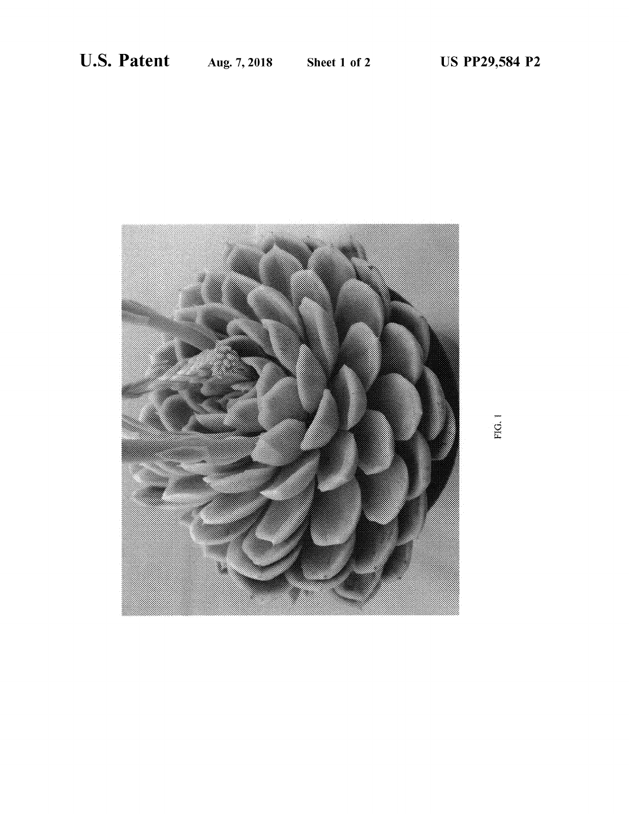
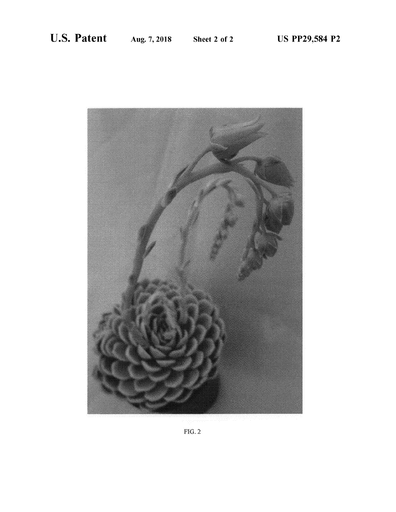
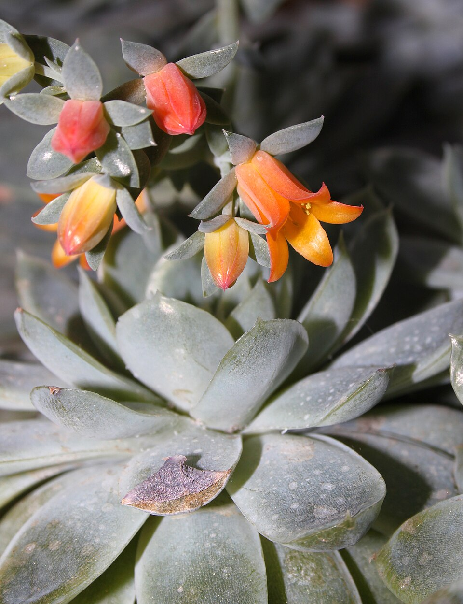
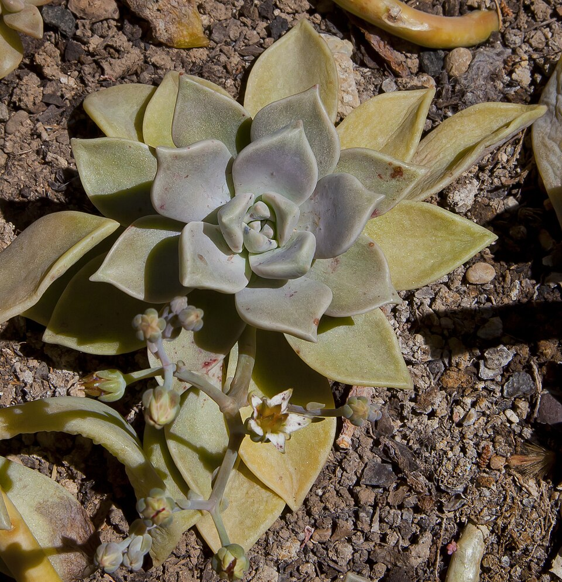
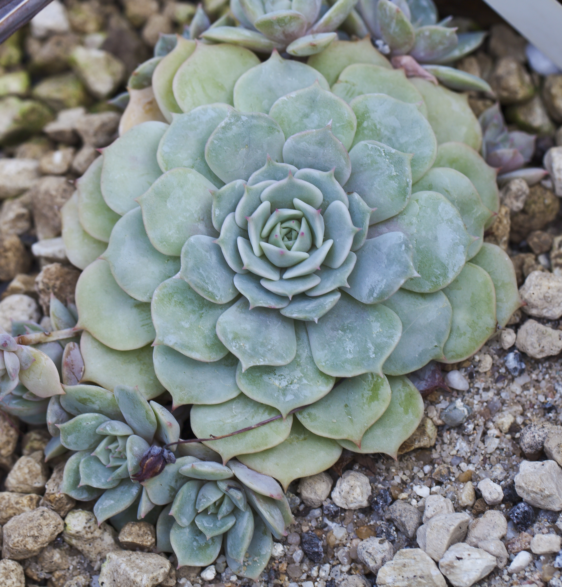
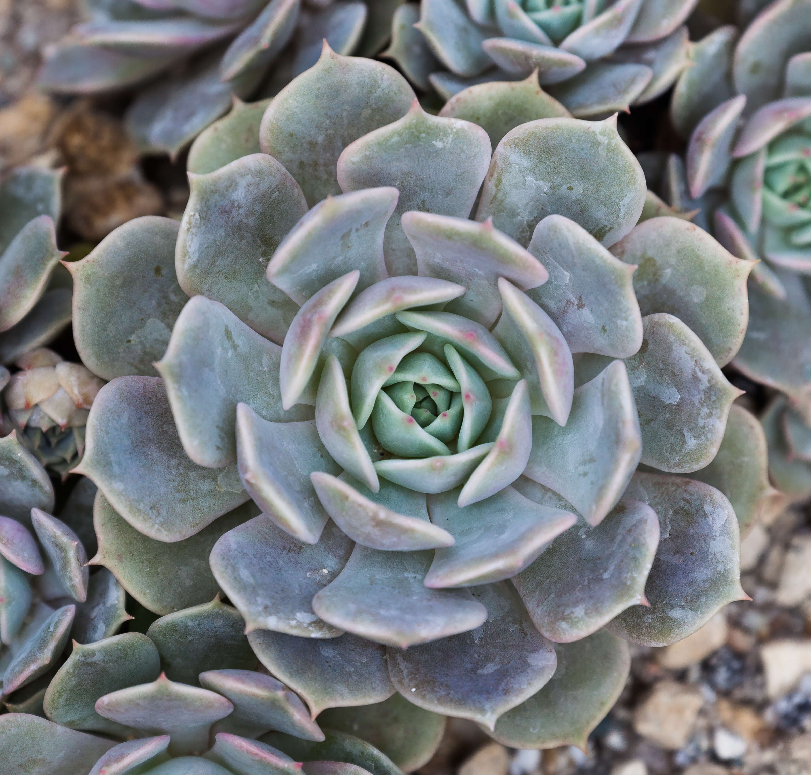
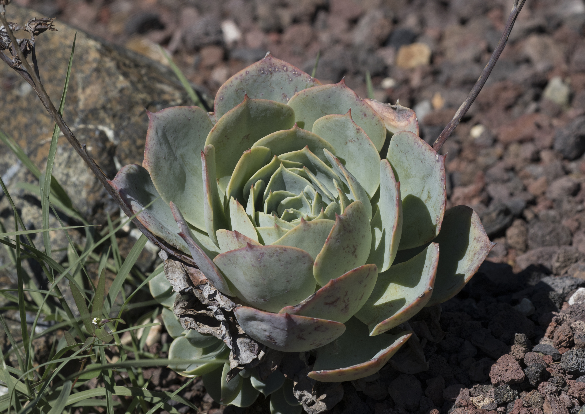
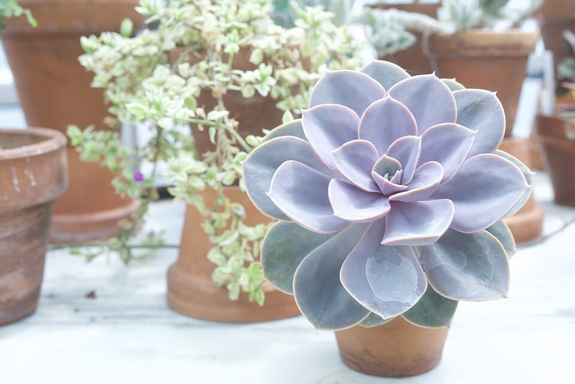
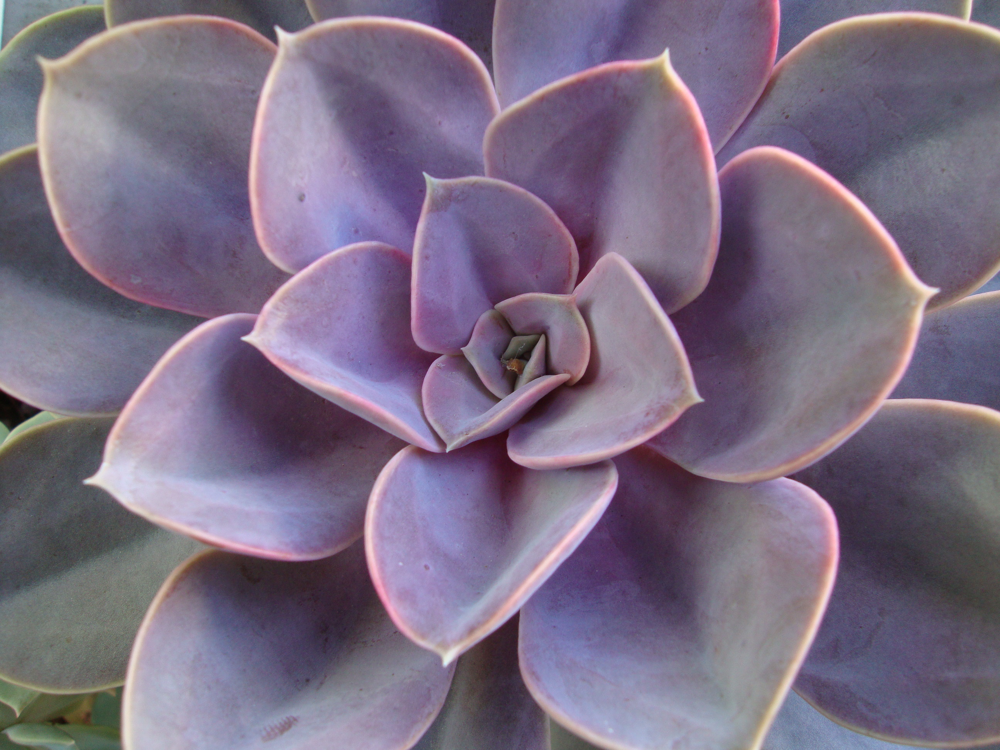
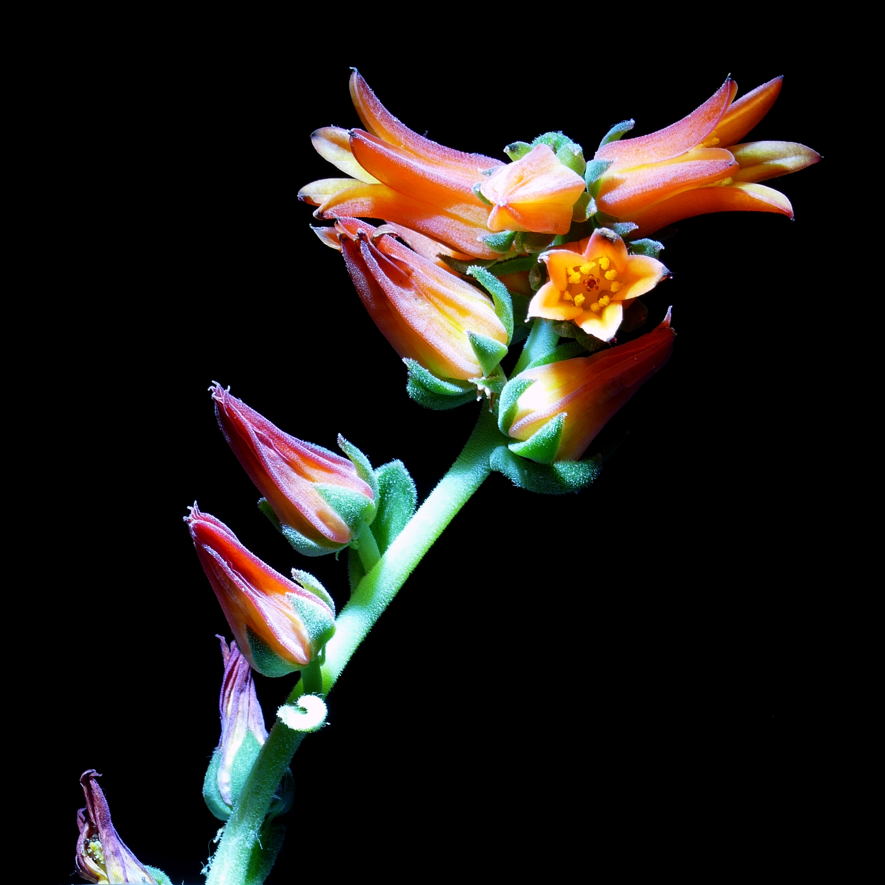

# Arctic Ice echeveria photo archive

_Echeveria 'Arctic Ice'_ - Succulent-17

Collection label ID: #11. Tracker ID: P37.

Two exact Arctic Ice monochrome patent figures, six Echeveria elegans comparison photographs, and two Echeveria Perle von Nürnberg comparison photographs. Comparison taxa are not Arctic Ice and neither is a documented parent of Arctic Ice. Patent figures do not establish color; none of these images documents the owned plant. Collection allocation: Succulent-17 / #11 / P37. Each record retains its own source, creator, and reuse terms; the comparison photographs are Creative Commons licensed, while the patent figures use the separately documented USPTO basis.

Collection research: [open the plant profile](../../../docs/plants/research/echeveria-arctic-ice.md).

## Gallery

_habit_ - [USPP29584P2 Figure 1 - Arctic Ice rosette (monochrome patent sheet)](https://patentimages.storage.googleapis.com/83/f6/2f/1c2518b104c447/USPP29584.pdf#page=4); Photographer uncredited; Altman Specialty Plants (patent applicant); [Public domain](https://www.uspto.gov/terms-use-uspto-websites).

_flower_ - [USPP29584P2 Figure 2 - Arctic Ice flowering stem (monochrome patent sheet)](https://patentimages.storage.googleapis.com/83/f6/2f/1c2518b104c447/USPP29584.pdf#page=5); Photographer uncredited; Altman Specialty Plants (patent applicant); [Public domain](https://www.uspto.gov/terms-use-uspto-websites).

_flower_ - [File:Echeveria-elegans-rose.jpg](https://commons.wikimedia.org/wiki/File:Echeveria-elegans-rose.jpg); Holger Krisp; [CC BY 3.0](https://creativecommons.org/licenses/by/3.0).

_habit_ - [File:Rosa de alabastro (Echeveria elegans), Calatayud, España 2012-05-16, DD 01.JPG](<https://commons.wikimedia.org/wiki/File:Rosa_de_alabastro_(Echeveria_elegans),_Calatayud,_Espa%C3%B1a_2012-05-16,_DD_01.JPG>); Diego Delso; [CC BY-SA 3.0](https://creativecommons.org/licenses/by-sa/3.0).

_habit_ - [File:Echeveria elegans, Jardín Botánico de Múnich, Alemania, 2013-01-27, DD 01.JPG](https://commons.wikimedia.org/wiki/File:Echeveria_elegans,_Jard%C3%ADn_Bot%C3%A1nico_de_M%C3%BAnich,_Alemania,_2013-01-27,_DD_01.JPG); Diego Delso; [CC BY-SA 3.0](https://creativecommons.org/licenses/by-sa/3.0).

_detail_ - [File:Echeveria elegans, Jardín Botánico, Múnich, Alemania, 2013-09-08, DD 01.JPG](https://commons.wikimedia.org/wiki/File:Echeveria_elegans,_Jard%C3%ADn_Bot%C3%A1nico,_M%C3%BAnich,_Alemania,_2013-09-08,_DD_01.JPG); Diego Delso; [CC BY-SA 3.0](https://creativecommons.org/licenses/by-sa/3.0).

_habit_ - [File:Echeveria elegans - Mexican Snowball 01-1.jpg](https://commons.wikimedia.org/wiki/File:Echeveria_elegans_-_Mexican_Snowball_01-1.jpg); Zeynel Cebeci; [CC BY-SA 4.0](https://creativecommons.org/licenses/by-sa/4.0).

_habit_ - [File:Echeveria Perle Von Nurnberg.jpg](https://commons.wikimedia.org/wiki/File:Echeveria_Perle_Von_Nurnberg.jpg); Karl Thomas Moore; [CC BY-SA 4.0](https://creativecommons.org/licenses/by-sa/4.0).

_detail_ - [File:Echeveria 'Perle Von Nürnberg' leaves.jpg](https://commons.wikimedia.org/wiki/File:Echeveria_%27Perle_Von_N%C3%BCrnberg%27_leaves.jpg); Mauronarf; [CC BY-SA 4.0](https://creativecommons.org/licenses/by-sa/4.0).

_flower_ - [File:Echeveria elegans20200315 16620.jpg](https://commons.wikimedia.org/wiki/File:Echeveria_elegans20200315_16620.jpg); Photo: Bff / Wikimedia Commons; [CC BY-SA 4.0](https://creativecommons.org/licenses/by-sa/4.0).

## File details

| File                                                                 | Subject | Source                                                                                                                                                    | Creator                                                             | License                                                         |
| -------------------------------------------------------------------- | ------- | --------------------------------------------------------------------------------------------------------------------------------------------------------- | ------------------------------------------------------------------- | --------------------------------------------------------------- |
| [patent-uspp29584-figure-1.png](./patent-uspp29584-figure-1.png)     | habit   | [United States Patent and Trademark Office - USPP29584P2](https://patentimages.storage.googleapis.com/83/f6/2f/1c2518b104c447/USPP29584.pdf#page=4)       | Photographer uncredited; Altman Specialty Plants (patent applicant) | [Public domain](https://www.uspto.gov/terms-use-uspto-websites) |
| [patent-uspp29584-figure-2.png](./patent-uspp29584-figure-2.png)     | flower  | [United States Patent and Trademark Office - USPP29584P2](https://patentimages.storage.googleapis.com/83/f6/2f/1c2518b104c447/USPP29584.pdf#page=5)       | Photographer uncredited; Altman Specialty Plants (patent applicant) | [Public domain](https://www.uspto.gov/terms-use-uspto-websites) |
| [commons-13127644-comparison.jpg](./commons-13127644-comparison.jpg) | flower  | [Wikimedia Commons](https://commons.wikimedia.org/wiki/File:Echeveria-elegans-rose.jpg)                                                                   | Holger Krisp                                                        | [CC BY 3.0](https://creativecommons.org/licenses/by/3.0)        |
| [commons-20372185-comparison.jpg](./commons-20372185-comparison.jpg) | habit   | [Wikimedia Commons](<https://commons.wikimedia.org/wiki/File:Rosa_de_alabastro_(Echeveria_elegans),_Calatayud,_Espa%C3%B1a_2012-05-16,_DD_01.JPG>)        | Diego Delso                                                         | [CC BY-SA 3.0](https://creativecommons.org/licenses/by-sa/3.0)  |
| [commons-25261576-comparison.jpg](./commons-25261576-comparison.jpg) | habit   | [Wikimedia Commons](https://commons.wikimedia.org/wiki/File:Echeveria_elegans,_Jard%C3%ADn_Bot%C3%A1nico_de_M%C3%BAnich,_Alemania,_2013-01-27,_DD_01.JPG) | Diego Delso                                                         | [CC BY-SA 3.0](https://creativecommons.org/licenses/by-sa/3.0)  |
| [commons-30277827-comparison.jpg](./commons-30277827-comparison.jpg) | detail  | [Wikimedia Commons](https://commons.wikimedia.org/wiki/File:Echeveria_elegans,_Jard%C3%ADn_Bot%C3%A1nico,_M%C3%BAnich,_Alemania,_2013-09-08,_DD_01.JPG)   | Diego Delso                                                         | [CC BY-SA 3.0](https://creativecommons.org/licenses/by-sa/3.0)  |
| [commons-51791504-comparison.jpg](./commons-51791504-comparison.jpg) | habit   | [Wikimedia Commons](https://commons.wikimedia.org/wiki/File:Echeveria_elegans_-_Mexican_Snowball_01-1.jpg)                                                | Zeynel Cebeci                                                       | [CC BY-SA 4.0](https://creativecommons.org/licenses/by-sa/4.0)  |
| [commons-57234409-comparison.jpg](./commons-57234409-comparison.jpg) | habit   | [Wikimedia Commons](https://commons.wikimedia.org/wiki/File:Echeveria_Perle_Von_Nurnberg.jpg)                                                             | Karl Thomas Moore                                                   | [CC BY-SA 4.0](https://creativecommons.org/licenses/by-sa/4.0)  |
| [commons-61874040-comparison.jpg](./commons-61874040-comparison.jpg) | detail  | [Wikimedia Commons](https://commons.wikimedia.org/wiki/File:Echeveria_%27Perle_Von_N%C3%BCrnberg%27_leaves.jpg)                                           | Mauronarf                                                           | [CC BY-SA 4.0](https://creativecommons.org/licenses/by-sa/4.0)  |
| [commons-88254430-comparison.jpg](./commons-88254430-comparison.jpg) | flower  | [Wikimedia Commons](https://commons.wikimedia.org/wiki/File:Echeveria_elegans20200315_16620.jpg)                                                          | Photo: Bff / Wikimedia Commons                                      | [CC BY-SA 4.0](https://creativecommons.org/licenses/by-sa/4.0)  |

Metadata and SHA-256 hashes are also available in [the global manifest](../photo-manifest.json).
