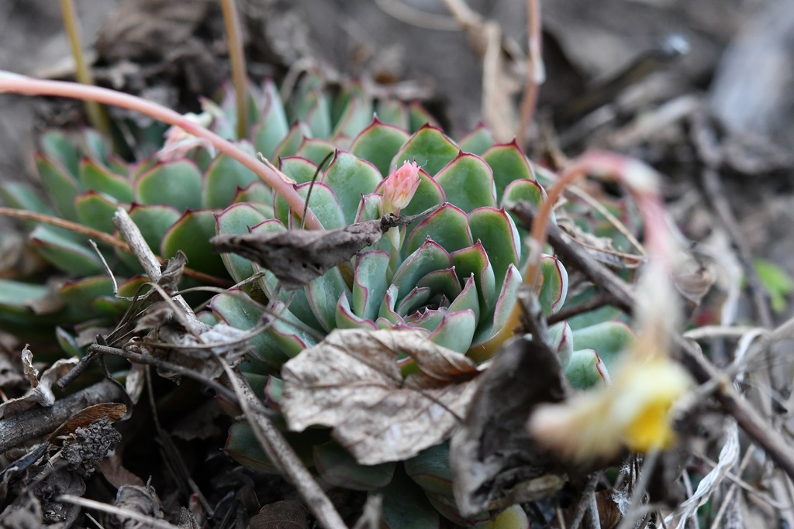
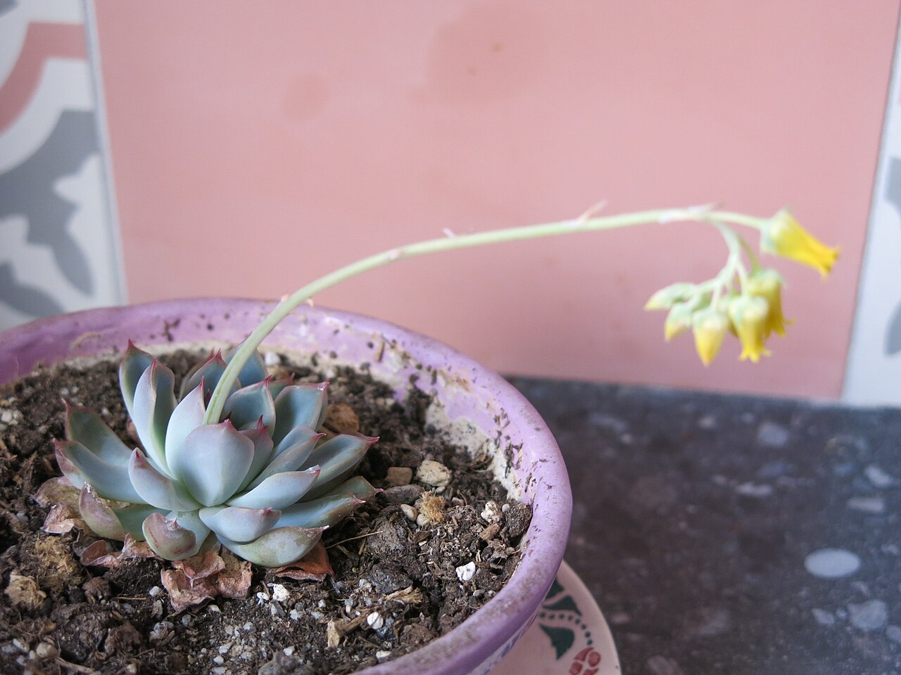
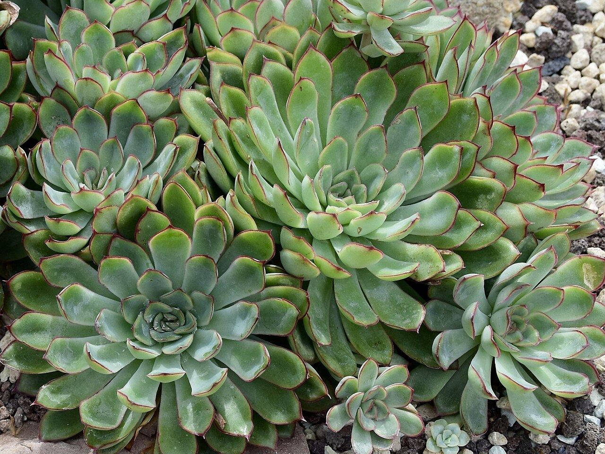
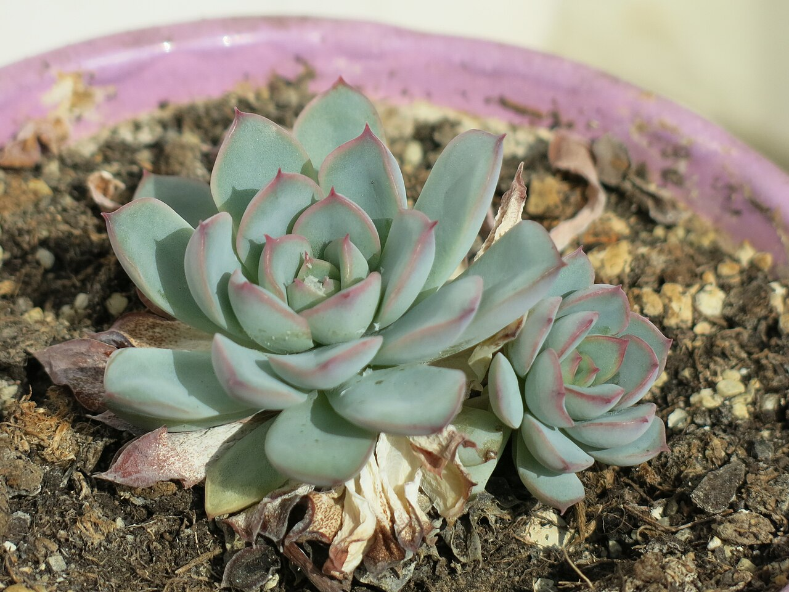
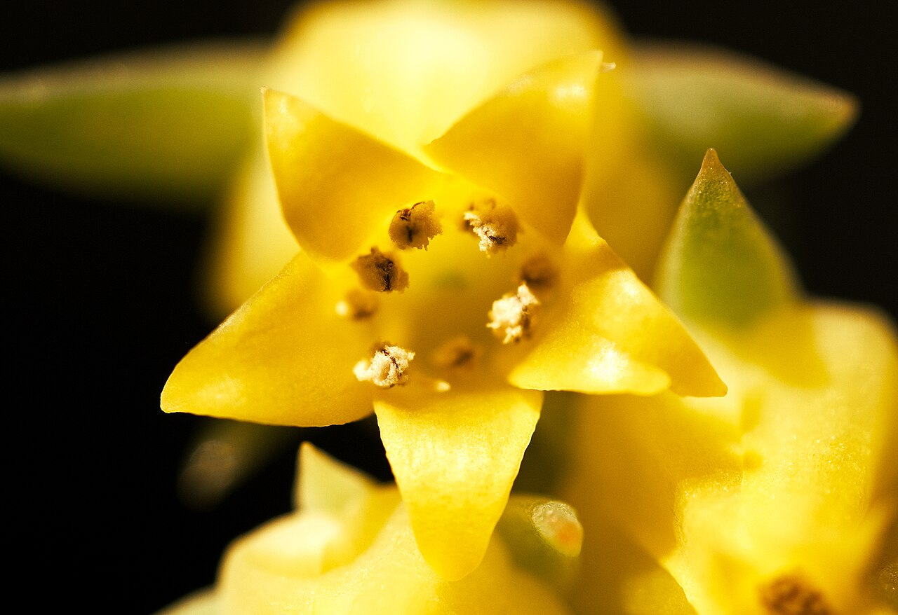
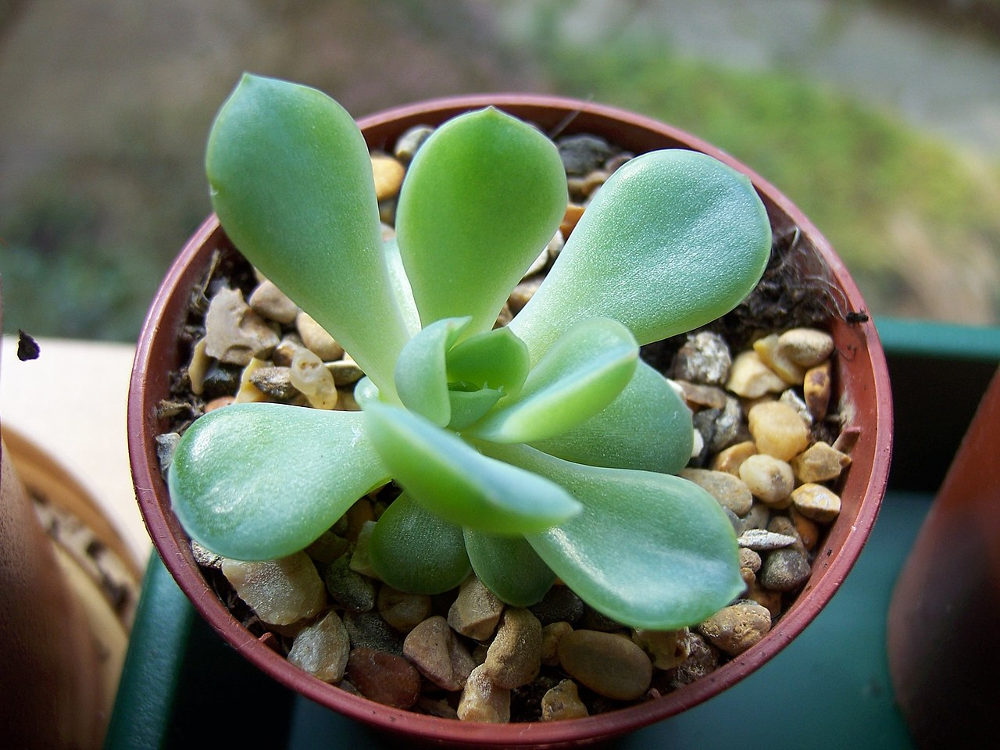

# Pulido's echeveria photo archive

*Echeveria pulidonis* - Succulent-01

Species-reference photographs; the collection ID remains provisional because close hybrids are common.

Collection research: [open the plant profile](../../../docs/plants/succulents/echeveria-pulidonis.md).

## Gallery

*habitat* - [Echeveria pulidonis in habitat](<https://www.inaturalist.org/observations/69696459>); (c) Neptalí Ramírez Marcial, some rights reserved (CC BY); [CC BY](<https://creativecommons.org/licenses/by/4.0/>).

*flower* - [Small echeveria D2104.jpg](<https://commons.wikimedia.org/wiki/File:Small_echeveria_D2104.jpg>); Tangopaso; [Public domain](<https://creativecommons.org/publicdomain/zero/1.0/>).

*habit* - [Crassulaceae Echeveria pulidonis 2.jpg](<https://commons.wikimedia.org/wiki/File:Crassulaceae_Echeveria_pulidonis_2.jpg>); NasserHalaweh; [CC BY-SA 4.0](<https://creativecommons.org/licenses/by-sa/4.0>).

*habit* - [Small echeveria D2204.jpg](<https://commons.wikimedia.org/wiki/File:Small_echeveria_D2204.jpg>); Tangopaso; [Public domain](<https://creativecommons.org/publicdomain/zero/1.0/>).

*flower* - [Close-up photograph of an Echeveria pulidonis flower.jpg](<https://commons.wikimedia.org/wiki/File:Close-up_photograph_of_an_Echeveria_pulidonis_flower.jpg>); Baegilmong; [CC BY-SA 4.0](<https://creativecommons.org/licenses/by-sa/4.0>).

*detail* - [Echeveria Pulidonis from a leaf cutting (5022387951).jpg](<https://commons.wikimedia.org/wiki/File:Echeveria_Pulidonis_from_a_leaf_cutting_(5022387951).jpg>); stephen boisvert from Chicago, United States; [CC BY 2.0](<https://creativecommons.org/licenses/by/2.0>).

## File details

| File | Subject | Source | Creator | License |
| --- | --- | --- | --- | --- |
| [inaturalist-69696459-113145029-habitat.jpg](./inaturalist-69696459-113145029-habitat.jpg) | habitat | [iNaturalist](<https://www.inaturalist.org/observations/69696459>) | (c) Neptalí Ramírez Marcial, some rights reserved (CC BY) | [CC BY](<https://creativecommons.org/licenses/by/4.0/>) |
| [commons-105422612-flower.jpg](./commons-105422612-flower.jpg) | flower | [Wikimedia Commons](<https://commons.wikimedia.org/wiki/File:Small_echeveria_D2104.jpg>) | Tangopaso | [Public domain](<https://creativecommons.org/publicdomain/zero/1.0/>) |
| [commons-108114629-habit.jpg](./commons-108114629-habit.jpg) | habit | [Wikimedia Commons](<https://commons.wikimedia.org/wiki/File:Crassulaceae_Echeveria_pulidonis_2.jpg>) | NasserHalaweh | [CC BY-SA 4.0](<https://creativecommons.org/licenses/by-sa/4.0>) |
| [commons-117682494-habit.jpg](./commons-117682494-habit.jpg) | habit | [Wikimedia Commons](<https://commons.wikimedia.org/wiki/File:Small_echeveria_D2204.jpg>) | Tangopaso | [Public domain](<https://creativecommons.org/publicdomain/zero/1.0/>) |
| [commons-128814965-flower.jpg](./commons-128814965-flower.jpg) | flower | [Wikimedia Commons](<https://commons.wikimedia.org/wiki/File:Close-up_photograph_of_an_Echeveria_pulidonis_flower.jpg>) | Baegilmong | [CC BY-SA 4.0](<https://creativecommons.org/licenses/by-sa/4.0>) |
| [commons-25037540-detail.jpg](./commons-25037540-detail.jpg) | detail | [Wikimedia Commons](<https://commons.wikimedia.org/wiki/File:Echeveria_Pulidonis_from_a_leaf_cutting_(5022387951).jpg>) | stephen boisvert from Chicago, United States | [CC BY 2.0](<https://creativecommons.org/licenses/by/2.0>) |

Metadata and SHA-256 hashes are also available in [the global manifest](../photo-manifest.json).
