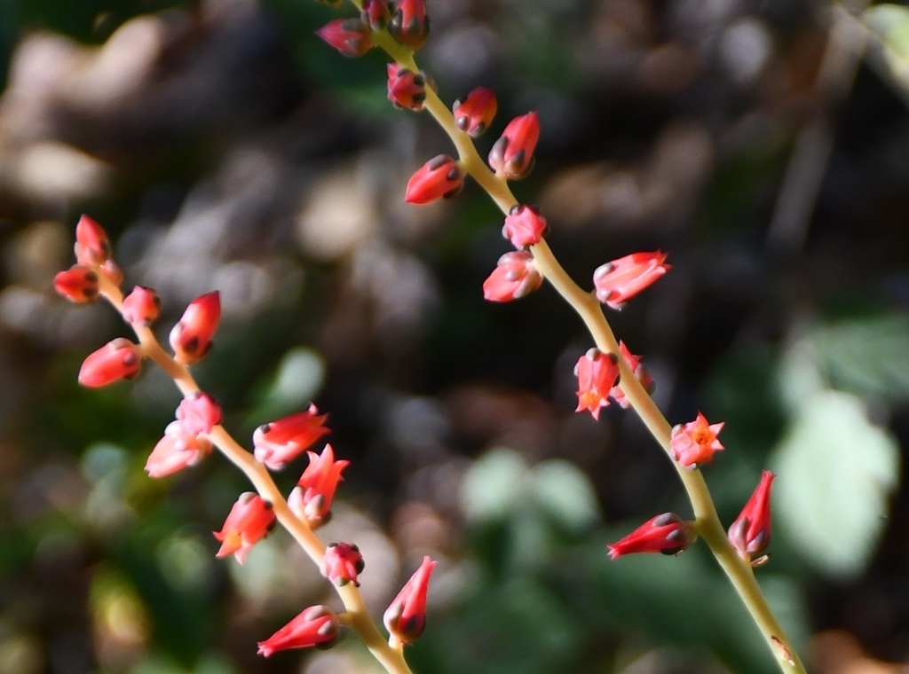
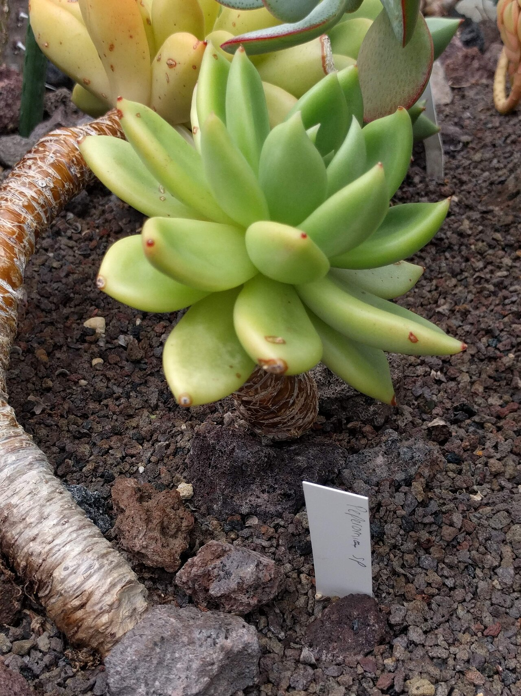
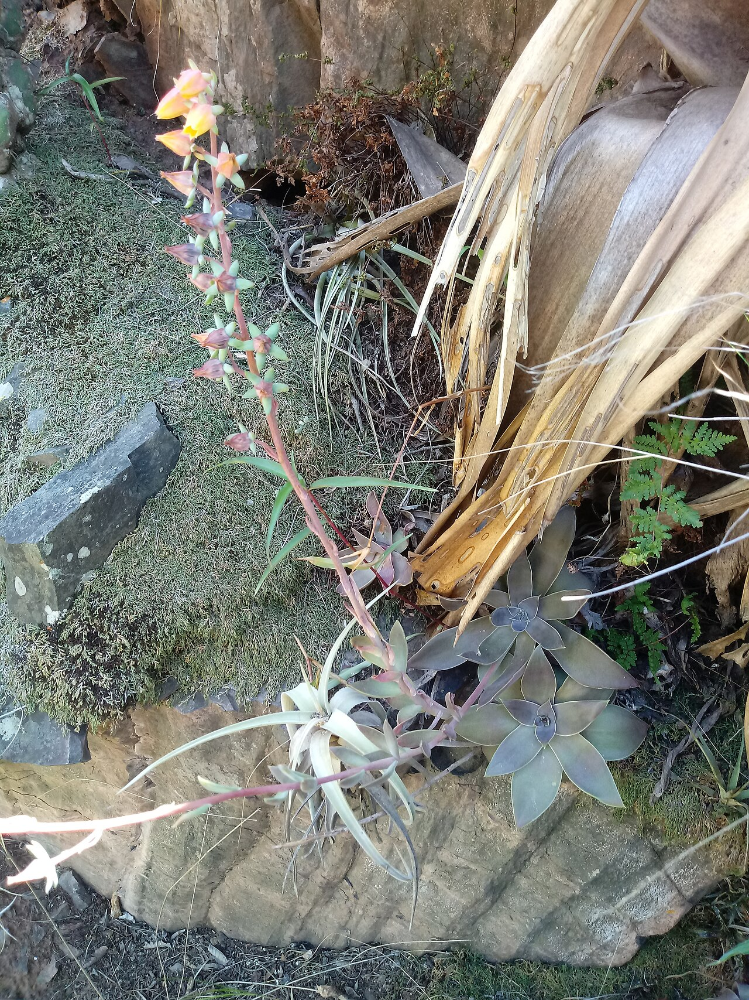
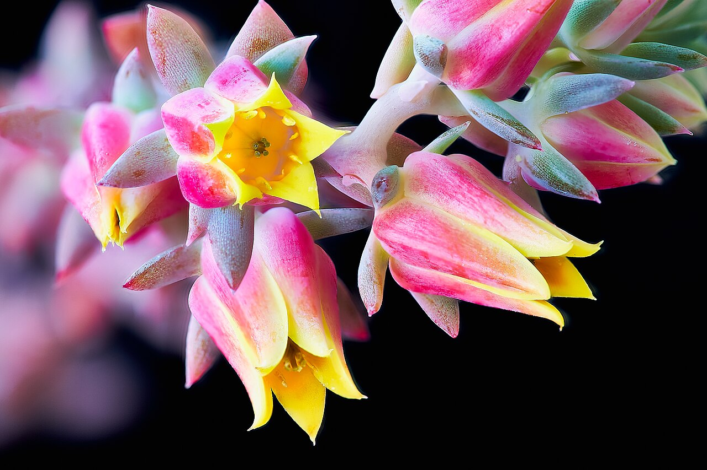
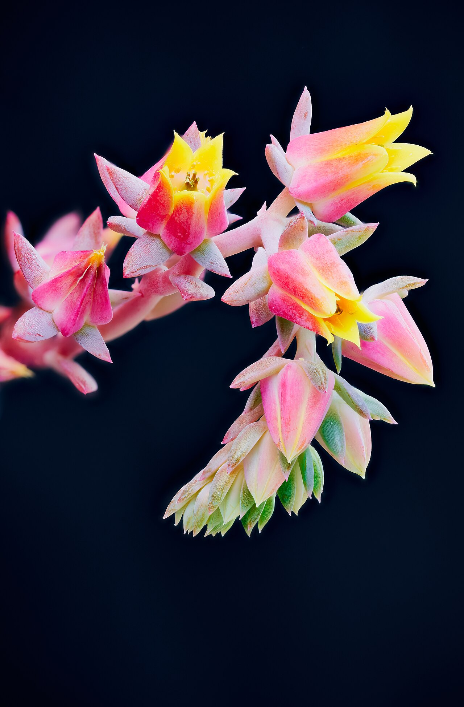
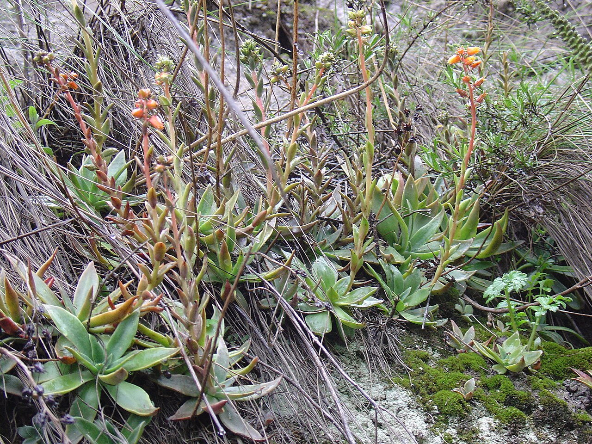

# Raindrops echeveria photo archive

_Echeveria Raindrops_ - Succulent-07

Collection label ID: `H2`.

Cultivar search results are prioritized; broad Echeveria images are genus context and may not show the Raindrops leaf bumps.

Collection research: [open the plant profile](../../../docs/plants/succulents/echeveria-raindrops.md).

## Gallery

_habitat_ - [Echeveria reference observation](https://www.inaturalist.org/observations/19424074); (c) Neptalí Ramírez Marcial, some rights reserved (CC BY); [CC BY](https://creativecommons.org/licenses/by/4.0/).

_habit_ - [20210623 Hortus botanicus Leiden 07 - Echeveria.jpg](https://commons.wikimedia.org/wiki/File:20210623_Hortus_botanicus_Leiden_07_-_Echeveria.jpg); Rudolphous; [CC BY-SA 4.0](https://creativecommons.org/licenses/by-sa/4.0).

_habitat_ - [Echeveria saltensis.jpg](https://commons.wikimedia.org/wiki/File:Echeveria_saltensis.jpg); Daniel Marquiegui; [CC BY-SA 4.0](https://creativecommons.org/licenses/by-sa/4.0).

_flower_ - [Echeveria imbricata (Blue rose) (49674371781).jpg](<https://commons.wikimedia.org/wiki/File:Echeveria_imbricata_(Blue_rose)_(49674371781).jpg>); Geoff McKay from Palmerston North, New Zealand; [CC BY 2.0](https://creativecommons.org/licenses/by/2.0).

_flower_ - [Echeveria imbricata (Blue rose) cactus flowers (49495258666).jpg](<https://commons.wikimedia.org/wiki/File:Echeveria_imbricata_(Blue_rose)_cactus_flowers_(49495258666).jpg>); Geoff McKay from Palmerston North, New Zealand; [CC BY 2.0](https://creativecommons.org/licenses/by/2.0).

_detail_ - [Eche cantaensis Obrajillo.jpg](https://commons.wikimedia.org/wiki/File:Eche_cantaensis_Obrajillo.jpg); Gpinoi; [CC BY-SA 4.0](https://creativecommons.org/licenses/by-sa/4.0).

## File details

| File                                                                                     | Subject | Source                                                                                                                          | Creator                                                   | License                                                        |
| ---------------------------------------------------------------------------------------- | ------- | ------------------------------------------------------------------------------------------------------------------------------- | --------------------------------------------------------- | -------------------------------------------------------------- |
| [inaturalist-19424074-29879583-habitat.jpg](./inaturalist-19424074-29879583-habitat.jpg) | habitat | [iNaturalist](https://www.inaturalist.org/observations/19424074)                                                                | (c) Neptalí Ramírez Marcial, some rights reserved (CC BY) | [CC BY](https://creativecommons.org/licenses/by/4.0/)          |
| [commons-106922629-habit.jpg](./commons-106922629-habit.jpg)                             | habit   | [Wikimedia Commons](https://commons.wikimedia.org/wiki/File:20210623_Hortus_botanicus_Leiden_07_-_Echeveria.jpg)                | Rudolphous                                                | [CC BY-SA 4.0](https://creativecommons.org/licenses/by-sa/4.0) |
| [commons-112816717-habitat.jpg](./commons-112816717-habitat.jpg)                         | habitat | [Wikimedia Commons](https://commons.wikimedia.org/wiki/File:Echeveria_saltensis.jpg)                                            | Daniel Marquiegui                                         | [CC BY-SA 4.0](https://creativecommons.org/licenses/by-sa/4.0) |
| [commons-113079336-flower.jpg](./commons-113079336-flower.jpg)                           | flower  | [Wikimedia Commons](<https://commons.wikimedia.org/wiki/File:Echeveria_imbricata_(Blue_rose)_(49674371781).jpg>)                | Geoff McKay from Palmerston North, New Zealand            | [CC BY 2.0](https://creativecommons.org/licenses/by/2.0)       |
| [commons-113079815-flower.jpg](./commons-113079815-flower.jpg)                           | flower  | [Wikimedia Commons](<https://commons.wikimedia.org/wiki/File:Echeveria_imbricata_(Blue_rose)_cactus_flowers_(49495258666).jpg>) | Geoff McKay from Palmerston North, New Zealand            | [CC BY 2.0](https://creativecommons.org/licenses/by/2.0)       |
| [commons-124615289-detail.jpg](./commons-124615289-detail.jpg)                           | detail  | [Wikimedia Commons](https://commons.wikimedia.org/wiki/File:Eche_cantaensis_Obrajillo.jpg)                                      | Gpinoi                                                    | [CC BY-SA 4.0](https://creativecommons.org/licenses/by-sa/4.0) |

Metadata and SHA-256 hashes are also available in [the global manifest](../photo-manifest.json).
