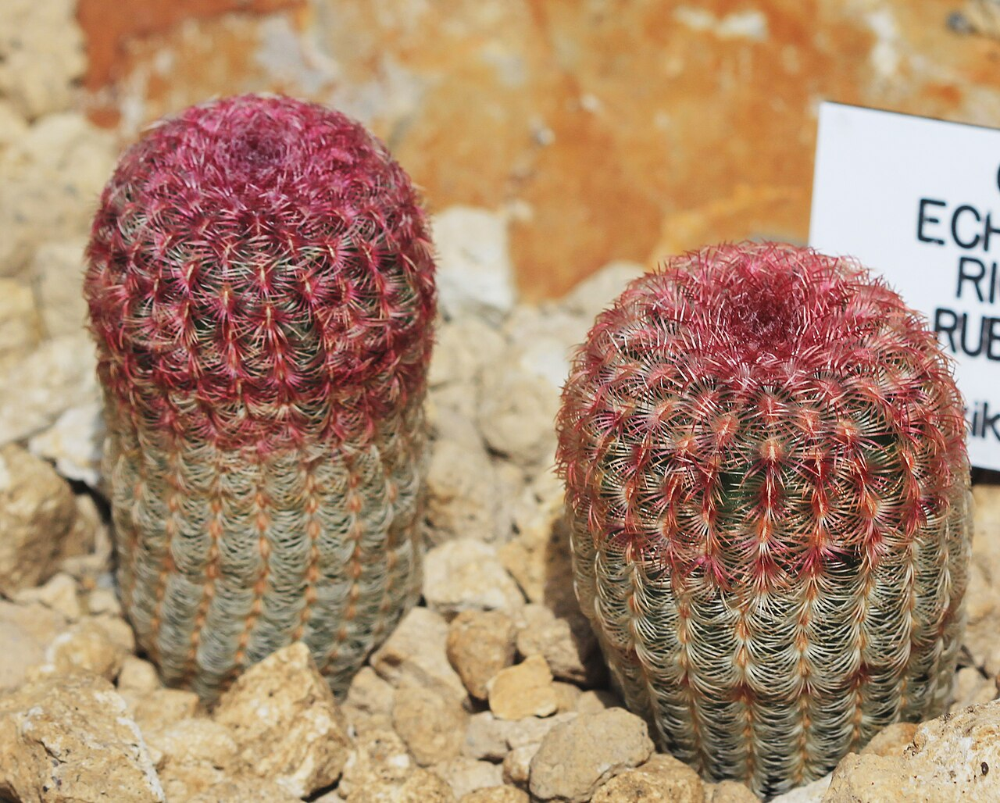
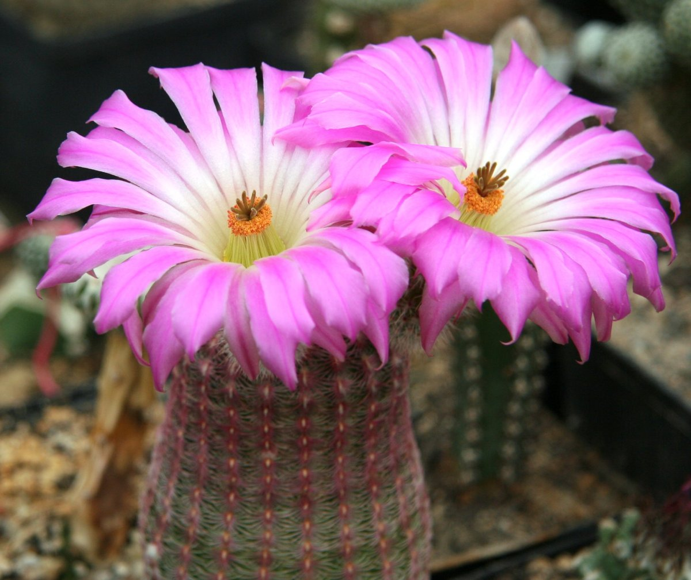
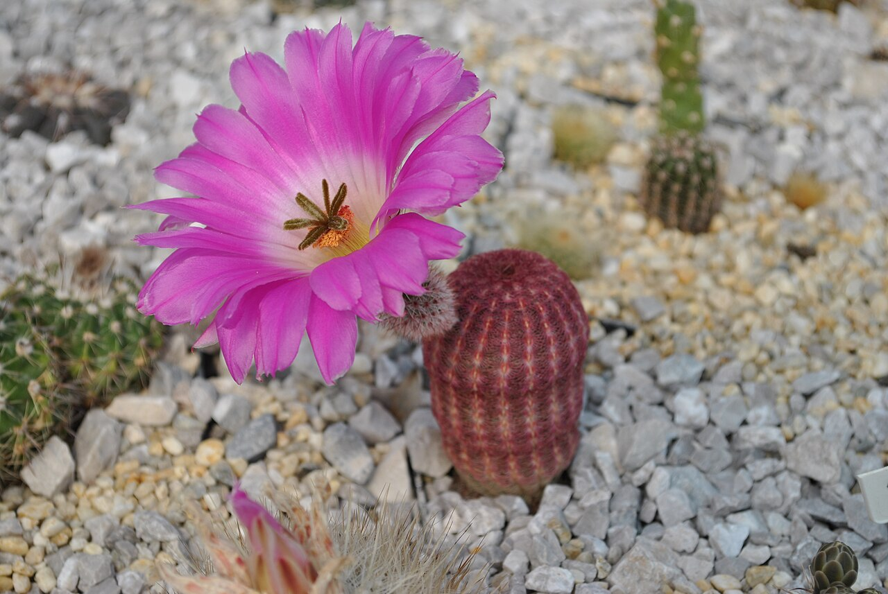
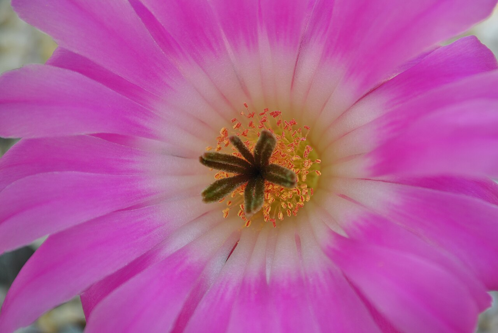
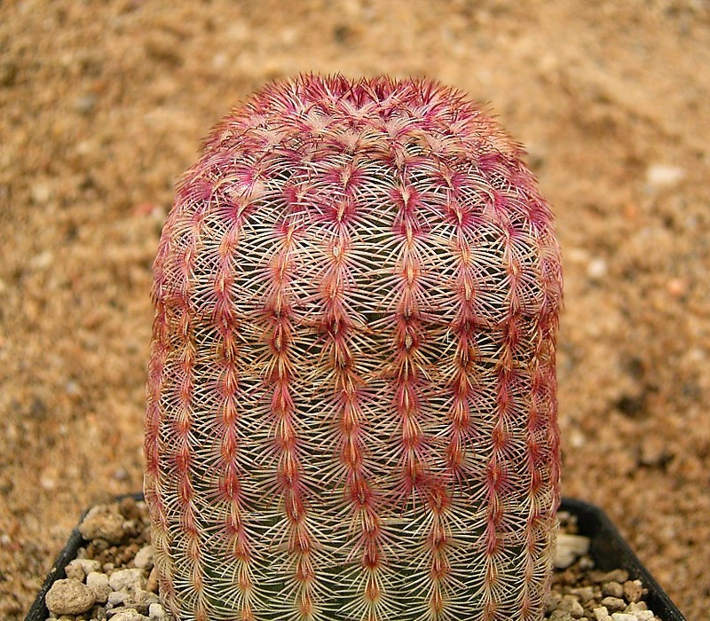
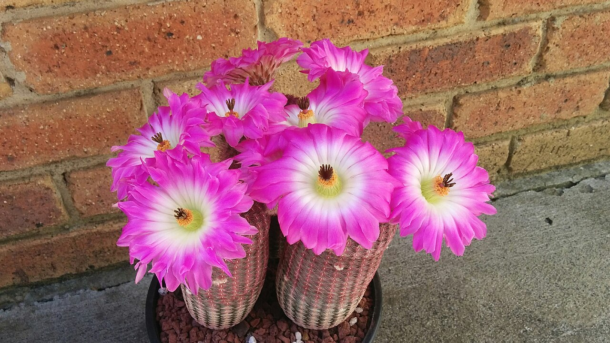
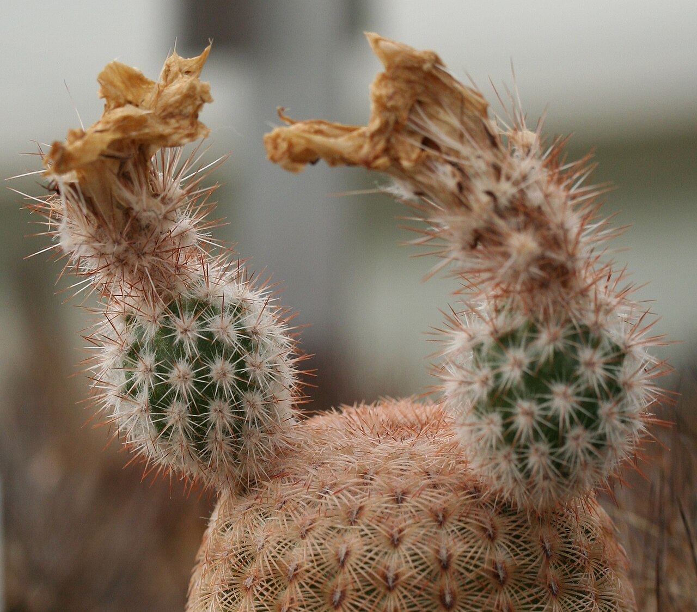

# Rainbow hedgehog cactus photo archive

_Echinocereus rigidissimus subsp. rubispinus_ - Starter-03

Collection label ID: `C2`.

Subspecies-reference photographs.

Collection research: [open the plant profile](../../../docs/plants/starter/echinocereus-rigidissimus-rubispinus.md).

## Gallery

_habit_ - [Echinocereus rigidissimus rubispinus Prague 2011 1.jpg](https://commons.wikimedia.org/wiki/File:Echinocereus_rigidissimus_rubispinus_Prague_2011_1.jpg); Karelj; [CC BY-SA 3.0](https://creativecommons.org/licenses/by-sa/3.0).

_habit_ - [Echinocereus rigidissimus ssp rubispinus L88.jpg](https://commons.wikimedia.org/wiki/File:Echinocereus_rigidissimus_ssp_rubispinus_L88.jpg); Michael Wolf; [CC BY-SA 2.5](https://creativecommons.org/licenses/by-sa/2.5).

_flower_ - [Echinocereus rigidissimus v. rubrispinus.jpg](https://commons.wikimedia.org/wiki/File:Echinocereus_rigidissimus_v._rubrispinus.jpg); Matjaž Wigele; [CC BY 3.0](https://creativecommons.org/licenses/by/3.0).

_flower_ - [Echinocereus rigidissimus v. rubrispinus 1.jpg](https://commons.wikimedia.org/wiki/File:Echinocereus_rigidissimus_v._rubrispinus_1.jpg); Matjaž Wigele; [CC BY 3.0](https://creativecommons.org/licenses/by/3.0).

_habit_ - [Echinocereus rigidissimus rubispinus 01 ies.jpg](https://commons.wikimedia.org/wiki/File:Echinocereus_rigidissimus_rubispinus_01_ies.jpg); Frank Vincentz; [CC BY-SA 3.0](http://creativecommons.org/licenses/by-sa/3.0/).

_flower_ - [Rubrispinus flowering.jpg](https://commons.wikimedia.org/wiki/File:Rubrispinus_flowering.jpg); S6ann33n; [CC BY-SA 4.0](https://creativecommons.org/licenses/by-sa/4.0).

_fruit-seed_ - [Echinocereus rigidissimus fruit.jpg](https://commons.wikimedia.org/wiki/File:Echinocereus_rigidissimus_fruit.jpg); Michael Wolf; [CC BY-SA 3.0](https://creativecommons.org/licenses/by-sa/3.0).

## File details

| File                                                                 | Subject    | Source                                                                                                              | Creator        | License                                                        |
| -------------------------------------------------------------------- | ---------- | ------------------------------------------------------------------------------------------------------------------- | -------------- | -------------------------------------------------------------- |
| [commons-19637676-habit.jpg](./commons-19637676-habit.jpg)           | habit      | [Wikimedia Commons](https://commons.wikimedia.org/wiki/File:Echinocereus_rigidissimus_rubispinus_Prague_2011_1.jpg) | Karelj         | [CC BY-SA 3.0](https://creativecommons.org/licenses/by-sa/3.0) |
| [commons-2030912-habit.jpg](./commons-2030912-habit.jpg)             | habit      | [Wikimedia Commons](https://commons.wikimedia.org/wiki/File:Echinocereus_rigidissimus_ssp_rubispinus_L88.jpg)       | Michael Wolf   | [CC BY-SA 2.5](https://creativecommons.org/licenses/by-sa/2.5) |
| [commons-21661896-flower.jpg](./commons-21661896-flower.jpg)         | flower     | [Wikimedia Commons](https://commons.wikimedia.org/wiki/File:Echinocereus_rigidissimus_v._rubrispinus.jpg)           | Matjaž Wigele  | [CC BY 3.0](https://creativecommons.org/licenses/by/3.0)       |
| [commons-21662064-flower.jpg](./commons-21662064-flower.jpg)         | flower     | [Wikimedia Commons](https://commons.wikimedia.org/wiki/File:Echinocereus_rigidissimus_v._rubrispinus_1.jpg)         | Matjaž Wigele  | [CC BY 3.0](https://creativecommons.org/licenses/by/3.0)       |
| [commons-3133082-habit.jpg](./commons-3133082-habit.jpg)             | habit      | [Wikimedia Commons](https://commons.wikimedia.org/wiki/File:Echinocereus_rigidissimus_rubispinus_01_ies.jpg)        | Frank Vincentz | [CC BY-SA 3.0](http://creativecommons.org/licenses/by-sa/3.0/) |
| [commons-37022997-flower.jpg](./commons-37022997-flower.jpg)         | flower     | [Wikimedia Commons](https://commons.wikimedia.org/wiki/File:Rubrispinus_flowering.jpg)                              | S6ann33n       | [CC BY-SA 4.0](https://creativecommons.org/licenses/by-sa/4.0) |
| [commons-50455453-fruit-seed.jpg](./commons-50455453-fruit-seed.jpg) | fruit-seed | [Wikimedia Commons](https://commons.wikimedia.org/wiki/File:Echinocereus_rigidissimus_fruit.jpg)                    | Michael Wolf   | [CC BY-SA 3.0](https://creativecommons.org/licenses/by-sa/3.0) |

Metadata and SHA-256 hashes are also available in [the global manifest](../photo-manifest.json).
