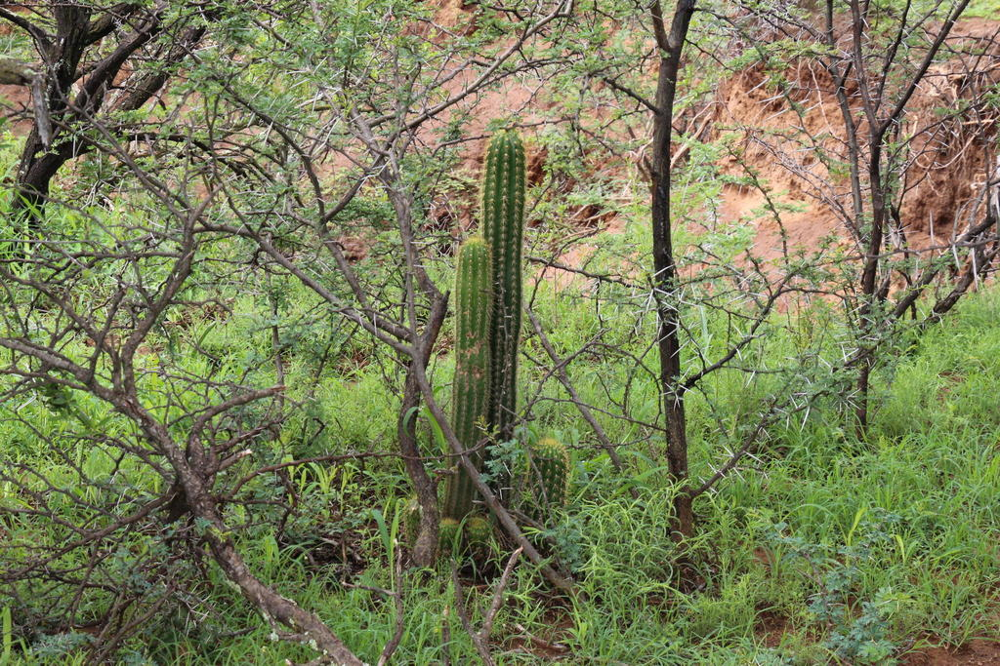
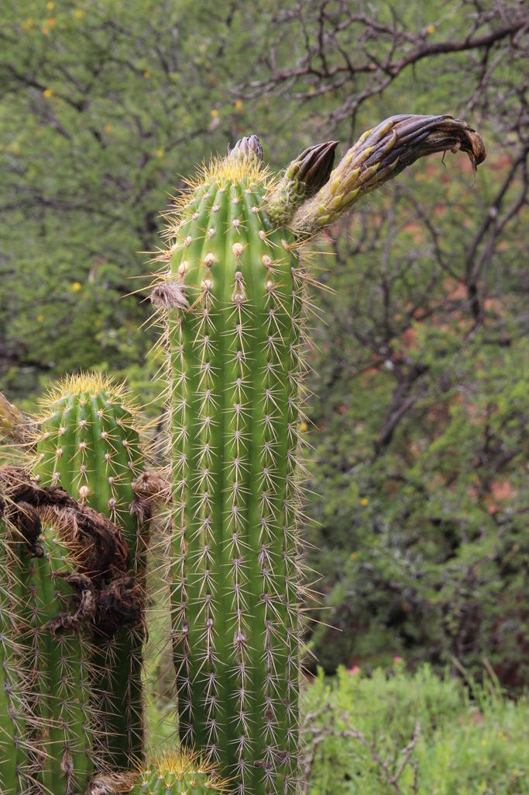
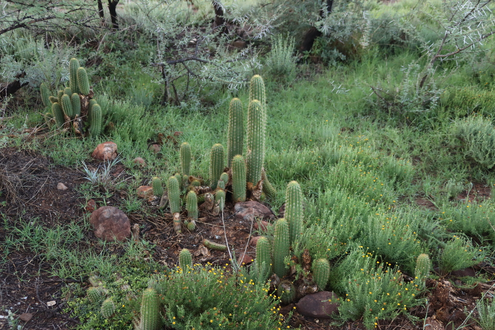
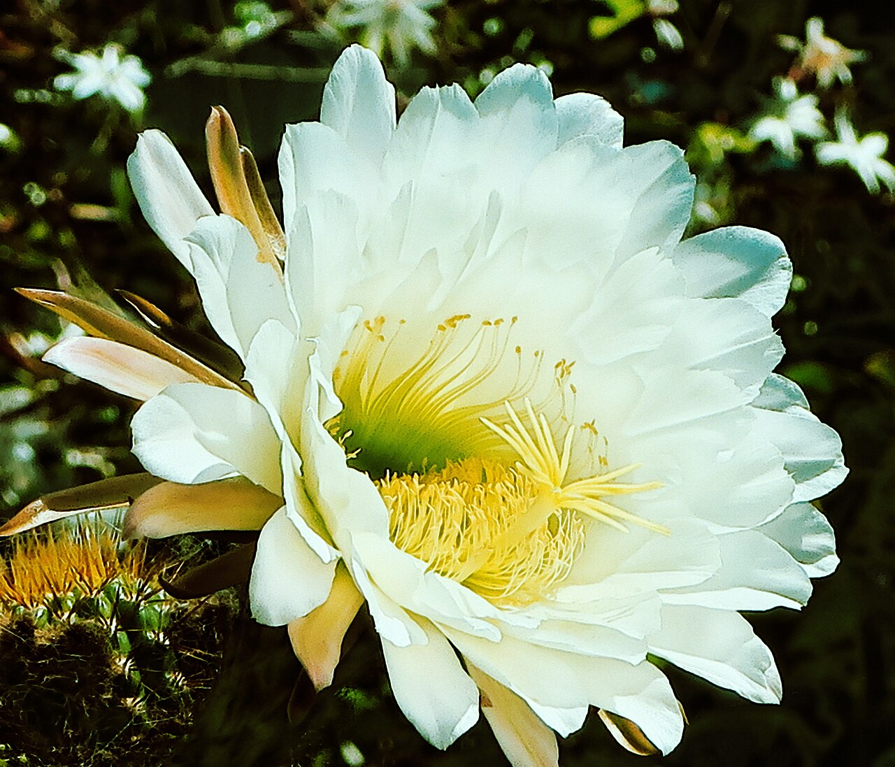
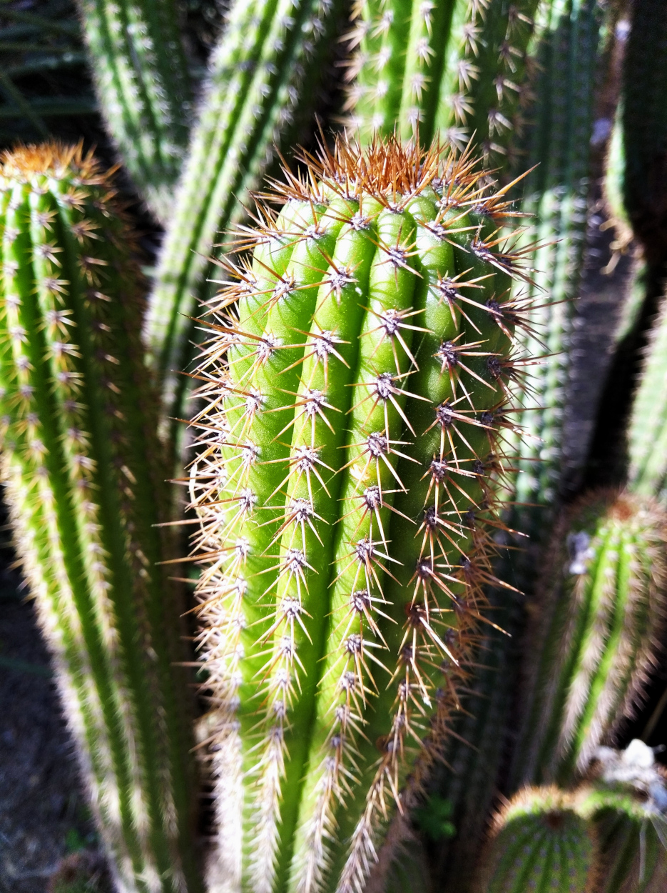
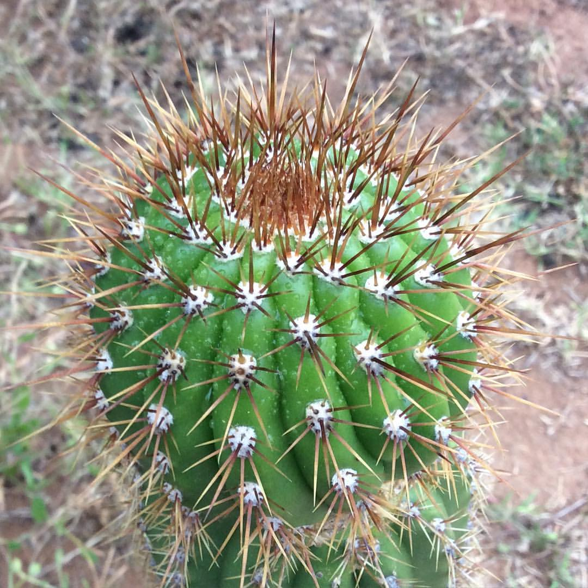

# Golden torch cactus photo archive

*Echinopsis spachiana* - Rehab-03

Species-reference photographs; the collection ID remains provisional.

Collection research: [open the plant profile](../../../docs/plants/rehab/echinopsis-spachiana.md).

## Gallery

*habitat* - [Echinopsis spachiana in habitat](<https://www.inaturalist.org/observations/11255785>); (c) Tony Rebelo, some rights reserved (CC BY-SA); [CC BY SA](<https://creativecommons.org/licenses/by/4.0/>).

*habitat* - [Echinopsis spachiana in habitat](<https://www.inaturalist.org/observations/11255846>); (c) Tony Rebelo, some rights reserved (CC BY-SA); [CC BY SA](<https://creativecommons.org/licenses/by/4.0/>).

*habitat* - [Echinopsis spachiana in habitat](<https://www.inaturalist.org/observations/284255102>); (c) Tony Rebelo, some rights reserved (CC BY-SA); [CC BY SA](<https://creativecommons.org/licenses/by/4.0/>).

*flower* - [J20170622-0039—Echinopsis spachiana—DxO (35590986625).jpg](<https://commons.wikimedia.org/wiki/File:J20170622-0039%E2%80%94Echinopsis_spachiana%E2%80%94DxO_(35590986625).jpg>); John Rusk from Berkeley, CA, United States of America; [CC BY 2.0](<https://creativecommons.org/licenses/by/2.0>).

*habit* - [Echinopsis spachiana 2w.jpg](<https://commons.wikimedia.org/wiki/File:Echinopsis_spachiana_2w.jpg>); Consultaplantas; [CC BY-SA 4.0](<https://creativecommons.org/licenses/by-sa/4.0>).

*detail* - [Echinopsis spachiana plant.jpg](<https://commons.wikimedia.org/wiki/File:Echinopsis_spachiana_plant.jpg>); el cajon yacht club; [CC BY 2.0](<https://creativecommons.org/licenses/by/2.0>).

## File details

| File | Subject | Source | Creator | License |
| --- | --- | --- | --- | --- |
| [inaturalist-11255785-15989646-habitat.jpg](./inaturalist-11255785-15989646-habitat.jpg) | habitat | [iNaturalist](<https://www.inaturalist.org/observations/11255785>) | (c) Tony Rebelo, some rights reserved (CC BY-SA) | [CC BY SA](<https://creativecommons.org/licenses/by/4.0/>) |
| [inaturalist-11255846-15989803-habitat.jpg](./inaturalist-11255846-15989803-habitat.jpg) | habitat | [iNaturalist](<https://www.inaturalist.org/observations/11255846>) | (c) Tony Rebelo, some rights reserved (CC BY-SA) | [CC BY SA](<https://creativecommons.org/licenses/by/4.0/>) |
| [inaturalist-284255102-510827800-habitat.jpg](./inaturalist-284255102-510827800-habitat.jpg) | habitat | [iNaturalist](<https://www.inaturalist.org/observations/284255102>) | (c) Tony Rebelo, some rights reserved (CC BY-SA) | [CC BY SA](<https://creativecommons.org/licenses/by/4.0/>) |
| [commons-105178605-flower.jpg](./commons-105178605-flower.jpg) | flower | [Wikimedia Commons](<https://commons.wikimedia.org/wiki/File:J20170622-0039%E2%80%94Echinopsis_spachiana%E2%80%94DxO_(35590986625).jpg>) | John Rusk from Berkeley, CA, United States of America | [CC BY 2.0](<https://creativecommons.org/licenses/by/2.0>) |
| [commons-106244214-habit.jpg](./commons-106244214-habit.jpg) | habit | [Wikimedia Commons](<https://commons.wikimedia.org/wiki/File:Echinopsis_spachiana_2w.jpg>) | Consultaplantas | [CC BY-SA 4.0](<https://creativecommons.org/licenses/by-sa/4.0>) |
| [commons-119325904-detail.jpg](./commons-119325904-detail.jpg) | detail | [Wikimedia Commons](<https://commons.wikimedia.org/wiki/File:Echinopsis_spachiana_plant.jpg>) | el cajon yacht club | [CC BY 2.0](<https://creativecommons.org/licenses/by/2.0>) |

Metadata and SHA-256 hashes are also available in [the global manifest](../photo-manifest.json).
