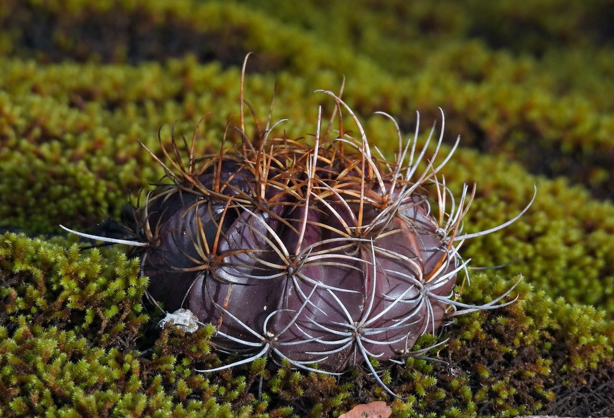
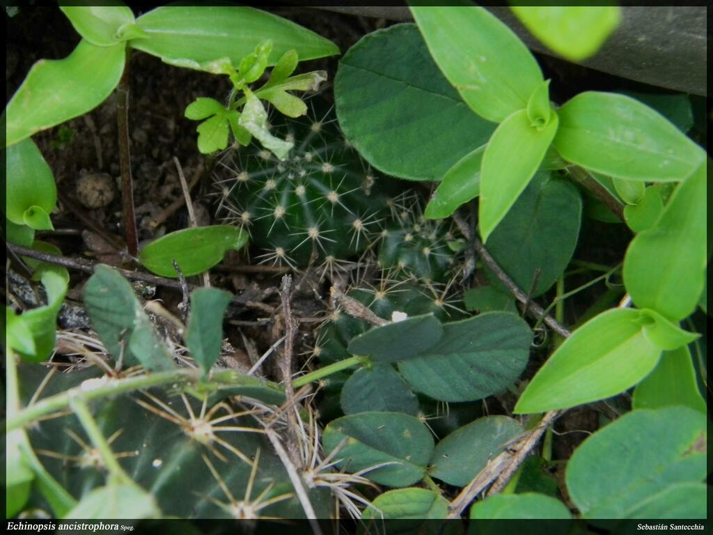
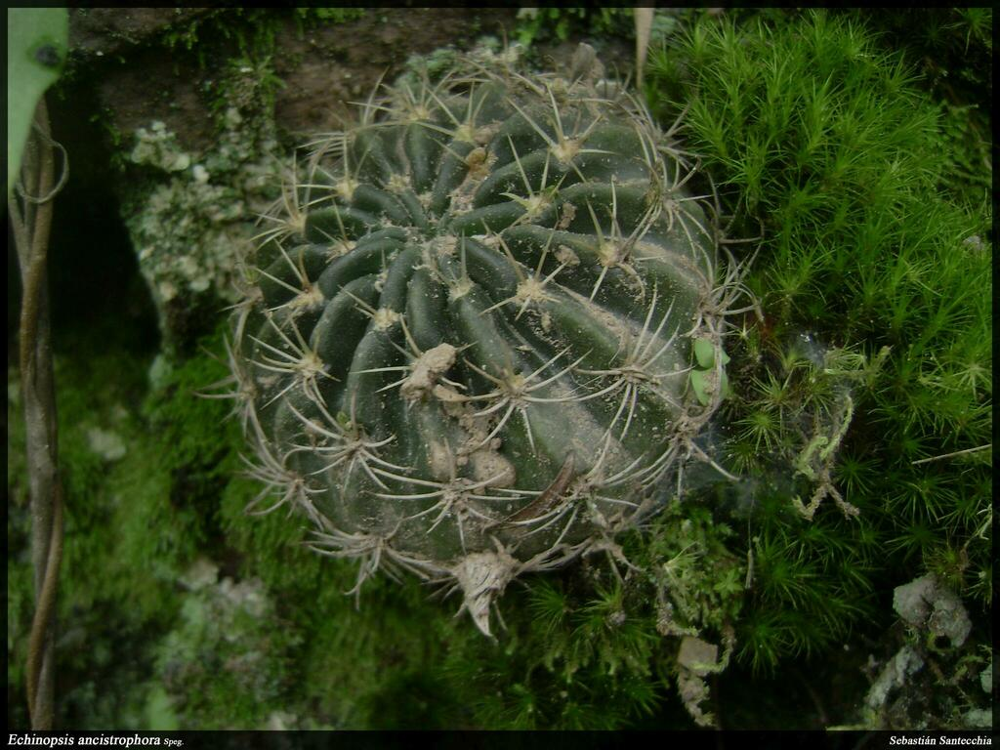
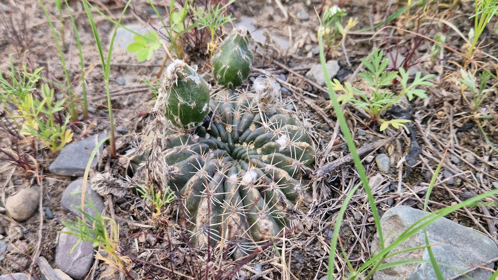
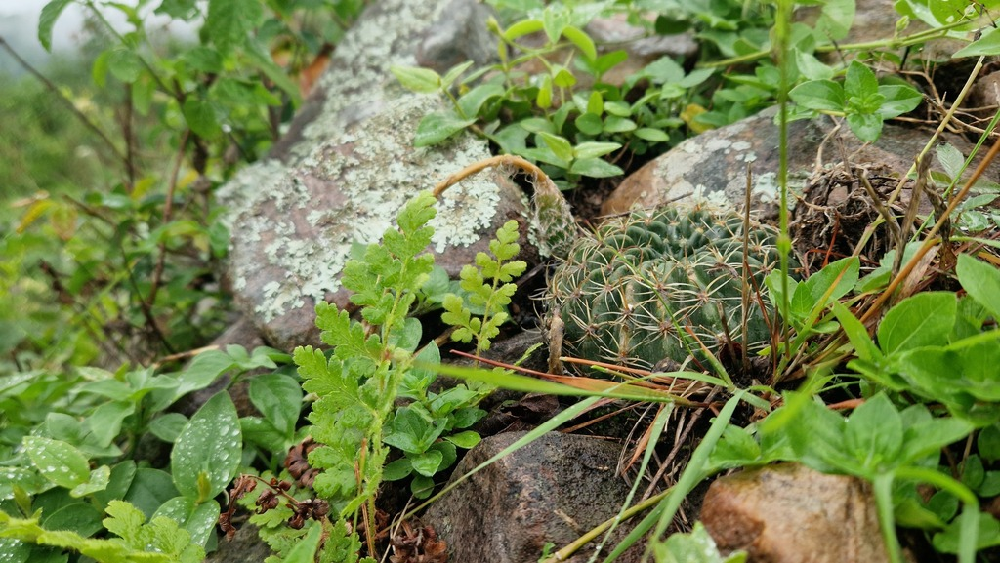
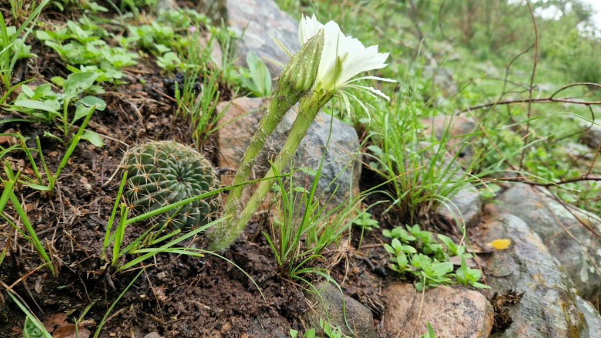
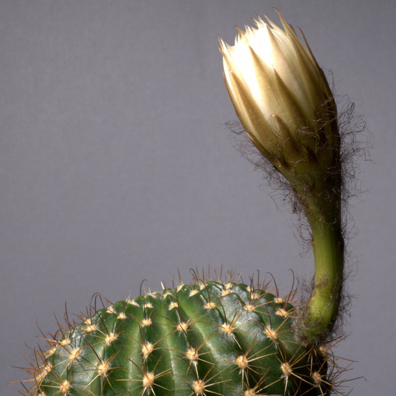
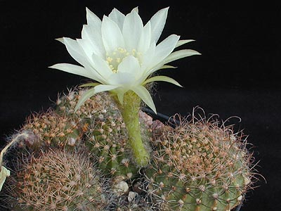
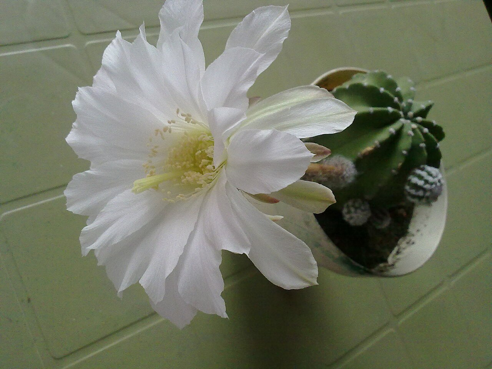
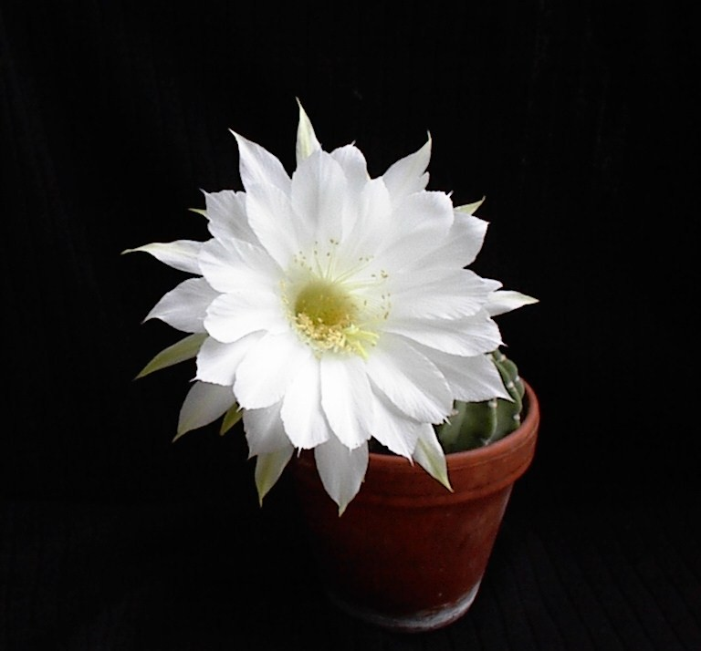

# Domino cactus photo archive

_Echinopsis subdenudata_ - Starter-06

Collection label ID: `D2`.

Species-reference photographs; current Kew taxonomy treats this name as a synonym of Echinopsis ancistrophora.

Collection research: [open the plant profile](../../../docs/plants/starter/echinopsis-subdenudata.md).

## Gallery

_habitat_ - [Echinopsis subdenudata in habitat](https://www.inaturalist.org/observations/105636198); no rights reserved; [CC0](https://creativecommons.org/publicdomain/zero/1.0/).

_habitat_ - [Echinopsis subdenudata in habitat](https://www.inaturalist.org/observations/248735155); no rights reserved; [CC0](https://creativecommons.org/publicdomain/zero/1.0/).

_habitat_ - [Echinopsis subdenudata in habitat](https://www.inaturalist.org/observations/248735156); no rights reserved; [CC0](https://creativecommons.org/publicdomain/zero/1.0/).

_habitat_ - [Echinopsis subdenudata in habitat](https://www.inaturalist.org/observations/254430126); no rights reserved; [CC0](https://creativecommons.org/publicdomain/zero/1.0/).

_habitat_ - [Echinopsis subdenudata in habitat](https://www.inaturalist.org/observations/254632391); no rights reserved; [CC0](https://creativecommons.org/publicdomain/zero/1.0/).

_habitat_ - [Echinopsis subdenudata in habitat](https://www.inaturalist.org/observations/254632392); no rights reserved; [CC0](https://creativecommons.org/publicdomain/zero/1.0/).

_habit_ - [IMG 5085-Echinopsis ancistrophora.jpg](https://commons.wikimedia.org/wiki/File:IMG_5085-Echinopsis_ancistrophora.jpg); C T Johansson; [CC BY 3.0](https://creativecommons.org/licenses/by/3.0).

_fruit-seed_ - [Echinopsis ancistrophora1MW.jpg](https://commons.wikimedia.org/wiki/File:Echinopsis_ancistrophora1MW.jpg); Mats Winberg; [CC BY-SA 2.5](https://creativecommons.org/licenses/by-sa/2.5).

_flower_ - [May29@628am.jpg](https://commons.wikimedia.org/wiki/File:May29@628am.jpg); Ligaya; [CC BY-SA 3.0](https://creativecommons.org/licenses/by-sa/3.0).

_detail_ - [Echinopsis subdenudata1UME.jpg](https://commons.wikimedia.org/wiki/File:Echinopsis_subdenudata1UME.jpg); Epibase; [CC BY 3.0](https://creativecommons.org/licenses/by/3.0).

## File details

| File                                                                                         | Subject    | Source                                                                                             | Creator            | License                                                        |
| -------------------------------------------------------------------------------------------- | ---------- | -------------------------------------------------------------------------------------------------- | ------------------ | -------------------------------------------------------------- |
| [inaturalist-105636198-177284355-habitat.jpg](./inaturalist-105636198-177284355-habitat.jpg) | habitat    | [iNaturalist](https://www.inaturalist.org/observations/105636198)                                  | no rights reserved | [CC0](https://creativecommons.org/publicdomain/zero/1.0/)      |
| [inaturalist-248735155-444505313-habitat.jpg](./inaturalist-248735155-444505313-habitat.jpg) | habitat    | [iNaturalist](https://www.inaturalist.org/observations/248735155)                                  | no rights reserved | [CC0](https://creativecommons.org/publicdomain/zero/1.0/)      |
| [inaturalist-248735156-444505357-habitat.jpg](./inaturalist-248735156-444505357-habitat.jpg) | habitat    | [iNaturalist](https://www.inaturalist.org/observations/248735156)                                  | no rights reserved | [CC0](https://creativecommons.org/publicdomain/zero/1.0/)      |
| [inaturalist-254430126-455732022-habitat.jpg](./inaturalist-254430126-455732022-habitat.jpg) | habitat    | [iNaturalist](https://www.inaturalist.org/observations/254430126)                                  | no rights reserved | [CC0](https://creativecommons.org/publicdomain/zero/1.0/)      |
| [inaturalist-254632391-456134937-habitat.jpg](./inaturalist-254632391-456134937-habitat.jpg) | habitat    | [iNaturalist](https://www.inaturalist.org/observations/254632391)                                  | no rights reserved | [CC0](https://creativecommons.org/publicdomain/zero/1.0/)      |
| [inaturalist-254632392-456134942-habitat.jpg](./inaturalist-254632392-456134942-habitat.jpg) | habitat    | [iNaturalist](https://www.inaturalist.org/observations/254632392)                                  | no rights reserved | [CC0](https://creativecommons.org/publicdomain/zero/1.0/)      |
| [commons-10241064-habit.jpg](./commons-10241064-habit.jpg)                                   | habit      | [Wikimedia Commons](https://commons.wikimedia.org/wiki/File:IMG_5085-Echinopsis_ancistrophora.jpg) | C T Johansson      | [CC BY 3.0](https://creativecommons.org/licenses/by/3.0)       |
| [commons-1445094-fruit-seed.jpg](./commons-1445094-fruit-seed.jpg)                           | fruit-seed | [Wikimedia Commons](https://commons.wikimedia.org/wiki/File:Echinopsis_ancistrophora1MW.jpg)       | Mats Winberg       | [CC BY-SA 2.5](https://creativecommons.org/licenses/by-sa/2.5) |
| [commons-15755677-flower.jpg](./commons-15755677-flower.jpg)                                 | flower     | [Wikimedia Commons](https://commons.wikimedia.org/wiki/File:May29@628am.jpg)                       | Ligaya             | [CC BY-SA 3.0](https://creativecommons.org/licenses/by-sa/3.0) |
| [commons-5813871-detail.jpg](./commons-5813871-detail.jpg)                                   | detail     | [Wikimedia Commons](https://commons.wikimedia.org/wiki/File:Echinopsis_subdenudata1UME.jpg)        | Epibase            | [CC BY 3.0](https://creativecommons.org/licenses/by/3.0)       |

Metadata and SHA-256 hashes are also available in [the global manifest](../photo-manifest.json).
