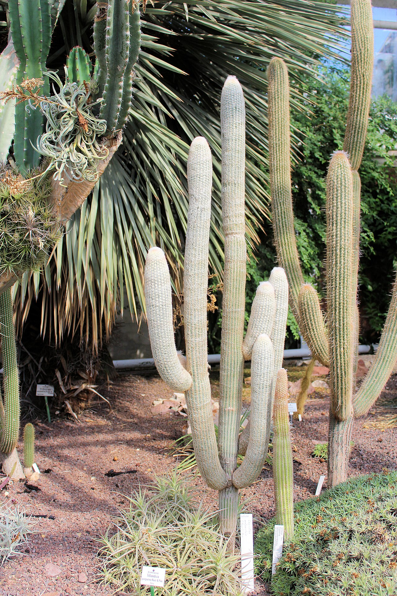
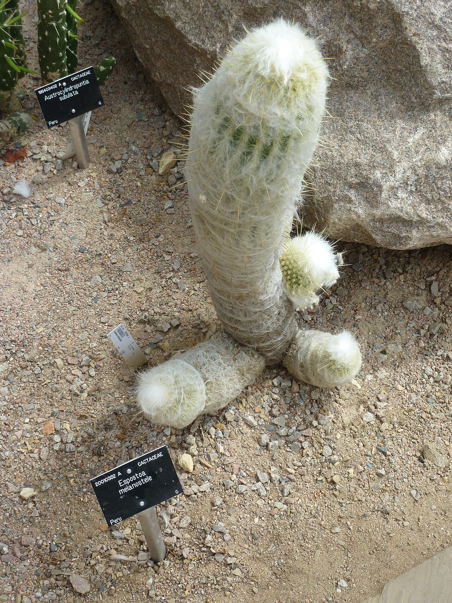
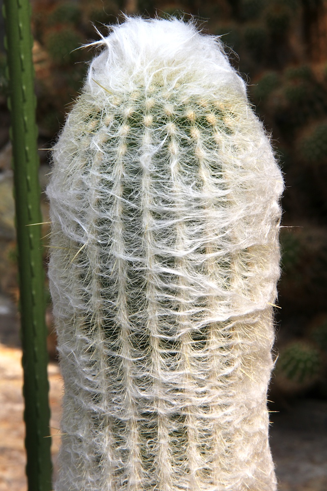
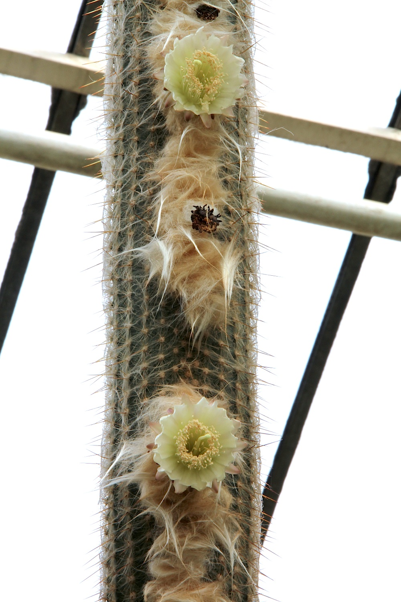
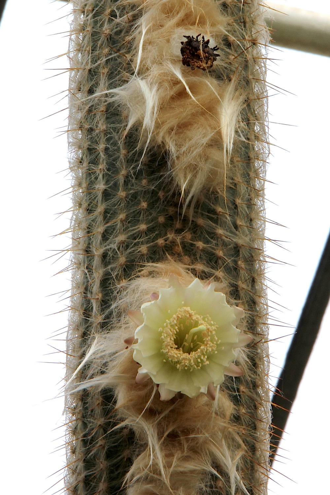
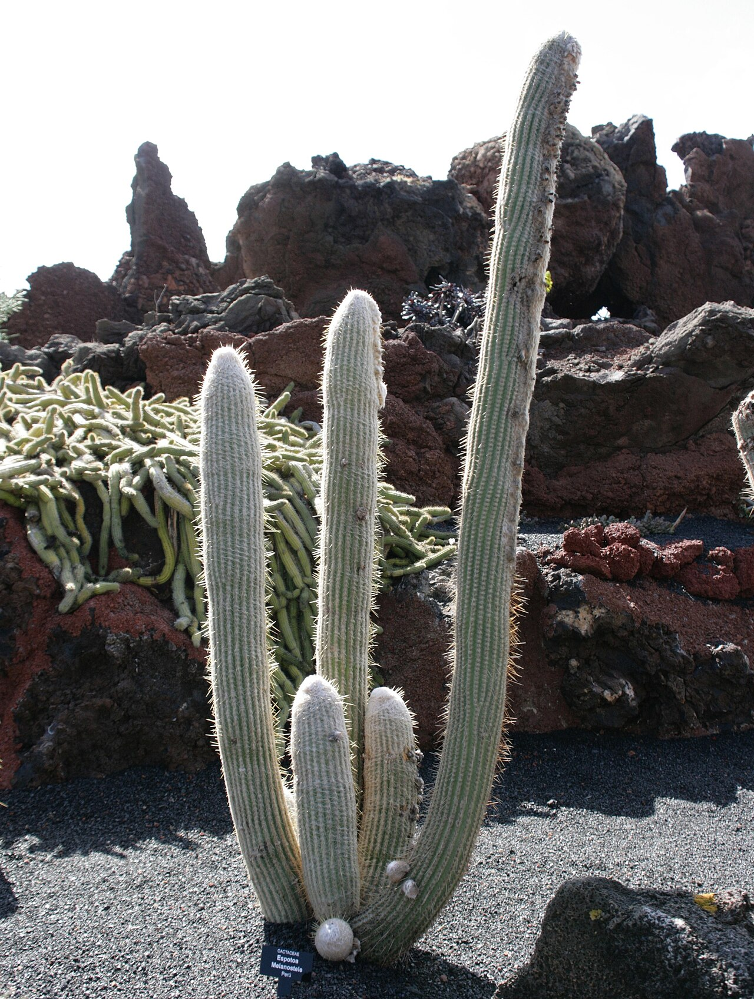
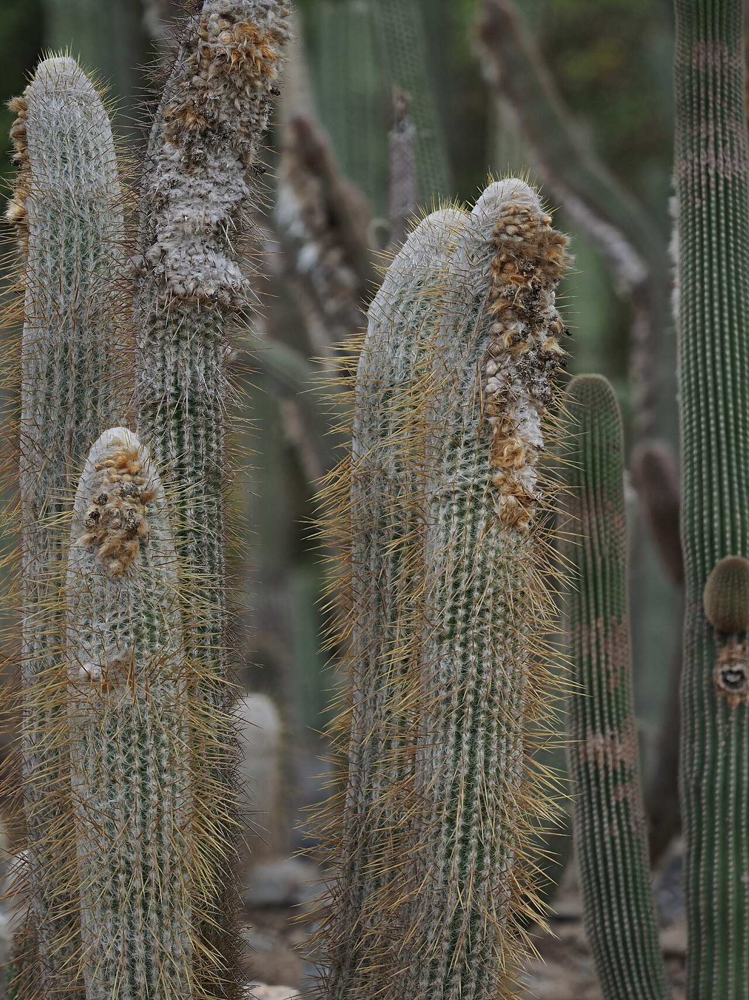
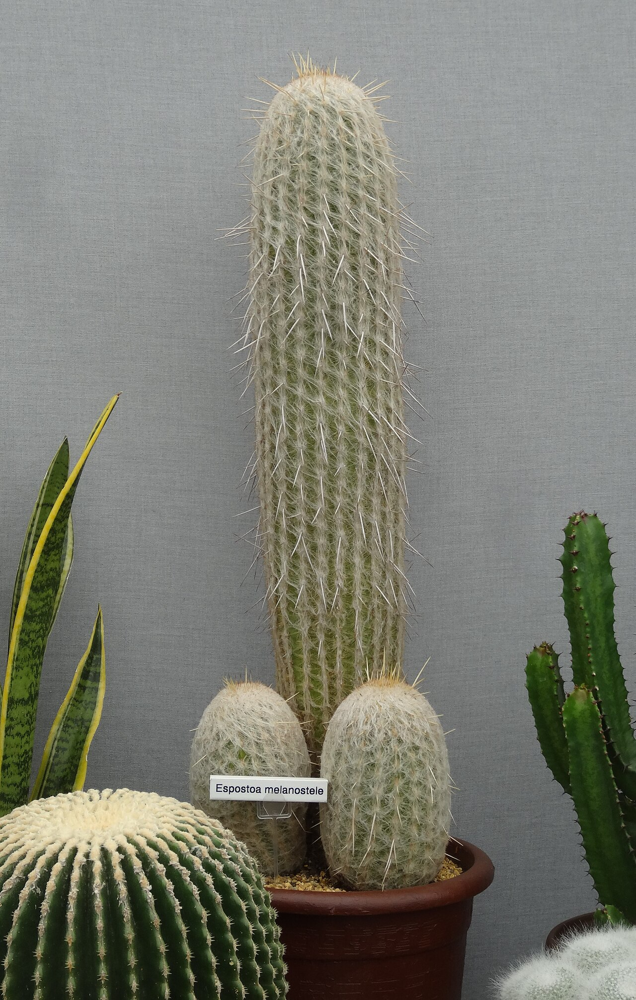

# Dwarf old man cactus photo archive

_Espostoa melanostele subsp. nana_ - Cactus-01

Collection label ID: `E1`.

Species-reference photographs; the collection ID is probable and E. lanata remains the main alternative.

Collection research: [open the plant profile](../../../docs/plants/cacti/espostoa-melanostele-nana.md).

## Gallery

_habit_ - [Halle (Saale), botanischer Garten, Espostoa melanostele.jpg](<https://commons.wikimedia.org/wiki/File:Halle_(Saale),_botanischer_Garten,_Espostoa_melanostele.jpg>); Dguendel; [CC BY 3.0](https://creativecommons.org/licenses/by/3.0).

_habit_ - [Espostoa melanostele (Cactaceae).JPG](<https://commons.wikimedia.org/wiki/File:Espostoa_melanostele_(Cactaceae).JPG>); Magnus Manske; [CC BY-SA 2.5](https://creativecommons.org/licenses/by-sa/2.5).

_habit_ - [Espostoa melanostele pm.jpg](https://commons.wikimedia.org/wiki/File:Espostoa_melanostele_pm.jpg); Peter A. Mansfeld; [CC BY 3.0](https://creativecommons.org/licenses/by/3.0).

_flower_ - [Espostoa melanostele pm01.jpg](https://commons.wikimedia.org/wiki/File:Espostoa_melanostele_pm01.jpg); Peter A. Mansfeld; [CC BY 3.0](https://creativecommons.org/licenses/by/3.0).

_flower_ - [Espostoa melanostele pm02.jpg](https://commons.wikimedia.org/wiki/File:Espostoa_melanostele_pm02.jpg); Peter A. Mansfeld; [CC BY 3.0](https://creativecommons.org/licenses/by/3.0).

_habit_ - [Teguise Guatiza - Jardin - Espostoa melanostele 01 ies.jpg](https://commons.wikimedia.org/wiki/File:Teguise_Guatiza_-_Jardin_-_Espostoa_melanostele_01_ies.jpg); Frank Vincentz; [CC BY-SA 3.0](https://creativecommons.org/licenses/by-sa/3.0).

_habitat_ - [Espostoa melanostele 27.jpeg](https://commons.wikimedia.org/wiki/File:Espostoa_melanostele_27.jpeg); Rosario; [CC BY 4.0](https://creativecommons.org/licenses/by/4.0).

_habit_ - [Espostoa melanostele at Hampton Court.jpg](https://commons.wikimedia.org/wiki/File:Espostoa_melanostele_at_Hampton_Court.jpg); Jonathan Cardy; [CC BY-SA 3.0](https://creativecommons.org/licenses/by-sa/3.0).

## File details

| File                                                             | Subject | Source                                                                                                                     | Creator           | License                                                        |
| ---------------------------------------------------------------- | ------- | -------------------------------------------------------------------------------------------------------------------------- | ----------------- | -------------------------------------------------------------- |
| [commons-109816186-habit.jpg](./commons-109816186-habit.jpg)     | habit   | [Wikimedia Commons](<https://commons.wikimedia.org/wiki/File:Halle_(Saale),_botanischer_Garten,_Espostoa_melanostele.jpg>) | Dguendel          | [CC BY 3.0](https://creativecommons.org/licenses/by/3.0)       |
| [commons-14283038-habit.jpg](./commons-14283038-habit.jpg)       | habit   | [Wikimedia Commons](<https://commons.wikimedia.org/wiki/File:Espostoa_melanostele_(Cactaceae).JPG>)                        | Magnus Manske     | [CC BY-SA 2.5](https://creativecommons.org/licenses/by-sa/2.5) |
| [commons-15293356-habit.jpg](./commons-15293356-habit.jpg)       | habit   | [Wikimedia Commons](https://commons.wikimedia.org/wiki/File:Espostoa_melanostele_pm.jpg)                                   | Peter A. Mansfeld | [CC BY 3.0](https://creativecommons.org/licenses/by/3.0)       |
| [commons-15599947-habit.jpg](./commons-15599947-habit.jpg)       | flower  | [Wikimedia Commons](https://commons.wikimedia.org/wiki/File:Espostoa_melanostele_pm01.jpg)                                 | Peter A. Mansfeld | [CC BY 3.0](https://creativecommons.org/licenses/by/3.0)       |
| [commons-15599956-habit.jpg](./commons-15599956-habit.jpg)       | flower  | [Wikimedia Commons](https://commons.wikimedia.org/wiki/File:Espostoa_melanostele_pm02.jpg)                                 | Peter A. Mansfeld | [CC BY 3.0](https://creativecommons.org/licenses/by/3.0)       |
| [commons-17107946-habit.jpg](./commons-17107946-habit.jpg)       | habit   | [Wikimedia Commons](https://commons.wikimedia.org/wiki/File:Teguise_Guatiza_-_Jardin_-_Espostoa_melanostele_01_ies.jpg)    | Frank Vincentz    | [CC BY-SA 3.0](https://creativecommons.org/licenses/by-sa/3.0) |
| [commons-181980248-habitat.jpg](./commons-181980248-habitat.jpg) | habitat | [Wikimedia Commons](https://commons.wikimedia.org/wiki/File:Espostoa_melanostele_27.jpeg)                                  | Rosario           | [CC BY 4.0](https://creativecommons.org/licenses/by/4.0)       |
| [commons-50015370-flower.jpg](./commons-50015370-flower.jpg)     | habit   | [Wikimedia Commons](https://commons.wikimedia.org/wiki/File:Espostoa_melanostele_at_Hampton_Court.jpg)                     | Jonathan Cardy    | [CC BY-SA 3.0](https://creativecommons.org/licenses/by-sa/3.0) |

Metadata and SHA-256 hashes are also available in [the global manifest](../photo-manifest.json).
