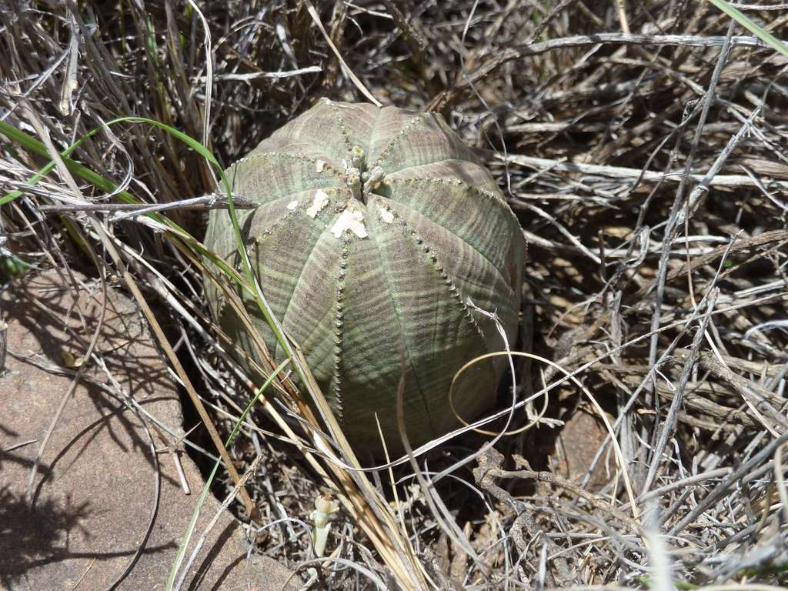
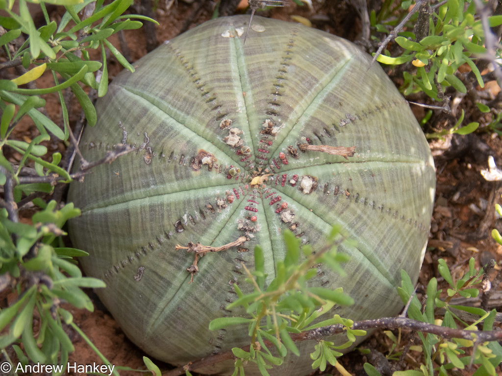
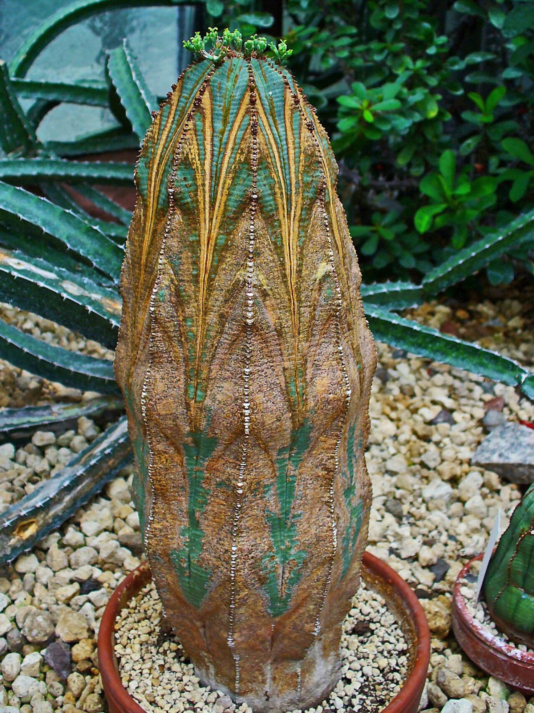
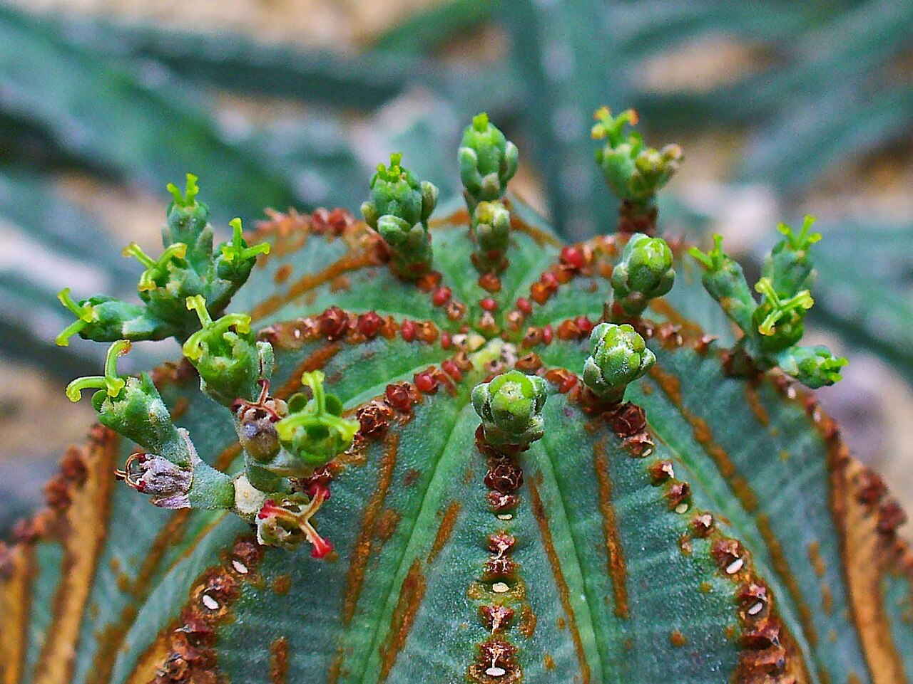
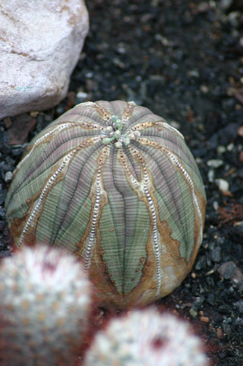
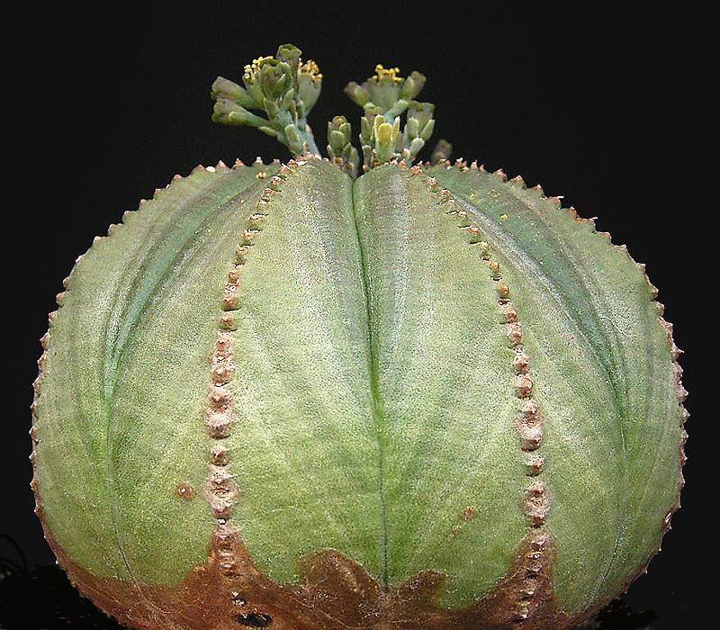

# Dragon's Egg photo archive

*Euphorbia obesa* - Starter-11

Species-reference photographs; the collection plant is probably an E. obesa-type hybrid or selection rather than a documented wild form.

Collection research: [open the plant profile](../../../docs/plants/starter/euphorbia-obesa-hybrid.md).

## Gallery

*habitat* - [Euphorbia obesa in habitat](<https://www.inaturalist.org/observations/10791798>); (c) Andrew Hankey, some rights reserved (CC BY-SA); [CC BY SA](<https://creativecommons.org/licenses/by/4.0/>).

*habitat* - [Euphorbia obesa in habitat](<https://www.inaturalist.org/observations/218854729>); (c) Andrew Hankey, some rights reserved (CC BY-SA); [CC BY SA](<https://creativecommons.org/licenses/by/4.0/>).

*habit* - [Euphorbia obesa 001.JPG](<https://commons.wikimedia.org/wiki/File:Euphorbia_obesa_001.JPG>); H. Zell; [CC BY-SA 3.0](<https://creativecommons.org/licenses/by-sa/3.0>).

*flower* - [Euphorbia obesa 002.JPG](<https://commons.wikimedia.org/wiki/File:Euphorbia_obesa_002.JPG>); H. Zell; [CC BY-SA 3.0](<https://creativecommons.org/licenses/by-sa/3.0>).

*habitat* - [Euphorbia obesa 3.jpg](<https://commons.wikimedia.org/wiki/File:Euphorbia_obesa_3.jpg>); Ryan Somma; [CC BY-SA 2.0](<https://creativecommons.org/licenses/by-sa/2.0>).

*habit* - [E obesa obesa ies.jpg](<https://commons.wikimedia.org/wiki/File:E_obesa_obesa_ies.jpg>); Frank Vincentz; [CC BY-SA 3.0](<http://creativecommons.org/licenses/by-sa/3.0/>).

## File details

| File | Subject | Source | Creator | License |
| --- | --- | --- | --- | --- |
| [inaturalist-10791798-15102244-habitat.jpg](./inaturalist-10791798-15102244-habitat.jpg) | habitat | [iNaturalist](<https://www.inaturalist.org/observations/10791798>) | (c) Andrew Hankey, some rights reserved (CC BY-SA) | [CC BY SA](<https://creativecommons.org/licenses/by/4.0/>) |
| [inaturalist-218854729-387317835-habitat.jpg](./inaturalist-218854729-387317835-habitat.jpg) | habitat | [iNaturalist](<https://www.inaturalist.org/observations/218854729>) | (c) Andrew Hankey, some rights reserved (CC BY-SA) | [CC BY SA](<https://creativecommons.org/licenses/by/4.0/>) |
| [commons-10015952-habit.jpg](./commons-10015952-habit.jpg) | habit | [Wikimedia Commons](<https://commons.wikimedia.org/wiki/File:Euphorbia_obesa_001.JPG>) | H. Zell | [CC BY-SA 3.0](<https://creativecommons.org/licenses/by-sa/3.0>) |
| [commons-10015978-flower.jpg](./commons-10015978-flower.jpg) | flower | [Wikimedia Commons](<https://commons.wikimedia.org/wiki/File:Euphorbia_obesa_002.JPG>) | H. Zell | [CC BY-SA 3.0](<https://creativecommons.org/licenses/by-sa/3.0>) |
| [commons-11506691-habitat.jpg](./commons-11506691-habitat.jpg) | habitat | [Wikimedia Commons](<https://commons.wikimedia.org/wiki/File:Euphorbia_obesa_3.jpg>) | Ryan Somma | [CC BY-SA 2.0](<https://creativecommons.org/licenses/by-sa/2.0>) |
| [commons-1353582-habit.jpg](./commons-1353582-habit.jpg) | habit | [Wikimedia Commons](<https://commons.wikimedia.org/wiki/File:E_obesa_obesa_ies.jpg>) | Frank Vincentz | [CC BY-SA 3.0](<http://creativecommons.org/licenses/by-sa/3.0/>) |

Metadata and SHA-256 hashes are also available in [the global manifest](../photo-manifest.json).
