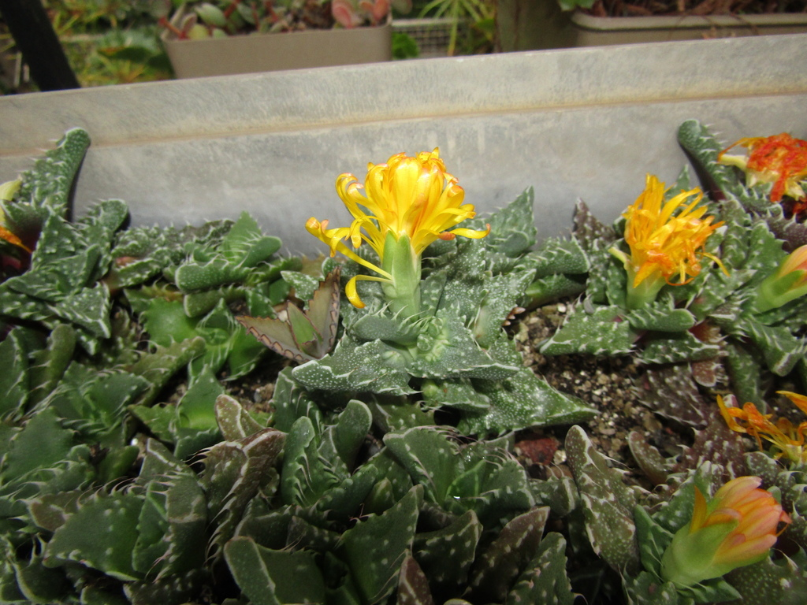
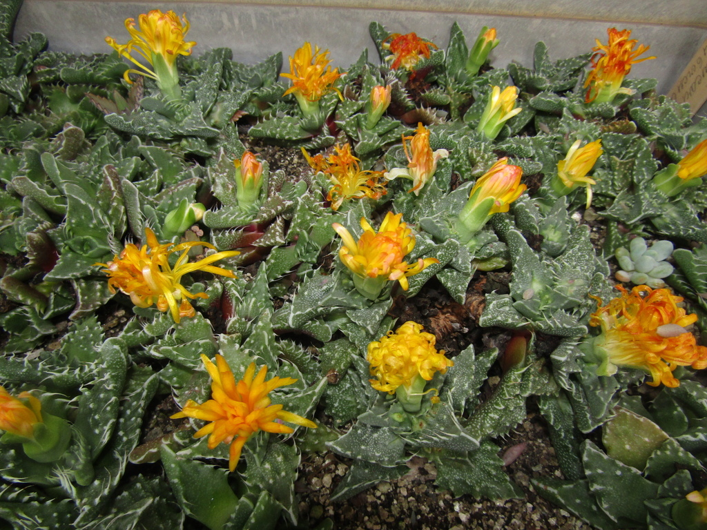
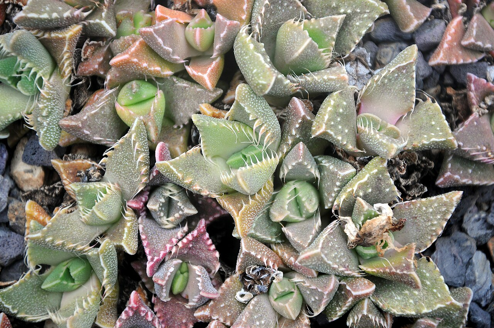
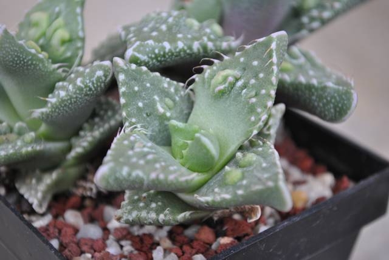
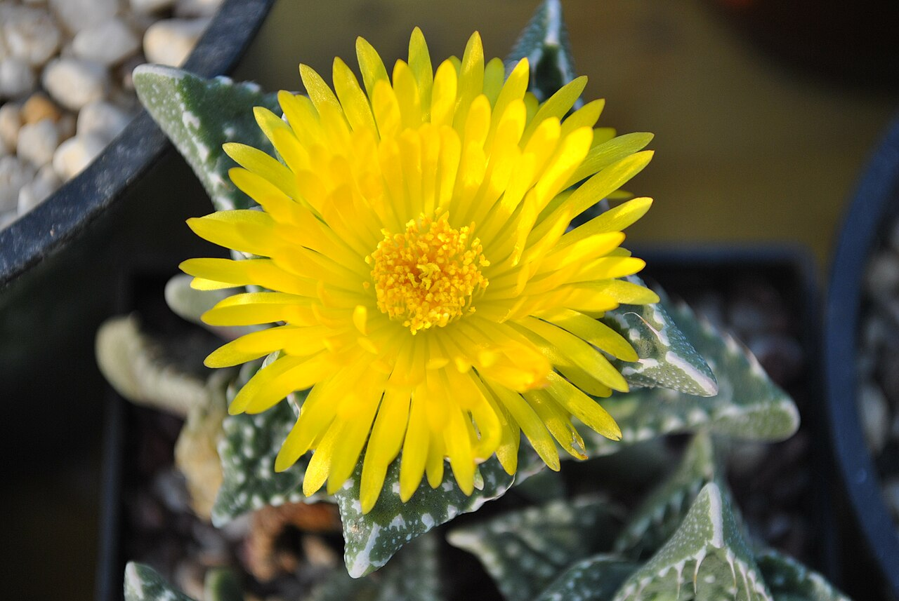
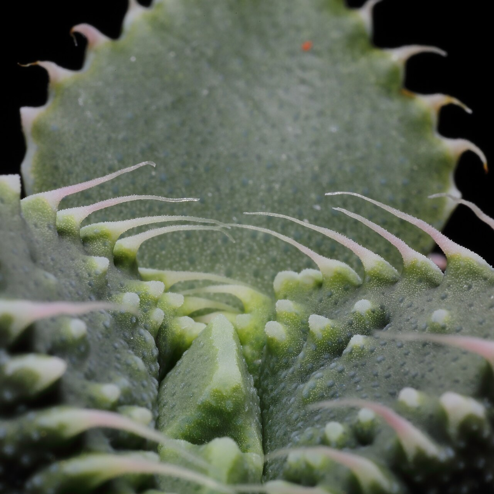
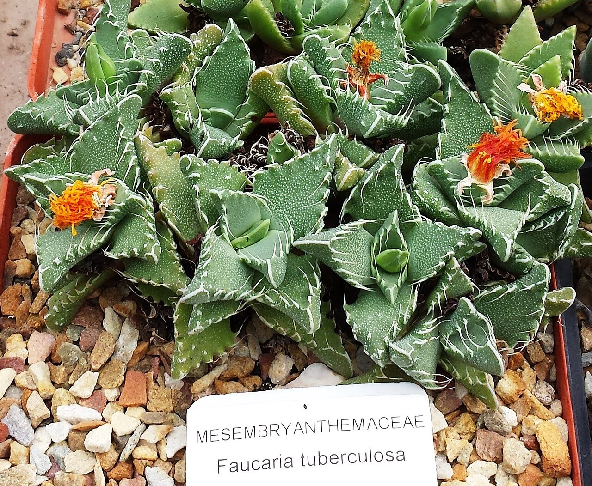
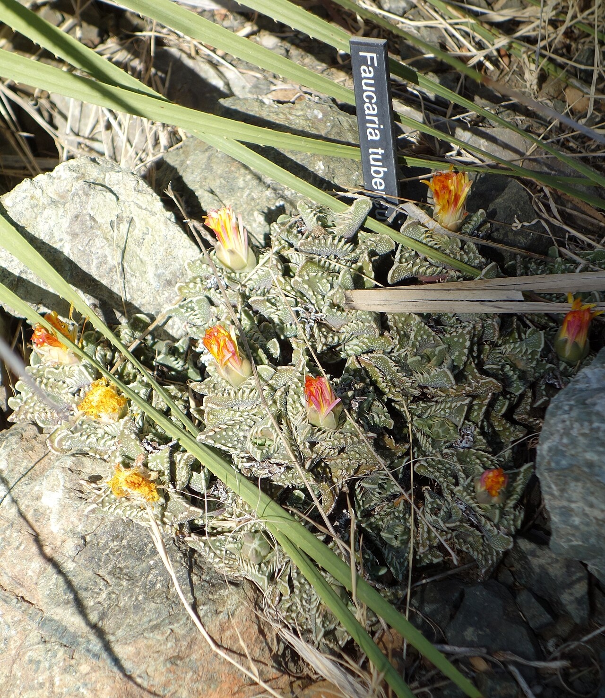
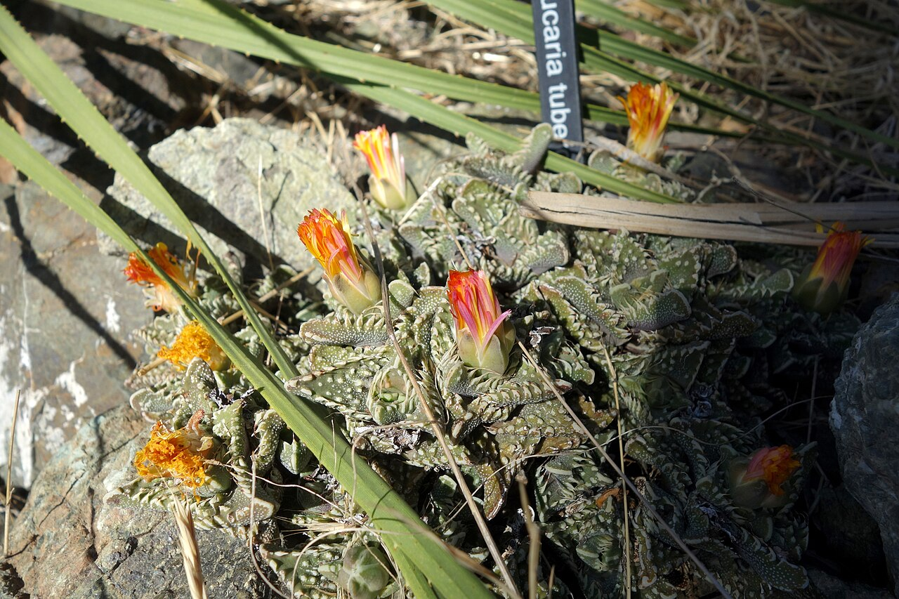
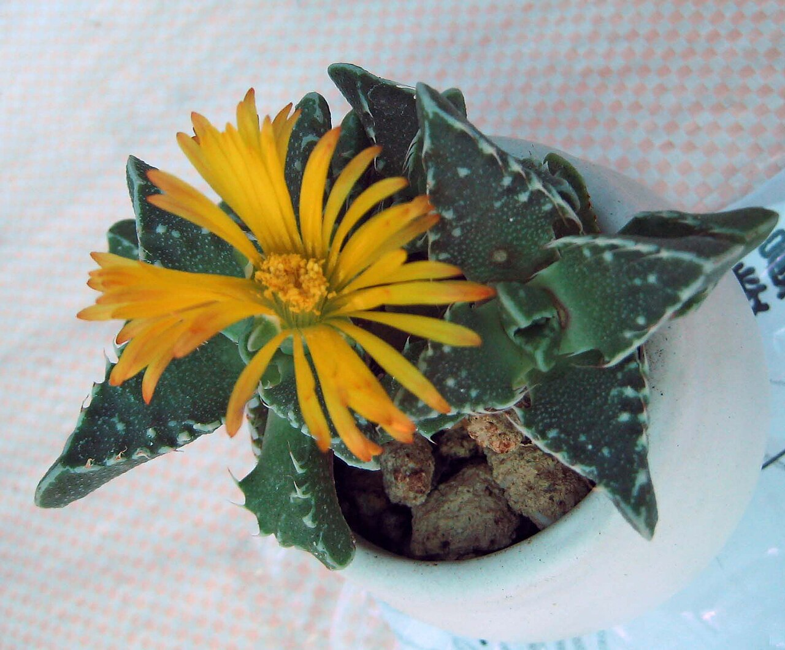

# Tuberculate tiger jaws photo archive

_Faucaria tuberculosa_ - Succulent-09

Collection label ID: `#5`.

Species-reference photographs for the probable Faucaria tuberculosa identification, including casual-grade cultivated iNaturalist observations. Community photo identifications and reference images do not confirm the collection plant identity.

Collection research: [open the plant profile](../../../docs/plants/succulents/faucaria-tuberculosa.md).

## Gallery

_habit_ - [Faucaria tuberculosa reference observation](https://www.inaturalist.org/observations/142447642); (c) Oleksandr Shynder, some rights reserved (CC BY); [CC BY](https://creativecommons.org/licenses/by/4.0/).

_habit_ - [Faucaria tuberculosa reference observation](https://www.inaturalist.org/observations/142447642); (c) Oleksandr Shynder, some rights reserved (CC BY); [CC BY](https://creativecommons.org/licenses/by/4.0/).

_habit_ - [Faucaria tuberculosa 001.jpg](https://commons.wikimedia.org/wiki/File:Faucaria_tuberculosa_001.jpg); Amada44; [CC BY 3.0](https://creativecommons.org/licenses/by/3.0).

_habit_ - [Faucaria tuberculosa.jpg](https://commons.wikimedia.org/wiki/File:Faucaria_tuberculosa.jpg); AstroKaktus; [CC BY-SA 3.0](https://creativecommons.org/licenses/by-sa/3.0).

_flower_ - [Faucaria tuberculosa flower.jpg](https://commons.wikimedia.org/wiki/File:Faucaria_tuberculosa_flower.jpg); Matjaž Wigele; [CC BY-SA 3.0](https://creativecommons.org/licenses/by-sa/3.0).

_habit_ - [Faucaria tuberculosa 4929.JPG](https://commons.wikimedia.org/wiki/File:Faucaria_tuberculosa_4929.JPG); C T Johansson; [CC BY-SA 3.0](https://creativecommons.org/licenses/by-sa/3.0).

_habit_ - [Faucaria tuberculosa - RSA 5.jpg](https://commons.wikimedia.org/wiki/File:Faucaria_tuberculosa_-_RSA_5.jpg); Abu Shawka; [CC0](https://creativecommons.org/publicdomain/zero/1.0/deed.en).

_flower_ - [Faucaria tuberculosa - Leaning Pine Arboretum - DSC05565.JPG](https://commons.wikimedia.org/wiki/File:Faucaria_tuberculosa_-_Leaning_Pine_Arboretum_-_DSC05565.JPG); Daderot; [CC0](https://creativecommons.org/publicdomain/zero/1.0/deed.en).

_flower_ - [Faucaria tuberculosa - Leaning Pine Arboretum - DSC05567.JPG](https://commons.wikimedia.org/wiki/File:Faucaria_tuberculosa_-_Leaning_Pine_Arboretum_-_DSC05567.JPG); Daderot; [CC0](https://creativecommons.org/publicdomain/zero/1.0/deed.en).

_flower_ - [荒波 Faucaria tuberculosa -香港北區花鳥蟲魚展 North District Flower Show, Hong Kong- (9213335475).jpg](<https://commons.wikimedia.org/wiki/File:%E8%8D%92%E6%B3%A2_Faucaria_tuberculosa_-%E9%A6%99%E6%B8%AF%E5%8C%97%E5%8D%80%E8%8A%B1%E9%B3%A5%E8%9F%B2%E9%AD%9A%E5%B1%95_North_District_Flower_Show,_Hong_Kong-_(9213335475).jpg>); 阿橋 HQ; [CC BY-SA 2.0](https://creativecommons.org/licenses/by-sa/2.0).

## File details

| File                                                                                         | Subject | Source                                                                                                                                                                                                                                            | Creator                                             | License                                                          |
| -------------------------------------------------------------------------------------------- | ------- | ------------------------------------------------------------------------------------------------------------------------------------------------------------------------------------------------------------------------------------------------- | --------------------------------------------------- | ---------------------------------------------------------------- |
| [inaturalist-142447642-244209411-habitat.jpg](./inaturalist-142447642-244209411-habitat.jpg) | habit   | [iNaturalist](https://www.inaturalist.org/observations/142447642)                                                                                                                                                                                 | (c) Oleksandr Shynder, some rights reserved (CC BY) | [CC BY](https://creativecommons.org/licenses/by/4.0/)            |
| [inaturalist-142447642-244209419-habitat.jpg](./inaturalist-142447642-244209419-habitat.jpg) | habit   | [iNaturalist](https://www.inaturalist.org/observations/142447642)                                                                                                                                                                                 | (c) Oleksandr Shynder, some rights reserved (CC BY) | [CC BY](https://creativecommons.org/licenses/by/4.0/)            |
| [commons-15224700-habit.jpg](./commons-15224700-habit.jpg)                                   | habit   | [Wikimedia Commons](https://commons.wikimedia.org/wiki/File:Faucaria_tuberculosa_001.jpg)                                                                                                                                                         | Amada44                                             | [CC BY 3.0](https://creativecommons.org/licenses/by/3.0)         |
| [commons-17620570-habit.jpg](./commons-17620570-habit.jpg)                                   | habit   | [Wikimedia Commons](https://commons.wikimedia.org/wiki/File:Faucaria_tuberculosa.jpg)                                                                                                                                                             | AstroKaktus                                         | [CC BY-SA 3.0](https://creativecommons.org/licenses/by-sa/3.0)   |
| [commons-18117770-flower.jpg](./commons-18117770-flower.jpg)                                 | flower  | [Wikimedia Commons](https://commons.wikimedia.org/wiki/File:Faucaria_tuberculosa_flower.jpg)                                                                                                                                                      | Matjaž Wigele                                       | [CC BY-SA 3.0](https://creativecommons.org/licenses/by-sa/3.0)   |
| [commons-30675260-habit.jpg](./commons-30675260-habit.jpg)                                   | habit   | [Wikimedia Commons](https://commons.wikimedia.org/wiki/File:Faucaria_tuberculosa_4929.JPG)                                                                                                                                                        | C T Johansson                                       | [CC BY-SA 3.0](https://creativecommons.org/licenses/by-sa/3.0)   |
| [commons-32710395-habit.jpg](./commons-32710395-habit.jpg)                                   | habit   | [Wikimedia Commons](https://commons.wikimedia.org/wiki/File:Faucaria_tuberculosa_-_RSA_5.jpg)                                                                                                                                                     | Abu Shawka                                          | [CC0](https://creativecommons.org/publicdomain/zero/1.0/deed.en) |
| [commons-37667916-habit.jpg](./commons-37667916-habit.jpg)                                   | flower  | [Wikimedia Commons](https://commons.wikimedia.org/wiki/File:Faucaria_tuberculosa_-_Leaning_Pine_Arboretum_-_DSC05565.JPG)                                                                                                                         | Daderot                                             | [CC0](https://creativecommons.org/publicdomain/zero/1.0/deed.en) |
| [commons-37667917-habit.jpg](./commons-37667917-habit.jpg)                                   | flower  | [Wikimedia Commons](https://commons.wikimedia.org/wiki/File:Faucaria_tuberculosa_-_Leaning_Pine_Arboretum_-_DSC05567.JPG)                                                                                                                         | Daderot                                             | [CC0](https://creativecommons.org/publicdomain/zero/1.0/deed.en) |
| [commons-91926669-flower.jpg](./commons-91926669-flower.jpg)                                 | flower  | [Wikimedia Commons](<https://commons.wikimedia.org/wiki/File:%E8%8D%92%E6%B3%A2_Faucaria_tuberculosa_-%E9%A6%99%E6%B8%AF%E5%8C%97%E5%8D%80%E8%8A%B1%E9%B3%A5%E8%9F%B2%E9%AD%9A%E5%B1%95_North_District_Flower_Show,_Hong_Kong-_(9213335475).jpg>) | 阿橋 HQ                                             | [CC BY-SA 2.0](https://creativecommons.org/licenses/by-sa/2.0)   |

Metadata and SHA-256 hashes are also available in [the global manifest](../photo-manifest.json).
