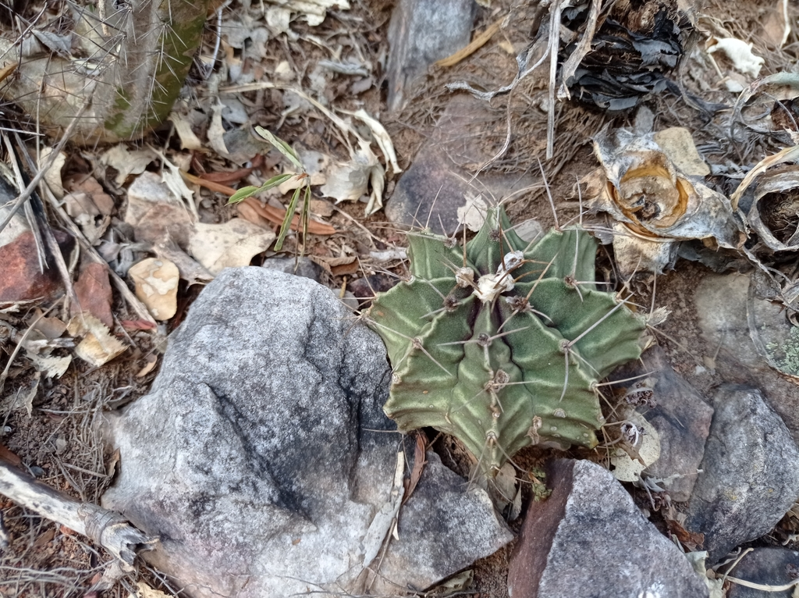
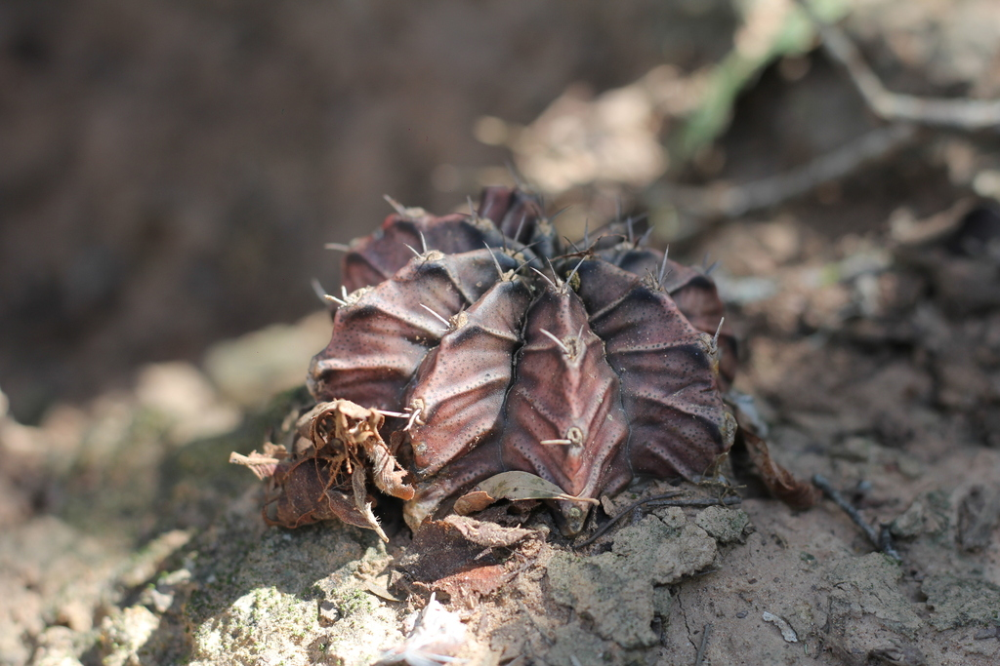
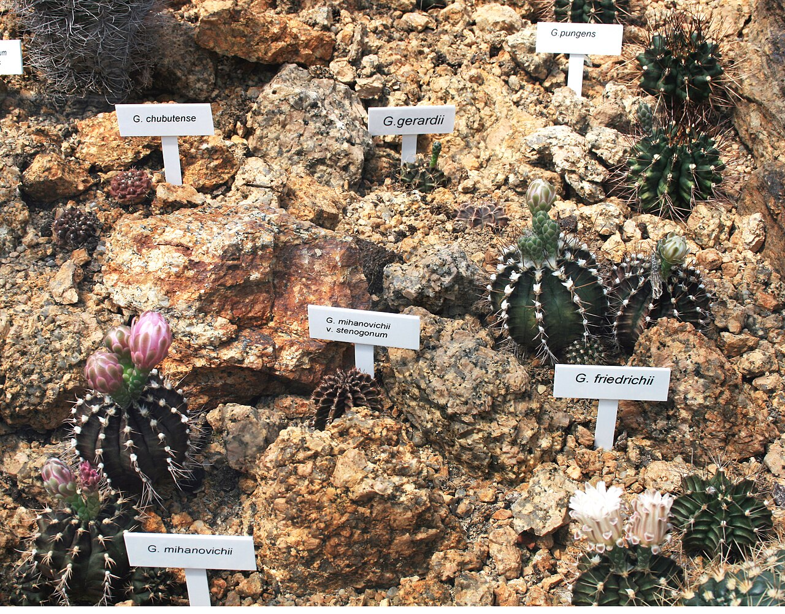
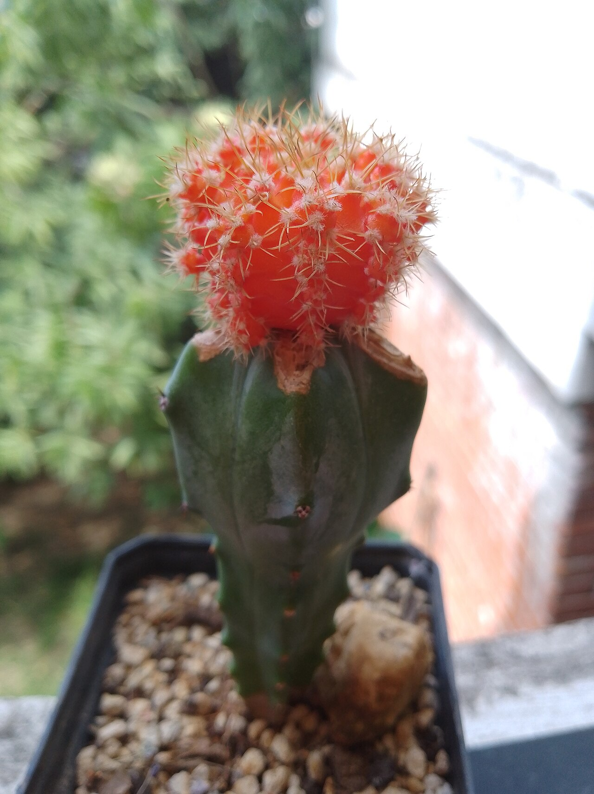
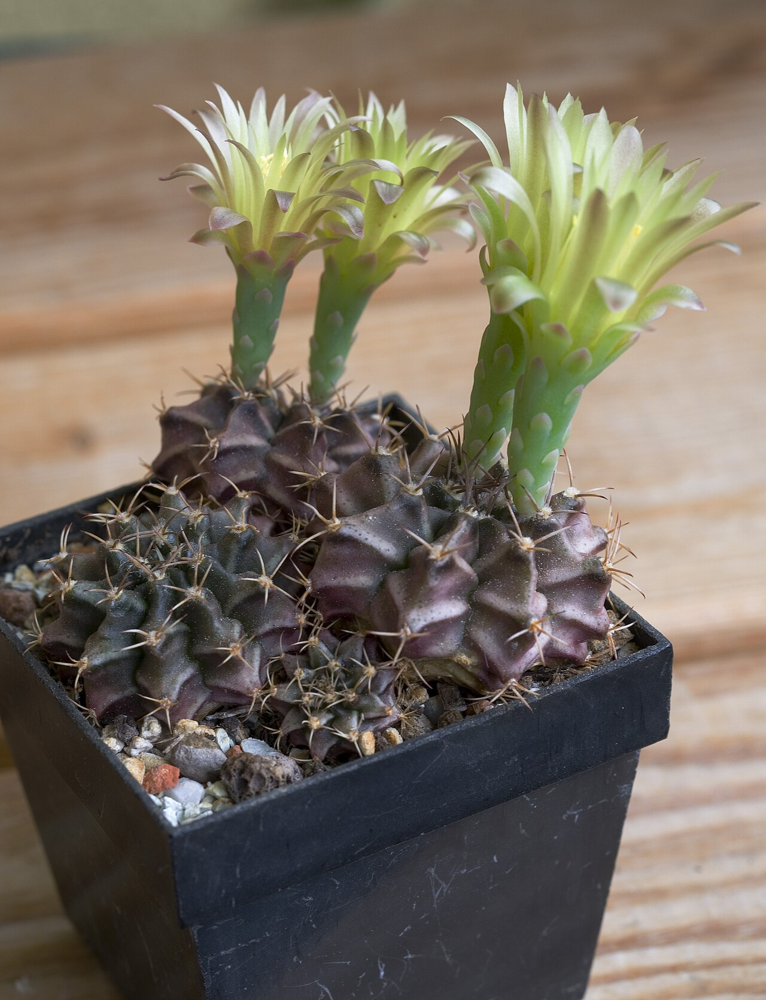
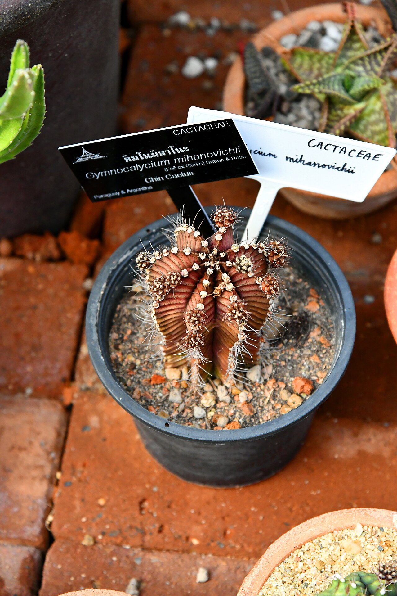

# Black Widow chin cactus photo archive

_Gymnocalycium mihanovichii_ - Cactus-09

Collection label ID: `G3`.

Variegated and normal species references, including cultivated observations; no reusable image is assumed to show the exact Black Widow cultivar.

Collection research: [open the plant profile](../../../docs/plants/cacti/gymnocalycium-mihanovichii-black-widow.md).

## Gallery

_habitat_ - [Gymnocalycium mihanovichii reference observation](https://www.inaturalist.org/observations/119400162); (c) Luis Recalde, some rights reserved (CC BY); [CC BY](https://creativecommons.org/licenses/by/4.0/).

_habitat_ - [Gymnocalycium mihanovichii reference observation](https://www.inaturalist.org/observations/168842048); (c) Romi Galeota Lencina, some rights reserved (CC BY); [CC BY](https://creativecommons.org/licenses/by/4.0/).

_habit_ - [Gymnocalycium Liberec 1.jpg](https://commons.wikimedia.org/wiki/File:Gymnocalycium_Liberec_1.jpg); Karelj; [Public domain](https://creativecommons.org/publicdomain/zero/1.0/).

_habit_ - [Cactus rojo.jpg](https://commons.wikimedia.org/wiki/File:Cactus_rojo.jpg); Barracudema; [CC BY 4.0](https://creativecommons.org/licenses/by/4.0).

_flower_ - [GymnocalyciumMihanovichii.jpg](https://commons.wikimedia.org/wiki/File:GymnocalyciumMihanovichii.jpg); Petr Vodička; [CC BY-SA 4.0](https://creativecommons.org/licenses/by-sa/4.0).

_detail_ - [Cactaceae in Suan Luang Rama 9 Photographed by Trisorn Triboon (58).jpg](<https://commons.wikimedia.org/wiki/File:Cactaceae_in_Suan_Luang_Rama_9_Photographed_by_Trisorn_Triboon_(58).jpg>); Tris T7; [CC BY 3.0](https://creativecommons.org/licenses/by/3.0).

## File details

| File                                                                                         | Subject | Source                                                                                                                                 | Creator                                                | License                                                             |
| -------------------------------------------------------------------------------------------- | ------- | -------------------------------------------------------------------------------------------------------------------------------------- | ------------------------------------------------------ | ------------------------------------------------------------------- |
| [inaturalist-119400162-201837434-habitat.jpg](./inaturalist-119400162-201837434-habitat.jpg) | habitat | [iNaturalist](https://www.inaturalist.org/observations/119400162)                                                                      | (c) Luis Recalde, some rights reserved (CC BY)         | [CC BY](https://creativecommons.org/licenses/by/4.0/)               |
| [inaturalist-168842048-292657179-habitat.jpg](./inaturalist-168842048-292657179-habitat.jpg) | habitat | [iNaturalist](https://www.inaturalist.org/observations/168842048)                                                                      | (c) Romi Galeota Lencina, some rights reserved (CC BY) | [CC BY](https://creativecommons.org/licenses/by/4.0/)               |
| [commons-12352443-habit.jpg](./commons-12352443-habit.jpg)                                   | habit   | [Wikimedia Commons](https://commons.wikimedia.org/wiki/File:Gymnocalycium_Liberec_1.jpg)                                               | Karelj                                                 | [Public domain](https://creativecommons.org/publicdomain/zero/1.0/) |
| [commons-138652485-habit.jpg](./commons-138652485-habit.jpg)                                 | habit   | [Wikimedia Commons](https://commons.wikimedia.org/wiki/File:Cactus_rojo.jpg)                                                           | Barracudema                                            | [CC BY 4.0](https://creativecommons.org/licenses/by/4.0)            |
| [commons-160386883-flower.jpg](./commons-160386883-flower.jpg)                               | flower  | [Wikimedia Commons](https://commons.wikimedia.org/wiki/File:GymnocalyciumMihanovichii.jpg)                                             | Petr Vodička                                           | [CC BY-SA 4.0](https://creativecommons.org/licenses/by-sa/4.0)      |
| [commons-74976671-detail.jpg](./commons-74976671-detail.jpg)                                 | detail  | [Wikimedia Commons](<https://commons.wikimedia.org/wiki/File:Cactaceae_in_Suan_Luang_Rama_9_Photographed_by_Trisorn_Triboon_(58).jpg>) | Tris T7                                                | [CC BY 3.0](https://creativecommons.org/licenses/by/3.0)            |

Metadata and SHA-256 hashes are also available in [the global manifest](../photo-manifest.json).
