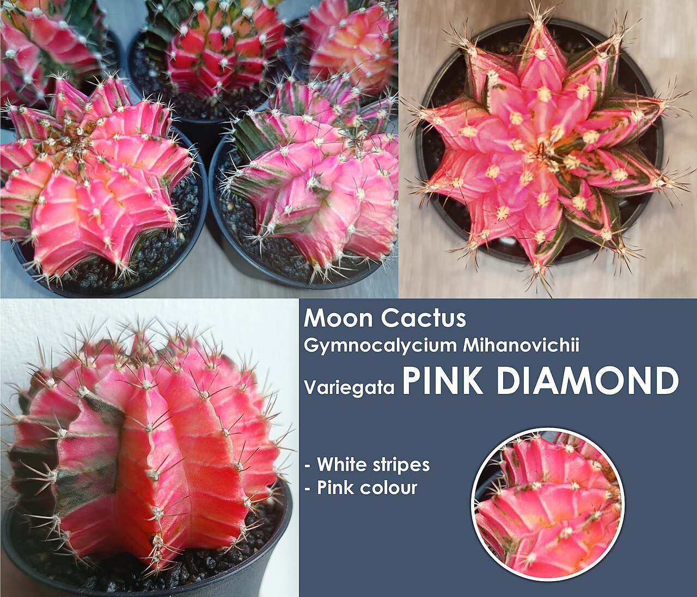
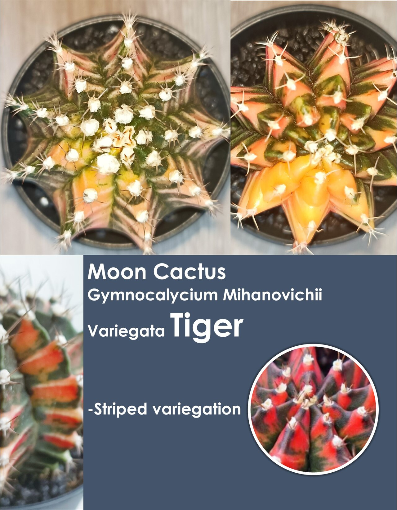
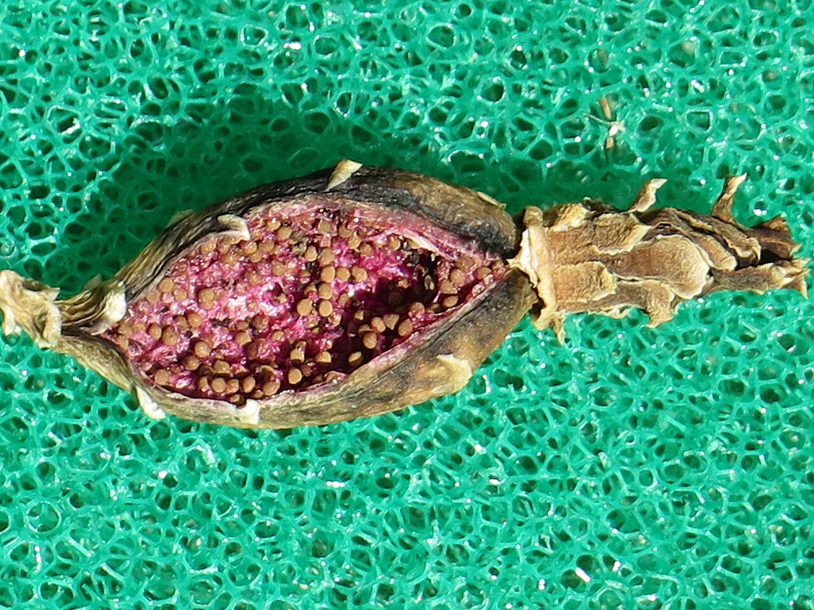

# Variegated moon cactus photo archive

_Gymnocalycium mihanovichii_ - Starter-07

Collection label ID: `A1`.

Own-root variegated examples are prioritized; normal wild forms remain as species context. Grafted chlorophyll-free scions are excluded.

Collection research: [open the plant profile](../../../docs/plants/starter/gymnocalycium-mihanovichii-variegated.md).

## Gallery

_habitat_ - [Gymnocalycium mihanovichii in habitat](https://www.inaturalist.org/observations/119400346); (c) Luis Recalde, some rights reserved (CC BY); [CC BY](https://creativecommons.org/licenses/by/4.0/).

_habitat_ - [Gymnocalycium mihanovichii in habitat](https://www.inaturalist.org/observations/121571564); (c) Luis Recalde, some rights reserved (CC BY); [CC BY](https://creativecommons.org/licenses/by/4.0/).

_flower_ - [Moon Cactus Gymnocalycium Mihanovichii Variegata Lady Star.jpg](https://commons.wikimedia.org/wiki/File:Moon_Cactus_Gymnocalycium_Mihanovichii_Variegata_Lady_Star.jpg); CactusManHere; [CC BY-SA 4.0](https://creativecommons.org/licenses/by-sa/4.0).

_habit_ - [Moon Cactus Gymnocalycium Mihanovichii Variegata Pink Diamond.jpg](https://commons.wikimedia.org/wiki/File:Moon_Cactus_Gymnocalycium_Mihanovichii_Variegata_Pink_Diamond.jpg); CactusManHere; [CC BY-SA 4.0](https://creativecommons.org/licenses/by-sa/4.0).

_habit_ - [Moon Cactus Gymnocalycium Mihanovichii Variegata Tiger.jpg](https://commons.wikimedia.org/wiki/File:Moon_Cactus_Gymnocalycium_Mihanovichii_Variegata_Tiger.jpg); CactusManHere; [CC BY-SA 4.0](https://creativecommons.org/licenses/by-sa/4.0).

_detail_ - [Moon Cactus Gymnocalycium Mihanovichii Variegata Fortie.jpg](https://commons.wikimedia.org/wiki/File:Moon_Cactus_Gymnocalycium_Mihanovichii_Variegata_Fortie.jpg); CactusManHere; [CC BY-SA 4.0](https://creativecommons.org/licenses/by-sa/4.0).

_flower_ - [仙人掌-緋牡丹錦 Gymnocalycium mihanovichii variegata -香港公園 Hong Kong Park- (9216072982).jpg](<https://commons.wikimedia.org/wiki/File:%E4%BB%99%E4%BA%BA%E6%8E%8C-%E7%B7%8B%E7%89%A1%E4%B8%B9%E9%8C%A6_Gymnocalycium_mihanovichii_variegata_-%E9%A6%99%E6%B8%AF%E5%85%AC%E5%9C%92_Hong_Kong_Park-_(9216072982).jpg>); 阿橋 HQ; [CC BY-SA 2.0](https://creativecommons.org/licenses/by-sa/2.0).

_fruit-seed_ - [Gymnocalycium mihanovichii 60.JPG](https://commons.wikimedia.org/wiki/File:Gymnocalycium_mihanovichii_60.JPG); Petar43; [CC BY-SA 4.0](https://creativecommons.org/licenses/by-sa/4.0).

## File details

| File                                                                                         | Subject    | Source                                                                                                                                                                                                                                      | Creator                                        | License                                                        |
| -------------------------------------------------------------------------------------------- | ---------- | ------------------------------------------------------------------------------------------------------------------------------------------------------------------------------------------------------------------------------------------- | ---------------------------------------------- | -------------------------------------------------------------- |
| [inaturalist-119400346-201837834-habitat.jpg](./inaturalist-119400346-201837834-habitat.jpg) | habitat    | [iNaturalist](https://www.inaturalist.org/observations/119400346)                                                                                                                                                                           | (c) Luis Recalde, some rights reserved (CC BY) | [CC BY](https://creativecommons.org/licenses/by/4.0/)          |
| [inaturalist-121571564-205738748-habitat.jpg](./inaturalist-121571564-205738748-habitat.jpg) | habitat    | [iNaturalist](https://www.inaturalist.org/observations/121571564)                                                                                                                                                                           | (c) Luis Recalde, some rights reserved (CC BY) | [CC BY](https://creativecommons.org/licenses/by/4.0/)          |
| [commons-133539514-flower.jpg](./commons-133539514-flower.jpg)                               | flower     | [Wikimedia Commons](https://commons.wikimedia.org/wiki/File:Moon_Cactus_Gymnocalycium_Mihanovichii_Variegata_Lady_Star.jpg)                                                                                                                 | CactusManHere                                  | [CC BY-SA 4.0](https://creativecommons.org/licenses/by-sa/4.0) |
| [commons-133539718-habit.jpg](./commons-133539718-habit.jpg)                                 | habit      | [Wikimedia Commons](https://commons.wikimedia.org/wiki/File:Moon_Cactus_Gymnocalycium_Mihanovichii_Variegata_Pink_Diamond.jpg)                                                                                                              | CactusManHere                                  | [CC BY-SA 4.0](https://creativecommons.org/licenses/by-sa/4.0) |
| [commons-133539800-habit.jpg](./commons-133539800-habit.jpg)                                 | habit      | [Wikimedia Commons](https://commons.wikimedia.org/wiki/File:Moon_Cactus_Gymnocalycium_Mihanovichii_Variegata_Tiger.jpg)                                                                                                                     | CactusManHere                                  | [CC BY-SA 4.0](https://creativecommons.org/licenses/by-sa/4.0) |
| [commons-133539917-detail.jpg](./commons-133539917-detail.jpg)                               | detail     | [Wikimedia Commons](https://commons.wikimedia.org/wiki/File:Moon_Cactus_Gymnocalycium_Mihanovichii_Variegata_Fortie.jpg)                                                                                                                    | CactusManHere                                  | [CC BY-SA 4.0](https://creativecommons.org/licenses/by-sa/4.0) |
| [commons-139788393-habitat.jpg](./commons-139788393-habitat.jpg)                             | flower     | [Wikimedia Commons](<https://commons.wikimedia.org/wiki/File:%E4%BB%99%E4%BA%BA%E6%8E%8C-%E7%B7%8B%E7%89%A1%E4%B8%B9%E9%8C%A6_Gymnocalycium_mihanovichii_variegata_-%E9%A6%99%E6%B8%AF%E5%85%AC%E5%9C%92_Hong_Kong_Park-_(9216072982).jpg>) | 阿橋 HQ                                        | [CC BY-SA 2.0](https://creativecommons.org/licenses/by-sa/2.0) |
| [commons-43612967-fruit-seed.jpg](./commons-43612967-fruit-seed.jpg)                         | fruit-seed | [Wikimedia Commons](https://commons.wikimedia.org/wiki/File:Gymnocalycium_mihanovichii_60.JPG)                                                                                                                                              | Petar43                                        | [CC BY-SA 4.0](https://creativecommons.org/licenses/by-sa/4.0) |

Metadata and SHA-256 hashes are also available in [the global manifest](../photo-manifest.json).
