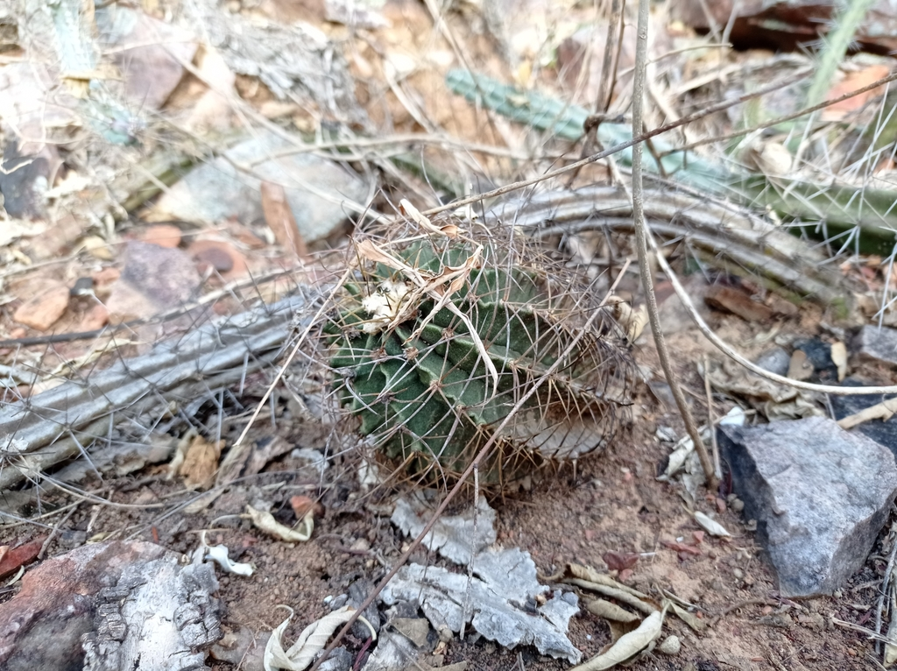
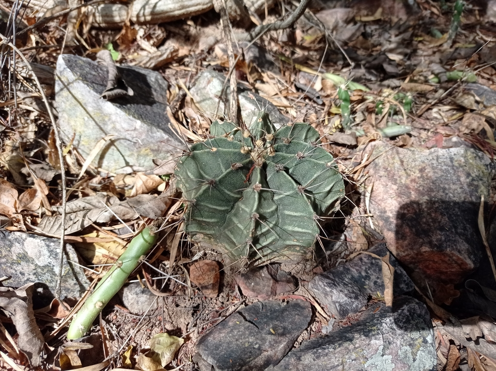
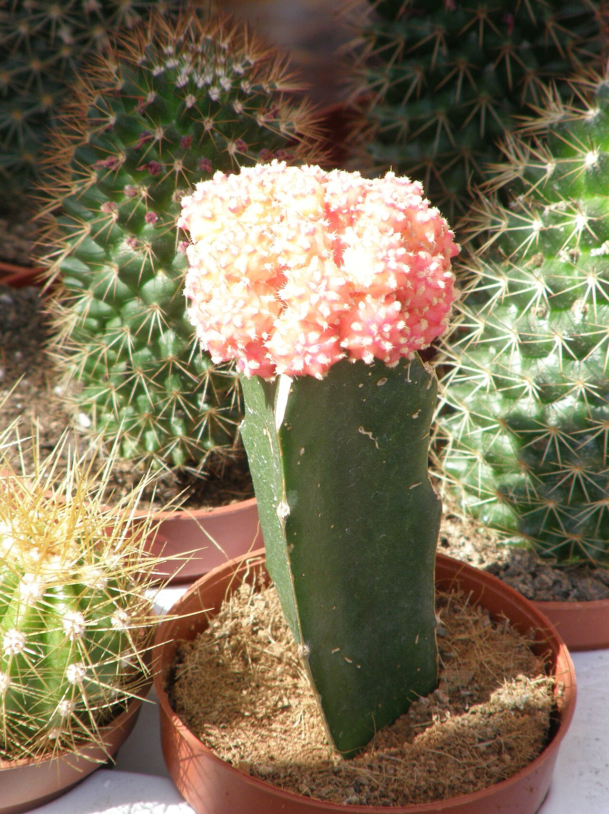
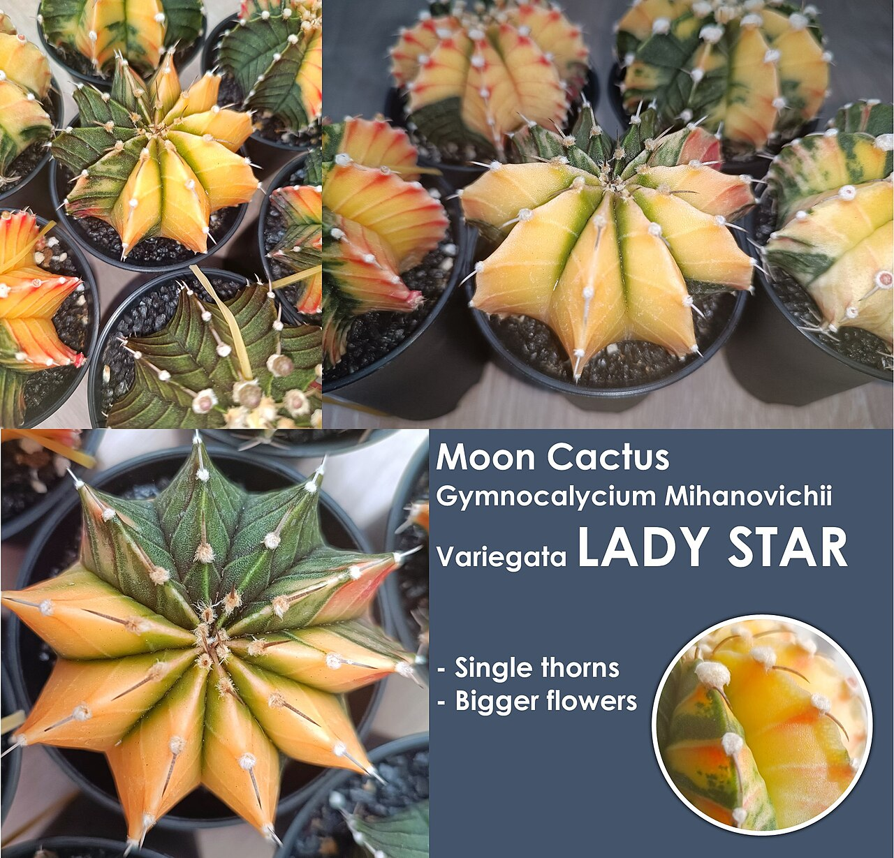
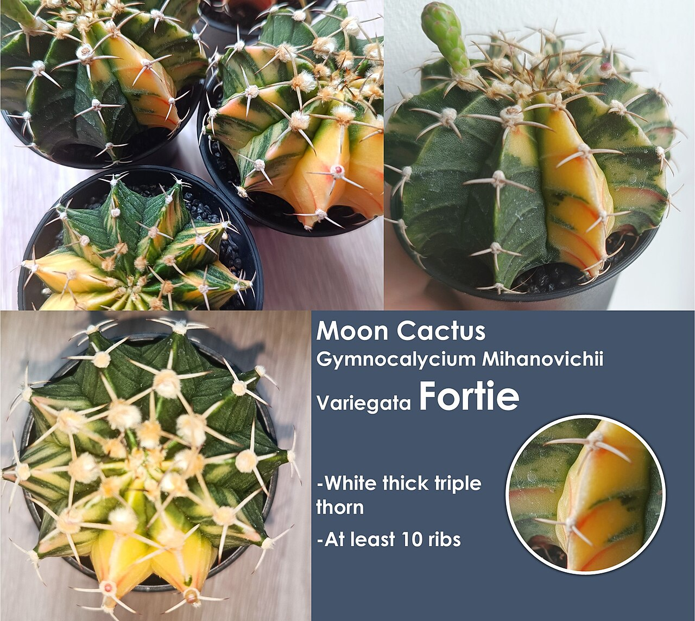
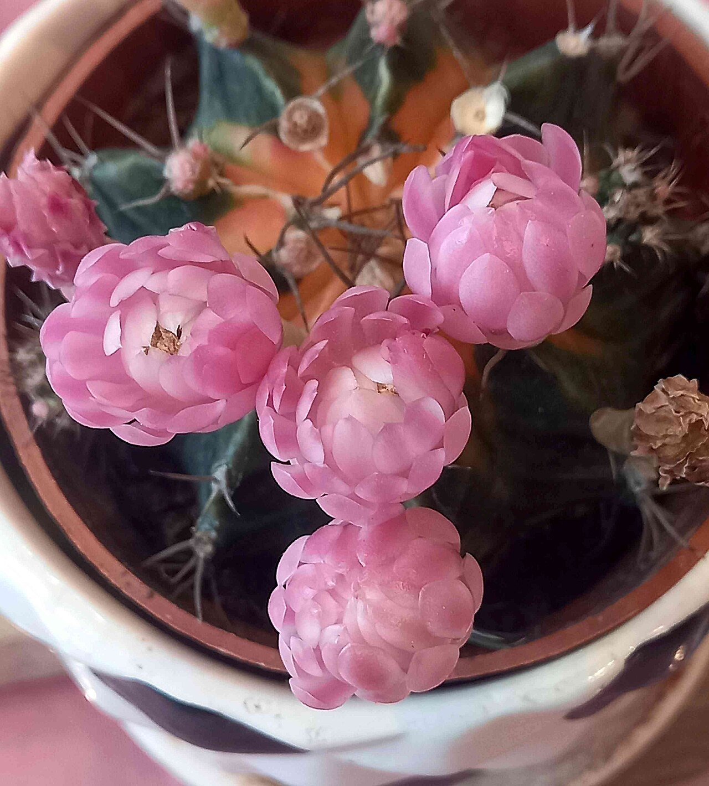

# Variegated moon cactus photo archive

*Gymnocalycium mihanovichii* - Starter-07

The archive includes normal, variegated, and grafted examples of the species; not every photograph matches this own-root plant.

Collection research: [open the plant profile](../../../docs/plants/starter/gymnocalycium-mihanovichii-variegated.md).

## Gallery

*habitat* - [Gymnocalycium mihanovichii in habitat](<https://www.inaturalist.org/observations/119400346>); (c) Luis Recalde, some rights reserved (CC BY); [CC BY](<https://creativecommons.org/licenses/by/4.0/>).

*habitat* - [Gymnocalycium mihanovichii in habitat](<https://www.inaturalist.org/observations/121571564>); (c) Luis Recalde, some rights reserved (CC BY); [CC BY](<https://creativecommons.org/licenses/by/4.0/>).

*habit* - [2010. Выставка цветов в Донецке на день города 100.jpg](<https://commons.wikimedia.org/wiki/File:2010._%D0%92%D1%8B%D1%81%D1%82%D0%B0%D0%B2%D0%BA%D0%B0_%D1%86%D0%B2%D0%B5%D1%82%D0%BE%D0%B2_%D0%B2_%D0%94%D0%BE%D0%BD%D0%B5%D1%86%D0%BA%D0%B5_%D0%BD%D0%B0_%D0%B4%D0%B5%D0%BD%D1%8C_%D0%B3%D0%BE%D1%80%D0%BE%D0%B4%D0%B0_100.jpg>); Andrey Butko; [CC BY-SA 3.0](<https://creativecommons.org/licenses/by-sa/3.0>).

*flower* - [Moon Cactus Gymnocalycium Mihanovichii Variegata Lady Star.jpg](<https://commons.wikimedia.org/wiki/File:Moon_Cactus_Gymnocalycium_Mihanovichii_Variegata_Lady_Star.jpg>); CactusManHere; [CC BY-SA 4.0](<https://creativecommons.org/licenses/by-sa/4.0>).

*detail* - [Moon Cactus Gymnocalycium Mihanovichii Variegata Fortie.jpg](<https://commons.wikimedia.org/wiki/File:Moon_Cactus_Gymnocalycium_Mihanovichii_Variegata_Fortie.jpg>); CactusManHere; [CC BY-SA 4.0](<https://creativecommons.org/licenses/by-sa/4.0>).

*habitat* - [仙人掌-緋牡丹錦 Gymnocalycium mihanovichii variegata -香港公園 Hong Kong Park- (9216072982).jpg](<https://commons.wikimedia.org/wiki/File:%E4%BB%99%E4%BA%BA%E6%8E%8C-%E7%B7%8B%E7%89%A1%E4%B8%B9%E9%8C%A6_Gymnocalycium_mihanovichii_variegata_-%E9%A6%99%E6%B8%AF%E5%85%AC%E5%9C%92_Hong_Kong_Park-_(9216072982).jpg>); 阿橋 HQ; [CC BY-SA 2.0](<https://creativecommons.org/licenses/by-sa/2.0>).

## File details

| File | Subject | Source | Creator | License |
| --- | --- | --- | --- | --- |
| [inaturalist-119400346-201837834-habitat.jpg](./inaturalist-119400346-201837834-habitat.jpg) | habitat | [iNaturalist](<https://www.inaturalist.org/observations/119400346>) | (c) Luis Recalde, some rights reserved (CC BY) | [CC BY](<https://creativecommons.org/licenses/by/4.0/>) |
| [inaturalist-121571564-205738748-habitat.jpg](./inaturalist-121571564-205738748-habitat.jpg) | habitat | [iNaturalist](<https://www.inaturalist.org/observations/121571564>) | (c) Luis Recalde, some rights reserved (CC BY) | [CC BY](<https://creativecommons.org/licenses/by/4.0/>) |
| [commons-11493664-habit.jpg](./commons-11493664-habit.jpg) | habit | [Wikimedia Commons](<https://commons.wikimedia.org/wiki/File:2010._%D0%92%D1%8B%D1%81%D1%82%D0%B0%D0%B2%D0%BA%D0%B0_%D1%86%D0%B2%D0%B5%D1%82%D0%BE%D0%B2_%D0%B2_%D0%94%D0%BE%D0%BD%D0%B5%D1%86%D0%BA%D0%B5_%D0%BD%D0%B0_%D0%B4%D0%B5%D0%BD%D1%8C_%D0%B3%D0%BE%D1%80%D0%BE%D0%B4%D0%B0_100.jpg>) | Andrey Butko | [CC BY-SA 3.0](<https://creativecommons.org/licenses/by-sa/3.0>) |
| [commons-133539514-flower.jpg](./commons-133539514-flower.jpg) | flower | [Wikimedia Commons](<https://commons.wikimedia.org/wiki/File:Moon_Cactus_Gymnocalycium_Mihanovichii_Variegata_Lady_Star.jpg>) | CactusManHere | [CC BY-SA 4.0](<https://creativecommons.org/licenses/by-sa/4.0>) |
| [commons-133539917-detail.jpg](./commons-133539917-detail.jpg) | detail | [Wikimedia Commons](<https://commons.wikimedia.org/wiki/File:Moon_Cactus_Gymnocalycium_Mihanovichii_Variegata_Fortie.jpg>) | CactusManHere | [CC BY-SA 4.0](<https://creativecommons.org/licenses/by-sa/4.0>) |
| [commons-139788393-habitat.jpg](./commons-139788393-habitat.jpg) | habitat | [Wikimedia Commons](<https://commons.wikimedia.org/wiki/File:%E4%BB%99%E4%BA%BA%E6%8E%8C-%E7%B7%8B%E7%89%A1%E4%B8%B9%E9%8C%A6_Gymnocalycium_mihanovichii_variegata_-%E9%A6%99%E6%B8%AF%E5%85%AC%E5%9C%92_Hong_Kong_Park-_(9216072982).jpg>) | 阿橋 HQ | [CC BY-SA 2.0](<https://creativecommons.org/licenses/by-sa/2.0>) |

Metadata and SHA-256 hashes are also available in [the global manifest](../photo-manifest.json).
