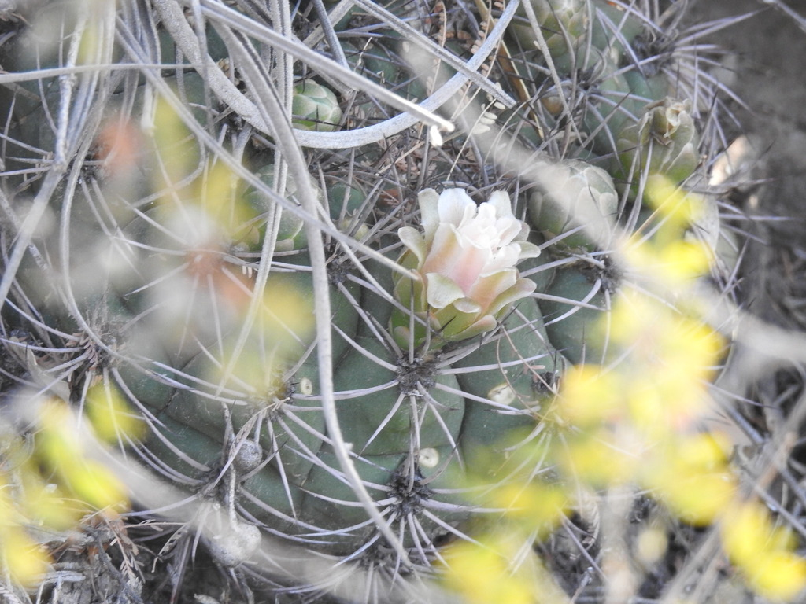
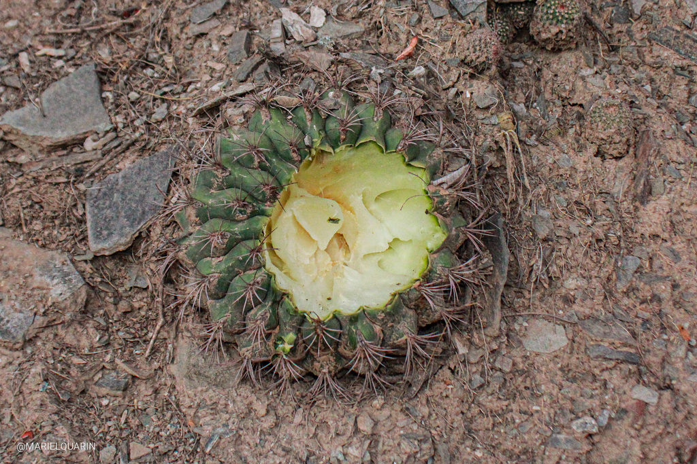
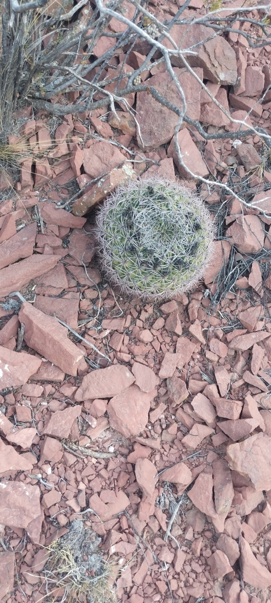
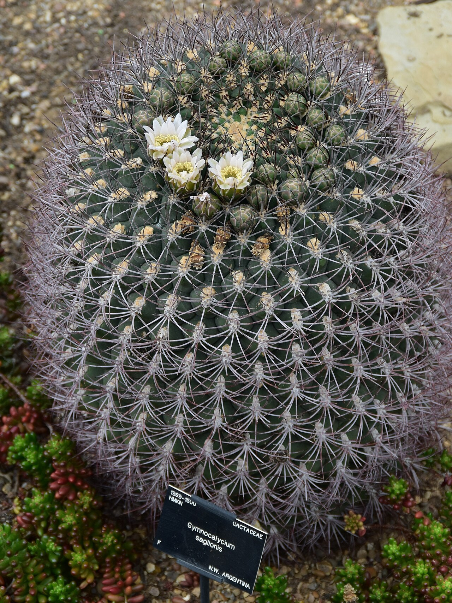
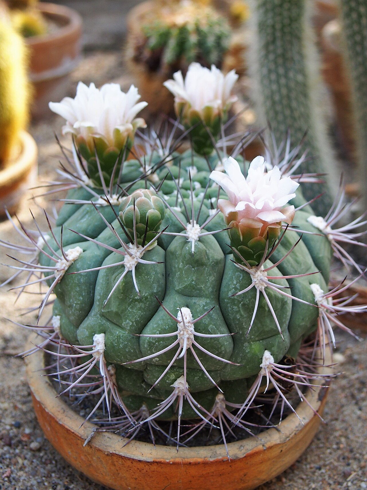
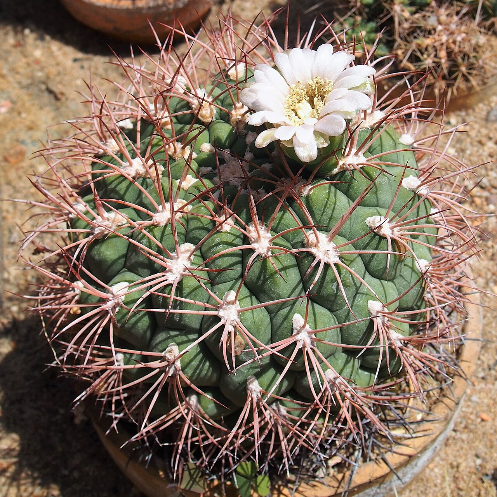
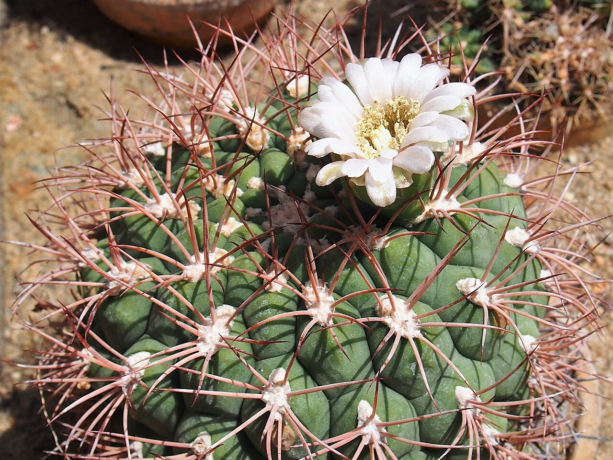
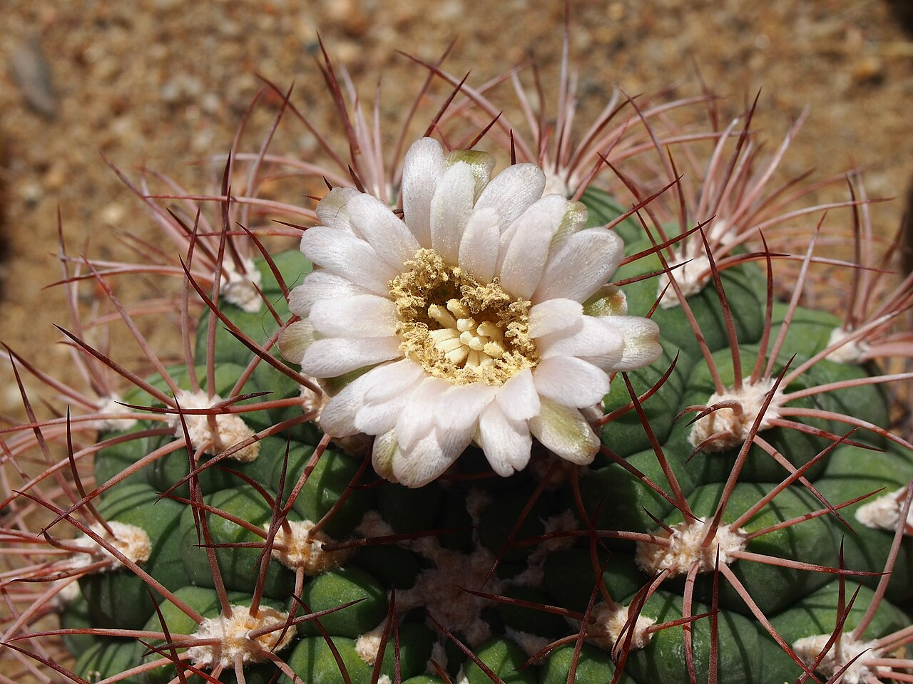
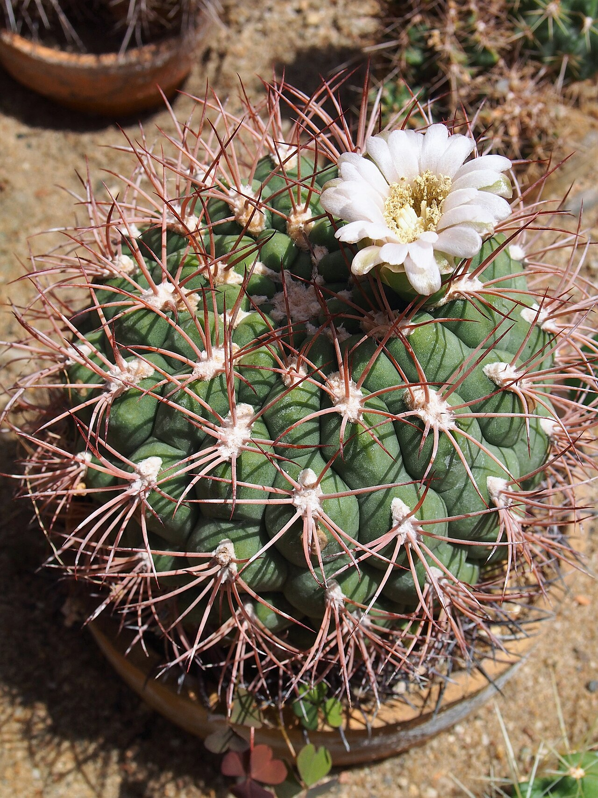
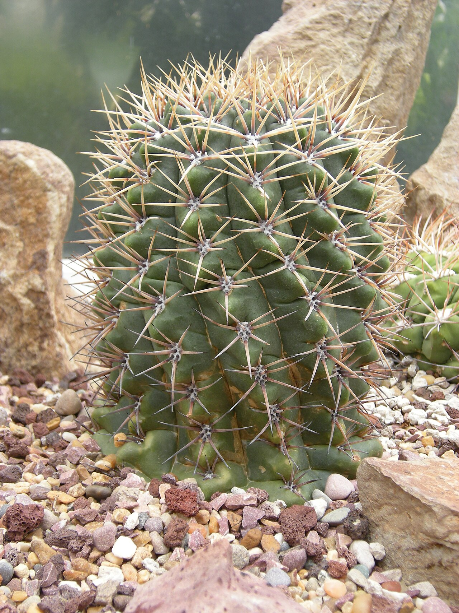

# Giant chin cactus photo archive

_Gymnocalycium saglionis_ - Starter-08

Collection label ID: `C1`.

Species-reference photographs.

Collection research: [open the plant profile](../../../docs/plants/starter/gymnocalycium-saglionis.md).

## Gallery

_habitat_ - [Gymnocalycium saglionis in habitat](https://www.inaturalist.org/observations/248940319); (c) Leonel Roget, some rights reserved (CC BY); [CC BY](https://creativecommons.org/licenses/by/4.0/).

_habitat_ - [Gymnocalycium saglionis in habitat](https://www.inaturalist.org/observations/280400041); (c) Lourdes Mariel Quarin, some rights reserved (CC BY); [CC BY](https://creativecommons.org/licenses/by/4.0/).

_habitat_ - [Gymnocalycium saglionis in habitat](https://www.inaturalist.org/observations/299569471); (c) Agustín Zarco, some rights reserved (CC BY); [CC BY](https://creativecommons.org/licenses/by/4.0/).

_habit_ - [Cactaceae Gymnocalycium saglionis 2.jpg](https://commons.wikimedia.org/wiki/File:Cactaceae_Gymnocalycium_saglionis_2.jpg); NasserHalaweh; [CC BY-SA 4.0](https://creativecommons.org/licenses/by-sa/4.0).

_habit_ - [Gymnocalycium saglionis 2019-05-26 01.jpg](https://commons.wikimedia.org/wiki/File:Gymnocalycium_saglionis_2019-05-26_01.jpg); Agnieszka Kwiecień, Nova; [CC BY-SA 4.0](https://creativecommons.org/licenses/by-sa/4.0).

_habit_ - [Gymnocalycium saglionis 2019-06-09 02.jpg](https://commons.wikimedia.org/wiki/File:Gymnocalycium_saglionis_2019-06-09_02.jpg); Agnieszka Kwiecień, Nova; [CC BY-SA 4.0](https://creativecommons.org/licenses/by-sa/4.0).

_habit_ - [Gymnocalycium saglionis 2019-06-09 03.jpg](https://commons.wikimedia.org/wiki/File:Gymnocalycium_saglionis_2019-06-09_03.jpg); Agnieszka Kwiecień, Nova; [CC BY-SA 4.0](https://creativecommons.org/licenses/by-sa/4.0).

_flower_ - [Gymnocalycium saglionis 2019-06-09 04.jpg](https://commons.wikimedia.org/wiki/File:Gymnocalycium_saglionis_2019-06-09_04.jpg); Agnieszka Kwiecień, Nova; [CC BY-SA 4.0](https://creativecommons.org/licenses/by-sa/4.0).

_flower_ - [Gymnocalycium saglionis 2019-06-09 01.jpg](https://commons.wikimedia.org/wiki/File:Gymnocalycium_saglionis_2019-06-09_01.jpg); Agnieszka Kwiecień, Nova; [CC BY-SA 4.0](https://creativecommons.org/licenses/by-sa/4.0).

_habitat_ - [Gymnocalycium saglionis c-1237 - 01.jpg](https://commons.wikimedia.org/wiki/File:Gymnocalycium_saglionis_c-1237_-_01.jpg); Joe Mabel; [CC BY-SA 3.0](http://creativecommons.org/licenses/by-sa/3.0/).

## File details

| File                                                                                         | Subject | Source                                                                                                 | Creator                                                 | License                                                        |
| -------------------------------------------------------------------------------------------- | ------- | ------------------------------------------------------------------------------------------------------ | ------------------------------------------------------- | -------------------------------------------------------------- |
| [inaturalist-248940319-444905061-habitat.jpg](./inaturalist-248940319-444905061-habitat.jpg) | habitat | [iNaturalist](https://www.inaturalist.org/observations/248940319)                                      | (c) Leonel Roget, some rights reserved (CC BY)          | [CC BY](https://creativecommons.org/licenses/by/4.0/)          |
| [inaturalist-280400041-503596105-habitat.jpg](./inaturalist-280400041-503596105-habitat.jpg) | habitat | [iNaturalist](https://www.inaturalist.org/observations/280400041)                                      | (c) Lourdes Mariel Quarin, some rights reserved (CC BY) | [CC BY](https://creativecommons.org/licenses/by/4.0/)          |
| [inaturalist-299569471-539702757-habitat.jpg](./inaturalist-299569471-539702757-habitat.jpg) | habitat | [iNaturalist](https://www.inaturalist.org/observations/299569471)                                      | (c) Agustín Zarco, some rights reserved (CC BY)         | [CC BY](https://creativecommons.org/licenses/by/4.0/)          |
| [commons-105087251-habit.jpg](./commons-105087251-habit.jpg)                                 | habit   | [Wikimedia Commons](https://commons.wikimedia.org/wiki/File:Cactaceae_Gymnocalycium_saglionis_2.jpg)   | NasserHalaweh                                           | [CC BY-SA 4.0](https://creativecommons.org/licenses/by-sa/4.0) |
| [commons-110909868-habit.jpg](./commons-110909868-habit.jpg)                                 | habit   | [Wikimedia Commons](https://commons.wikimedia.org/wiki/File:Gymnocalycium_saglionis_2019-05-26_01.jpg) | Agnieszka Kwiecień, Nova                                | [CC BY-SA 4.0](https://creativecommons.org/licenses/by-sa/4.0) |
| [commons-111053430-habit.jpg](./commons-111053430-habit.jpg)                                 | habit   | [Wikimedia Commons](https://commons.wikimedia.org/wiki/File:Gymnocalycium_saglionis_2019-06-09_02.jpg) | Agnieszka Kwiecień, Nova                                | [CC BY-SA 4.0](https://creativecommons.org/licenses/by-sa/4.0) |
| [commons-111053431-habit.jpg](./commons-111053431-habit.jpg)                                 | habit   | [Wikimedia Commons](https://commons.wikimedia.org/wiki/File:Gymnocalycium_saglionis_2019-06-09_03.jpg) | Agnieszka Kwiecień, Nova                                | [CC BY-SA 4.0](https://creativecommons.org/licenses/by-sa/4.0) |
| [commons-111053439-habit.jpg](./commons-111053439-habit.jpg)                                 | flower  | [Wikimedia Commons](https://commons.wikimedia.org/wiki/File:Gymnocalycium_saglionis_2019-06-09_04.jpg) | Agnieszka Kwiecień, Nova                                | [CC BY-SA 4.0](https://creativecommons.org/licenses/by-sa/4.0) |
| [commons-111053442-habit.jpg](./commons-111053442-habit.jpg)                                 | flower  | [Wikimedia Commons](https://commons.wikimedia.org/wiki/File:Gymnocalycium_saglionis_2019-06-09_01.jpg) | Agnieszka Kwiecień, Nova                                | [CC BY-SA 4.0](https://creativecommons.org/licenses/by-sa/4.0) |
| [commons-6358308-habitat.jpg](./commons-6358308-habitat.jpg)                                 | habitat | [Wikimedia Commons](https://commons.wikimedia.org/wiki/File:Gymnocalycium_saglionis_c-1237_-_01.jpg)   | Joe Mabel                                               | [CC BY-SA 3.0](http://creativecommons.org/licenses/by-sa/3.0/) |

Metadata and SHA-256 hashes are also available in [the global manifest](../photo-manifest.json).
