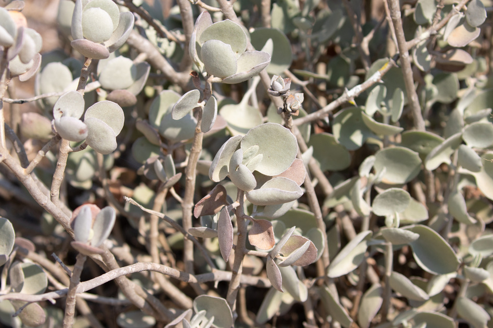
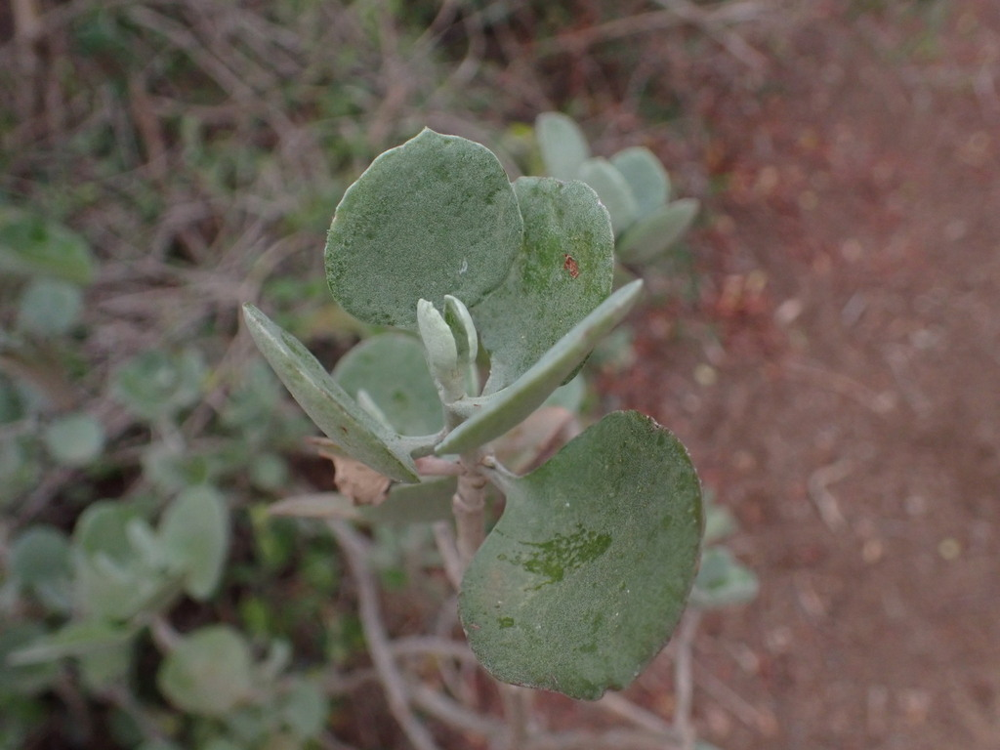
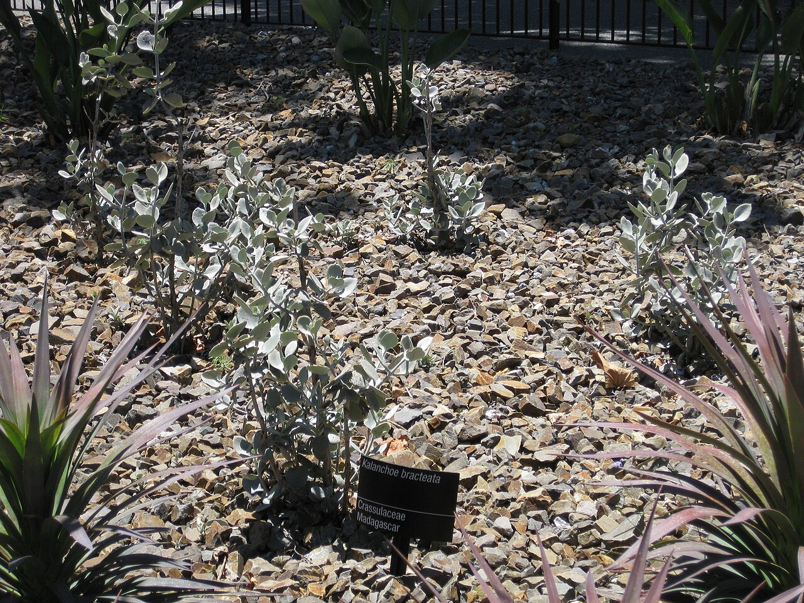
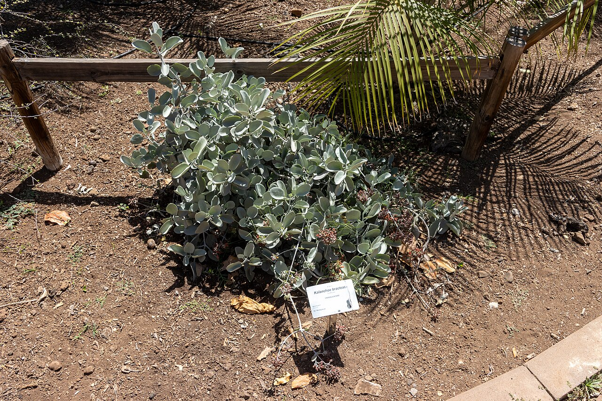
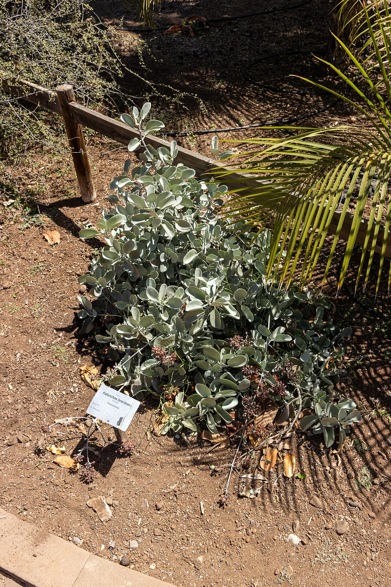
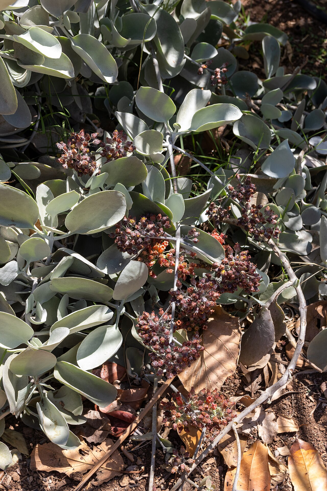
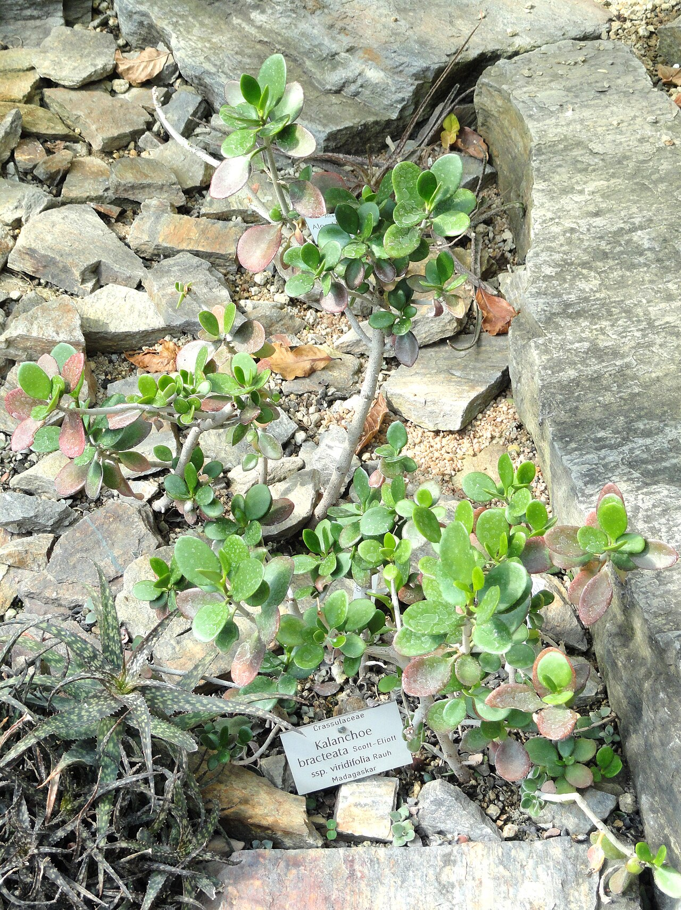

# Silver teaspoons photo archive

_Kalanchoe bracteata_ - Succulent-03

Collection label ID: `#2; formerly C4-D4`.

Species-reference photographs; the collection ID remains provisional pending flowers.

Collection research: [open the plant profile](../../../docs/plants/succulents/kalanchoe-bracteata.md).

## Gallery

_habitat_ - [Kalanchoe bracteata in habitat](https://www.inaturalist.org/observations/142050158); (c) avocat, some rights reserved (CC BY); [CC BY](https://creativecommons.org/licenses/by/4.0/).

_habitat_ - [Kalanchoe bracteata in habitat](https://www.inaturalist.org/observations/254505356); (c) Louis Aureglia, some rights reserved (CC BY); [CC BY](https://creativecommons.org/licenses/by/4.0/).

_detail_ - [Gardenology.org-IMG 9687 rbgm10dec.jpg](https://commons.wikimedia.org/wiki/File:Gardenology.org-IMG_9687_rbgm10dec.jpg); Raffi Kojian; [CC BY-SA 3.0](https://creativecommons.org/licenses/by-sa/3.0).

_habit_ - [At Palmetum de Santa Cruz de Tenerife 2023 010.jpg](https://commons.wikimedia.org/wiki/File:At_Palmetum_de_Santa_Cruz_de_Tenerife_2023_010.jpg); Photograph by Mike Peel ( www.mikepeel.net ).; [CC BY-SA 4.0](https://creativecommons.org/licenses/by-sa/4.0).

_habit_ - [At Palmetum de Santa Cruz de Tenerife 2023 011.jpg](https://commons.wikimedia.org/wiki/File:At_Palmetum_de_Santa_Cruz_de_Tenerife_2023_011.jpg); Photograph by Mike Peel ( www.mikepeel.net ).; [CC BY-SA 4.0](https://creativecommons.org/licenses/by-sa/4.0).

_habit_ - [At Palmetum de Santa Cruz de Tenerife 2023 012.jpg](https://commons.wikimedia.org/wiki/File:At_Palmetum_de_Santa_Cruz_de_Tenerife_2023_012.jpg); Photograph by Mike Peel ( www.mikepeel.net ).; [CC BY-SA 4.0](https://creativecommons.org/licenses/by-sa/4.0).

_habit_ - [Kalanchoe bracteata - Botanischer Garten München-Nymphenburg - DSC08101.JPG](https://commons.wikimedia.org/wiki/File:Kalanchoe_bracteata_-_Botanischer_Garten_M%C3%BCnchen-Nymphenburg_-_DSC08101.JPG); Daderot; [Public domain](https://creativecommons.org/publicdomain/zero/1.0/).

## File details

| File                                                                                         | Subject | Source                                                                                                                                        | Creator                                          | License                                                             |
| -------------------------------------------------------------------------------------------- | ------- | --------------------------------------------------------------------------------------------------------------------------------------------- | ------------------------------------------------ | ------------------------------------------------------------------- |
| [inaturalist-142050158-243475438-habitat.jpg](./inaturalist-142050158-243475438-habitat.jpg) | habitat | [iNaturalist](https://www.inaturalist.org/observations/142050158)                                                                             | (c) avocat, some rights reserved (CC BY)         | [CC BY](https://creativecommons.org/licenses/by/4.0/)               |
| [inaturalist-254505356-455873012-habitat.jpg](./inaturalist-254505356-455873012-habitat.jpg) | habitat | [iNaturalist](https://www.inaturalist.org/observations/254505356)                                                                             | (c) Louis Aureglia, some rights reserved (CC BY) | [CC BY](https://creativecommons.org/licenses/by/4.0/)               |
| [commons-12439344-detail.jpg](./commons-12439344-detail.jpg)                                 | detail  | [Wikimedia Commons](https://commons.wikimedia.org/wiki/File:Gardenology.org-IMG_9687_rbgm10dec.jpg)                                           | Raffi Kojian                                     | [CC BY-SA 3.0](https://creativecommons.org/licenses/by-sa/3.0)      |
| [commons-134379403-habit.jpg](./commons-134379403-habit.jpg)                                 | habit   | [Wikimedia Commons](https://commons.wikimedia.org/wiki/File:At_Palmetum_de_Santa_Cruz_de_Tenerife_2023_010.jpg)                               | Photograph by Mike Peel ( www.mikepeel.net ).    | [CC BY-SA 4.0](https://creativecommons.org/licenses/by-sa/4.0)      |
| [commons-134379405-habit.jpg](./commons-134379405-habit.jpg)                                 | habit   | [Wikimedia Commons](https://commons.wikimedia.org/wiki/File:At_Palmetum_de_Santa_Cruz_de_Tenerife_2023_011.jpg)                               | Photograph by Mike Peel ( www.mikepeel.net ).    | [CC BY-SA 4.0](https://creativecommons.org/licenses/by-sa/4.0)      |
| [commons-134379407-habit.jpg](./commons-134379407-habit.jpg)                                 | habit   | [Wikimedia Commons](https://commons.wikimedia.org/wiki/File:At_Palmetum_de_Santa_Cruz_de_Tenerife_2023_012.jpg)                               | Photograph by Mike Peel ( www.mikepeel.net ).    | [CC BY-SA 4.0](https://creativecommons.org/licenses/by-sa/4.0)      |
| [commons-15579568-habit.jpg](./commons-15579568-habit.jpg)                                   | habit   | [Wikimedia Commons](https://commons.wikimedia.org/wiki/File:Kalanchoe_bracteata_-_Botanischer_Garten_M%C3%BCnchen-Nymphenburg_-_DSC08101.JPG) | Daderot                                          | [Public domain](https://creativecommons.org/publicdomain/zero/1.0/) |

Metadata and SHA-256 hashes are also available in [the global manifest](../photo-manifest.json).
