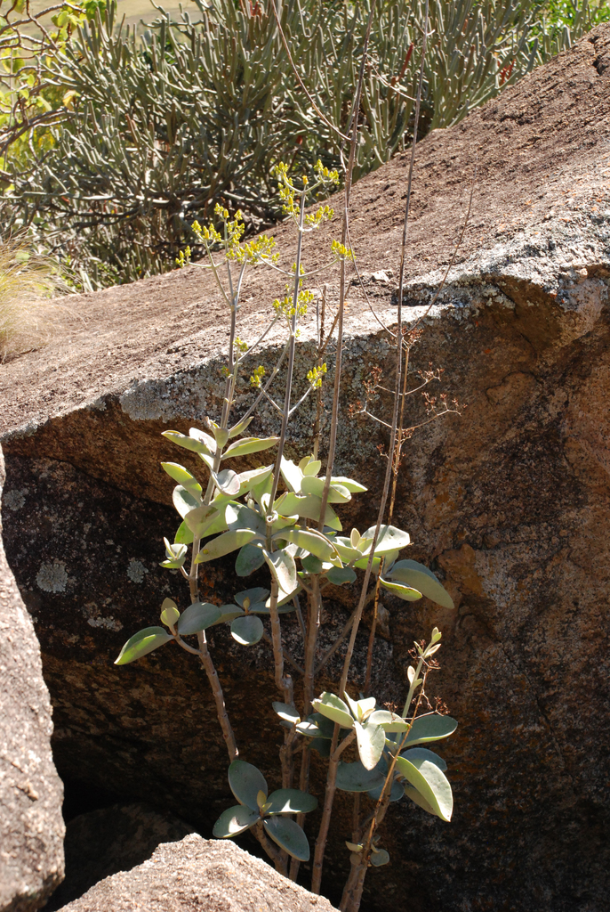
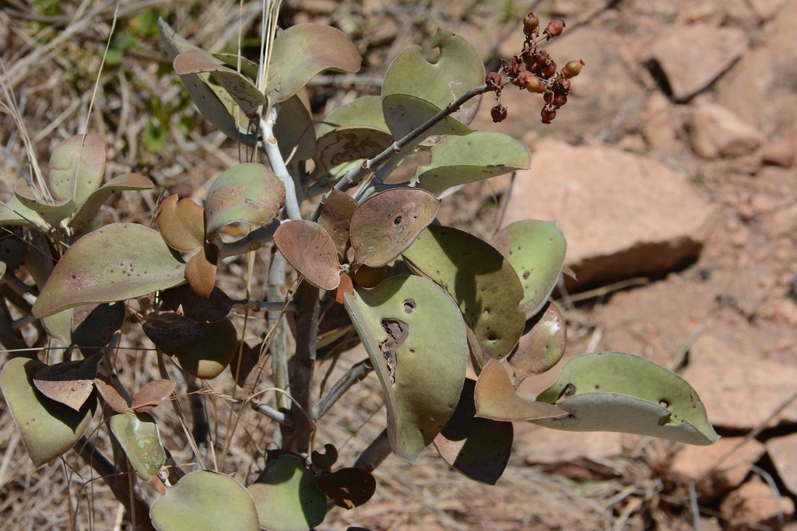
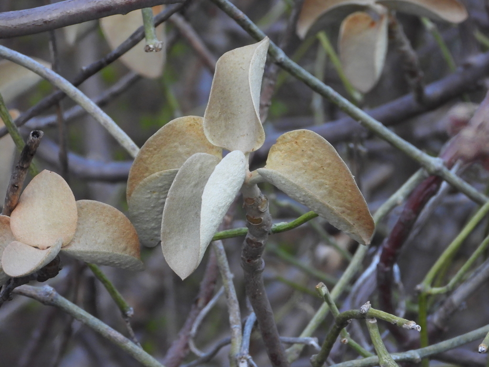
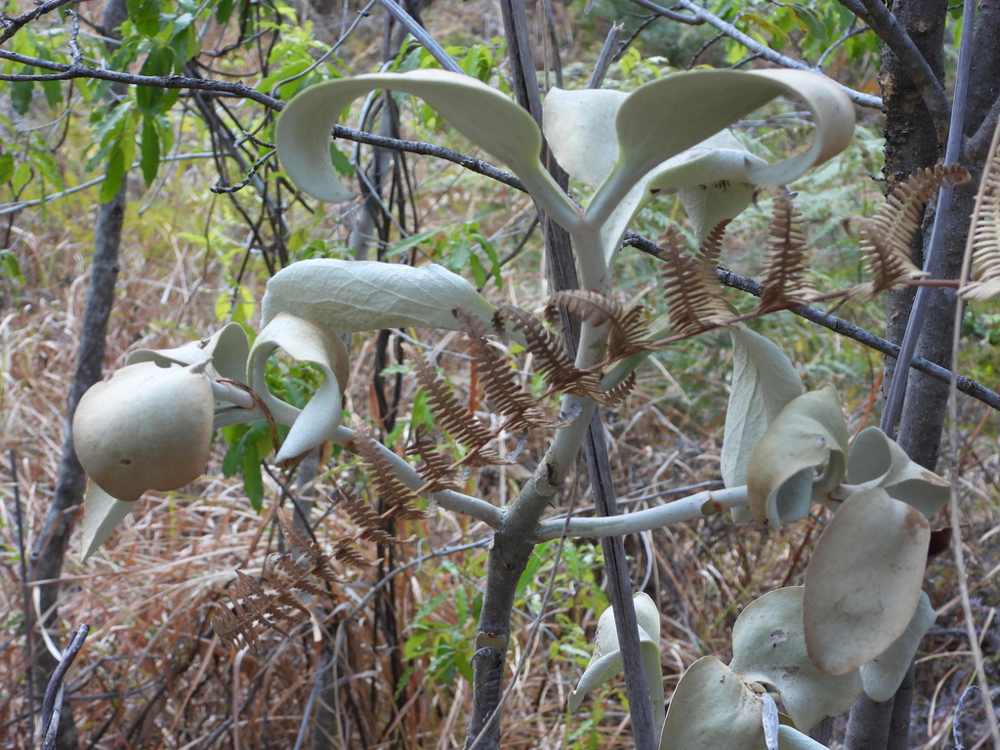
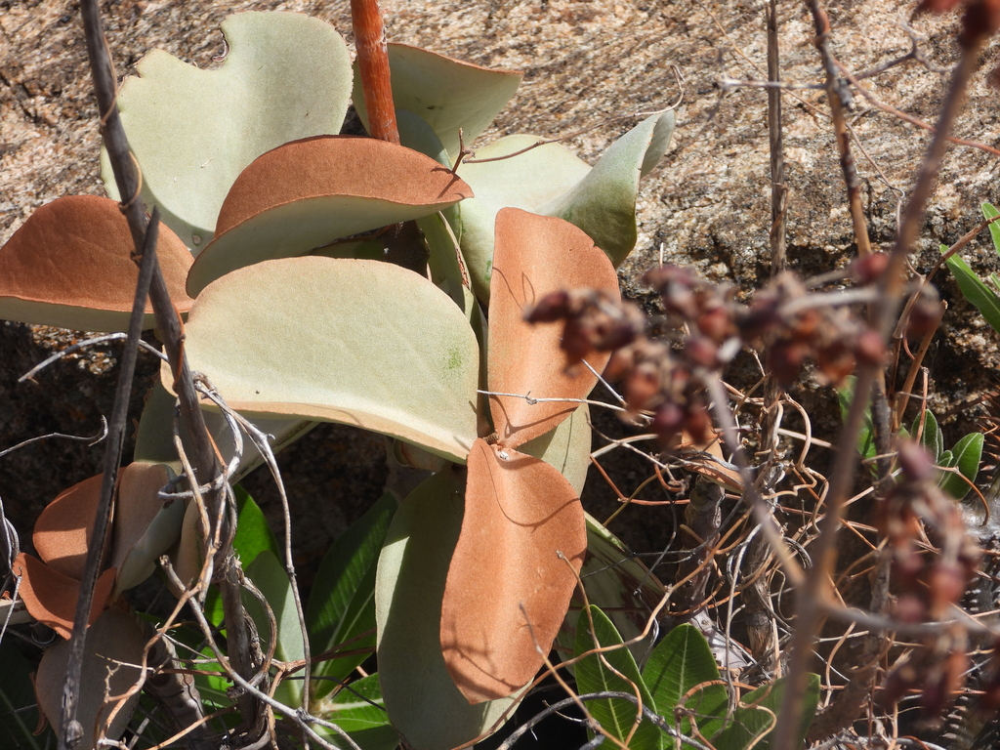
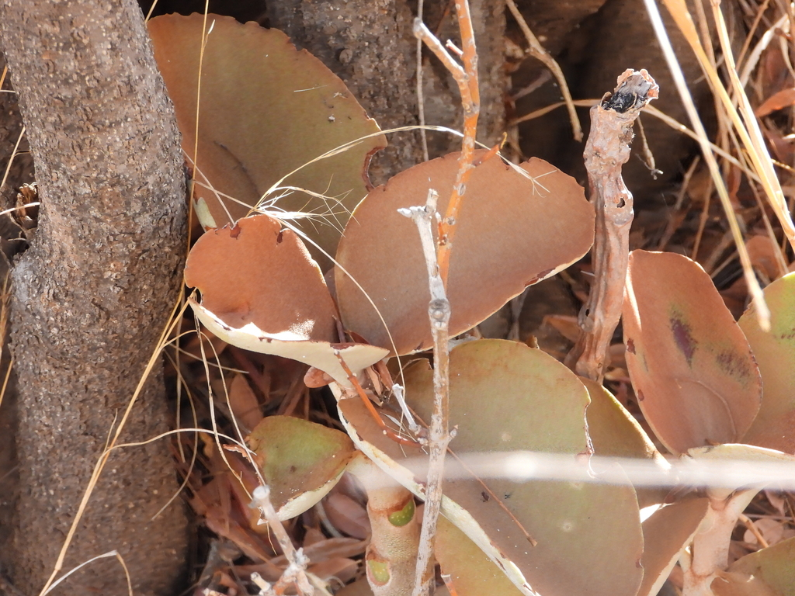
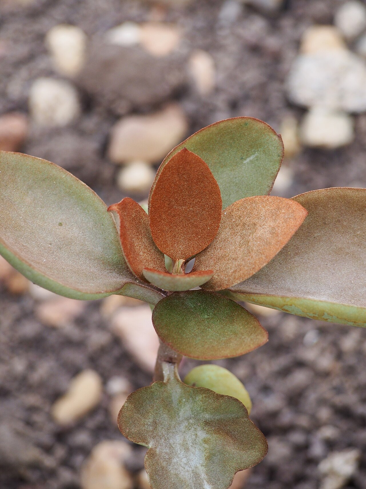
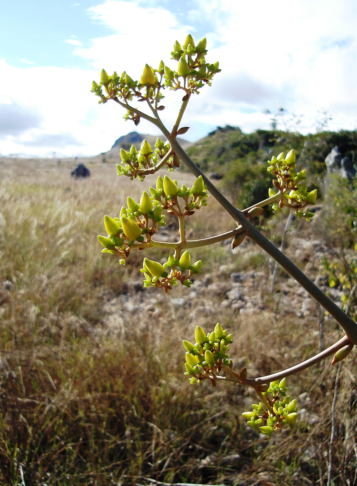
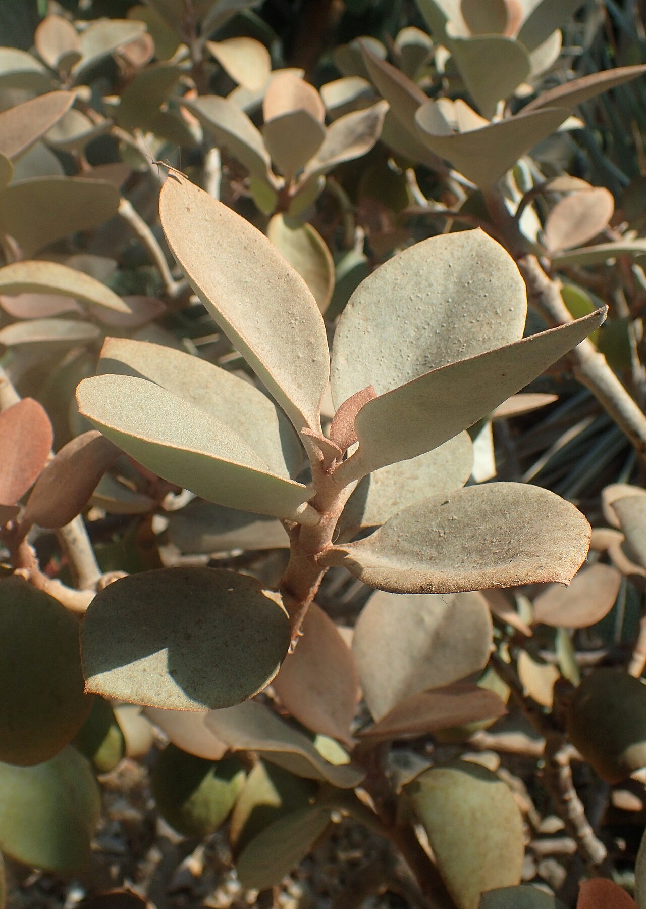
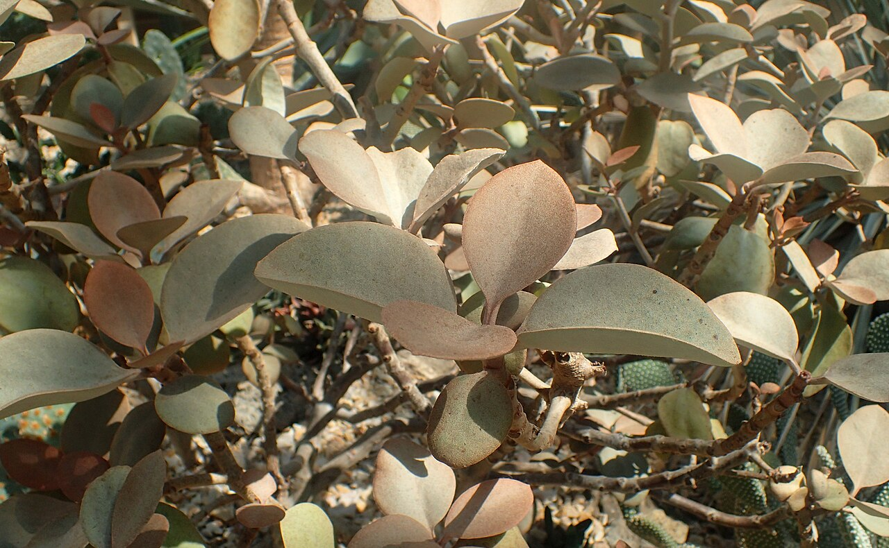

# Copper spoons photo archive

_Kalanchoe orgyalis_ - Succulent-04

Collection label ID: `#2; formerly C4-D4`.

Species-reference photographs.

Collection research: [open the plant profile](../../../docs/plants/succulents/kalanchoe-orgyalis.md).

## Gallery

_habitat_ - [Kalanchoe orgyalis in habitat](https://www.inaturalist.org/observations/12793481); (c) Andrew Hankey, some rights reserved (CC BY-SA); [CC BY SA](https://creativecommons.org/licenses/by/4.0/).

_habitat_ - [Kalanchoe orgyalis in habitat](https://www.inaturalist.org/observations/179601863); (c) Rosario Douglas, some rights reserved (CC BY); [CC BY](https://creativecommons.org/licenses/by/4.0/).

_habitat_ - [Kalanchoe orgyalis in habitat](https://www.inaturalist.org/observations/193427156); (c) amantedarmanin, some rights reserved (CC BY); [CC BY](https://creativecommons.org/licenses/by/4.0/).

_habitat_ - [Kalanchoe orgyalis in habitat](https://www.inaturalist.org/observations/194522552); (c) amantedarmanin, some rights reserved (CC BY); [CC BY](https://creativecommons.org/licenses/by/4.0/).

_habitat_ - [Kalanchoe orgyalis in habitat](https://www.inaturalist.org/observations/197725540); (c) amantedarmanin, some rights reserved (CC BY); [CC BY](https://creativecommons.org/licenses/by/4.0/).

_habitat_ - [Kalanchoe orgyalis in habitat](https://www.inaturalist.org/observations/198080013); (c) amantedarmanin, some rights reserved (CC BY); [CC BY](https://creativecommons.org/licenses/by/4.0/).

_habit_ - [Kalanchoe orgyalis Żyworódka 2023-04-23 02.jpg](https://commons.wikimedia.org/wiki/File:Kalanchoe_orgyalis_%C5%BBywor%C3%B3dka_2023-04-23_02.jpg); Agnieszka Kwiecień, Nova; [CC BY-SA 4.0](https://creativecommons.org/licenses/by-sa/4.0).

_detail_ - [Sukkulent Ihosy Madagaskar2.JPG](https://commons.wikimedia.org/wiki/File:Sukkulent_Ihosy_Madagaskar2.JPG); Diorit; [CC BY-SA 3.0](https://creativecommons.org/licenses/by-sa/3.0).

_habitat_ - [Kalanchoe orgyalis kz2.jpg](https://commons.wikimedia.org/wiki/File:Kalanchoe_orgyalis_kz2.jpg); Krzysztof Ziarnek, Kenraiz; [CC BY-SA 4.0](https://creativecommons.org/licenses/by-sa/4.0).

_habitat_ - [Kalanchoe orgyalis kz1.jpg](https://commons.wikimedia.org/wiki/File:Kalanchoe_orgyalis_kz1.jpg); Krzysztof Ziarnek, Kenraiz; [CC BY-SA 4.0](https://creativecommons.org/licenses/by-sa/4.0).

## File details

| File                                                                                         | Subject | Source                                                                                                                | Creator                                            | License                                                        |
| -------------------------------------------------------------------------------------------- | ------- | --------------------------------------------------------------------------------------------------------------------- | -------------------------------------------------- | -------------------------------------------------------------- |
| [inaturalist-12793481-18547867-habitat.jpg](./inaturalist-12793481-18547867-habitat.jpg)     | habitat | [iNaturalist](https://www.inaturalist.org/observations/12793481)                                                      | (c) Andrew Hankey, some rights reserved (CC BY-SA) | [CC BY SA](https://creativecommons.org/licenses/by/4.0/)       |
| [inaturalist-179601863-312706002-habitat.jpg](./inaturalist-179601863-312706002-habitat.jpg) | habitat | [iNaturalist](https://www.inaturalist.org/observations/179601863)                                                     | (c) Rosario Douglas, some rights reserved (CC BY)  | [CC BY](https://creativecommons.org/licenses/by/4.0/)          |
| [inaturalist-193427156-339755748-habitat.jpg](./inaturalist-193427156-339755748-habitat.jpg) | habitat | [iNaturalist](https://www.inaturalist.org/observations/193427156)                                                     | (c) amantedarmanin, some rights reserved (CC BY)   | [CC BY](https://creativecommons.org/licenses/by/4.0/)          |
| [inaturalist-194522552-341930012-habitat.jpg](./inaturalist-194522552-341930012-habitat.jpg) | habitat | [iNaturalist](https://www.inaturalist.org/observations/194522552)                                                     | (c) amantedarmanin, some rights reserved (CC BY)   | [CC BY](https://creativecommons.org/licenses/by/4.0/)          |
| [inaturalist-197725540-348267175-habitat.jpg](./inaturalist-197725540-348267175-habitat.jpg) | habitat | [iNaturalist](https://www.inaturalist.org/observations/197725540)                                                     | (c) amantedarmanin, some rights reserved (CC BY)   | [CC BY](https://creativecommons.org/licenses/by/4.0/)          |
| [inaturalist-198080013-349036018-habitat.jpg](./inaturalist-198080013-349036018-habitat.jpg) | habitat | [iNaturalist](https://www.inaturalist.org/observations/198080013)                                                     | (c) amantedarmanin, some rights reserved (CC BY)   | [CC BY](https://creativecommons.org/licenses/by/4.0/)          |
| [commons-135419101-habit.jpg](./commons-135419101-habit.jpg)                                 | habit   | [Wikimedia Commons](https://commons.wikimedia.org/wiki/File:Kalanchoe_orgyalis_%C5%BBywor%C3%B3dka_2023-04-23_02.jpg) | Agnieszka Kwiecień, Nova                           | [CC BY-SA 4.0](https://creativecommons.org/licenses/by-sa/4.0) |
| [commons-23367028-detail.jpg](./commons-23367028-detail.jpg)                                 | detail  | [Wikimedia Commons](https://commons.wikimedia.org/wiki/File:Sukkulent_Ihosy_Madagaskar2.JPG)                          | Diorit                                             | [CC BY-SA 3.0](https://creativecommons.org/licenses/by-sa/3.0) |
| [commons-53196643-habitat.jpg](./commons-53196643-habitat.jpg)                               | habitat | [Wikimedia Commons](https://commons.wikimedia.org/wiki/File:Kalanchoe_orgyalis_kz2.jpg)                               | Krzysztof Ziarnek, Kenraiz                         | [CC BY-SA 4.0](https://creativecommons.org/licenses/by-sa/4.0) |
| [commons-53196644-habitat.jpg](./commons-53196644-habitat.jpg)                               | habitat | [Wikimedia Commons](https://commons.wikimedia.org/wiki/File:Kalanchoe_orgyalis_kz1.jpg)                               | Krzysztof Ziarnek, Kenraiz                         | [CC BY-SA 4.0](https://creativecommons.org/licenses/by-sa/4.0) |

Metadata and SHA-256 hashes are also available in [the global manifest](../photo-manifest.json).
