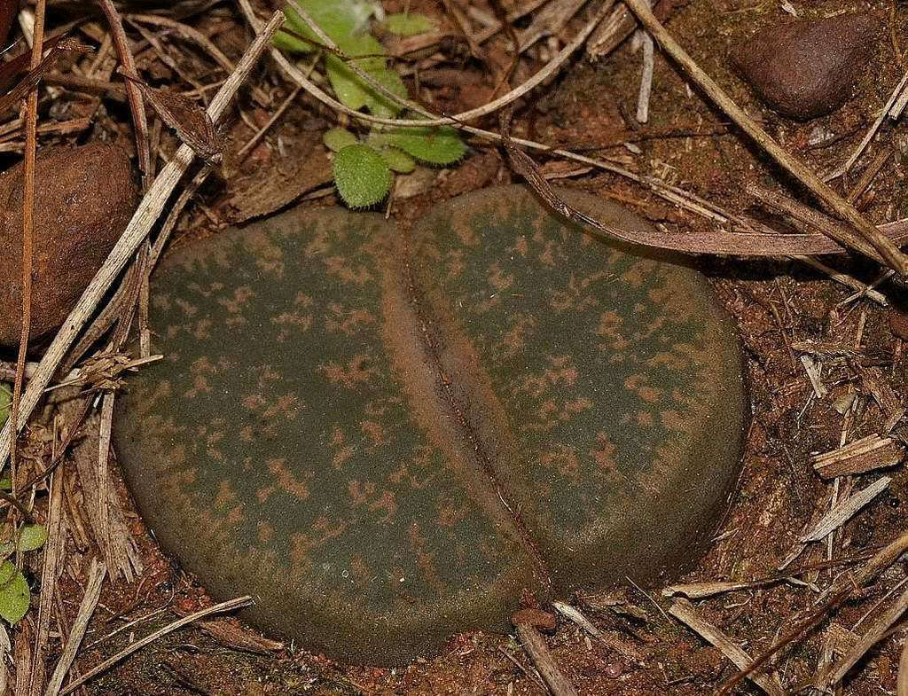
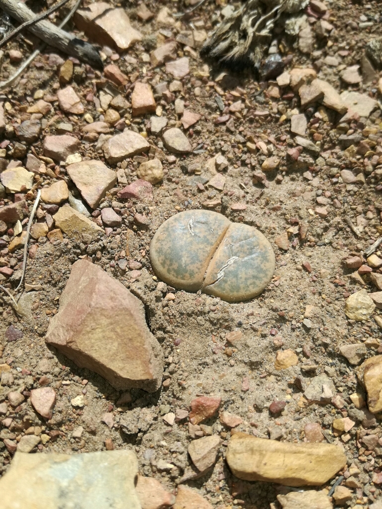
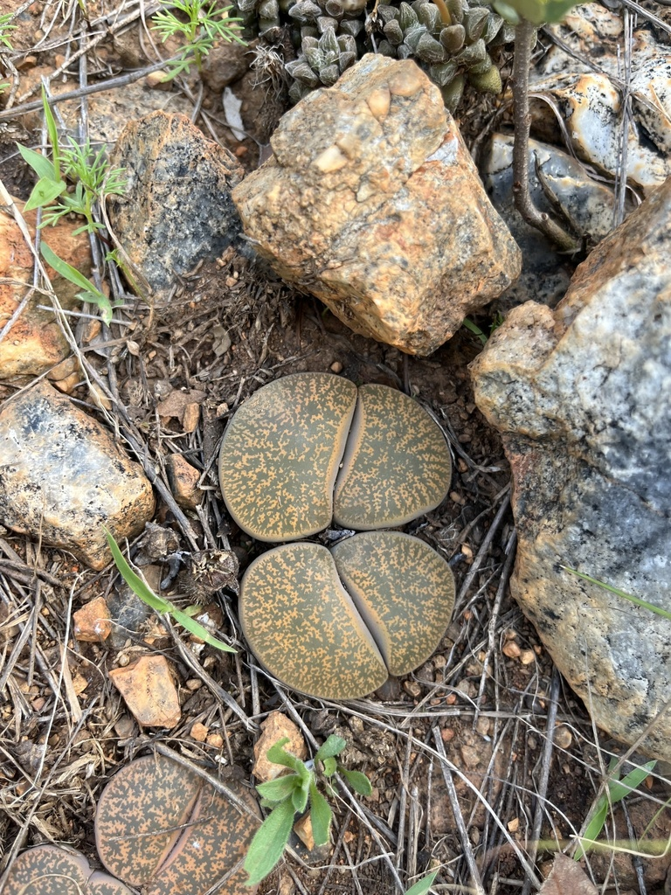
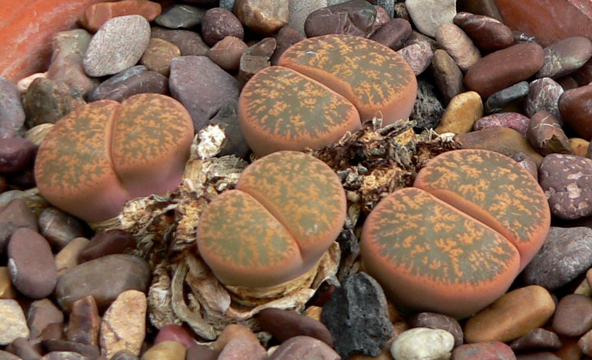
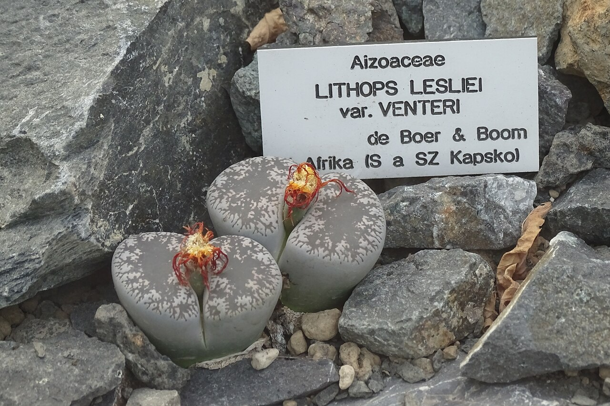
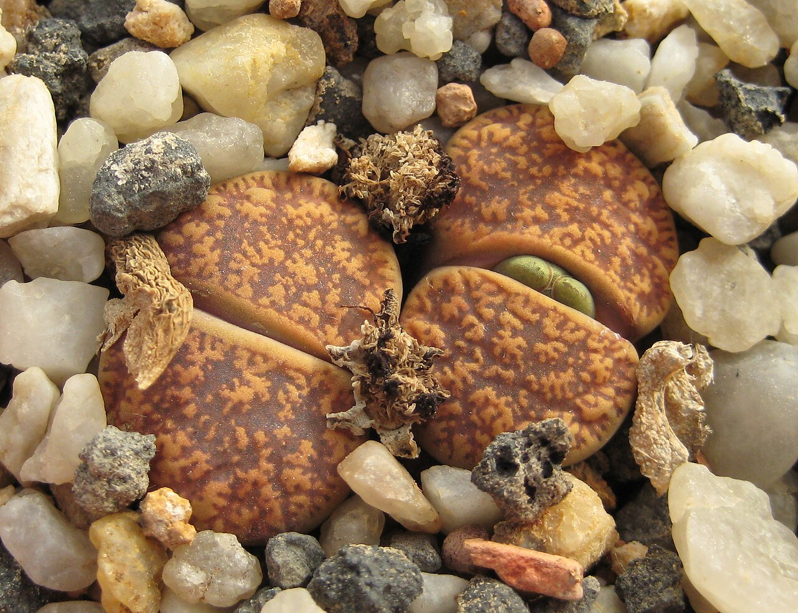
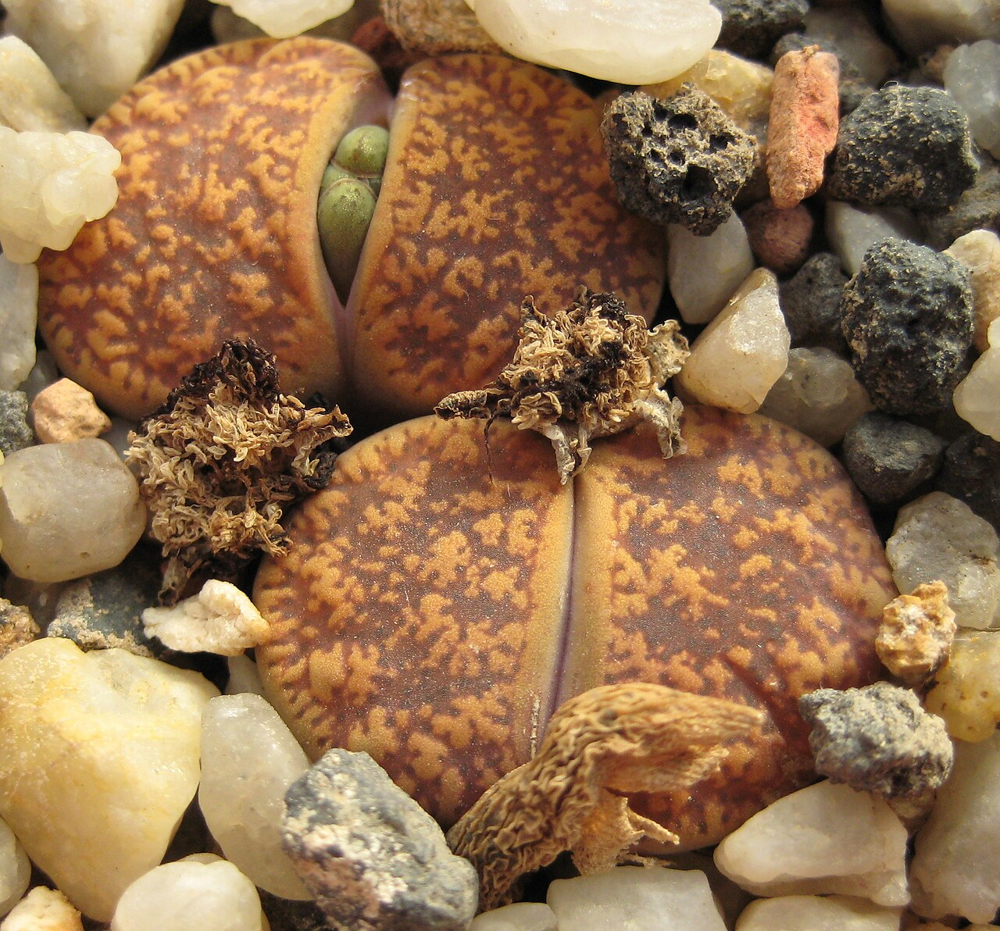
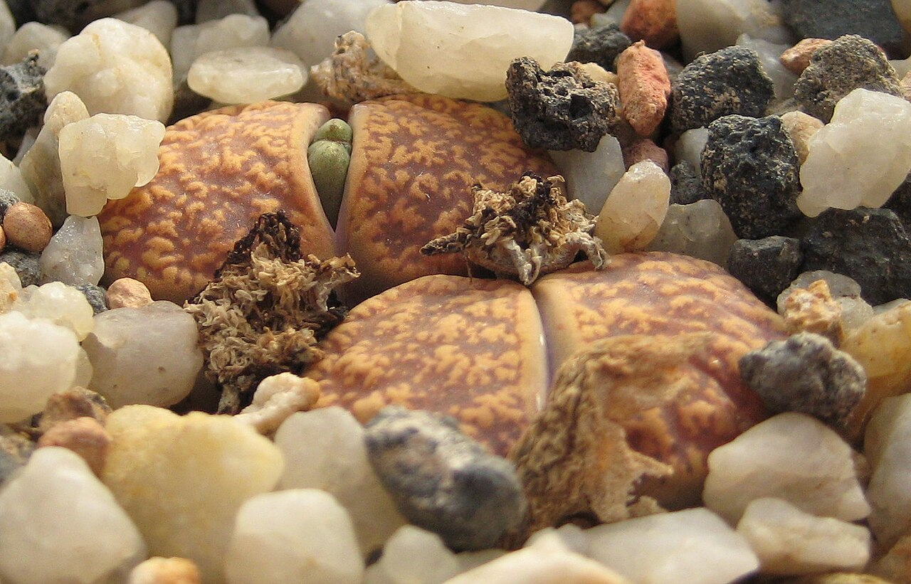
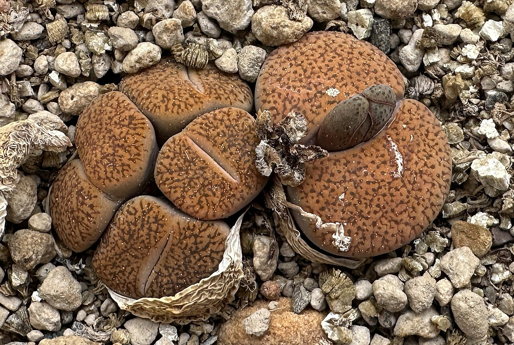
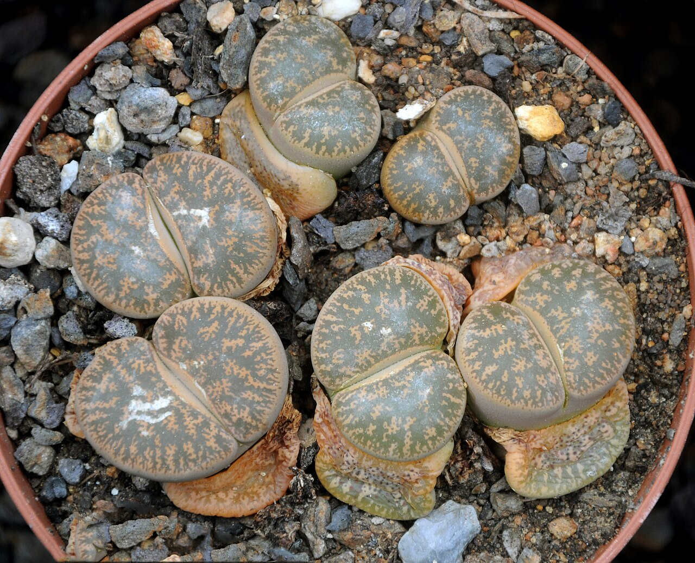

# Lithops lesliei photo archive

_Lithops lesliei_ - Succulent-15A

Collection label ID: `#9`.

Species-reference photographs for the probable Lithops lesliei identification. The owned tan/brown heads are identified from photographs only; species, variety, and cultivar remain unconfirmed.

Collection research: [open the plant profile](../../../docs/plants/succulents/lithops-lesliei.md).

## Gallery

_habitat_ - [Lithops lesliei reference observation](https://www.inaturalist.org/observations/10791910); (c) Andrew Hankey, some rights reserved (CC BY-SA); [CC BY-SA](https://creativecommons.org/licenses/by-sa/4.0/).

_habitat_ - [Lithops lesliei reference observation](https://www.inaturalist.org/observations/11371848); (c) Andrew Hankey, some rights reserved (CC BY-SA); [CC BY-SA](https://creativecommons.org/licenses/by-sa/4.0/).

_habitat_ - [Lithops lesliei reference observation](https://www.inaturalist.org/observations/142145056); (c) T. J. Samojedny, some rights reserved (CC BY); [CC BY](https://creativecommons.org/licenses/by/4.0/).

_habit_ - [Lithops lesliei 1.jpg](https://commons.wikimedia.org/wiki/File:Lithops_lesliei_1.jpg); Stan Shebs; [CC BY-SA 3.0](https://creativecommons.org/licenses/by-sa/3.0).

_habit_ - [Lithops lesliei var. venteri v Botanické zahradě v Praze.jpg](https://commons.wikimedia.org/wiki/File:Lithops_lesliei_var._venteri_v_Botanick%C3%A9_zahrad%C4%9B_v_Praze.jpg); Richtr Jan; [CC BY-SA 4.0](https://creativecommons.org/licenses/by-sa/4.0).

_fruit-seed_ - [Lithops lesliei ssp. lesliei v. hornii C015 IMG 2755.jpg](https://commons.wikimedia.org/wiki/File:Lithops_lesliei_ssp._lesliei_v._hornii_C015_IMG_2755.jpg); Michael Wolf ( Webseite ); [CC BY-SA 3.0](https://creativecommons.org/licenses/by-sa/3.0).

_fruit-seed_ - [Lithops lesliei ssp. lesliei v. hornii C015 IMG 2758.jpg](https://commons.wikimedia.org/wiki/File:Lithops_lesliei_ssp._lesliei_v._hornii_C015_IMG_2758.jpg); Michael Wolf ( Webseite ); [CC BY-SA 3.0](https://creativecommons.org/licenses/by-sa/3.0).

_fruit-seed_ - [Lithops lesliei ssp. lesliei v. hornii C015 IMG 2759.jpg](https://commons.wikimedia.org/wiki/File:Lithops_lesliei_ssp._lesliei_v._hornii_C015_IMG_2759.jpg); Michael Wolf ( Webseite ); [CC BY-SA 3.0](https://creativecommons.org/licenses/by-sa/3.0).

_habit_ - [Lithops lesliei ssp. lesliei v. mariae C152 33836.JPG](https://commons.wikimedia.org/wiki/File:Lithops_lesliei_ssp._lesliei_v._mariae_C152_33836.JPG); Michael Wolf ( Webseite ); [CC BY-SA 3.0](https://creativecommons.org/licenses/by-sa/3.0).

_habit_ - [Lithops lesliei 001.jpg](https://commons.wikimedia.org/wiki/File:Lithops_lesliei_001.jpg); Amada44; [CC BY 3.0](https://creativecommons.org/licenses/by/3.0).

## File details

| File                                                                                         | Subject    | Source                                                                                                                              | Creator                                            | License                                                        |
| -------------------------------------------------------------------------------------------- | ---------- | ----------------------------------------------------------------------------------------------------------------------------------- | -------------------------------------------------- | -------------------------------------------------------------- |
| [inaturalist-10791910-15102469-habitat.jpg](./inaturalist-10791910-15102469-habitat.jpg)     | habitat    | [iNaturalist](https://www.inaturalist.org/observations/10791910)                                                                    | (c) Andrew Hankey, some rights reserved (CC BY-SA) | [CC BY-SA](https://creativecommons.org/licenses/by-sa/4.0/)    |
| [inaturalist-11371848-16205064-habitat.jpg](./inaturalist-11371848-16205064-habitat.jpg)     | habitat    | [iNaturalist](https://www.inaturalist.org/observations/11371848)                                                                    | (c) Andrew Hankey, some rights reserved (CC BY-SA) | [CC BY-SA](https://creativecommons.org/licenses/by-sa/4.0/)    |
| [inaturalist-142145056-243655386-habitat.jpg](./inaturalist-142145056-243655386-habitat.jpg) | habitat    | [iNaturalist](https://www.inaturalist.org/observations/142145056)                                                                   | (c) T. J. Samojedny, some rights reserved (CC BY)  | [CC BY](https://creativecommons.org/licenses/by/4.0/)          |
| [commons-1059226-habit.jpg](./commons-1059226-habit.jpg)                                     | habit      | [Wikimedia Commons](https://commons.wikimedia.org/wiki/File:Lithops_lesliei_1.jpg)                                                  | Stan Shebs                                         | [CC BY-SA 3.0](https://creativecommons.org/licenses/by-sa/3.0) |
| [commons-113661144-habit.jpg](./commons-113661144-habit.jpg)                                 | habit      | [Wikimedia Commons](https://commons.wikimedia.org/wiki/File:Lithops_lesliei_var._venteri_v_Botanick%C3%A9_zahrad%C4%9B_v_Praze.jpg) | Richtr Jan                                         | [CC BY-SA 4.0](https://creativecommons.org/licenses/by-sa/4.0) |
| [commons-125924530-habit.jpg](./commons-125924530-habit.jpg)                                 | fruit-seed | [Wikimedia Commons](https://commons.wikimedia.org/wiki/File:Lithops_lesliei_ssp._lesliei_v._hornii_C015_IMG_2755.jpg)               | Michael Wolf ( Webseite )                          | [CC BY-SA 3.0](https://creativecommons.org/licenses/by-sa/3.0) |
| [commons-125924537-habit.jpg](./commons-125924537-habit.jpg)                                 | fruit-seed | [Wikimedia Commons](https://commons.wikimedia.org/wiki/File:Lithops_lesliei_ssp._lesliei_v._hornii_C015_IMG_2758.jpg)               | Michael Wolf ( Webseite )                          | [CC BY-SA 3.0](https://creativecommons.org/licenses/by-sa/3.0) |
| [commons-125924545-habit.jpg](./commons-125924545-habit.jpg)                                 | fruit-seed | [Wikimedia Commons](https://commons.wikimedia.org/wiki/File:Lithops_lesliei_ssp._lesliei_v._hornii_C015_IMG_2759.jpg)               | Michael Wolf ( Webseite )                          | [CC BY-SA 3.0](https://creativecommons.org/licenses/by-sa/3.0) |
| [commons-141832699-habit.jpg](./commons-141832699-habit.jpg)                                 | habit      | [Wikimedia Commons](https://commons.wikimedia.org/wiki/File:Lithops_lesliei_ssp._lesliei_v._mariae_C152_33836.JPG)                  | Michael Wolf ( Webseite )                          | [CC BY-SA 3.0](https://creativecommons.org/licenses/by-sa/3.0) |
| [commons-15263071-habit.jpg](./commons-15263071-habit.jpg)                                   | habit      | [Wikimedia Commons](https://commons.wikimedia.org/wiki/File:Lithops_lesliei_001.jpg)                                                | Amada44                                            | [CC BY 3.0](https://creativecommons.org/licenses/by/3.0)       |

Metadata and SHA-256 hashes are also available in [the global manifest](../photo-manifest.json).
