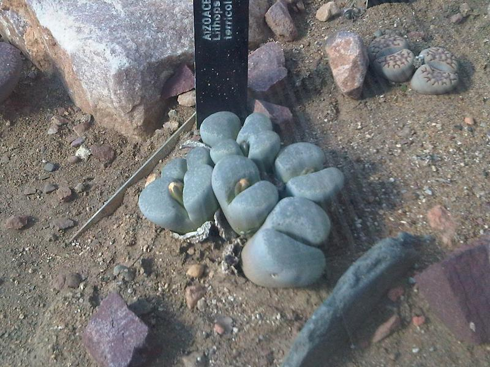
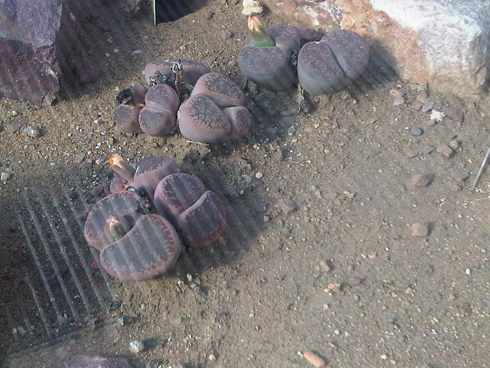
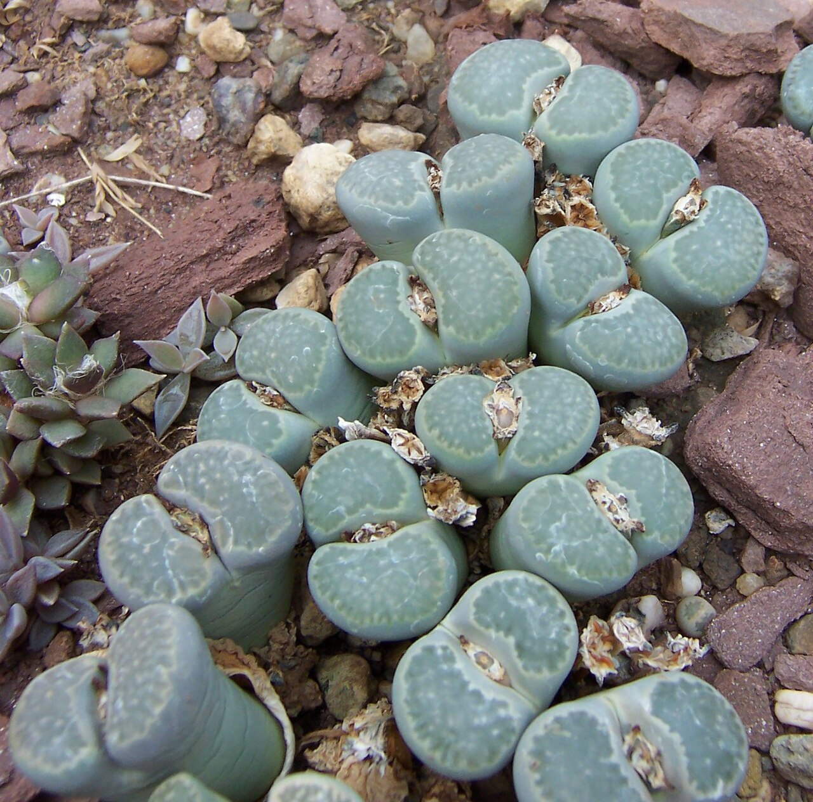
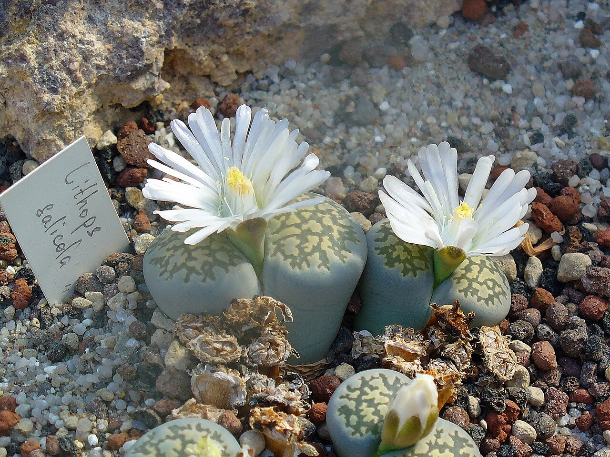
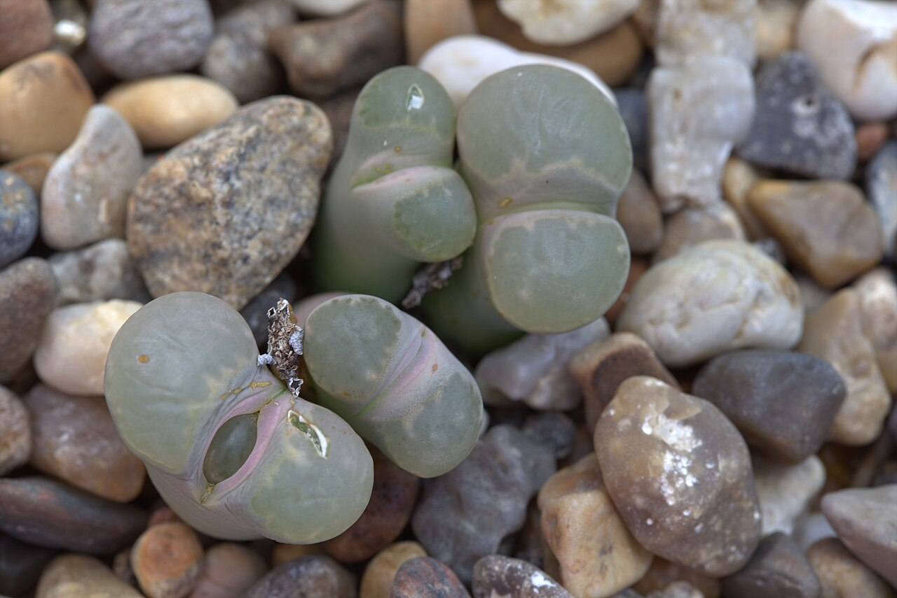
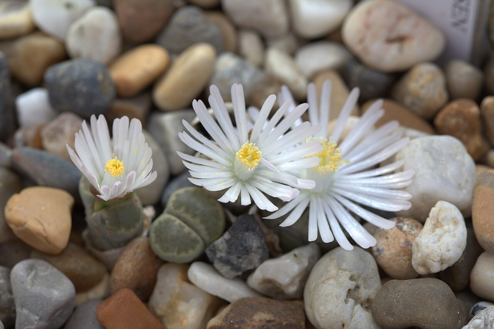
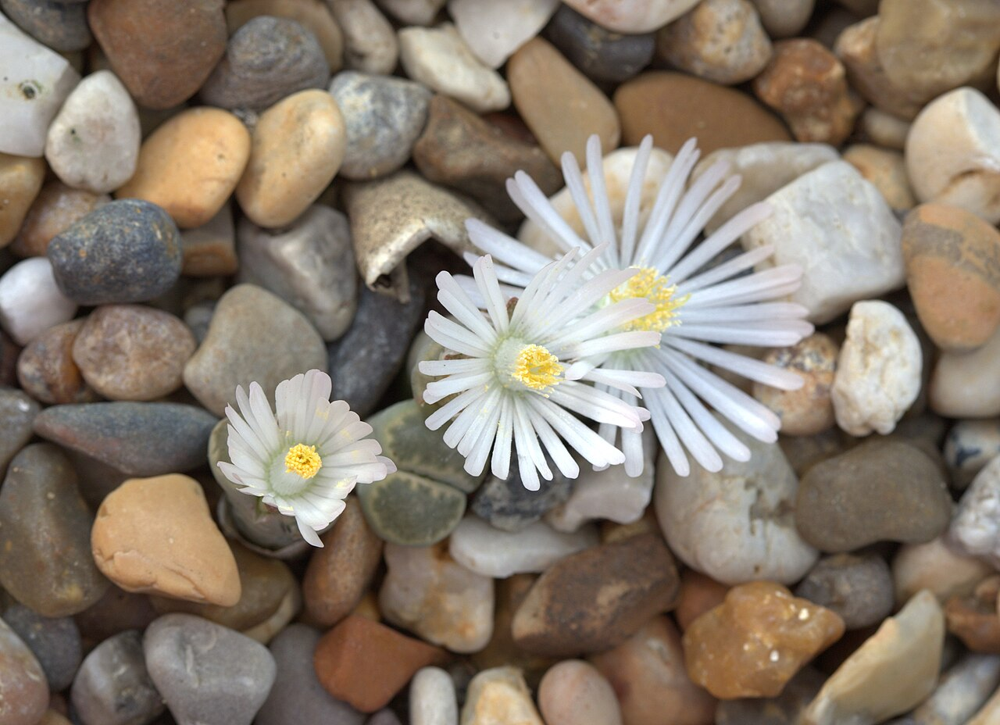
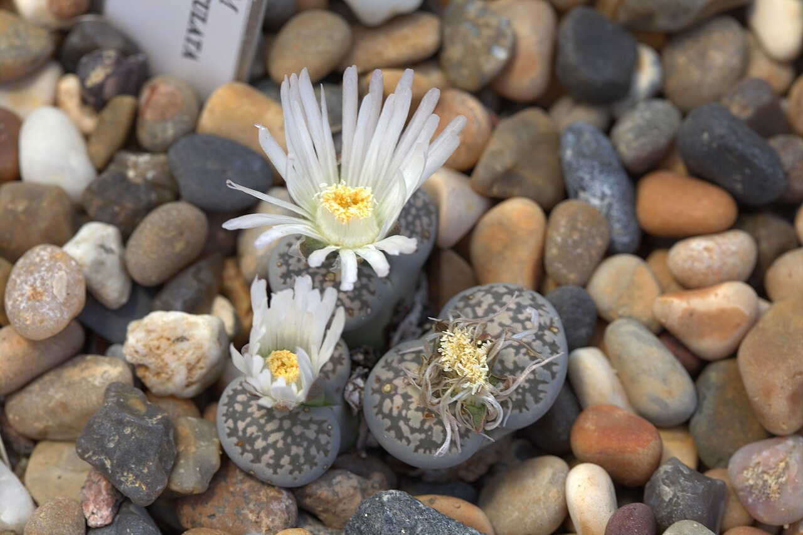
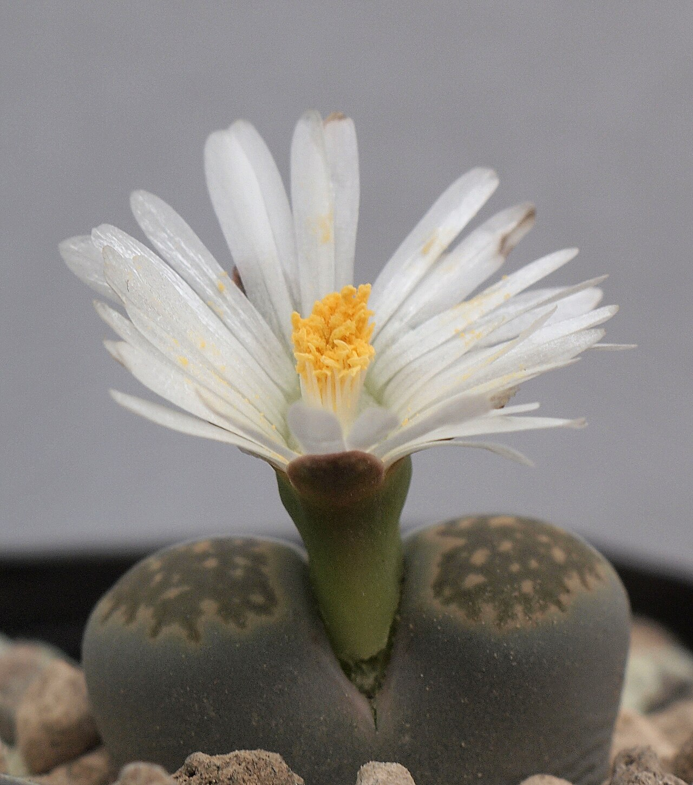
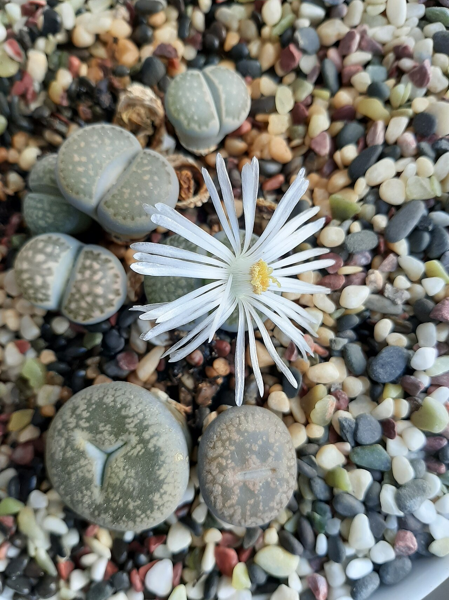

# Lithops salicola photo archive

_Lithops salicola_ - Succulent-15B

Collection label ID: `#9`.

Species-reference photographs for the probable Lithops salicola identification, including casual-grade cultivated iNaturalist observations. The owned grey/green heads are identified from photographs only; species and cultivar remain unconfirmed.

Collection research: [open the plant profile](../../../docs/plants/succulents/lithops-salicola.md).

## Gallery

_habit_ - [Caryophyllales - Lithops salicola 1.jpg](https://commons.wikimedia.org/wiki/File:Caryophyllales_-_Lithops_salicola_1.jpg); Emőke Dénes; [CC BY-SA 4.0](https://creativecommons.org/licenses/by-sa/4.0).

_habit_ - [Caryophyllales - Lithops salicola 2.jpg](https://commons.wikimedia.org/wiki/File:Caryophyllales_-_Lithops_salicola_2.jpg); Emőke Dénes; [CC BY-SA 4.0](https://creativecommons.org/licenses/by-sa/4.0).

_habit_ - [Lithops salicola.jpg](https://commons.wikimedia.org/wiki/File:Lithops_salicola.jpg); Dysmorodrepanis; [CC BY-SA 3.0](https://creativecommons.org/licenses/by-sa/3.0/).

_habit_ - [Lithops salicola 01.jpg](https://commons.wikimedia.org/wiki/File:Lithops_salicola_01.jpg); H. Zell; [CC BY-SA 3.0](https://creativecommons.org/licenses/by-sa/3.0).

_habit_ - [Lithops salicola GotBot 2015 001.jpg](https://commons.wikimedia.org/wiki/File:Lithops_salicola_GotBot_2015_001.jpg); Averater; [CC BY-SA 3.0](https://creativecommons.org/licenses/by-sa/3.0).

_habit_ - [Lithops salicola GotBot 2015 002.jpg](https://commons.wikimedia.org/wiki/File:Lithops_salicola_GotBot_2015_002.jpg); Averater; [CC BY 4.0](https://creativecommons.org/licenses/by/4.0).

_habit_ - [Lithops salicola GotBot 2015 003.jpg](https://commons.wikimedia.org/wiki/File:Lithops_salicola_GotBot_2015_003.jpg); Averater; [CC BY 4.0](https://creativecommons.org/licenses/by/4.0).

_habit_ - [Lithops salicola f. maculata GotBot 2015 001.jpg](https://commons.wikimedia.org/wiki/File:Lithops_salicola_f._maculata_GotBot_2015_001.jpg); Averater; [CC BY 4.0](https://creativecommons.org/licenses/by/4.0).

_habit_ - [Lithops salicola1.jpg](https://commons.wikimedia.org/wiki/File:Lithops_salicola1.jpg); Dornenwolf; [CC BY 2.0](https://creativecommons.org/licenses/by/2.0).

_habit_ - [Lithops salicola 202010.jpg](https://commons.wikimedia.org/wiki/File:Lithops_salicola_202010.jpg); Shi Annan; [CC BY-SA 4.0](https://creativecommons.org/licenses/by-sa/4.0).

## File details

| File                                                       | Subject | Source                                                                                                        | Creator         | License                                                         |
| ---------------------------------------------------------- | ------- | ------------------------------------------------------------------------------------------------------------- | --------------- | --------------------------------------------------------------- |
| [commons-16972063-habit.jpg](./commons-16972063-habit.jpg) | habit   | [Wikimedia Commons](https://commons.wikimedia.org/wiki/File:Caryophyllales_-_Lithops_salicola_1.jpg)          | Emőke Dénes     | [CC BY-SA 4.0](https://creativecommons.org/licenses/by-sa/4.0)  |
| [commons-16972070-habit.jpg](./commons-16972070-habit.jpg) | habit   | [Wikimedia Commons](https://commons.wikimedia.org/wiki/File:Caryophyllales_-_Lithops_salicola_2.jpg)          | Emőke Dénes     | [CC BY-SA 4.0](https://creativecommons.org/licenses/by-sa/4.0)  |
| [commons-1780583-habit.jpg](./commons-1780583-habit.jpg)   | habit   | [Wikimedia Commons](https://commons.wikimedia.org/wiki/File:Lithops_salicola.jpg)                             | Dysmorodrepanis | [CC BY-SA 3.0](https://creativecommons.org/licenses/by-sa/3.0/) |
| [commons-23532992-habit.jpg](./commons-23532992-habit.jpg) | habit   | [Wikimedia Commons](https://commons.wikimedia.org/wiki/File:Lithops_salicola_01.jpg)                          | H. Zell         | [CC BY-SA 3.0](https://creativecommons.org/licenses/by-sa/3.0)  |
| [commons-39516372-habit.jpg](./commons-39516372-habit.jpg) | habit   | [Wikimedia Commons](https://commons.wikimedia.org/wiki/File:Lithops_salicola_GotBot_2015_001.jpg)             | Averater        | [CC BY-SA 3.0](https://creativecommons.org/licenses/by-sa/3.0)  |
| [commons-44573105-habit.jpg](./commons-44573105-habit.jpg) | habit   | [Wikimedia Commons](https://commons.wikimedia.org/wiki/File:Lithops_salicola_GotBot_2015_002.jpg)             | Averater        | [CC BY 4.0](https://creativecommons.org/licenses/by/4.0)        |
| [commons-44573143-habit.jpg](./commons-44573143-habit.jpg) | habit   | [Wikimedia Commons](https://commons.wikimedia.org/wiki/File:Lithops_salicola_GotBot_2015_003.jpg)             | Averater        | [CC BY 4.0](https://creativecommons.org/licenses/by/4.0)        |
| [commons-44573185-habit.jpg](./commons-44573185-habit.jpg) | habit   | [Wikimedia Commons](https://commons.wikimedia.org/wiki/File:Lithops_salicola_f._maculata_GotBot_2015_001.jpg) | Averater        | [CC BY 4.0](https://creativecommons.org/licenses/by/4.0)        |
| [commons-65021059-habit.jpg](./commons-65021059-habit.jpg) | habit   | [Wikimedia Commons](https://commons.wikimedia.org/wiki/File:Lithops_salicola1.jpg)                            | Dornenwolf      | [CC BY 2.0](https://creativecommons.org/licenses/by/2.0)        |
| [commons-95424989-habit.jpg](./commons-95424989-habit.jpg) | habit   | [Wikimedia Commons](https://commons.wikimedia.org/wiki/File:Lithops_salicola_202010.jpg)                      | Shi Annan       | [CC BY-SA 4.0](https://creativecommons.org/licenses/by-sa/4.0)  |

Metadata and SHA-256 hashes are also available in [the global manifest](../photo-manifest.json).
