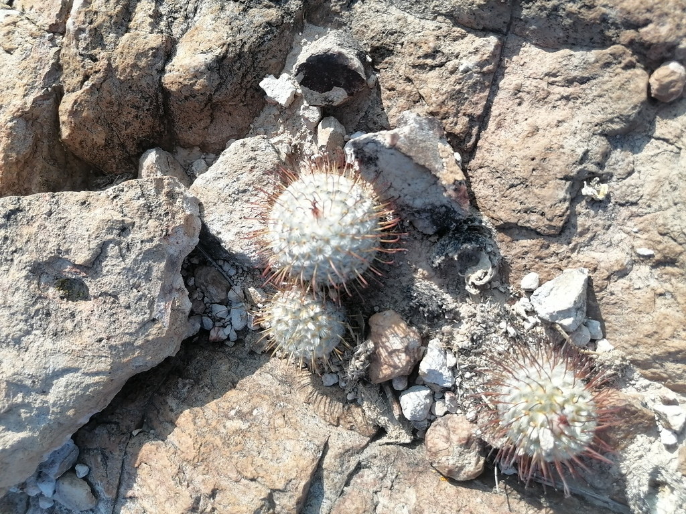
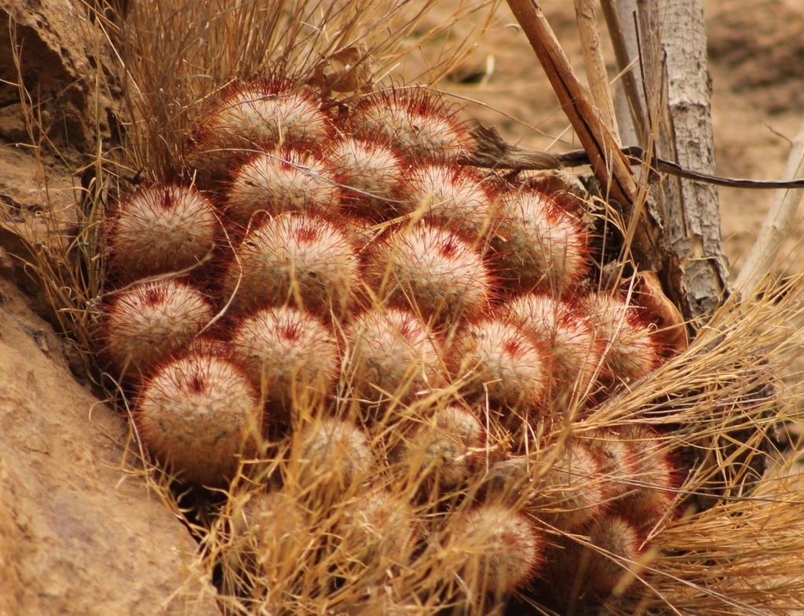
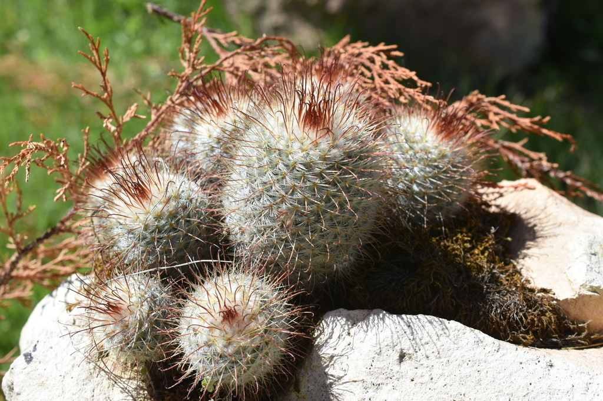
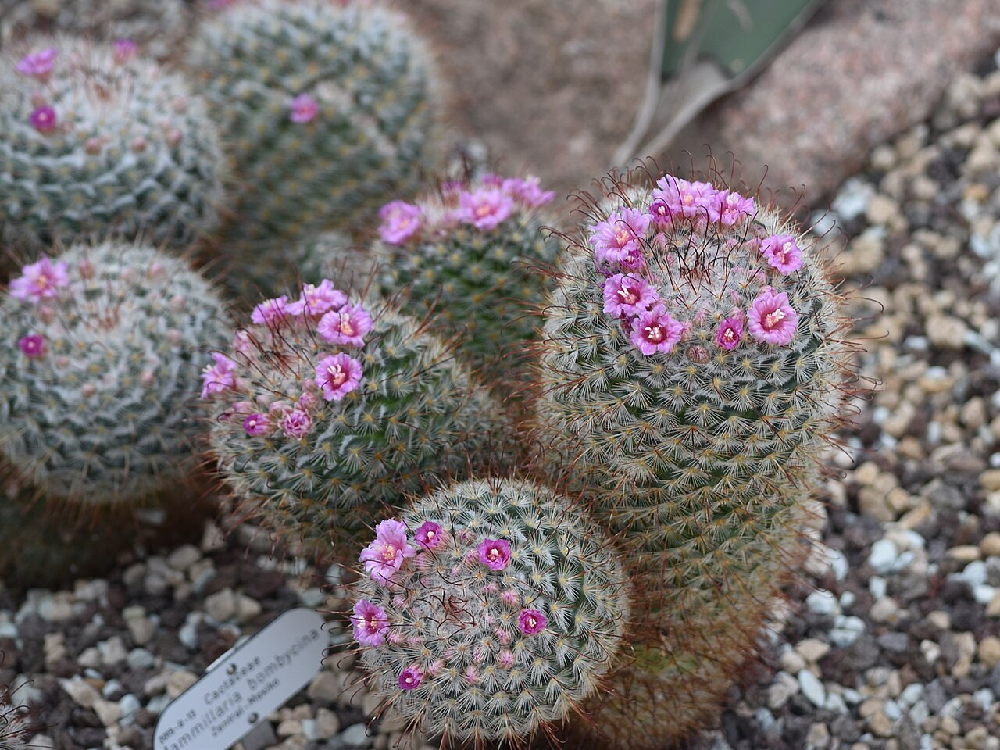
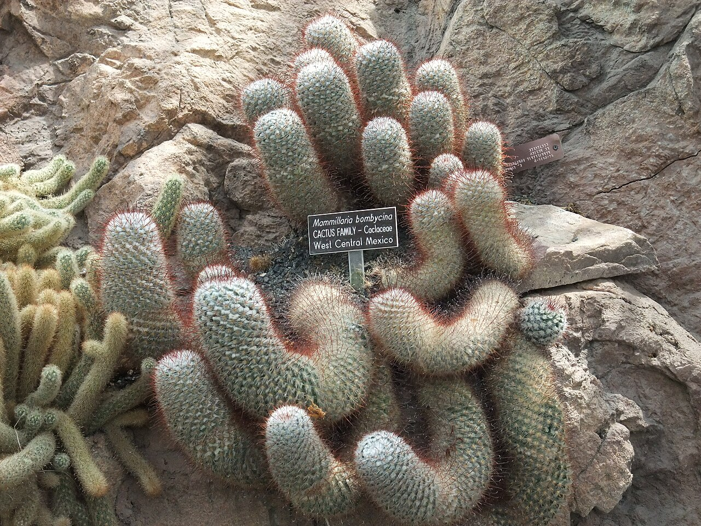
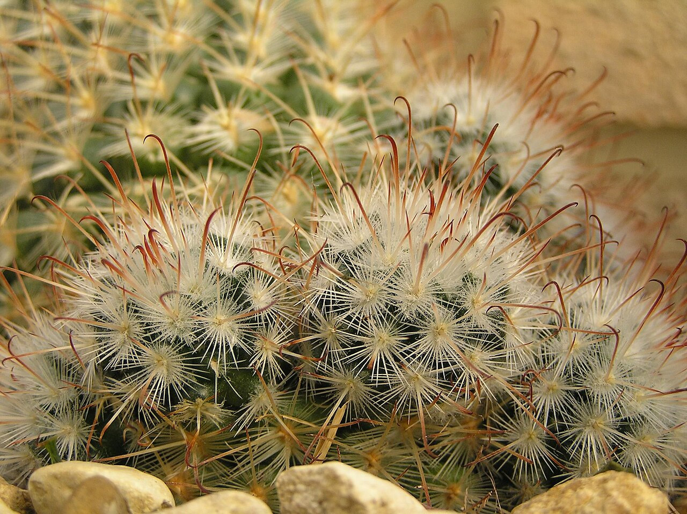
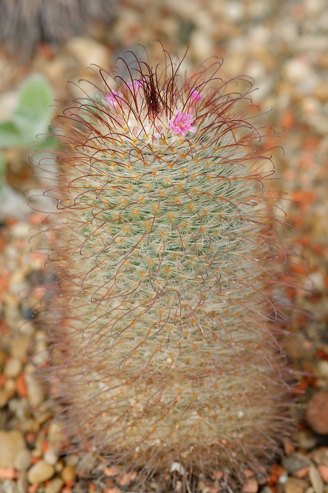
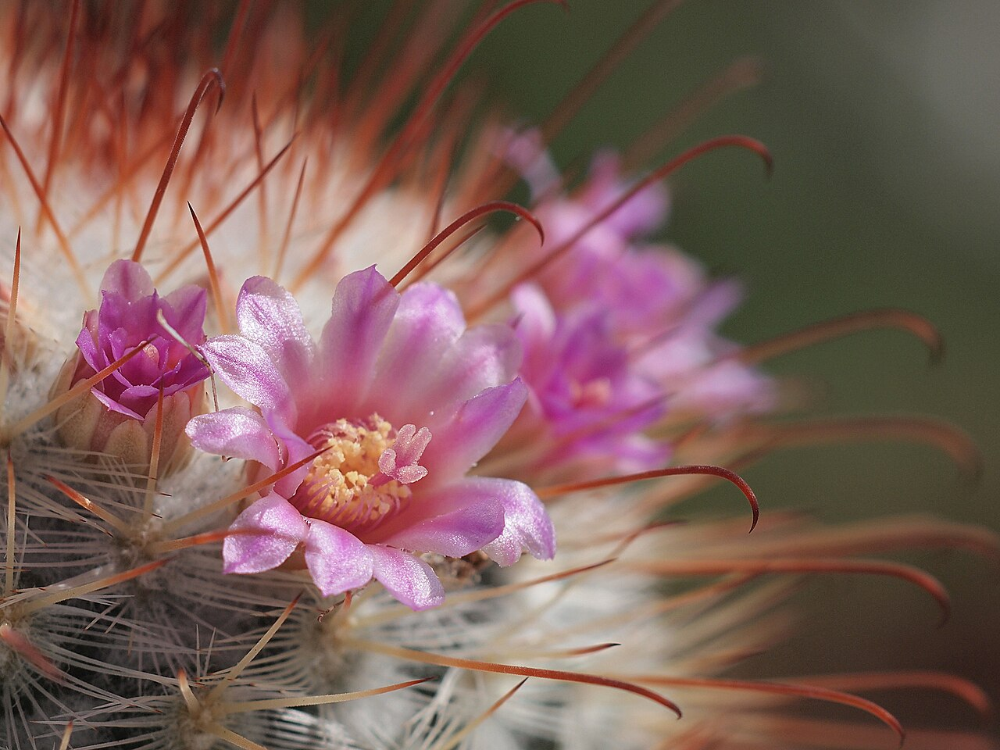

# Silken pincushion cactus photo archive

_Mammillaria bombycina_ - Rehab-04

Collection label ID: none (historical record only).

Species-reference photographs for the archived Rehab-04 record; the plant was removed on 2026-07-24 and its photo-based ID remains provisional.

Collection research: [open the plant profile](../../../docs/plants/rehab/mammillaria-bombycina.md).

## Gallery

_habitat_ - [Mammillaria bombycina in habitat](https://www.inaturalist.org/observations/181952595); (c) Ulises Pinedo, some rights reserved (CC BY); [CC BY](https://creativecommons.org/licenses/by/4.0/).

_habitat_ - [Mammillaria bombycina in habitat](https://www.inaturalist.org/observations/78796034); (c) Cristóbal Rangel, some rights reserved (CC BY); [CC BY](https://creativecommons.org/licenses/by/4.0/).

_habitat_ - [Mammillaria bombycina in habitat](https://www.inaturalist.org/observations/98295751); (c) P Gonzalez Zamora, some rights reserved (CC BY); [CC BY](https://creativecommons.org/licenses/by/4.0/).

_habit_ - [Cactaceae Mammillaria bombycina 2.jpg](https://commons.wikimedia.org/wiki/File:Cactaceae_Mammillaria_bombycina_2.jpg); NasserHalaweh; [CC BY-SA 4.0](https://creativecommons.org/licenses/by-sa/4.0).

_habit_ - [MammillariaBombycina.jpg](https://commons.wikimedia.org/wiki/File:MammillariaBombycina.jpg); Chhe; [Public domain](https://creativecommons.org/publicdomain/zero/1.0/).

_flower_ - [Cactii grown from seed.jpg](https://commons.wikimedia.org/wiki/File:Cactii_grown_from_seed.jpg); Unknown author Unknown author; [Public domain](https://creativecommons.org/publicdomain/zero/1.0/).

_habitat_ - [Mammillaria bombycina Jardin des Plantes.jpg](https://commons.wikimedia.org/wiki/File:Mammillaria_bombycina_Jardin_des_Plantes.jpg); Marie-Lan Nguyen; [CC BY 2.5](https://creativecommons.org/licenses/by/2.5).

_detail_ - [Mammillaria bombycina (7121557803).jpg](<https://commons.wikimedia.org/wiki/File:Mammillaria_bombycina_(7121557803).jpg>); Dornenwolf from Deutschland; [CC BY 2.0](https://creativecommons.org/licenses/by/2.0).

## File details

| File                                                                                         | Subject | Source                                                                                                    | Creator                                             | License                                                             |
| -------------------------------------------------------------------------------------------- | ------- | --------------------------------------------------------------------------------------------------------- | --------------------------------------------------- | ------------------------------------------------------------------- |
| [inaturalist-181952595-317152088-habitat.jpg](./inaturalist-181952595-317152088-habitat.jpg) | habitat | [iNaturalist](https://www.inaturalist.org/observations/181952595)                                         | (c) Ulises Pinedo, some rights reserved (CC BY)     | [CC BY](https://creativecommons.org/licenses/by/4.0/)               |
| [inaturalist-78796034-128999103-habitat.jpg](./inaturalist-78796034-128999103-habitat.jpg)   | habitat | [iNaturalist](https://www.inaturalist.org/observations/78796034)                                          | (c) Cristóbal Rangel, some rights reserved (CC BY)  | [CC BY](https://creativecommons.org/licenses/by/4.0/)               |
| [inaturalist-98295751-163621391-habitat.jpg](./inaturalist-98295751-163621391-habitat.jpg)   | habitat | [iNaturalist](https://www.inaturalist.org/observations/98295751)                                          | (c) P Gonzalez Zamora, some rights reserved (CC BY) | [CC BY](https://creativecommons.org/licenses/by/4.0/)               |
| [commons-105093187-habit.jpg](./commons-105093187-habit.jpg)                                 | habit   | [Wikimedia Commons](https://commons.wikimedia.org/wiki/File:Cactaceae_Mammillaria_bombycina_2.jpg)        | NasserHalaweh                                       | [CC BY-SA 4.0](https://creativecommons.org/licenses/by-sa/4.0)      |
| [commons-11508476-habit.jpg](./commons-11508476-habit.jpg)                                   | habit   | [Wikimedia Commons](https://commons.wikimedia.org/wiki/File:MammillariaBombycina.jpg)                     | Chhe                                                | [Public domain](https://creativecommons.org/publicdomain/zero/1.0/) |
| [commons-24894202-flower.jpg](./commons-24894202-flower.jpg)                                 | flower  | [Wikimedia Commons](https://commons.wikimedia.org/wiki/File:Cactii_grown_from_seed.jpg)                   | Unknown author Unknown author                       | [Public domain](https://creativecommons.org/publicdomain/zero/1.0/) |
| [commons-25149147-habitat.jpg](./commons-25149147-habitat.jpg)                               | habitat | [Wikimedia Commons](https://commons.wikimedia.org/wiki/File:Mammillaria_bombycina_Jardin_des_Plantes.jpg) | Marie-Lan Nguyen                                    | [CC BY 2.5](https://creativecommons.org/licenses/by/2.5)            |
| [commons-34798793-detail.jpg](./commons-34798793-detail.jpg)                                 | detail  | [Wikimedia Commons](<https://commons.wikimedia.org/wiki/File:Mammillaria_bombycina_(7121557803).jpg>)     | Dornenwolf from Deutschland                         | [CC BY 2.0](https://creativecommons.org/licenses/by/2.0)            |

Metadata and SHA-256 hashes are also available in [the global manifest](../photo-manifest.json).
