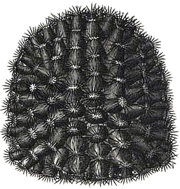
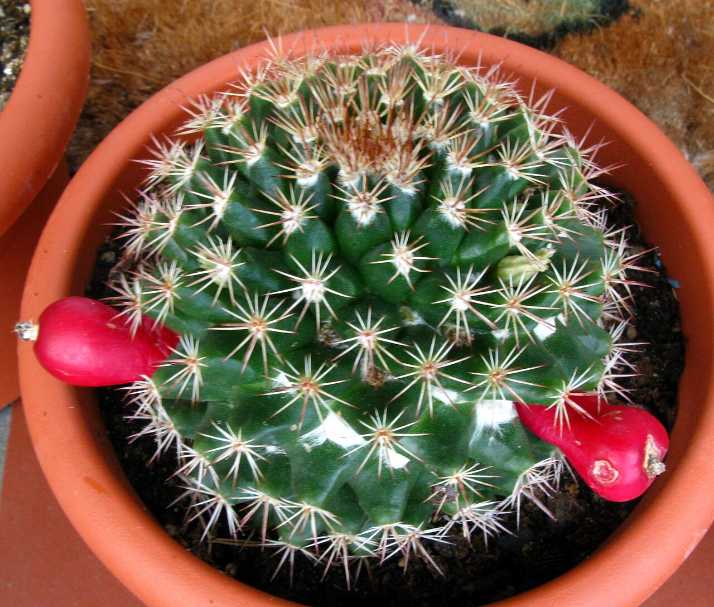
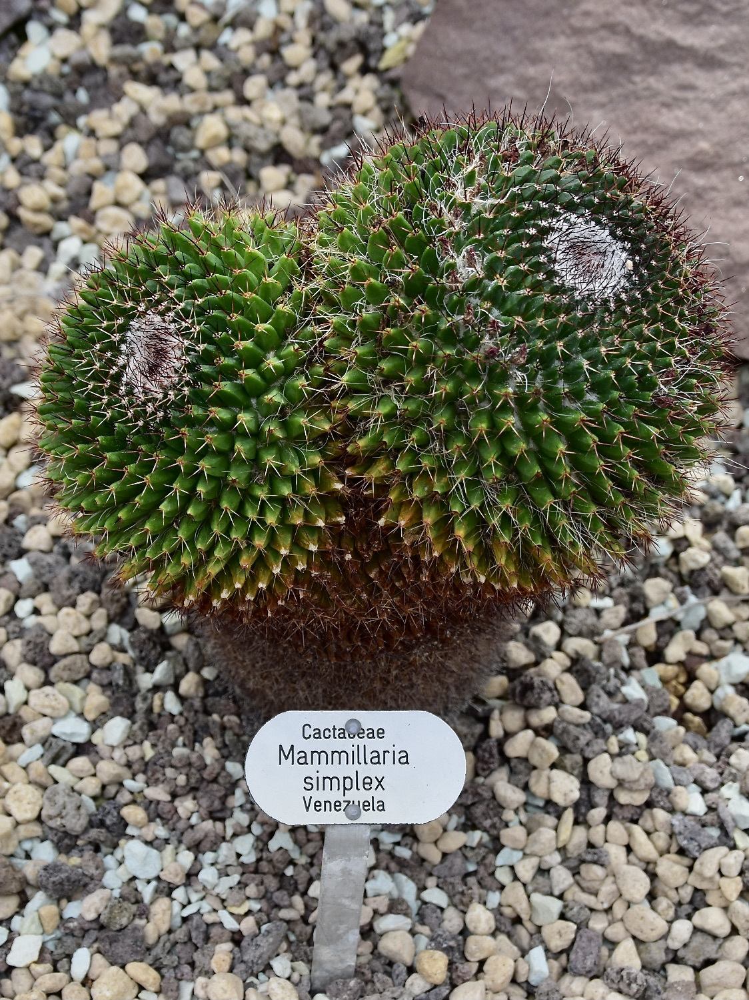
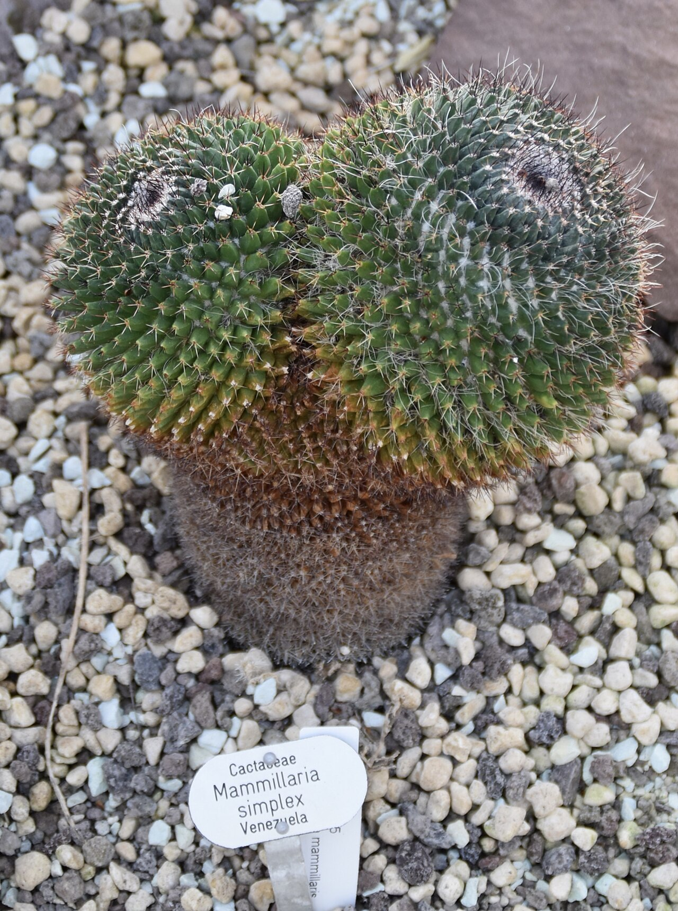
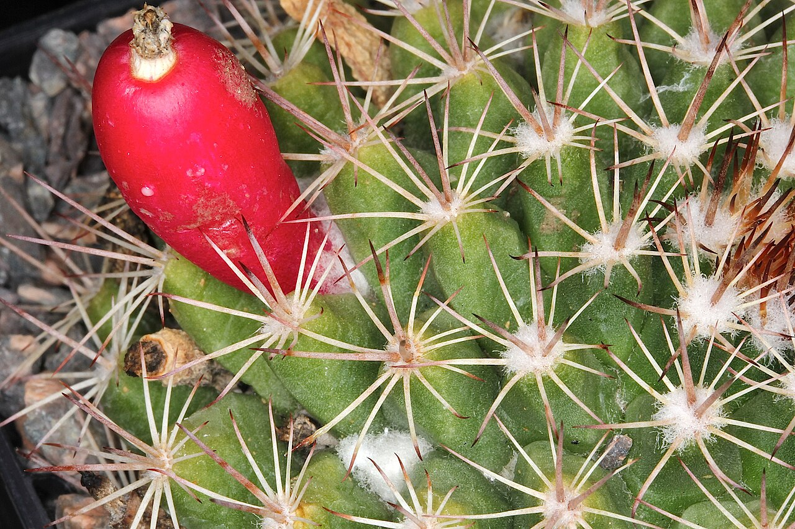
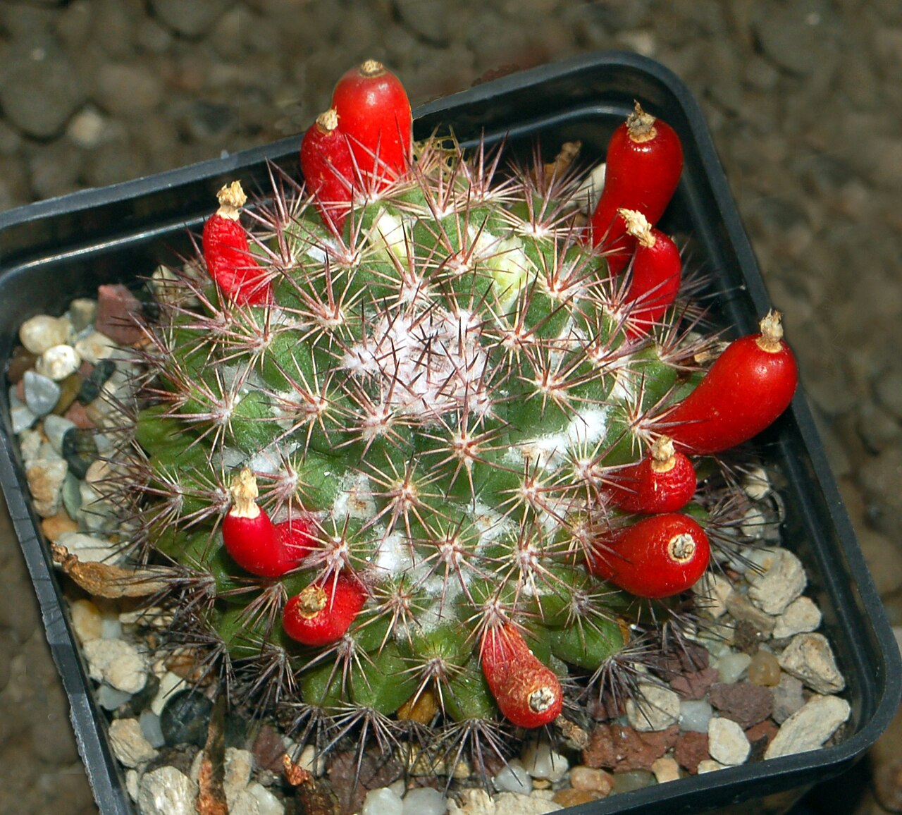

# Woolly nipple cactus photo archive

_Mammillaria mammillaris_ - Cactus-03

Collection label ID: `E3`.

Species-reference photographs; the collection ID is probable and replaces the former M. cf. melanocentra record after review of close photographs.

Collection research: [open the plant profile](../../../docs/plants/cacti/mammillaria-mammillaris.md).

## Gallery

_habit_ - [Plukenet Phytographia Vol 1 Plate 29 Fig 1.png](https://commons.wikimedia.org/wiki/File:Plukenet_Phytographia_Vol_1_Plate_29_Fig_1.png); Leonard Plukenet; [Public domain](https://creativecommons.org/publicdomain/zero/1.0/).

_habit_ - [Mammillaria mammillaris.jpg](https://commons.wikimedia.org/wiki/File:Mammillaria_mammillaris.jpg); Lourdes; [CC BY 2.0](https://creativecommons.org/licenses/by/2.0).

_habit_ - [Cactaceae Mammillaria mammillaris 1.jpg](https://commons.wikimedia.org/wiki/File:Cactaceae_Mammillaria_mammillaris_1.jpg); NasserHalaweh; [CC BY-SA 4.0](https://creativecommons.org/licenses/by-sa/4.0).

_habit_ - [Cactaceae Mammillaria mammillaris 2.jpg](https://commons.wikimedia.org/wiki/File:Cactaceae_Mammillaria_mammillaris_2.jpg); NasserHalaweh; [CC BY-SA 4.0](https://creativecommons.org/licenses/by-sa/4.0).

_habit_ - [Mammillaria mammillaris pm 1.JPG](https://commons.wikimedia.org/wiki/File:Mammillaria_mammillaris_pm_1.JPG); Peter A. Mansfeld; [CC BY 3.0](https://creativecommons.org/licenses/by/3.0).

_fruit-seed_ - [Cactaceae - Mammillaria mammillaris.JPG](https://commons.wikimedia.org/wiki/File:Cactaceae_-_Mammillaria_mammillaris.JPG); Hectonichus; [CC BY-SA 3.0](https://creativecommons.org/licenses/by-sa/3.0).

## File details

| File                                                                 | Subject    | Source                                                                                                      | Creator           | License                                                             |
| -------------------------------------------------------------------- | ---------- | ----------------------------------------------------------------------------------------------------------- | ----------------- | ------------------------------------------------------------------- |
| [commons-10106507-habit.png](./commons-10106507-habit.png)           | habit      | [Wikimedia Commons](https://commons.wikimedia.org/wiki/File:Plukenet_Phytographia_Vol_1_Plate_29_Fig_1.png) | Leonard Plukenet  | [Public domain](https://creativecommons.org/publicdomain/zero/1.0/) |
| [commons-10673962-habit.jpg](./commons-10673962-habit.jpg)           | habit      | [Wikimedia Commons](https://commons.wikimedia.org/wiki/File:Mammillaria_mammillaris.jpg)                    | Lourdes           | [CC BY 2.0](https://creativecommons.org/licenses/by/2.0)            |
| [commons-108523918-habit.jpg](./commons-108523918-habit.jpg)         | habit      | [Wikimedia Commons](https://commons.wikimedia.org/wiki/File:Cactaceae_Mammillaria_mammillaris_1.jpg)        | NasserHalaweh     | [CC BY-SA 4.0](https://creativecommons.org/licenses/by-sa/4.0)      |
| [commons-108523984-habit.jpg](./commons-108523984-habit.jpg)         | habit      | [Wikimedia Commons](https://commons.wikimedia.org/wiki/File:Cactaceae_Mammillaria_mammillaris_2.jpg)        | NasserHalaweh     | [CC BY-SA 4.0](https://creativecommons.org/licenses/by-sa/4.0)      |
| [commons-19440297-habit.jpg](./commons-19440297-habit.jpg)           | habit      | [Wikimedia Commons](https://commons.wikimedia.org/wiki/File:Mammillaria_mammillaris_pm_1.JPG)               | Peter A. Mansfeld | [CC BY 3.0](https://creativecommons.org/licenses/by/3.0)            |
| [commons-19977882-fruit-seed.jpg](./commons-19977882-fruit-seed.jpg) | fruit-seed | [Wikimedia Commons](https://commons.wikimedia.org/wiki/File:Cactaceae_-_Mammillaria_mammillaris.JPG)        | Hectonichus       | [CC BY-SA 3.0](https://creativecommons.org/licenses/by-sa/3.0)      |

Metadata and SHA-256 hashes are also available in [the global manifest](../photo-manifest.json).
