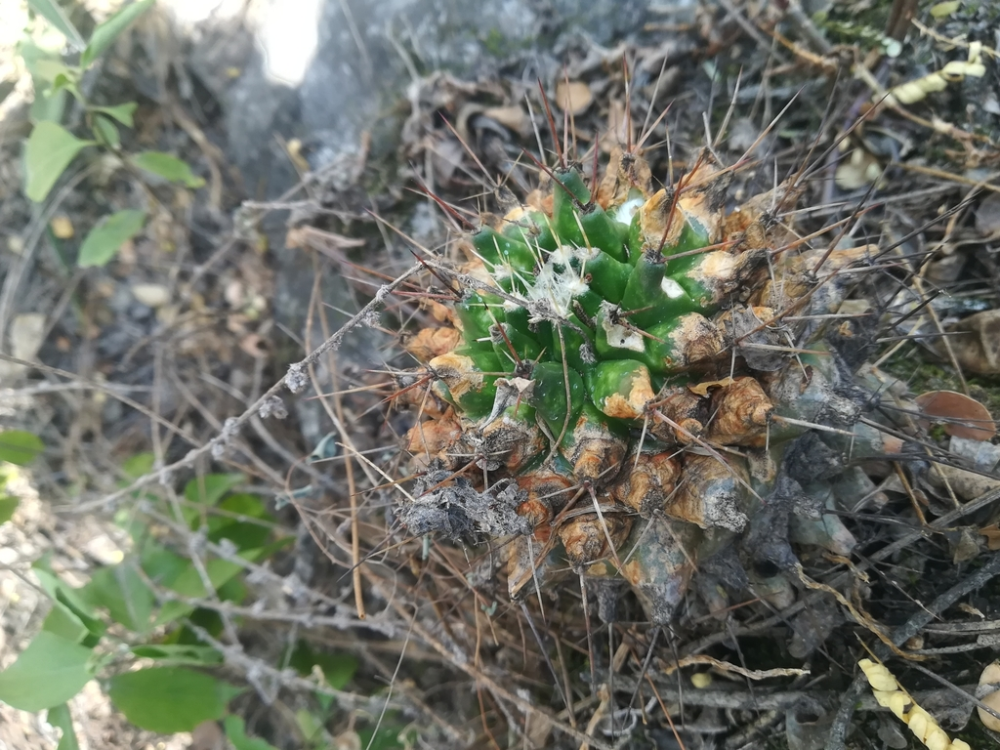
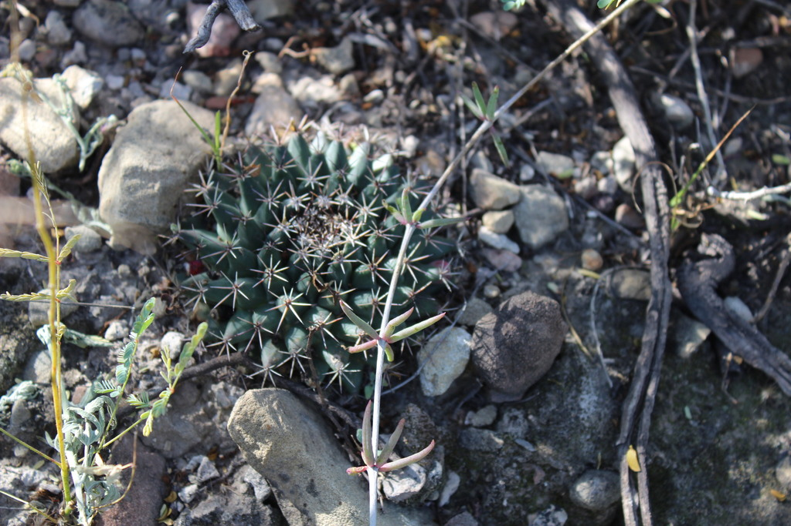
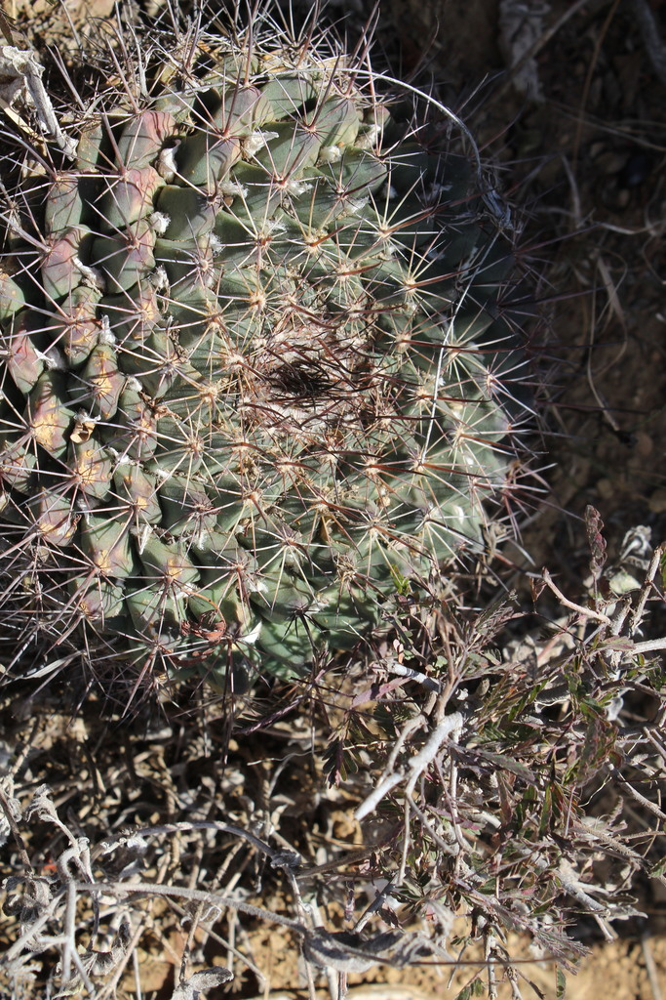
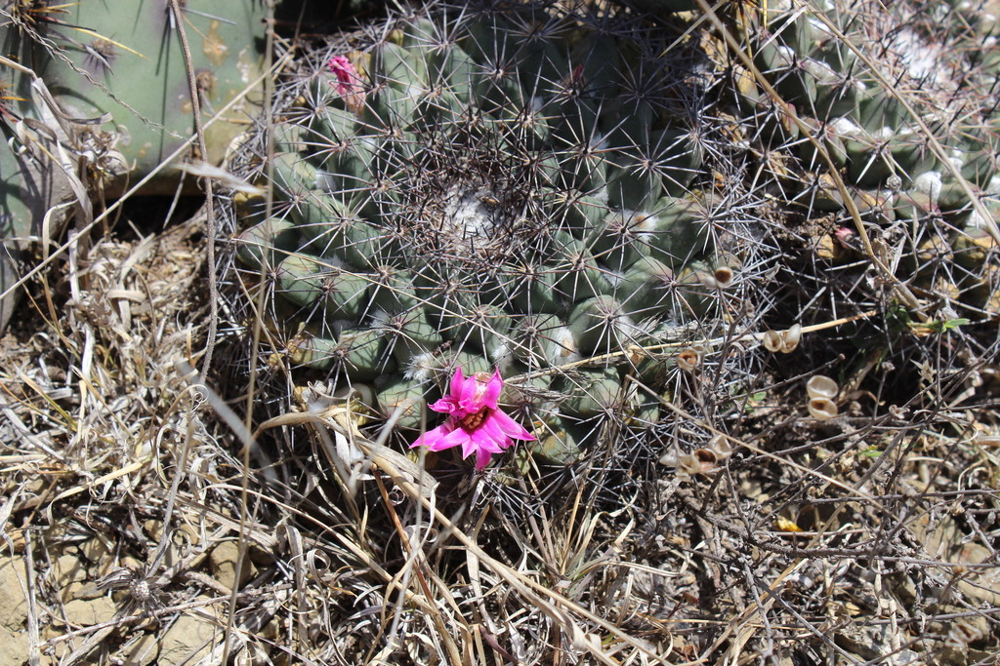
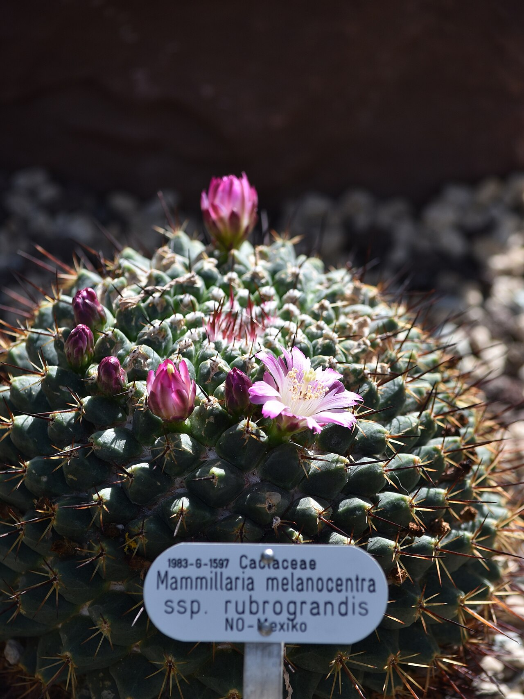
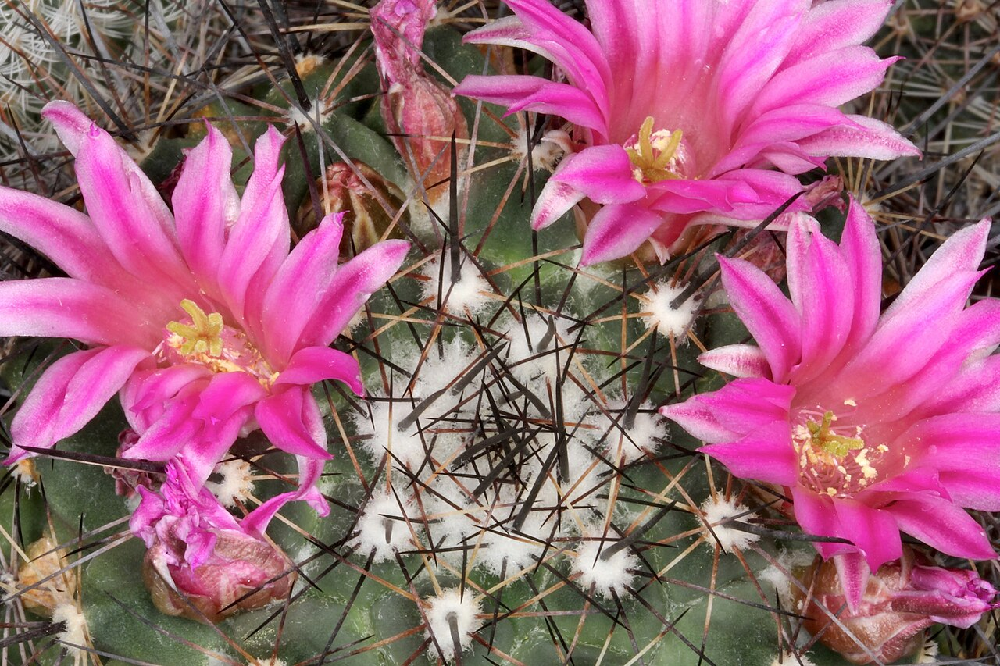
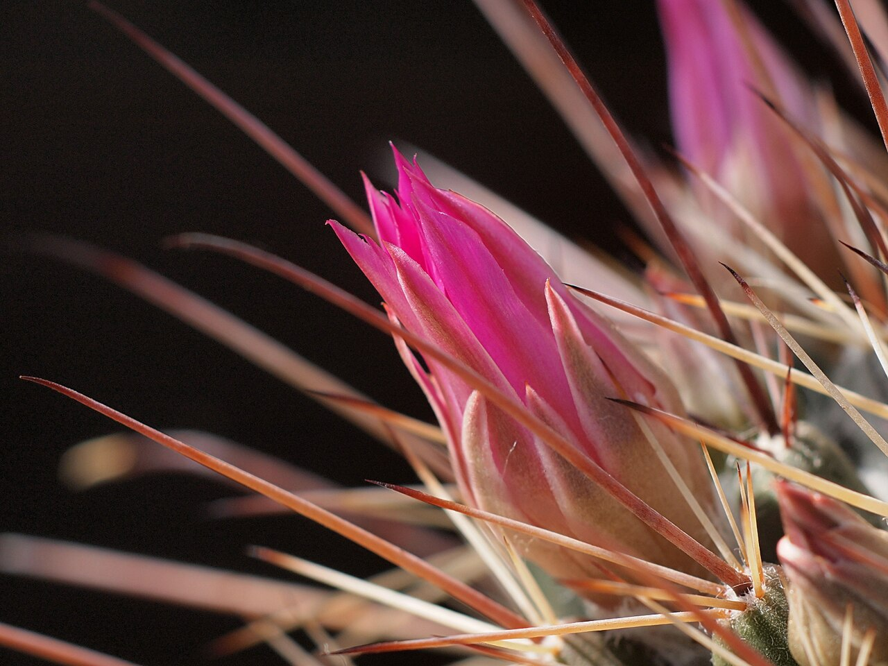
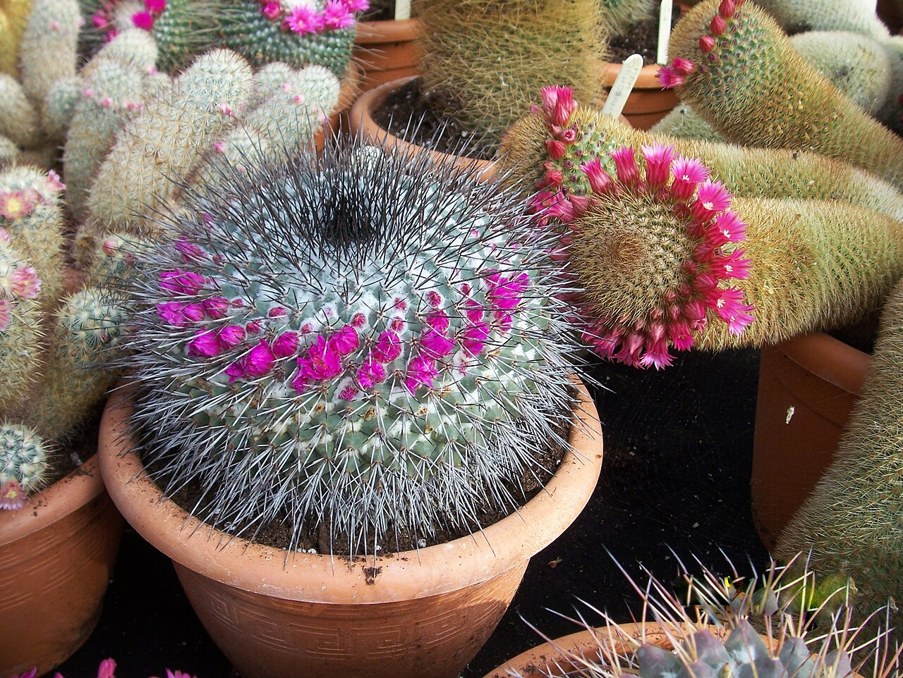

# Black-centered pincushion cactus photo archive

_Mammillaria melanocentra_ - Cactus-03

Collection label ID: `E3`.

Species-reference photographs; the collection ID is probable and M. mystax remains the main alternative.

Collection research: [open the plant profile](../../../docs/plants/cacti/mammillaria-melanocentra.md).

## Gallery

_habitat_ - [Mammillaria melanocentra in habitat](https://www.inaturalist.org/observations/28380373); (c) Francisco Martínez González, some rights reserved (CC BY-SA); [CC BY SA](https://creativecommons.org/licenses/by/4.0/).

_habitat_ - [Mammillaria melanocentra in habitat](https://www.inaturalist.org/observations/61060076); (c) Francisco Martínez González, some rights reserved (CC BY-SA); [CC BY SA](https://creativecommons.org/licenses/by/4.0/).

_habitat_ - [Mammillaria melanocentra in habitat](https://www.inaturalist.org/observations/69120036); (c) Francisco Martínez González, some rights reserved (CC BY-SA); [CC BY SA](https://creativecommons.org/licenses/by/4.0/).

_habitat_ - [Mammillaria melanocentra in habitat](https://www.inaturalist.org/observations/69120038); (c) Francisco Martínez González, some rights reserved (CC BY-SA); [CC BY SA](https://creativecommons.org/licenses/by/4.0/).

_habit_ - [Cactaceae Mammillaria melanocentra 2.jpg](https://commons.wikimedia.org/wiki/File:Cactaceae_Mammillaria_melanocentra_2.jpg); NasserHalaweh; [CC BY-SA 4.0](https://creativecommons.org/licenses/by-sa/4.0).

_flower_ - [Mammillaria melanocentra pm 1.JPG](https://commons.wikimedia.org/wiki/File:Mammillaria_melanocentra_pm_1.JPG); Peter A. Mansfeld; [CC BY 3.0](https://creativecommons.org/licenses/by/3.0).

_flower_ - [Mammillaria melanocentra (8717382905).jpg](<https://commons.wikimedia.org/wiki/File:Mammillaria_melanocentra_(8717382905).jpg>); Dornenwolf from Deutschland; [CC BY 2.0](https://creativecommons.org/licenses/by/2.0).

_flower_ - [Mammillaria melanocentra (3422604664).jpg](<https://commons.wikimedia.org/wiki/File:Mammillaria_melanocentra_(3422604664).jpg>); Leonora Enking from West Sussex, England; [CC BY-SA 2.0](https://creativecommons.org/licenses/by-sa/2.0).

## File details

| File                                                                                       | Subject | Source                                                                                                   | Creator                                                          | License                                                        |
| ------------------------------------------------------------------------------------------ | ------- | -------------------------------------------------------------------------------------------------------- | ---------------------------------------------------------------- | -------------------------------------------------------------- |
| [inaturalist-28380373-44236951-habitat.jpg](./inaturalist-28380373-44236951-habitat.jpg)   | habitat | [iNaturalist](https://www.inaturalist.org/observations/28380373)                                         | (c) Francisco Martínez González, some rights reserved (CC BY-SA) | [CC BY SA](https://creativecommons.org/licenses/by/4.0/)       |
| [inaturalist-61060076-97666154-habitat.jpg](./inaturalist-61060076-97666154-habitat.jpg)   | habitat | [iNaturalist](https://www.inaturalist.org/observations/61060076)                                         | (c) Francisco Martínez González, some rights reserved (CC BY-SA) | [CC BY SA](https://creativecommons.org/licenses/by/4.0/)       |
| [inaturalist-69120036-112086394-habitat.jpg](./inaturalist-69120036-112086394-habitat.jpg) | habitat | [iNaturalist](https://www.inaturalist.org/observations/69120036)                                         | (c) Francisco Martínez González, some rights reserved (CC BY-SA) | [CC BY SA](https://creativecommons.org/licenses/by/4.0/)       |
| [inaturalist-69120038-112086424-habitat.jpg](./inaturalist-69120038-112086424-habitat.jpg) | habitat | [iNaturalist](https://www.inaturalist.org/observations/69120038)                                         | (c) Francisco Martínez González, some rights reserved (CC BY-SA) | [CC BY SA](https://creativecommons.org/licenses/by/4.0/)       |
| [commons-105093356-habit.jpg](./commons-105093356-habit.jpg)                               | habit   | [Wikimedia Commons](https://commons.wikimedia.org/wiki/File:Cactaceae_Mammillaria_melanocentra_2.jpg)    | NasserHalaweh                                                    | [CC BY-SA 4.0](https://creativecommons.org/licenses/by-sa/4.0) |
| [commons-25863084-habit.jpg](./commons-25863084-habit.jpg)                                 | flower  | [Wikimedia Commons](https://commons.wikimedia.org/wiki/File:Mammillaria_melanocentra_pm_1.JPG)           | Peter A. Mansfeld                                                | [CC BY 3.0](https://creativecommons.org/licenses/by/3.0)       |
| [commons-34799159-habit.jpg](./commons-34799159-habit.jpg)                                 | flower  | [Wikimedia Commons](<https://commons.wikimedia.org/wiki/File:Mammillaria_melanocentra_(8717382905).jpg>) | Dornenwolf from Deutschland                                      | [CC BY 2.0](https://creativecommons.org/licenses/by/2.0)       |
| [commons-47289621-habitat.jpg](./commons-47289621-habitat.jpg)                             | flower  | [Wikimedia Commons](<https://commons.wikimedia.org/wiki/File:Mammillaria_melanocentra_(3422604664).jpg>) | Leonora Enking from West Sussex, England                         | [CC BY-SA 2.0](https://creativecommons.org/licenses/by-sa/2.0) |

Metadata and SHA-256 hashes are also available in [the global manifest](../photo-manifest.json).
