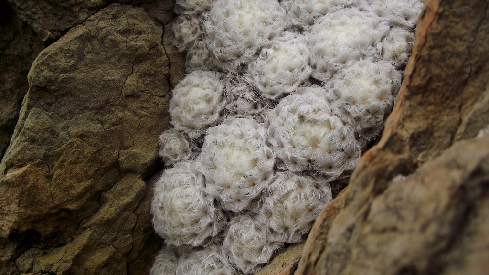
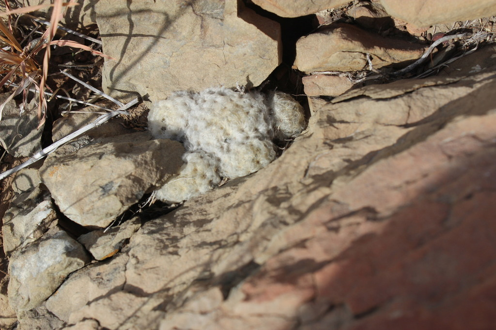
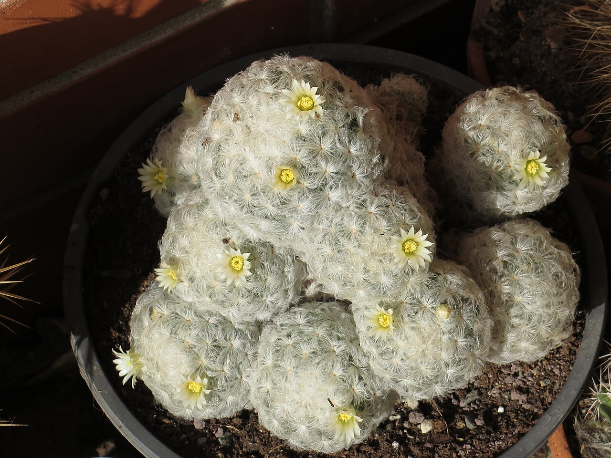
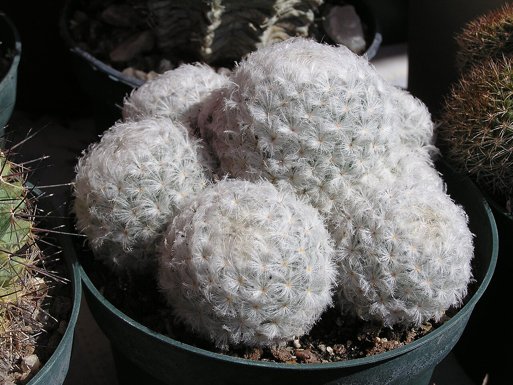
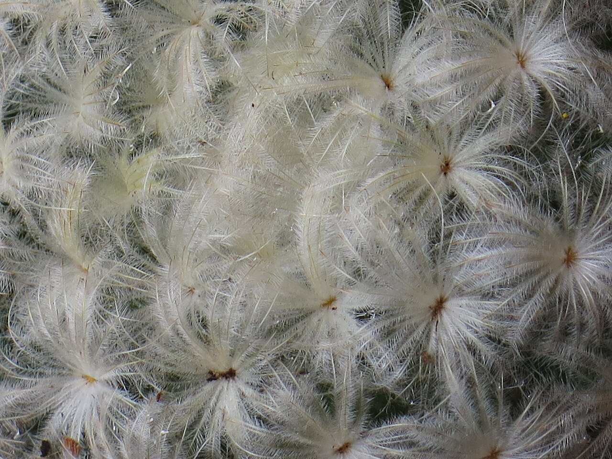
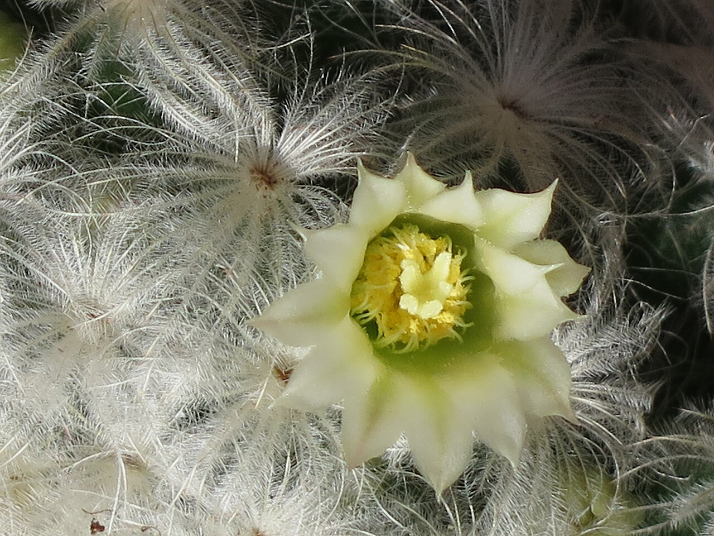

# Feather cactus photo archive

*Mammillaria plumosa* - Starter-05

Species-reference photographs.

Collection research: [open the plant profile](../../../docs/plants/starter/mammillaria-plumosa.md).

## Gallery

*habitat* - [Mammillaria plumosa in habitat](<https://www.inaturalist.org/observations/4727891>); (c) Raúl Ernestoo, some rights reserved (CC BY-SA); [CC BY SA](<https://creativecommons.org/licenses/by/4.0/>).

*habitat* - [Mammillaria plumosa in habitat](<https://www.inaturalist.org/observations/72491527>); (c) Francisco Martínez González, some rights reserved (CC BY-SA); [CC BY SA](<https://creativecommons.org/licenses/by/4.0/>).

*habit* - [Mammillaria plumosa 21.jpg](<https://commons.wikimedia.org/wiki/File:Mammillaria_plumosa_21.jpg>); Petar43; [CC BY-SA 4.0](<https://creativecommons.org/licenses/by-sa/4.0>).

*habit* - [2010. Выставка цветов в Донецке на день города 06.jpg](<https://commons.wikimedia.org/wiki/File:2010._%D0%92%D1%8B%D1%81%D1%82%D0%B0%D0%B2%D0%BA%D0%B0_%D1%86%D0%B2%D0%B5%D1%82%D0%BE%D0%B2_%D0%B2_%D0%94%D0%BE%D0%BD%D0%B5%D1%86%D0%BA%D0%B5_%D0%BD%D0%B0_%D0%B4%D0%B5%D0%BD%D1%8C_%D0%B3%D0%BE%D1%80%D0%BE%D0%B4%D0%B0_06.jpg>); Andrey Butko; [CC BY-SA 3.0](<https://creativecommons.org/licenses/by-sa/3.0>).

*detail* - [Mammillaria plumosa 9.JPG](<https://commons.wikimedia.org/wiki/File:Mammillaria_plumosa_9.JPG>); Petar43; [CC BY-SA 4.0](<https://creativecommons.org/licenses/by-sa/4.0>).

*flower* - [Mammillaria plumosa 14.JPG](<https://commons.wikimedia.org/wiki/File:Mammillaria_plumosa_14.JPG>); Petar43; [CC BY-SA 4.0](<https://creativecommons.org/licenses/by-sa/4.0>).

## File details

| File | Subject | Source | Creator | License |
| --- | --- | --- | --- | --- |
| [inaturalist-4727891-5716397-habitat.jpg](./inaturalist-4727891-5716397-habitat.jpg) | habitat | [iNaturalist](<https://www.inaturalist.org/observations/4727891>) | (c) Raúl Ernestoo, some rights reserved (CC BY-SA) | [CC BY SA](<https://creativecommons.org/licenses/by/4.0/>) |
| [inaturalist-72491527-118198885-habitat.jpg](./inaturalist-72491527-118198885-habitat.jpg) | habitat | [iNaturalist](<https://www.inaturalist.org/observations/72491527>) | (c) Francisco Martínez González, some rights reserved (CC BY-SA) | [CC BY SA](<https://creativecommons.org/licenses/by/4.0/>) |
| [commons-112375347-habit.jpg](./commons-112375347-habit.jpg) | habit | [Wikimedia Commons](<https://commons.wikimedia.org/wiki/File:Mammillaria_plumosa_21.jpg>) | Petar43 | [CC BY-SA 4.0](<https://creativecommons.org/licenses/by-sa/4.0>) |
| [commons-11493650-habit.jpg](./commons-11493650-habit.jpg) | habit | [Wikimedia Commons](<https://commons.wikimedia.org/wiki/File:2010._%D0%92%D1%8B%D1%81%D1%82%D0%B0%D0%B2%D0%BA%D0%B0_%D1%86%D0%B2%D0%B5%D1%82%D0%BE%D0%B2_%D0%B2_%D0%94%D0%BE%D0%BD%D0%B5%D1%86%D0%BA%D0%B5_%D0%BD%D0%B0_%D0%B4%D0%B5%D0%BD%D1%8C_%D0%B3%D0%BE%D1%80%D0%BE%D0%B4%D0%B0_06.jpg>) | Andrey Butko | [CC BY-SA 3.0](<https://creativecommons.org/licenses/by-sa/3.0>) |
| [commons-34854360-detail.jpg](./commons-34854360-detail.jpg) | detail | [Wikimedia Commons](<https://commons.wikimedia.org/wiki/File:Mammillaria_plumosa_9.JPG>) | Petar43 | [CC BY-SA 4.0](<https://creativecommons.org/licenses/by-sa/4.0>) |
| [commons-36588859-flower.jpg](./commons-36588859-flower.jpg) | flower | [Wikimedia Commons](<https://commons.wikimedia.org/wiki/File:Mammillaria_plumosa_14.JPG>) | Petar43 | [CC BY-SA 4.0](<https://creativecommons.org/licenses/by-sa/4.0>) |

Metadata and SHA-256 hashes are also available in [the global manifest](../photo-manifest.json).
