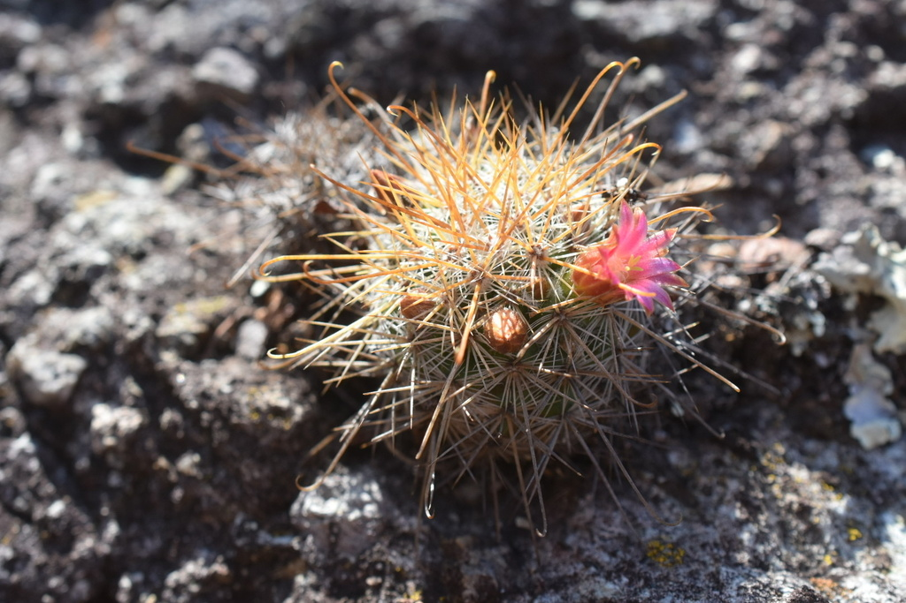
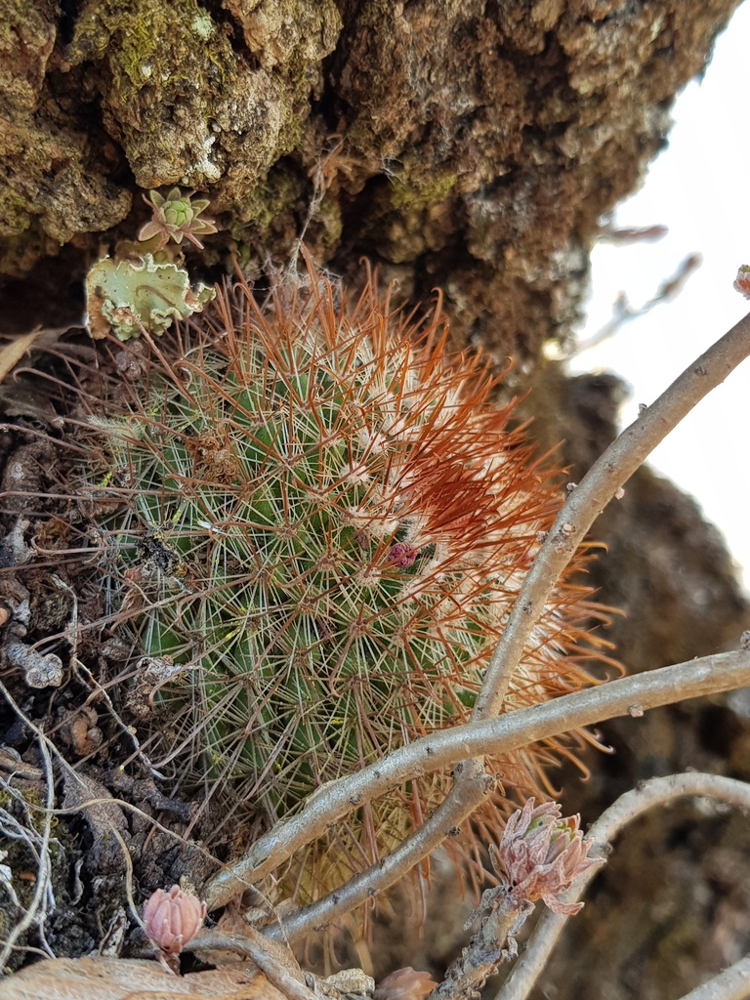
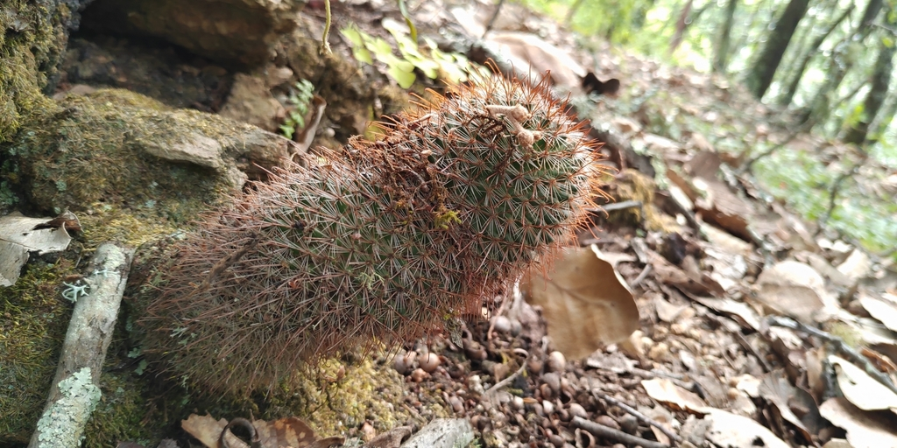
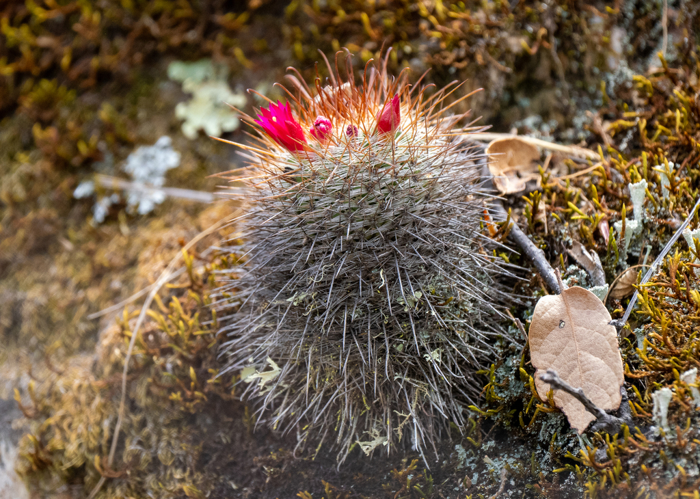
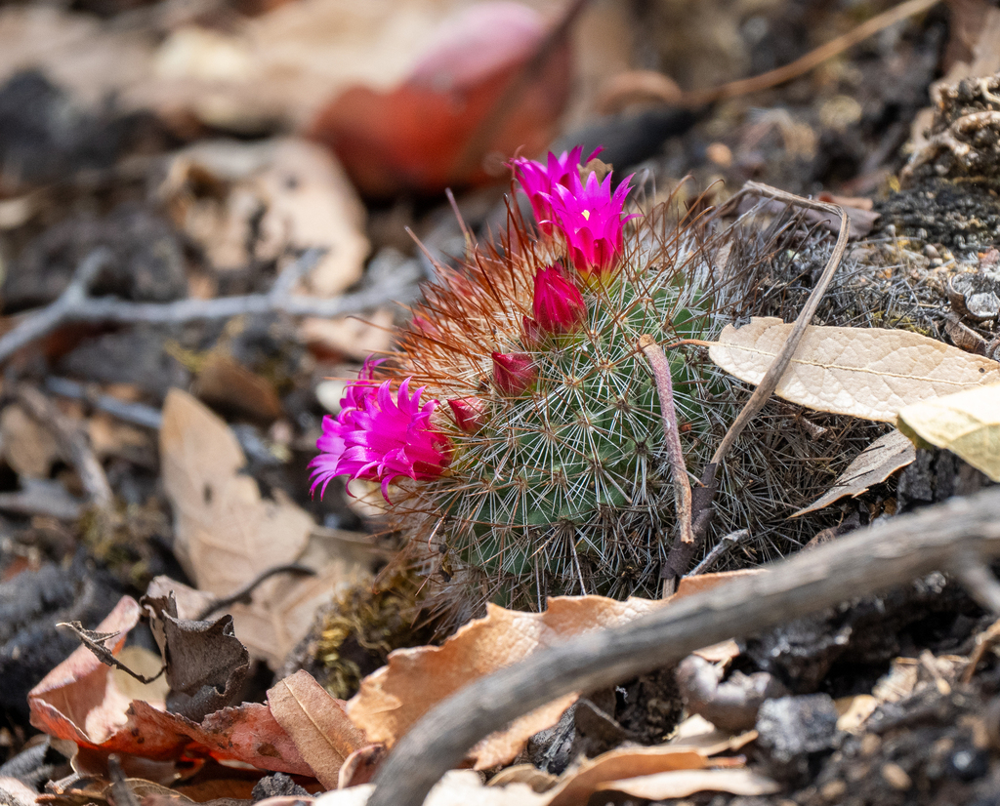
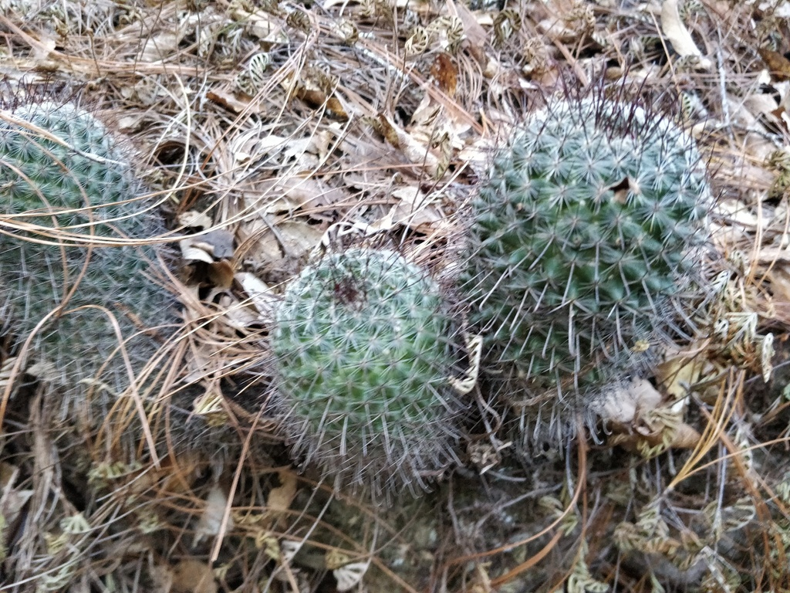
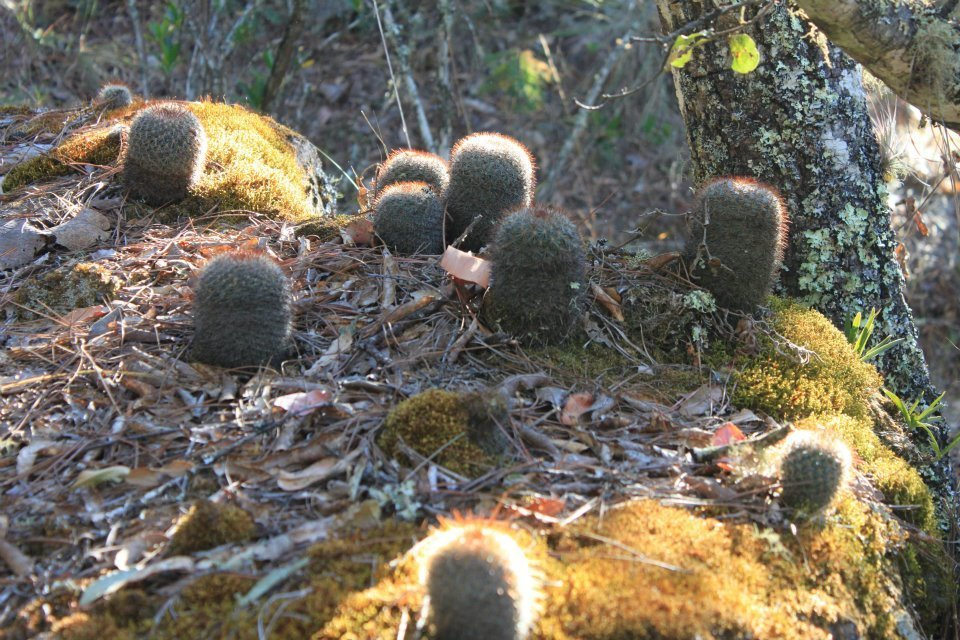
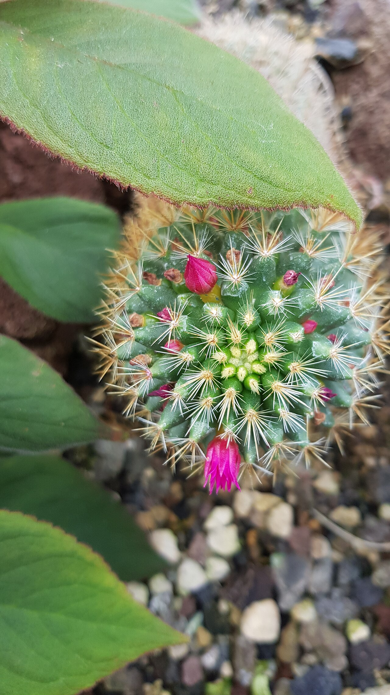
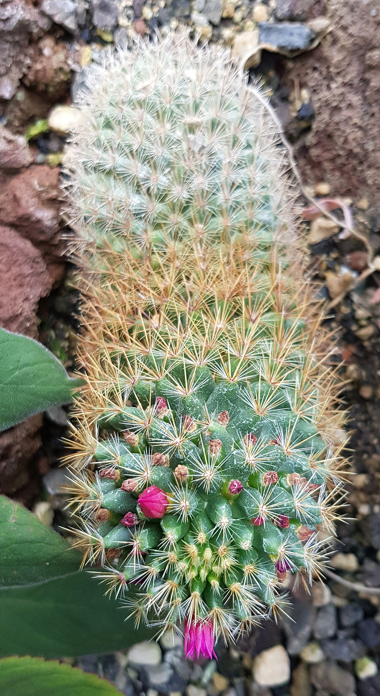
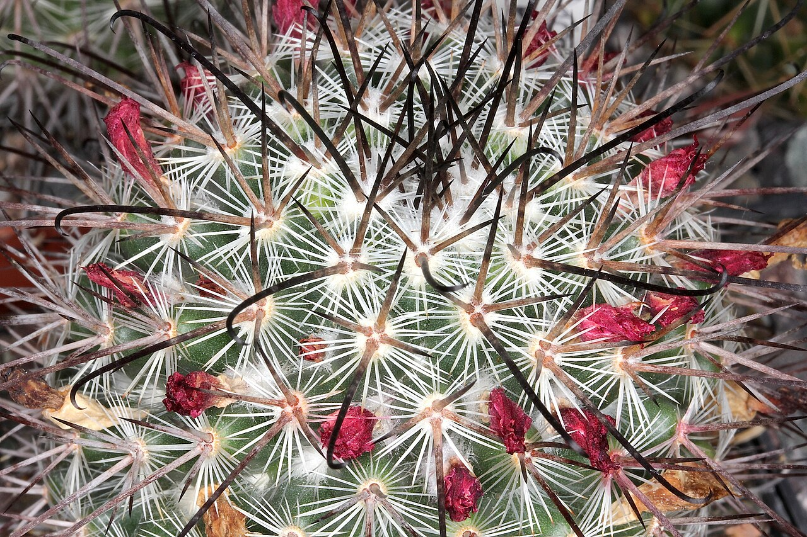

# Hook-spined pincushion cactus photo archive

_Mammillaria rekoi_ - Cactus-06

Collection label ID: `F1`.

Species-reference photographs; the collection ID remains probable, with the M. crinita complex or a horticultural hybrid as alternatives.

Collection research: [open the plant profile](../../../docs/plants/cacti/mammillaria-rekoi.md).

## Gallery

_habitat_ - [Mammillaria rekoi in habitat](https://www.inaturalist.org/observations/199853577); (c) P Gonzalez Zamora, some rights reserved (CC BY); [CC BY](https://creativecommons.org/licenses/by/4.0/).

_habitat_ - [Mammillaria rekoi in habitat](https://www.inaturalist.org/observations/24199420); (c) Eugenio Padilla, some rights reserved (CC BY-SA); [CC BY SA](https://creativecommons.org/licenses/by/4.0/).

_habitat_ - [Mammillaria rekoi in habitat](https://www.inaturalist.org/observations/35540988); (c) Destino Trail, some rights reserved (CC BY); [CC BY](https://creativecommons.org/licenses/by/4.0/).

_habitat_ - [Mammillaria rekoi in habitat](https://www.inaturalist.org/observations/364499078); (c) Forest Botial-Jarvis, some rights reserved (CC BY); [CC BY](https://creativecommons.org/licenses/by/4.0/).

_habitat_ - [Mammillaria rekoi in habitat](https://www.inaturalist.org/observations/364499082); (c) Forest Botial-Jarvis, some rights reserved (CC BY); [CC BY](https://creativecommons.org/licenses/by/4.0/).

_habitat_ - [Mammillaria rekoi in habitat](https://www.inaturalist.org/observations/37384891); (c) Will Cornwell, some rights reserved (CC BY); [CC BY](https://creativecommons.org/licenses/by/4.0/).

_habitat_ - [Mammillaria rekoi in habitat](https://www.inaturalist.org/observations/86069353); (c) Eugenio Padilla, some rights reserved (CC BY-SA); [CC BY SA](https://creativecommons.org/licenses/by/4.0/).

_habit_ - [MammillariaRekoi sspAureispina GrusonBotGd-Magdebg 20220722 1.jpg](https://commons.wikimedia.org/wiki/File:MammillariaRekoi_sspAureispina_GrusonBotGd-Magdebg_20220722_1.jpg); User:Zenwort; [CC BY-SA 4.0](https://creativecommons.org/licenses/by-sa/4.0).

_habit_ - [MammillariaRekoi sspAureispina GrusonBotGd-Magdebg 20220722 2.jpg](https://commons.wikimedia.org/wiki/File:MammillariaRekoi_sspAureispina_GrusonBotGd-Magdebg_20220722_2.jpg); User:Zenwort; [CC BY-SA 4.0](https://creativecommons.org/licenses/by-sa/4.0).

_habit_ - [Mammillaria rekoi ssp rekoi pm 1.JPG](https://commons.wikimedia.org/wiki/File:Mammillaria_rekoi_ssp_rekoi_pm_1.JPG); Peter A. Mansfeld; [CC BY 3.0](https://creativecommons.org/licenses/by/3.0).

## File details

| File                                                                                         | Subject | Source                                                                                                                         | Creator                                                | License                                                        |
| -------------------------------------------------------------------------------------------- | ------- | ------------------------------------------------------------------------------------------------------------------------------ | ------------------------------------------------------ | -------------------------------------------------------------- |
| [inaturalist-199853577-352503034-habitat.jpg](./inaturalist-199853577-352503034-habitat.jpg) | habitat | [iNaturalist](https://www.inaturalist.org/observations/199853577)                                                              | (c) P Gonzalez Zamora, some rights reserved (CC BY)    | [CC BY](https://creativecommons.org/licenses/by/4.0/)          |
| [inaturalist-24199420-37420786-habitat.jpg](./inaturalist-24199420-37420786-habitat.jpg)     | habitat | [iNaturalist](https://www.inaturalist.org/observations/24199420)                                                               | (c) Eugenio Padilla, some rights reserved (CC BY-SA)   | [CC BY SA](https://creativecommons.org/licenses/by/4.0/)       |
| [inaturalist-35540988-56052575-habitat.jpg](./inaturalist-35540988-56052575-habitat.jpg)     | habitat | [iNaturalist](https://www.inaturalist.org/observations/35540988)                                                               | (c) Destino Trail, some rights reserved (CC BY)        | [CC BY](https://creativecommons.org/licenses/by/4.0/)          |
| [inaturalist-364499078-665346491-habitat.jpg](./inaturalist-364499078-665346491-habitat.jpg) | habitat | [iNaturalist](https://www.inaturalist.org/observations/364499078)                                                              | (c) Forest Botial-Jarvis, some rights reserved (CC BY) | [CC BY](https://creativecommons.org/licenses/by/4.0/)          |
| [inaturalist-364499082-665346533-habitat.jpg](./inaturalist-364499082-665346533-habitat.jpg) | habitat | [iNaturalist](https://www.inaturalist.org/observations/364499082)                                                              | (c) Forest Botial-Jarvis, some rights reserved (CC BY) | [CC BY](https://creativecommons.org/licenses/by/4.0/)          |
| [inaturalist-37384891-59256737-habitat.jpg](./inaturalist-37384891-59256737-habitat.jpg)     | habitat | [iNaturalist](https://www.inaturalist.org/observations/37384891)                                                               | (c) Will Cornwell, some rights reserved (CC BY)        | [CC BY](https://creativecommons.org/licenses/by/4.0/)          |
| [inaturalist-86069353-141722849-habitat.jpg](./inaturalist-86069353-141722849-habitat.jpg)   | habitat | [iNaturalist](https://www.inaturalist.org/observations/86069353)                                                               | (c) Eugenio Padilla, some rights reserved (CC BY-SA)   | [CC BY SA](https://creativecommons.org/licenses/by/4.0/)       |
| [commons-121482802-habit.jpg](./commons-121482802-habit.jpg)                                 | habit   | [Wikimedia Commons](https://commons.wikimedia.org/wiki/File:MammillariaRekoi_sspAureispina_GrusonBotGd-Magdebg_20220722_1.jpg) | User:Zenwort                                           | [CC BY-SA 4.0](https://creativecommons.org/licenses/by-sa/4.0) |
| [commons-121482829-habit.jpg](./commons-121482829-habit.jpg)                                 | habit   | [Wikimedia Commons](https://commons.wikimedia.org/wiki/File:MammillariaRekoi_sspAureispina_GrusonBotGd-Magdebg_20220722_2.jpg) | User:Zenwort                                           | [CC BY-SA 4.0](https://creativecommons.org/licenses/by-sa/4.0) |
| [commons-19440517-habit.jpg](./commons-19440517-habit.jpg)                                   | habit   | [Wikimedia Commons](https://commons.wikimedia.org/wiki/File:Mammillaria_rekoi_ssp_rekoi_pm_1.JPG)                              | Peter A. Mansfeld                                      | [CC BY 3.0](https://creativecommons.org/licenses/by/3.0)       |

Metadata and SHA-256 hashes are also available in [the global manifest](../photo-manifest.json).
