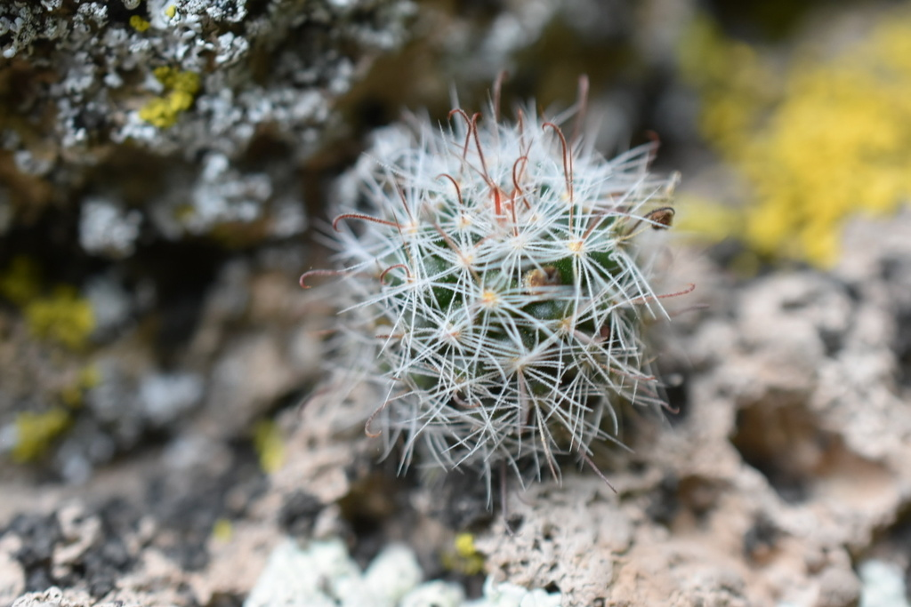
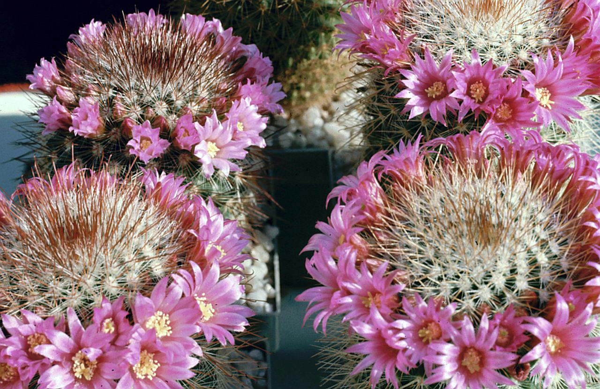
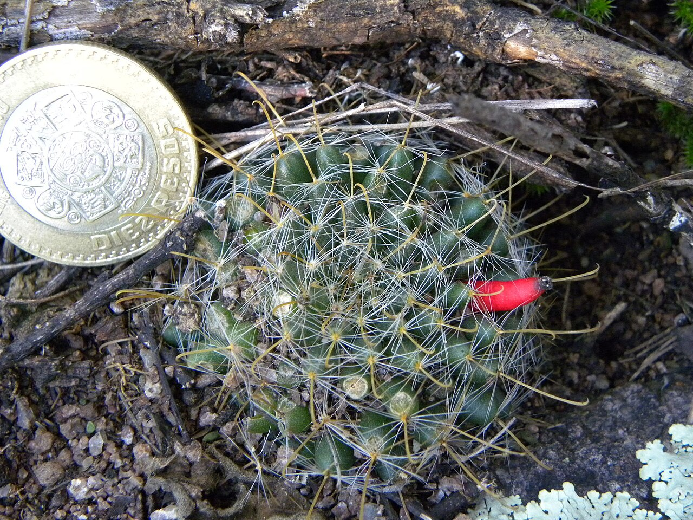
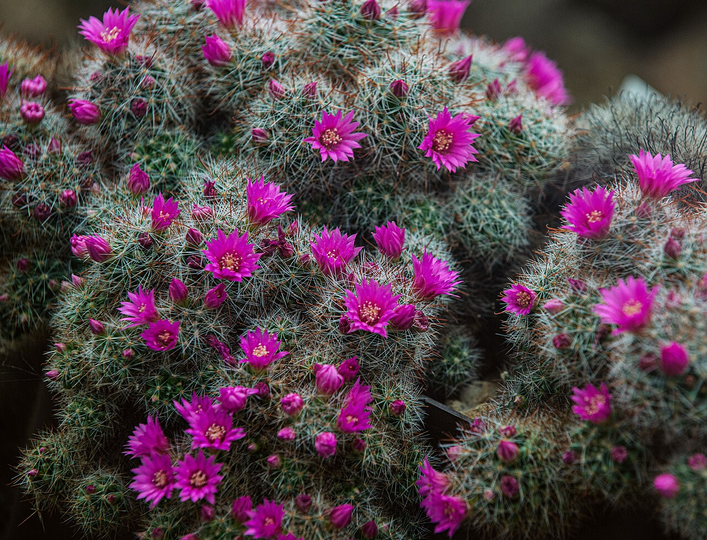
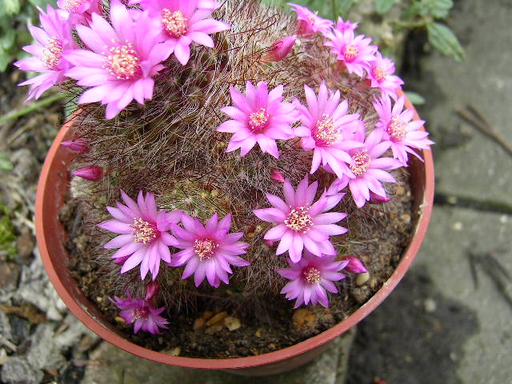
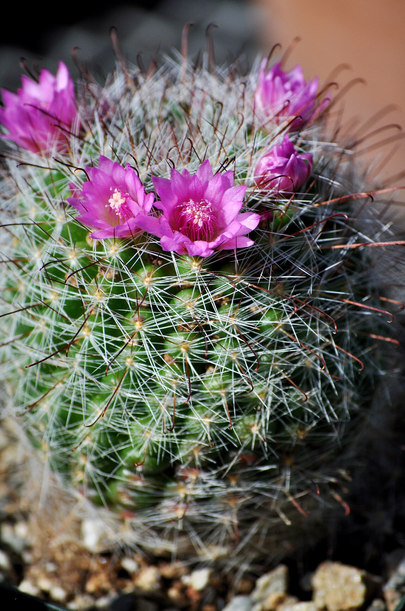
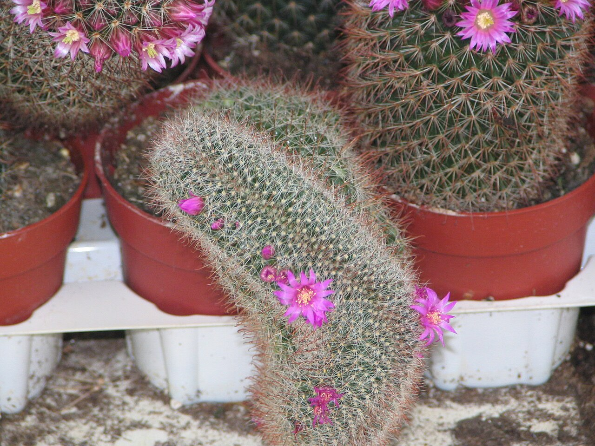
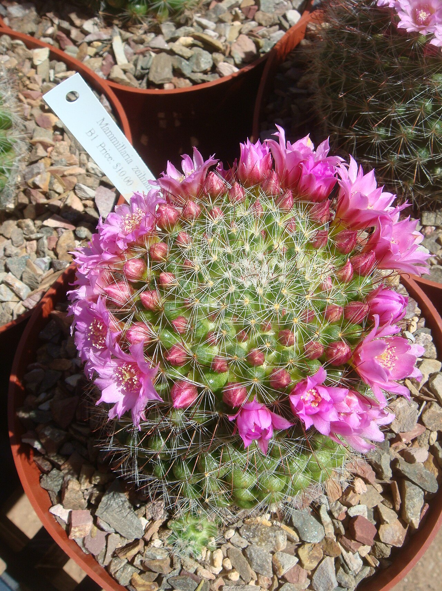

# Rose pincushion cactus photo archive

_Mammillaria zeilmanniana_ - Cactus-06

Collection label ID: `F1`.

Species-reference photographs.

Collection research: [open the plant profile](../../../docs/plants/cacti/mammillaria-zeilmanniana.md).

## Gallery

_habitat_ - [Mammillaria zeilmanniana in habitat](https://www.inaturalist.org/observations/136856487); (c) P Gonzalez Zamora, some rights reserved (CC BY); [CC BY](https://creativecommons.org/licenses/by/4.0/).

_habit_ - [Mammillaria zeilmanniana 02.jpg](https://commons.wikimedia.org/wiki/File:Mammillaria_zeilmanniana_02.jpg); Peter A. Mansfeld; [CC BY-SA 3.0](https://creativecommons.org/licenses/by-sa/3.0).

_fruit-seed_ - [Mammillaria crinita fruit.jpg](https://commons.wikimedia.org/wiki/File:Mammillaria_crinita_fruit.jpg); María Eugenia Mendiola González; [CC BY-SA 4.0](https://creativecommons.org/licenses/by-sa/4.0).

_habit_ - [Mammillaria zeilmanniana Boed.jpg](https://commons.wikimedia.org/wiki/File:Mammillaria_zeilmanniana_Boed.jpg); Freddo213; [CC BY 4.0](https://creativecommons.org/licenses/by/4.0).

_flower_ - [Mammillaria.JPG](https://commons.wikimedia.org/wiki/File:Mammillaria.JPG); Chilepine ( talk ); [Public domain](https://creativecommons.org/publicdomain/zero/1.0/).

_flower_ - [Mammillaria zeilmanniana (1).jpg](<https://commons.wikimedia.org/wiki/File:Mammillaria_zeilmanniana_(1).jpg>); The Greenery Nursery and Garden Shop from Turlock, Ca; [CC BY 2.0](https://creativecommons.org/licenses/by/2.0).

_habit_ - [Cristaat3.JPG](https://commons.wikimedia.org/wiki/File:Cristaat3.JPG); Original uploader was GerardM at nl.wikipedia; [CC BY-SA 3.0](https://creativecommons.org/licenses/by-sa/3.0/).

_flower_ - [Mammillaria-zeilmanniana-20080330.JPG](https://commons.wikimedia.org/wiki/File:Mammillaria-zeilmanniana-20080330.JPG); Miwasatoshi; [CC BY-SA 4.0](https://creativecommons.org/licenses/by-sa/4.0).

## File details

| File                                                                                         | Subject    | Source                                                                                             | Creator                                               | License                                                             |
| -------------------------------------------------------------------------------------------- | ---------- | -------------------------------------------------------------------------------------------------- | ----------------------------------------------------- | ------------------------------------------------------------------- |
| [inaturalist-136856487-233635230-habitat.jpg](./inaturalist-136856487-233635230-habitat.jpg) | habitat    | [iNaturalist](https://www.inaturalist.org/observations/136856487)                                  | (c) P Gonzalez Zamora, some rights reserved (CC BY)   | [CC BY](https://creativecommons.org/licenses/by/4.0/)               |
| [commons-11711242-habit.jpg](./commons-11711242-habit.jpg)                                   | habit      | [Wikimedia Commons](https://commons.wikimedia.org/wiki/File:Mammillaria_zeilmanniana_02.jpg)       | Peter A. Mansfeld                                     | [CC BY-SA 3.0](https://creativecommons.org/licenses/by-sa/3.0)      |
| [commons-158465498-fruit-seed.jpg](./commons-158465498-fruit-seed.jpg)                       | fruit-seed | [Wikimedia Commons](https://commons.wikimedia.org/wiki/File:Mammillaria_crinita_fruit.jpg)         | María Eugenia Mendiola González                       | [CC BY-SA 4.0](https://creativecommons.org/licenses/by-sa/4.0)      |
| [commons-170355104-habit.jpg](./commons-170355104-habit.jpg)                                 | habit      | [Wikimedia Commons](https://commons.wikimedia.org/wiki/File:Mammillaria_zeilmanniana_Boed.jpg)     | Freddo213                                             | [CC BY 4.0](https://creativecommons.org/licenses/by/4.0)            |
| [commons-18004316-flower.jpg](./commons-18004316-flower.jpg)                                 | flower     | [Wikimedia Commons](https://commons.wikimedia.org/wiki/File:Mammillaria.JPG)                       | Chilepine ( talk )                                    | [Public domain](https://creativecommons.org/publicdomain/zero/1.0/) |
| [commons-23795882-flower.jpg](./commons-23795882-flower.jpg)                                 | flower     | [Wikimedia Commons](<https://commons.wikimedia.org/wiki/File:Mammillaria_zeilmanniana_(1).jpg>)    | The Greenery Nursery and Garden Shop from Turlock, Ca | [CC BY 2.0](https://creativecommons.org/licenses/by/2.0)            |
| [commons-3253848-habit.jpg](./commons-3253848-habit.jpg)                                     | habit      | [Wikimedia Commons](https://commons.wikimedia.org/wiki/File:Cristaat3.JPG)                         | Original uploader was GerardM at nl.wikipedia         | [CC BY-SA 3.0](https://creativecommons.org/licenses/by-sa/3.0/)     |
| [commons-3817470-habitat.jpg](./commons-3817470-habitat.jpg)                                 | flower     | [Wikimedia Commons](https://commons.wikimedia.org/wiki/File:Mammillaria-zeilmanniana-20080330.JPG) | Miwasatoshi                                           | [CC BY-SA 4.0](https://creativecommons.org/licenses/by-sa/4.0)      |

Metadata and SHA-256 hashes are also available in [the global manifest](../photo-manifest.json).
