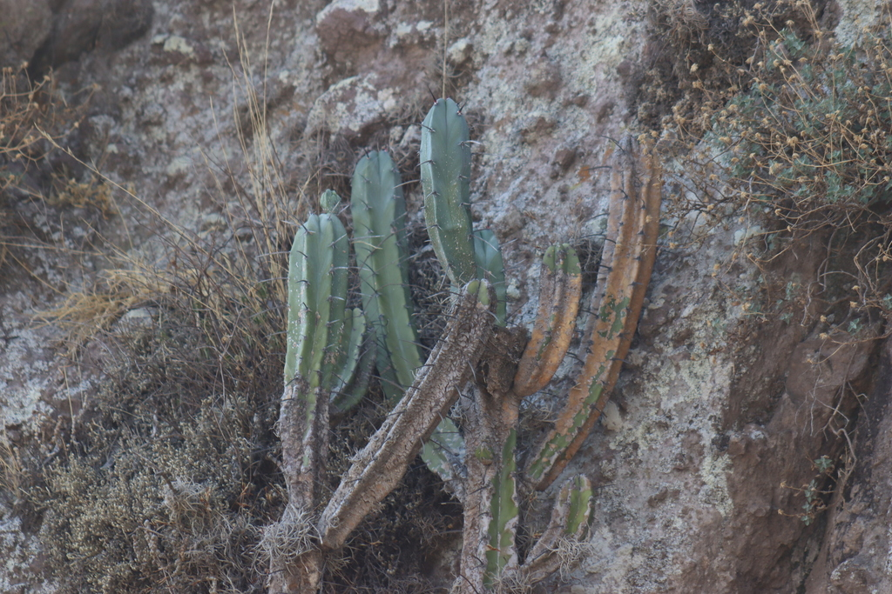
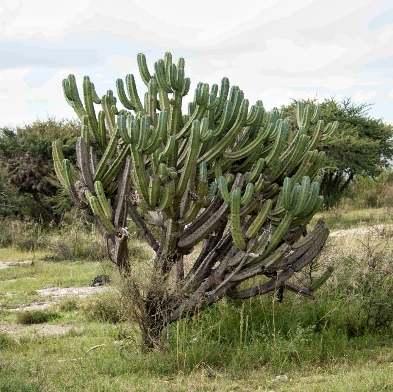
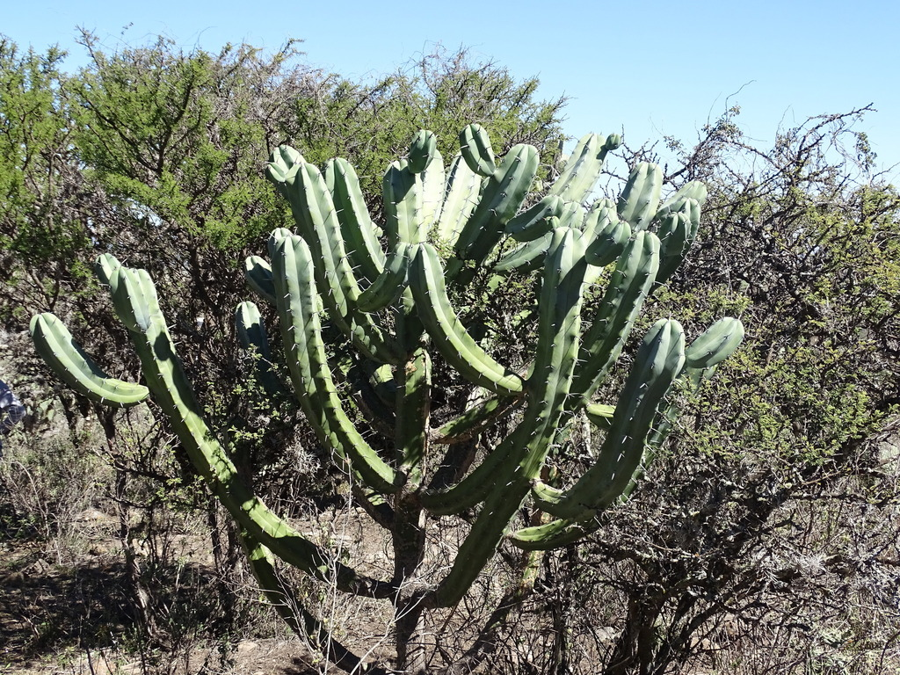
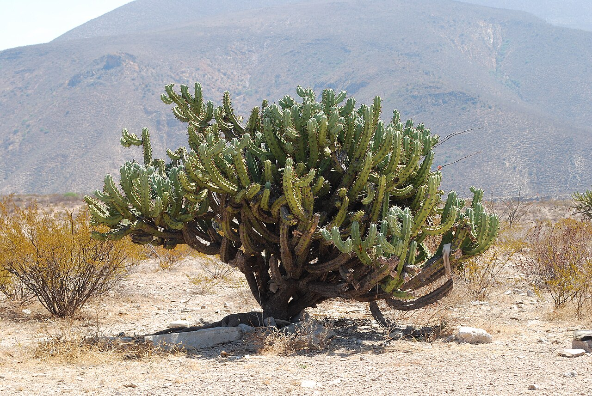
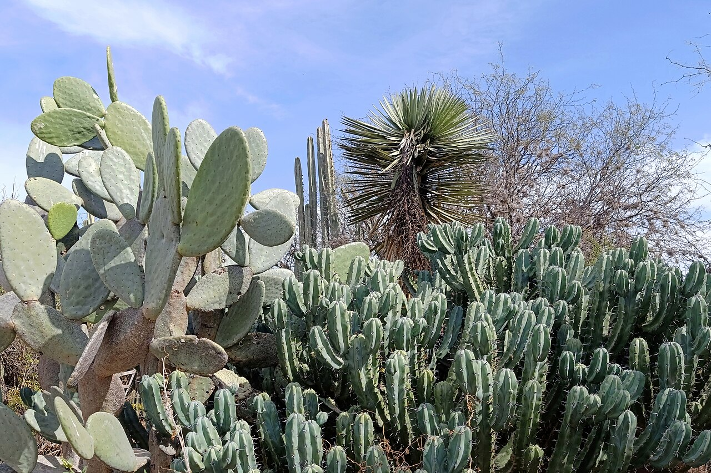
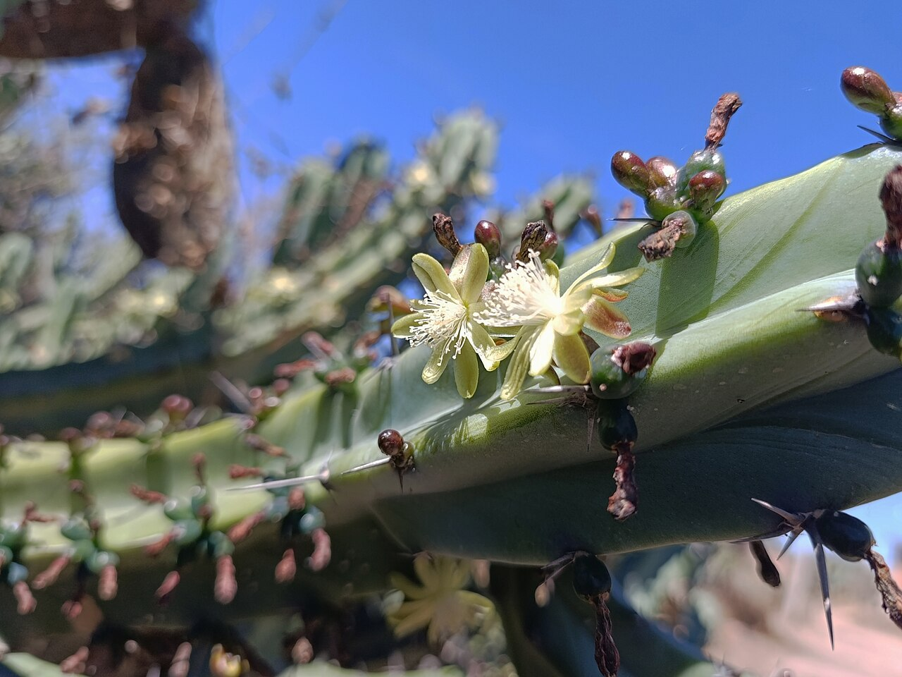
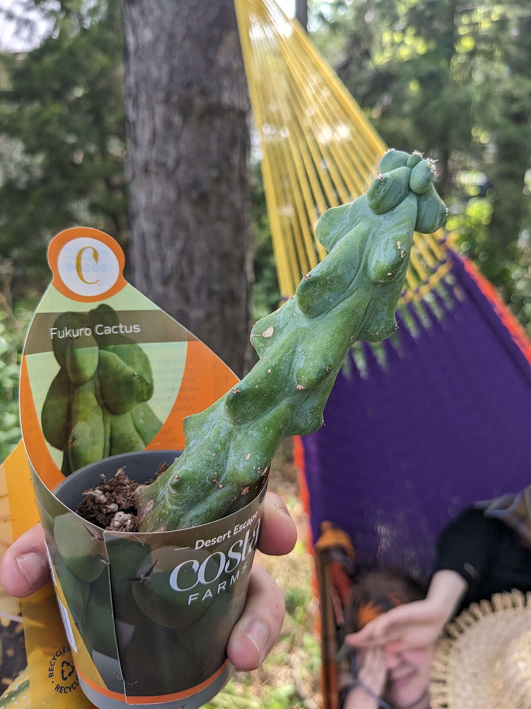
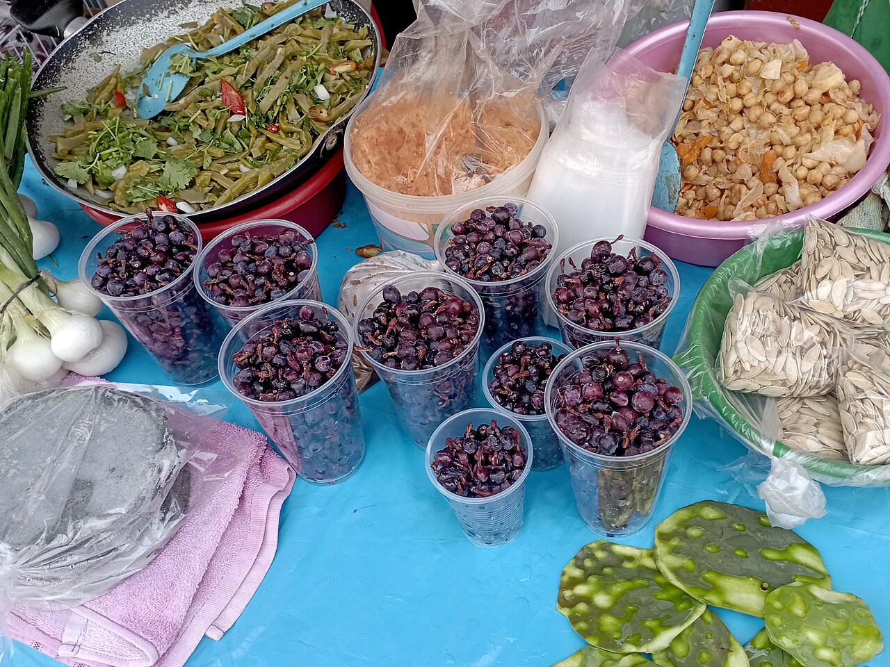

# Boobie cactus photo archive

_Myrtillocactus geometrizans Fukurokuryuzinboku_ - Cactus-05

Collection label ID: `F2`.

Species-reference photographs may show the normal species; the collection plant is the monstrose cultivar Fukurokuryuzinboku.

Collection research: [open the plant profile](../../../docs/plants/cacti/myrtillocactus-geometrizans-fukurokuryuzinboku.md).

## Gallery

_habitat_ - [Myrtillocactus geometrizans Fukurokuryuzinboku in habitat](https://www.inaturalist.org/observations/118071910); (c) Comisión Estatal de Biodiversidad del Estado de Hidalgo, some rights reserved (CC BY-SA); [CC BY SA](https://creativecommons.org/licenses/by/4.0/).

_habitat_ - [Myrtillocactus geometrizans Fukurokuryuzinboku in habitat](https://www.inaturalist.org/observations/18661428); (c) José Francisco Colorado-Dapa, some rights reserved (CC BY-SA); [CC BY SA](https://creativecommons.org/licenses/by/4.0/).

_habitat_ - [Myrtillocactus geometrizans Fukurokuryuzinboku in habitat](https://www.inaturalist.org/observations/197873224); (c) Alexis López Hernández, some rights reserved (CC BY); [CC BY](https://creativecommons.org/licenses/by/4.0/).

_habit_ - [UnidentifiedCactusSierraGorda.JPG](https://commons.wikimedia.org/wiki/File:UnidentifiedCactusSierraGorda.JPG); AlejandroLinaresGarcia; [CC BY-SA 4.0](https://creativecommons.org/licenses/by-sa/4.0).

_flower_ - [Flora del norte de Guanajuato I.jpg](https://commons.wikimedia.org/wiki/File:Flora_del_norte_de_Guanajuato_I.jpg); Juan Carlos Fonseca Mata; [CC BY-SA 4.0](https://creativecommons.org/licenses/by-sa/4.0).

_flower_ - [Myrtillocactus geometrizans, flores.jpg](https://commons.wikimedia.org/wiki/File:Myrtillocactus_geometrizans,_flores.jpg); Juan Carlos Fonseca Mata; [CC BY-SA 4.0](https://creativecommons.org/licenses/by-sa/4.0).

_habit_ - [Myrtillocactus geometrizans variety Fukurokuryuzinboku.jpg](https://commons.wikimedia.org/wiki/File:Myrtillocactus_geometrizans_variety_Fukurokuryuzinboku.jpg); Kim; [CC BY 4.0](https://creativecommons.org/licenses/by/4.0).

_fruit-seed_ - [Mercado (Dolores Hidalgo, Guanajuato) I.jpg](<https://commons.wikimedia.org/wiki/File:Mercado_(Dolores_Hidalgo,_Guanajuato)_I.jpg>); Juan Carlos Fonseca Mata; [CC BY-SA 4.0](https://creativecommons.org/licenses/by-sa/4.0).

## File details

| File                                                                                         | Subject    | Source                                                                                                                  | Creator                                                                                      | License                                                        |
| -------------------------------------------------------------------------------------------- | ---------- | ----------------------------------------------------------------------------------------------------------------------- | -------------------------------------------------------------------------------------------- | -------------------------------------------------------------- |
| [inaturalist-118071910-199449429-habitat.jpg](./inaturalist-118071910-199449429-habitat.jpg) | habitat    | [iNaturalist](https://www.inaturalist.org/observations/118071910)                                                       | (c) Comisión Estatal de Biodiversidad del Estado de Hidalgo, some rights reserved (CC BY-SA) | [CC BY SA](https://creativecommons.org/licenses/by/4.0/)       |
| [inaturalist-18661428-28567131-habitat.jpg](./inaturalist-18661428-28567131-habitat.jpg)     | habitat    | [iNaturalist](https://www.inaturalist.org/observations/18661428)                                                        | (c) José Francisco Colorado-Dapa, some rights reserved (CC BY-SA)                            | [CC BY SA](https://creativecommons.org/licenses/by/4.0/)       |
| [inaturalist-197873224-348620157-habitat.jpg](./inaturalist-197873224-348620157-habitat.jpg) | habitat    | [iNaturalist](https://www.inaturalist.org/observations/197873224)                                                       | (c) Alexis López Hernández, some rights reserved (CC BY)                                     | [CC BY](https://creativecommons.org/licenses/by/4.0/)          |
| [commons-14682751-habit.jpg](./commons-14682751-habit.jpg)                                   | habit      | [Wikimedia Commons](https://commons.wikimedia.org/wiki/File:UnidentifiedCactusSierraGorda.JPG)                          | AlejandroLinaresGarcia                                                                       | [CC BY-SA 4.0](https://creativecommons.org/licenses/by-sa/4.0) |
| [commons-158669453-flower.jpg](./commons-158669453-flower.jpg)                               | flower     | [Wikimedia Commons](https://commons.wikimedia.org/wiki/File:Flora_del_norte_de_Guanajuato_I.jpg)                        | Juan Carlos Fonseca Mata                                                                     | [CC BY-SA 4.0](https://creativecommons.org/licenses/by-sa/4.0) |
| [commons-160886345-flower.jpg](./commons-160886345-flower.jpg)                               | flower     | [Wikimedia Commons](https://commons.wikimedia.org/wiki/File:Myrtillocactus_geometrizans,_flores.jpg)                    | Juan Carlos Fonseca Mata                                                                     | [CC BY-SA 4.0](https://creativecommons.org/licenses/by-sa/4.0) |
| [commons-165805033-habit.jpg](./commons-165805033-habit.jpg)                                 | habit      | [Wikimedia Commons](https://commons.wikimedia.org/wiki/File:Myrtillocactus_geometrizans_variety_Fukurokuryuzinboku.jpg) | Kim                                                                                          | [CC BY 4.0](https://creativecommons.org/licenses/by/4.0)       |
| [commons-166253630-habit.jpg](./commons-166253630-habit.jpg)                                 | fruit-seed | [Wikimedia Commons](<https://commons.wikimedia.org/wiki/File:Mercado_(Dolores_Hidalgo,_Guanajuato)_I.jpg>)              | Juan Carlos Fonseca Mata                                                                     | [CC BY-SA 4.0](https://creativecommons.org/licenses/by-sa/4.0) |

Metadata and SHA-256 hashes are also available in [the global manifest](../photo-manifest.json).
