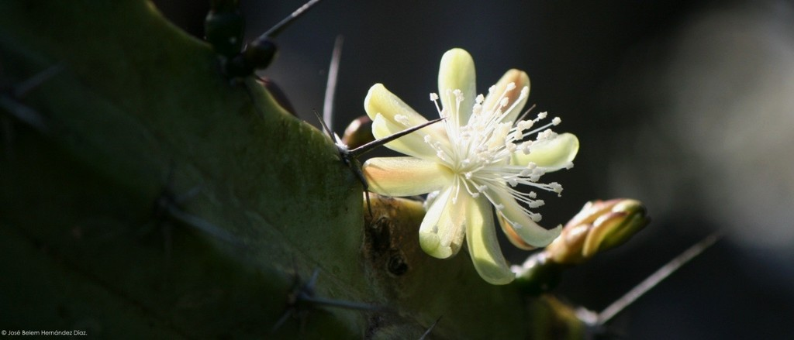
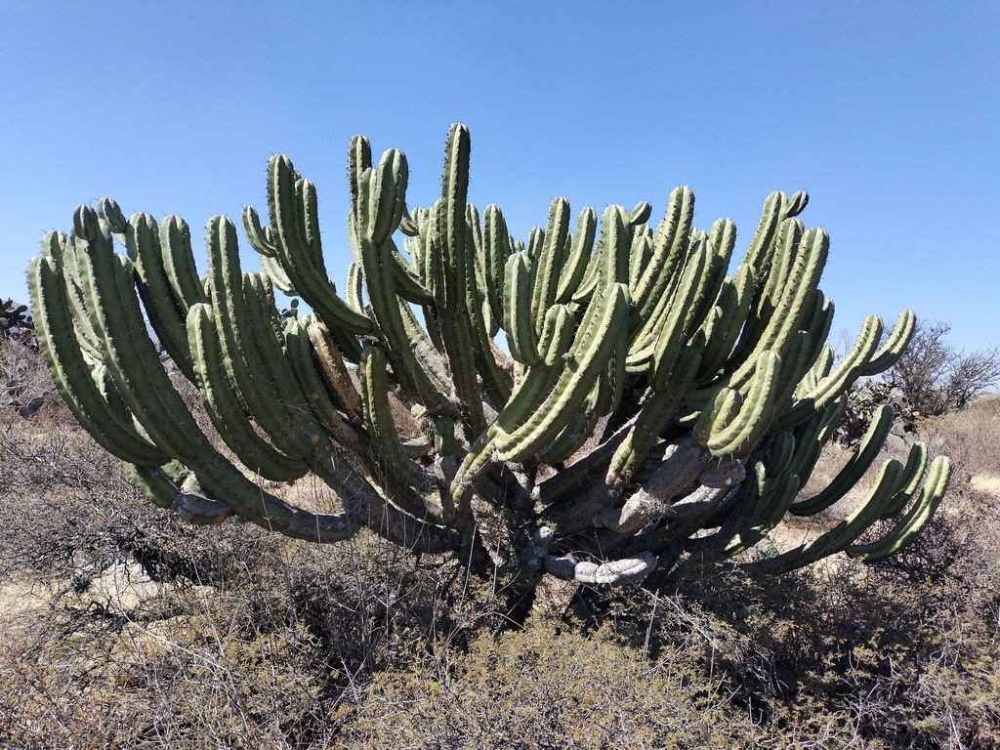
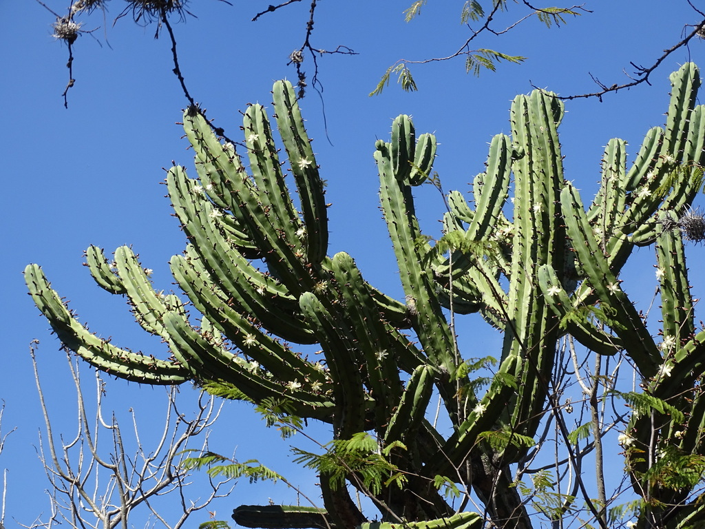
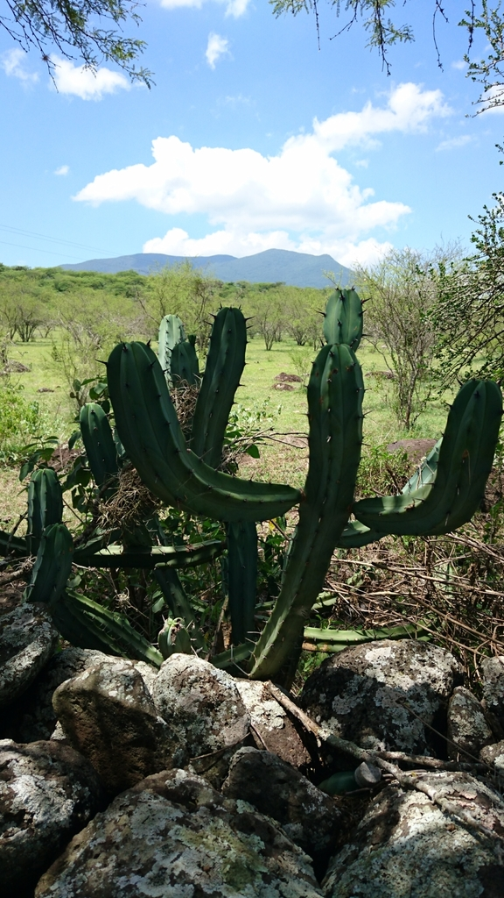
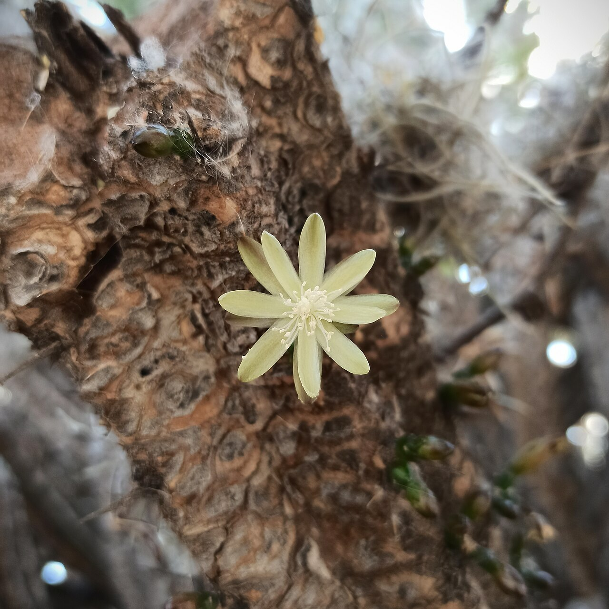
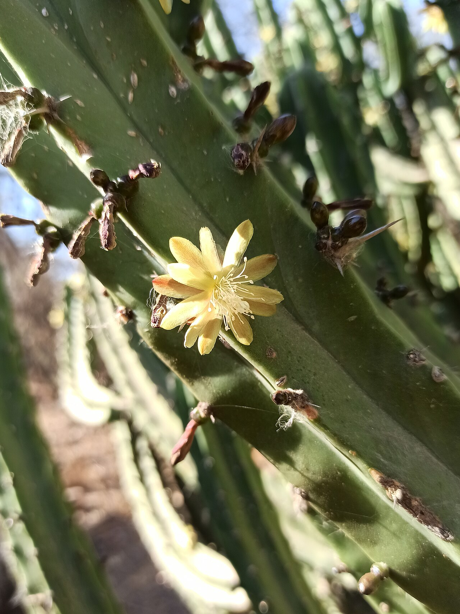
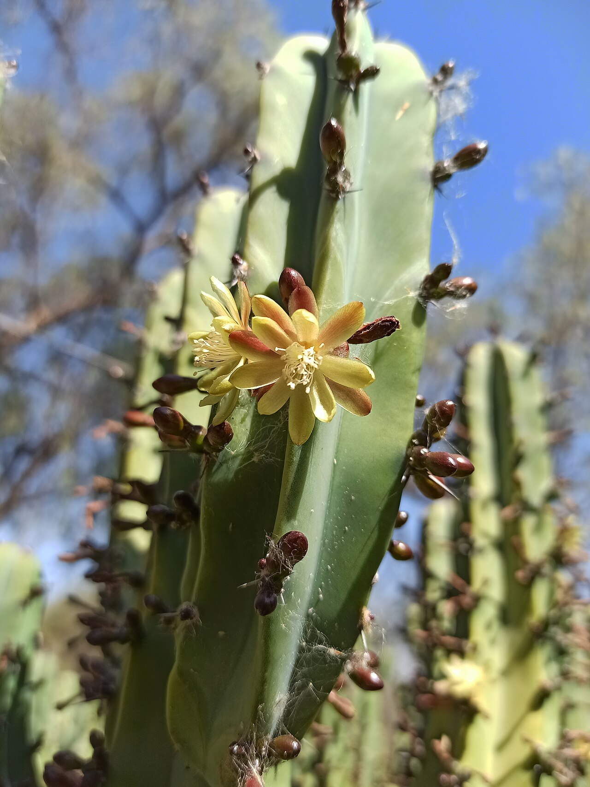
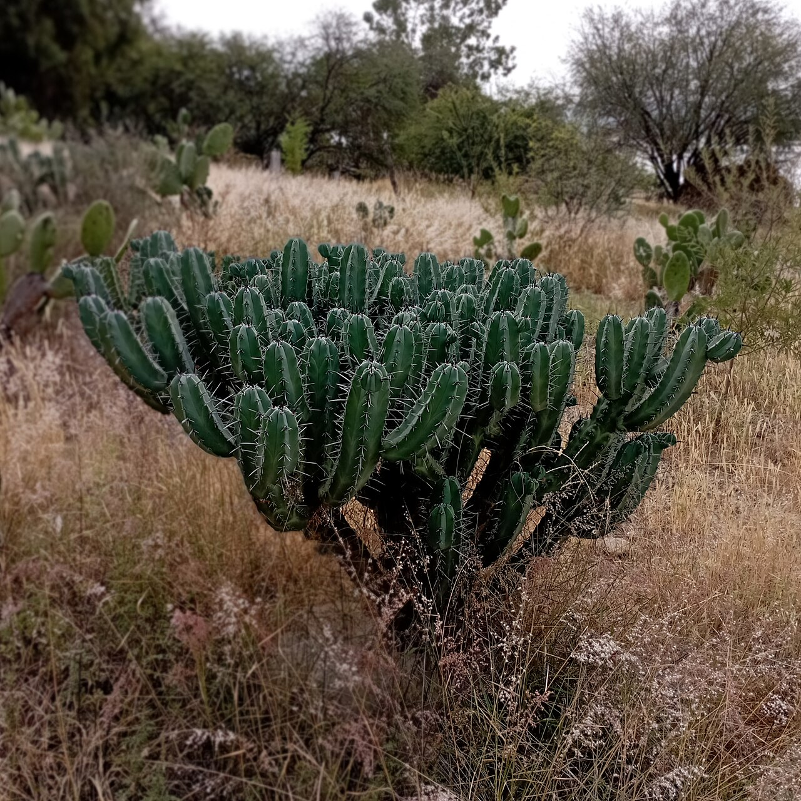
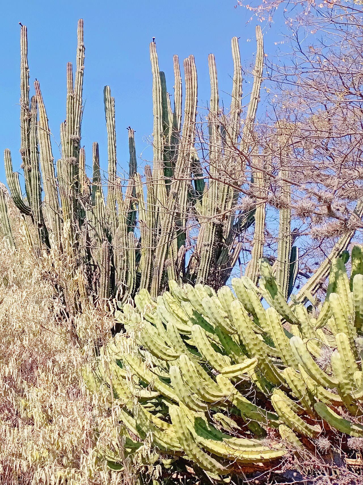
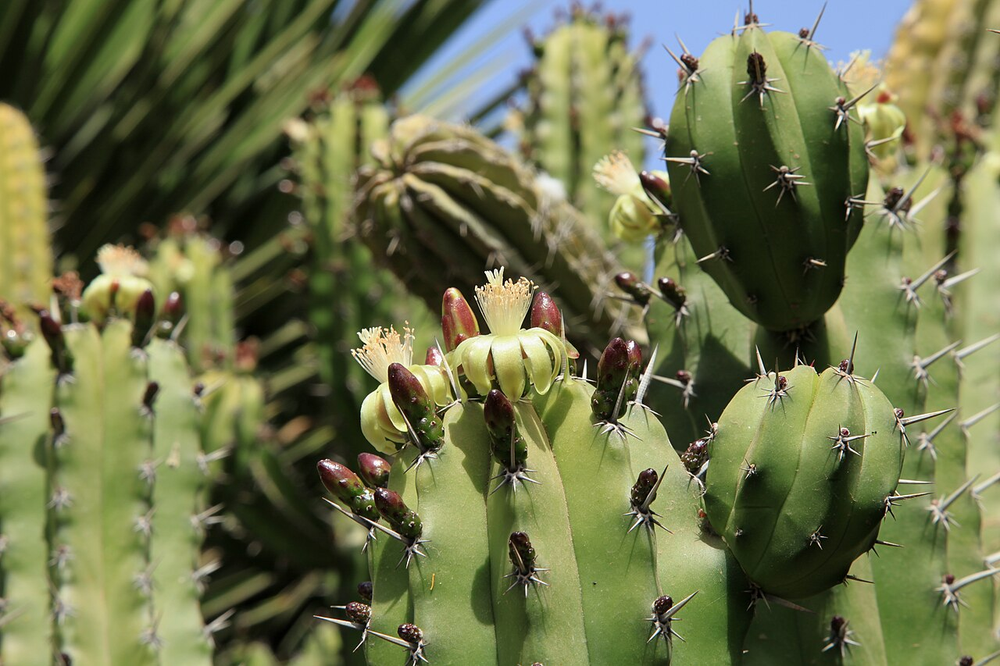

# Indigo Wave photo archive

_Myrtillocactus geometrizans_ - Starter-09

Collection label ID: `B3`.

Most photographs show the normal species; the collection plant is the monstrose trade selection sold as Indigo Wave.

Collection research: [open the plant profile](../../../docs/plants/starter/myrtillocactus-geometrizans-indigo-wave.md).

## Gallery

_habitat_ - [Myrtillocactus geometrizans in habitat](https://www.inaturalist.org/observations/1396263); (c) José Belem Hernández Díaz, some rights reserved (CC BY); [CC BY](https://creativecommons.org/licenses/by/4.0/).

_habitat_ - [Myrtillocactus geometrizans in habitat](https://www.inaturalist.org/observations/148466618); (c) Tereso Hernández Morales, some rights reserved (CC BY); [CC BY](https://creativecommons.org/licenses/by/4.0/).

_habitat_ - [Myrtillocactus geometrizans in habitat](https://www.inaturalist.org/observations/197771008); (c) Alexis López Hernández, some rights reserved (CC BY); [CC BY](https://creativecommons.org/licenses/by/4.0/).

_habitat_ - [Myrtillocactus geometrizans in habitat](https://www.inaturalist.org/observations/7606091); (c) Sandino Guerrero, some rights reserved (CC BY); [CC BY](https://creativecommons.org/licenses/by/4.0/).

_flower_ - [Flor de Myrtillocactus geometrizans.jpg](https://commons.wikimedia.org/wiki/File:Flor_de_Myrtillocactus_geometrizans.jpg); Juan Carlos Fonseca Mata; [CC BY-SA 4.0](https://creativecommons.org/licenses/by-sa/4.0).

_flower_ - [Flor del garambullo (Myrtillocactus geometrizans).jpg](<https://commons.wikimedia.org/wiki/File:Flor_del_garambullo_(Myrtillocactus_geometrizans).jpg>); Juan Carlos Fonseca Mata; [CC BY-SA 4.0](https://creativecommons.org/licenses/by-sa/4.0).

_flower_ - [Garambullo (Myrtillocactus geometrizans) - Flor.jpg](<https://commons.wikimedia.org/wiki/File:Garambullo_(Myrtillocactus_geometrizans)_-_Flor.jpg>); Juan Carlos Fonseca Mata; [CC BY-SA 4.0](https://creativecommons.org/licenses/by-sa/4.0).

_fruit-seed_ - [Bilberry cactus (Myrtillocactus geometrizans), november.jpg](<https://commons.wikimedia.org/wiki/File:Bilberry_cactus_(Myrtillocactus_geometrizans),_november.jpg>); Juan Carlos Fonseca Mata; [CC BY-SA 4.0](https://creativecommons.org/licenses/by-sa/4.0).

_habit_ - [Stenocereus queretaroensis (cardón pitayo) y Myrtillocactus geometrizans (garambullo).jpg](<https://commons.wikimedia.org/wiki/File:Stenocereus_queretaroensis_(card%C3%B3n_pitayo)_y_Myrtillocactus_geometrizans_(garambullo).jpg>); Juan Carlos Fonseca Mata; [CC BY-SA 4.0](https://creativecommons.org/licenses/by-sa/4.0).

_habitat_ - [Pájara La Lajita - Oasis Park - Myrtillocactus geometrizans 02 ies.jpg](https://commons.wikimedia.org/wiki/File:P%C3%A1jara_La_Lajita_-_Oasis_Park_-_Myrtillocactus_geometrizans_02_ies.jpg); Frank Vincentz; [CC BY-SA 3.0](https://creativecommons.org/licenses/by-sa/3.0).

## File details

| File                                                                                         | Subject    | Source                                                                                                                                                        | Creator                                                     | License                                                        |
| -------------------------------------------------------------------------------------------- | ---------- | ------------------------------------------------------------------------------------------------------------------------------------------------------------- | ----------------------------------------------------------- | -------------------------------------------------------------- |
| [inaturalist-1396263-1726319-habitat.jpg](./inaturalist-1396263-1726319-habitat.jpg)         | habitat    | [iNaturalist](https://www.inaturalist.org/observations/1396263)                                                                                               | (c) José Belem Hernández Díaz, some rights reserved (CC BY) | [CC BY](https://creativecommons.org/licenses/by/4.0/)          |
| [inaturalist-148466618-255676017-habitat.jpg](./inaturalist-148466618-255676017-habitat.jpg) | habitat    | [iNaturalist](https://www.inaturalist.org/observations/148466618)                                                                                             | (c) Tereso Hernández Morales, some rights reserved (CC BY)  | [CC BY](https://creativecommons.org/licenses/by/4.0/)          |
| [inaturalist-197771008-348409477-habitat.jpg](./inaturalist-197771008-348409477-habitat.jpg) | habitat    | [iNaturalist](https://www.inaturalist.org/observations/197771008)                                                                                             | (c) Alexis López Hernández, some rights reserved (CC BY)    | [CC BY](https://creativecommons.org/licenses/by/4.0/)          |
| [inaturalist-7606091-9939692-habitat.jpg](./inaturalist-7606091-9939692-habitat.jpg)         | habitat    | [iNaturalist](https://www.inaturalist.org/observations/7606091)                                                                                               | (c) Sandino Guerrero, some rights reserved (CC BY)          | [CC BY](https://creativecommons.org/licenses/by/4.0/)          |
| [commons-100486722-flower.jpg](./commons-100486722-flower.jpg)                               | flower     | [Wikimedia Commons](https://commons.wikimedia.org/wiki/File:Flor_de_Myrtillocactus_geometrizans.jpg)                                                          | Juan Carlos Fonseca Mata                                    | [CC BY-SA 4.0](https://creativecommons.org/licenses/by-sa/4.0) |
| [commons-100486725-flower.jpg](./commons-100486725-flower.jpg)                               | flower     | [Wikimedia Commons](<https://commons.wikimedia.org/wiki/File:Flor_del_garambullo_(Myrtillocactus_geometrizans).jpg>)                                          | Juan Carlos Fonseca Mata                                    | [CC BY-SA 4.0](https://creativecommons.org/licenses/by-sa/4.0) |
| [commons-100486736-flower.jpg](./commons-100486736-flower.jpg)                               | flower     | [Wikimedia Commons](<https://commons.wikimedia.org/wiki/File:Garambullo_(Myrtillocactus_geometrizans)_-_Flor.jpg>)                                            | Juan Carlos Fonseca Mata                                    | [CC BY-SA 4.0](https://creativecommons.org/licenses/by-sa/4.0) |
| [commons-126024250-fruit-seed.jpg](./commons-126024250-fruit-seed.jpg)                       | fruit-seed | [Wikimedia Commons](<https://commons.wikimedia.org/wiki/File:Bilberry_cactus_(Myrtillocactus_geometrizans),_november.jpg>)                                    | Juan Carlos Fonseca Mata                                    | [CC BY-SA 4.0](https://creativecommons.org/licenses/by-sa/4.0) |
| [commons-127144861-habit.jpg](./commons-127144861-habit.jpg)                                 | habit      | [Wikimedia Commons](<https://commons.wikimedia.org/wiki/File:Stenocereus_queretaroensis_(card%C3%B3n_pitayo)_y_Myrtillocactus_geometrizans_(garambullo).jpg>) | Juan Carlos Fonseca Mata                                    | [CC BY-SA 4.0](https://creativecommons.org/licenses/by-sa/4.0) |
| [commons-23286506-habitat.jpg](./commons-23286506-habitat.jpg)                               | habitat    | [Wikimedia Commons](https://commons.wikimedia.org/wiki/File:P%C3%A1jara_La_Lajita_-_Oasis_Park_-_Myrtillocactus_geometrizans_02_ies.jpg)                      | Frank Vincentz                                              | [CC BY-SA 3.0](https://creativecommons.org/licenses/by-sa/3.0) |

Metadata and SHA-256 hashes are also available in [the global manifest](../photo-manifest.json).
