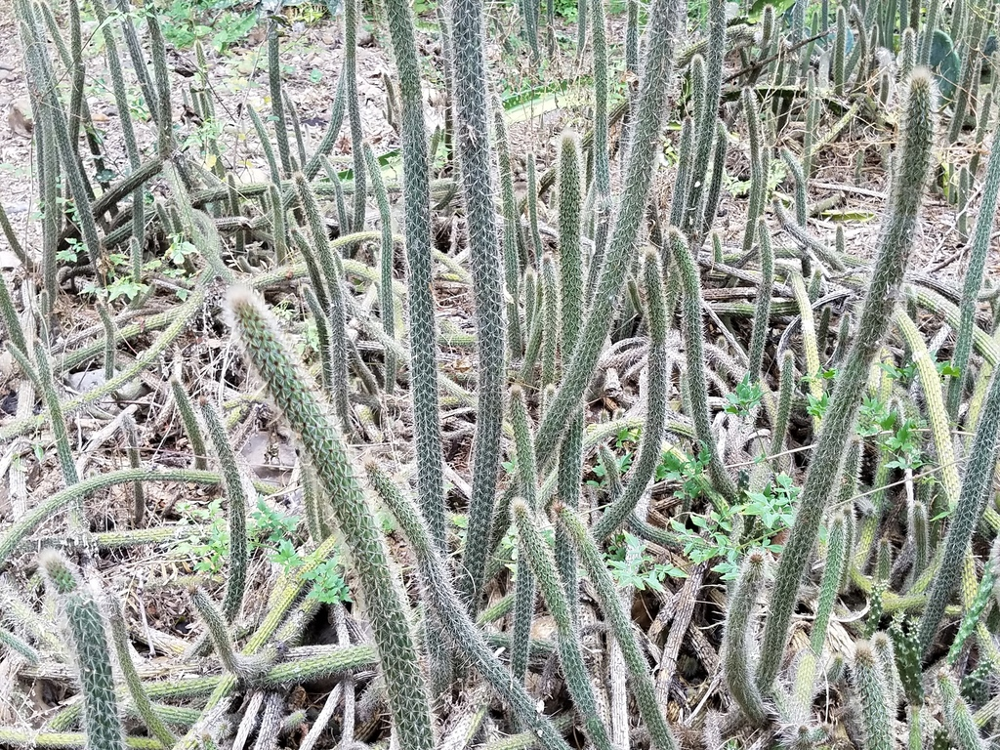
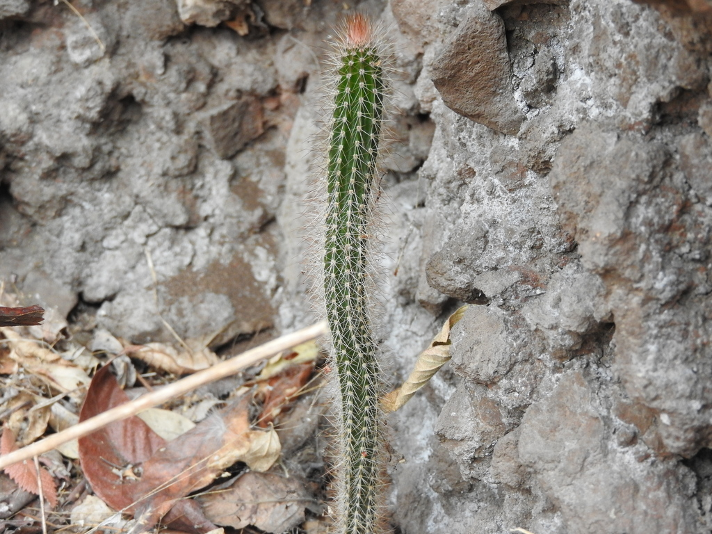
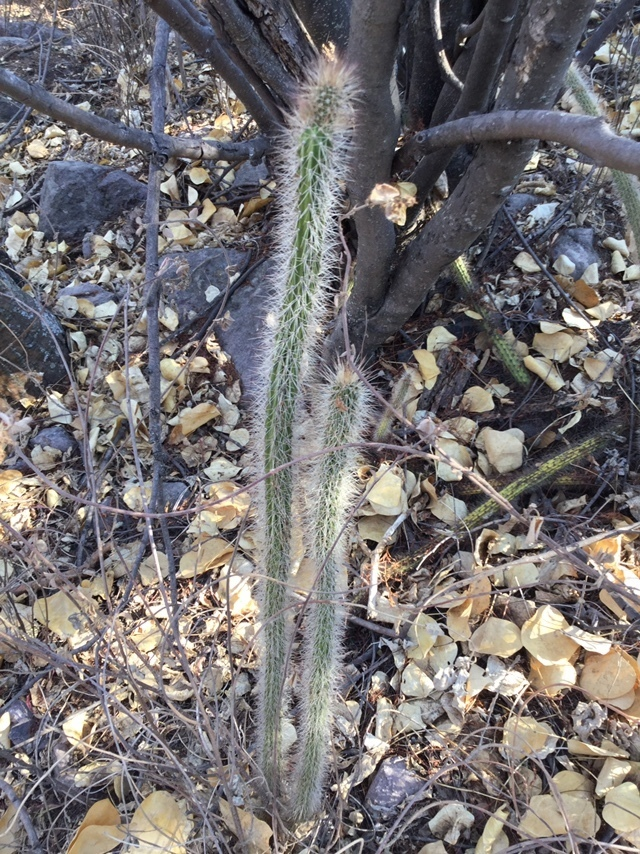
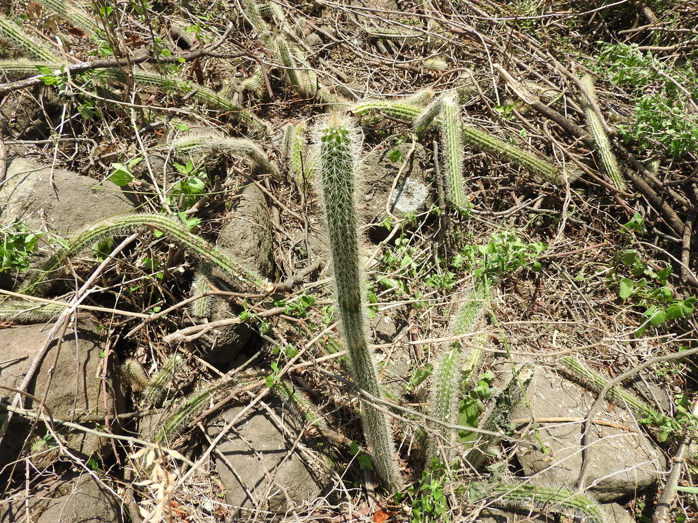
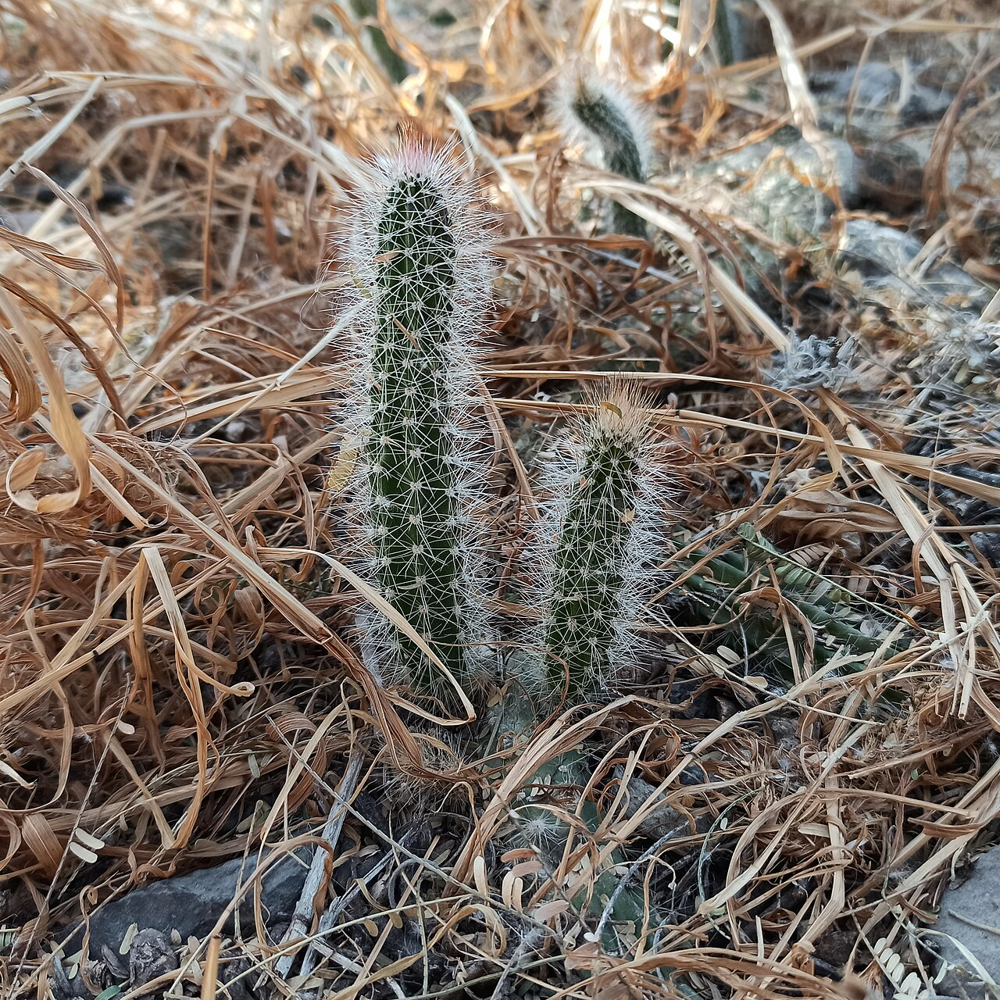
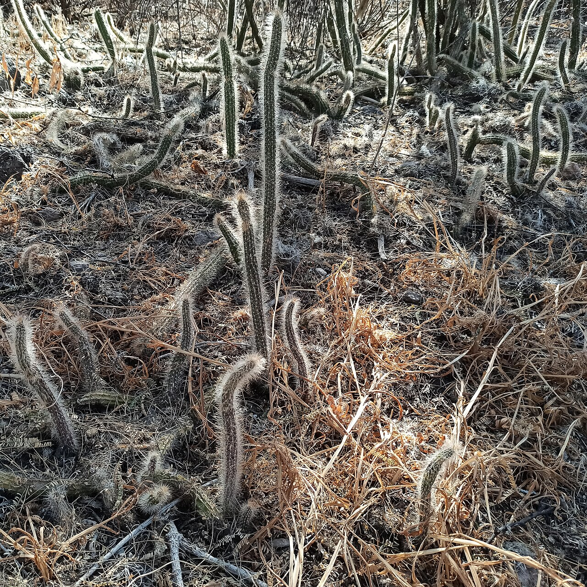
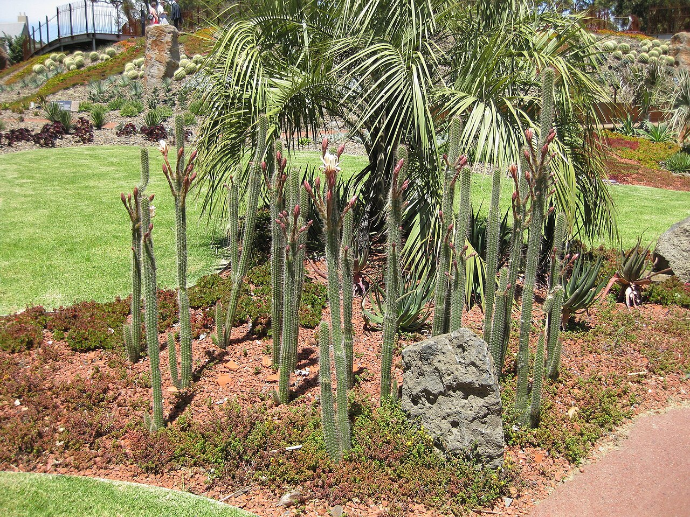
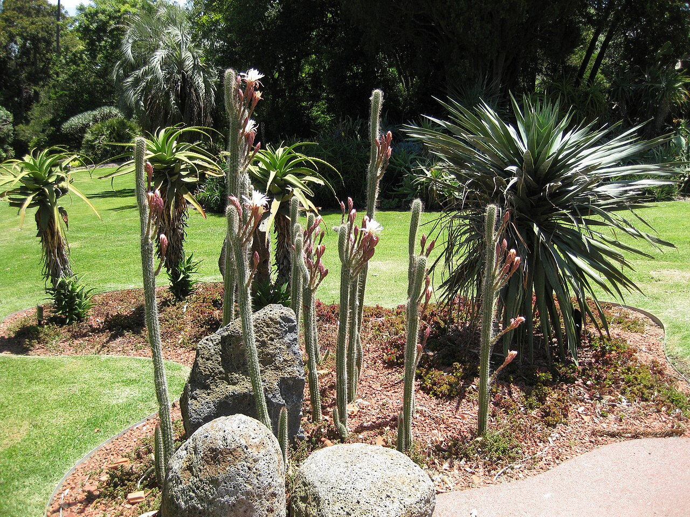
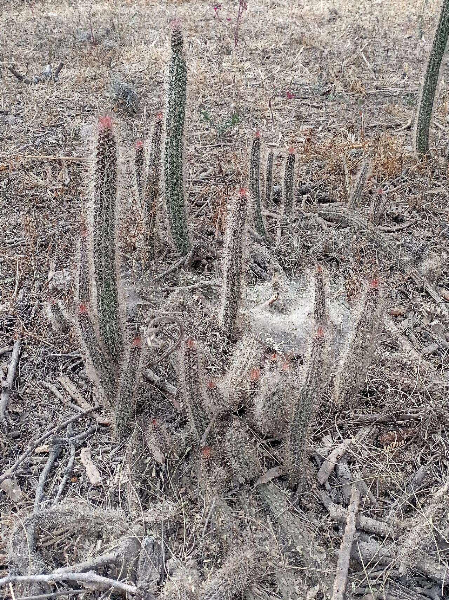
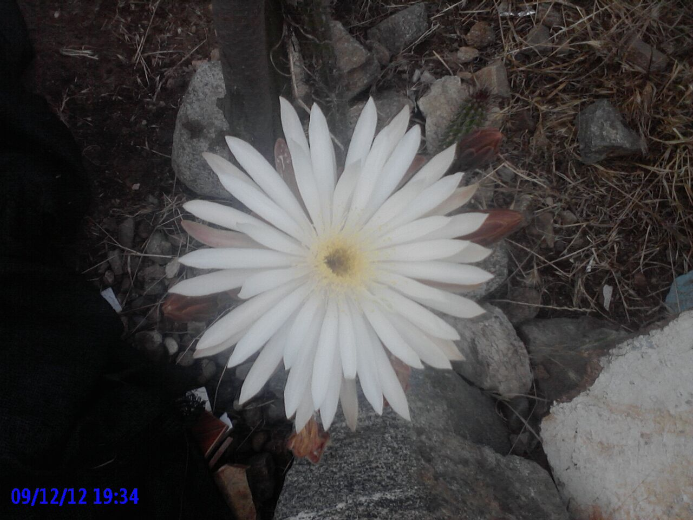

# Serpent cactus photo archive

_Nyctocereus serpentinus_ - Starter-04

Collection label ID: `A3`.

Species-reference photographs; some sources use Peniocereus serpentinus.

Collection research: [open the plant profile](../../../docs/plants/starter/nyctocereus-serpentinus.md).

## Gallery

_habitat_ - [Nyctocereus serpentinus in habitat](https://www.inaturalist.org/observations/12077334); (c) johnyochum, some rights reserved (CC BY); [CC BY](https://creativecommons.org/licenses/by/4.0/).

_habitat_ - [Nyctocereus serpentinus in habitat](https://www.inaturalist.org/observations/46271848); (c) Oscar Alejandro Morales Juárez, some rights reserved (CC BY-SA); [CC BY SA](https://creativecommons.org/licenses/by/4.0/).

_habitat_ - [Nyctocereus serpentinus in habitat](https://www.inaturalist.org/observations/74510692); (c) Erick Vélez Sánchez, some rights reserved (CC BY); [CC BY](https://creativecommons.org/licenses/by/4.0/).

_habitat_ - [Nyctocereus serpentinus in habitat](https://www.inaturalist.org/observations/80542185); (c) Oscar Alejandro Morales Juárez, some rights reserved (CC BY-SA); [CC BY SA](https://creativecommons.org/licenses/by/4.0/).

_habit_ - [Peniocereus serpentinus (Cactaceae).jpg](<https://commons.wikimedia.org/wiki/File:Peniocereus_serpentinus_(Cactaceae).jpg>); Juan Carlos Fonseca Mata; [CC BY-SA 4.0](https://creativecommons.org/licenses/by-sa/4.0).

_habit_ - [Peniocereus serpentinus (Cactaceae) in Guanajuato.jpg](<https://commons.wikimedia.org/wiki/File:Peniocereus_serpentinus_(Cactaceae)_in_Guanajuato.jpg>); Juan Carlos Fonseca Mata; [CC BY-SA 4.0](https://creativecommons.org/licenses/by-sa/4.0).

_habit_ - [Gardenology Nyctocereus serpentinus Royal Botanic Gardens.jpg](https://commons.wikimedia.org/wiki/File:Gardenology_Nyctocereus_serpentinus_Royal_Botanic_Gardens.jpg); Raffi Kojian; [CC BY-SA 3.0](https://creativecommons.org/licenses/by-sa/3.0).

_habit_ - [Gardenology.org-IMG 9798 rbgm10dec.jpg](https://commons.wikimedia.org/wiki/File:Gardenology.org-IMG_9798_rbgm10dec.jpg); Raffi Kojian; [CC BY-SA 3.0](https://creativecommons.org/licenses/by-sa/3.0).

_habit_ - [Nyctocereus serpentinus (Guanajuato, MX).jpg](<https://commons.wikimedia.org/wiki/File:Nyctocereus_serpentinus_(Guanajuato,_MX).jpg>); Juan Carlos Fonseca Mata; [CC BY-SA 4.0](https://creativecommons.org/licenses/by-sa/4.0).

_flower_ - [Flor 5.jpg](https://commons.wikimedia.org/wiki/File:Flor_5.jpg); Facebook Facebook Twitter.; [CC BY-SA 4.0](https://creativecommons.org/licenses/by-sa/4.0).

## File details

| File                                                                                       | Subject | Source                                                                                                                     | Creator                                                             | License                                                        |
| ------------------------------------------------------------------------------------------ | ------- | -------------------------------------------------------------------------------------------------------------------------- | ------------------------------------------------------------------- | -------------------------------------------------------------- |
| [inaturalist-12077334-17318881-habitat.jpg](./inaturalist-12077334-17318881-habitat.jpg)   | habitat | [iNaturalist](https://www.inaturalist.org/observations/12077334)                                                           | (c) johnyochum, some rights reserved (CC BY)                        | [CC BY](https://creativecommons.org/licenses/by/4.0/)          |
| [inaturalist-46271848-73385147-habitat.jpg](./inaturalist-46271848-73385147-habitat.jpg)   | habitat | [iNaturalist](https://www.inaturalist.org/observations/46271848)                                                           | (c) Oscar Alejandro Morales Juárez, some rights reserved (CC BY-SA) | [CC BY SA](https://creativecommons.org/licenses/by/4.0/)       |
| [inaturalist-74510692-121787610-habitat.jpg](./inaturalist-74510692-121787610-habitat.jpg) | habitat | [iNaturalist](https://www.inaturalist.org/observations/74510692)                                                           | (c) Erick Vélez Sánchez, some rights reserved (CC BY)               | [CC BY](https://creativecommons.org/licenses/by/4.0/)          |
| [inaturalist-80542185-132018999-habitat.jpg](./inaturalist-80542185-132018999-habitat.jpg) | habitat | [iNaturalist](https://www.inaturalist.org/observations/80542185)                                                           | (c) Oscar Alejandro Morales Juárez, some rights reserved (CC BY-SA) | [CC BY SA](https://creativecommons.org/licenses/by/4.0/)       |
| [commons-101804529-habit.jpg](./commons-101804529-habit.jpg)                               | habit   | [Wikimedia Commons](<https://commons.wikimedia.org/wiki/File:Peniocereus_serpentinus_(Cactaceae).jpg>)                     | Juan Carlos Fonseca Mata                                            | [CC BY-SA 4.0](https://creativecommons.org/licenses/by-sa/4.0) |
| [commons-101804531-habit.jpg](./commons-101804531-habit.jpg)                               | habit   | [Wikimedia Commons](<https://commons.wikimedia.org/wiki/File:Peniocereus_serpentinus_(Cactaceae)_in_Guanajuato.jpg>)       | Juan Carlos Fonseca Mata                                            | [CC BY-SA 4.0](https://creativecommons.org/licenses/by-sa/4.0) |
| [commons-12439319-habit.jpg](./commons-12439319-habit.jpg)                                 | habit   | [Wikimedia Commons](https://commons.wikimedia.org/wiki/File:Gardenology_Nyctocereus_serpentinus_Royal_Botanic_Gardens.jpg) | Raffi Kojian                                                        | [CC BY-SA 3.0](https://creativecommons.org/licenses/by-sa/3.0) |
| [commons-12439776-habit.jpg](./commons-12439776-habit.jpg)                                 | habit   | [Wikimedia Commons](https://commons.wikimedia.org/wiki/File:Gardenology.org-IMG_9798_rbgm10dec.jpg)                        | Raffi Kojian                                                        | [CC BY-SA 3.0](https://creativecommons.org/licenses/by-sa/3.0) |
| [commons-128327797-habit.jpg](./commons-128327797-habit.jpg)                               | habit   | [Wikimedia Commons](<https://commons.wikimedia.org/wiki/File:Nyctocereus_serpentinus_(Guanajuato,_MX).jpg>)                | Juan Carlos Fonseca Mata                                            | [CC BY-SA 4.0](https://creativecommons.org/licenses/by-sa/4.0) |
| [commons-38007687-flower.jpg](./commons-38007687-flower.jpg)                               | flower  | [Wikimedia Commons](https://commons.wikimedia.org/wiki/File:Flor_5.jpg)                                                    | Facebook Facebook Twitter.                                          | [CC BY-SA 4.0](https://creativecommons.org/licenses/by-sa/4.0) |

Metadata and SHA-256 hashes are also available in [the global manifest](../photo-manifest.json).
