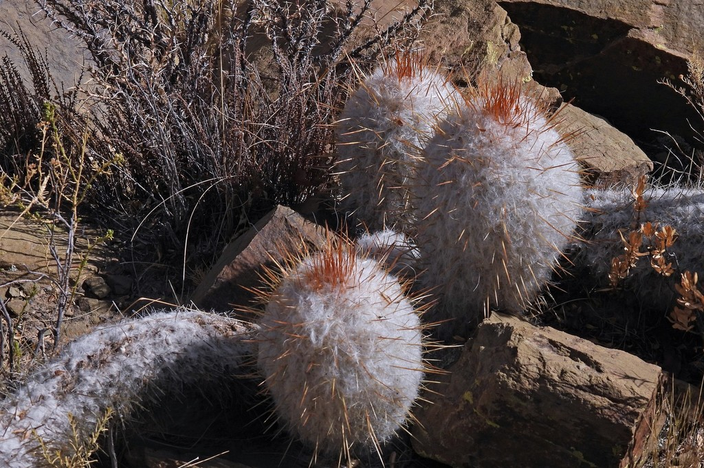
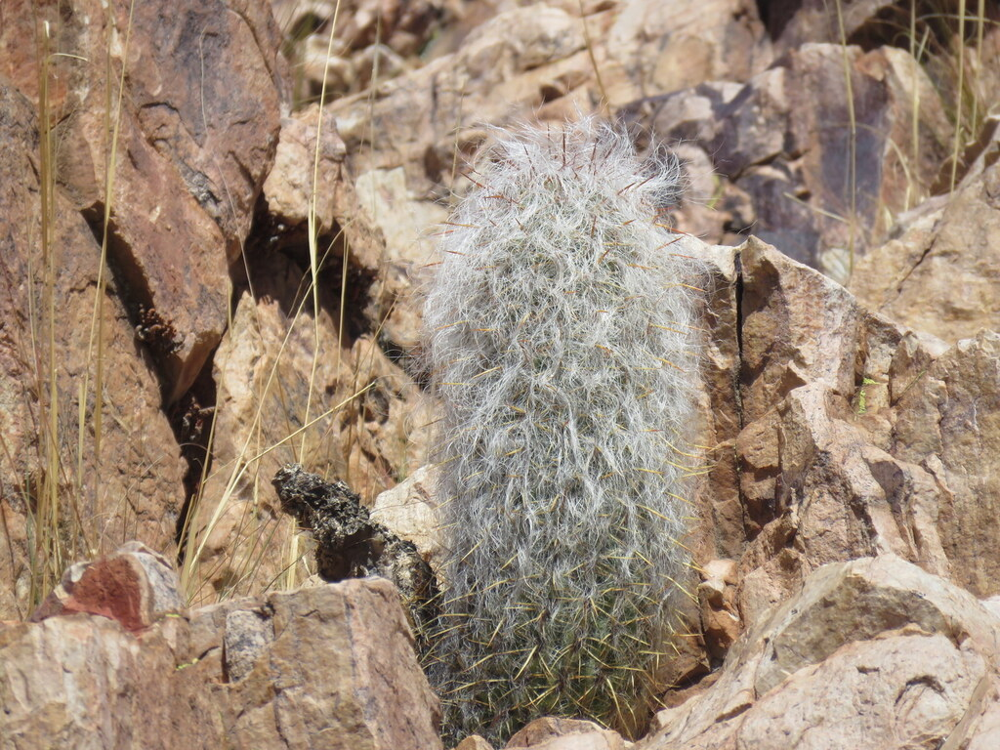
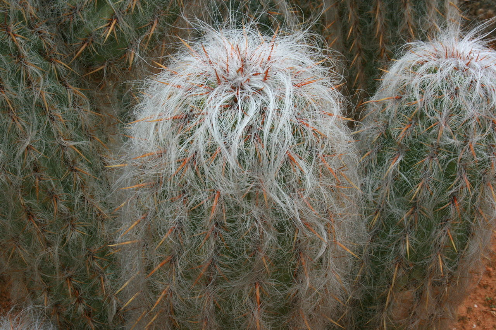
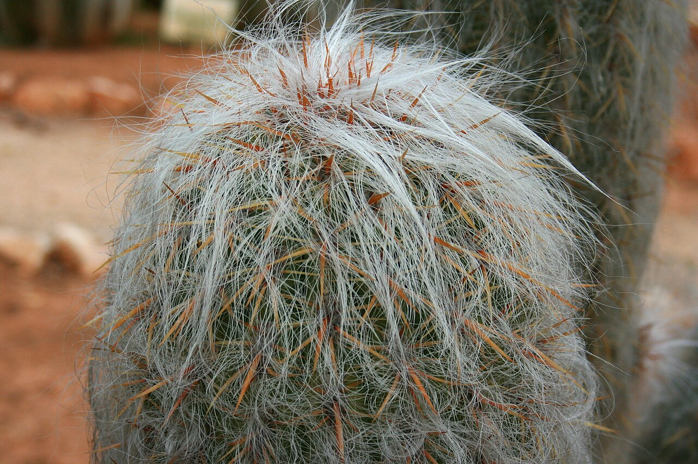
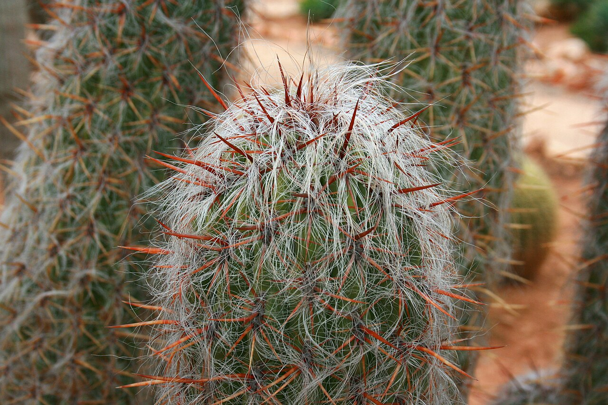
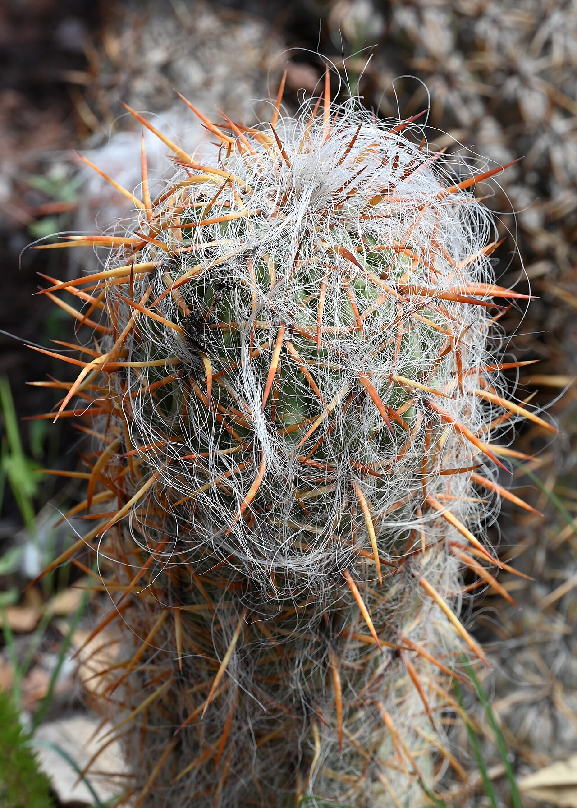

# Old Man of the Andes photo archive

*Oreocereus trollii* - Starter-01

Species-reference photographs.

Collection research: [open the plant profile](../../../docs/plants/starter/oreocereus-trollii.md).

## Gallery

*habitat* - [Oreocereus trollii in habitat](<https://www.inaturalist.org/observations/106170428>); no rights reserved; [CC0](<https://creativecommons.org/publicdomain/zero/1.0/>).

*habitat* - [Oreocereus trollii in habitat](<https://www.inaturalist.org/observations/272767352>); no rights reserved; [CC0](<https://creativecommons.org/publicdomain/zero/1.0/>).

*habit* - [Ses Salines - Botanicactus - Oreocereus trollii 04 ies.jpg](<https://commons.wikimedia.org/wiki/File:Ses_Salines_-_Botanicactus_-_Oreocereus_trollii_04_ies.jpg>); Frank Vincentz; [CC BY-SA 3.0](<https://creativecommons.org/licenses/by-sa/3.0>).

*habit* - [Ses Salines - Botanicactus - Oreocereus trollii 05 ies.jpg](<https://commons.wikimedia.org/wiki/File:Ses_Salines_-_Botanicactus_-_Oreocereus_trollii_05_ies.jpg>); Frank Vincentz; [CC BY-SA 3.0](<https://creativecommons.org/licenses/by-sa/3.0>).

*habit* - [Ses Salines - Botanicactus - Oreocereus trollii 06 ies.jpg](<https://commons.wikimedia.org/wiki/File:Ses_Salines_-_Botanicactus_-_Oreocereus_trollii_06_ies.jpg>); Frank Vincentz; [CC BY-SA 3.0](<https://creativecommons.org/licenses/by-sa/3.0>).

*habit* - [Oreocereus trollii kz01.jpg](<https://commons.wikimedia.org/wiki/File:Oreocereus_trollii_kz01.jpg>); Krzysztof Ziarnek, Kenraiz; [CC BY-SA 4.0](<https://creativecommons.org/licenses/by-sa/4.0>).

## File details

| File | Subject | Source | Creator | License |
| --- | --- | --- | --- | --- |
| [inaturalist-106170428-178307177-habitat.jpg](./inaturalist-106170428-178307177-habitat.jpg) | habitat | [iNaturalist](<https://www.inaturalist.org/observations/106170428>) | no rights reserved | [CC0](<https://creativecommons.org/publicdomain/zero/1.0/>) |
| [inaturalist-272767352-490735096-habitat.jpg](./inaturalist-272767352-490735096-habitat.jpg) | habitat | [iNaturalist](<https://www.inaturalist.org/observations/272767352>) | no rights reserved | [CC0](<https://creativecommons.org/publicdomain/zero/1.0/>) |
| [commons-14765917-habit.jpg](./commons-14765917-habit.jpg) | habit | [Wikimedia Commons](<https://commons.wikimedia.org/wiki/File:Ses_Salines_-_Botanicactus_-_Oreocereus_trollii_04_ies.jpg>) | Frank Vincentz | [CC BY-SA 3.0](<https://creativecommons.org/licenses/by-sa/3.0>) |
| [commons-14765928-habit.jpg](./commons-14765928-habit.jpg) | habit | [Wikimedia Commons](<https://commons.wikimedia.org/wiki/File:Ses_Salines_-_Botanicactus_-_Oreocereus_trollii_05_ies.jpg>) | Frank Vincentz | [CC BY-SA 3.0](<https://creativecommons.org/licenses/by-sa/3.0>) |
| [commons-14765938-habit.jpg](./commons-14765938-habit.jpg) | habit | [Wikimedia Commons](<https://commons.wikimedia.org/wiki/File:Ses_Salines_-_Botanicactus_-_Oreocereus_trollii_06_ies.jpg>) | Frank Vincentz | [CC BY-SA 3.0](<https://creativecommons.org/licenses/by-sa/3.0>) |
| [commons-156025286-habit.jpg](./commons-156025286-habit.jpg) | habit | [Wikimedia Commons](<https://commons.wikimedia.org/wiki/File:Oreocereus_trollii_kz01.jpg>) | Krzysztof Ziarnek, Kenraiz | [CC BY-SA 4.0](<https://creativecommons.org/licenses/by-sa/4.0>) |

Metadata and SHA-256 hashes are also available in [the global manifest](../photo-manifest.json).
