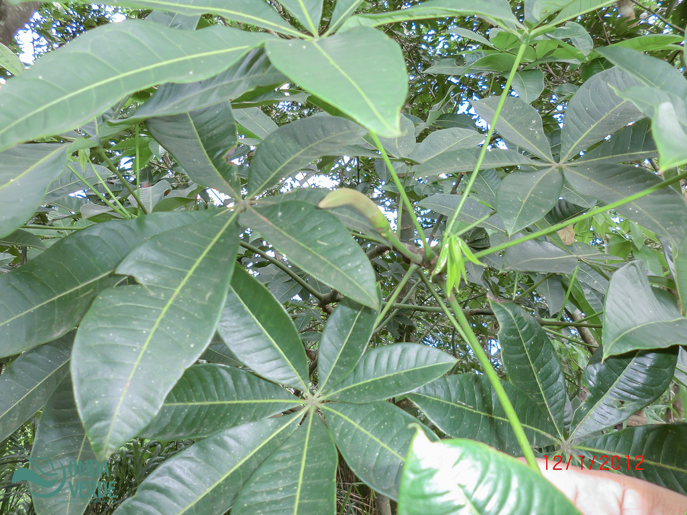
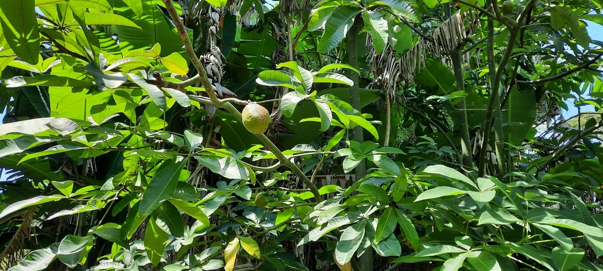
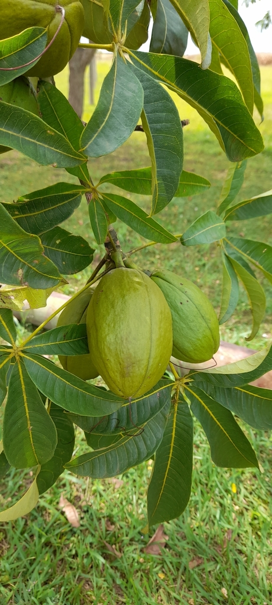
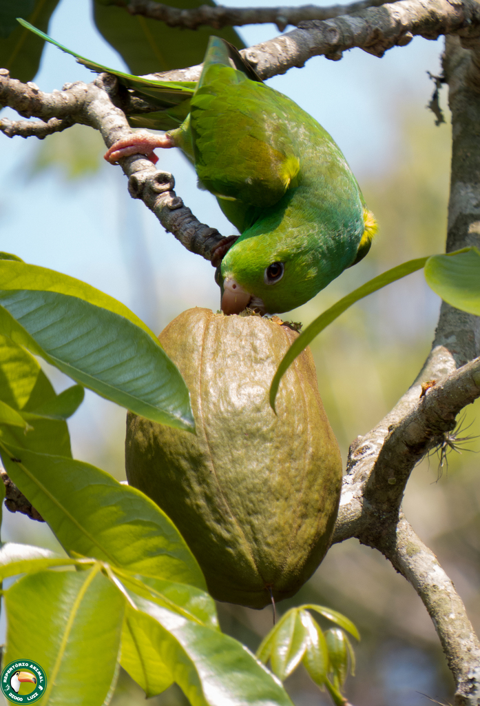
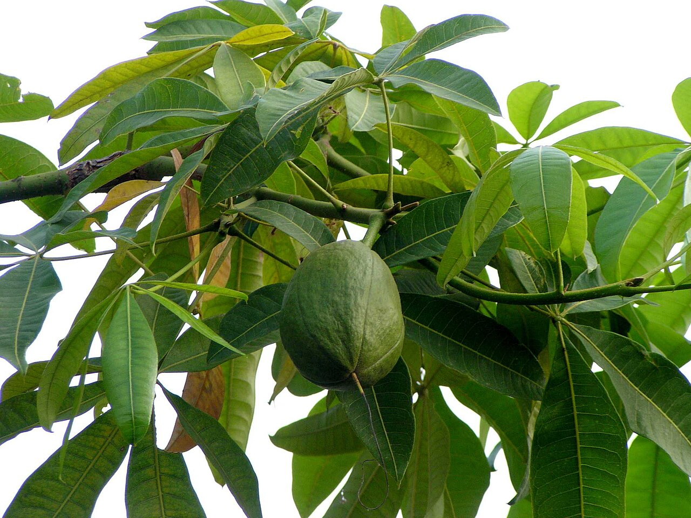
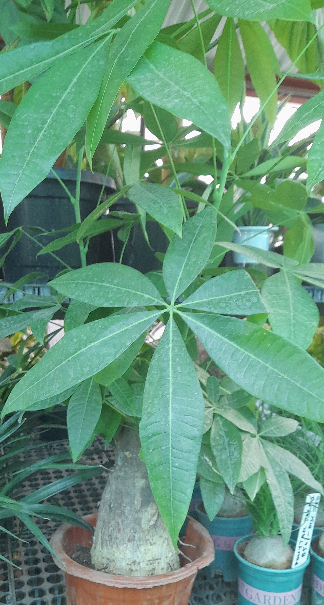
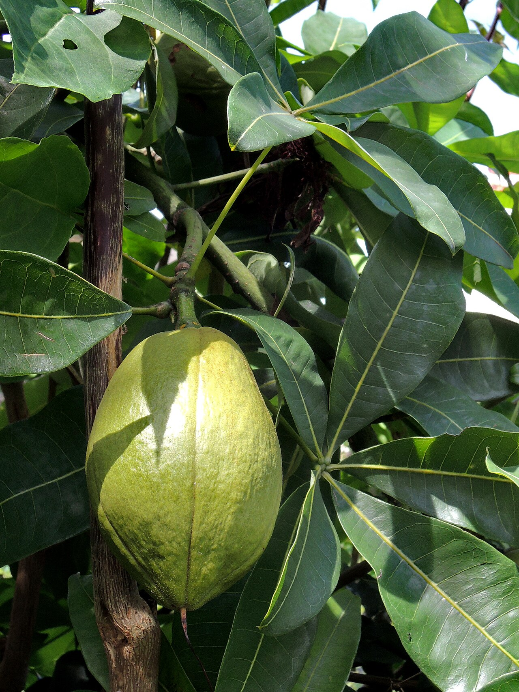
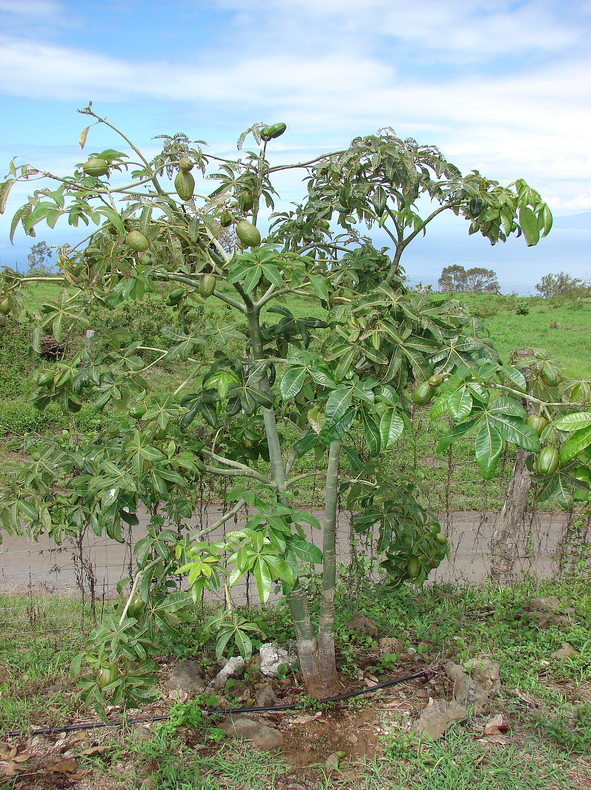

# Money tree photo archive

_Pachira glabra_ - Houseplant-01

Collection label ID: `#3`.

Species-reference photographs; the retail money-tree name is often confused with P. aquatica, so the original tag remains useful evidence.

Collection research: [open the plant profile](../../../docs/plants/houseplants/pachira-glabra.md).

## Gallery

_habitat_ - [Pachira glabra in habitat](https://www.inaturalist.org/observations/137587577); (c) Diogo Luiz, some rights reserved (CC BY); [CC BY](https://creativecommons.org/licenses/by/4.0/).

_habitat_ - [Pachira glabra in habitat](https://www.inaturalist.org/observations/149894385); (c) Karen Eichholz, some rights reserved (CC BY); [CC BY](https://creativecommons.org/licenses/by/4.0/).

_habitat_ - [Pachira glabra in habitat](https://www.inaturalist.org/observations/153327173); (c) Rafael Silva, some rights reserved (CC BY-SA); [CC BY SA](https://creativecommons.org/licenses/by/4.0/).

_habitat_ - [Pachira glabra in habitat](https://www.inaturalist.org/observations/33872475); (c) Diogo Luiz, some rights reserved (CC BY); [CC BY](https://creativecommons.org/licenses/by/4.0/).

_fruit-seed_ - [Pachira glabra D5150066.jpg](https://commons.wikimedia.org/wiki/File:Pachira_glabra_D5150066.jpg); A16898; [CC BY-SA 3.0](https://creativecommons.org/licenses/by-sa/3.0).

_habit_ - [Pachira glabra-3-NRI Layout-bengaluru-India.jpg](https://commons.wikimedia.org/wiki/File:Pachira_glabra-3-NRI_Layout-bengaluru-India.jpg); Yercaud-elango; [CC BY 4.0](https://creativecommons.org/licenses/by/4.0).

_fruit-seed_ - [Pachira glabra, fruit.jpg](https://commons.wikimedia.org/wiki/File:Pachira_glabra,_fruit.jpg); Mk2010; [CC BY-SA 3.0](https://creativecommons.org/licenses/by-sa/3.0).

_habitat_ - [Starr 070830-8237 Pachira glabra.jpg](https://commons.wikimedia.org/wiki/File:Starr_070830-8237_Pachira_glabra.jpg); Forest & Kim Starr; [CC BY 3.0](https://creativecommons.org/licenses/by/3.0).

## File details

| File                                                                                         | Subject    | Source                                                                                                       | Creator                                           | License                                                        |
| -------------------------------------------------------------------------------------------- | ---------- | ------------------------------------------------------------------------------------------------------------ | ------------------------------------------------- | -------------------------------------------------------------- |
| [inaturalist-137587577-235012627-habitat.jpg](./inaturalist-137587577-235012627-habitat.jpg) | habitat    | [iNaturalist](https://www.inaturalist.org/observations/137587577)                                            | (c) Diogo Luiz, some rights reserved (CC BY)      | [CC BY](https://creativecommons.org/licenses/by/4.0/)          |
| [inaturalist-149894385-258367947-habitat.jpg](./inaturalist-149894385-258367947-habitat.jpg) | habitat    | [iNaturalist](https://www.inaturalist.org/observations/149894385)                                            | (c) Karen Eichholz, some rights reserved (CC BY)  | [CC BY](https://creativecommons.org/licenses/by/4.0/)          |
| [inaturalist-153327173-264808435-habitat.jpg](./inaturalist-153327173-264808435-habitat.jpg) | habitat    | [iNaturalist](https://www.inaturalist.org/observations/153327173)                                            | (c) Rafael Silva, some rights reserved (CC BY-SA) | [CC BY SA](https://creativecommons.org/licenses/by/4.0/)       |
| [inaturalist-33872475-53247586-habitat.jpg](./inaturalist-33872475-53247586-habitat.jpg)     | habitat    | [iNaturalist](https://www.inaturalist.org/observations/33872475)                                             | (c) Diogo Luiz, some rights reserved (CC BY)      | [CC BY](https://creativecommons.org/licenses/by/4.0/)          |
| [commons-16682231-habit.jpg](./commons-16682231-habit.jpg)                                   | fruit-seed | [Wikimedia Commons](https://commons.wikimedia.org/wiki/File:Pachira_glabra_D5150066.jpg)                     | A16898                                            | [CC BY-SA 3.0](https://creativecommons.org/licenses/by-sa/3.0) |
| [commons-178705325-flower.jpg](./commons-178705325-flower.jpg)                               | habit      | [Wikimedia Commons](https://commons.wikimedia.org/wiki/File:Pachira_glabra-3-NRI_Layout-bengaluru-India.jpg) | Yercaud-elango                                    | [CC BY 4.0](https://creativecommons.org/licenses/by/4.0)       |
| [commons-33509192-fruit-seed.jpg](./commons-33509192-fruit-seed.jpg)                         | fruit-seed | [Wikimedia Commons](https://commons.wikimedia.org/wiki/File:Pachira_glabra,_fruit.jpg)                       | Mk2010                                            | [CC BY-SA 3.0](https://creativecommons.org/licenses/by-sa/3.0) |
| [commons-6182227-habitat.jpg](./commons-6182227-habitat.jpg)                                 | habitat    | [Wikimedia Commons](https://commons.wikimedia.org/wiki/File:Starr_070830-8237_Pachira_glabra.jpg)            | Forest & Kim Starr                                | [CC BY 3.0](https://creativecommons.org/licenses/by/3.0)       |

Metadata and SHA-256 hashes are also available in [the global manifest](../photo-manifest.json).
