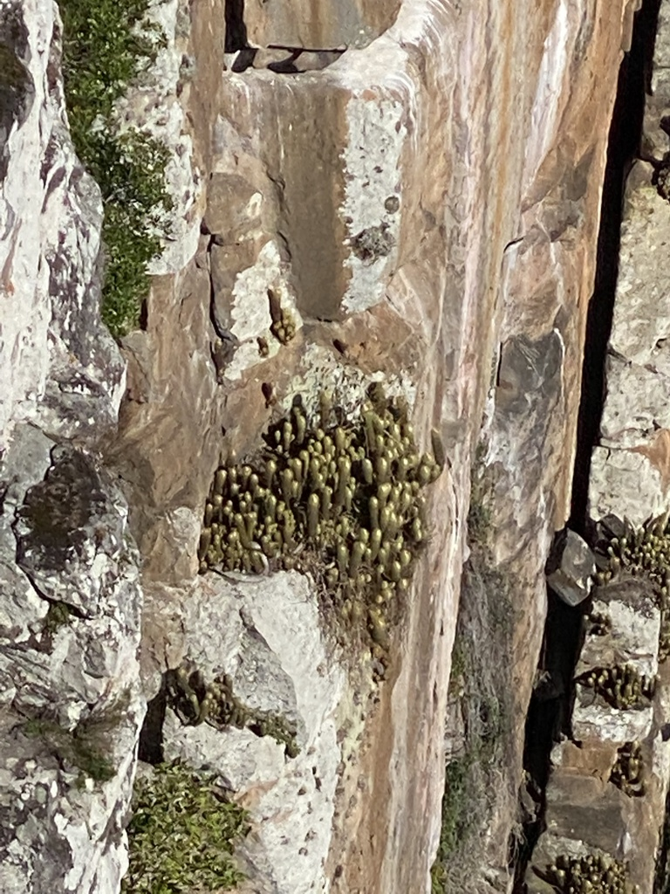
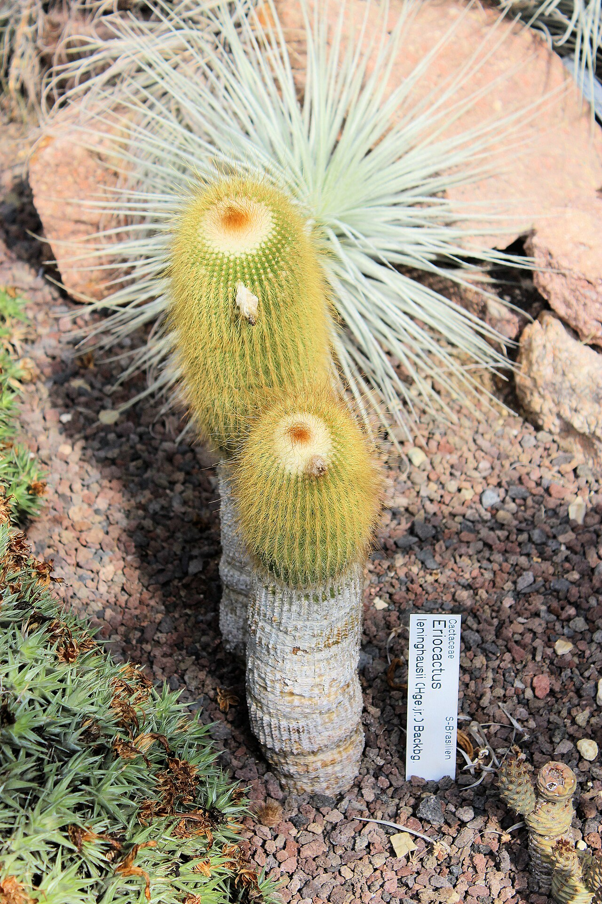
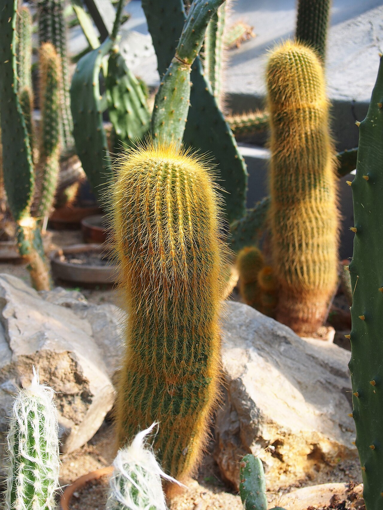
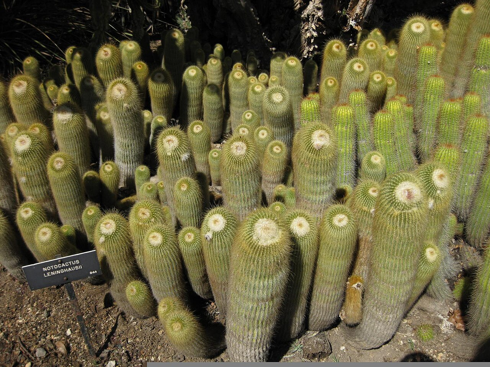
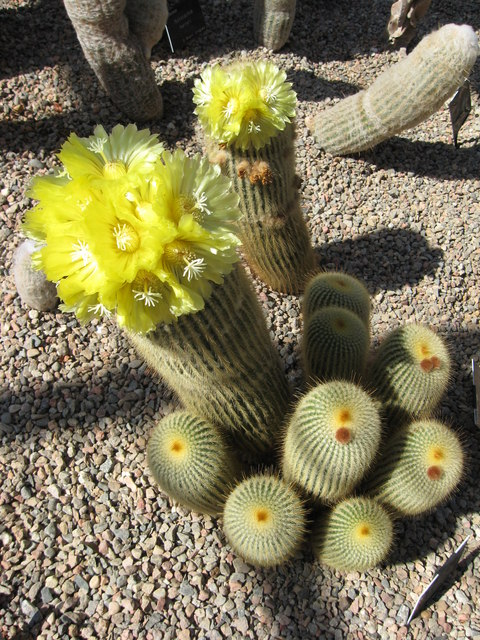
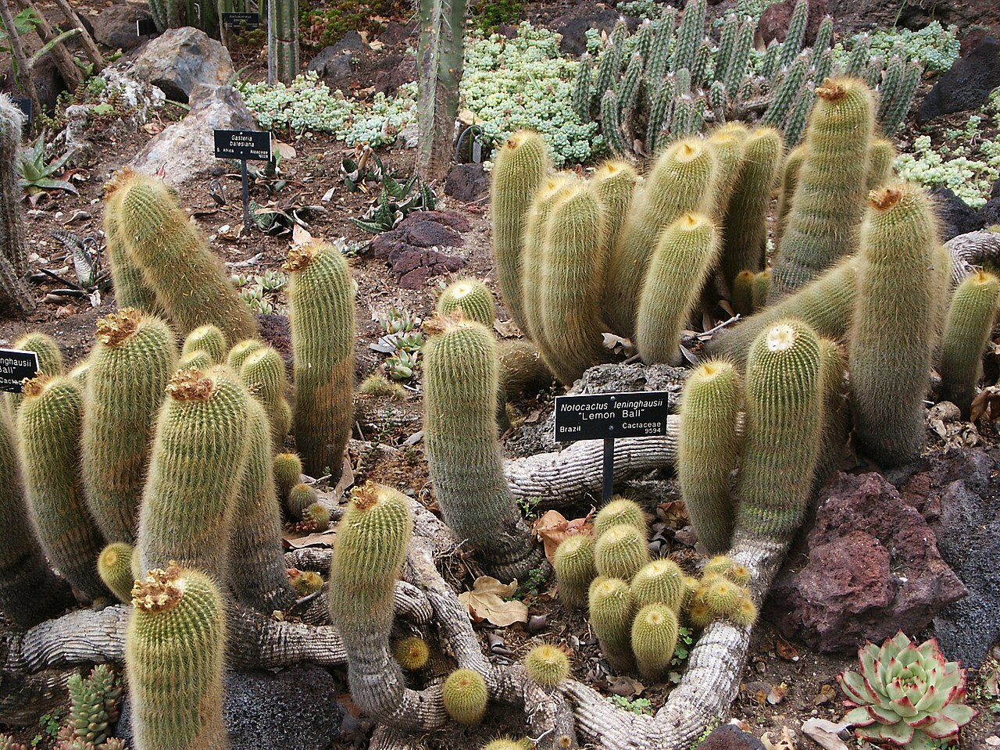

# Yellow tower cactus photo archive

_Parodia leninghausii_ - Cactus-04

Collection label ID: `F3`.

Species-reference photographs.

Collection research: [open the plant profile](../../../docs/plants/cacti/parodia-leninghausii.md).

## Gallery

_habitat_ - [Parodia leninghausii in habitat](https://www.inaturalist.org/observations/166638251); (c) Pedro Alvaro Neves, some rights reserved (CC BY); [CC BY](https://creativecommons.org/licenses/by/4.0/).

_habit_ - [Halle (Saale), botanischer Garten, Parodia leninghausii.jpg](<https://commons.wikimedia.org/wiki/File:Halle_(Saale),_botanischer_Garten,_Parodia_leninghausii.jpg>); Dguendel; [CC BY 3.0](https://creativecommons.org/licenses/by/3.0).

_habit_ - [Parodia leninghausii 2019-04-14 01.jpg](https://commons.wikimedia.org/wiki/File:Parodia_leninghausii_2019-04-14_01.jpg); Agnieszka Kwiecień, Nova; [CC BY-SA 4.0](https://creativecommons.org/licenses/by-sa/4.0).

_detail_ - [Gardenology-IMG 5202 hunt10mar.jpg](https://commons.wikimedia.org/wiki/File:Gardenology-IMG_5202_hunt10mar.jpg); Raffi Kojian; [CC BY-SA 3.0](https://creativecommons.org/licenses/by-sa/3.0).

_flower_ - [Lemon flush - geograph.org.uk - 1366681.jpg](https://commons.wikimedia.org/wiki/File:Lemon_flush_-_geograph.org.uk_-_1366681.jpg); Carol Walker; [CC BY-SA 2.0](https://creativecommons.org/licenses/by-sa/2.0).

_habit_ - [Parodia leninghausii and Gasteria batesiana, Huntington.jpg](https://commons.wikimedia.org/wiki/File:Parodia_leninghausii_and_Gasteria_batesiana,_Huntington.jpg); Pamla J. Eisenberg from Anaheim, USA; [CC BY-SA 2.0](https://creativecommons.org/licenses/by-sa/2.0).

## File details

| File                                                                                         | Subject | Source                                                                                                                     | Creator                                              | License                                                        |
| -------------------------------------------------------------------------------------------- | ------- | -------------------------------------------------------------------------------------------------------------------------- | ---------------------------------------------------- | -------------------------------------------------------------- |
| [inaturalist-166638251-288581249-habitat.jpg](./inaturalist-166638251-288581249-habitat.jpg) | habitat | [iNaturalist](https://www.inaturalist.org/observations/166638251)                                                          | (c) Pedro Alvaro Neves, some rights reserved (CC BY) | [CC BY](https://creativecommons.org/licenses/by/4.0/)          |
| [commons-109816632-habit.jpg](./commons-109816632-habit.jpg)                                 | habit   | [Wikimedia Commons](<https://commons.wikimedia.org/wiki/File:Halle_(Saale),_botanischer_Garten,_Parodia_leninghausii.jpg>) | Dguendel                                             | [CC BY 3.0](https://creativecommons.org/licenses/by/3.0)       |
| [commons-117172675-habit.jpg](./commons-117172675-habit.jpg)                                 | habit   | [Wikimedia Commons](https://commons.wikimedia.org/wiki/File:Parodia_leninghausii_2019-04-14_01.jpg)                        | Agnieszka Kwiecień, Nova                             | [CC BY-SA 4.0](https://creativecommons.org/licenses/by-sa/4.0) |
| [commons-12396946-detail.jpg](./commons-12396946-detail.jpg)                                 | detail  | [Wikimedia Commons](https://commons.wikimedia.org/wiki/File:Gardenology-IMG_5202_hunt10mar.jpg)                            | Raffi Kojian                                         | [CC BY-SA 3.0](https://creativecommons.org/licenses/by-sa/3.0) |
| [commons-14097447-flower.jpg](./commons-14097447-flower.jpg)                                 | flower  | [Wikimedia Commons](https://commons.wikimedia.org/wiki/File:Lemon_flush_-_geograph.org.uk_-_1366681.jpg)                   | Carol Walker                                         | [CC BY-SA 2.0](https://creativecommons.org/licenses/by-sa/2.0) |
| [commons-6955278-habitat.jpg](./commons-6955278-habitat.jpg)                                 | habit   | [Wikimedia Commons](https://commons.wikimedia.org/wiki/File:Parodia_leninghausii_and_Gasteria_batesiana,_Huntington.jpg)   | Pamla J. Eisenberg from Anaheim, USA                 | [CC BY-SA 2.0](https://creativecommons.org/licenses/by-sa/2.0) |

Metadata and SHA-256 hashes are also available in [the global manifest](../photo-manifest.json).
