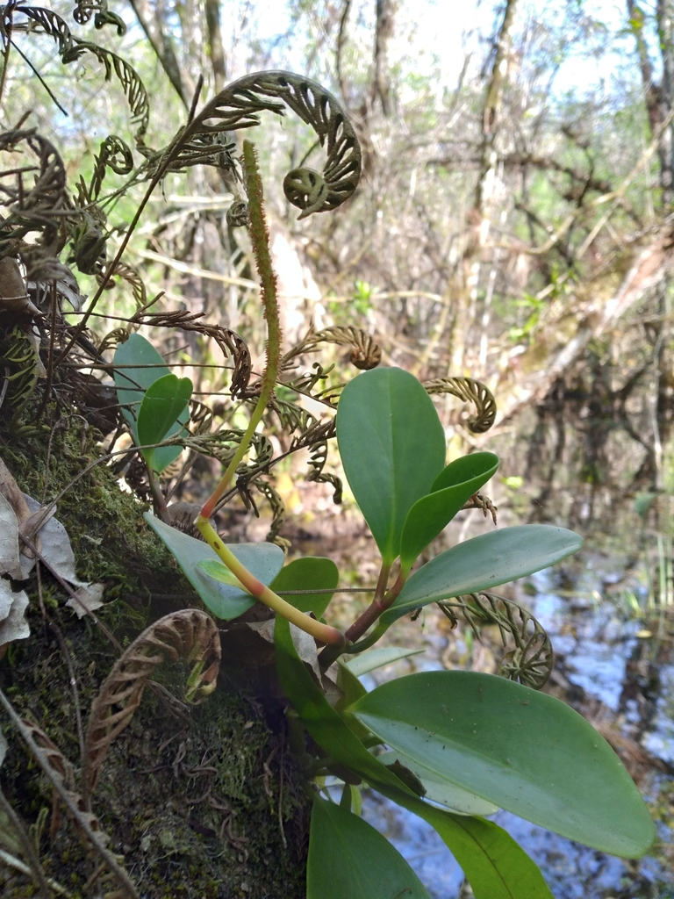
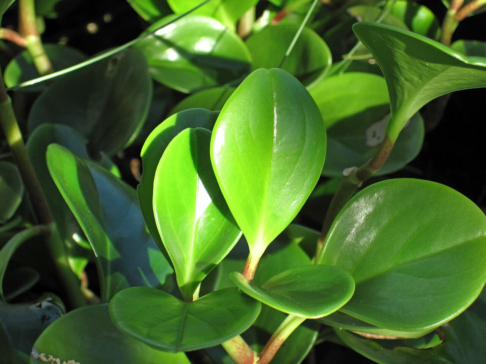
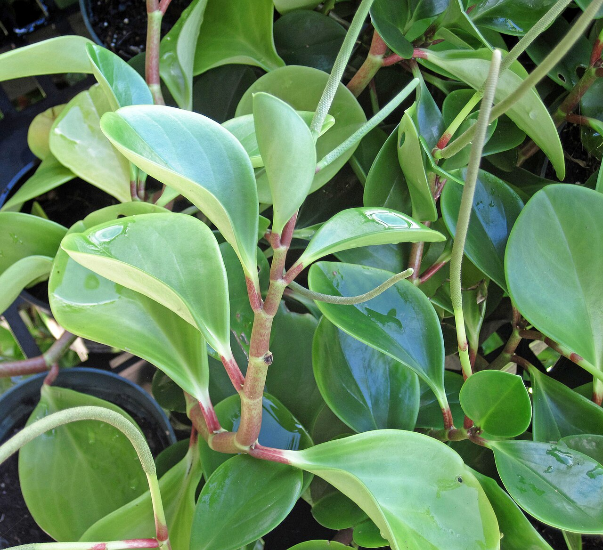
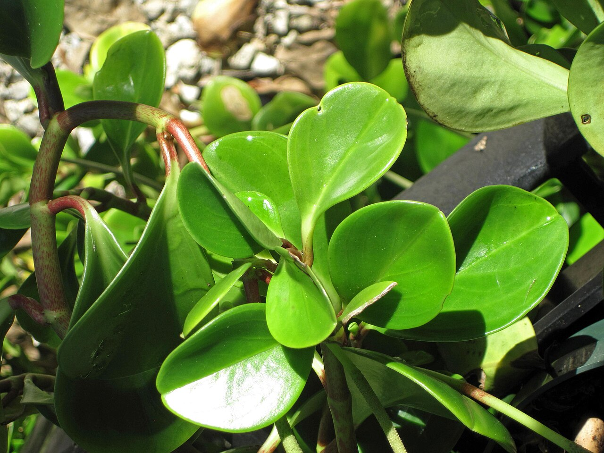
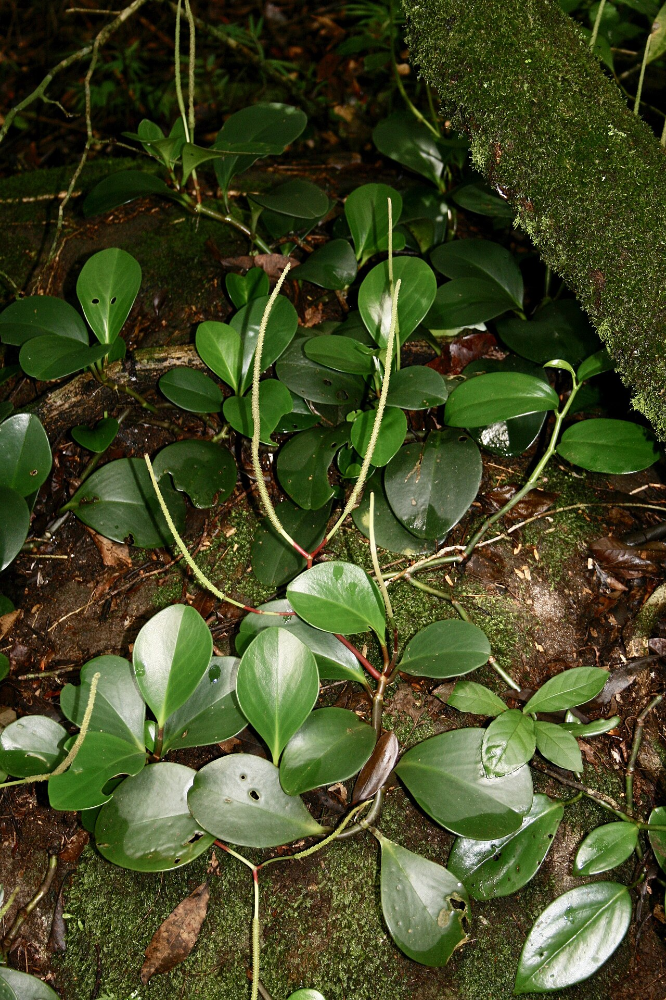
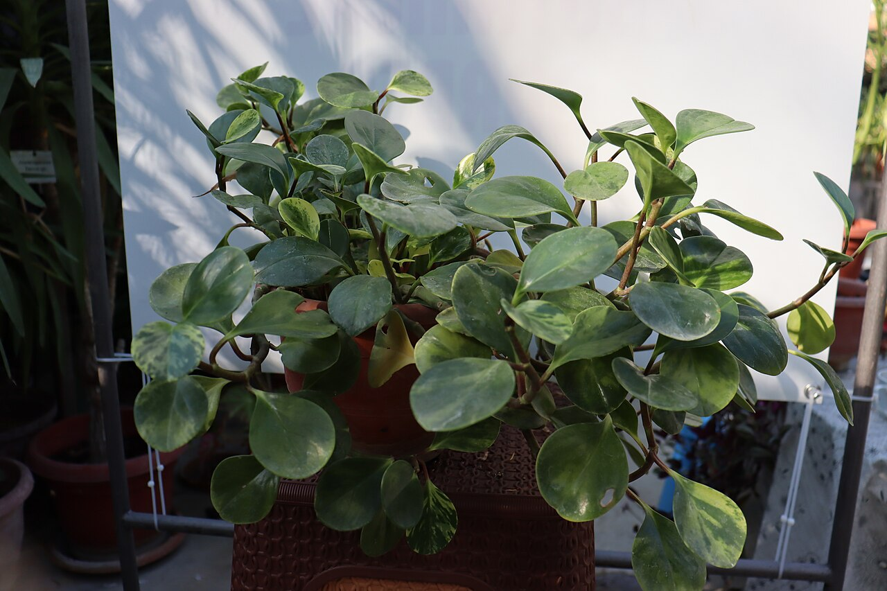
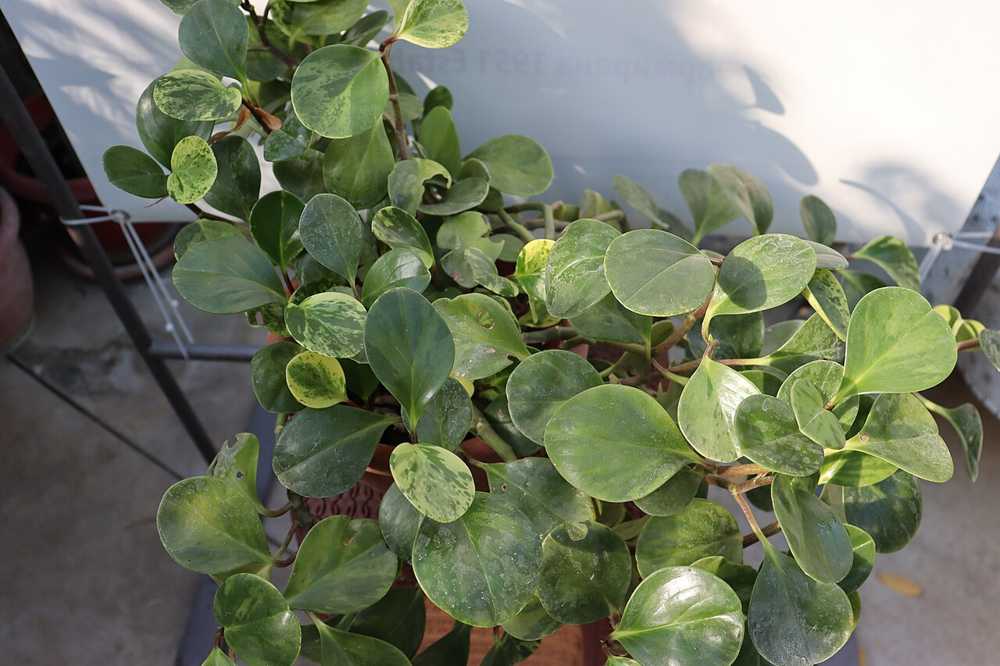
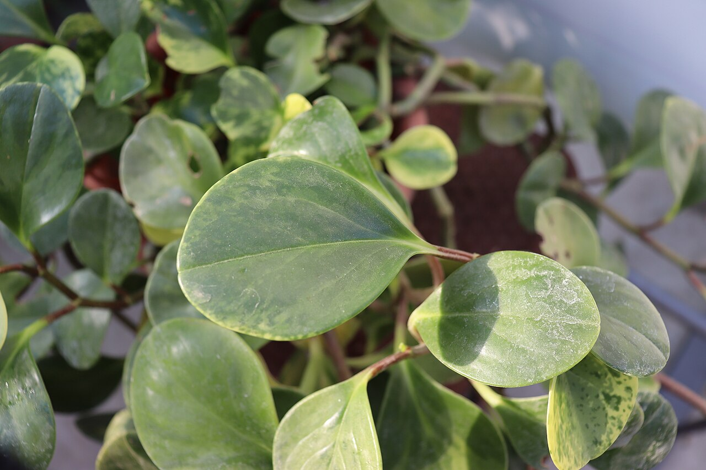
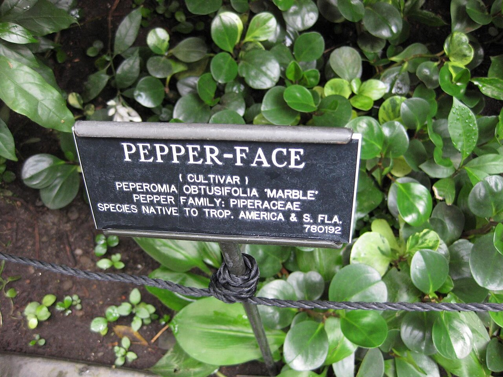
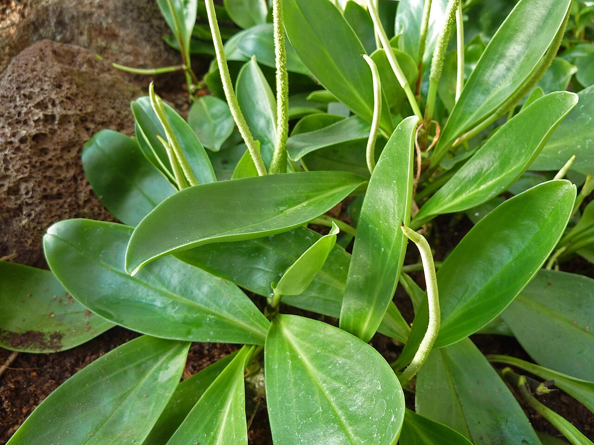

# Peperomia Bicolor photo archive

_Peperomia obtusifolia Obtipan Bicolor_ - Houseplant-03

Collection label ID: `#7`.

Species-reference photographs may show plain green or other variegated Peperomia obtusifolia selections; none is assumed to show the nursery-labelled Obtipan Bicolor cultivar.

Collection research: [open the plant profile](../../../docs/plants/houseplants/peperomia-obtipan-bicolor.md).

## Gallery

_habitat_ - [Peperomia obtusifolia reference observation](https://www.inaturalist.org/observations/69735535); (c) Scott Ward, some rights reserved (CC BY); [CC BY](https://creativecommons.org/licenses/by/4.0/).

_habit_ - [Peperomia obtusifolia (baby rubber plant) 3.jpg](<https://commons.wikimedia.org/wiki/File:Peperomia_obtusifolia_(baby_rubber_plant)_3.jpg>); James St. John; [CC BY 2.0](https://creativecommons.org/licenses/by/2.0).

_habit_ - [Peperomia obtusifolia (baby rubber plant) 2.jpg](<https://commons.wikimedia.org/wiki/File:Peperomia_obtusifolia_(baby_rubber_plant)_2.jpg>); James St. John; [CC BY 2.0](https://creativecommons.org/licenses/by/2.0).

_habit_ - [Peperomia obtusifolia (baby rubber plant) 1.jpg](<https://commons.wikimedia.org/wiki/File:Peperomia_obtusifolia_(baby_rubber_plant)_1.jpg>); James St. John; [CC BY 2.0](https://creativecommons.org/licenses/by/2.0).

_habitat_ - [Peperomia obtusifolia = Peperomia magnoliifolia (Piperaceae) (41338533825).jpg](<https://commons.wikimedia.org/wiki/File:Peperomia_obtusifolia_%3D_Peperomia_magnoliifolia_(Piperaceae)_(41338533825).jpg>); Dr. Alexey Yakovlev; [CC BY-SA 2.0](https://creativecommons.org/licenses/by-sa/2.0).

_habitat_ - [Peperomia obtusifolia - Ботаничка градина Скопје (1).jpg](<https://commons.wikimedia.org/wiki/File:Peperomia_obtusifolia_-_%D0%91%D0%BE%D1%82%D0%B0%D0%BD%D0%B8%D1%87%D0%BA%D0%B0_%D0%B3%D1%80%D0%B0%D0%B4%D0%B8%D0%BD%D0%B0_%D0%A1%D0%BA%D0%BE%D0%BF%D1%98%D0%B5_(1).jpg>); Dandarmkd; [CC BY-SA 4.0](https://creativecommons.org/licenses/by-sa/4.0).

_habitat_ - [Peperomia obtusifolia - Ботаничка градина Скопје (2).jpg](<https://commons.wikimedia.org/wiki/File:Peperomia_obtusifolia_-_%D0%91%D0%BE%D1%82%D0%B0%D0%BD%D0%B8%D1%87%D0%BA%D0%B0_%D0%B3%D1%80%D0%B0%D0%B4%D0%B8%D0%BD%D0%B0_%D0%A1%D0%BA%D0%BE%D0%BF%D1%98%D0%B5_(2).jpg>); Dandarmkd; [CC BY-SA 4.0](https://creativecommons.org/licenses/by-sa/4.0).

_habitat_ - [Peperomia obtusifolia - Ботаничка градина Скопје (3).jpg](<https://commons.wikimedia.org/wiki/File:Peperomia_obtusifolia_-_%D0%91%D0%BE%D1%82%D0%B0%D0%BD%D0%B8%D1%87%D0%BA%D0%B0_%D0%B3%D1%80%D0%B0%D0%B4%D0%B8%D0%BD%D0%B0_%D0%A1%D0%BA%D0%BE%D0%BF%D1%98%D0%B5_(3).jpg>); Dandarmkd; [CC BY-SA 4.0](https://creativecommons.org/licenses/by-sa/4.0).

_detail_ - [Gardenology.org-IMG 1167 bbg09.jpg](https://commons.wikimedia.org/wiki/File:Gardenology.org-IMG_1167_bbg09.jpg); Raffi Kojian; [CC BY-SA 3.0](https://creativecommons.org/licenses/by-sa/3.0).

_habit_ - [Peperomia obtusifolia 2011-01-17.jpg](https://commons.wikimedia.org/wiki/File:Peperomia_obtusifolia_2011-01-17.jpg); James Steakley; [CC BY-SA 3.0](https://creativecommons.org/licenses/by-sa/3.0).

## File details

| File                                                                                       | Subject | Source                                                                                                                                                                                                                                | Creator                                      | License                                                        |
| ------------------------------------------------------------------------------------------ | ------- | ------------------------------------------------------------------------------------------------------------------------------------------------------------------------------------------------------------------------------------- | -------------------------------------------- | -------------------------------------------------------------- |
| [inaturalist-69735535-113222134-habitat.jpg](./inaturalist-69735535-113222134-habitat.jpg) | habitat | [iNaturalist](https://www.inaturalist.org/observations/69735535)                                                                                                                                                                      | (c) Scott Ward, some rights reserved (CC BY) | [CC BY](https://creativecommons.org/licenses/by/4.0/)          |
| [commons-105571980-flower.jpg](./commons-105571980-flower.jpg)                             | habit   | [Wikimedia Commons](<https://commons.wikimedia.org/wiki/File:Peperomia_obtusifolia_(baby_rubber_plant)_3.jpg>)                                                                                                                        | James St. John                               | [CC BY 2.0](https://creativecommons.org/licenses/by/2.0)       |
| [commons-105571998-flower.jpg](./commons-105571998-flower.jpg)                             | habit   | [Wikimedia Commons](<https://commons.wikimedia.org/wiki/File:Peperomia_obtusifolia_(baby_rubber_plant)_2.jpg>)                                                                                                                        | James St. John                               | [CC BY 2.0](https://creativecommons.org/licenses/by/2.0)       |
| [commons-105571999-flower.jpg](./commons-105571999-flower.jpg)                             | habit   | [Wikimedia Commons](<https://commons.wikimedia.org/wiki/File:Peperomia_obtusifolia_(baby_rubber_plant)_1.jpg>)                                                                                                                        | James St. John                               | [CC BY 2.0](https://creativecommons.org/licenses/by/2.0)       |
| [commons-106748969-habitat.jpg](./commons-106748969-habitat.jpg)                           | habitat | [Wikimedia Commons](<https://commons.wikimedia.org/wiki/File:Peperomia_obtusifolia_%3D_Peperomia_magnoliifolia_(Piperaceae)_(41338533825).jpg>)                                                                                       | Dr. Alexey Yakovlev                          | [CC BY-SA 2.0](https://creativecommons.org/licenses/by-sa/2.0) |
| [commons-115472889-habitat.jpg](./commons-115472889-habitat.jpg)                           | habitat | [Wikimedia Commons](<https://commons.wikimedia.org/wiki/File:Peperomia_obtusifolia_-_%D0%91%D0%BE%D1%82%D0%B0%D0%BD%D0%B8%D1%87%D0%BA%D0%B0_%D0%B3%D1%80%D0%B0%D0%B4%D0%B8%D0%BD%D0%B0_%D0%A1%D0%BA%D0%BE%D0%BF%D1%98%D0%B5_(1).jpg>) | Dandarmkd                                    | [CC BY-SA 4.0](https://creativecommons.org/licenses/by-sa/4.0) |
| [commons-115472890-habitat.jpg](./commons-115472890-habitat.jpg)                           | habitat | [Wikimedia Commons](<https://commons.wikimedia.org/wiki/File:Peperomia_obtusifolia_-_%D0%91%D0%BE%D1%82%D0%B0%D0%BD%D0%B8%D1%87%D0%BA%D0%B0_%D0%B3%D1%80%D0%B0%D0%B4%D0%B8%D0%BD%D0%B0_%D0%A1%D0%BA%D0%BE%D0%BF%D1%98%D0%B5_(2).jpg>) | Dandarmkd                                    | [CC BY-SA 4.0](https://creativecommons.org/licenses/by-sa/4.0) |
| [commons-115472892-habitat.jpg](./commons-115472892-habitat.jpg)                           | habitat | [Wikimedia Commons](<https://commons.wikimedia.org/wiki/File:Peperomia_obtusifolia_-_%D0%91%D0%BE%D1%82%D0%B0%D0%BD%D0%B8%D1%87%D0%BA%D0%B0_%D0%B3%D1%80%D0%B0%D0%B4%D0%B8%D0%BD%D0%B0_%D0%A1%D0%BA%D0%BE%D0%BF%D1%98%D0%B5_(3).jpg>) | Dandarmkd                                    | [CC BY-SA 4.0](https://creativecommons.org/licenses/by-sa/4.0) |
| [commons-12401196-detail.jpg](./commons-12401196-detail.jpg)                               | detail  | [Wikimedia Commons](https://commons.wikimedia.org/wiki/File:Gardenology.org-IMG_1167_bbg09.jpg)                                                                                                                                       | Raffi Kojian                                 | [CC BY-SA 3.0](https://creativecommons.org/licenses/by-sa/3.0) |
| [commons-14769622-habit.jpg](./commons-14769622-habit.jpg)                                 | habit   | [Wikimedia Commons](https://commons.wikimedia.org/wiki/File:Peperomia_obtusifolia_2011-01-17.jpg)                                                                                                                                     | James Steakley                               | [CC BY-SA 3.0](https://creativecommons.org/licenses/by-sa/3.0) |

Metadata and SHA-256 hashes are also available in [the global manifest](../photo-manifest.json).
