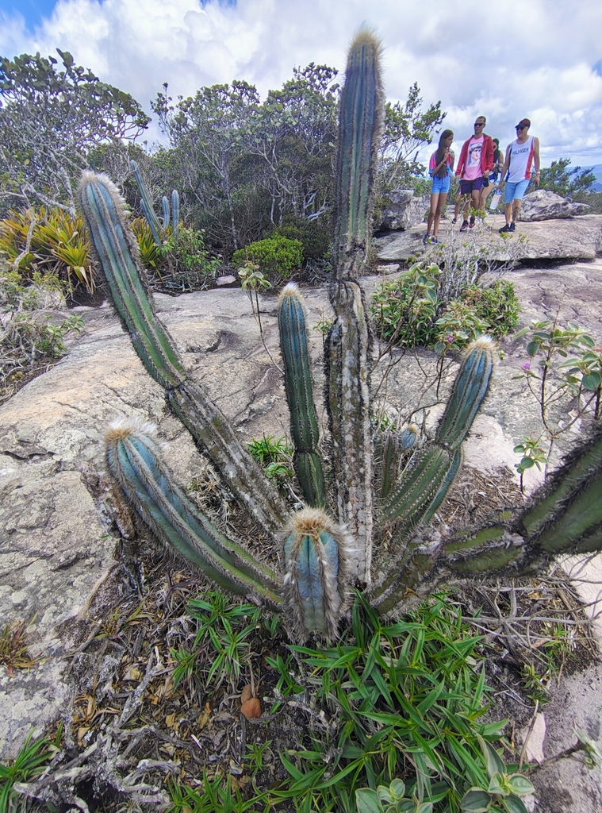
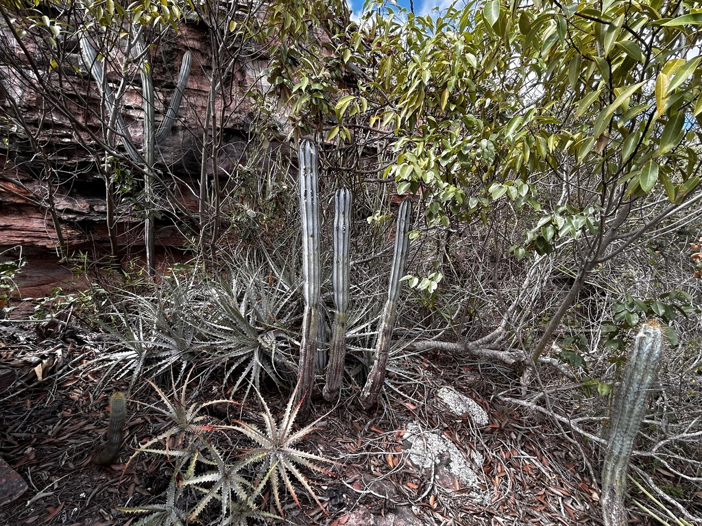
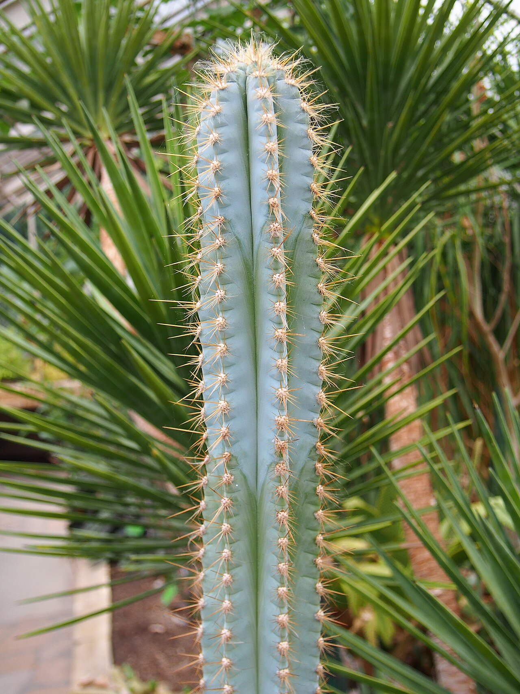
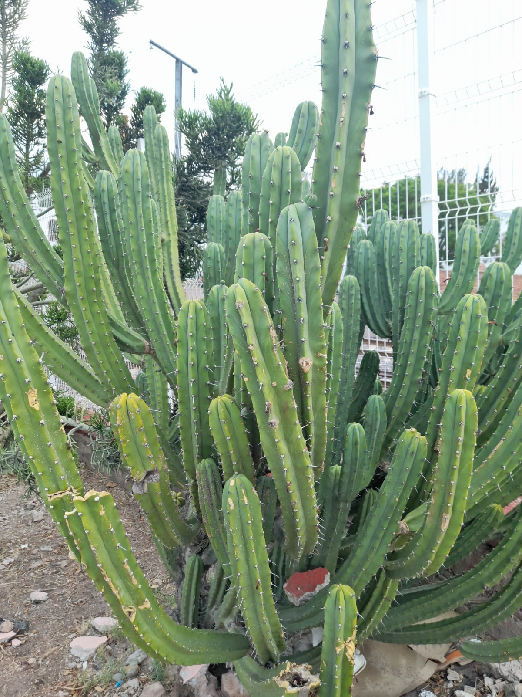
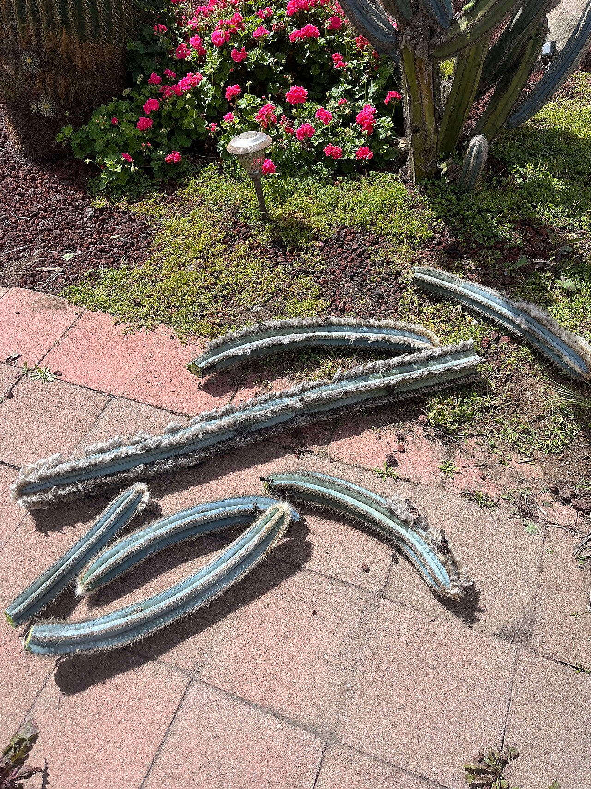
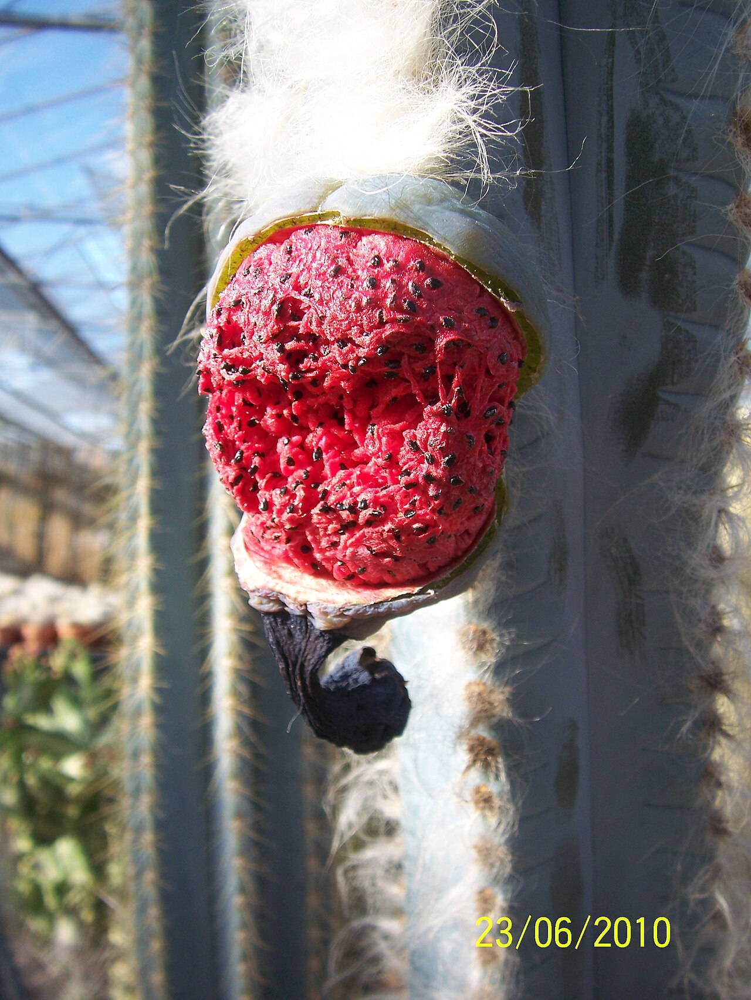

# Blue torch cactus photo archive

*Pilosocereus pachycladus* - Rehab-01

Most photographs show normal wild plants; the collection plant appears variegated and its ID remains provisional.

Collection research: [open the plant profile](../../../docs/plants/rehab/pilosocereus-pachycladus-variegated.md).

## Gallery

*habitat* - [Pilosocereus pachycladus in habitat](<https://www.inaturalist.org/observations/264093008>); (c) Renato Bandeira, some rights reserved (CC BY); [CC BY](<https://creativecommons.org/licenses/by/4.0/>).

*habitat* - [Pilosocereus pachycladus in habitat](<https://www.inaturalist.org/observations/362516980>); (c) vitordematos12, some rights reserved (CC BY-SA); [CC BY SA](<https://creativecommons.org/licenses/by/4.0/>).

*habit* - [Pilosocereus pachycladus 2019-07-12 01.jpg](<https://commons.wikimedia.org/wiki/File:Pilosocereus_pachycladus_2019-07-12_01.jpg>); Agnieszka Kwiecień, Nova; [CC BY-SA 4.0](<https://creativecommons.org/licenses/by-sa/4.0>).

*habitat* - [Pilosocereus pachycladus en hábitat natural.jpg](<https://commons.wikimedia.org/wiki/File:Pilosocereus_pachycladus_en_h%C3%A1bitat_natural.jpg>); Maayelivres; [CC BY-SA 4.0](<https://creativecommons.org/licenses/by-sa/4.0>).

*flower* - [Pilosocereuspachycladusmaturecephalium.jpg](<https://commons.wikimedia.org/wiki/File:Pilosocereuspachycladusmaturecephalium.jpg>); Kalebzhan; [CC BY-SA 4.0](<https://creativecommons.org/licenses/by-sa/4.0>).

*fruit-seed* - [Cactus fruit splits open more (Pilosocereus azureus) (4802630487).jpg](<https://commons.wikimedia.org/wiki/File:Cactus_fruit_splits_open_more_(Pilosocereus_azureus)_(4802630487).jpg>); Leonora Enking from West Sussex, England; [CC BY-SA 2.0](<https://creativecommons.org/licenses/by-sa/2.0>).

## File details

| File | Subject | Source | Creator | License |
| --- | --- | --- | --- | --- |
| [inaturalist-264093008-474529692-habitat.jpg](./inaturalist-264093008-474529692-habitat.jpg) | habitat | [iNaturalist](<https://www.inaturalist.org/observations/264093008>) | (c) Renato Bandeira, some rights reserved (CC BY) | [CC BY](<https://creativecommons.org/licenses/by/4.0/>) |
| [inaturalist-362516980-661644688-habitat.jpg](./inaturalist-362516980-661644688-habitat.jpg) | habitat | [iNaturalist](<https://www.inaturalist.org/observations/362516980>) | (c) vitordematos12, some rights reserved (CC BY-SA) | [CC BY SA](<https://creativecommons.org/licenses/by/4.0/>) |
| [commons-117652269-habit.jpg](./commons-117652269-habit.jpg) | habit | [Wikimedia Commons](<https://commons.wikimedia.org/wiki/File:Pilosocereus_pachycladus_2019-07-12_01.jpg>) | Agnieszka Kwiecień, Nova | [CC BY-SA 4.0](<https://creativecommons.org/licenses/by-sa/4.0>) |
| [commons-139213865-habitat.jpg](./commons-139213865-habitat.jpg) | habitat | [Wikimedia Commons](<https://commons.wikimedia.org/wiki/File:Pilosocereus_pachycladus_en_h%C3%A1bitat_natural.jpg>) | Maayelivres | [CC BY-SA 4.0](<https://creativecommons.org/licenses/by-sa/4.0>) |
| [commons-164362671-flower.jpg](./commons-164362671-flower.jpg) | flower | [Wikimedia Commons](<https://commons.wikimedia.org/wiki/File:Pilosocereuspachycladusmaturecephalium.jpg>) | Kalebzhan | [CC BY-SA 4.0](<https://creativecommons.org/licenses/by-sa/4.0>) |
| [commons-47290352-fruit-seed.jpg](./commons-47290352-fruit-seed.jpg) | fruit-seed | [Wikimedia Commons](<https://commons.wikimedia.org/wiki/File:Cactus_fruit_splits_open_more_(Pilosocereus_azureus)_(4802630487).jpg>) | Leonora Enking from West Sussex, England | [CC BY-SA 2.0](<https://creativecommons.org/licenses/by-sa/2.0>) |

Metadata and SHA-256 hashes are also available in [the global manifest](../photo-manifest.json).
