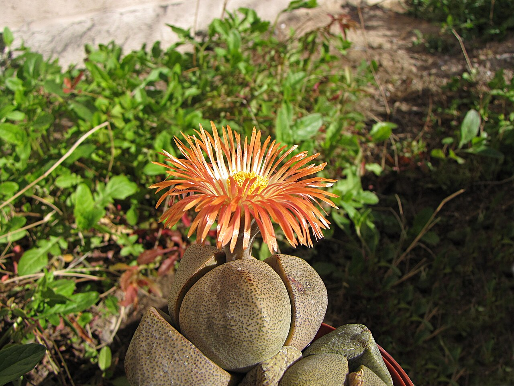
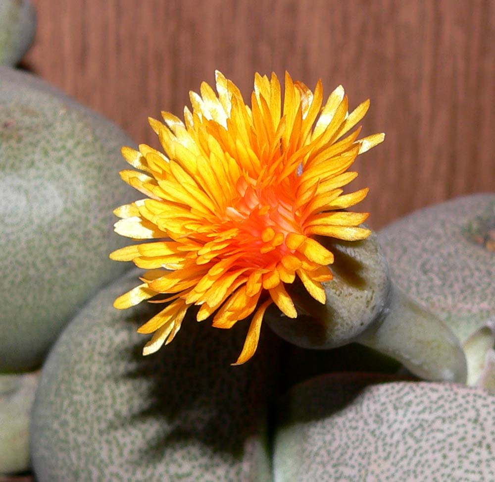
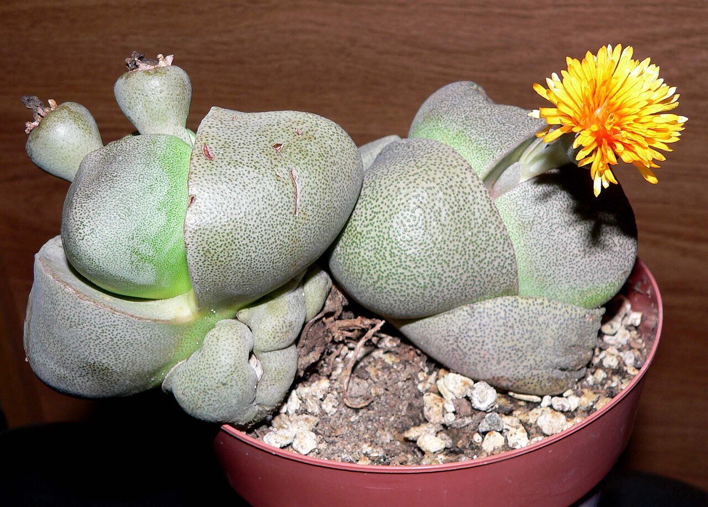
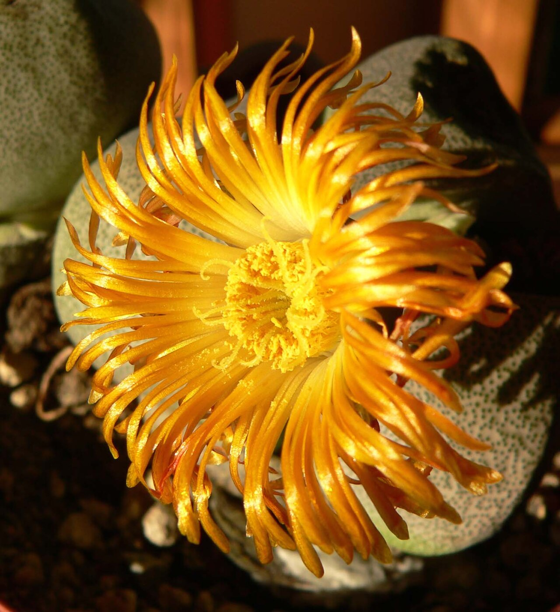
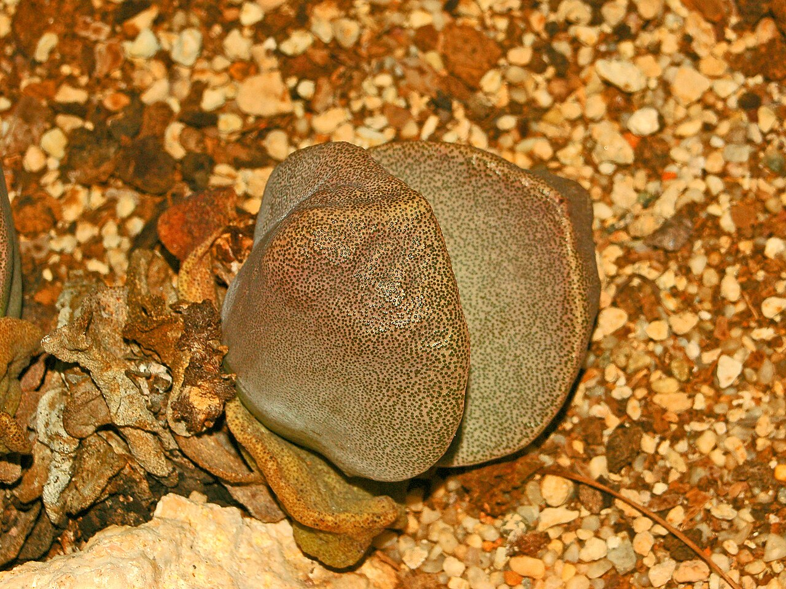
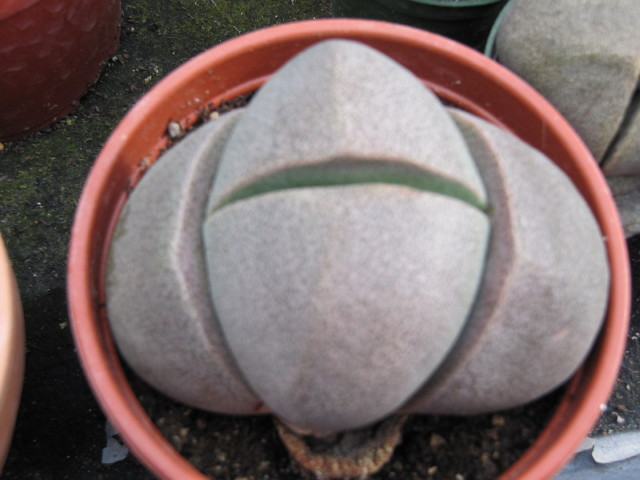

# Royal Flush split rock photo archive

_Pleiospilos nelii_ - Succulent-06

Collection label ID: `G3`; permanent tracker ID: `P28`.

Species references, including cultivated observations, may show the normal green-gray form; the ordered plant is the purple Royal Flush cultivar.

Collection research: [open the plant profile](../../../docs/plants/succulents/pleiospilos-nelii-royal-flush.md).

## Gallery

_flower_ - [Pleiospilos nelii flower.jpg](https://commons.wikimedia.org/wiki/File:Pleiospilos_nelii_flower.jpg); ZooFari; [CC BY-SA 3.0](https://creativecommons.org/licenses/by-sa/3.0).

_flower_ - [Pleiospilos nelii flower 1.jpg](https://commons.wikimedia.org/wiki/File:Pleiospilos_nelii_flower_1.jpg); Stan Shebs; [CC BY-SA 3.0](https://creativecommons.org/licenses/by-sa/3.0).

_habit_ - [Pleiospilos nelii form.jpg](https://commons.wikimedia.org/wiki/File:Pleiospilos_nelii_form.jpg); Stan Shebs; [CC BY-SA 3.0](https://creativecommons.org/licenses/by-sa/3.0).

_flower_ - [Pleiospilos nelii flower 2.jpg](https://commons.wikimedia.org/wiki/File:Pleiospilos_nelii_flower_2.jpg); Stan Shebs; [CC BY-SA 3.0](https://creativecommons.org/licenses/by-sa/3.0).

_habit_ - [Aizoaceae - Pleiospilos nelii.JPG](https://commons.wikimedia.org/wiki/File:Aizoaceae_-_Pleiospilos_nelii.JPG); Hectonichus; [CC BY-SA 3.0](https://creativecommons.org/licenses/by-sa/3.0).

_habit_ - [Dinteranthus? Pleiospilos? (3645391194).jpg](<https://commons.wikimedia.org/wiki/File:Dinteranthus%3F_Pleiospilos%3F_(3645391194).jpg>); Leonora Enking from West Sussex, England; [CC BY-SA 2.0](https://creativecommons.org/licenses/by-sa/2.0).

## File details

| File                                                         | Subject | Source                                                                                                         | Creator                                  | License                                                        |
| ------------------------------------------------------------ | ------- | -------------------------------------------------------------------------------------------------------------- | ---------------------------------------- | -------------------------------------------------------------- |
| [commons-10046629-flower.jpg](./commons-10046629-flower.jpg) | flower  | [Wikimedia Commons](https://commons.wikimedia.org/wiki/File:Pleiospilos_nelii_flower.jpg)                      | ZooFari                                  | [CC BY-SA 3.0](https://creativecommons.org/licenses/by-sa/3.0) |
| [commons-188295-flower.jpg](./commons-188295-flower.jpg)     | flower  | [Wikimedia Commons](https://commons.wikimedia.org/wiki/File:Pleiospilos_nelii_flower_1.jpg)                    | Stan Shebs                               | [CC BY-SA 3.0](https://creativecommons.org/licenses/by-sa/3.0) |
| [commons-188297-habit.jpg](./commons-188297-habit.jpg)       | habit   | [Wikimedia Commons](https://commons.wikimedia.org/wiki/File:Pleiospilos_nelii_form.jpg)                        | Stan Shebs                               | [CC BY-SA 3.0](https://creativecommons.org/licenses/by-sa/3.0) |
| [commons-188342-flower.jpg](./commons-188342-flower.jpg)     | flower  | [Wikimedia Commons](https://commons.wikimedia.org/wiki/File:Pleiospilos_nelii_flower_2.jpg)                    | Stan Shebs                               | [CC BY-SA 3.0](https://creativecommons.org/licenses/by-sa/3.0) |
| [commons-19629135-habit.jpg](./commons-19629135-habit.jpg)   | habit   | [Wikimedia Commons](https://commons.wikimedia.org/wiki/File:Aizoaceae_-_Pleiospilos_nelii.JPG)                 | Hectonichus                              | [CC BY-SA 3.0](https://creativecommons.org/licenses/by-sa/3.0) |
| [commons-47290715-habit.jpg](./commons-47290715-habit.jpg)   | habit   | [Wikimedia Commons](<https://commons.wikimedia.org/wiki/File:Dinteranthus%3F_Pleiospilos%3F_(3645391194).jpg>) | Leonora Enking from West Sussex, England | [CC BY-SA 2.0](https://creativecommons.org/licenses/by-sa/2.0) |

Metadata and SHA-256 hashes are also available in [the global manifest](../photo-manifest.json).
