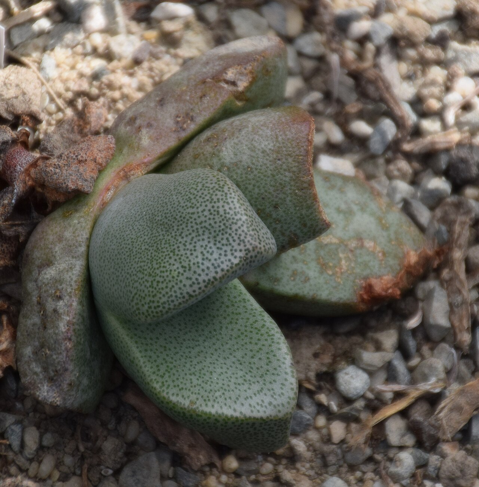
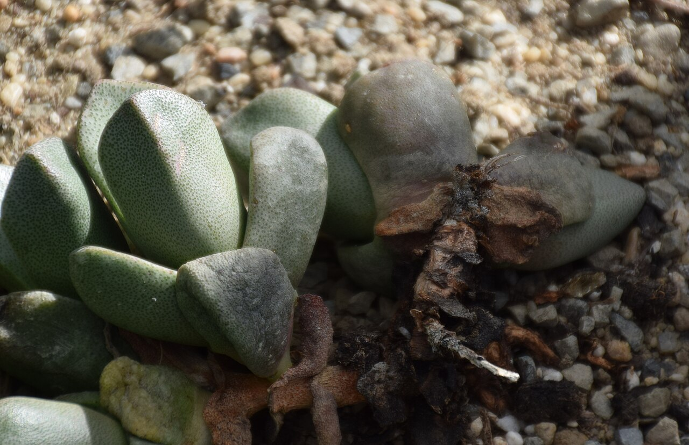
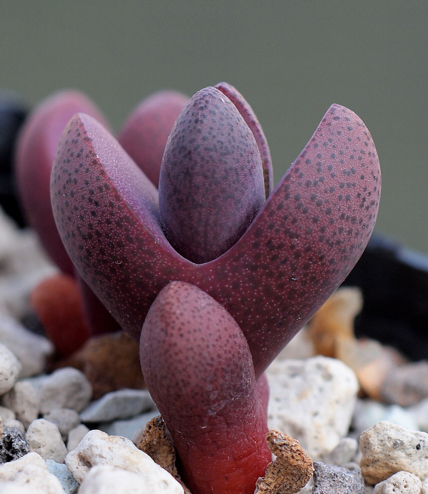
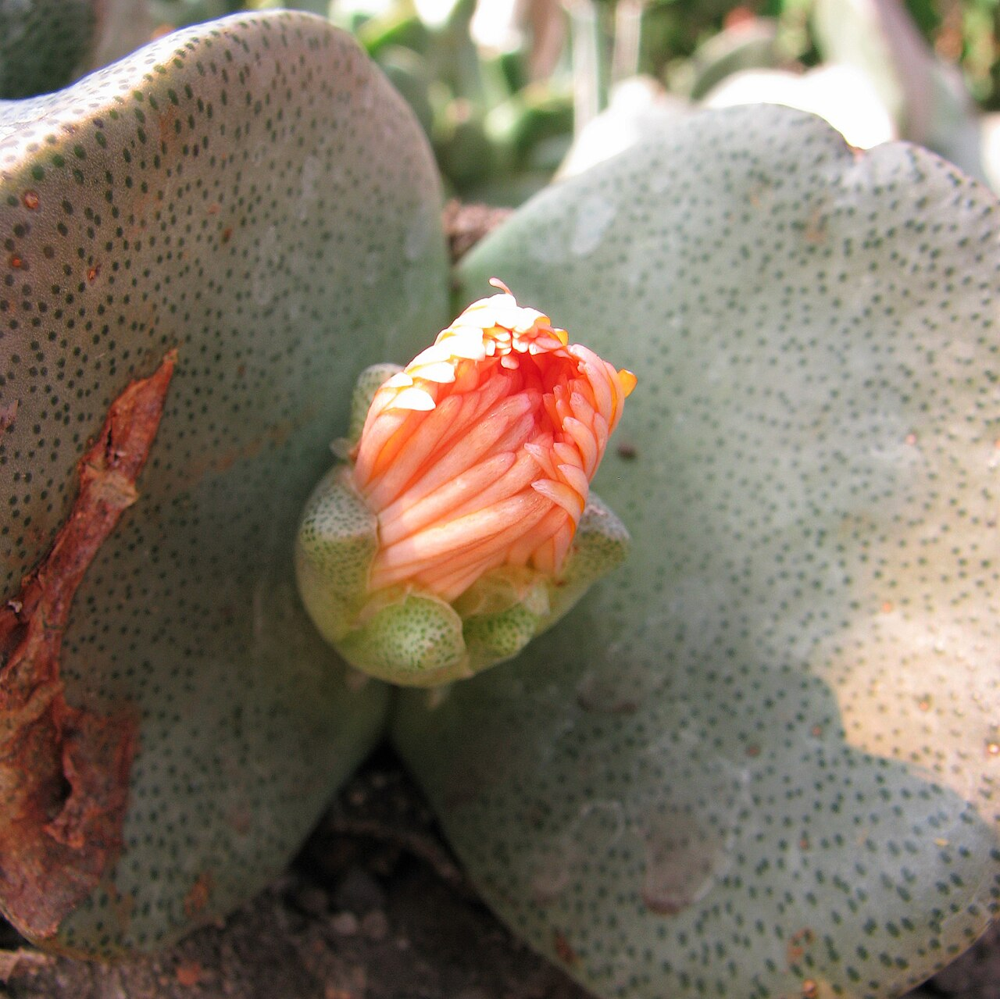
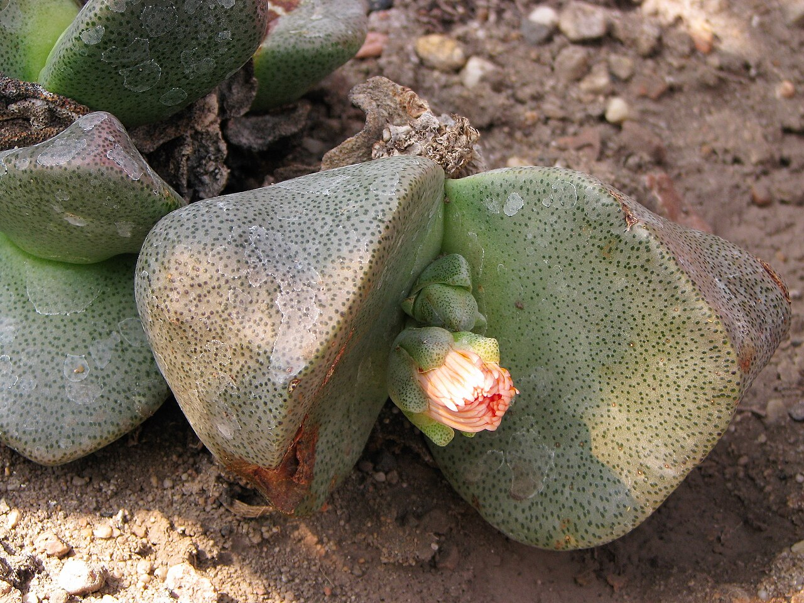
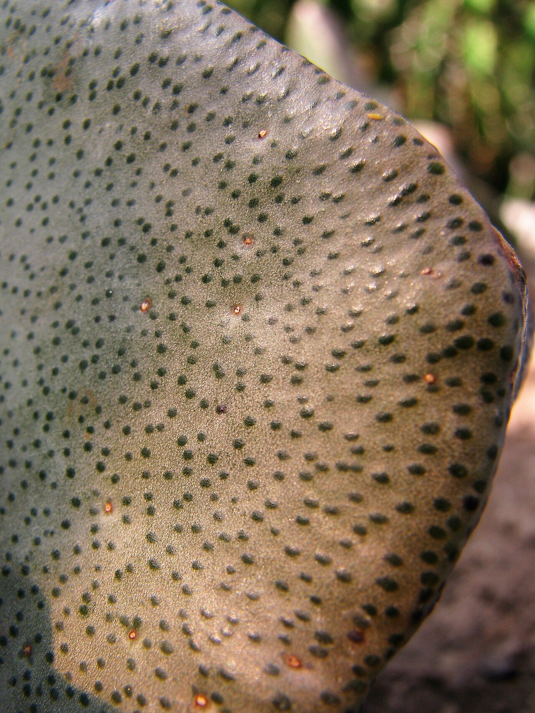
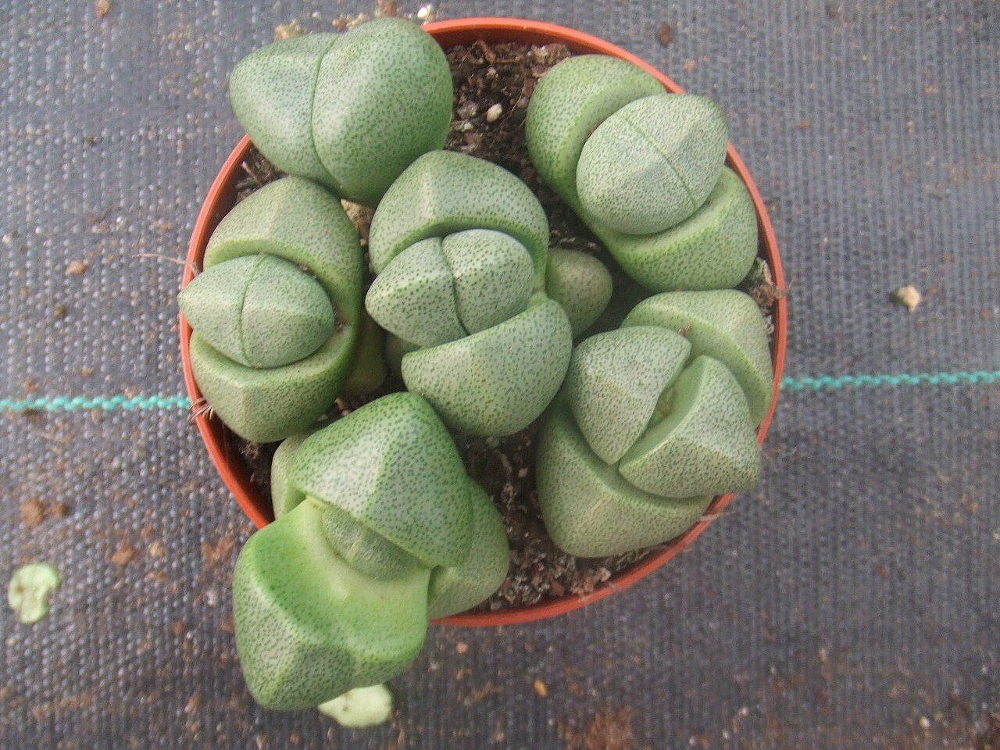
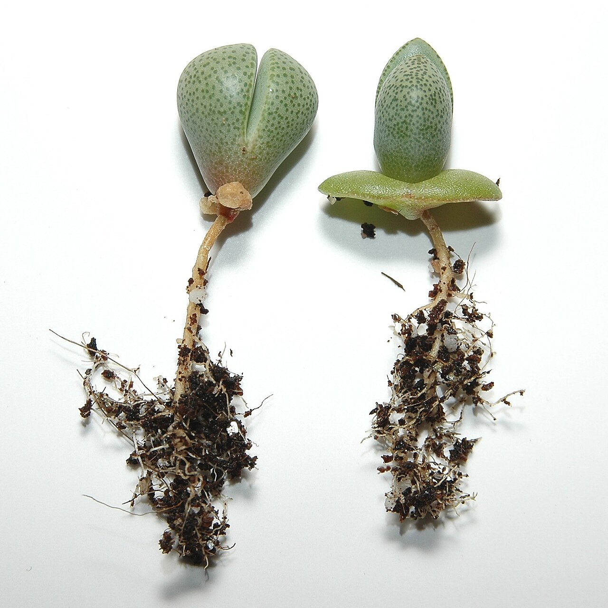
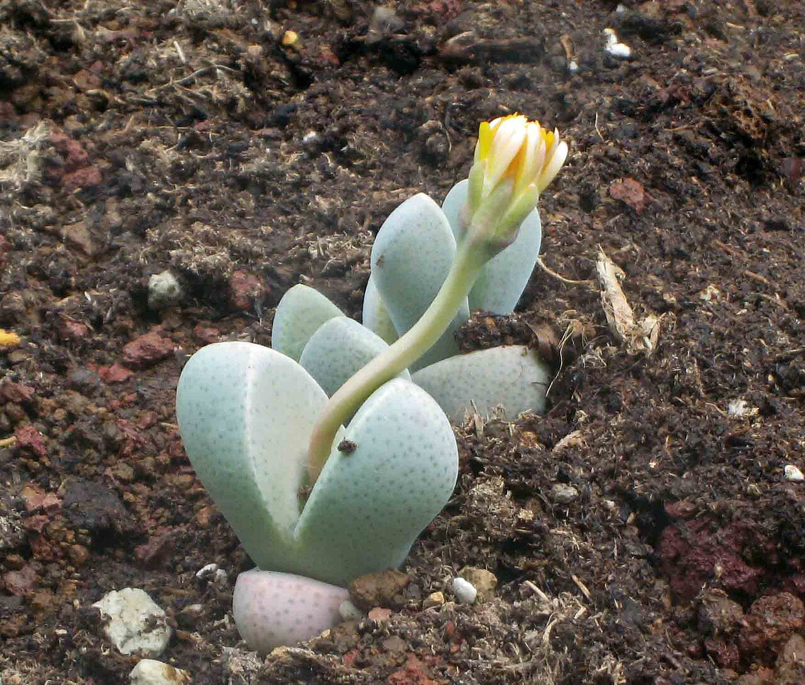
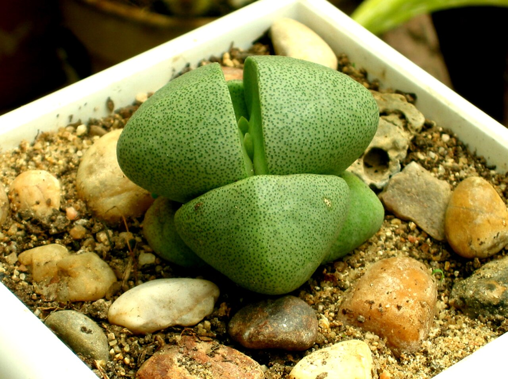

# Split rock photo archive

_Pleiospilos nelii_ - Succulent-16

Collection label ID: `#10`.

Species-reference photographs for the probable Pleiospilos nelii identification; exact species and cultivar are unconfirmed and the owned plant is not Royal Flush.

Collection research: [open the plant profile](../../../docs/plants/succulents/pleiospilos-nelii.md).

## Gallery

_habit_ - [Pleiospilos nelii 01.jpg](https://commons.wikimedia.org/wiki/File:Pleiospilos_nelii_01.jpg); Krzysztof Golik; [CC BY-SA 4.0](https://creativecommons.org/licenses/by-sa/4.0).

_habit_ - [Pleiospilos nelii 02.jpg](https://commons.wikimedia.org/wiki/File:Pleiospilos_nelii_02.jpg); Krzysztof Golik; [CC BY-SA 4.0](https://creativecommons.org/licenses/by-sa/4.0).

_habit_ - [Pleiospilos nelii 'Royal Flush'.jpg](https://commons.wikimedia.org/wiki/File:Pleiospilos_nelii_%27Royal_Flush%27.jpg); Dornenwolf; [CC BY 2.0](https://creativecommons.org/licenses/by/2.0).

_habit_ - [Pleiospilos nelii 2009-07-11 02.jpg](https://commons.wikimedia.org/wiki/File:Pleiospilos_nelii_2009-07-11_02.jpg); Agnieszka Kwiecień, Nova; [CC BY-SA 4.0](https://creativecommons.org/licenses/by-sa/4.0).

_habit_ - [Pleiospilos nelii 2009-07-11 01.jpg](https://commons.wikimedia.org/wiki/File:Pleiospilos_nelii_2009-07-11_01.jpg); Agnieszka Kwiecień, Nova; [CC BY-SA 4.0](https://creativecommons.org/licenses/by-sa/4.0).

_habit_ - [Pleiospilos nelii 2009-07-11 03.jpg](https://commons.wikimedia.org/wiki/File:Pleiospilos_nelii_2009-07-11_03.jpg); Agnieszka Kwiecień, Nova; [CC BY-SA 4.0](https://creativecommons.org/licenses/by-sa/4.0).

_habit_ - [Pleiospilos nelii.jpg](https://commons.wikimedia.org/wiki/File:Pleiospilos_nelii.jpg); No machine-readable author provided. Hans B.~commonswiki assumed (based on copyright claims).; [Public domain](https://creativecommons.org/publicdomain/zero/1.0/).

_habit_ - [Pleiospilos nelii1000.jpg](https://commons.wikimedia.org/wiki/File:Pleiospilos_nelii1000.jpg); Christer Johansson; [CC BY-SA 2.5](https://creativecommons.org/licenses/by-sa/2.5).

_habit_ - [帝玉 Pleiospilos nelii -上海植物園 Shanghai Botanical Garden- (17330187762).jpg](<https://commons.wikimedia.org/wiki/File:%E5%B8%9D%E7%8E%89_Pleiospilos_nelii_-%E4%B8%8A%E6%B5%B7%E6%A4%8D%E7%89%A9%E5%9C%92_Shanghai_Botanical_Garden-_(17330187762).jpg>); 阿橋 HQ; [CC BY-SA 2.0](https://creativecommons.org/licenses/by-sa/2.0).

_habit_ - [Pleiospilos nelii2.jpg](https://commons.wikimedia.org/wiki/File:Pleiospilos_nelii2.jpg); No machine-readable author provided. Cookie assumed (based on copyright claims).; [CC BY 2.5](https://creativecommons.org/licenses/by/2.5).

## File details

| File                                                       | Subject | Source                                                                                                                                                                                          | Creator                                                                                       | License                                                             |
| ---------------------------------------------------------- | ------- | ----------------------------------------------------------------------------------------------------------------------------------------------------------------------------------------------- | --------------------------------------------------------------------------------------------- | ------------------------------------------------------------------- |
| [commons-64968890-habit.jpg](./commons-64968890-habit.jpg) | habit   | [Wikimedia Commons](https://commons.wikimedia.org/wiki/File:Pleiospilos_nelii_01.jpg)                                                                                                           | Krzysztof Golik                                                                               | [CC BY-SA 4.0](https://creativecommons.org/licenses/by-sa/4.0)      |
| [commons-64968893-habit.jpg](./commons-64968893-habit.jpg) | habit   | [Wikimedia Commons](https://commons.wikimedia.org/wiki/File:Pleiospilos_nelii_02.jpg)                                                                                                           | Krzysztof Golik                                                                               | [CC BY-SA 4.0](https://creativecommons.org/licenses/by-sa/4.0)      |
| [commons-65499660-habit.jpg](./commons-65499660-habit.jpg) | habit   | [Wikimedia Commons](https://commons.wikimedia.org/wiki/File:Pleiospilos_nelii_%27Royal_Flush%27.jpg)                                                                                            | Dornenwolf                                                                                    | [CC BY 2.0](https://creativecommons.org/licenses/by/2.0)            |
| [commons-75389613-habit.jpg](./commons-75389613-habit.jpg) | habit   | [Wikimedia Commons](https://commons.wikimedia.org/wiki/File:Pleiospilos_nelii_2009-07-11_02.jpg)                                                                                                | Agnieszka Kwiecień, Nova                                                                      | [CC BY-SA 4.0](https://creativecommons.org/licenses/by-sa/4.0)      |
| [commons-75389614-habit.jpg](./commons-75389614-habit.jpg) | habit   | [Wikimedia Commons](https://commons.wikimedia.org/wiki/File:Pleiospilos_nelii_2009-07-11_01.jpg)                                                                                                | Agnieszka Kwiecień, Nova                                                                      | [CC BY-SA 4.0](https://creativecommons.org/licenses/by-sa/4.0)      |
| [commons-75389615-habit.jpg](./commons-75389615-habit.jpg) | habit   | [Wikimedia Commons](https://commons.wikimedia.org/wiki/File:Pleiospilos_nelii_2009-07-11_03.jpg)                                                                                                | Agnieszka Kwiecień, Nova                                                                      | [CC BY-SA 4.0](https://creativecommons.org/licenses/by-sa/4.0)      |
| [commons-762785-habit.jpg](./commons-762785-habit.jpg)     | habit   | [Wikimedia Commons](https://commons.wikimedia.org/wiki/File:Pleiospilos_nelii.jpg)                                                                                                              | No machine-readable author provided. Hans B.~commonswiki assumed (based on copyright claims). | [Public domain](https://creativecommons.org/publicdomain/zero/1.0/) |
| [commons-913813-habit.jpg](./commons-913813-habit.jpg)     | habit   | [Wikimedia Commons](https://commons.wikimedia.org/wiki/File:Pleiospilos_nelii1000.jpg)                                                                                                          | Christer Johansson                                                                            | [CC BY-SA 2.5](https://creativecommons.org/licenses/by-sa/2.5)      |
| [commons-91909871-habit.jpg](./commons-91909871-habit.jpg) | habit   | [Wikimedia Commons](<https://commons.wikimedia.org/wiki/File:%E5%B8%9D%E7%8E%89_Pleiospilos_nelii_-%E4%B8%8A%E6%B5%B7%E6%A4%8D%E7%89%A9%E5%9C%92_Shanghai_Botanical_Garden-_(17330187762).jpg>) | 阿橋 HQ                                                                                       | [CC BY-SA 2.0](https://creativecommons.org/licenses/by-sa/2.0)      |
| [commons-965551-habit.jpg](./commons-965551-habit.jpg)     | habit   | [Wikimedia Commons](https://commons.wikimedia.org/wiki/File:Pleiospilos_nelii2.jpg)                                                                                                             | No machine-readable author provided. Cookie assumed (based on copyright claims).              | [CC BY 2.5](https://creativecommons.org/licenses/by/2.5)            |

Metadata and SHA-256 hashes are also available in [the global manifest](../photo-manifest.json).
