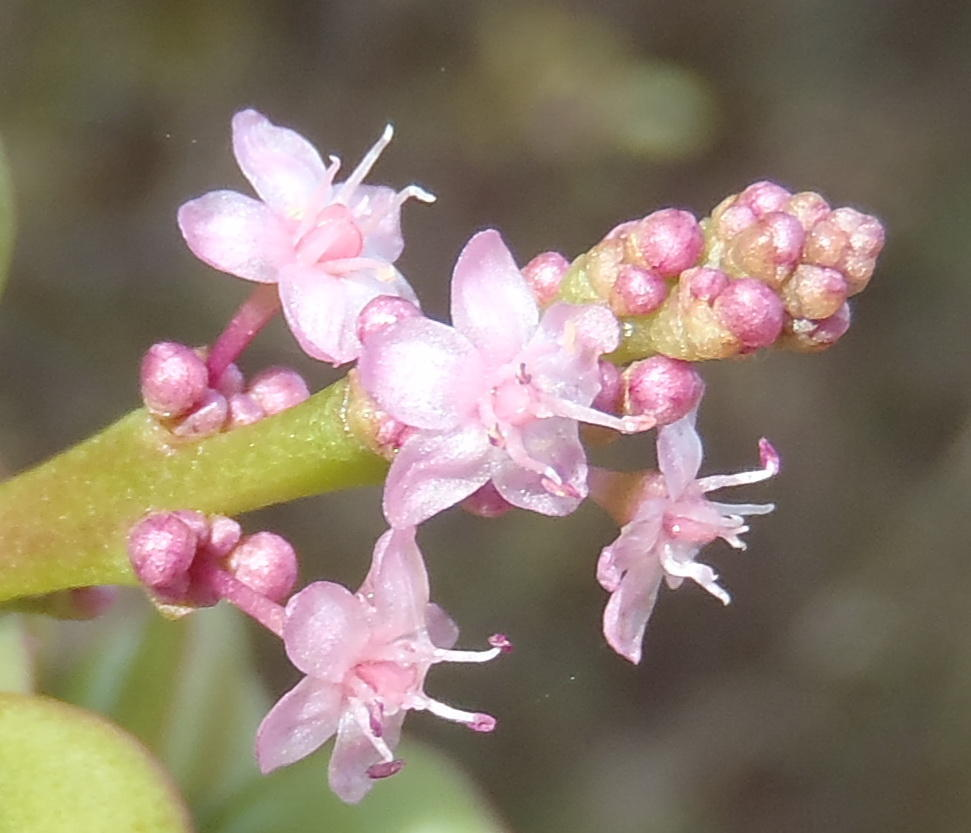
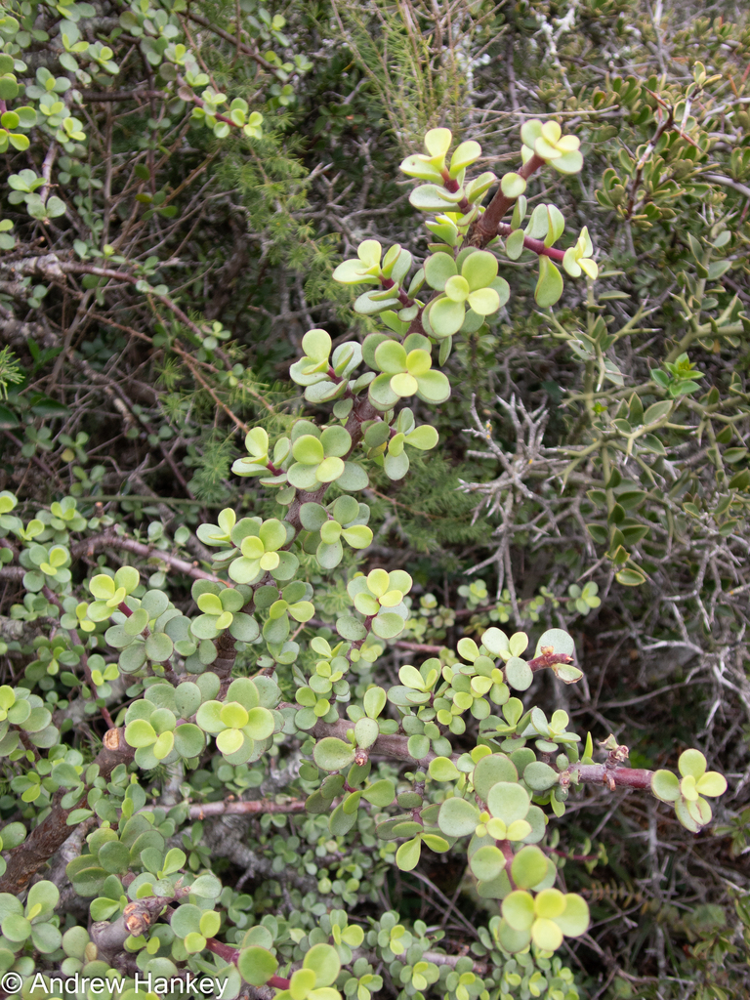
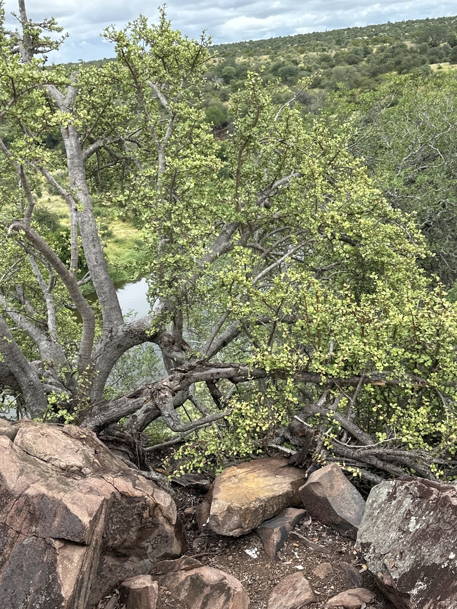
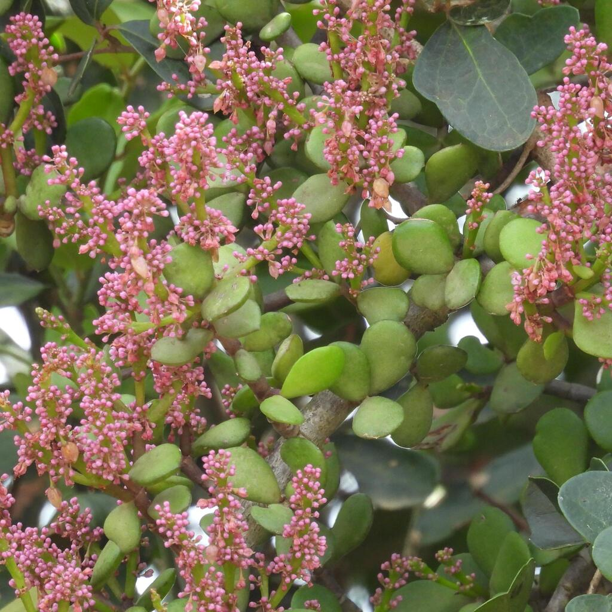
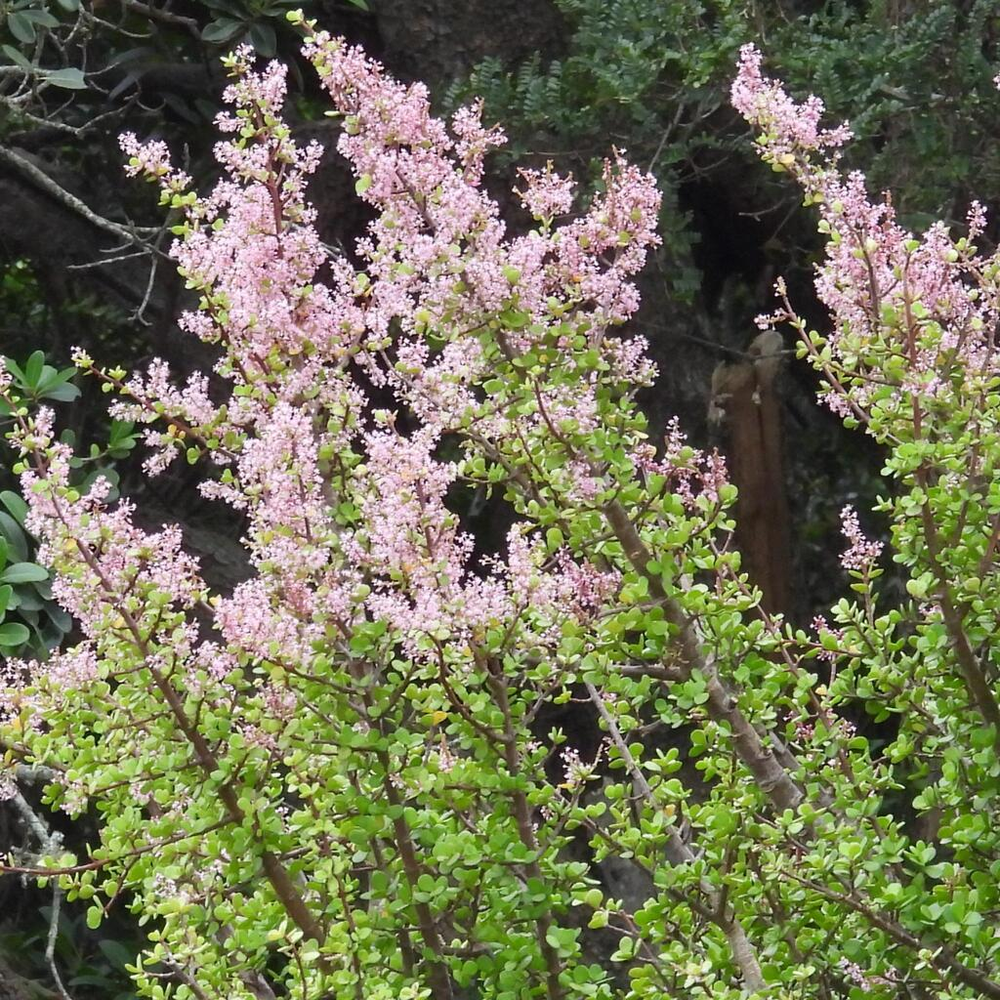
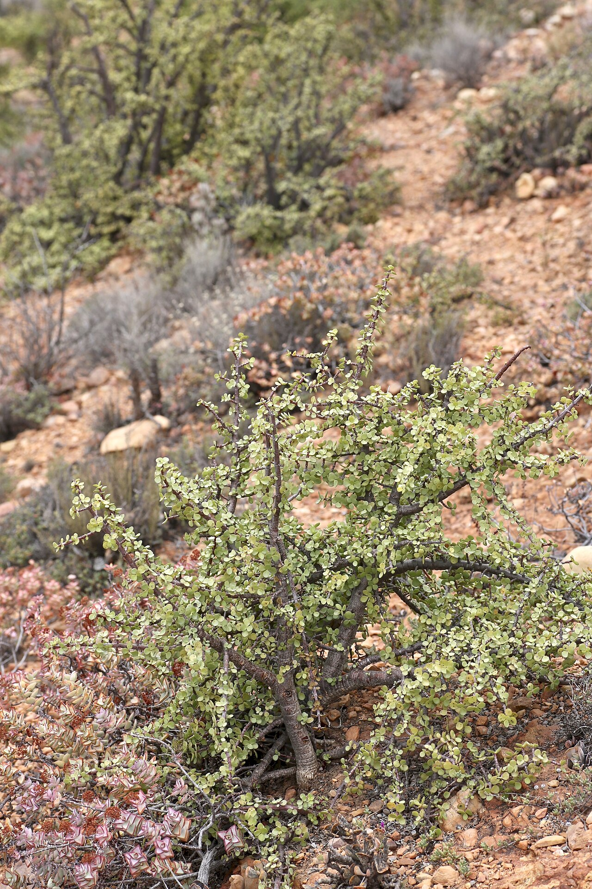
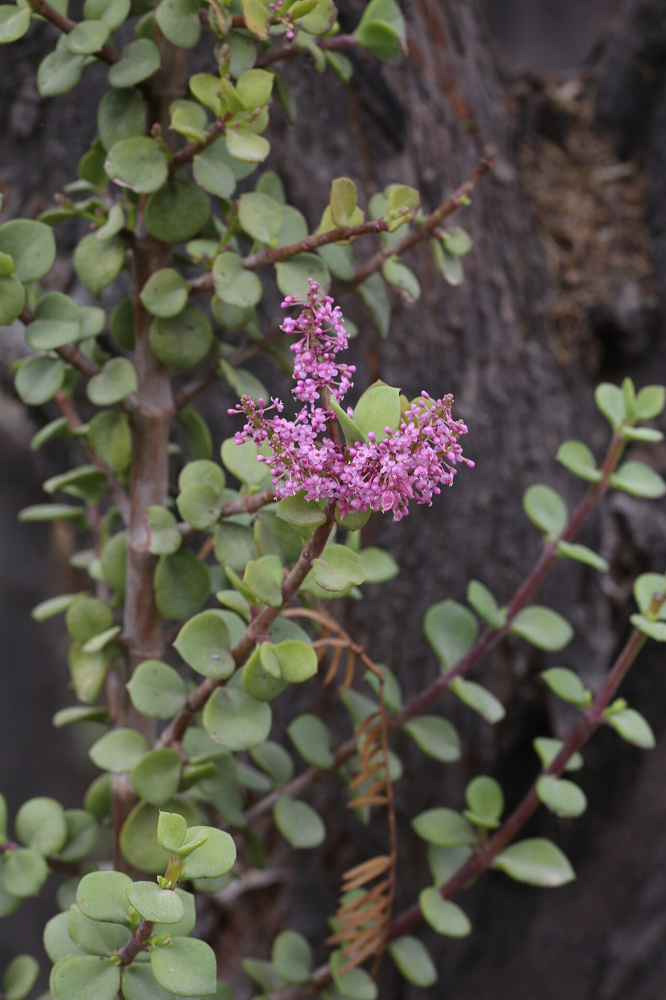
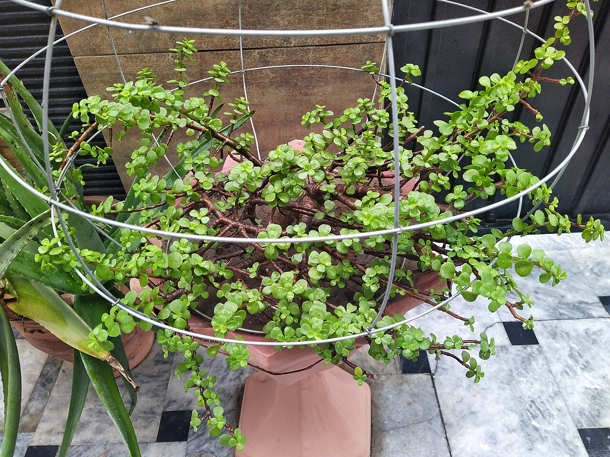
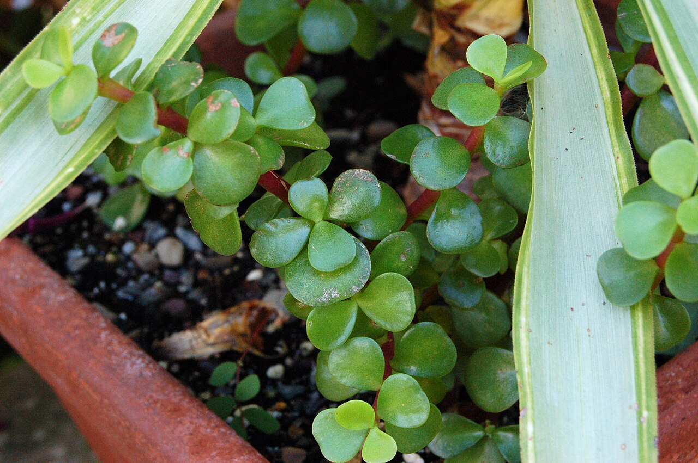
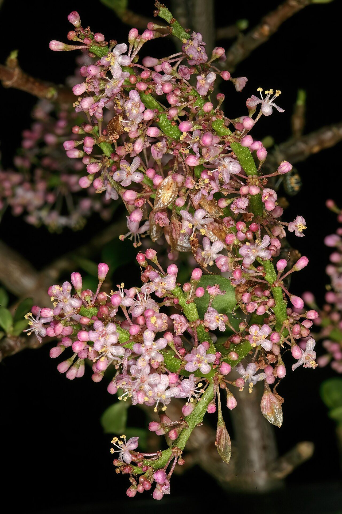

# Elephant bush photo archive

_Portulacaria afra_ - Succulent-02

Collection label ID: `#2; formerly C4-D4`.

Species-reference photographs; the yellow-green collection plant may be a golden cultivar.

Collection research: [open the plant profile](../../../docs/plants/succulents/portulacaria-afra.md).

## Gallery

_flower_ - [Portulacaria afra in habitat](https://www.inaturalist.org/observations/11066286); (c) Nicola van Berkel, some rights reserved (CC BY-SA); [CC BY SA](https://creativecommons.org/licenses/by/4.0/).

_habitat_ - [Portulacaria afra in habitat](https://www.inaturalist.org/observations/219070832); (c) Andrew Hankey, some rights reserved (CC BY-SA); [CC BY SA](https://creativecommons.org/licenses/by/4.0/).

_habitat_ - [Portulacaria afra in habitat](https://www.inaturalist.org/observations/267338553); (c) Rosario Douglas, some rights reserved (CC BY); [CC BY](https://creativecommons.org/licenses/by/4.0/).

_habitat_ - [Portulacaria afra in habitat](https://www.inaturalist.org/observations/342579633); (c) Henry de Lange, some rights reserved (CC BY); [CC BY](https://creativecommons.org/licenses/by/4.0/).

_habitat_ - [Portulacaria afra in habitat](https://www.inaturalist.org/observations/342711016); (c) Henry de Lange, some rights reserved (CC BY); [CC BY](https://creativecommons.org/licenses/by/4.0/).

_habitat_ - [Portulacaria afra (Didiereaceae) (26614280578).jpg](<https://commons.wikimedia.org/wiki/File:Portulacaria_afra_(Didiereaceae)_(26614280578).jpg>); Dr. Alexey Yakovlev; [CC BY-SA 2.0](https://creativecommons.org/licenses/by-sa/2.0).

_habitat_ - [Portulacaria afra (Didiereaceae) (25614360547).jpg](<https://commons.wikimedia.org/wiki/File:Portulacaria_afra_(Didiereaceae)_(25614360547).jpg>); Dr. Alexey Yakovlev; [CC BY-SA 2.0](https://creativecommons.org/licenses/by-sa/2.0).

_habit_ - [Portulacaria afra 1.jpg](https://commons.wikimedia.org/wiki/File:Portulacaria_afra_1.jpg); Tahir mq; [CC BY-SA 4.0](https://creativecommons.org/licenses/by-sa/4.0).

_detail_ - [Portulacaria afra 'Red Stem' Plant 3008px.jpg](https://commons.wikimedia.org/wiki/File:Portulacaria_afra_%27Red_Stem%27_Plant_3008px.jpg); Photo by and (c)2006 Derek Ramsey ( Ram-Man ). Location credit to the Chanticleer Garden.; [CC BY-SA 3.0](https://creativecommons.org/licenses/by-sa/3.0/).

_flower_ - [Portulacaria afra 1DS-II 2-5242.jpg](https://commons.wikimedia.org/wiki/File:Portulacaria_afra_1DS-II_2-5242.jpg); SAplants; [CC BY-SA 4.0](https://creativecommons.org/licenses/by-sa/4.0).

## File details

| File                                                                                         | Subject | Source                                                                                                            | Creator                                                                                   | License                                                         |
| -------------------------------------------------------------------------------------------- | ------- | ----------------------------------------------------------------------------------------------------------------- | ----------------------------------------------------------------------------------------- | --------------------------------------------------------------- |
| [inaturalist-11066286-15615094-habitat.jpg](./inaturalist-11066286-15615094-habitat.jpg)     | flower  | [iNaturalist](https://www.inaturalist.org/observations/11066286)                                                  | (c) Nicola van Berkel, some rights reserved (CC BY-SA)                                    | [CC BY SA](https://creativecommons.org/licenses/by/4.0/)        |
| [inaturalist-219070832-387718905-habitat.jpg](./inaturalist-219070832-387718905-habitat.jpg) | habitat | [iNaturalist](https://www.inaturalist.org/observations/219070832)                                                 | (c) Andrew Hankey, some rights reserved (CC BY-SA)                                        | [CC BY SA](https://creativecommons.org/licenses/by/4.0/)        |
| [inaturalist-267338553-480420123-habitat.jpg](./inaturalist-267338553-480420123-habitat.jpg) | habitat | [iNaturalist](https://www.inaturalist.org/observations/267338553)                                                 | (c) Rosario Douglas, some rights reserved (CC BY)                                         | [CC BY](https://creativecommons.org/licenses/by/4.0/)           |
| [inaturalist-342579633-623887112-habitat.jpg](./inaturalist-342579633-623887112-habitat.jpg) | habitat | [iNaturalist](https://www.inaturalist.org/observations/342579633)                                                 | (c) Henry de Lange, some rights reserved (CC BY)                                          | [CC BY](https://creativecommons.org/licenses/by/4.0/)           |
| [inaturalist-342711016-624135273-habitat.jpg](./inaturalist-342711016-624135273-habitat.jpg) | habitat | [iNaturalist](https://www.inaturalist.org/observations/342711016)                                                 | (c) Henry de Lange, some rights reserved (CC BY)                                          | [CC BY](https://creativecommons.org/licenses/by/4.0/)           |
| [commons-106749977-habitat.jpg](./commons-106749977-habitat.jpg)                             | habitat | [Wikimedia Commons](<https://commons.wikimedia.org/wiki/File:Portulacaria_afra_(Didiereaceae)_(26614280578).jpg>) | Dr. Alexey Yakovlev                                                                       | [CC BY-SA 2.0](https://creativecommons.org/licenses/by-sa/2.0)  |
| [commons-106749984-habitat.jpg](./commons-106749984-habitat.jpg)                             | habitat | [Wikimedia Commons](<https://commons.wikimedia.org/wiki/File:Portulacaria_afra_(Didiereaceae)_(25614360547).jpg>) | Dr. Alexey Yakovlev                                                                       | [CC BY-SA 2.0](https://creativecommons.org/licenses/by-sa/2.0)  |
| [commons-107974336-habit.jpg](./commons-107974336-habit.jpg)                                 | habit   | [Wikimedia Commons](https://commons.wikimedia.org/wiki/File:Portulacaria_afra_1.jpg)                              | Tahir mq                                                                                  | [CC BY-SA 4.0](https://creativecommons.org/licenses/by-sa/4.0)  |
| [commons-1190786-detail.jpg](./commons-1190786-detail.jpg)                                   | detail  | [Wikimedia Commons](https://commons.wikimedia.org/wiki/File:Portulacaria_afra_%27Red_Stem%27_Plant_3008px.jpg)    | Photo by and (c)2006 Derek Ramsey ( Ram-Man ). Location credit to the Chanticleer Garden. | [CC BY-SA 3.0](https://creativecommons.org/licenses/by-sa/3.0/) |
| [commons-156972225-flower.jpg](./commons-156972225-flower.jpg)                               | flower  | [Wikimedia Commons](https://commons.wikimedia.org/wiki/File:Portulacaria_afra_1DS-II_2-5242.jpg)                  | SAplants                                                                                  | [CC BY-SA 4.0](https://creativecommons.org/licenses/by-sa/4.0)  |

Metadata and SHA-256 hashes are also available in [the global manifest](../photo-manifest.json).
