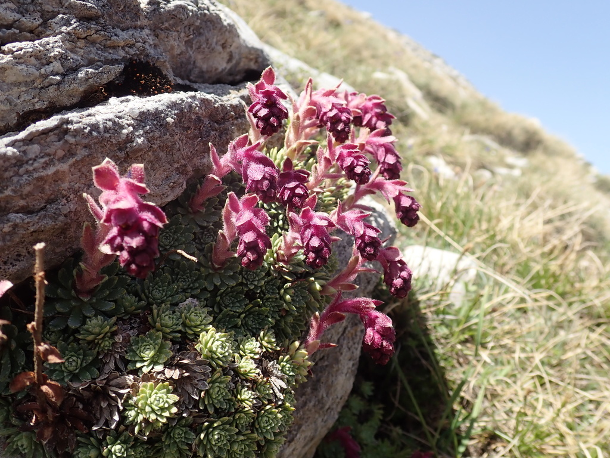
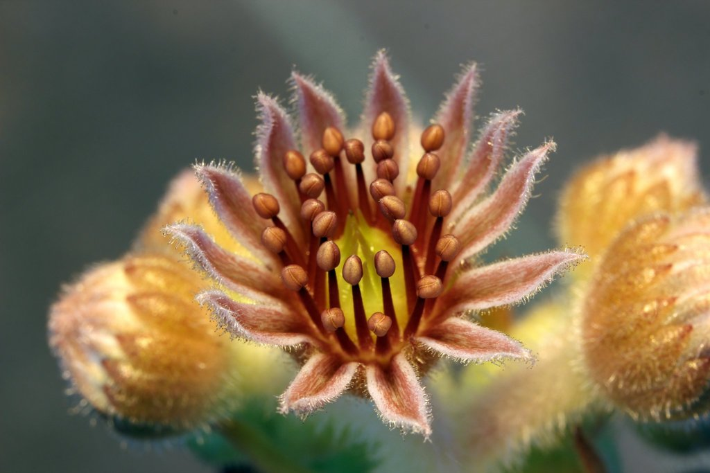
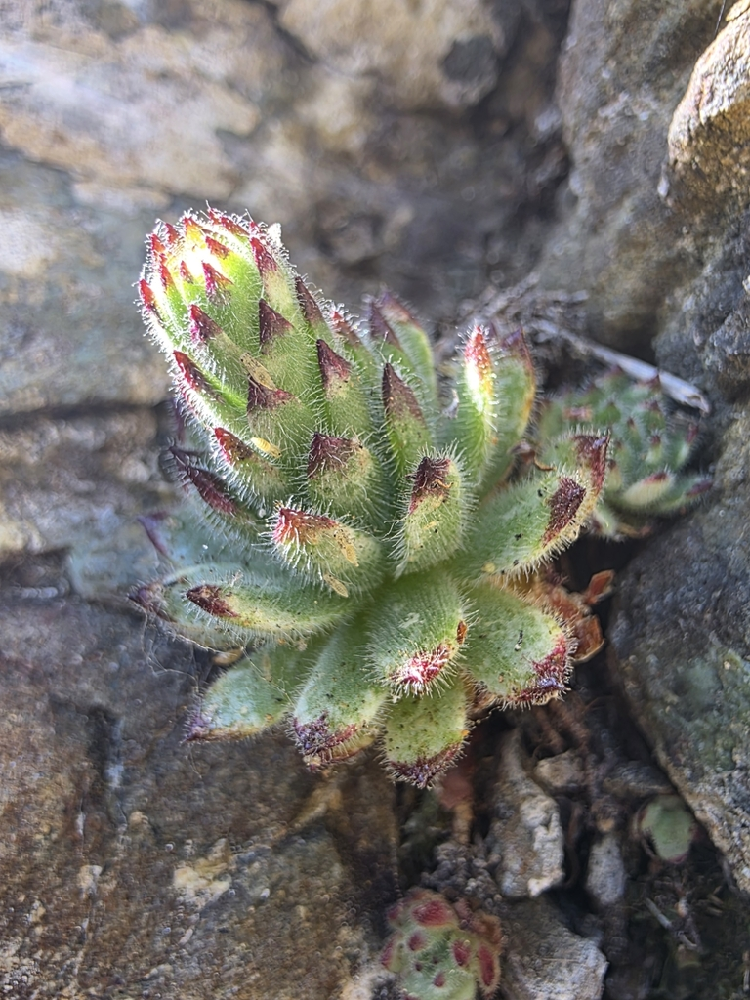
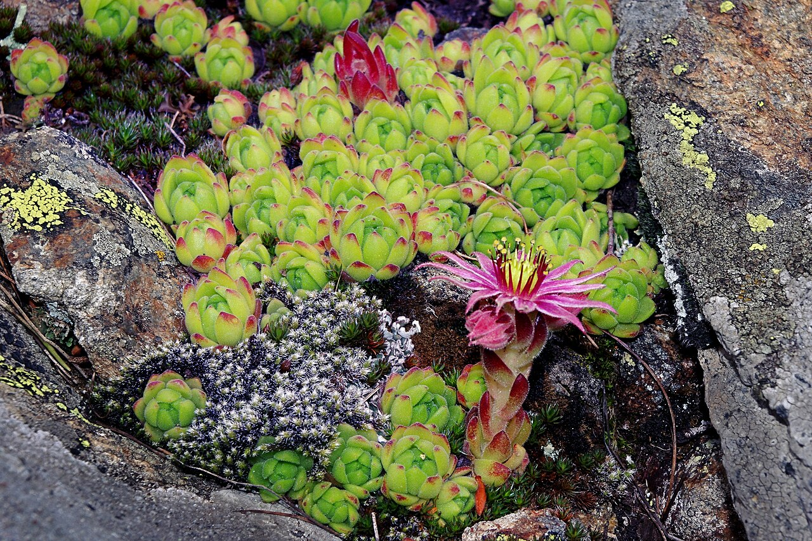
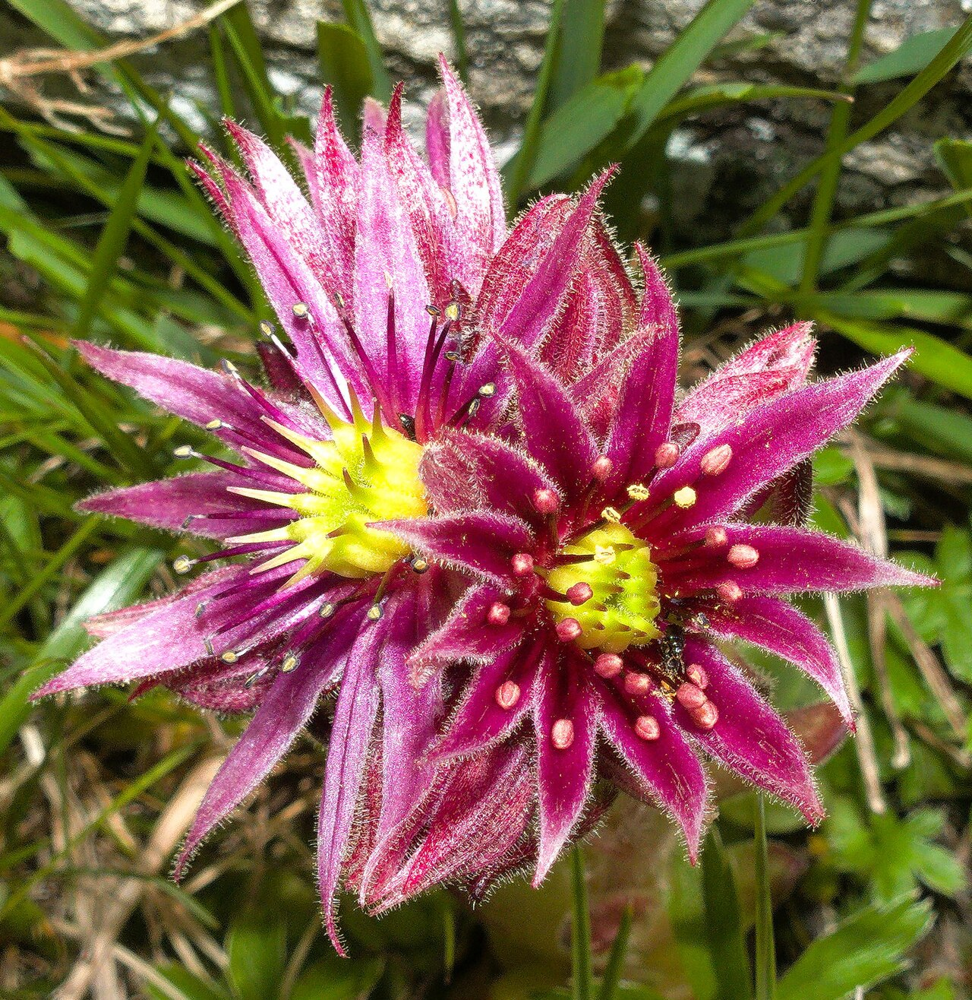
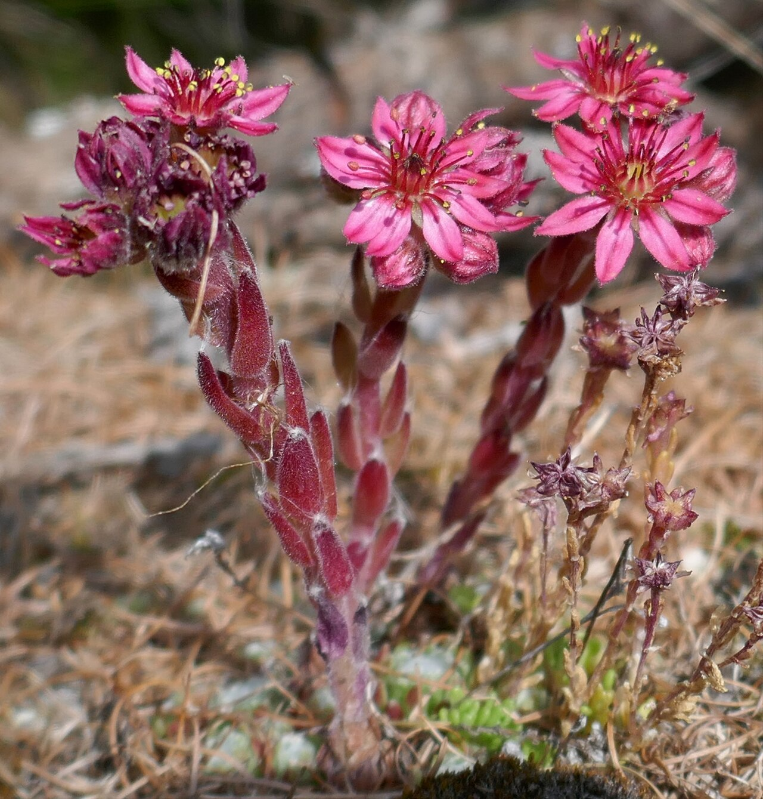

# Coconut Crystal hens and chicks photo archive

_Sempervivum Coconut Crystal_ - Succulent-08

Collection label ID: `H3`.

Genus-reference photographs; no reusable image is assumed to show the exact Colorockz Coconut Crystal cultivar.

Collection research: [open the plant profile](../../../docs/plants/succulents/sempervivum-coconut-crystal.md).

## Gallery

_habitat_ - [Sempervivum reference observation](https://www.inaturalist.org/observations/119557485); no rights reserved; [CC0](https://creativecommons.org/publicdomain/zero/1.0/).

_habitat_ - [Sempervivum reference observation](https://www.inaturalist.org/observations/17543723); (c) Armin G. Fabritzek, some rights reserved (CC BY); [CC BY](https://creativecommons.org/licenses/by/4.0/).

_habitat_ - [Sempervivum reference observation](https://www.inaturalist.org/observations/294376379); (c) Jacek Pietruszewski, some rights reserved (CC BY); [CC BY](https://creativecommons.org/licenses/by/4.0/).

_habit_ - [Alpy, imgp1440 (2014-08).jpg](<https://commons.wikimedia.org/wiki/File:Alpy,_imgp1440_(2014-08).jpg>); Jiří Bubeníček; [CC BY-SA 4.0](https://creativecommons.org/licenses/by-sa/4.0).

_flower_ - [Houseleek.jpg](https://commons.wikimedia.org/wiki/File:Houseleek.jpg); Tiia Monto; [CC BY-SA 3.0](https://creativecommons.org/licenses/by-sa/3.0).

_habitat_ - [Houseleek 3.jpg](https://commons.wikimedia.org/wiki/File:Houseleek_3.jpg); Tiia Monto; [CC BY-SA 4.0](https://creativecommons.org/licenses/by-sa/4.0).

## File details

| File                                                                                         | Subject | Source                                                                                      | Creator                                               | License                                                        |
| -------------------------------------------------------------------------------------------- | ------- | ------------------------------------------------------------------------------------------- | ----------------------------------------------------- | -------------------------------------------------------------- |
| [inaturalist-119557485-202123523-habitat.jpg](./inaturalist-119557485-202123523-habitat.jpg) | habitat | [iNaturalist](https://www.inaturalist.org/observations/119557485)                           | no rights reserved                                    | [CC0](https://creativecommons.org/publicdomain/zero/1.0/)      |
| [inaturalist-17543723-26707624-habitat.jpg](./inaturalist-17543723-26707624-habitat.jpg)     | habitat | [iNaturalist](https://www.inaturalist.org/observations/17543723)                            | (c) Armin G. Fabritzek, some rights reserved (CC BY)  | [CC BY](https://creativecommons.org/licenses/by/4.0/)          |
| [inaturalist-294376379-529856786-habitat.jpg](./inaturalist-294376379-529856786-habitat.jpg) | habitat | [iNaturalist](https://www.inaturalist.org/observations/294376379)                           | (c) Jacek Pietruszewski, some rights reserved (CC BY) | [CC BY](https://creativecommons.org/licenses/by/4.0/)          |
| [commons-102324635-habit.jpg](./commons-102324635-habit.jpg)                                 | habit   | [Wikimedia Commons](<https://commons.wikimedia.org/wiki/File:Alpy,_imgp1440_(2014-08).jpg>) | Jiří Bubeníček                                        | [CC BY-SA 4.0](https://creativecommons.org/licenses/by-sa/4.0) |
| [commons-109291765-flower.jpg](./commons-109291765-flower.jpg)                               | flower  | [Wikimedia Commons](https://commons.wikimedia.org/wiki/File:Houseleek.jpg)                  | Tiia Monto                                            | [CC BY-SA 3.0](https://creativecommons.org/licenses/by-sa/3.0) |
| [commons-121658821-habitat.jpg](./commons-121658821-habitat.jpg)                             | habitat | [Wikimedia Commons](https://commons.wikimedia.org/wiki/File:Houseleek_3.jpg)                | Tiia Monto                                            | [CC BY-SA 4.0](https://creativecommons.org/licenses/by-sa/4.0) |

Metadata and SHA-256 hashes are also available in [the global manifest](../photo-manifest.json).
