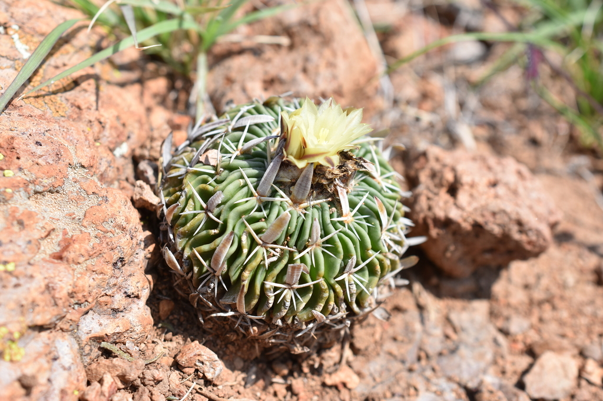
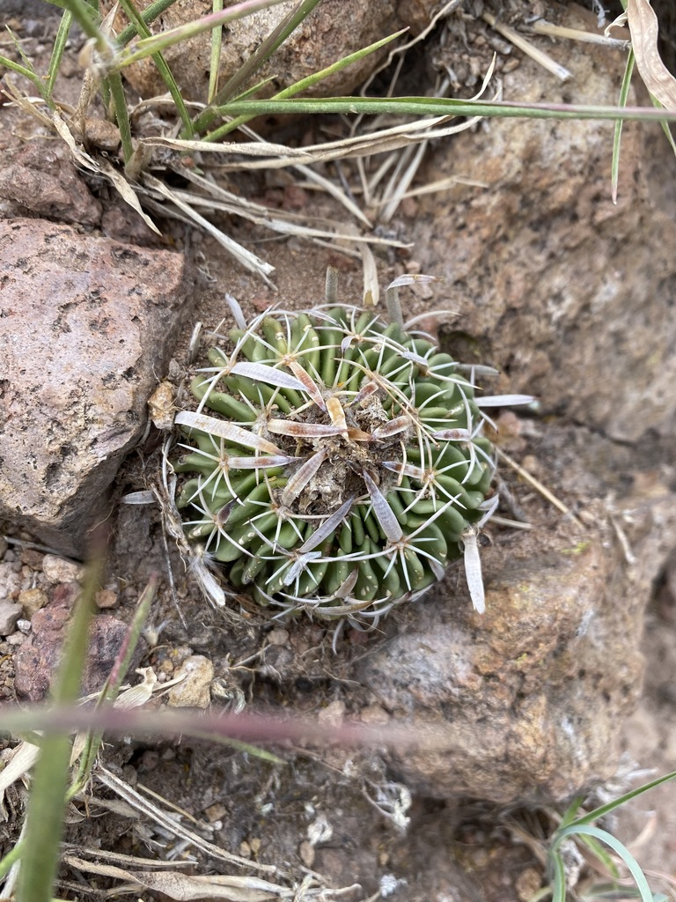
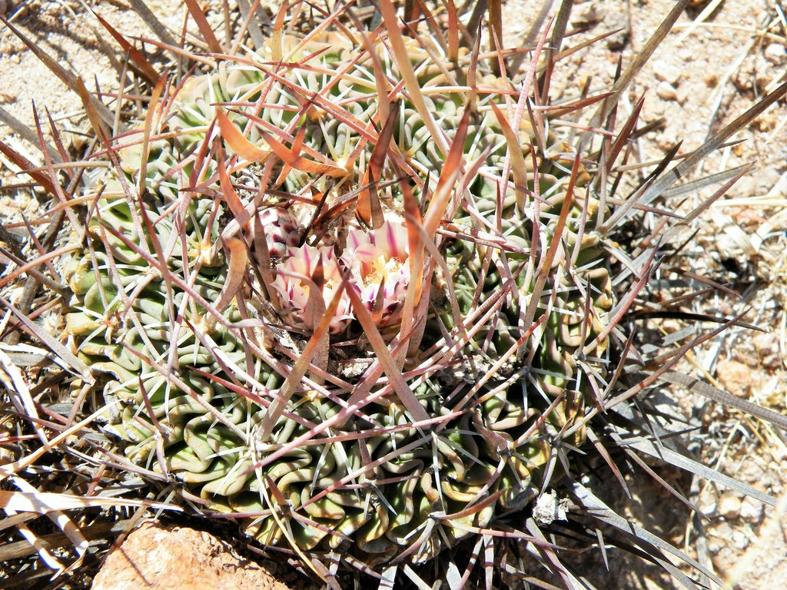
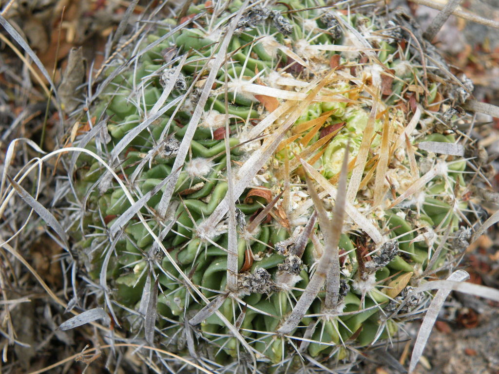
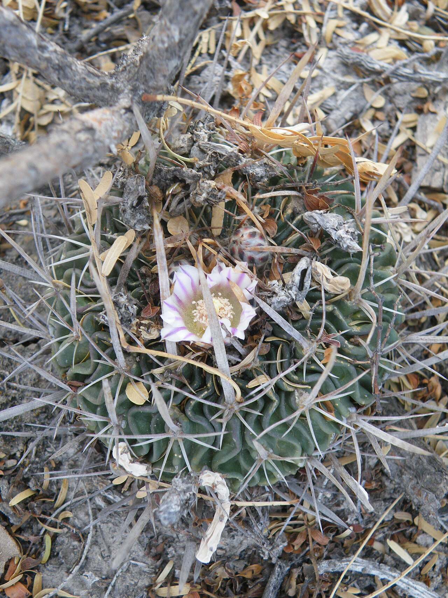
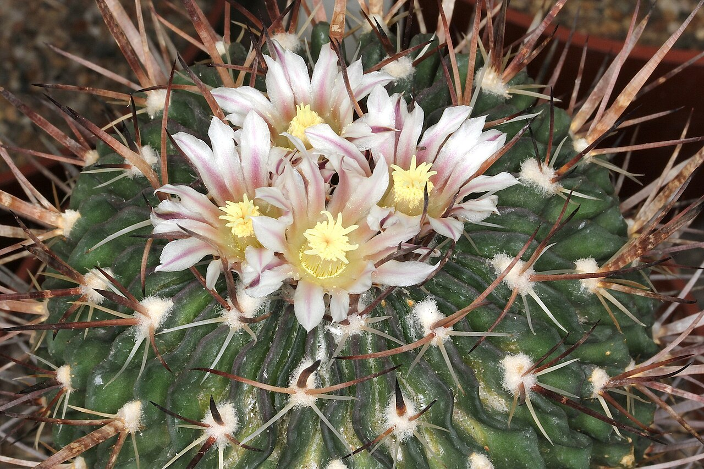
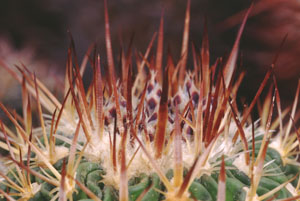
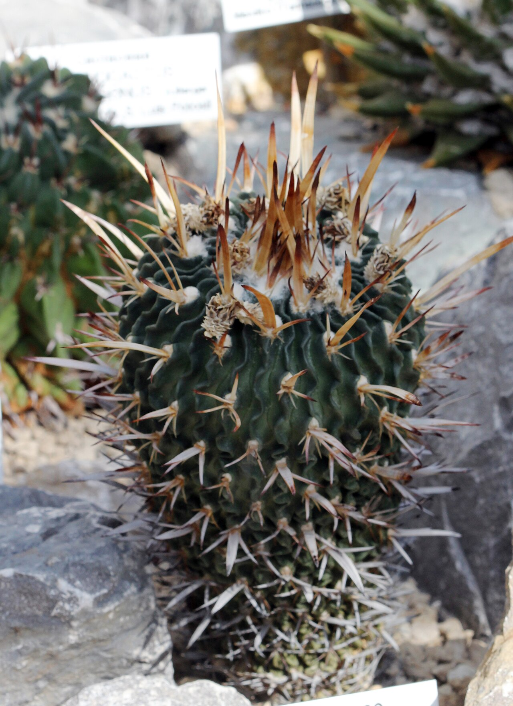
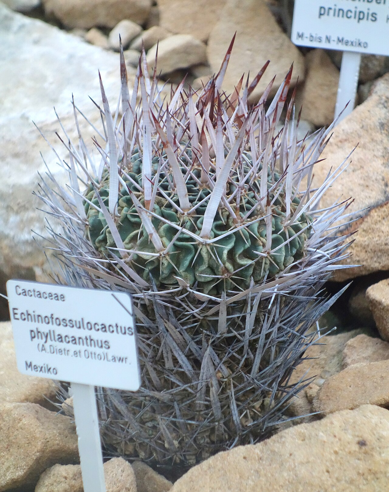
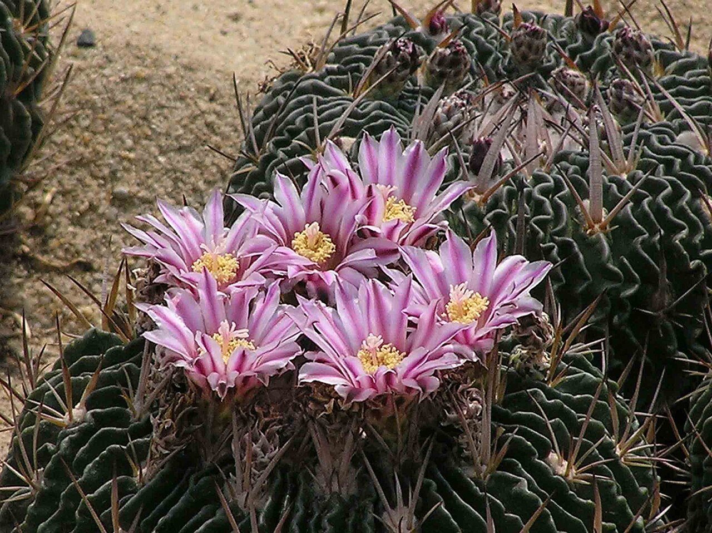

# Grass-blade cactus photo archive

_Stenocactus phyllacanthus_ - Starter-02

Collection label ID: `B1`.

Species-reference photographs.

Collection research: [open the plant profile](../../../docs/plants/starter/stenocactus-phyllacanthus.md).

## Gallery

_habitat_ - [Stenocactus phyllacanthus in habitat](https://www.inaturalist.org/observations/56080998); (c) P Gonzalez Zamora, some rights reserved (CC BY); [CC BY](https://creativecommons.org/licenses/by/4.0/).

_habitat_ - [Stenocactus phyllacanthus in habitat](https://www.inaturalist.org/observations/56233783); (c) P Gonzalez Zamora, some rights reserved (CC BY); [CC BY](https://creativecommons.org/licenses/by/4.0/).

_habitat_ - [Stenocactus phyllacanthus in habitat](https://www.inaturalist.org/observations/92808314); (c) amantedarmanin, some rights reserved (CC BY); [CC BY](https://creativecommons.org/licenses/by/4.0/).

_habitat_ - [Stenocactus phyllacanthus in habitat](https://www.inaturalist.org/observations/93389100); (c) amantedarmanin, some rights reserved (CC BY); [CC BY](https://creativecommons.org/licenses/by/4.0/).

_habit_ - [Stenocactus phyllacanthus.jpg](https://commons.wikimedia.org/wiki/File:Stenocactus_phyllacanthus.jpg); Amante Darmanin from Malta; [CC BY 2.0](https://creativecommons.org/licenses/by/2.0).

_habit_ - [Stenocactus phyllacanthus pm.JPG](https://commons.wikimedia.org/wiki/File:Stenocactus_phyllacanthus_pm.JPG); Peter A. Mansfeld; [CC BY 3.0](https://creativecommons.org/licenses/by/3.0).

_habit_ - [Stenocactus phylacanthus 1.jpg](https://commons.wikimedia.org/wiki/File:Stenocactus_phylacanthus_1.jpg); Helga Januschkowetz; [CC BY-SA 3.0 de](https://creativecommons.org/licenses/by-sa/3.0/de/deed.en).

_habit_ - [Stenocactus phyllacanthus Prague 2012 1.jpg](https://commons.wikimedia.org/wiki/File:Stenocactus_phyllacanthus_Prague_2012_1.jpg); Karelj; [CC BY-SA 3.0](https://creativecommons.org/licenses/by-sa/3.0).

_habit_ - [Echinofossulocactus phyllacanthus - Botanischer Garten, Dresden, Germany - DSC08861.JPG](https://commons.wikimedia.org/wiki/File:Echinofossulocactus_phyllacanthus_-_Botanischer_Garten,_Dresden,_Germany_-_DSC08861.JPG); Daderot; [CC0](http://creativecommons.org/publicdomain/zero/1.0/deed.en).

_flower_ - [仙人掌-多棱球屬 Stenocactus phyllacanthus -香港花展 Hong Kong Flower Show- (9166018652).jpg](<https://commons.wikimedia.org/wiki/File:%E4%BB%99%E4%BA%BA%E6%8E%8C-%E5%A4%9A%E6%A3%B1%E7%90%83%E5%B1%AC_Stenocactus_phyllacanthus_-%E9%A6%99%E6%B8%AF%E8%8A%B1%E5%B1%95_Hong_Kong_Flower_Show-_(9166018652).jpg>); 阿橋 HQ; [CC BY-SA 2.0](https://creativecommons.org/licenses/by-sa/2.0).

## File details

| File                                                                                       | Subject | Source                                                                                                                                                                                                                                  | Creator                                             | License                                                                      |
| ------------------------------------------------------------------------------------------ | ------- | --------------------------------------------------------------------------------------------------------------------------------------------------------------------------------------------------------------------------------------- | --------------------------------------------------- | ---------------------------------------------------------------------------- |
| [inaturalist-56080998-89340180-habitat.jpg](./inaturalist-56080998-89340180-habitat.jpg)   | habitat | [iNaturalist](https://www.inaturalist.org/observations/56080998)                                                                                                                                                                        | (c) P Gonzalez Zamora, some rights reserved (CC BY) | [CC BY](https://creativecommons.org/licenses/by/4.0/)                        |
| [inaturalist-56233783-89587856-habitat.jpg](./inaturalist-56233783-89587856-habitat.jpg)   | habitat | [iNaturalist](https://www.inaturalist.org/observations/56233783)                                                                                                                                                                        | (c) P Gonzalez Zamora, some rights reserved (CC BY) | [CC BY](https://creativecommons.org/licenses/by/4.0/)                        |
| [inaturalist-92808314-153709861-habitat.jpg](./inaturalist-92808314-153709861-habitat.jpg) | habitat | [iNaturalist](https://www.inaturalist.org/observations/92808314)                                                                                                                                                                        | (c) amantedarmanin, some rights reserved (CC BY)    | [CC BY](https://creativecommons.org/licenses/by/4.0/)                        |
| [inaturalist-93389100-154755792-habitat.jpg](./inaturalist-93389100-154755792-habitat.jpg) | habitat | [iNaturalist](https://www.inaturalist.org/observations/93389100)                                                                                                                                                                        | (c) amantedarmanin, some rights reserved (CC BY)    | [CC BY](https://creativecommons.org/licenses/by/4.0/)                        |
| [commons-16087960-habit.jpg](./commons-16087960-habit.jpg)                                 | habit   | [Wikimedia Commons](https://commons.wikimedia.org/wiki/File:Stenocactus_phyllacanthus.jpg)                                                                                                                                              | Amante Darmanin from Malta                          | [CC BY 2.0](https://creativecommons.org/licenses/by/2.0)                     |
| [commons-19234591-habit.jpg](./commons-19234591-habit.jpg)                                 | habit   | [Wikimedia Commons](https://commons.wikimedia.org/wiki/File:Stenocactus_phyllacanthus_pm.JPG)                                                                                                                                           | Peter A. Mansfeld                                   | [CC BY 3.0](https://creativecommons.org/licenses/by/3.0)                     |
| [commons-22768698-habit.jpg](./commons-22768698-habit.jpg)                                 | habit   | [Wikimedia Commons](https://commons.wikimedia.org/wiki/File:Stenocactus_phylacanthus_1.jpg)                                                                                                                                             | Helga Januschkowetz                                 | [CC BY-SA 3.0 de](https://creativecommons.org/licenses/by-sa/3.0/de/deed.en) |
| [commons-24583482-habit.jpg](./commons-24583482-habit.jpg)                                 | habit   | [Wikimedia Commons](https://commons.wikimedia.org/wiki/File:Stenocactus_phyllacanthus_Prague_2012_1.jpg)                                                                                                                                | Karelj                                              | [CC BY-SA 3.0](https://creativecommons.org/licenses/by-sa/3.0)               |
| [commons-38403818-habit.jpg](./commons-38403818-habit.jpg)                                 | habit   | [Wikimedia Commons](https://commons.wikimedia.org/wiki/File:Echinofossulocactus_phyllacanthus_-_Botanischer_Garten,_Dresden,_Germany_-_DSC08861.JPG)                                                                                    | Daderot                                             | [CC0](http://creativecommons.org/publicdomain/zero/1.0/deed.en)              |
| [commons-91907979-flower.jpg](./commons-91907979-flower.jpg)                               | flower  | [Wikimedia Commons](<https://commons.wikimedia.org/wiki/File:%E4%BB%99%E4%BA%BA%E6%8E%8C-%E5%A4%9A%E6%A3%B1%E7%90%83%E5%B1%AC_Stenocactus_phyllacanthus_-%E9%A6%99%E6%B8%AF%E8%8A%B1%E5%B1%95_Hong_Kong_Flower_Show-_(9166018652).jpg>) | 阿橋 HQ                                             | [CC BY-SA 2.0](https://creativecommons.org/licenses/by-sa/2.0)               |

Metadata and SHA-256 hashes are also available in [the global manifest](../photo-manifest.json).
