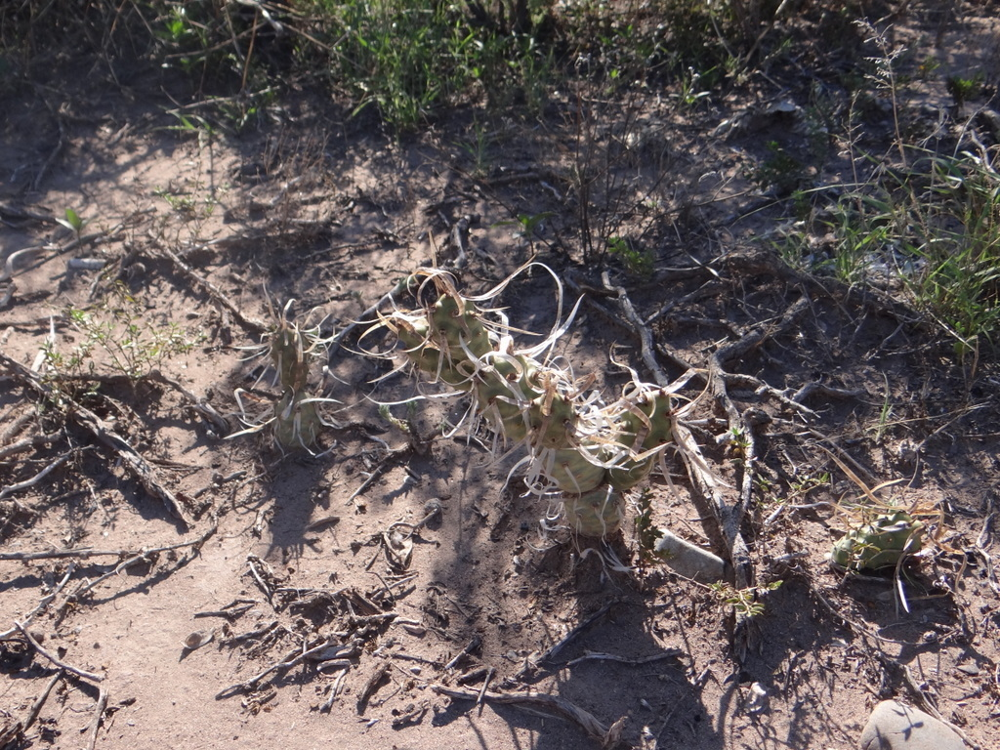
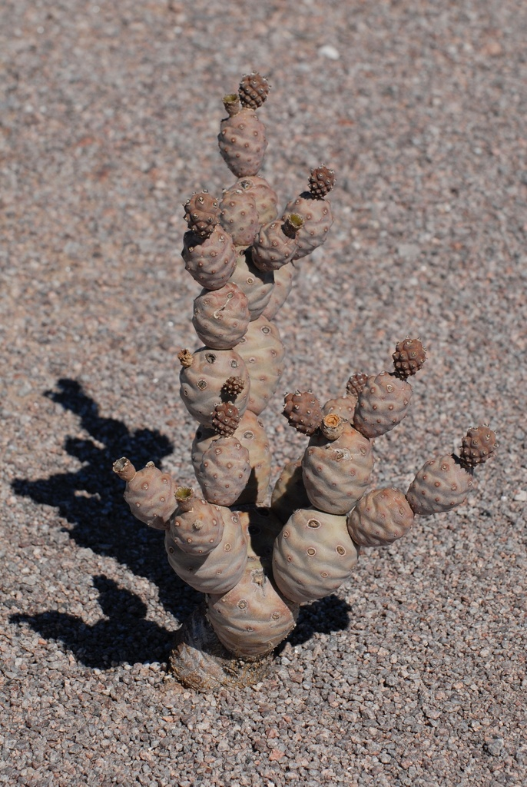
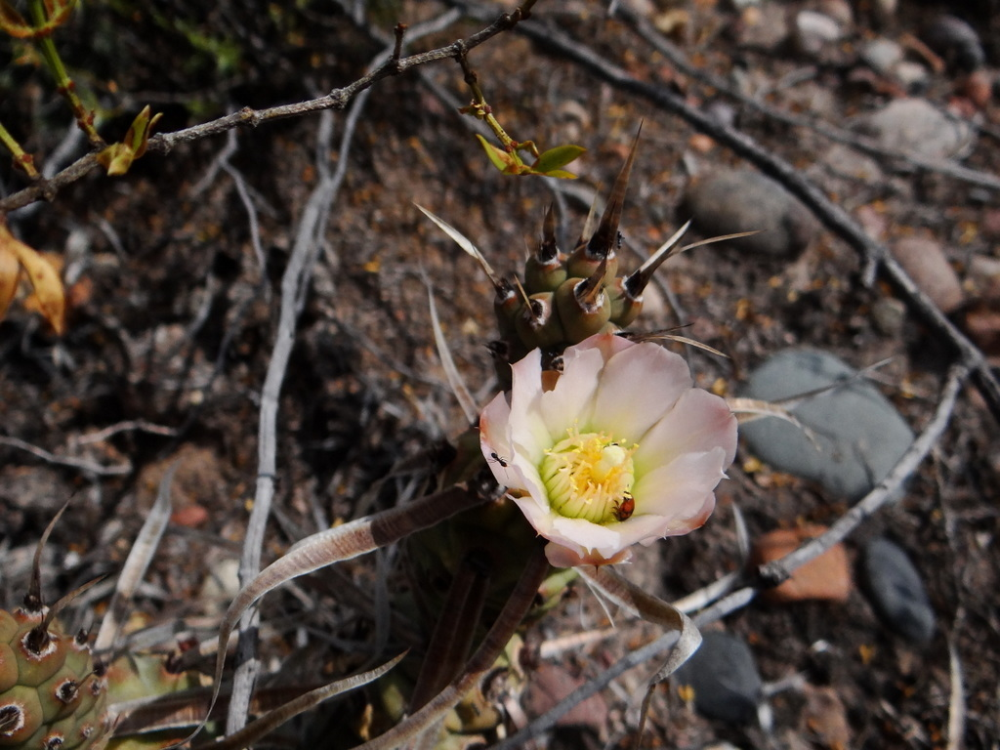
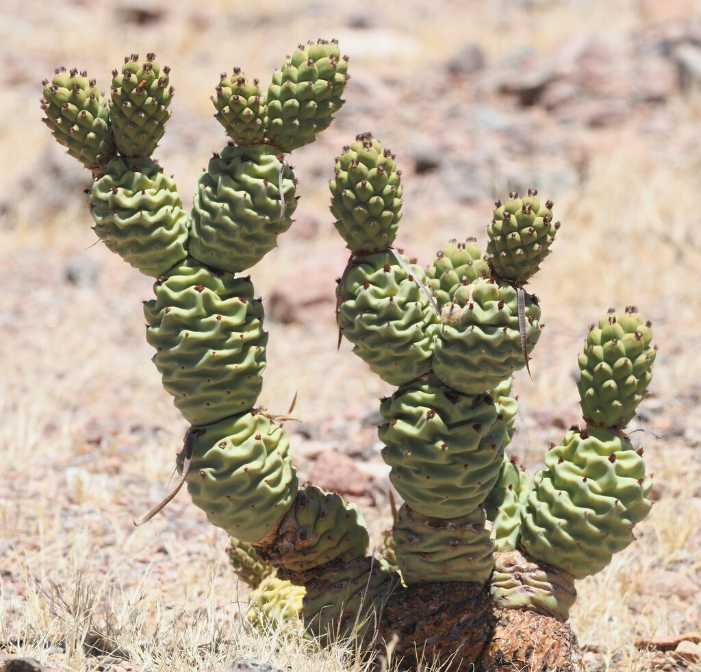
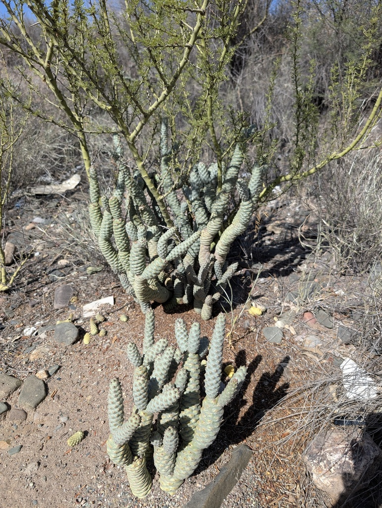
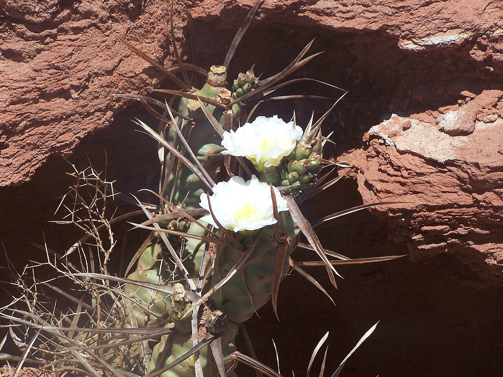

# Paper spine cactus photo archive

_Tephrocactus articulatus var. papyracanthus_ - Cactus-08

Collection label ID: `G2`.

Species-reference photographs may show other T. articulatus forms; the ordered plant is the papery-spined horticultural variety.

Collection research: [open the plant profile](../../../docs/plants/cacti/tephrocactus-articulatus-papyracanthus.md).

## Gallery

_habitat_ - [Tephrocactus articulatus reference observation](https://www.inaturalist.org/observations/1274371); (c) Guillermo Debandi, some rights reserved (CC BY); [CC BY](https://creativecommons.org/licenses/by/4.0/).

_habitat_ - [Tephrocactus articulatus reference observation](https://www.inaturalist.org/observations/179233308); (c) Rosario Douglas, some rights reserved (CC BY); [CC BY](https://creativecommons.org/licenses/by/4.0/).

_habitat_ - [Tephrocactus articulatus reference observation](https://www.inaturalist.org/observations/2482924); (c) Guillermo Debandi, some rights reserved (CC BY); [CC BY](https://creativecommons.org/licenses/by/4.0/).

_habitat_ - [Tephrocactus articulatus reference observation](https://www.inaturalist.org/observations/258112838); (c) Rosario Douglas, some rights reserved (CC BY); [CC BY](https://creativecommons.org/licenses/by/4.0/).

_habitat_ - [Tephrocactus articulatus reference observation](https://www.inaturalist.org/observations/261461080); no rights reserved; [CC0](https://creativecommons.org/publicdomain/zero/1.0/).

_habit_ - [Tephrocactus articulatus Jochin.jpg](https://commons.wikimedia.org/wiki/File:Tephrocactus_articulatus_Jochin.jpg); Jochin; [CC BY 2.5](https://creativecommons.org/licenses/by/2.5).

## File details

| File                                                                                         | Subject | Source                                                                                           | Creator                                             | License                                                   |
| -------------------------------------------------------------------------------------------- | ------- | ------------------------------------------------------------------------------------------------ | --------------------------------------------------- | --------------------------------------------------------- |
| [inaturalist-1274371-1598540-habitat.jpg](./inaturalist-1274371-1598540-habitat.jpg)         | habitat | [iNaturalist](https://www.inaturalist.org/observations/1274371)                                  | (c) Guillermo Debandi, some rights reserved (CC BY) | [CC BY](https://creativecommons.org/licenses/by/4.0/)     |
| [inaturalist-179233308-312009255-habitat.jpg](./inaturalist-179233308-312009255-habitat.jpg) | habitat | [iNaturalist](https://www.inaturalist.org/observations/179233308)                                | (c) Rosario Douglas, some rights reserved (CC BY)   | [CC BY](https://creativecommons.org/licenses/by/4.0/)     |
| [inaturalist-2482924-2782136-habitat.jpg](./inaturalist-2482924-2782136-habitat.jpg)         | habitat | [iNaturalist](https://www.inaturalist.org/observations/2482924)                                  | (c) Guillermo Debandi, some rights reserved (CC BY) | [CC BY](https://creativecommons.org/licenses/by/4.0/)     |
| [inaturalist-258112838-463052775-habitat.jpg](./inaturalist-258112838-463052775-habitat.jpg) | habitat | [iNaturalist](https://www.inaturalist.org/observations/258112838)                                | (c) Rosario Douglas, some rights reserved (CC BY)   | [CC BY](https://creativecommons.org/licenses/by/4.0/)     |
| [inaturalist-261461080-469728850-habitat.jpg](./inaturalist-261461080-469728850-habitat.jpg) | habitat | [iNaturalist](https://www.inaturalist.org/observations/261461080)                                | no rights reserved                                  | [CC0](https://creativecommons.org/publicdomain/zero/1.0/) |
| [commons-9618856-habit.jpg](./commons-9618856-habit.jpg)                                     | habit   | [Wikimedia Commons](https://commons.wikimedia.org/wiki/File:Tephrocactus_articulatus_Jochin.jpg) | Jochin                                              | [CC BY 2.5](https://creativecommons.org/licenses/by/2.5)  |

Metadata and SHA-256 hashes are also available in [the global manifest](../photo-manifest.json).
