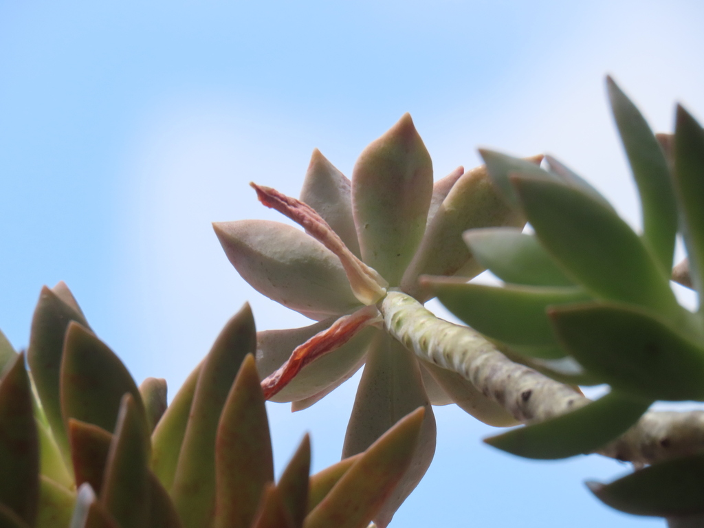
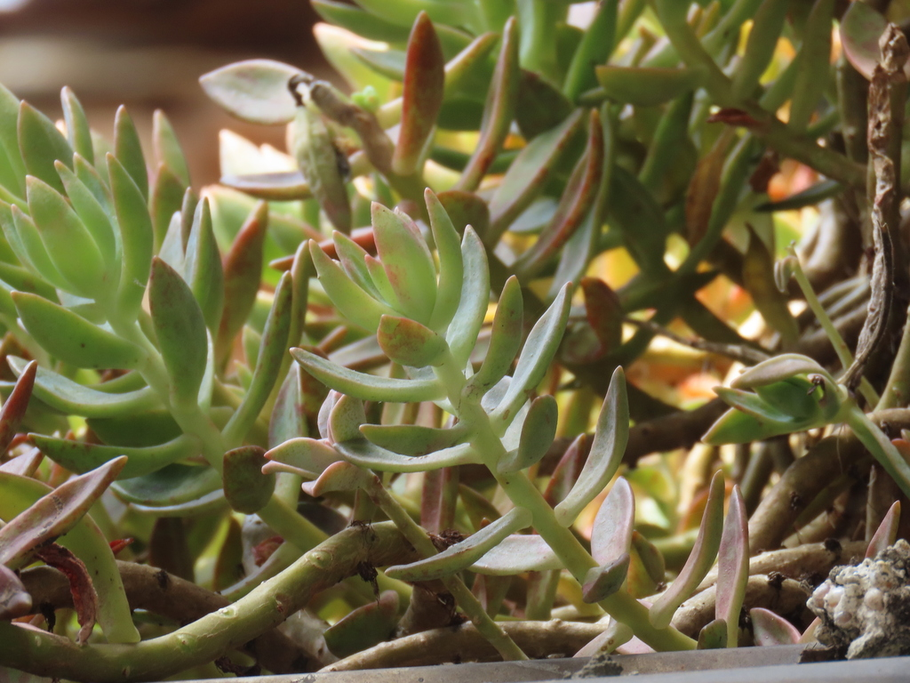
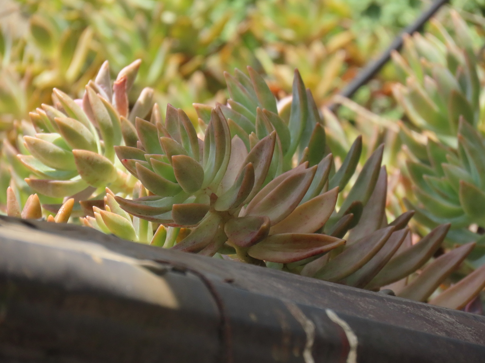
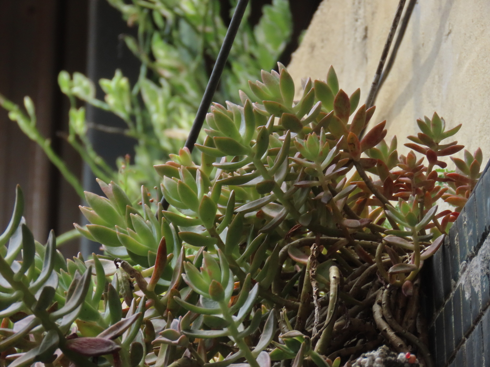
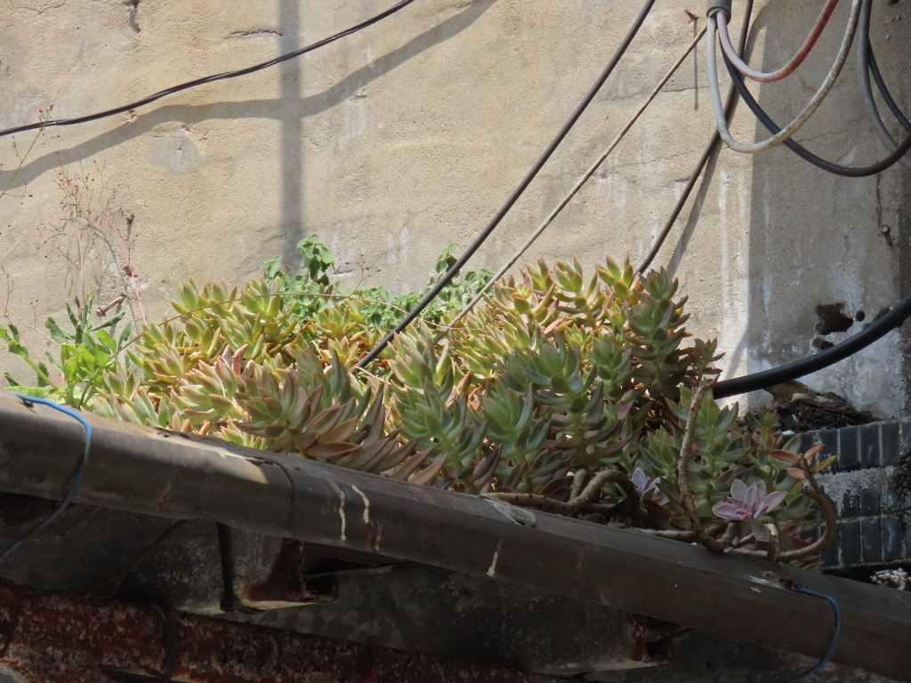
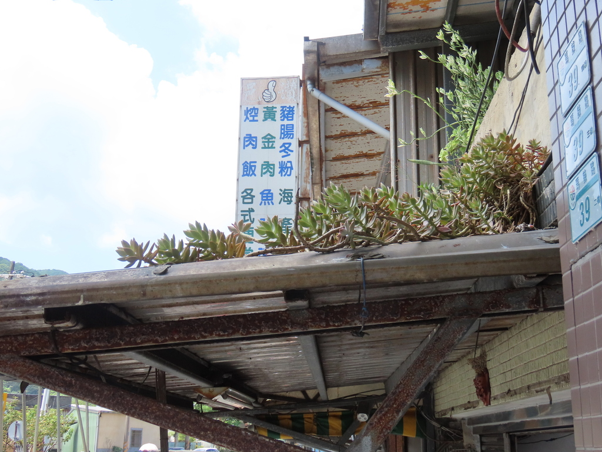
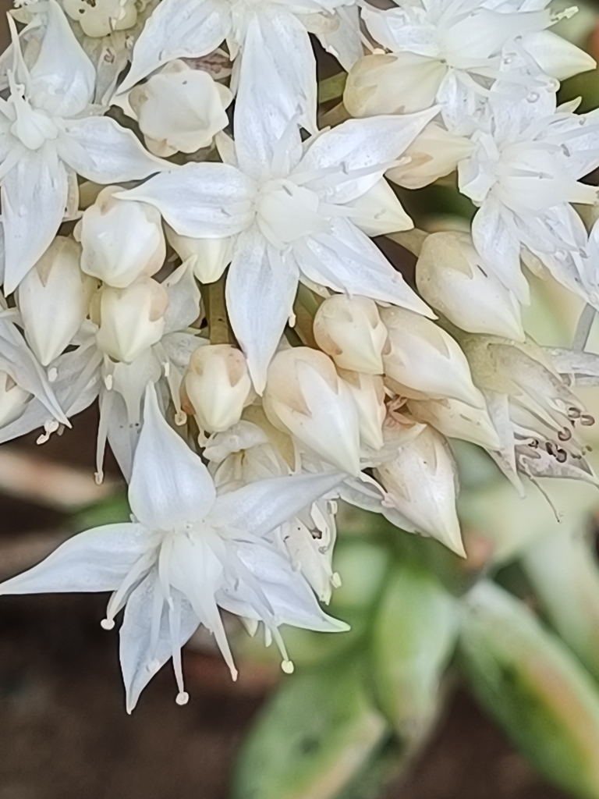
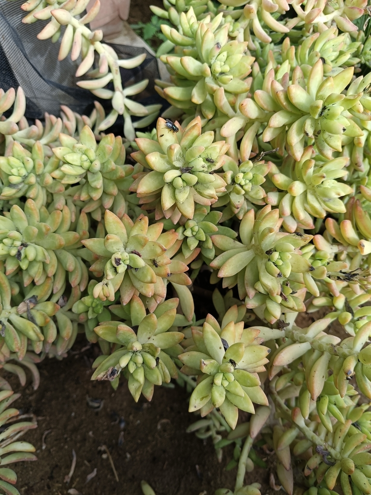
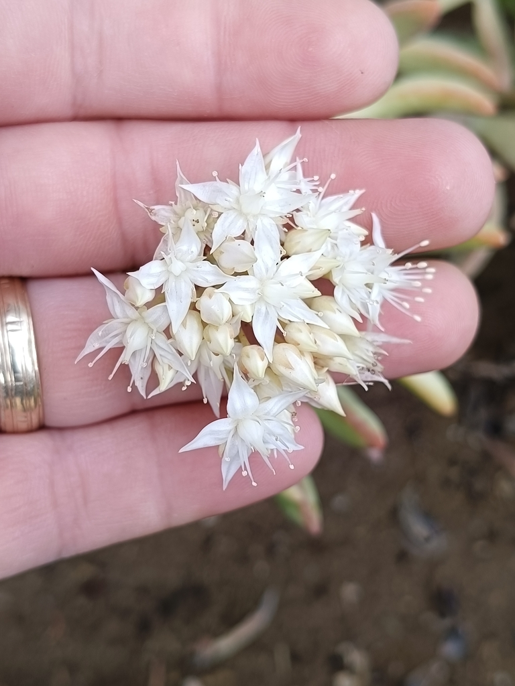
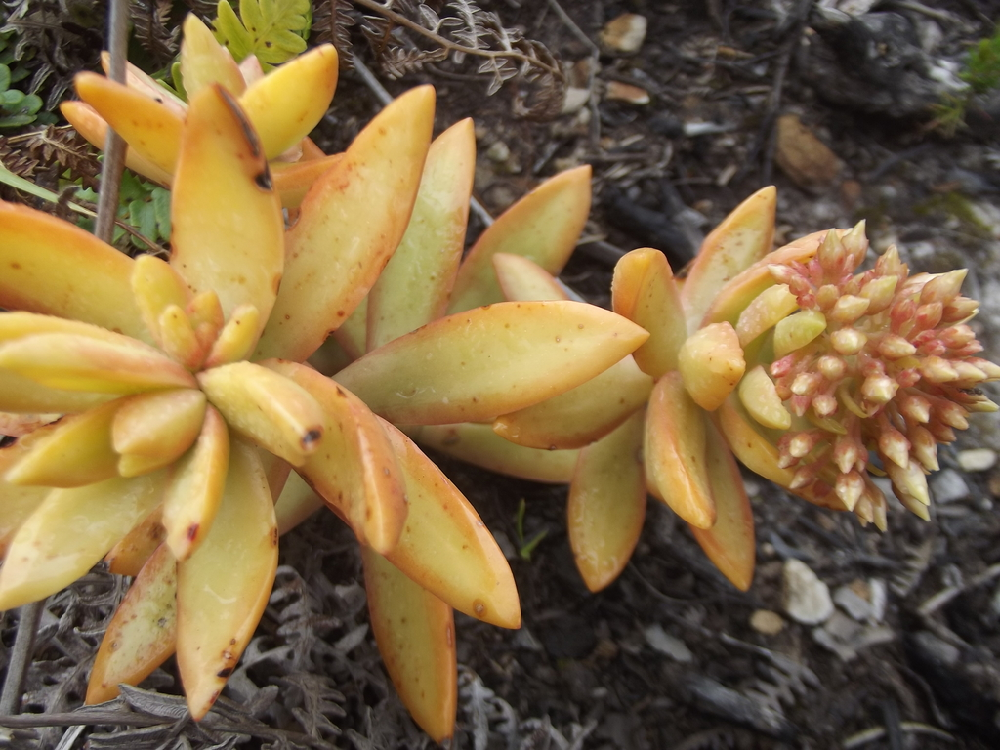

# Coppertone-type sedum photo archive

_Sedum adolphi / S. nussbaumerianum complex_ - Succulent-10B

Collection label ID: `#6`.

Reference photographs of the Sedum adolphi / S. nussbaumerianum horticultural complex; the owned plant is a provisional foliage match, with exact identity and cultivar unconfirmed.

Collection research: [open the plant profile](../../../docs/plants/succulents/tiny-planter-coppertone-sedum.md).

## Gallery

_habitat_ - [Sedum adolphi reference observation](https://www.inaturalist.org/observations/235528394); (c) chiuluan, some rights reserved (CC BY); [CC BY](https://creativecommons.org/licenses/by/4.0/).

_habitat_ - [Sedum adolphi reference observation](https://www.inaturalist.org/observations/235528394); (c) chiuluan, some rights reserved (CC BY); [CC BY](https://creativecommons.org/licenses/by/4.0/).

_habitat_ - [Sedum adolphi reference observation](https://www.inaturalist.org/observations/235528394); (c) chiuluan, some rights reserved (CC BY); [CC BY](https://creativecommons.org/licenses/by/4.0/).

_habitat_ - [Sedum adolphi reference observation](https://www.inaturalist.org/observations/235528394); (c) chiuluan, some rights reserved (CC BY); [CC BY](https://creativecommons.org/licenses/by/4.0/).

_habitat_ - [Sedum adolphi reference observation](https://www.inaturalist.org/observations/235528394); (c) chiuluan, some rights reserved (CC BY); [CC BY](https://creativecommons.org/licenses/by/4.0/).

_habitat_ - [Sedum adolphi reference observation](https://www.inaturalist.org/observations/235528394); (c) chiuluan, some rights reserved (CC BY); [CC BY](https://creativecommons.org/licenses/by/4.0/).

_habitat_ - [Sedum adolphi reference observation](https://www.inaturalist.org/observations/332323460); (c) MarvalPhotography19, some rights reserved (CC BY); [CC BY](https://creativecommons.org/licenses/by/4.0/).

_habitat_ - [Sedum adolphi reference observation](https://www.inaturalist.org/observations/332323460); (c) MarvalPhotography19, some rights reserved (CC BY); [CC BY](https://creativecommons.org/licenses/by/4.0/).

_habitat_ - [Sedum adolphi reference observation](https://www.inaturalist.org/observations/332323460); (c) MarvalPhotography19, some rights reserved (CC BY); [CC BY](https://creativecommons.org/licenses/by/4.0/).

_habitat_ - [Sedum adolphi reference observation](https://www.inaturalist.org/observations/61386730); no rights reserved; [CC0](https://creativecommons.org/publicdomain/zero/1.0/).

## File details

| File                                                                                         | Subject | Source                                                            | Creator                                               | License                                                   |
| -------------------------------------------------------------------------------------------- | ------- | ----------------------------------------------------------------- | ----------------------------------------------------- | --------------------------------------------------------- |
| [inaturalist-235528394-418908172-habitat.jpg](./inaturalist-235528394-418908172-habitat.jpg) | habitat | [iNaturalist](https://www.inaturalist.org/observations/235528394) | (c) chiuluan, some rights reserved (CC BY)            | [CC BY](https://creativecommons.org/licenses/by/4.0/)     |
| [inaturalist-235528394-418908189-habitat.jpg](./inaturalist-235528394-418908189-habitat.jpg) | habitat | [iNaturalist](https://www.inaturalist.org/observations/235528394) | (c) chiuluan, some rights reserved (CC BY)            | [CC BY](https://creativecommons.org/licenses/by/4.0/)     |
| [inaturalist-235528394-418908198-habitat.jpg](./inaturalist-235528394-418908198-habitat.jpg) | habitat | [iNaturalist](https://www.inaturalist.org/observations/235528394) | (c) chiuluan, some rights reserved (CC BY)            | [CC BY](https://creativecommons.org/licenses/by/4.0/)     |
| [inaturalist-235528394-418908202-habitat.jpg](./inaturalist-235528394-418908202-habitat.jpg) | habitat | [iNaturalist](https://www.inaturalist.org/observations/235528394) | (c) chiuluan, some rights reserved (CC BY)            | [CC BY](https://creativecommons.org/licenses/by/4.0/)     |
| [inaturalist-235528394-418908278-habitat.jpg](./inaturalist-235528394-418908278-habitat.jpg) | habitat | [iNaturalist](https://www.inaturalist.org/observations/235528394) | (c) chiuluan, some rights reserved (CC BY)            | [CC BY](https://creativecommons.org/licenses/by/4.0/)     |
| [inaturalist-235528394-418908308-habitat.jpg](./inaturalist-235528394-418908308-habitat.jpg) | habitat | [iNaturalist](https://www.inaturalist.org/observations/235528394) | (c) chiuluan, some rights reserved (CC BY)            | [CC BY](https://creativecommons.org/licenses/by/4.0/)     |
| [inaturalist-332323460-603077575-habitat.jpg](./inaturalist-332323460-603077575-habitat.jpg) | habitat | [iNaturalist](https://www.inaturalist.org/observations/332323460) | (c) MarvalPhotography19, some rights reserved (CC BY) | [CC BY](https://creativecommons.org/licenses/by/4.0/)     |
| [inaturalist-332323460-603077593-habitat.jpg](./inaturalist-332323460-603077593-habitat.jpg) | habitat | [iNaturalist](https://www.inaturalist.org/observations/332323460) | (c) MarvalPhotography19, some rights reserved (CC BY) | [CC BY](https://creativecommons.org/licenses/by/4.0/)     |
| [inaturalist-332323460-603077620-habitat.jpg](./inaturalist-332323460-603077620-habitat.jpg) | habitat | [iNaturalist](https://www.inaturalist.org/observations/332323460) | (c) MarvalPhotography19, some rights reserved (CC BY) | [CC BY](https://creativecommons.org/licenses/by/4.0/)     |
| [inaturalist-61386730-98225038-habitat.jpg](./inaturalist-61386730-98225038-habitat.jpg)     | habitat | [iNaturalist](https://www.inaturalist.org/observations/61386730)  | no rights reserved                                    | [CC0](https://creativecommons.org/publicdomain/zero/1.0/) |

Metadata and SHA-256 hashes are also available in [the global manifest](../photo-manifest.json).
