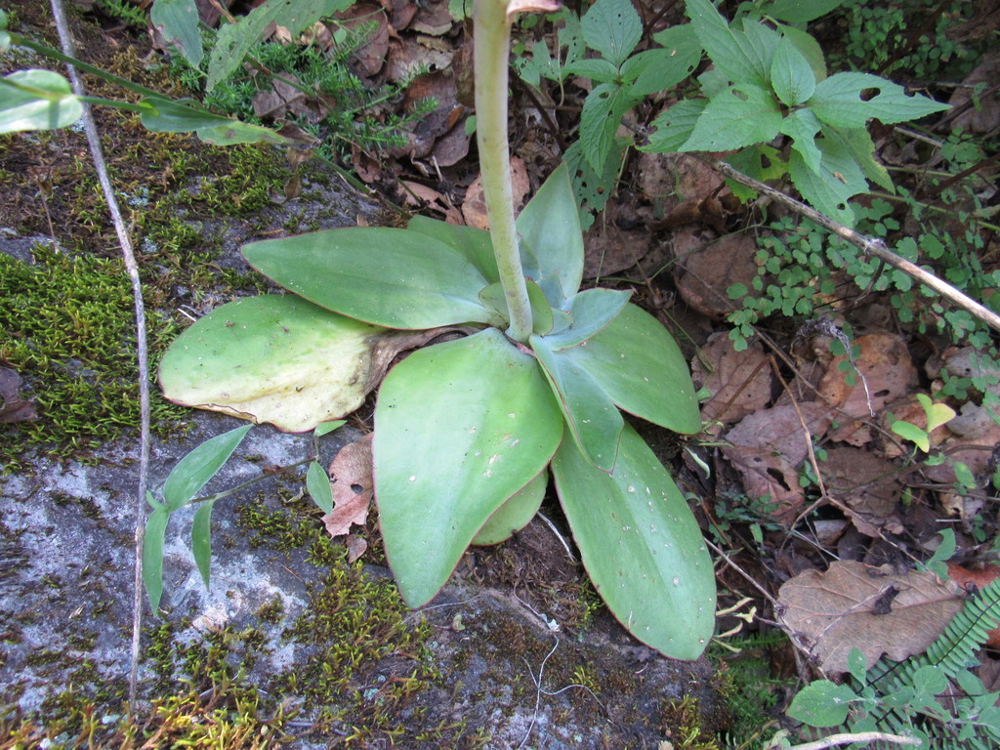
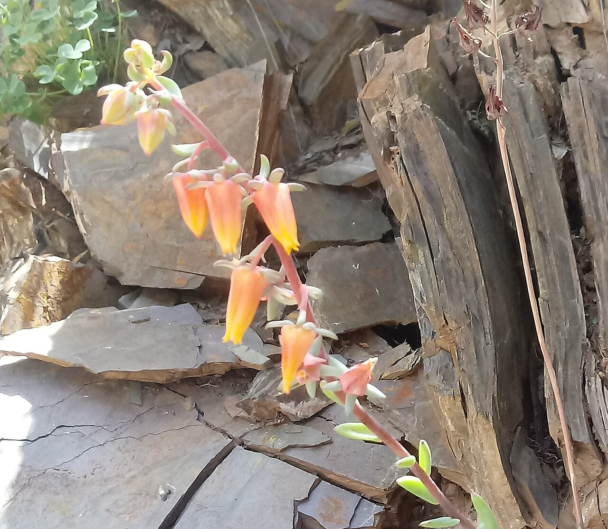
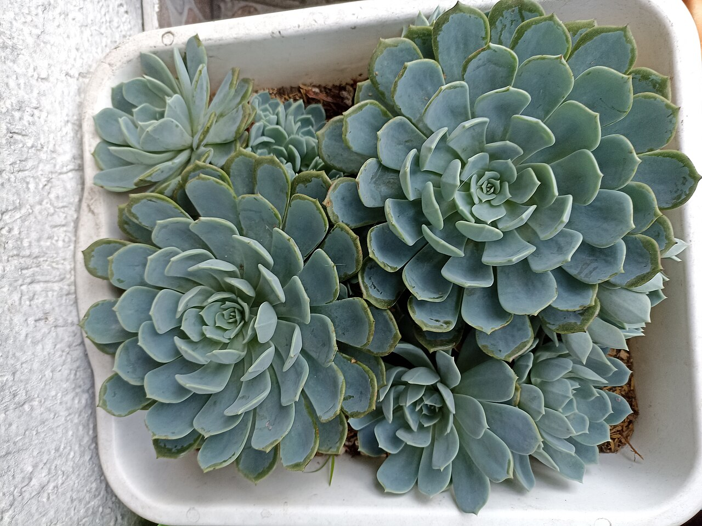
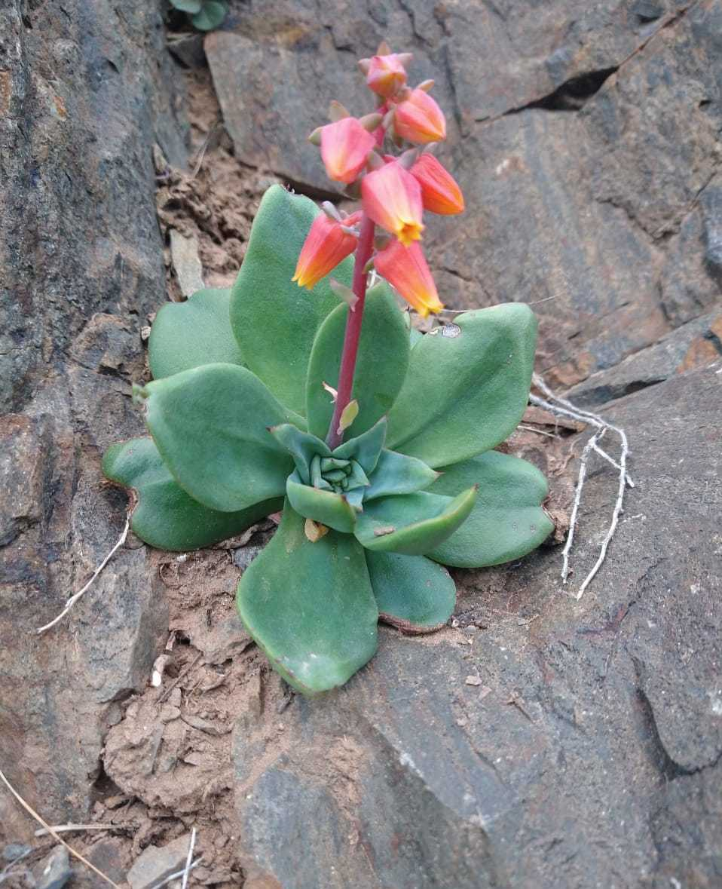
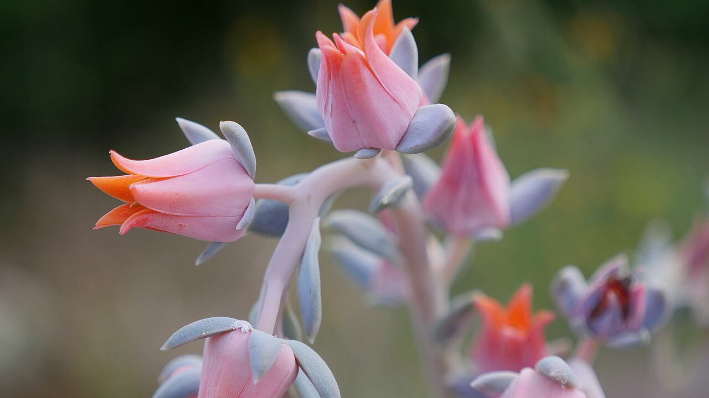
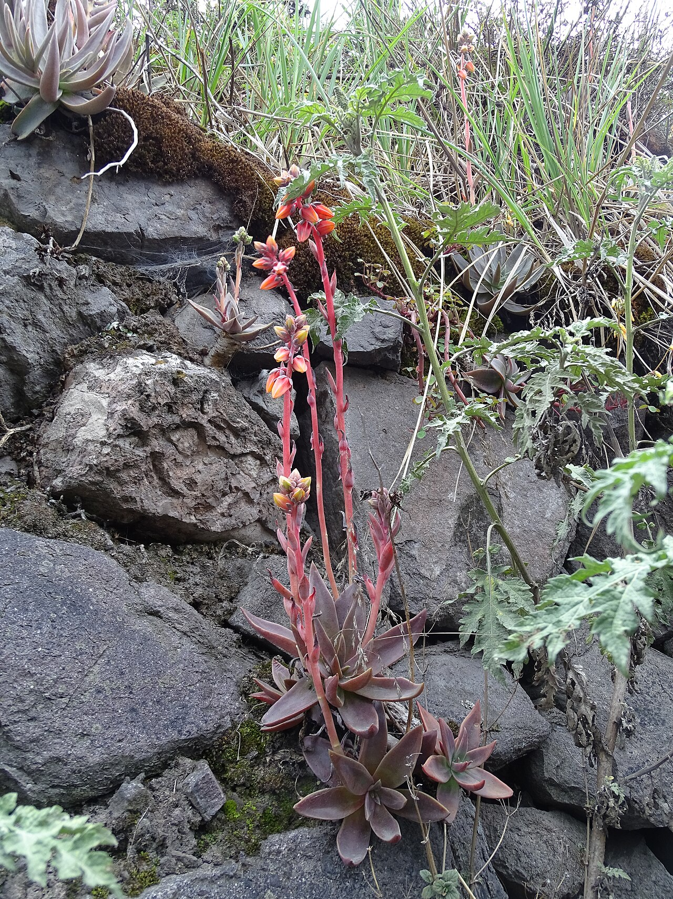
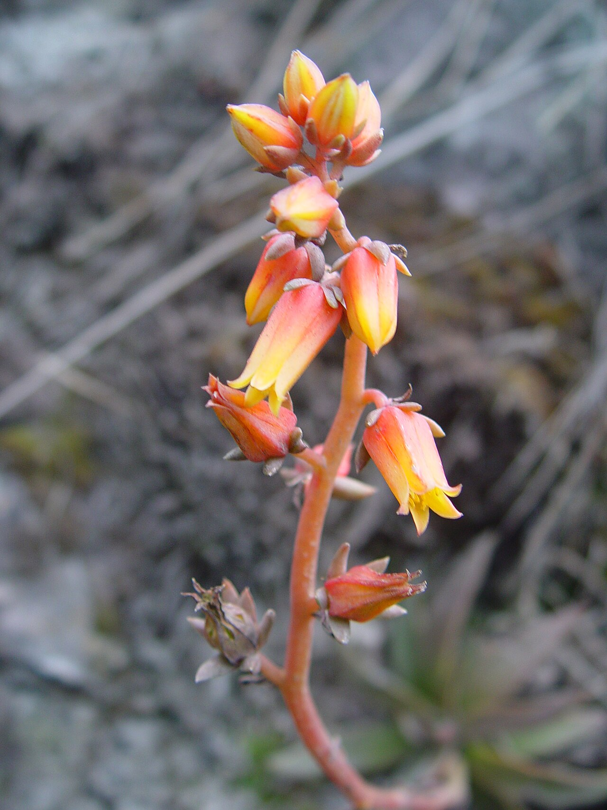
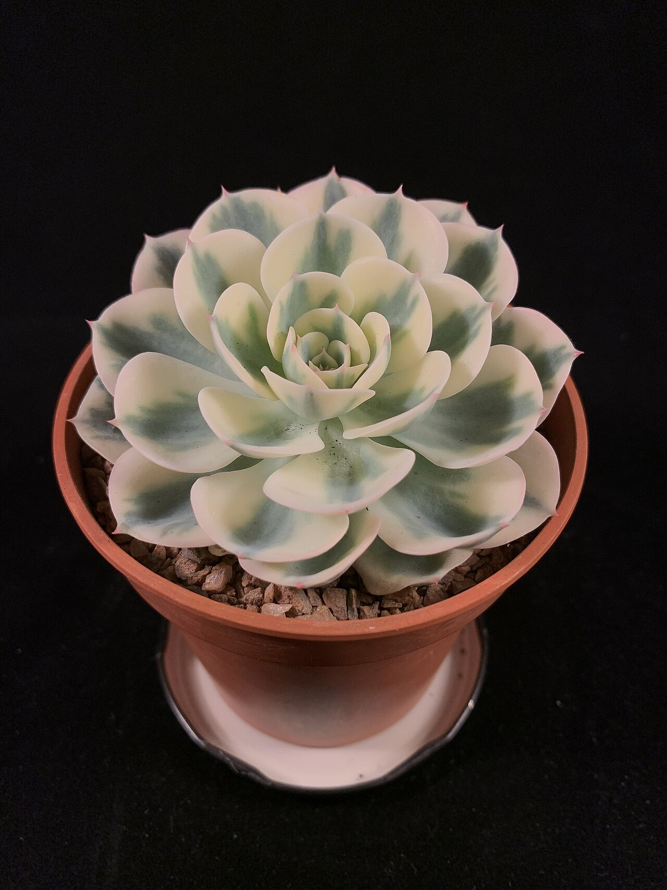
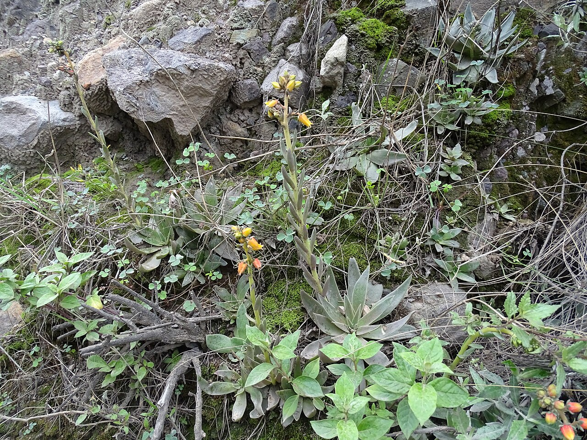
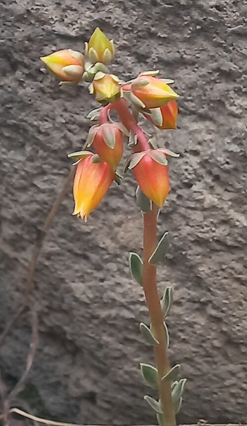

# Pale rosette echeveria photo archive

_Echeveria sp._ - Succulent-10A

Collection label ID: `#6`.

Genus-reference photographs of Echeveria diversity; the owned plant has only a provisional genus-level foliage identification and its species and cultivar remain unresolved.

Collection research: [open the plant profile](../../../docs/plants/succulents/tiny-planter-echeveria.md).

## Gallery

_habitat_ - [Echeveria reference observation](https://www.inaturalist.org/observations/8953089); (c) Oscar Alejandro Morales Juárez, some rights reserved (CC BY-SA); [CC BY-SA](https://creativecommons.org/licenses/by-sa/4.0/).

_flower_ - [Inflorescencia de E. argentinensis.jpg](https://commons.wikimedia.org/wiki/File:Inflorescencia_de_E._argentinensis.jpg); Daniel Marquiegui; [CC BY-SA 4.0](https://creativecommons.org/licenses/by-sa/4.0).

_habit_ - [Echeveria, Suculenta.jpg](https://commons.wikimedia.org/wiki/File:Echeveria,_Suculenta.jpg); ProfeAnita; [CC BY-SA 4.0](https://creativecommons.org/licenses/by-sa/4.0).

_habit_ - [Fenotipo Echeveria kieslingii.jpg](https://commons.wikimedia.org/wiki/File:Fenotipo_Echeveria_kieslingii.jpg); William Ale; [CC BY-SA 4.0](https://creativecommons.org/licenses/by-sa/4.0).

_flower_ - [Fleurs d'echevaria gigantea.jpg](https://commons.wikimedia.org/wiki/File:Fleurs_d%27echevaria_gigantea.jpg); Jeanlartiguer; [CC BY-SA 4.0](https://creativecommons.org/licenses/by-sa/4.0).

_habitat_ - [Echeveria chiclensis.jpg](https://commons.wikimedia.org/wiki/File:Echeveria_chiclensis.jpg); Guillermo Pino; [CC BY-SA 4.0](https://creativecommons.org/licenses/by-sa/4.0).

_flower_ - [Inflorescencia Echeveria chiclensis.jpg](https://commons.wikimedia.org/wiki/File:Inflorescencia_Echeveria_chiclensis.jpg); Guillermo Pino; [CC BY-SA 4.0](https://creativecommons.org/licenses/by-sa/4.0).

_habit_ - [Echeveria Compton Carousel.jpg](https://commons.wikimedia.org/wiki/File:Echeveria_Compton_Carousel.jpg); Isaac Bee; [CC BY-SA 4.0](https://creativecommons.org/licenses/by-sa/4.0).

_habitat_ - [Eche backebergi Chacahuaro.jpg](https://commons.wikimedia.org/wiki/File:Eche_backebergi_Chacahuaro.jpg); Gpinoi; [CC BY-SA 4.0](https://creativecommons.org/licenses/by-sa/4.0).

_flower_ - [Echeveria chiclensis var. backebergii inflorescence.jpg](https://commons.wikimedia.org/wiki/File:Echeveria_chiclensis_var._backebergii_inflorescence.jpg); Daniel Marquiegui; [CC BY-SA 4.0](https://creativecommons.org/licenses/by-sa/4.0).

## File details

| File                                                                                   | Subject | Source                                                                                                               | Creator                                                             | License                                                        |
| -------------------------------------------------------------------------------------- | ------- | -------------------------------------------------------------------------------------------------------------------- | ------------------------------------------------------------------- | -------------------------------------------------------------- |
| [inaturalist-8953089-12066168-habitat.jpg](./inaturalist-8953089-12066168-habitat.jpg) | habitat | [iNaturalist](https://www.inaturalist.org/observations/8953089)                                                      | (c) Oscar Alejandro Morales Juárez, some rights reserved (CC BY-SA) | [CC BY-SA](https://creativecommons.org/licenses/by-sa/4.0/)    |
| [commons-115472404-flower.jpg](./commons-115472404-flower.jpg)                         | flower  | [Wikimedia Commons](https://commons.wikimedia.org/wiki/File:Inflorescencia_de_E._argentinensis.jpg)                  | Daniel Marquiegui                                                   | [CC BY-SA 4.0](https://creativecommons.org/licenses/by-sa/4.0) |
| [commons-115953675-habit.jpg](./commons-115953675-habit.jpg)                           | habit   | [Wikimedia Commons](https://commons.wikimedia.org/wiki/File:Echeveria,_Suculenta.jpg)                                | ProfeAnita                                                          | [CC BY-SA 4.0](https://creativecommons.org/licenses/by-sa/4.0) |
| [commons-116409880-habit.jpg](./commons-116409880-habit.jpg)                           | habit   | [Wikimedia Commons](https://commons.wikimedia.org/wiki/File:Fenotipo_Echeveria_kieslingii.jpg)                       | William Ale                                                         | [CC BY-SA 4.0](https://creativecommons.org/licenses/by-sa/4.0) |
| [commons-120772153-habit.jpg](./commons-120772153-habit.jpg)                           | flower  | [Wikimedia Commons](https://commons.wikimedia.org/wiki/File:Fleurs_d%27echevaria_gigantea.jpg)                       | Jeanlartiguer                                                       | [CC BY-SA 4.0](https://creativecommons.org/licenses/by-sa/4.0) |
| [commons-121897807-habitat.jpg](./commons-121897807-habitat.jpg)                       | habitat | [Wikimedia Commons](https://commons.wikimedia.org/wiki/File:Echeveria_chiclensis.jpg)                                | Guillermo Pino                                                      | [CC BY-SA 4.0](https://creativecommons.org/licenses/by-sa/4.0) |
| [commons-121898146-flower.jpg](./commons-121898146-flower.jpg)                         | flower  | [Wikimedia Commons](https://commons.wikimedia.org/wiki/File:Inflorescencia_Echeveria_chiclensis.jpg)                 | Guillermo Pino                                                      | [CC BY-SA 4.0](https://creativecommons.org/licenses/by-sa/4.0) |
| [commons-122613923-habit.jpg](./commons-122613923-habit.jpg)                           | habit   | [Wikimedia Commons](https://commons.wikimedia.org/wiki/File:Echeveria_Compton_Carousel.jpg)                          | Isaac Bee                                                           | [CC BY-SA 4.0](https://creativecommons.org/licenses/by-sa/4.0) |
| [commons-124615290-habitat.jpg](./commons-124615290-habitat.jpg)                       | habitat | [Wikimedia Commons](https://commons.wikimedia.org/wiki/File:Eche_backebergi_Chacahuaro.jpg)                          | Gpinoi                                                              | [CC BY-SA 4.0](https://creativecommons.org/licenses/by-sa/4.0) |
| [commons-124905880-flower.jpg](./commons-124905880-flower.jpg)                         | flower  | [Wikimedia Commons](https://commons.wikimedia.org/wiki/File:Echeveria_chiclensis_var._backebergii_inflorescence.jpg) | Daniel Marquiegui                                                   | [CC BY-SA 4.0](https://creativecommons.org/licenses/by-sa/4.0) |

Metadata and SHA-256 hashes are also available in [the global manifest](../photo-manifest.json).
