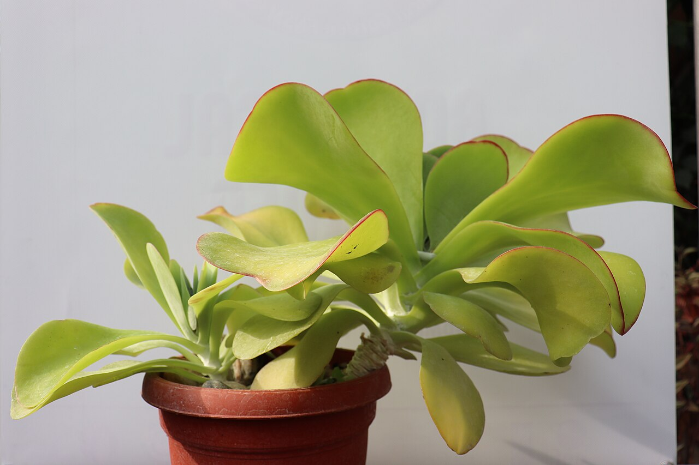
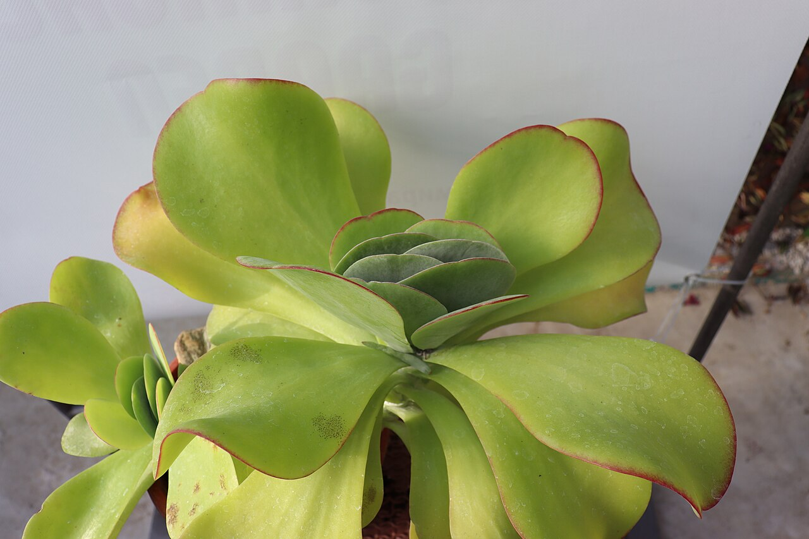
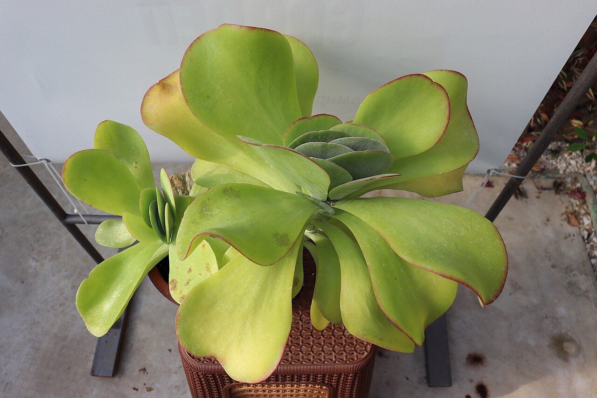
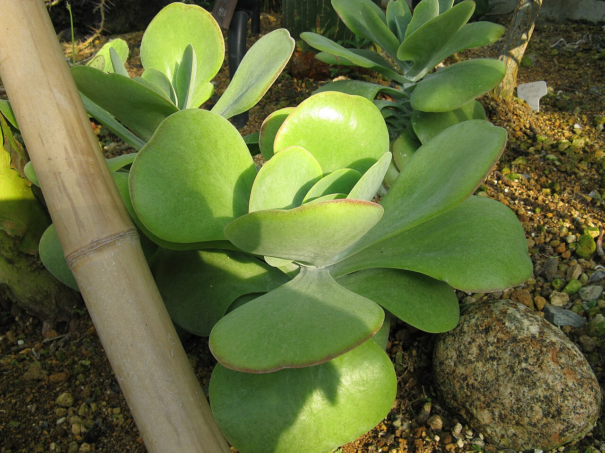
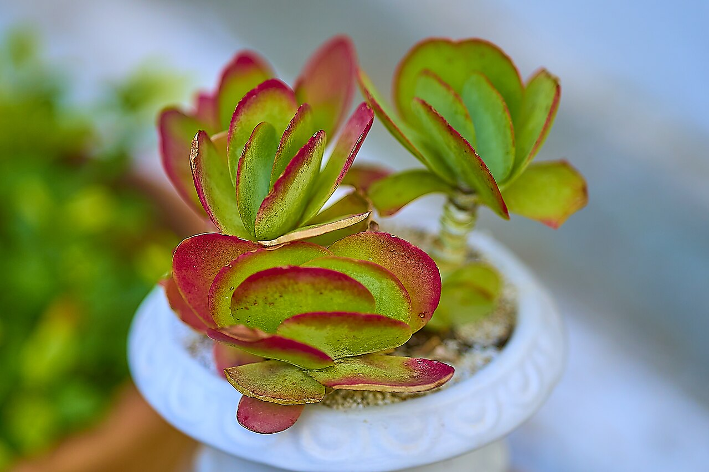
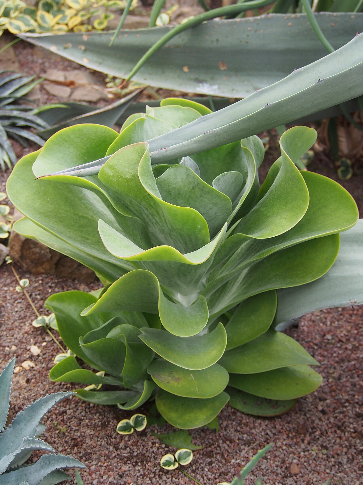
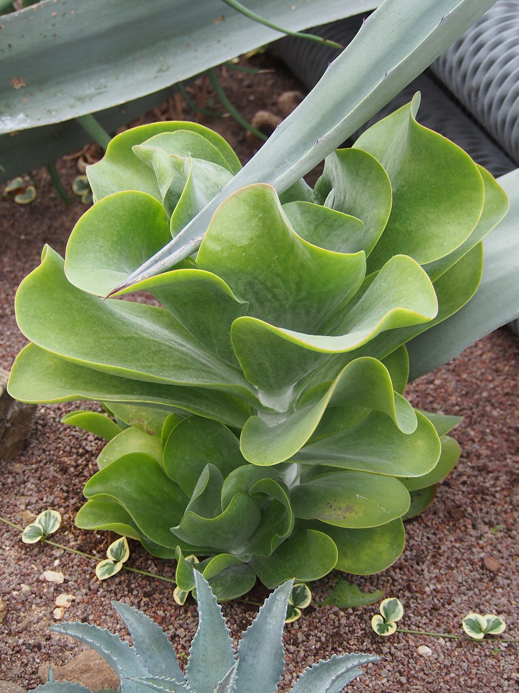
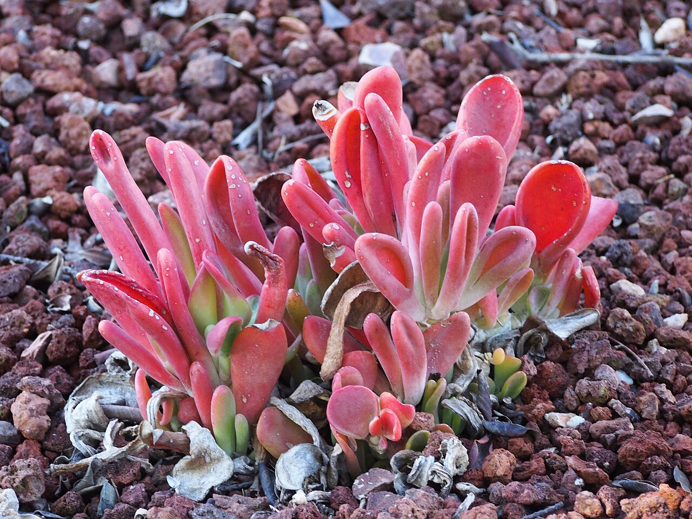
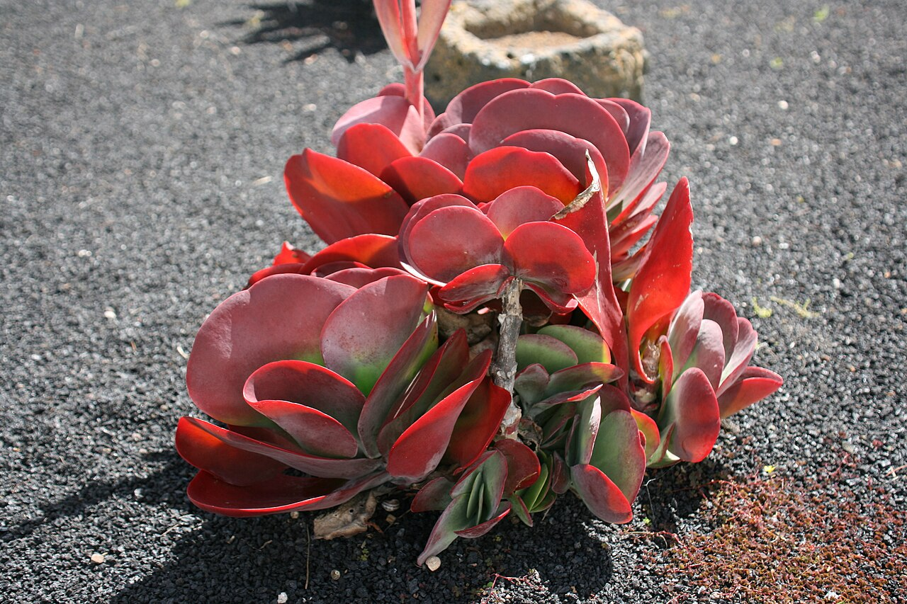
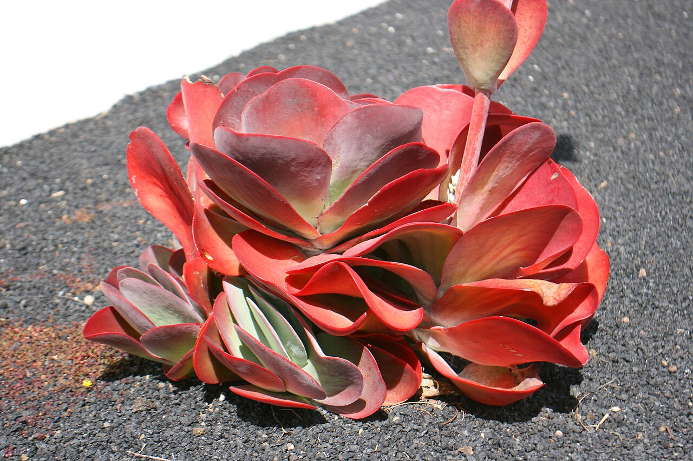

# Paddle kalanchoe photo archive

_Kalanchoe luciae / K. thyrsiflora complex_ - Succulent-10C

Collection label ID: `#6`.

Paddle-kalanchoe reference photographs include Kalanchoe luciae and its frequently confused relative K. thyrsiflora; the owned plant species and cultivar remain unresolved.

Collection research: [open the plant profile](../../../docs/plants/succulents/tiny-planter-paddle-kalanchoe.md).

## Gallery

_habitat_ - [Kalanchoe luciae - Ботаничка градина Скопје (1).jpg](<https://commons.wikimedia.org/wiki/File:Kalanchoe_luciae_-_%D0%91%D0%BE%D1%82%D0%B0%D0%BD%D0%B8%D1%87%D0%BA%D0%B0_%D0%B3%D1%80%D0%B0%D0%B4%D0%B8%D0%BD%D0%B0_%D0%A1%D0%BA%D0%BE%D0%BF%D1%98%D0%B5_(1).jpg>); Dandarmkd; [CC BY-SA 4.0](https://creativecommons.org/licenses/by-sa/4.0).

_habitat_ - [Kalanchoe luciae - Ботаничка градина Скопје (2).jpg](<https://commons.wikimedia.org/wiki/File:Kalanchoe_luciae_-_%D0%91%D0%BE%D1%82%D0%B0%D0%BD%D0%B8%D1%87%D0%BA%D0%B0_%D0%B3%D1%80%D0%B0%D0%B4%D0%B8%D0%BD%D0%B0_%D0%A1%D0%BA%D0%BE%D0%BF%D1%98%D0%B5_(2).jpg>); Dandarmkd; [CC BY-SA 4.0](https://creativecommons.org/licenses/by-sa/4.0).

_habitat_ - [Kalanchoe luciae - Ботаничка градина Скопје (3).jpg](<https://commons.wikimedia.org/wiki/File:Kalanchoe_luciae_-_%D0%91%D0%BE%D1%82%D0%B0%D0%BD%D0%B8%D1%87%D0%BA%D0%B0_%D0%B3%D1%80%D0%B0%D0%B4%D0%B8%D0%BD%D0%B0_%D0%A1%D0%BA%D0%BE%D0%BF%D1%98%D0%B5_(3).jpg>); Dandarmkd; [CC BY-SA 4.0](https://creativecommons.org/licenses/by-sa/4.0).

_habit_ - [Kalanchoe thyrsiflora1.jpg](https://commons.wikimedia.org/wiki/File:Kalanchoe_thyrsiflora1.jpg); KENPEI; [CC BY 3.0](https://creativecommons.org/licenses/by/3.0).

_habit_ - [Kalanchoe (Kalanchoe Thyrsiflora) in Athens on May 19, 2023.jpg](<https://commons.wikimedia.org/wiki/File:Kalanchoe_(Kalanchoe_Thyrsiflora)_in_Athens_on_May_19,_2023.jpg>); George E. Koronaios; [CC BY-SA 2.0](https://creativecommons.org/licenses/by-sa/2.0).

_habit_ - [Kalanchoe luciae Żyworódka 2023-10-31 02.jpg](https://commons.wikimedia.org/wiki/File:Kalanchoe_luciae_%C5%BBywor%C3%B3dka_2023-10-31_02.jpg); Agnieszka Kwiecień, Nova; [CC BY-SA 4.0](https://creativecommons.org/licenses/by-sa/4.0).

_habit_ - [Kalanchoe luciae Żyworódka 2023-10-31 01.jpg](https://commons.wikimedia.org/wiki/File:Kalanchoe_luciae_%C5%BBywor%C3%B3dka_2023-10-31_01.jpg); Agnieszka Kwiecień, Nova; [CC BY-SA 4.0](https://creativecommons.org/licenses/by-sa/4.0).

_habit_ - [Kalanchoe luciae 2024-01-20 Malaga 01.jpg](https://commons.wikimedia.org/wiki/File:Kalanchoe_luciae_2024-01-20_Malaga_01.jpg); Agnieszka Kwiecień, Nova; [CC BY-SA 4.0](https://creativecommons.org/licenses/by-sa/4.0).

_detail_ - [San Bartolomé - LZ-20 - Casa Museo del Campesino 02 ies.jpg](https://commons.wikimedia.org/wiki/File:San_Bartolom%C3%A9_-_LZ-20_-_Casa_Museo_del_Campesino_02_ies.jpg); Frank Vincentz; [CC BY-SA 3.0](https://creativecommons.org/licenses/by-sa/3.0).

_detail_ - [San Bartolomé - LZ-20 - Casa Museo del Campesino 03 ies.jpg](https://commons.wikimedia.org/wiki/File:San_Bartolom%C3%A9_-_LZ-20_-_Casa_Museo_del_Campesino_03_ies.jpg); Frank Vincentz; [CC BY-SA 3.0](https://creativecommons.org/licenses/by-sa/3.0).

## File details

| File                                                             | Subject | Source                                                                                                                                                                                                                           | Creator                  | License                                                        |
| ---------------------------------------------------------------- | ------- | -------------------------------------------------------------------------------------------------------------------------------------------------------------------------------------------------------------------------------- | ------------------------ | -------------------------------------------------------------- |
| [commons-115453823-habitat.jpg](./commons-115453823-habitat.jpg) | habitat | [Wikimedia Commons](<https://commons.wikimedia.org/wiki/File:Kalanchoe_luciae_-_%D0%91%D0%BE%D1%82%D0%B0%D0%BD%D0%B8%D1%87%D0%BA%D0%B0_%D0%B3%D1%80%D0%B0%D0%B4%D0%B8%D0%BD%D0%B0_%D0%A1%D0%BA%D0%BE%D0%BF%D1%98%D0%B5_(1).jpg>) | Dandarmkd                | [CC BY-SA 4.0](https://creativecommons.org/licenses/by-sa/4.0) |
| [commons-115453824-habitat.jpg](./commons-115453824-habitat.jpg) | habitat | [Wikimedia Commons](<https://commons.wikimedia.org/wiki/File:Kalanchoe_luciae_-_%D0%91%D0%BE%D1%82%D0%B0%D0%BD%D0%B8%D1%87%D0%BA%D0%B0_%D0%B3%D1%80%D0%B0%D0%B4%D0%B8%D0%BD%D0%B0_%D0%A1%D0%BA%D0%BE%D0%BF%D1%98%D0%B5_(2).jpg>) | Dandarmkd                | [CC BY-SA 4.0](https://creativecommons.org/licenses/by-sa/4.0) |
| [commons-115453826-habitat.jpg](./commons-115453826-habitat.jpg) | habitat | [Wikimedia Commons](<https://commons.wikimedia.org/wiki/File:Kalanchoe_luciae_-_%D0%91%D0%BE%D1%82%D0%B0%D0%BD%D0%B8%D1%87%D0%BA%D0%B0_%D0%B3%D1%80%D0%B0%D0%B4%D0%B8%D0%BD%D0%B0_%D0%A1%D0%BA%D0%BE%D0%BF%D1%98%D0%B5_(3).jpg>) | Dandarmkd                | [CC BY-SA 4.0](https://creativecommons.org/licenses/by-sa/4.0) |
| [commons-12068879-flower.jpg](./commons-12068879-flower.jpg)     | habit   | [Wikimedia Commons](https://commons.wikimedia.org/wiki/File:Kalanchoe_thyrsiflora1.jpg)                                                                                                                                          | KENPEI                   | [CC BY 3.0](https://creativecommons.org/licenses/by/3.0)       |
| [commons-132476932-flower.jpg](./commons-132476932-flower.jpg)   | habit   | [Wikimedia Commons](<https://commons.wikimedia.org/wiki/File:Kalanchoe_(Kalanchoe_Thyrsiflora)_in_Athens_on_May_19,_2023.jpg>)                                                                                                   | George E. Koronaios      | [CC BY-SA 2.0](https://creativecommons.org/licenses/by-sa/2.0) |
| [commons-145997901-habit.jpg](./commons-145997901-habit.jpg)     | habit   | [Wikimedia Commons](https://commons.wikimedia.org/wiki/File:Kalanchoe_luciae_%C5%BBywor%C3%B3dka_2023-10-31_02.jpg)                                                                                                              | Agnieszka Kwiecień, Nova | [CC BY-SA 4.0](https://creativecommons.org/licenses/by-sa/4.0) |
| [commons-145997902-habit.jpg](./commons-145997902-habit.jpg)     | habit   | [Wikimedia Commons](https://commons.wikimedia.org/wiki/File:Kalanchoe_luciae_%C5%BBywor%C3%B3dka_2023-10-31_01.jpg)                                                                                                              | Agnieszka Kwiecień, Nova | [CC BY-SA 4.0](https://creativecommons.org/licenses/by-sa/4.0) |
| [commons-154179863-habit.jpg](./commons-154179863-habit.jpg)     | habit   | [Wikimedia Commons](https://commons.wikimedia.org/wiki/File:Kalanchoe_luciae_2024-01-20_Malaga_01.jpg)                                                                                                                           | Agnieszka Kwiecień, Nova | [CC BY-SA 4.0](https://creativecommons.org/licenses/by-sa/4.0) |
| [commons-16989331-detail.jpg](./commons-16989331-detail.jpg)     | detail  | [Wikimedia Commons](https://commons.wikimedia.org/wiki/File:San_Bartolom%C3%A9_-_LZ-20_-_Casa_Museo_del_Campesino_02_ies.jpg)                                                                                                    | Frank Vincentz           | [CC BY-SA 3.0](https://creativecommons.org/licenses/by-sa/3.0) |
| [commons-16989355-detail.jpg](./commons-16989355-detail.jpg)     | detail  | [Wikimedia Commons](https://commons.wikimedia.org/wiki/File:San_Bartolom%C3%A9_-_LZ-20_-_Casa_Museo_del_Campesino_03_ies.jpg)                                                                                                    | Frank Vincentz           | [CC BY-SA 3.0](https://creativecommons.org/licenses/by-sa/3.0) |

Metadata and SHA-256 hashes are also available in [the global manifest](../photo-manifest.json).
