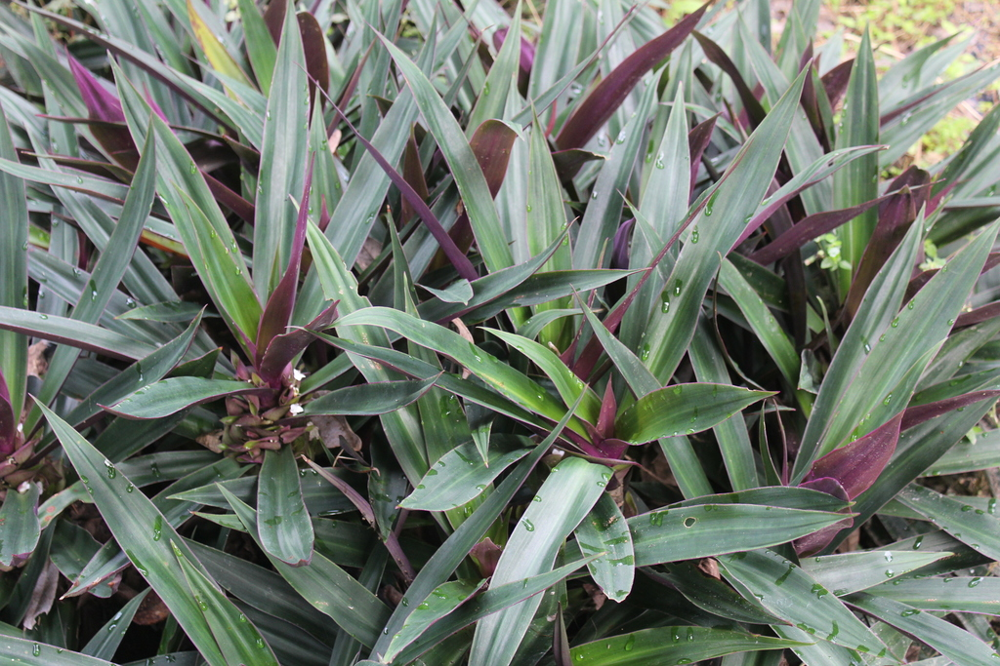
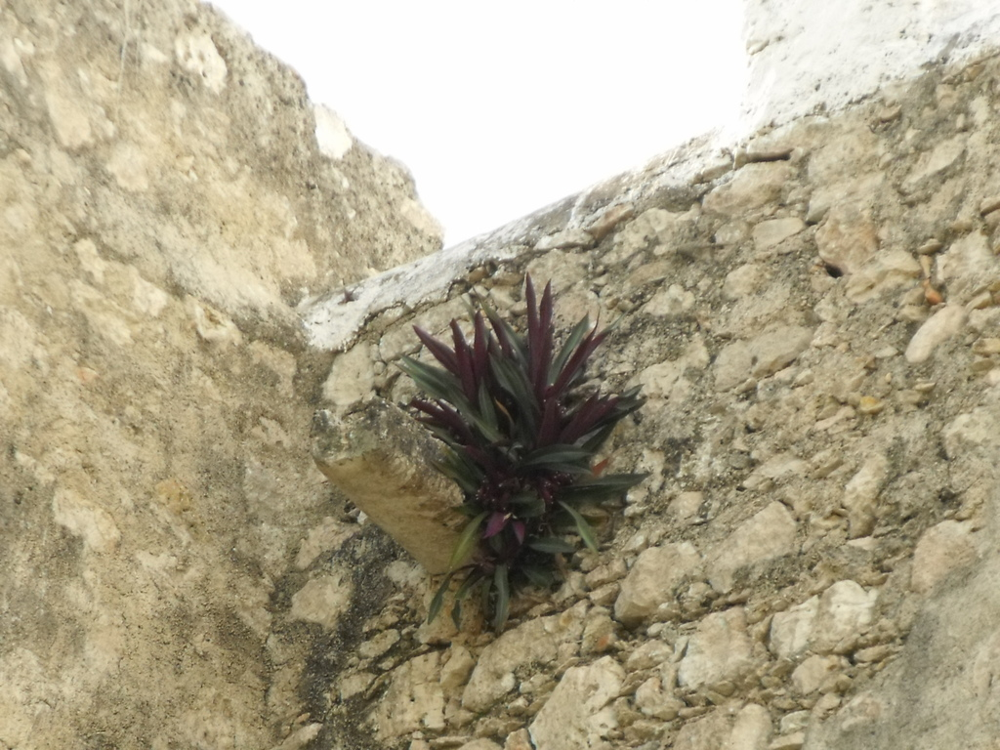
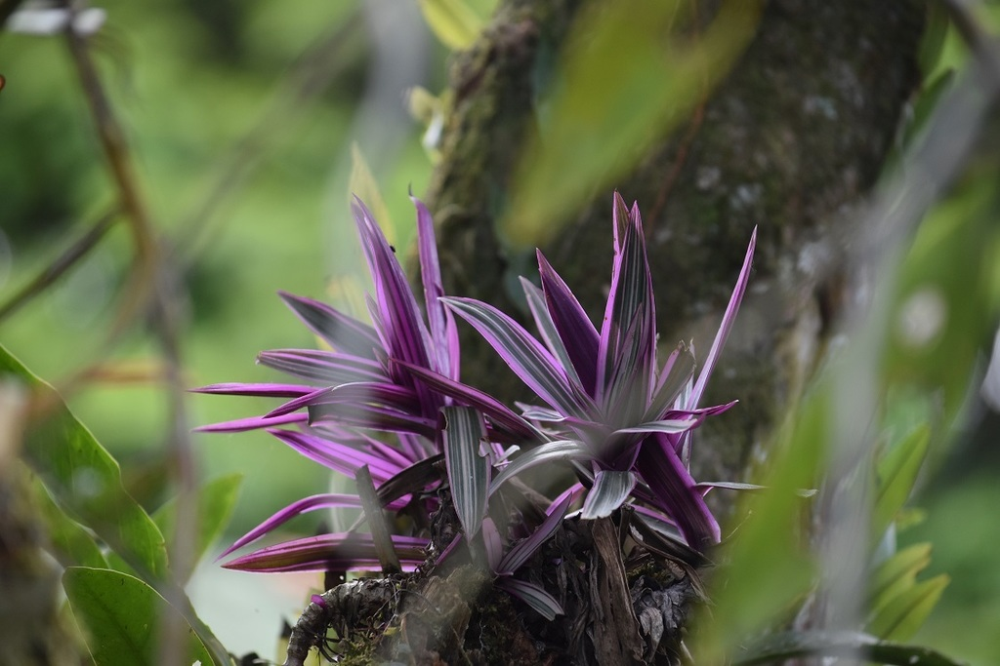
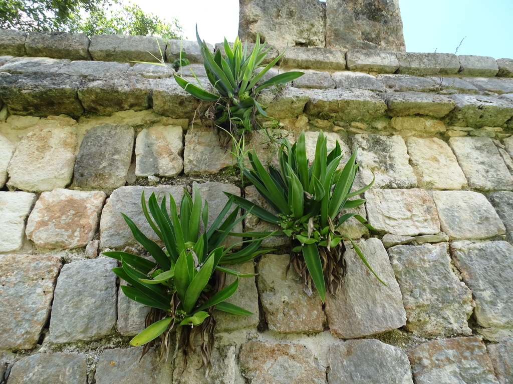
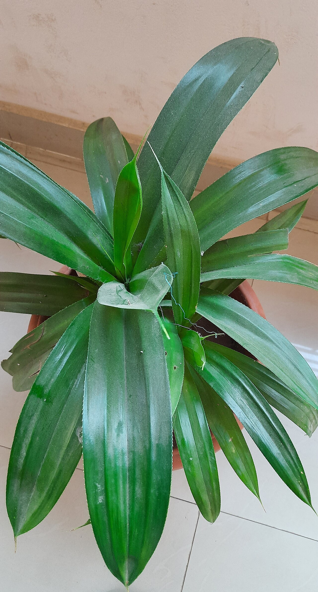
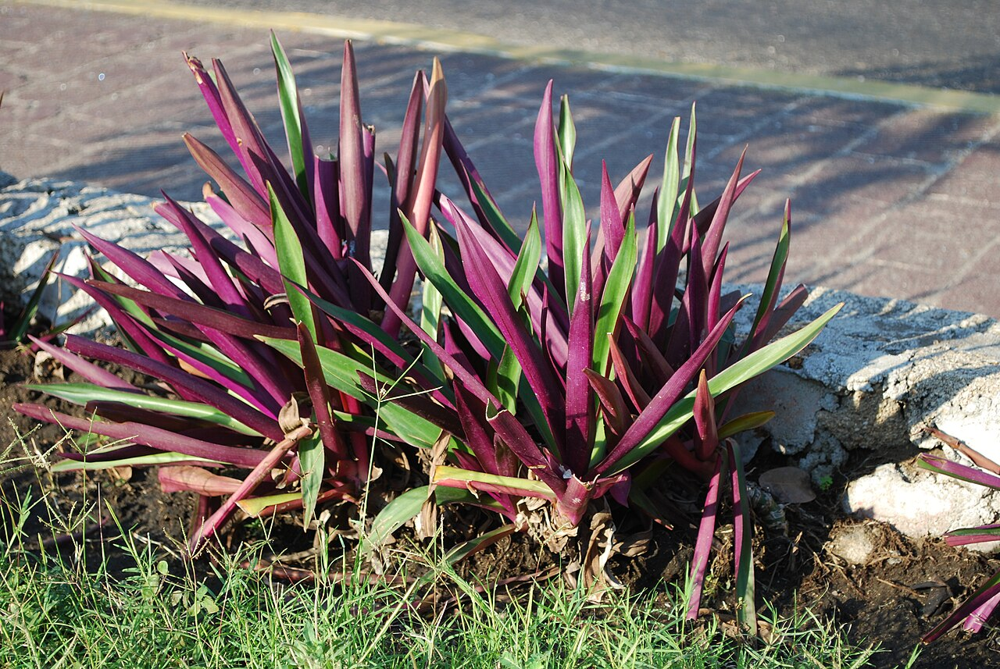
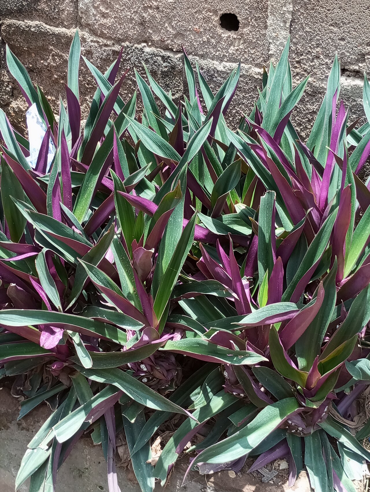
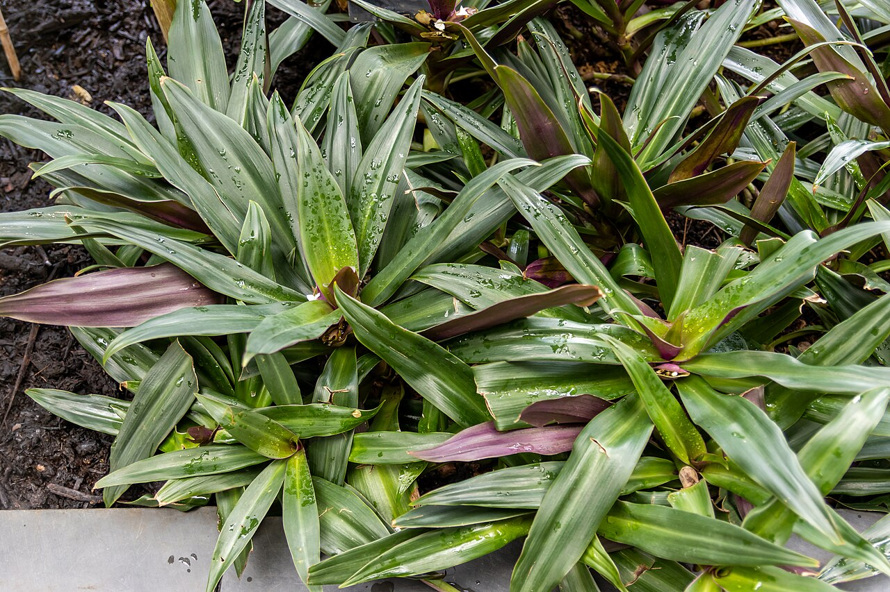
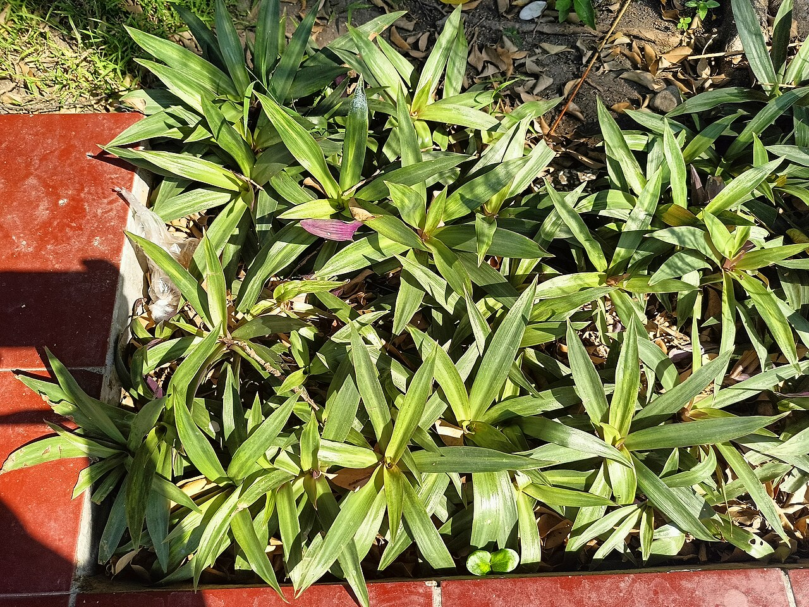
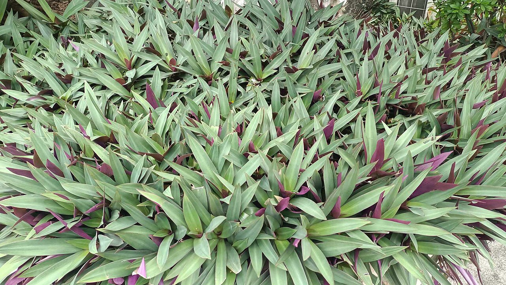

# Tricolor oyster plant photo archive

_Tradescantia spathacea Tricolor_ - Houseplant-04

Collection label ID: `#8`.

Species-reference photographs may show normal green-purple Tradescantia spathacea; none is assumed to show the nursery-labelled Tricolor cultivar.

Collection research: [open the plant profile](../../../docs/plants/houseplants/tradescantia-spathacea-tricolor.md).

## Gallery

_habitat_ - [Tradescantia spathacea reference observation](https://www.inaturalist.org/observations/104689689); (c) Ricard Busquets Reverte, some rights reserved (CC BY); [CC BY](https://creativecommons.org/licenses/by/4.0/).

_habitat_ - [Tradescantia spathacea reference observation](https://www.inaturalist.org/observations/3749680); (c) Tereka Lasso, some rights reserved (CC BY-SA); [CC BY-SA](https://creativecommons.org/licenses/by-sa/4.0/).

_habitat_ - [Tradescantia spathacea reference observation](https://www.inaturalist.org/observations/72551818); (c) Norman Salazar Arguedas, some rights reserved (CC BY-SA); [CC BY-SA](https://creativecommons.org/licenses/by-sa/4.0/).

_habitat_ - [Tradescantia spathacea reference observation](https://www.inaturalist.org/observations/98868799); (c) Alexis López Hernández, some rights reserved (CC BY); [CC BY](https://creativecommons.org/licenses/by/4.0/).

_habit_ - [Moses in the cradle.jpg](https://commons.wikimedia.org/wiki/File:Moses_in_the_cradle.jpg); Jayachandranjay; [CC BY-SA 4.0](https://creativecommons.org/licenses/by-sa/4.0).

_habit_ - [PlantMaleconAcapulco.JPG](https://commons.wikimedia.org/wiki/File:PlantMaleconAcapulco.JPG); AlejandroLinaresGarcia; [CC BY-SA 4.0](https://creativecommons.org/licenses/by-sa/4.0).

_habit_ - [Moses-in-the-cradle plant, April 2023.jpg](https://commons.wikimedia.org/wiki/File:Moses-in-the-cradle_plant,_April_2023.jpg); Grace789; [CC BY-SA 4.0](https://creativecommons.org/licenses/by-sa/4.0).

_habit_ - [At Royal Botanic Gardens, Kew 2024 234.jpg](https://commons.wikimedia.org/wiki/File:At_Royal_Botanic_Gardens,_Kew_2024_234.jpg); Photograph by Mike Peel ( [www.mikepeel.net](https://www.mikepeel.net) ).; [CC BY-SA 4.0](https://creativecommons.org/licenses/by-sa/4.0).

_habit_ - [Kebon Rojo Jombang-11.jpg](https://commons.wikimedia.org/wiki/File:Kebon_Rojo_Jombang-11.jpg); Indonesiagood; [CC BY-SA 4.0](https://creativecommons.org/licenses/by-sa/4.0).

_habitat_ - [Group of Oyster Plants.jpg](https://commons.wikimedia.org/wiki/File:Group_of_Oyster_Plants.jpg); Bim24; [CC0](https://creativecommons.org/publicdomain/zero/1.0/deed.en).

## File details

| File                                                                                         | Subject | Source                                                                                                  | Creator                                                                   | License                                                          |
| -------------------------------------------------------------------------------------------- | ------- | ------------------------------------------------------------------------------------------------------- | ------------------------------------------------------------------------- | ---------------------------------------------------------------- |
| [inaturalist-104689689-175474740-habitat.jpg](./inaturalist-104689689-175474740-habitat.jpg) | habitat | [iNaturalist](https://www.inaturalist.org/observations/104689689)                                       | (c) Ricard Busquets Reverte, some rights reserved (CC BY)                 | [CC BY](https://creativecommons.org/licenses/by/4.0/)            |
| [inaturalist-3749680-4362632-habitat.jpg](./inaturalist-3749680-4362632-habitat.jpg)         | habitat | [iNaturalist](https://www.inaturalist.org/observations/3749680)                                         | (c) Tereka Lasso, some rights reserved (CC BY-SA)                         | [CC BY-SA](https://creativecommons.org/licenses/by-sa/4.0/)      |
| [inaturalist-72551818-118307308-habitat.jpg](./inaturalist-72551818-118307308-habitat.jpg)   | habitat | [iNaturalist](https://www.inaturalist.org/observations/72551818)                                        | (c) Norman Salazar Arguedas, some rights reserved (CC BY-SA)              | [CC BY-SA](https://creativecommons.org/licenses/by-sa/4.0/)      |
| [inaturalist-98868799-164707586-habitat.jpg](./inaturalist-98868799-164707586-habitat.jpg)   | habitat | [iNaturalist](https://www.inaturalist.org/observations/98868799)                                        | (c) Alexis López Hernández, some rights reserved (CC BY)                  | [CC BY](https://creativecommons.org/licenses/by/4.0/)            |
| [commons-118932177-habit.jpg](./commons-118932177-habit.jpg)                                 | habit   | [Wikimedia Commons](https://commons.wikimedia.org/wiki/File:Moses_in_the_cradle.jpg)                    | Jayachandranjay                                                           | [CC BY-SA 4.0](https://creativecommons.org/licenses/by-sa/4.0)   |
| [commons-12657026-habit.jpg](./commons-12657026-habit.jpg)                                   | habit   | [Wikimedia Commons](https://commons.wikimedia.org/wiki/File:PlantMaleconAcapulco.JPG)                   | AlejandroLinaresGarcia                                                    | [CC BY-SA 4.0](https://creativecommons.org/licenses/by-sa/4.0)   |
| [commons-131235720-habit.jpg](./commons-131235720-habit.jpg)                                 | habit   | [Wikimedia Commons](https://commons.wikimedia.org/wiki/File:Moses-in-the-cradle_plant,_April_2023.jpg)  | Grace789                                                                  | [CC BY-SA 4.0](https://creativecommons.org/licenses/by-sa/4.0)   |
| [commons-147134966-habit.jpg](./commons-147134966-habit.jpg)                                 | habit   | [Wikimedia Commons](https://commons.wikimedia.org/wiki/File:At_Royal_Botanic_Gardens,_Kew_2024_234.jpg) | Photograph by Mike Peel ( [www.mikepeel.net](https://www.mikepeel.net) ). | [CC BY-SA 4.0](https://creativecommons.org/licenses/by-sa/4.0)   |
| [commons-150670992-habit.jpg](./commons-150670992-habit.jpg)                                 | habit   | [Wikimedia Commons](https://commons.wikimedia.org/wiki/File:Kebon_Rojo_Jombang-11.jpg)                  | Indonesiagood                                                             | [CC BY-SA 4.0](https://creativecommons.org/licenses/by-sa/4.0)   |
| [commons-157687622-habitat.jpg](./commons-157687622-habitat.jpg)                             | habitat | [Wikimedia Commons](https://commons.wikimedia.org/wiki/File:Group_of_Oyster_Plants.jpg)                 | Bim24                                                                     | [CC0](https://creativecommons.org/publicdomain/zero/1.0/deed.en) |

Metadata and SHA-256 hashes are also available in [the global manifest](../photo-manifest.json).
