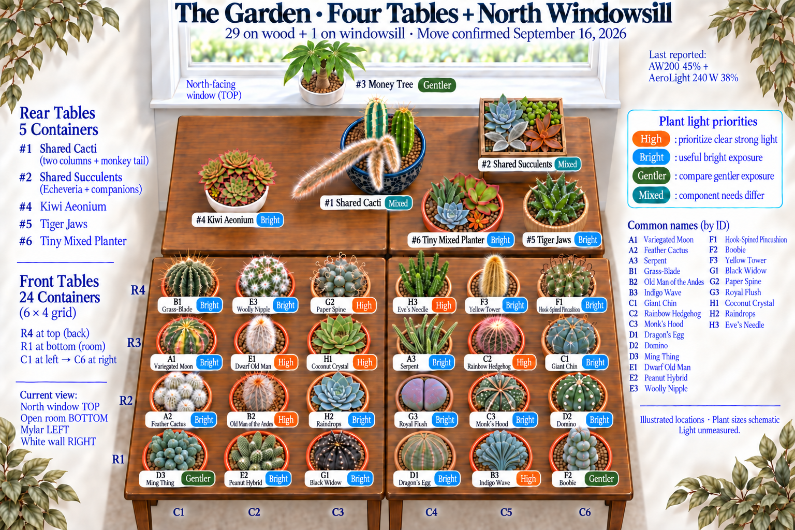
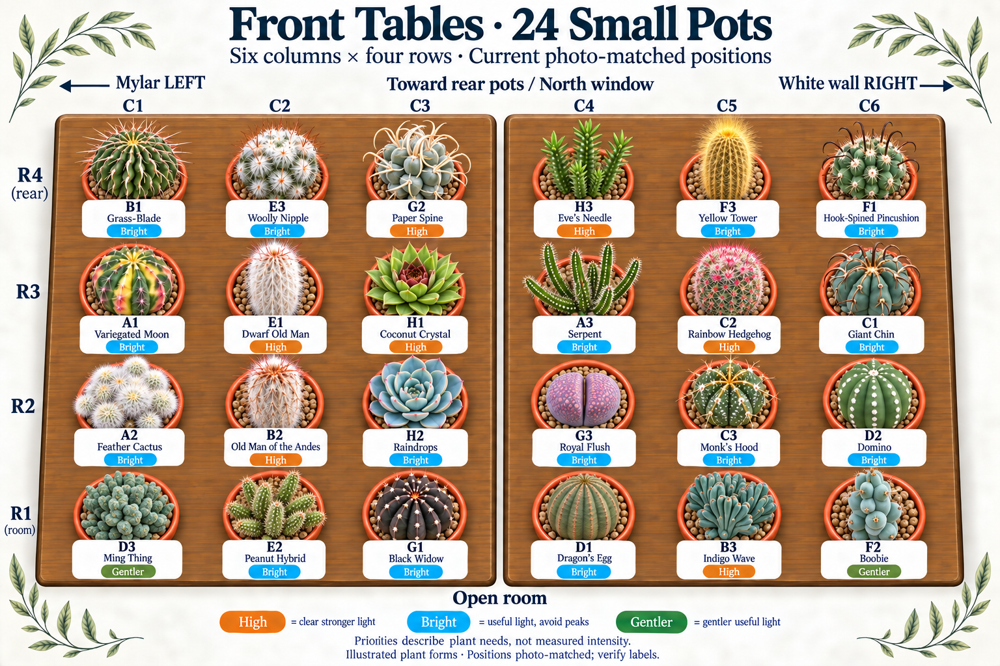
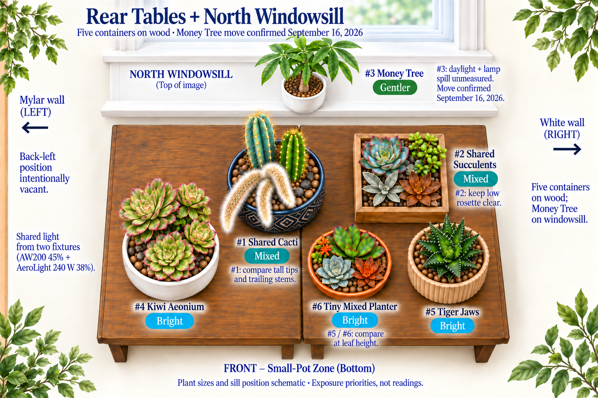
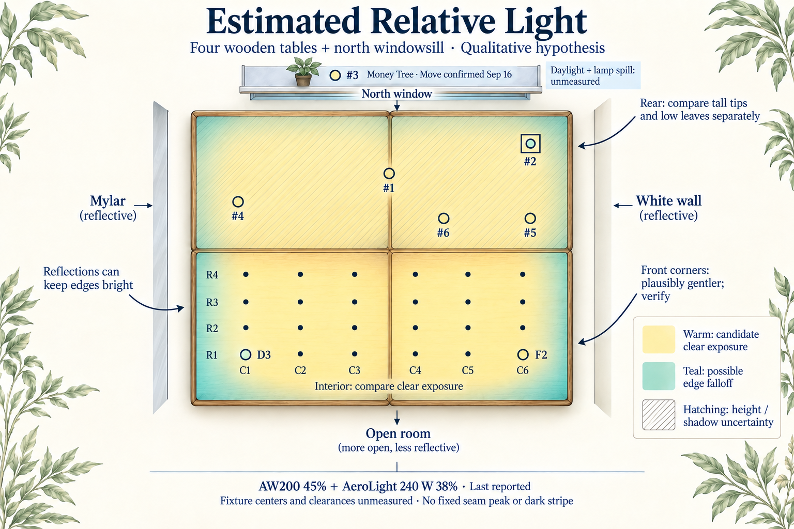
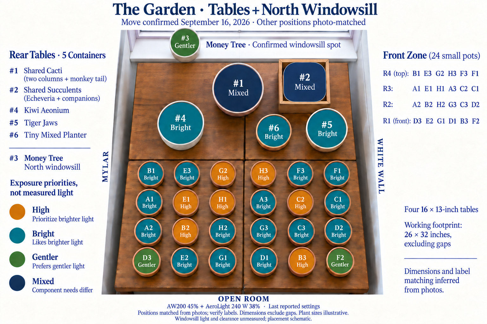
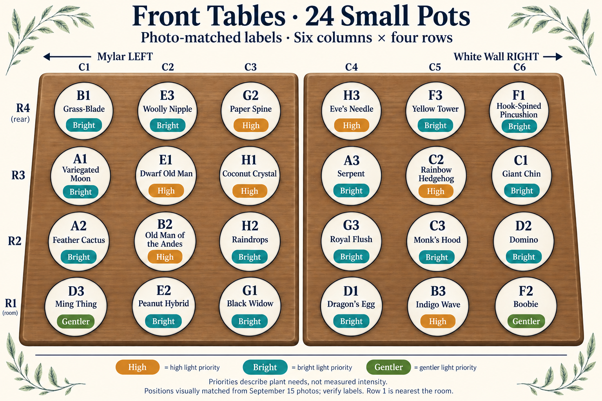
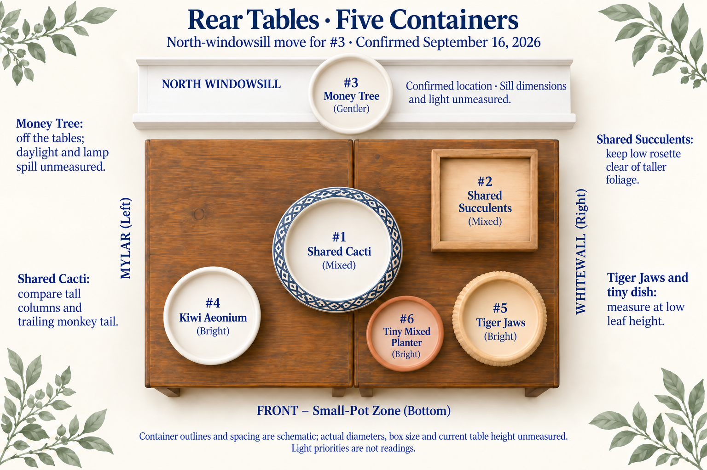

# Table Placement Guide

## Current scope

The collection contains **34 tracker allocations**: 30 with established positions, two September 20 houseplants currently on the room-side floor near the money tree, and the September 21 Lithops shared-pot and split-rock additions awaiting planting and final placement. Separate floor pot stools remain planned, off the tables; final stool positions and leaf-height exposure are unmeasured. The unreceived September 19 Amazon additions were withdrawn September 20 and preserved as an [old plan](../old-plans/amazon-plant-order-2026-09.md); cancellation was confirmed in Amazon on September 21. The abandoned Amazon plants have no active pot allocation or position. The decorated pot is one of the two Amazon Basics destinations, with its specific plant assignment unconfirmed; no repot into it is inferred from either purchase. Existing cactus positions, fixtures, and weight references are unchanged.

## September 21 additions awaiting placement

P35 / #9 [Lithops shared planter](../plants/succulents/lithops-shared-planter.md) and P36 / #10 [Split rock](../plants/succulents/pleiospilos-nelii.md) have no recorded current or final position. The owner assigned both Lithops pairs to the D'vine Dev selected 4.3-inch Blush Mauve pot and the split rock to the Thirtypot selected 4.5-inch speckled-brown pot on September 21. Repots and follow-up photographs are planned for September 22. Keep them off the established placement grid until the owner records a location. Pot arrival, root room, leaf stage, and gradual light acclimation need checking before choosing a spot; no DLI target or measured exposure is assigned by this record.

## September 20 houseplant purchases

**P31 / #7 [Peperomia Bicolor](../plants/houseplants/peperomia-obtipan-bicolor.md)** and **P32 / #8 [Tricolor oyster plant](../plants/houseplants/tradescantia-spathacea-tricolor.md)** were purchased on September 20. The owner confirmed purchasing both directly at Carlson's Greenhouses in owner-reported six-inch nursery pots; the tags also identify Carlson's as the grower. Both nursery tags say **bright, indirect light**. They remain in their owner-reported six-inch nursery pots. The owner reports both nursery pots are quite full and thinks the plants are ready for larger pots. The owner confirms two Amazon Basics eight-inch destination pots with many drainage holes; separate floor pot stools are planned, explicitly off the tables; the ordered [Bamworld three-pack in Nature](https://www.amazon.com/dp/B0GTHQRZSL) is due September 21 (4:45–6:45 p.m. delivery estimate). The seller describes pine stools with heights of 7.8, 8.6, and 11.5 inches; these are listing dimensions, not measurements. Receipt, final positions, and which stool supports each pot remain unconfirmed. Both plants are currently on the floor on the room side near the money tree; no repot or installation on stools is reported. Current nursery-pot depth, drainage, medium, and leaf-height light remain unmeasured or unrecorded. The nursery did not provide watering or fertilizer history; wet foliage at purchase does not establish that the root ball was watered. The proposed mix combines owner-described airy, perlite-containing loose greenhouse mix with Molly's; more perlite is available, but no ratio is chosen. Neither is automatically assigned the decorated eight-inch pot; the abandoned Amazon placement was never implemented.

### Planned living-room window and LEDs

On **September 21**, the owner plans to move **P31 and P32 to a north-facing window in the living room**, with supplemental light from **two owner-described 10 W LED bars and one additional 10 W LED light** already owned. This is a separate destination from P21 Money Tree's recorded windowsill in the cactus room. The move, lamp installation, stool assignments, timer, and lamp-to-leaf distances are not yet confirmed. Brands/models, spectrum, actual power draw, and coverage remain unverified. The possible **20 W three-head lights** are an upgrade under consideration; whether that rating is total or per head is unknown.

Try the existing lights before choosing an upgrade. Both plants have bright-indirect nursery guidance; low-light survival is not the same as compact, well-colored growth. NC State qualifies Peperomia's low-light tolerance as especially applicable to non-variegated cultivars and warns that insufficient light can make oyster plants lanky and less purple. Give the oyster plant priority for the stronger measured position, while checking both canopies.

Use leaf-height measurements to choose a gentler starting exposure. The following are **conservative collection-specific trial ranges inferred from bright-indirect care guidance**, not published cultivar thresholds or measurements. Iowa State's broader foliage-houseplant categories are 3–6 DLI for low light and 6–10 for medium light; those categories support the comparison without establishing an exact requirement for either cultivar.

| Plant                          | Initial comparison range | Possible settled range after acclimation                |
| ------------------------------ | ------------------------ | ------------------------------------------------------- |
| P31 / #7 Peperomia Bicolor     | About 4–6 mol·m⁻²·day⁻¹  | About 6–10, if new growth remains compact and undamaged |
| P32 / #8 Tricolor oyster plant | About 6–8 mol·m⁻²·day⁻¹  | About 8–12, if new growth remains compact and undamaged |

The previously reported far-table **18–22 app-estimated DLI** is above these proposed starting comparisons and is not the default new-arrival spot. It is not a measured burn threshold either. Increase exposure gradually only after observing the plants and their root-zone moisture. Keep phone/app estimates distinct from calibrated PAR measurements, and do not change the existing light settings merely to fit a newly purchased basket. Species care evidence and the limits of the inference are linked in each profile.

For the new room, a **12–14-hour daytime light window** is a reasonable initial trial, consistent with University of Minnesota foliage-houseplant guidance. The timer has not been set. The old cactus-room 13 h 15 m program does not establish this setup's runtime. The higher settled ranges above are optional comparisons, not a schedule for increasing light when growth is already satisfactory.

For those initial DLI ranges, the equivalent constant PPFD is approximately as follows, in **µmol·m⁻²·s⁻¹**:

| Pot      | 12-hour PPFD | 14-hour PPFD |
| -------- | ------------ | ------------ |
| P31 / #7 | 93–139       | 79–119       |
| P32 / #8 | 139–185      | 119–159      |

These PPFD equivalents assume constant light throughout the stated hours. **DLI = average PPFD × hours × 0.0036**; for example, 100 PPFD for 14 hours supplies 5.04 DLI. The intended comparison is the total from lamps plus daylight, so the lamps need not supply the entire dose where measured daylight contributes meaningfully.

1. Measure the LEDs alone after dark at representative upper, outer, and shaded leaf positions on both plants, recording distance, dimming, and runtime. The owned **UNI-T UT383BT with Android PPFD Meter** can provide useful estimates; retain raw lux and the app's spectrum setting, because its conversion is not a calibrated PAR measurement.
2. Assess daylight separately over the day, including a dim or overcast day. A noon window-plus-LED reading multiplied by the lamp timer overstates variable daylight. Repeat the comparison as winter daylight changes.
3. Position the bars to cover the foliage and use the third light where readings show a gap. Moving lamps closer can raise local intensity while shrinking coverage; check the outer leaves as well as the brightest point. Use the exact model's clearance guidance before choosing a distance, and keep leaves clear of hot fixtures and cold window glass.
4. Upgrade only if practical placement and a 12–14-hour daytime window leave substantial foliage underlit or subsequent growth supports a need for more light. Compare actual model output and coverage: a three-head design or a higher watt label alone does not establish improvement. Acclimate gradually and watch for stretching, weaker color, bleaching, or scorch.

The living-room plan does not establish its temperature, humidity, airflow, or drying rate. Observe those conditions after the move and retain the existing houseplant moisture checks; moving alone does not reset a pot's weighing setup.

## Photographed Arrangement

The owner added **two new 16 × 13-inch wooden tables** and rearranged the display on **September 15, 2026**. The supplied photos show **24 small pots in six columns × four rows at the room end**, with the six larger or shared containers behind them toward the window. This replaces the previous two-table and round-glass placement plan.

**North-windowsill move confirmed September 16:** the owner confirmed that **#3 / P21 Money Tree is now on the north-facing windowsill**, off the rear-left table. The move was planned on September 15 after the owner noticed downward-pointing leaves; its exact completion time was not supplied. The established arrangement has **29 containers on wood (24 small pots at the front and five larger/shared containers behind them), plus one money tree on the windowsill**. The two September 20 houseplant purchases add P31 and P32, currently on the room-side floor near the money tree. Their separate floor stools and eight-inch repots are planned; final positions and leaf-height exposure remain unmeasured. Apart from the later confirmed A3/F1 exchange described below, the other positions stay as photographed, including #4 Kiwi Aeonium; the vacated table spot stays open. The supplied photo predates the move. Excess light remains the owner's suspected cause, not a diagnosis established by leaf posture. Sill dimensions, exact position within the sill, daylight, lamp spill and leaf-height clearance remain unmeasured.

The working footprint is **four tables in a 2 × 2 block, nominally 26 inches across × 32 inches toward the window**, excluding gaps and rails. That orientation is inferred from the photographs, not a new tape measurement. The owner confirmed September 20 that the former round glass display table is gone and no longer in use; it was approximately 30 years old, with model unknown. The new tables' height has not been measured; the earlier pair was 18 inches high.

For easier comparison with the photographs, this page now faces the window: **window at top, open room at bottom, Mylar divider at left, white wall at right**. This is a 90-degree rotation of the old drawing, not a changed compass direction. The window is still north-facing with weak supplementary daylight, and the two-foot room-end reflector remains absent.

**Last reported light settings:** AW200 **45%**, AeroLight 240 W **38%**, **Veg mode on both**, with **13 h 15 m total**, including **15 m sunrise and 15 m sunset**. The earlier **18-inch tip reference**, four independent ceiling hooks and separate hangers remain the last operating record; the new photos do not remeasure clearance or fixture centers. Check the new footprint before carrying over the old one-inch margins or ½–1-inch gap as current geometry.

## Owner Light Readings and Confirmed Swap

The owner supplied **48 lux-derived estimated PPFD readings at individual plant heights**, rather than at one common level plane. The supplied map is viewed **from the room side facing the window, with Ming Thing at its top-left**. Do not rotate or transpose those readings into the older illustration's coordinate system without a verified point-to-pot mapping. The measurement date was not supplied.

Across the **whole mapped rectangle, including the intentionally unlit far edge**, the app estimates range from **145 to 677 µmol·m⁻²·s⁻¹**. Its **13-hour DLI calculation** ranges from **6.8 to 31.7 mol·m⁻²·day⁻¹**. These are approximate phone/lux-sensor/app conversions, not calibrated PAR measurements or species thresholds. Height, shadows, and spectrum affect the comparison; the extrema do not describe every occupied pot or prove that the whole display has too little or too much light. The actual program remains **13 h 15 m total, including 15 m sunrise and 15 m sunset**; the app's 13-hour DLI output is not a measured daily light integral through those ramps.

After reviewing that evidence, the owner confirmed **only A3 Serpent Cactus and F1 Hook-spined Pincushion exchanged positions**. Each now occupies the other's former position; all other pots stay put, including #3 / P21 Money Tree on the north windowsill. No further move or dimmer change is prescribed here. The old illustrations below predate this exchange and the reading set; the written grid includes the exchange. The readings do not establish post-swap exposure for different-height plants at their new spots, or a separate windowsill measurement for #3.

## Illustrated Views

These charts record the botanical illustration style requested on September 16 and the confirmed windowsill move. **They predate the owner-confirmed A3/F1 exchange and the later light readings; use the corrected written grid below for that exchange.** Plant forms and sizes are illustrative; the written coordinates and retained identity qualifiers below remain the reference. Light-priority badges describe plant needs, not measured intensity. The original arrangement diagrams remain in their sections below.

### Illustrated Whole Display

### Illustrated Front Pots

### Illustrated Rear Pots and Windowsill

### Illustrated Relative Light

The [generation prompts and illustration limits](../../assets/layouts/2026-09-16-illustrated/image-prompts.md) record the style references and current-data constraints. The [original reference map](../../assets/layouts/2026-09-15-four-tables/estimated-light-map.png) and its [transparent-background copy](../../assets/layouts/2026-09-16-illustrated/estimated-light-map-transparent.png) remain available as downloads.

## Reading the Light Map

The illustrated map is the **earlier qualitative comparison hypothesis**, not measured lux, PPFD, a simulation, or proof of adequate coverage. The old glass-spill gradient and old R1C1/R6C1 corner ranking are retired. The later owner reading set is summarized above; the illustration has not been regenerated from those readings. Two panels can light the new block, but the larger wooden footprint does not create more light. Exact fixture alignment over it is not established by these cropped photographs.

| Area                       | Working Expectation                                                                         | What to Compare                                                                           |
| -------------------------- | ------------------------------------------------------------------------------------------- | ----------------------------------------------------------------------------------------- |
| Interior small-pot area    | Clear exposure is plausible where the lamps overlap the display; no precise peak is assumed | C2, B2, H1, H2 and G3 at a common height, then their actual growing surfaces              |
| Front corners, D3 and F2   | Plausibly gentler than nearby interior positions, still potentially bright                  | Both corners against front-center G1/D1 and the middle of the display                     |
| Mylar and white-wall sides | Reflections may reduce edge falloff; neither side is guaranteed dim                         | Left and right readings at matching depth and height                                      |
| Back row of small pots     | Large rear plants may cast local shadows, independent of fixture coverage                   | B1, E3, G2, H3, F3 and A3; especially beneath trailing stems                              |
| Rear containers            | Mixed heights and foliage matter more than a simple front/back gradient                     | Tall #1 tips, low #2 rosette, #4 canopy and low #5/#6                                     |
| North windowsill, #3       | Separate daylight and possible lamp spill; outside the table heatmap                        | Actual upper and lower leaf exposure, time and blinds; no assumed equivalent table height |
| Fixture join               | Spill may fill a small gap; no dark stripe or hottest stripe is assumed                     | A short comparison across the actual join after locating it                               |

Keep the confirmed windowsill position for #3 and the A3/F1 exchange. The following comparison questions record the earlier reasoning; they are not additional move recommendations. The strongest placement question is whether **B3 Indigo Wave at the front** has sufficient clear light and whether **H1 Coconut Crystal in the interior** is shaded. Do not automatically exchange them: they have different heights and both need useful exposure. D3 and F2 occupy opposite front corners, rather than the two left corners of the old drawing. Their benefit is an inference to test.

Six nominal 4-inch rims span about 24 inches across the nominal 26-inch front width. Four rows span about 16 inches of nominal front-table depth, leaving little margin for rails, larger rims and foliage. Keep bases fully supported and access possible; a diagram cannot certify the fit. The larger rear pot dimensions are not newly measured.

## Whole Display

Except for the owner-confirmed #3 windowsill position and A3/F1 exchange, positions below are **matched visually from the owner's photographs**, not a new botanical identification or a claim that every printed label was legible. The owner confirms rearranging the display; the label-to-slot transcription and nominal table orientation remain to be checked. Existing P-IDs and identity qualifiers are preserved.

## Front Tables: Six Columns, Four Rows

Columns run **left/Mylar → right/white wall**. Rows run **front/room → back/window**, so **row 4 is above row 1 in the overhead image**. These are the retained photo-grid coordinates, updated only for the confirmed A3/F1 exchange. They replace the old 4-column × 6-row coordinates; identical R/C text does not imply an unchanged position. They do not assign coordinates to the owner's separate 48-reading map.

| Row                  | C1 · Mylar           | C2                        | C3                   | C4                          | C5                    | C6 · White Wall |
| -------------------- | -------------------- | ------------------------- | -------------------- | --------------------------- | --------------------- | --------------- |
| 1 · Room edge        | D3 · Ming Thing      | E2 · Peanut Hybrid        | G1 · Black Widow     | D1 · Dragon's Egg           | B3 · Indigo Wave      | F2 · Boobie     |
| 2                    | A2 · Feather Cactus  | B2 · Old Man of the Andes | H2 · Raindrops       | G3 · Royal Flush            | C3 · Monk's Hood      | D2 · Domino     |
| 3                    | A1 · Variegated Moon | E1 · Dwarf Old Man        | H1 · Coconut Crystal | F1 · Hook-Spined Pincushion | C2 · Rainbow Hedgehog | C1 · Giant Chin |
| 4 · Toward rear pots | B1 · Grass-Blade     | E3 · Woolly Nipple        | G2 · Paper Spine     | H3 · Eve's Needle           | F3 · Yellow Tower     | A3 · Serpent    |

## Light Priorities

These overlapping priorities describe plant needs, not measured intensity bands. A High plant can be overexposed and a Bright plant may tolerate sun. The [full plant-by-plant review](../two-light-placement-review.md) retains the species evidence and identification limits.

| Priority        | Pots                                                                   | Practical Meaning                                                                                                  |
| --------------- | ---------------------------------------------------------------------- | ------------------------------------------------------------------------------------------------------------------ |
| **High · 7**    | B2, B3, C2, E1, G2, H1, H3                                             | Preserve clear strong light; compare low H1 and front-row B3 rather than declaring every center best               |
| **Bright · 18** | A1, A2, A3, B1, C1, C3, D1, D2, E2, E3, F1, F3, G1, G3, H2; #4, #5, #6 | Useful bright exposure while avoiding excessive peaks; this is not a shade designation                             |
| **Gentler · 3** | D3, F2, #3                                                             | A bright position with less intense exposure when demonstrated; no assumption that an edge is automatically gentle |
| **Mixed · 2**   | #1, #2                                                                 | Consider each living component at its height while retaining one tracked container                                 |

## Every Small Pot

| Label | Plant and Retained Identification                                                                                                       | Photo-Matched Spot and Light Priority                                                                                                                                                           |
| ----- | --------------------------------------------------------------------------------------------------------------------------------------- | ----------------------------------------------------------------------------------------------------------------------------------------------------------------------------------------------- |
| A1    | [Variegated moon cactus](../plants/starter/gymnocalycium-mihanovichii-variegated.md) · _Gymnocalycium mihanovichii_                     | **R3C1 · Bright.** Left shoulder between Feather and Grass-Blade. Preserve useful light for this rooted, chlorophyll-bearing variegated selection.                                              |
| A2    | [Feather cactus](../plants/starter/mammillaria-plumosa.md) · _Mammillaria plumosa_                                                      | **R2C1 · Bright.** Left shoulder; its white covering does not mean it requires the strongest exposure.                                                                                          |
| A3    | [Serpent cactus](../plants/starter/nyctocereus-serpentinus.md) · _Nyctocereus serpentinus_                                              | **R4C6 · Bright.** Owner-confirmed exchange into F1's former slot. Compare its own stem-height exposure; the previous occupant's reading does not establish this taller plant's new exposure.   |
| B1    | [Grass-blade cactus](../plants/starter/stenocactus-phyllacanthus.md) · _Stenocactus phyllacanthus_                                      | **R4C1 · Bright.** Preserve clear bright exposure; a photo position is not a measured light level.                                                                                              |
| B2    | [Old Man of the Andes](../plants/starter/oreocereus-trollii.md) · _Oreocereus trollii_                                                  | **R2C2 · High.** Interior-left position with clear exposure at its growing tip; do not compare only tabletop light.                                                                             |
| B3    | [Indigo Wave](../plants/starter/myrtillocactus-geometrizans-indigo-wave.md) · _Myrtillocactus geometrizans_ 'Indigo Wave'               | **R1C5 · High.** Front row near the right. Retain this slot; no additional exchange was confirmed after the owner's light comparison.                                                           |
| C1    | [Giant chin](../plants/starter/gymnocalycium-saglionis.md) · _Gymnocalycium saglionis_                                                  | **R3C6 · Bright.** Preserve clear bright exposure; a photo position is not a measured light level.                                                                                              |
| C2    | [Rainbow hedgehog](../plants/starter/echinocereus-rigidissimus-rubispinus.md) · _Echinocereus rigidissimus_ subsp. _rubispinus_         | **R3C5 · High.** Interior-right stronger-light priority. Keep a clear overhead path rather than assuming this cell is the maximum.                                                              |
| C3    | [Monk's hood](../plants/starter/astrophytum-ornatum.md) · _Astrophytum ornatum_                                                         | **R2C5 · Bright.** Preserve clear bright exposure; a photo position is not a measured light level.                                                                                              |
| D1    | [Dragon's Egg](../plants/starter/euphorbia-obesa-hybrid.md) · probable _Euphorbia obesa_-type hybrid or selection                       | **R1C4 · Bright.** Front-center probable Euphorbia hybrid. A bright position is appropriate; its exact species and maximum tolerance remain uncertain.                                          |
| D2    | [Domino](../plants/starter/echinopsis-subdenudata.md) · _Echinopsis subdenudata_                                                        | **R2C6 · Bright.** Preserve clear bright exposure; a photo position is not a measured light level.                                                                                              |
| D3    | [Ming Thing](../plants/starter/cereus-forbesii-ming-thing.md) · _Cereus forbesii_ 'Ming Thing'                                          | **R1C1 · Gentler.** Front-left, where a gentler edge is plausible. Mylar can still return substantial light; this is not shade.                                                                 |
| E1    | [Dwarf old man](../plants/cacti/espostoa-melanostele-nana.md) · _Espostoa_ sp., likely _E. melanostele_ subsp. _nana_                   | **R3C2 · High.** Interior-left tall white cactus; retain the qualified Espostoa identification and avoid shading H1.                                                                            |
| E2    | [Peanut hybrid](../plants/cacti/chamaelobivia-hybrid.md) · _Echinopsis_ hybrid, Chamaelobivia Group                                     | **R1C2 · Bright.** Front row, second from the Mylar. Unknown hybrid parentage limits exact exposure claims.                                                                                     |
| E3    | [Woolly nipple](../plants/cacti/mammillaria-mammillaris.md) · probable _Mammillaria mammillaris_                                        | **R4C2 · Bright.** Back row of small pots. Preserve the probable Mammillaria identification and check shadow from Kiwi or #1.                                                                   |
| F1    | [Hook-spined pincushion](../plants/cacti/mammillaria-rekoi.md) · _Mammillaria_ cf. _rekoi_                                              | **R3C4 · Bright.** Owner-confirmed exchange into A3's former slot. Preserve the cf. rekoi identification; the previous occupant's reading does not establish this shorter plant's new exposure. |
| F2    | [Boobie cactus](../plants/cacti/myrtillocactus-geometrizans-fukurokuryuzinboku.md) · _Myrtillocactus geometrizans_ 'Fukurokuryuzinboku' | **R1C6 · Gentler.** Front-right corner. Compare its actual tip exposure before calling this gentler; small pot size does not prove juvenile age.                                                |
| F3    | [Yellow tower](../plants/cacti/parodia-leninghausii.md) · _Parodia leninghausii_                                                        | **R4C5 · Bright.** Back-right taller cactus; compare its tip separately from nearby plants at their actual heights.                                                                             |
| G1    | [Black Widow](../plants/cacti/gymnocalycium-mihanovichii-black-widow.md) · _Gymnocalycium mihanovichii_ f. variegata 'Black Widow'      | **R1C3 · Bright.** Front-center bright position; dark color and variegation do not establish a shade requirement.                                                                               |
| G2    | [Paper spine](../plants/cacti/tephrocactus-articulatus-papyracanthus.md) · _Tephrocactus articulatus_ var. _papyracanthus_              | **R4C3 · High.** Back row of small pots, close to the trailing shared cactus. Avoid shadow or contact from the monkey tail.                                                                     |
| G3    | [Royal Flush split rock](../plants/succulents/pleiospilos-nelii-royal-flush.md) · _Pleiospilos nelii_ 'Royal Flush'                     | **R2C4 · Bright.** Low central split rock. Compare rosette-height exposure and retain its leaf-cycle watering restrictions.                                                                     |
| H1    | [Coconut Crystal](../plants/succulents/sempervivum-coconut-crystal.md) · _Sempervivum_ Colorockz® 'Coconut Crystal'                     | **R3C3 · High.** Low central rosette. Compare the growing surface for shadows from E1 and the rear shared cactus; strong light does not mean maximum heat.                                      |
| H2    | [Raindrops](../plants/succulents/echeveria-raindrops.md) · _Echeveria_ 'Raindrops'                                                      | **R2C3 · Bright.** Low interior-left rosette. Keep clear bright light, without automatically assigning it the strongest intensity.                                                              |
| H3    | [Eve's needle](../plants/cacti/austrocylindropuntia-subulata.md) · _Austrocylindropuntia subulata_                                      | **R4C4 · High.** Back row of small pots, near the shared cactus; preserve clear light and separation from trailing stems.                                                                       |

## Rear Tables and North Windowsill

| Label / P-ID | Container          | Position Record                            | Shape and Size Record                                                                                            | Exposure Priority                                                                                                       |
| ------------ | ------------------ | ------------------------------------------ | ---------------------------------------------------------------------------------------------------------------- | ----------------------------------------------------------------------------------------------------------------------- |
| #1 / P19     | Shared Cacti       | Rear center                                | Dark patterned round pot; current diameter unmeasured                                                            | **Mixed.** Compare both tall columns and trailing monkey tail; pale tissue and short neighbors need separate attention. |
| #2 / P20     | Shared Succulents  | Rear right, toward window                  | Square wooden box with plastic liner; owner confirms one-inch hole through both bottoms; side lengths unmeasured | **Mixed.** Keep the low Echeveria exposed beneath the taller Portulacaria and Kalanchoe foliage.                        |
| #3 / P21     | Money Tree         | **Confirmed north windowsill, off tables** | White round pot, previously recorded 6-inch class                                                                | **Gentler.** Compare actual leaf exposure on the sill; daylight and lamp spill are unmeasured.                          |
| #4 / P22     | Kiwi Aeonium       | Rear left; unchanged after #3's move       | White round pot, previously recorded about 5-inch class                                                          | **Bright.** Keep substantial lamp contribution without allowing its canopy to shade the small pots.                     |
| #5 / P29     | Tiger Jaws         | Rear right, in front of the square box     | Tan ribbed round pot; current repotted dimensions unmeasured                                                     | **Bright.** Retain probable Faucaria tuberculosa / seller F. tigrina qualifier; compare at leaf height.                 |
| #6 / P30     | Tiny Mixed Planter | Front of rear zone, between #1 and #5      | Shallow round terracotta dish, nominal 5-inch class                                                              | **Bright.** Compare the low rosettes and paddle leaves for shadows from the large pots.                                 |

Shared cactus #1 retains probable variegated Pilosocereus pachycladus, Cleistocactus colademononis and probable Echinopsis spachiana. The removed historical Mammillaria is not a fourth living component. Shared box #2 retains probable Echeveria pulidonis/hybrid, Portulacaria afra (possible 'Aurea' unconfirmed), probable Kalanchoe bracteata and Kalanchoe orgyalis. The tiny mixed dish's Echeveria, Sedum and Kalanchoe identifications remain provisional. Each shared container is one weigh-in.

## Money Tree: Confirmed North-Windowsill Spot

**#3 / P21 remains the same tracked pot**, with the working identification _Pachira_ cf. _glabra_ and its previously recorded white round 6-inch pot. The owner confirmed on September 16 that it is on the north-facing windowsill, outside the wooden display; the exact move time was not supplied. The drawing locates it schematically; it does not establish the sill's size, exact horizontal position, support or clearance. #4 Kiwi stays in its current rear-left spot; no replacement pot is assigned to the space #3 leaves.

The goal is useful indirect light with less direct fixture exposure. North-facing daylight and any remaining LED spill must be assessed at the actual leaves; the table heatmap does not predict the windowsill's light or prove that it will be sufficient. Keep foliage clear of cold glass and drafts, and keep the pot and drainage saucer fully supported.

Downward-pointing leaves are the owner's September 15 observation. Excess light is a possibility, not a confirmed cause. [NC State's money-tree guidance](https://plants.ces.ncsu.edu/plants/pachira-aquatica/) supports indirect light but describes _P. aquatica_, so it is a comparison rather than a new identification. [University of Maryland Extension](https://extension.umd.edu/resource/watering-indoor-plants) notes that both too little and too much water can cause wilting; leaf angle alone cannot distinguish these causes or establish that watering is due. Preserve the existing money-tree watering rules and observation history.

## Compare the Plan With a Phone Meter

For an optional future comparison, use the [blank reading sheet](../../assets/layouts/2026-09-15-four-tables/relative-readings.csv). It contains **24 front coordinates, five rear-container points and one separate windowsill point**, with no invented measurements. Send **four rows of six values**, with **row 1 nearest the room**, plus five rear points and the windowsill reading for #3. This is a useful setup comparison, not a new daily chore.

1. Use both fixtures at their usual steady settings, outside the sunrise/sunset ramps. Record which light is on which side, each spectrum mode, and the actual fixture positions. Keep blinds and daylight consistent, ideally with little daylight contribution.
2. Use the same phone, app, upward sensor orientation and any diffuser required by that app. Avoid shading it with your body. Let readings settle and repeat several positions; clipping or erratic values invalidate a ranking.
3. First compare the 29 table positions at **one recorded common horizontal height**, clear of obstructions where practical. Do not mix this pass with readings at different tip heights. Repeat **R2C3** before, during and after the pass to check drift.
4. Make a separate pass at actual growing-surface heights for D3, F2, A1, B3, C2, H1, H2, G3 and the five rear pots. For #1 compare the pale column, green column and trailing stems separately; for #2 compare low rosette and taller foliage. Record the height with each reading. Separately measure #3 at its actual leaves on the windowsill; use height above the sill as its reference and record daylight/blinds. Do not fold this different-height, mixed-daylight reading into the common-height table ranking.
5. Compare corners, interior and rear shadows. If values repeat within a small range, preserve spacing instead of chasing small differences. The completed comparison led only to the confirmed A3/F1 exchange. Keep other placements and settings unchanged; a future comparison should answer a specific remaining question rather than trigger another automatic reshuffle.

Lux measures illuminance, not lumens. Lux-to-PPFD conversion depends on spectrum; with two potentially different spectra, even a repeatable lux ratio is only an approximate relative comparison of plant-useful light. Do not invent a conversion factor or treat uniformity as proof that absolute intensity is suitable. See [Apogee's spectrum-dependent examples](https://www.apogeeinstruments.com/conversion-ppfd-to-lux/) and [University of Minnesota Extension](https://extension.umn.edu/garden-and-home/yard-and-garden/gardening-in-minnesota/lighting-for-indoor-plants).

## Care and Record Boundaries

This is a physical placement change, not a repot or watering event. **Keep the existing pot setups, wet/dry references and learned cycles.** Observe changed drying through useful weights; moving pots alone does not justify watering or weighing every pot daily. Money tree, Royal Flush, seasonal Kiwi and shared-container restrictions still apply. No live spreadsheet observation has been added by this documentation update.

## Sources

- **September 21 owner plan:** move P31/P32 to a living-room north-facing window; two 10 W LED bars and another 10 W light already owned, with close placement proposed and 20 W three-head alternatives considered. Exact models, installation, distances, and schedule were not supplied.
- [NC State: Peperomia obtusifolia](https://plants.ces.ncsu.edu/plants/peperomia-obtusifolia/) and [NC State: Tradescantia spathacea](https://plants.ces.ncsu.edu/plants/tradescantia-spathacea/): bright-indirect species guidance, qualified low-light tolerance, and oyster-plant stretching/color response. Neither supplies these cultivars' DLI thresholds.
- [Iowa State Extension: supplemental-light considerations](https://yardandgarden.extension.iastate.edu/how-to/growing-indoor-plants-under-supplemental-lights/important-considerations-providing-supplemental-light-indoor-plants): generic foliage DLI bands, PPFD conversion, and distance/coverage tradeoffs.
- [University of Minnesota Extension: lighting for indoor plants](https://extension.umn.edu/garden-and-home/yard-and-garden/gardening-in-minnesota/lighting-for-indoor-plants): foliage-houseplant light duration and the distinction between wattage and light received.

- **Move evidence:** September 15 owner report of downward-pointing money-tree leaves and a planned move to the north-facing windowsill, followed by owner confirmation on September 16 that the move is complete. The exact completion time was not supplied. No cause diagnosis was supplied. The later approximate table readings do not diagnose the money tree or establish its windowsill exposure. The only subsequent table exchange confirmed here is A3/F1.
- **Owner evidence:** September 15 purchase of two additional 16 × 13-inch tables and three supplied setup photographs. The 2 × 2 orientation, nominal 26 × 32-inch block and label matching are photo-based inferences; current gaps, heights and exact fixture centers remain unmeasured. Later light evidence is the owner's approximate 48-reading comparison above, not a calibrated PAR map.
- **Later owner evidence, measurement date not supplied:** 48 app-converted readings at individual plant heights, whole mapped rectangle range 145–677 estimated PPFD and 13-hour app DLI 6.8–31.7; includes the intentionally unlit far edge. Owner confirmed only the A3/F1 exchange.
- **Operating record:** September 13 installed lights, AW200 45%, AeroLight 240 W 38%, 18-inch tip reference and the shared 13 h 15 m cycle. See the [equipment record](../equipment/aw200-and-aerolight-240w.md), [AW200 manual][aw200] and [AeroLight manual][aerolight-240]. These settings are carried forward as last reported, not reread from the controllers.
- **Plant evidence:** the [source-by-source review](../two-light-placement-review.md), [plant profiles](../plants/), [inventory](../collection.md), [NC State Ming Thing][ming], [RHS Feather Cactus][feather], [RHS Rainbow Hedgehog][rainbow], [RHS Monk's Hood][monks-hood], [NC State Sempervivum][sempervivum] and [SANBI split rock][split-rock]. No identity or species-specific light requirement was changed from a layout photo.
- **Illustrations:** [generation prompts and evidence limits](../../assets/layouts/2026-09-15-four-tables/image-prompts.md). The [September 14 image set](../../assets/layouts/2026-09-14-relative-light/image-prompts.md) is historical and does not represent this new furniture arrangement.

[rainbow]: https://www.rhs.org.uk/plants/115504/echinocereus-rigidissimus/details
[feather]: https://www.rhs.org.uk/plants/10832/mammillaria-plumosa/details
[monks-hood]: https://www.rhs.org.uk/plants/1880/astrophytum-ornatum/details
[ming]: https://plants.ces.ncsu.edu/plants/cereus-forbesii-ming-thing/common-name/ming-thing/
[split-rock]: https://pza.sanbi.org/pleiospilos-nelii
[sempervivum]: https://plants.ces.ncsu.edu/plants/sempervivum/
[aw200]: https://vivosun.com/support/guide/aerolight
[aerolight-240]: https://vivosun.com/support/guide/aerolight-gen2
