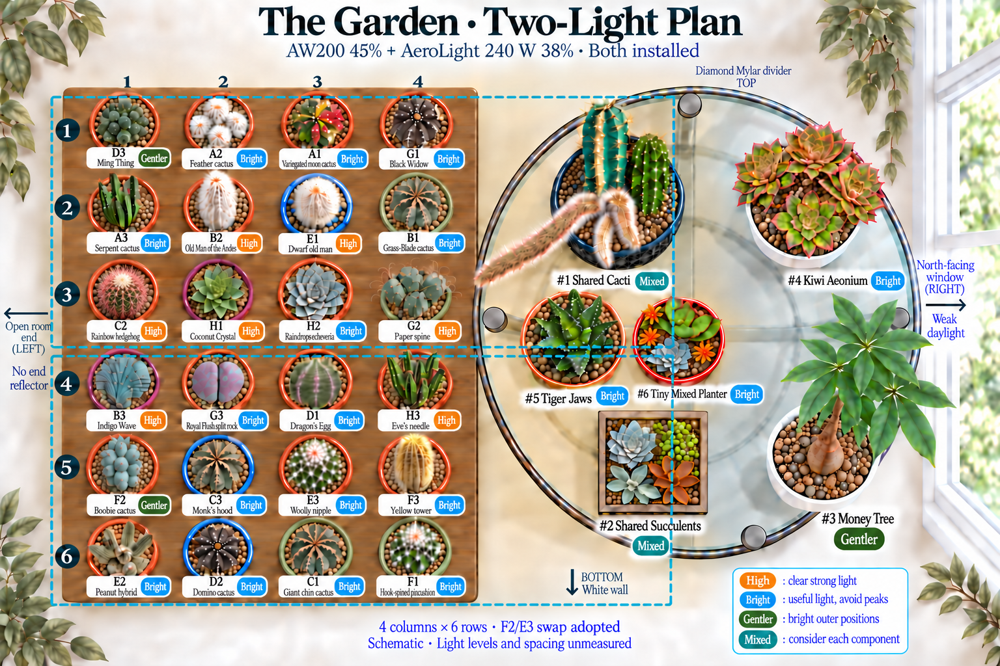
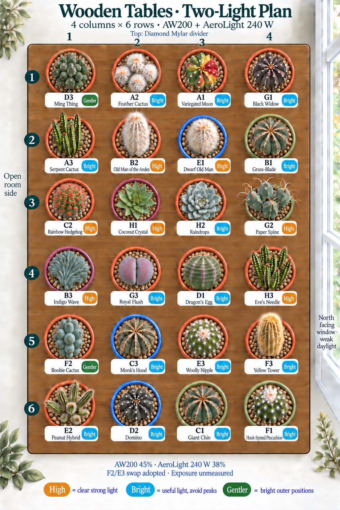
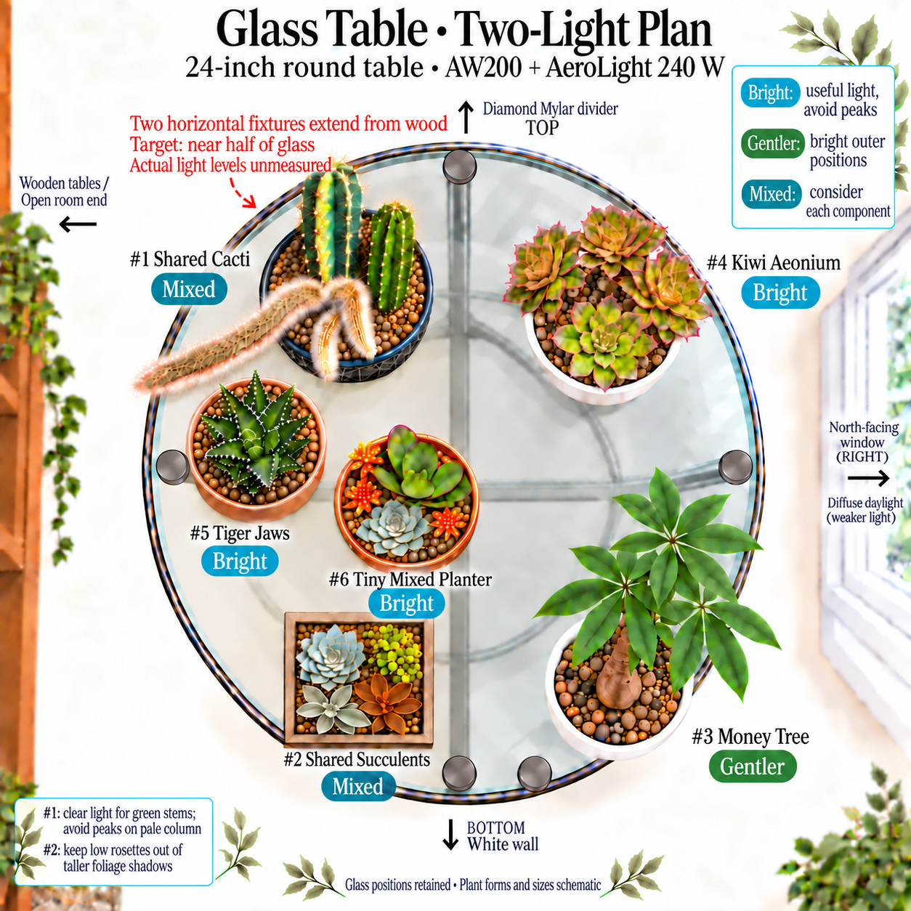

# Table Placement Guide

Revised September 14, 2026. The current plan adopts **F2 Boobie Cactus at R5C1** and **E3 Woolly Nipple at R5C3**. This is the only positional change from the September 13 arrangement. The optional A1/C2 swap remains a future option; A1 stays R1C3 and C2 stays R3C1. All six glass containers retain their positions.

The **AW200 at 45%** and **AeroLight 240 W at 38%** are installed as two horizontal fixtures. Both long axes run left/open room to right/glass, one over the upper wooden half and the other over the lower half. The owner-reported **18-inch plant-tip reference** and shared **13 h 15 m total cycle**, including **15 m sunrise and 15 m sunset**, remain the operating record. The room-facing end stays open.

## September 14 Placement Audit

The [complete two-light review](../two-light-placement-review.md) checks all 30 pots and the living components of shared containers. The adopted swap gives the small Boobie a bright open-left position and moves Woolly Nipple into clearer interior exposure. This uses the room's likely relative exposure; neither a pot's position nor a fixture outline measures its light.

- **Geometry:** wood remains four columns by six rows, with the join after row 3. The swap stays within row 5 under the same broad lower-fixture area.
- **Space:** F2's recorded 3-inch pot trades places with E3's 4-inch pot. The set of pots in row 5 is unchanged, so nominal total rim width does not increase. Real rim, rail, and canopy clearance still need to fit; neither pot should overhang.
- **Neighbors:** E3 moves between C3 and F3 and next to the row-4/row-6 plants D1 and C1. Keep its growing surface and those neighbors clear of shading. F2's new left position is beside C3, with B3 and E2 in the adjacent rows. No riser is added.
- **Height:** individual LED-to-tip distances remain unmeasured. Moving pots within one row does not establish equal exposure or require a new fixture height.
- **Other sensitive plants:** D3 remains R1C1; A2, A3, C3, and D2 keep bright positions away from any demonstrated excessive peak. The top/Mylar and bottom/white-wall edges are not automatically gentle.
- **Low plants:** H1, H2, G3, #5, #6, and the Echeveria in #2 need an unobstructed light path. Rows 3–4 are not proven to be the brightest; the seam may have overlap or a dip.
- **Glass and equipment:** the round table, square wooden box, pale column in #1, money tree's gentler outer position, fixture direction, dimmers, schedule, four hooks, and removed end reflector remain as recorded. North-window daylight is supplementary.
- **Care data:** a placement move is not a repot or a new pot setup. It does not reset wet/dry references or prescribe a shorter watering cycle. New drying behavior should be learned from actual observations.

## The Current Arrangement at a Glance

The illustrations use plain-language **exposure priorities**, not measured intensity bands. “High” means preserve clear strong light; “Bright” means useful light while avoiding excessive peaks; “Gentler” means a bright outer position; “Mixed” means consider the components of one shared pot. These priorities overlap: a Bright plant may tolerate sun, and a High plant can still be overexposed. A directly lit edge is not literally filtered or indirect light.

## Light Priorities and Recommended Spots

| Priority             | Pots                                                                   | Practical Placement                                                                                                                                                                                                                                 |
| -------------------- | ---------------------------------------------------------------------- | --------------------------------------------------------------------------------------------------------------------------------------------------------------------------------------------------------------------------------------------------- |
| **High — 7 pots**    | B2, B3, C2, E1, G2, H1, H3                                             | Keep growing surfaces clearly lit. Use actual exposure rather than assuming every center or seam is brightest. E1's identity and exact light response remain qualified; small B3 needs care despite stronger-light tolerance in established growth. |
| **Bright — 18 pots** | A1, A2, A3, B1, C1, C3, D1, D2, E2, E3, F1, F3, G1, G3, H2; #4, #5, #6 | Preserve useful light. Raindrops, Royal Flush, Dragon's Egg, and the low glass plants do not need a maximum-intensity slot. A1 and Black Widow are not automatically shade plants because they are variegated.                                      |
| **Gentler — 3 pots** | D3 Ming Thing, F2 Boobie, #3 Money Tree                                | D3 at R1C1, F2 at R5C1, and #3 on outer/lower-right glass. The likely gentler exposure remains unmeasured; small F2's priority is a prudent collection choice, not a lifetime shade requirement.                                                    |
| **Mixed — 2 pots**   | #1 Shared Cacti; #2 Square Wooden Succulent Box                        | Preserve useful light for each component, protect the pale column from excessive exposure, and keep low rosettes out of taller foliage shadows. The Kalanchoes can share bright light with the rest of #2.                                          |

These counts cover the 24 wooden pots and six glass containers exactly once. Shared components do not become separate pots or weigh-ins. See the [watering strategy](../watering-strategy.md) and [weighing strategy](../weighing-strategy.md) for how environmental changes affect interpretation of observations.

## Two Lights, Coverage, and Mounting

Each approximately **26-inch long fixture axis runs left-to-right** across the wood toward the near half of glass. The model assigned to the upper versus lower position has not been confirmed. The outlines show direction and intended reach, not a measured beam boundary or exact fixture centers.

Across the arrangement, about 26 inches of fixture length compares with 16 inches of wood plus 12 inches of near glass before furniture gaps. The two short fixture dimensions total about 25.9 inches before the fixture gap, alongside about 26 inches of wooden depth. These physical dimensions do not establish uniform coverage. A tall shared cactus tip and a low rosette can receive quite different exposure.

Keep **AW200 45% and AeroLight 240 W 38%** while evaluating this modest placement adjustment. Both retain the same **13 h 15 m total cycle**, with the two 15-minute transitions included. Each light has independent suspension from two ceiling hooks. The left two-foot return reflector remains removed; top Mylar and bottom white wall remain. The [equipment record](../equipment/aw200-and-aerolight-240w.md) distinguishes manufacturer specifications from owner observations.

## Current Room and Installed Lights

| Item                      | Recorded Setup or Plan                                                                                                                   |
| ------------------------- | ---------------------------------------------------------------------------------------------------------------------------------------- |
| Installed pair            | **AW200 + AeroLight 240 W (VSL-AL240)**, hung and further leveled **September 13**                                                       |
| Fixture size and position | AW200 **26 × 13 × 2.1 in**; new 240 W **25.9 × 12.9 × 2.1 in**. Long axes left-to-right, one above the other; centers and gap unmeasured |
| Reported settings         | **AW200 45% · AeroLight 240 W 38%**                                                                                                      |
| Daily program             | Both share **13 h 15 m total**, including **15 m sunrise + 15 m sunset**                                                                 |
| Right                     | **North-facing window**, beyond glass; weak supplementary daylight                                                                       |
| Top                       | Existing Diamond Mylar divider retained                                                                                                  |
| Bottom                    | White wall retained                                                                                                                      |
| Left                      | **Open room-facing end**; approximately two-foot Mylar return panel removed from the plan                                                |
| Wooden tables             | Two **16 × 13-inch** tops, each **18 inches high**; four columns and six rows, join after row 3                                          |
| Glass table               | **24-inch diameter**, round, **18 inches high**                                                                                          |
| Plant-tip reference       | Owner-reported **18 inches (45.7 cm)**; individual tip distances and light levels are not mapped                                         |

Two 13-inch depths joined give a nominal **16-inch-wide × 26-inch-long** wooden
rectangle. This is not a fresh usable-surface measurement. Four 4-inch rims
already span 16 inches, so verify rims, rails, and foliage when placing pots.
The [two-light equipment note](../equipment/aw200-and-aerolight-240w.md) separates
manufacturer specifications from the earlier AW200SE and superseded AW400 records. Old light
maps and dimming percentages are not measurements of the new open-end setup.

## Wooden Tables: Final Four-Column, Six-Row Layout

Rows run **top/Mylar to bottom/white wall**. Columns run **left/open room end
to right/glass table**. R3C2 means row 3, column 2; every row below is one
horizontal row in the image. The column names carry no brightness ranking.

| Row            | Column 1 · Left              | Column 2                         | Column 3                      | Column 4 · Right                     |
| -------------- | ---------------------------- | -------------------------------- | ----------------------------- | ------------------------------------ |
| 1 · Mylar      | D3 · Ming Thing · Gentler    | A2 · Feather Cactus · Bright     | A1 · Variegated Moon · Bright | G1 · Black Widow · Bright            |
| 2              | A3 · Serpent · Bright        | B2 · Old Man of the Andes · High | E1 · Dwarf Old Man · High     | B1 · Grass-Blade · Bright            |
| 3              | C2 · Rainbow Hedgehog · High | H1 · Coconut Crystal · High      | H2 · Raindrops · Bright       | G2 · Paper Spine · High              |
| 4              | B3 · Indigo Wave · High      | G3 · Royal Flush · Bright        | D1 · Dragon's Egg · Bright    | H3 · Eve's Needle · High             |
| 5              | F2 · Boobie Cactus · Gentler | C3 · Monk's Hood · Bright        | E3 · Woolly Nipple · Bright   | F3 · Yellow Tower · Bright           |
| 6 · White wall | E2 · Peanut Hybrid · Bright  | D2 · Domino · Bright             | C1 · Giant Chin · Bright      | F1 · Hook-Spined Pincushion · Bright |

The adopted September 14 plan changes only F2 and E3 within row 5. D3 remains at the open-left corner, A1 remains R1C3, and the six glass containers do not move. Moving a plant to an edge does not change its botanical requirements or prove the exposure there is suitable. Small size alone does not establish F2's developmental age.

## Every Wooden-Table Plant Reviewed

These are the best-supported ongoing needs for the current plants. A genus
comparison or an uncertain identification is marked as such; a badge does not
turn it into a confirmed species-specific requirement.

| Label | Plant and Retained Identification                                                                                                       | Light Need · Final Spot · Evidence                                                                                                                                                                                                                              |
| ----- | --------------------------------------------------------------------------------------------------------------------------------------- | --------------------------------------------------------------------------------------------------------------------------------------------------------------------------------------------------------------------------------------------------------------- |
| A1    | [Variegated moon cactus](../plants/starter/gymnocalycium-mihanovichii-variegated.md) · _Gymnocalycium mihanovichii_                     | **Bright · R1C3.** [Costa Farms' exact rooted selection][rooted-moon] contains chlorophyll and needs substantial bright light, including some direct sun. Do not apply grafted-moon shade advice without this distinction. The optional C2 swap is not adopted. |
| A2    | [Feather cactus](../plants/starter/mammillaria-plumosa.md) · _Mammillaria plumosa_                                                      | **Bright · R1C2.** [RHS][feather] recommends bright filtered light under glass. Keep useful light without prioritizing an intensity peak.                                                                                                                       |
| A3    | [Serpent cactus](../plants/starter/nyctocereus-serpentinus.md) · _Nyctocereus serpentinus_                                              | **Bright · R2C1.** [LLIFLE][serpent] supports bright shade to partial sun. Retain its open-left position and keep taller stems clear of low neighbors.                                                                                                          |
| B1    | [Grass-blade cactus](../plants/starter/stenocactus-phyllacanthus.md) · _Stenocactus phyllacanthus_                                      | **Bright · R2C4.** Bright sunlight is supported by specialist guidance in the [complete review](../two-light-placement-review.md). No exact LED threshold is established.                                                                                       |
| B2    | [Old Man of the Andes](../plants/starter/oreocereus-trollii.md) · _Oreocereus trollii_                                                  | **High · R2C2.** [NParks][oreocereus] supports full sun. Keep the tip clearly lit with suitable clearance; its row number does not establish the intensity.                                                                                                     |
| B3    | [Indigo Wave](../plants/starter/myrtillocactus-geometrizans-indigo-wave.md) · _Myrtillocactus geometrizans_ 'Indigo Wave'               | **High · R4C1.** [Myrtillocactus guidance][myrtillocactus] supports stronger light in established growth. This small crest's exact response remains unmeasured; avoid assuming it behaves like a mature landscape cactus.                                       |
| C1    | [Giant chin](../plants/starter/gymnocalycium-saglionis.md) · _Gymnocalycium saglionis_                                                  | **Bright · R6C3.** [LLIFLE][giant-chin] allows very bright conditions while recognizing excessive exposure. Retain a useful bright position.                                                                                                                    |
| C2    | [Rainbow hedgehog](../plants/starter/echinocereus-rigidissimus-rubispinus.md) · _Echinocereus rigidissimus_ subsp. _rubispinus_         | **High · R3C1.** [RHS][rainbow] specifies full sun under glass. Preserve a clear path to its crown; this open-left slot is not proven to have the same light as the interior.                                                                                   |
| C3    | [Monk's hood](../plants/starter/astrophytum-ornatum.md) · _Astrophytum ornatum_                                                         | **Bright · R5C2.** [RHS][monks-hood] distinguishes bright filtered light under glass from outdoor full sun. Its new neighbors are F2 on the left and E3 on the right.                                                                                           |
| D1    | [Dragon's Egg](../plants/starter/euphorbia-obesa-hybrid.md) · probable _Euphorbia obesa_-type hybrid or selection                       | **Bright · R4C3.** [SANBI][obesa] describes sun and partial shrub shade for E. obesa. This probable hybrid does not have a verified maximum-light requirement; keep useful bright exposure.                                                                     |
| D2    | [Domino](../plants/starter/echinopsis-subdenudata.md) · _Echinopsis subdenudata_                                                        | **Bright · R6C2.** [NParks][domino] recommends semi-shade and notes yellowing under full sun in its growing context. Retain a bright shoulder rather than forcing a peak.                                                                                       |
| D3    | [Ming Thing](../plants/starter/cereus-forbesii-ming-thing.md) · _Cereus forbesii_ 'Ming Thing'                                          | **Gentler · R1C1.** [NC State][ming] supports bright indirect or filtered conditions. The open-left corner is a sensible candidate, with its actual intensity still unmeasured.                                                                                 |
| E1    | [Dwarf old man](../plants/cacti/espostoa-melanostele-nana.md) · _Espostoa_ sp., likely _E. melanostele_ subsp. _nana_                   | **High · R2C3.** Keep the bright-cactus placement from its qualified profile. Exact Espostoa identity and plant-specific tolerance remain unverified; the badge is a working exposure priority.                                                                 |
| E2    | [Peanut hybrid](../plants/cacti/chamaelobivia-hybrid.md) · _Echinopsis_ hybrid, Chamaelobivia Group                                     | **Bright · R6C1.** Retain the open-left bright position for this unknown-parentage hybrid. Do not infer an exact requirement from a different Echinopsis species.                                                                                               |
| E3    | [Woolly nipple](../plants/cacti/mammillaria-mammillaris.md) · probable _Mammillaria mammillaris_                                        | **Bright · R5C3.** Adopted inward move from R5C1. [NC State Mammillaria guidance][mammillaria] supports bright direct light with protection from excessive hot exposure. The probable species identification remains qualified.                                 |
| F1    | [Hook-spined pincushion](../plants/cacti/mammillaria-rekoi.md) · _Mammillaria_ cf. _rekoi_                                              | **Bright · R6C4.** [Mammillaria guidance][mammillaria] is a genus comparison. Preserve cf. rekoi and the alternative crinita-complex/hybrid possibilities.                                                                                                      |
| F2    | [Boobie cactus](../plants/cacti/myrtillocactus-geometrizans-fukurokuryuzinboku.md) · _Myrtillocactus geometrizans_ 'Fukurokuryuzinboku' | **Gentler · R5C1.** Adopted open-left move from R5C3. [Cultivar guidance][boobie] distinguishes young plants from later full-sun growth. This is a prudent position for the small current plant, not proof of its age or a permanent shade requirement.         |
| F3    | [Yellow tower](../plants/cacti/parodia-leninghausii.md) · _Parodia leninghausii_                                                        | **Bright · R5C4.** Retain useful bright exposure. Parodia genus guidance allows sun to partial shade; see the [review](../two-light-placement-review.md) for the evidence limit.                                                                                |
| G1    | [Black Widow](../plants/cacti/gymnocalycium-mihanovichii-black-widow.md) · _Gymnocalycium mihanovichii_ f. variegata 'Black Widow'      | **Bright · R1C4.** Its [exact grower][black-widow] lists bright indoor light and full sun. Dark color or variegation does not by itself justify a move into shade.                                                                                              |
| G2    | [Paper spine](../plants/cacti/tephrocactus-articulatus-papyracanthus.md) · _Tephrocactus articulatus_ var. _papyracanthus_              | **High · R3C4.** [Paper-spine guidance][paper-spine] supports strong light. Keep the shared cactus planter from shading its small segments.                                                                                                                     |
| G3    | [Royal Flush split rock](../plants/succulents/pleiospilos-nelii-royal-flush.md) · _Pleiospilos nelii_ 'Royal Flush'                     | **Bright · R4C2.** [SANBI][split-rock] supports a sunny position for the species. Keep this low plant clearly lit without claiming a Royal Flush-specific need for the strongest overlap.                                                                       |
| H1    | [Coconut Crystal](../plants/succulents/sempervivum-coconut-crystal.md) · _Sempervivum_ Colorockz® 'Coconut Crystal'                     | **High · R3C2.** [Sempervivum guidance][sempervivum] supports sunny conditions and cautions about heat. Preserve clear exposure at the low rosette; do not seek maximum heat.                                                                                   |
| H2    | [Raindrops](../plants/succulents/echeveria-raindrops.md) · _Echeveria_ 'Raindrops'                                                      | **Bright · R3C3.** [The exact Raindrops grower][raindrops] recommends bright indoor light and filtered/partial sun. This replaces the earlier blanket High classification.                                                                                      |
| H3    | [Eve's needle](../plants/cacti/austrocylindropuntia-subulata.md) · _Austrocylindropuntia subulata_                                      | **High · R4C4.** [NC State][eves-needle] supports full sun or bright indoor light. Keep growing stems from shading the lower plants nearby.                                                                                                                     |

## Glass Table: Final Positions, Shapes, and Sizes

The **table** is 24 inches across, not the largest planter. Shapes come from the
owner's August 29 and September 1–2 photographs in the
[photo manifest](../../assets/collection-photos/photo-manifest.json), plus current
profiles. Rim widths are not canopy widths; the illustration does not certify fit.

| Label / Tracker | Container and Recorded Size                                                                                                                                         | Final Spot and Light Need                                                                                      |
| --------------- | ------------------------------------------------------------------------------------------------------------------------------------------------------------------- | -------------------------------------------------------------------------------------------------------------- |
| #1 / P19        | **Round dark planter with a pale leaf pattern**; diameter and height unmeasured. The old 12.5–13-inch record is plant tip **above the tabletop**, not pot diameter. | **Mixed · upper-left**; green stems toward the clear lamp path, pale tissue toward the less exposed side.      |
| #2 / P20        | **Square wooden box**, weathered gray-brown sides; side length, height, and liner/drainage details unmeasured.                                                      | **Mixed · lower-left**; the Echeveria side faces the clearer lamp path on the near half.                       |
| #3 / P21        | **White round plastic pot**, single thick money-tree trunk; current **6-inch class** Amazon Basics pot. The stored 8-inch pot is not installed.                     | **Gentler · lower-right**; bright indirect spill outside the stronger cactus overlap.                          |
| #4 / P22        | **White round pot**, branched Kiwi aeonium; approximately **5-inch pot** in the acquisition record, current rim/canopy dimensions unmeasured.                       | **Bright · upper-right**; bright outer shoulder of the lamp.                                                   |
| #5 / P29        | **Tan round pot with horizontal ribs** after repotting; current dimensions unmeasured. The **2.5-inch retail label is the old arrival container**.                  | **Bright · just left of center**; inside the planned near-half coverage, with open light above the low leaves. |
| #6 / P30        | **Small round terracotta deep dish**; **five-inch class** seller record, not a fresh rim or height measurement.                                                     | **Bright · left-center gap** between #1 and #2, retained from September 13.                                    |

### Component Plants and Their Light Needs

- **#1 · Shared Cacti — Mixed:** [probable variegated Pilosocereus pachycladus](../plants/rehab/pilosocereus-pachycladus-variegated.md), [Cleistocactus colademononis](../plants/rehab/cleistocactus-colademononis.md), and [probable Echinopsis spachiana](../plants/rehab/echinopsis-spachiana.md) remain together. Give the green stems clear light and avoid excessive exposure on the pale column. Its tallest tip may need a different clearance from low plants; rotating a uniformly overhead-lit pot does not automatically protect the pale tissue. The historical removed probable Mammillaria bombycina remains excluded.
- **#2 · Square Wooden Succulent Box — Mixed:** retain [probable Echeveria pulidonis or close hybrid](../plants/succulents/echeveria-pulidonis.md), [Portulacaria afra](../plants/succulents/portulacaria-afra.md), [probable Kalanchoe bracteata](../plants/succulents/kalanchoe-bracteata.md), and [Kalanchoe orgyalis](../plants/succulents/kalanchoe-orgyalis.md). Keep the low Echeveria out of taller foliage shadows. The Kalanchoes tolerate a range from sun to partial shade; their presence does not require a dark half of the box. The possible golden Portulacaria cultivar remains unconfirmed.
- **#3 · Money Tree — Gentler:** the working [Pachira glabra](../plants/houseplants/pachira-glabra.md) retains useful gentler lamp spill on outer glass. [P. aquatica guidance][money-tree] is a care comparison, not identification proof.
- **#4 · Kiwi Aeonium — Bright:** retain [Aeonium haworthii 'Dream Color'](../plants/succulents/aeonium-haworthii-dream-color.md) in useful bright spill. A weak north window alone is not assumed sufficient; a slight inward shift is an option only if this position is underlit.
- **#5 · Tiger Jaws — Bright:** [probable Faucaria tuberculosa](../plants/succulents/faucaria-tuberculosa.md) remains seller-labeled F. tigrina. [SANBI][tiger-jaws] is a comparison, not proof of species or a need for the strongest intensity.
- **#6 · Tiny Mixed Planter — Bright:** keep the [small terracotta dish](../plants/succulents/tiny-mixed-succulent-planter.md) clear of shadows. The provisional Echeveria rosettes, Sedum adolphi/nussbaumerianum complex, and Kalanchoe luciae/thyrsiflora complex remain one tracked pot with unconfirmed component identities.

The [complete review](../two-light-placement-review.md) gives the source-by-source reasoning for each component. Glass positions are retained; the updated illustrations do not claim new pot dimensions or completion of a move.

## Apply the Current Plan

1. Move each pot with its permanent label. F2 and E3 exchange row-5 positions; the optional A1/C2 swap is not part of this plan.
2. Fit every base fully on the tabletop. Keep the same pots, medium, and risers unless separately recorded.
3. Preserve clear light at low rosettes and compare the moved plants with their new neighbors. Neither a central row nor a fixture outline proves adequate exposure.
4. Keep the reported dimmers and schedule while evaluating the modest adjustment. Record a physical move as a care note if useful, not as a completed repot or a new dry-down setup.
5. Retain the September 13 installation record. The September 14 illustrations show the newly adopted plan, rather than a new measurement of the room.

## Sources

- **Equipment:** [AW200 manual][aw200], [new AeroLight manual][aerolight-240],
  and [240 W product page][aerolight-product] for model-specific dimensions,
  weights, power, and controls. The [equipment note](../equipment/aw200-and-aerolight-240w.md)
  records the four-hook mounting plan and open room-facing end.

The September 13 installation, further leveling after the photographs,
AW200 45% and AeroLight 240 W 38% settings, applied plant layout, 18-inch
plant-tip reference, and shared 13 h 15 m cycle including 15-minute sunrise
and sunset transitions are
owner evidence. The later marked-up plan corrects both fixture long axes to
left-to-right, one above the other. The four-hook plan, reflector removal, room
orientation, and container shapes are also owner evidence. The guidance
distinguishes species evidence, genus comparisons, grower claims, and placement
inference. The September 14 review corrects the old light categories and adopts only the F2/E3 swap. Installation remains dated September 13.

- **Primary cactus guidance:** [RHS general care][general],
  [RHS rainbow hedgehog][rainbow], [NParks Old Man of the Andes][oreocereus],
  [RHS feather cactus][feather], [RHS monk's hood][monks-hood],
  [NParks Domino][domino], [NC State Ming Thing][ming],
  [NC State Mammillaria][mammillaria], [NC State Eve's needle][eves-needle],
  [SANBI split rock][split-rock], and [SANBI Euphorbia obesa][obesa].
- **Rosettes and shared-pot comparisons:** [NC State Echeveria][echeveria],
  [NC State Sempervivum][sempervivum], [RHS Echeveria pulidonis][pulidonis],
  [RHS monkey tail][monkey-tail], [Wisconsin elephant bush][elephant-bush],
  [NC State silver teaspoons][silver-spoons], [Port St. Lucie copper spoons][copper-spoons],
  [SANBI tiger jaws][tiger-jaws],
  [NC State moon cactus][moon], and [NC State Pachira aquatica][money-tree].
- **Supplementary specialist cultivation sources:** [LLIFLE Myrtillocactus][myrtillocactus],
  [LLIFLE Boobie cactus][boobie], [LLIFLE paper spine][paper-spine],
  [LLIFLE serpent cactus][serpent], and [LLIFLE giant chin][giant-chin].
- **Seller evidence:** [Costa Farms rooted Variegated Moon][rooted-moon], [Mountain Crest Gardens Raindrops][raindrops], [Mountain Crest Gardens Black Widow][black-widow], and
  [Home Depot five-inch terracotta garden](https://www.homedepot.com/p/SMART-PLANET-5-in-Succulent-Garden-in-Deep-Dish-Terra-Cotta-Clay-Planter-0872523/320207970).
  Product sizes are nominal; a listing does not prove a mixed planter's identities.
- **Collection evidence:** [measurement photographs](../../assets/measurements/README.md),
  [plant and pot inventory](../collection.md), [individual profiles](../plants/),
  and the [September 14 image prompts](../../assets/layouts/2026-09-14-edge-placement/image-prompts.md).

[general]: https://www.rhs.org.uk/plants/types/cacti-succulents/houseplants/growing-guide
[rainbow]: https://www.rhs.org.uk/plants/115504/echinocereus-rigidissimus/details
[oreocereus]: https://www.nparks.gov.sg/florafaunaweb/flora/6/1/6142
[feather]: https://www.rhs.org.uk/plants/10832/mammillaria-plumosa/details
[monks-hood]: https://www.rhs.org.uk/plants/1880/astrophytum-ornatum/details
[domino]: https://www.nparks.gov.sg/florafaunaweb/flora/5/9/5908
[ming]: https://plants.ces.ncsu.edu/plants/cereus-forbesii-ming-thing/common-name/ming-thing/
[mammillaria]: https://plants.ces.ncsu.edu/plants/mammillaria/
[eves-needle]: https://plants.ces.ncsu.edu/plants/austrocylindropuntia-subulata/
[split-rock]: https://pza.sanbi.org/pleiospilos-nelii
[obesa]: https://pza.sanbi.org/euphorbia-obesa
[echeveria]: https://plants.ces.ncsu.edu/plants/echeveria/
[sempervivum]: https://plants.ces.ncsu.edu/plants/sempervivum/
[pulidonis]: https://www.rhs.org.uk/plants/6239/echeveria-pulidonis/details
[monkey-tail]: https://www.rhs.org.uk/plants/327556/cleistocactus-colademononis/details
[elephant-bush]: https://hort.extension.wisc.edu/articles/elephant-bush-portulacaria-afra/
[silver-spoons]: https://plants.ces.ncsu.edu/plants/kalanchoe-bracteata/
[copper-spoons]: https://www.pslbg.org/copper-spoon/
[tiger-jaws]: https://pza.sanbi.org/faucaria-tigrina
[moon]: https://plants.ces.ncsu.edu/plants/gymnocalycium-mihanovichii/
[money-tree]: https://plants.ces.ncsu.edu/plants/pachira-aquatica/
[myrtillocactus]: https://www.llifle.com/Encyclopedia/CACTI/Family/Cactaceae/8050/Myrtillocactus_geometrizans
[boobie]: https://www.llifle.com/Encyclopedia/CACTI/Family/Cactaceae/14991/Myrtillocactus_geometrizans_cv._Fukurokuryuzinboku
[paper-spine]: https://www.llifle.com/Encyclopedia/CACTI/Family/Cactaceae/7346/Tephrocactus_articulatus_var._papyracanthus
[serpent]: https://www.llifle.com/Encyclopedia/CACTI/Family/Cactaceae/7251/Nyctocereus_serpentinus
[giant-chin]: https://www.llifle.com/Encyclopedia/CACTI/Family/Cactaceae/12116/Gymnocalycium_saglionis
[black-widow]: https://mountaincrestgardens.com/gymnocalycium-mihanovichii-f-variegata-black-widow-wfzy/
[aw200]: https://vivosun.com/support/guide/aerolight
[aerolight-240]: https://vivosun.com/support/guide/aerolight-gen2
[aerolight-product]: https://vivosun.com/vivosun-aerolight-240W-p169014979523194244-v169014979523194351
[raindrops]: https://mountaincrestgardens.com/echeveria-raindrops/
[rooted-moon]: https://costafarms.com/products/small-variegated-moon-cactus-parent
