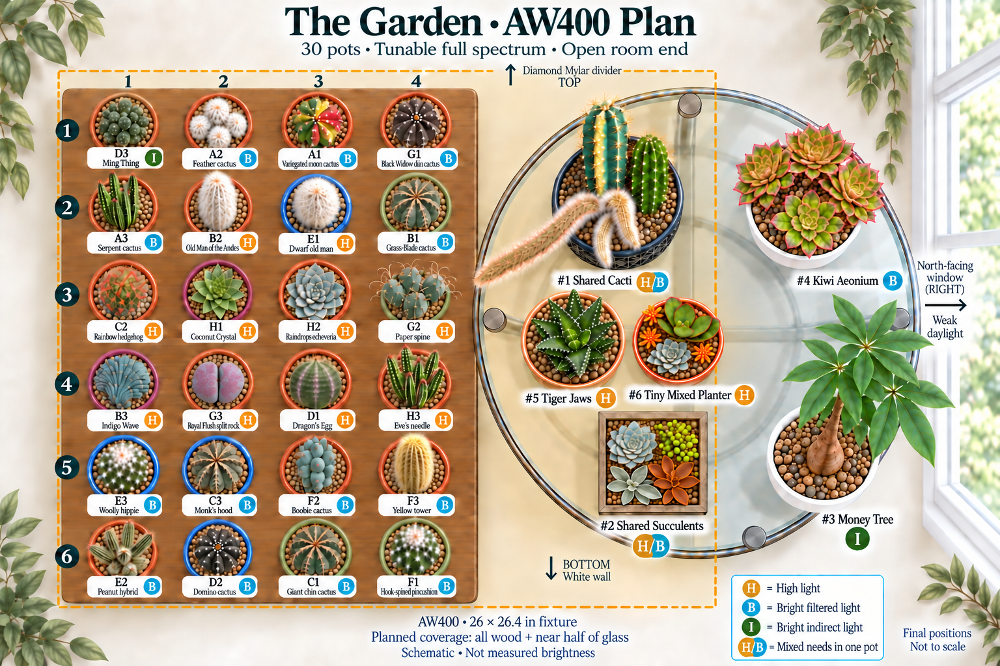
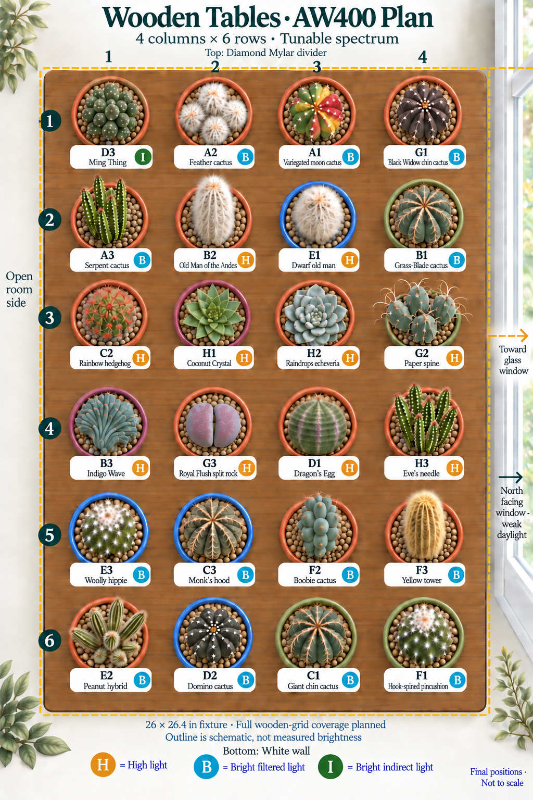
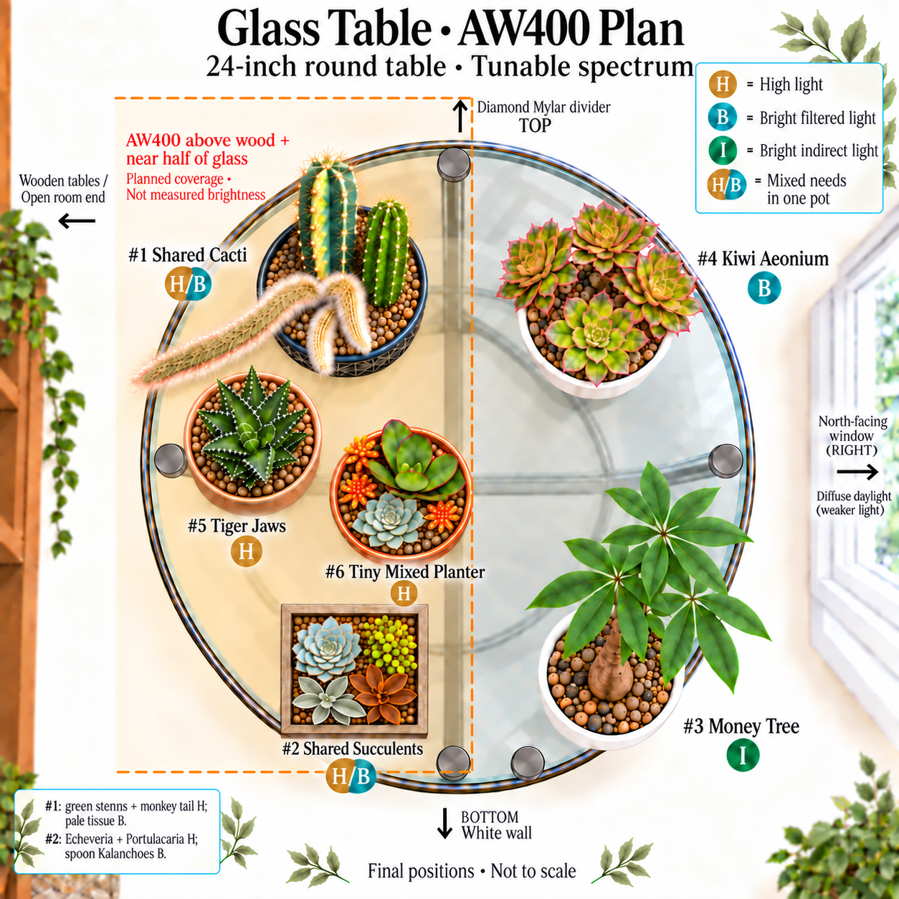

# Table Placement Guide

Revised September 10, 2026, for the **selected AW400 tunable full-spectrum light**
and an **open room-facing end**. The approximately two-foot return reflector
comes out; the existing divider Mylar stays. These are final recommended growing
positions for **30 tracked pots: 24 on wood and six on glass**, ready for the
replacement light. The owner canceled the Amazon AW400SE order and chose the
AW400 from LED Grow Lights Depot; its listing specifies **Samsung 301H EVO
diodes**, UVA, and far-red. The replacement's delivery date, installation, and
physical plant moves have not been confirmed.

## The Final Arrangement at a Glance

- **Wider light:** the AW400 is a **400 W, tunable full-spectrum fixture**,
  listed at **26 × 26.4 inches**. The intended growing area now includes all
  six wooden rows and roughly the nearer half of glass. See the
  [exact-model equipment note](../equipment/vivosun-aw400.md) and
  [manufacturer manual][aw400].
- **Updated model:** the AW400 keeps the canceled AW400SE's listed footprint,
  so the final pot positions remain the same. Its Seedling, Veg, and Flower
  spectrum modes are selectable; the chosen mode is not yet recorded. The
  [selected seller listing][aw400-listing] confirms the advertised 301H EVO
  configuration. Far-red is listed for both models.
- **Open view:** remove the left two-foot return panel. Keep the top Diamond
  Mylar divider and bottom white wall. Viewing the plants and reaching them
  comfortably are part of the plan.
- **Light needs stay individual:** high-light plants use clear central
  exposure; softer-light plants use the perimeter. Ming Thing moves to the
  open-left corner, and the money tree stays on the outer glass side.
- **Existing furniture:** wood stays four columns by six rows; glass stays
  round, 24 inches across. The shared succulent planter is a square wooden
  box. The weak north-facing window remains on the right.

The image badges describe **ongoing light needs**, not move stages:
**H = High light**, **B = Bright filtered light**, **I = Bright indirect light**,
and **H/B = Mixed needs in one shared pot**. Each letter has a text legend and
its own color. These horticultural categories describe exposure goals; they
do not claim that an LED-lit edge is physically filtered, shaded, or at a
measured PPFD. The owner will handle acclimation.

## How the Wider Light Changes the Recommended Spots

The previous horizontal AW200 band covered the middle wooden rows. The new
illustrations show a broad, approximately square **planned growing area** over
the whole wooden grid and the nearer glass half. The amber outline is schematic,
not the fixture's measured position or a brightness contour. Wider panels should
help spread light, but plant height, neighboring foliage, and the remaining
divider still affect exposure.

- **Wood, rows 3–4:** keep the low high-light plants clear of taller stems.
  Coconut Crystal, Raindrops, Royal Flush, and Paper Spine retain their central
  positions. All four columns have planned lamp exposure.
- **Wood, rows 2 and 5:** retain the tall high-light cacti in row 2 and the
  bright filtered group in row 5; these rows are no longer the edge of a
  narrow horizontal band.
- **Wood, rows 1 and 6:** both rows now fall within the broad planned area.
  They are perimeter positions, not unlit rows. Ming Thing uses **R1C1**, the
  open-left corner, as a candidate for gentler exposure; Variegated Moon moves
  to **R1C3**. A corner under the light is not automatically bright indirect.
- **Glass, near half:** prioritize the tiny dish, tiger jaws just left of
  center, and the light-demanding parts of the two shared planters. Keep their
  growing tips clear of the taller shared cacti.
- **Glass, outer/right half:** Kiwi aeonium uses bright spill at upper-right;
  the money tree uses gentler indirect exposure at lower-right. The weak
  north window alone is not assumed to supply either plant's needs.

The nominal 16-inch wood width plus half the 24-inch glass diameter spans
**28 inches before gaps**, slightly wider than the fixture itself. Useful
light spreads beyond the panels; the owner's intended coverage is plausible,
but neither the drawing nor the manufacturer's 4 × 4 ft tent guidance proves
uniform PPFD here. The old AW200 **60%** is not an AW400 setting. Intensity,
clearance, and the transferred timer will be recorded after installation.

## Plants by Light Need and Recommended Spot

R3C2 means row 3, column 2 on wood. Count rows from top/Mylar to bottom/white
wall, and columns from left/open room end to right/glass.

### H · High Light — 12 Pots

Use the clearer directly overlapped growing area; avoid shading a low plant
with a taller neighbor. On wood the final spots are:

- **B2 · Old Man of the Andes** — R2C2.
- **E1 · Dwarf Old Man** — R2C3.
- **C2 · Rainbow Hedgehog** — R3C1.
- **H1 · Coconut Crystal** — R3C2.
- **H2 · Raindrops** — R3C3.
- **G2 · Paper Spine** — R3C4.
- **B3 · Indigo Wave** — R4C1.
- **G3 · Royal Flush** — R4C2.
- **D1 · Dragon's Egg** — R4C3.
- **H3 · Eve's Needle** — R4C4.
- **#5 · Tiger Jaws** — glass just left of center, within the planned near-half coverage.
- **#6 · Tiny Mixed Planter** — glass left-center, in the clear gap between the two shared containers.

### B · Bright Filtered Light — 14 Pots

Use bright perimeter or shoulder positions with useful lamp spill. This category
includes plants that tolerate some sun; it does not mean low light.

- **A1 · Variegated Moon** — R1C3.
- **A2 · Feather Cactus** — R1C2.
- **G1 · Black Widow** — R1C4.
- **A3 · Serpent** — R2C1.
- **B1 · Grass-Blade** — R2C4.
- **E3 · Woolly Nipple** — R5C1.
- **C3 · Monk's Hood** — R5C2.
- **F2 · Boobie Cactus** — R5C3.
- **F3 · Yellow Tower** — R5C4.
- **E2 · Peanut Hybrid** — R6C1.
- **D2 · Domino** — R6C2.
- **C1 · Giant Chin** — R6C3.
- **F1 · Hook-Spined Pincushion** — R6C4.
- **#4 · Kiwi Aeonium** — glass upper-right, near the outer shoulder of the lamp.

### I · Bright Indirect Light — 2 Pots

- **D3 · Ming Thing — R1C1**, at the open-left wooden corner; confirm gentler exposure after installation.
- **#3 · Money Tree — glass lower-right**, outside the stronger cactus overlap.

These plants still need a bright position. Deep shade and a weak window are not
substitutes for useful indirect grow light.

### H/B · Mixed Needs in Shared Pots — 2 Pots

- **#1 · Shared Cacti — glass upper-left.** The green columnar cactus and monkey
  tail get high light; the pale variegated column uses the less exposed side.
- **#2 · Square Wooden Succulent Box — glass lower-left.** Aim the Echeveria and
  Portulacaria toward the clearer high-light path; keep the silver and copper
  spoon Kalanchoes toward the bright filtered side of the same box.

These two pots remain intact. Their split badges describe their component plants,
not a new single-species requirement. The detailed evidence below preserves all
probable, cf., hybrid, and unconfirmed-cultivar identifications.

## Current Room and Incoming Light

| Item                        | Recorded Setup or Plan                                                                                                                            |
| --------------------------- | ------------------------------------------------------------------------------------------------------------------------------------------------- |
| Incoming light              | **VIVOSUN AW400**, tunable full spectrum, **400 W**; selected after canceling AW400SE, installation pending                                       |
| Fixture size and position   | Manufacturer: **26 × 26.4 × 2.2 inches**; planned with wings fully flat over all wood and the near half of glass                                  |
| Last installed light        | Owner-reported **AW200 with tunable spectrum**, **60%**; September 9 record                                                                       |
| Daily program               | Last reported **13.25 hours**, including quarter-hour sunrise/sunset transitions; retained as a planning reference, transfer to AW400 unconfirmed |
| Right                       | **North-facing window**, beyond glass; weak supplementary daylight                                                                                |
| Top                         | Existing Diamond Mylar divider retained                                                                                                           |
| Bottom                      | White wall retained                                                                                                                               |
| Left                        | **Open room-facing end**; approximately two-foot Mylar return panel removed from the plan                                                         |
| Wooden tables               | Two **16 × 13-inch** tops, each **18 inches high**; four columns and six rows, join after row 3                                                   |
| Glass table                 | **24-inch diameter**, round, **18 inches high**                                                                                                   |
| New intensity and clearance | **Not yet set or measured**; the old 60% and last 18-inch clearance do not describe the incoming light                                            |

Two 13-inch depths joined give a nominal **16-inch-wide × 26-inch-long** wooden
rectangle. This is not a fresh usable-surface measurement. Four 4-inch rims
already span 16 inches, so verify rims, rails, and foliage when placing pots.
The [AW400 equipment note](../equipment/vivosun-aw400.md) separates its
manufacturer specifications from the earlier AW200/AW200SE records. Old light
maps and dimming percentages are not measurements of the new open-end setup.

## Wooden Tables: Final Four-Column, Six-Row Layout

Rows run **top/Mylar to bottom/white wall**. Columns run **left/open room end
to right/glass table**. R3C2 means row 3, column 2; every row below is one
horizontal row in the image. The column names carry no brightness ranking.

| Row            | Column 1 · Left           | Column 2                      | Column 3                 | Column 4 · Right                |
| -------------- | ------------------------- | ----------------------------- | ------------------------ | ------------------------------- |
| 1 · Mylar      | D3 · Ming Thing · I       | A2 · Feather Cactus · B       | A1 · Variegated Moon · B | G1 · Black Widow · B            |
| 2              | A3 · Serpent · B          | B2 · Old Man of the Andes · H | E1 · Dwarf Old Man · H   | B1 · Grass-Blade · B            |
| 3              | C2 · Rainbow Hedgehog · H | H1 · Coconut Crystal · H      | H2 · Raindrops · H       | G2 · Paper Spine · H            |
| 4              | B3 · Indigo Wave · H      | G3 · Royal Flush · H          | D1 · Dragon's Egg · H    | H3 · Eve's Needle · H           |
| 5              | E3 · Woolly Nipple · B    | C3 · Monk's Hood · B          | F2 · Boobie Cactus · B   | F3 · Yellow Tower · B           |
| 6 · White wall | E2 · Peanut Hybrid · B    | D2 · Domino · B               | C1 · Giant Chin · B      | F1 · Hook-Spined Pincushion · B |

The central high-light assignments remain suitable priorities under the broader
plan. D3 swaps with A1 to use the open-left perimeter; all other wooden positions
stay the same. The edge is a candidate for lower exposure, not guaranteed shade.
F2 remains B because guidance distinguishes young growth from mature growth,
not because this plan stages a move. No pot's light need changes merely because
the lamp is wider.

## Every Wooden-Table Plant Reviewed

These are the best-supported ongoing needs for the current plants. A genus
comparison or an uncertain identification is marked as such; a badge does not
turn it into a confirmed species-specific requirement.

| Label | Plant and Retained Identification                                                                                                       | Light Need · Final Spot · Evidence                                                                                                                                                                                                                       |
| ----- | --------------------------------------------------------------------------------------------------------------------------------------- | -------------------------------------------------------------------------------------------------------------------------------------------------------------------------------------------------------------------------------------------------------- |
| A1    | [Variegated moon cactus](../plants/starter/gymnocalycium-mihanovichii-variegated.md) · _Gymnocalycium mihanovichii_                     | **B · R1C3.** Bright filtered light for the rooted variegated plant. [NC State][moon] discusses bright indirect light mainly for grafts and also lists sun/partial shade; it does not establish this specimen as grafted or define a cultivar threshold. |
| A2    | [Feather cactus](../plants/starter/mammillaria-plumosa.md) · _Mammillaria plumosa_                                                      | **B · R1C2.** [RHS][feather] specifies bright filtered light under glass. The hairy surface does not make the strongest beam a requirement.                                                                                                              |
| A3    | [Serpent cactus](../plants/starter/nyctocereus-serpentinus.md) · _Nyctocereus serpentinus_                                              | **B · R2C1.** [LLIFLE][serpent] describes bright shade to partial sun. Its taller stems use the upper perimeter of the growing area.                                                                                                                     |
| B1    | [Grass-blade cactus](../plants/starter/stenocactus-phyllacanthus.md) · _Stenocactus phyllacanthus_                                      | **B · R2C4.** Bright exposure is supported by the existing profile and [general cactus guidance][general]; a species-specific threshold remains unverified.                                                                                              |
| B2    | [Old Man of the Andes](../plants/starter/oreocereus-trollii.md) · _Oreocereus trollii_                                                  | **H · R2C2.** [NParks][oreocereus] lists full sun. The tall hairy column uses the upper part of the directly overlapped rows.                                                                                                                            |
| B3    | [Indigo Wave](../plants/starter/myrtillocactus-geometrizans-indigo-wave.md) · _Myrtillocactus geometrizans_ 'Indigo Wave'               | **H · R4C1.** Species-level [Myrtillocactus guidance][myrtillocactus] supports strong light in established growth. An exact requirement for this crest is not known.                                                                                     |
| C1    | [Giant chin](../plants/starter/gymnocalycium-saglionis.md) · _Gymnocalycium saglionis_                                                  | **B · R6C3.** [LLIFLE][giant-chin] describes strong-light tolerance with protection from excessive exposure; use the bright lower perimeter.                                                                                                             |
| C2    | [Rainbow hedgehog](../plants/starter/echinocereus-rigidissimus-rubispinus.md) · _Echinocereus rigidissimus_ subsp. _rubispinus_         | **H · R3C1.** [RHS species guidance][rainbow] specifies full sun under glass. Give the low crown a clear central light path.                                                                                                                             |
| C3    | [Monk's hood](../plants/starter/astrophytum-ornatum.md) · _Astrophytum ornatum_                                                         | **B · R5C2.** [RHS][monks-hood] distinguishes outdoor full sun from bright filtered light under glass. The lower perimeter is the proposed position for that goal.                                                                                       |
| D1    | [Dragon's Egg](../plants/starter/euphorbia-obesa-hybrid.md) · probable _Euphorbia obesa_-type hybrid or selection                       | **H · R4C3.** [SANBI][obesa] recommends a sunny position for E. obesa. Its probable hybrid identity stays qualified; the final recommendation is high light, not a low-light corner.                                                                     |
| D2    | [Domino](../plants/starter/echinopsis-subdenudata.md) · _Echinopsis subdenudata_                                                        | **B · R6C2.** [NParks][domino] lists full sun and semi-shade. Bright filtered light at the lower perimeter is within that range.                                                                                                                         |
| D3    | [Ming Thing](../plants/starter/cereus-forbesii-ming-thing.md) · _Cereus forbesii_ 'Ming Thing'                                          | **I · R1C1.** [NC State's cultivar article][ming] calls for bright indirect light. Use the open-left corner as a candidate for gentler exposure; it is still within the broad planned coverage, so the location alone does not prove this need is met.   |
| E1    | [Dwarf old man](../plants/cacti/espostoa-melanostele-nana.md) · _Espostoa_ sp., likely _E. melanostele_ subsp. _nana_                   | **H · R2C3.** High-light placement follows the bright-cactus profile and [general guidance][general]. The exact Espostoa identification and subspecies response remain unverified.                                                                       |
| E2    | [Peanut hybrid](../plants/cacti/chamaelobivia-hybrid.md) · _Echinopsis_ hybrid, Chamaelobivia Group                                     | **B · R6C1.** Bright filtered light retains the profile-based recommendation for an unknown-parentage Echinopsis hybrid. [General guidance][general] does not establish an exact hybrid requirement.                                                     |
| E3    | [Woolly nipple](../plants/cacti/mammillaria-mammillaris.md) · _Mammillaria mammillaris_                                                 | **B · R5C1.** Bright filtered exposure follows [NC State Mammillaria guidance][mammillaria] and the profile; this is a genus comparison.                                                                                                                 |
| F1    | [Hook-spined pincushion](../plants/cacti/mammillaria-rekoi.md) · _Mammillaria_ cf. _rekoi_                                              | **B · R6C4.** Bright filtered exposure uses the same [Mammillaria comparison][mammillaria]. Retain the identification qualifier cf. rekoi.                                                                                                               |
| F2    | [Boobie cactus](../plants/cacti/myrtillocactus-geometrizans-fukurokuryuzinboku.md) · _Myrtillocactus geometrizans_ 'Fukurokuryuzinboku' | **B · R5C3.** [Cultivar guidance][boobie] gives light shade when young and more sun with maturity. B describes this small current plant, not an acclimation stage; mature growth may justify reassessment.                                               |
| F3    | [Yellow tower](../plants/cacti/parodia-leninghausii.md) · _Parodia leninghausii_                                                        | **B · R5C4.** Bright exposure follows the collection profile and [general guidance][general]. Direct species-specific light evidence was not independently verified; B is the working category.                                                          |
| G1    | [Black Widow](../plants/cacti/gymnocalycium-mihanovichii-black-widow.md) · _Gymnocalycium mihanovichii_ f. variegata 'Black Widow'      | **B · R1C4.** Bright filtered light is the final collection recommendation. Its [grower lists sun][black-widow], so this badge does not claim that all Black Widow plants require shade.                                                                 |
| G2    | [Paper spine](../plants/cacti/tephrocactus-articulatus-papyracanthus.md) · _Tephrocactus articulatus_ var. _papyracanthus_              | **H · R3C4.** [LLIFLE][paper-spine] describes full sun and thin growth in inadequate light. Give the egg-shaped segments a clear path under the lamp.                                                                                                    |
| G3    | [Royal Flush split rock](../plants/succulents/pleiospilos-nelii-royal-flush.md) · _Pleiospilos nelii_ 'Royal Flush'                     | **H · R4C2.** [SANBI species guidance][split-rock] recommends a sunny position. This low plant moves from the bottom row into the central overlap.                                                                                                       |
| H1    | [Coconut Crystal](../plants/succulents/sempervivum-coconut-crystal.md) · _Sempervivum_ Colorockz® 'Coconut Crystal'                     | **H · R3C2.** [NC State][sempervivum] supports sun. Keep the rosette open to the lamp; seasonal cold dormancy remains a separate need.                                                                                                                   |
| H2    | [Raindrops](../plants/succulents/echeveria-raindrops.md) · _Echeveria_ 'Raindrops'                                                      | **H · R3C3.** [NC State genus guidance][echeveria] supports sunny conditions for compact rosettes. Keep taller stems out of its light path.                                                                                                              |
| H3    | [Eve's needle](../plants/cacti/austrocylindropuntia-subulata.md) · _Austrocylindropuntia subulata_                                      | **H · R4C4.** [NC State][eves-needle] specifies full sun or bright indoor light. Its taller stems occupy a flank of the central rows.                                                                                                                    |

## Glass Table: Final Positions, Shapes, and Sizes

The **table** is 24 inches across, not the largest planter. Shapes come from the
owner's August 29 and September 1–2 photographs in the
[photo manifest](../../assets/collection-photos/photo-manifest.json), plus current
profiles. Rim widths are not canopy widths; the illustration does not certify fit.

| Label / Tracker | Container and Recorded Size                                                                                                                                         | Final Spot and Light Need                                                                                 |
| --------------- | ------------------------------------------------------------------------------------------------------------------------------------------------------------------- | --------------------------------------------------------------------------------------------------------- |
| #1 / P19        | **Round dark planter with a pale leaf pattern**; diameter and height unmeasured. The old 12.5–13-inch record is plant tip **above the tabletop**, not pot diameter. | **H/B · upper-left**; green stems toward the clear lamp path, pale tissue toward the less exposed side.   |
| #2 / P20        | **Square wooden box**, weathered gray-brown sides; side length, height, and liner/drainage details unmeasured.                                                      | **H/B · lower-left**; the Echeveria side faces the clearer lamp path on the near half.                    |
| #3 / P21        | **White round plastic pot**, single thick money-tree trunk; current **6-inch class** Amazon Basics pot. The stored 8-inch pot is not installed.                     | **I · lower-right**; bright indirect spill outside the stronger cactus overlap.                           |
| #4 / P22        | **White round pot**, branched Kiwi aeonium; approximately **5-inch pot** in the acquisition record, current rim/canopy dimensions unmeasured.                       | **B · upper-right**; bright outer shoulder of the lamp.                                                   |
| #5 / P29        | **Tan round pot with horizontal ribs** after repotting; current dimensions unmeasured. The **2.5-inch retail label is the old arrival container**.                  | **H · just left of center**; inside the planned near-half coverage, with open light above the low leaves. |
| #6 / P30        | **Small round terracotta deep dish**; **five-inch class** seller record, not a fresh rim or height measurement.                                                     | **H · left-center gap** between #1 and #2, moved inward from the bottom rim.                              |

### Component Plants and Their Light Needs

- **#1 · Shared cactus planter:** [probable variegated Pilosocereus pachycladus](../plants/rehab/pilosocereus-pachycladus-variegated.md)
  uses **B on its pale tissue**; [Cleistocactus colademononis](../plants/rehab/cleistocactus-colademononis.md)
  and [probable Echinopsis spachiana](../plants/rehab/echinopsis-spachiana.md)
  receive **H**. [RHS monkey-tail guidance][monkey-tail] specifies full light
  under glass. The two probable columnar IDs and their exact thresholds remain
  qualified. The historical removed probable Mammillaria bombycina is not drawn.
- **#2 · Square wooden succulent box:** [probable Echeveria pulidonis or close hybrid](../plants/succulents/echeveria-pulidonis.md)
  and [Portulacaria afra](../plants/succulents/portulacaria-afra.md) receive **H**
  on the clearer lamp-facing side. The Portulacaria's possible golden cultivar
  remains unconfirmed. [Probable Kalanchoe bracteata](../plants/succulents/kalanchoe-bracteata.md)
  and [Kalanchoe orgyalis](../plants/succulents/kalanchoe-orgyalis.md) receive **B**
  on the less exposed side. [RHS Echeveria][pulidonis], [Wisconsin elephant bush][elephant-bush],
  [NC State silver teaspoons][silver-spoons], and [Port St. Lucie copper spoons][copper-spoons]
  support these sunny-to-filtered comparisons. Keep taller branches clear of the rosette.
- **#3 · Money tree — I:** [Pachira cf. glabra](../plants/houseplants/pachira-glabra.md)
  retains bright indirect light supported by its retail tag. [NC State P. aquatica][money-tree]
  is a care comparison, not species proof.
- **#4 · Kiwi aeonium — B:** the [probable Aeonium haworthii 'Dream Color'](../plants/succulents/aeonium-haworthii-dream-color.md)
  uses bright filtered exposure for compact rosettes. This is a profile-based
  ongoing recommendation, not a verified cultivar-specific threshold.
- **#5 · Tiger jaws — H:** [probable Faucaria tuberculosa](../plants/succulents/faucaria-tuberculosa.md)
  is seller-labeled F. tigrina. [SANBI F. tigrina][tiger-jaws] supports a sunny
  position as a genus comparison, without changing the working identification.
- **[#6 · Tiny mixed planter](../plants/succulents/tiny-mixed-succulent-planter.md) — H:**
  unresolved Echeveria rosettes, probable Sedum adolphi / S. nussbaumerianum
  complex, and Kalanchoe luciae / K. thyrsiflora complex need clear bright
  exposure. [Echeveria guidance][echeveria] supports the low rosettes' priority.
  These remain provisional foliage groups in one tracked pot.

## Apply the Final Plan

1. Keep each permanent label with its plant and shared containers intact.
2. Place the high-light low plants in clear central lamp exposure first;
   arrange taller neighbors so they do not shade those plants.
3. Fit all bases completely on the existing tabletops. Keep glass visible around
   the square box's corners; the unmeasured container sizes still limit fit certainty.
4. Use compact healthy growth and, when available, plant-height light readings
   to check that each final spot supplies its stated need. Lamp overlap alone
   does not establish adequate intensity.
5. Photograph the completed arrangement and record actual moves separately.

## Sources

- **New equipment:** [VIVOSUN AeroLight manual][aw400] for the exact
  AW400 dimensions, rated power, tunable spectrum, and 4 × 4 ft tent guidance;
  the [selected seller listing][aw400-listing] identifies Samsung 301H EVO
  diodes. The [equipment note](../equipment/vivosun-aw400.md) records the
  replacement selection, canceled AW400SE order, and open-end plan.

The AW400 selection, intended coverage, reflector removal, room orientation, and
container shapes are owner evidence. The guidance
distinguishes species evidence, genus comparisons, grower claims, and placement
inference. Reviewed September 9–10, 2026.

- **Primary cactus guidance:** [RHS general care][general],
  [RHS rainbow hedgehog][rainbow], [NParks Old Man of the Andes][oreocereus],
  [RHS feather cactus][feather], [RHS monk's hood][monks-hood],
  [NParks Domino][domino], [NC State Ming Thing][ming],
  [NC State Mammillaria][mammillaria], [NC State Eve's needle][eves-needle],
  [SANBI split rock][split-rock], and [SANBI Euphorbia obesa][obesa].
- **Rosettes and shared-pot comparisons:** [NC State Echeveria][echeveria],
  [NC State Sempervivum][sempervivum], [RHS Echeveria pulidonis][pulidonis],
  [RHS monkey tail][monkey-tail], [Wisconsin elephant bush][elephant-bush],
  [NC State silver teaspoons][silver-spoons], [Port St. Lucie copper spoons][copper-spoons],
  [SANBI tiger jaws][tiger-jaws],
  [NC State moon cactus][moon], and [NC State Pachira aquatica][money-tree].
- **Supplementary specialist cultivation sources:** [LLIFLE Myrtillocactus][myrtillocactus],
  [LLIFLE Boobie cactus][boobie], [LLIFLE paper spine][paper-spine],
  [LLIFLE serpent cactus][serpent], and [LLIFLE giant chin][giant-chin].
- **Seller evidence:** [Mountain Crest Gardens Black Widow][black-widow] and
  [Home Depot five-inch terracotta garden](https://www.homedepot.com/p/SMART-PLANET-5-in-Succulent-Garden-in-Deep-Dish-Terra-Cotta-Clay-Planter-0872523/320207970).
  Product sizes are nominal; a listing does not prove a mixed planter's identities.
- **Collection evidence:** [measurement photographs](../../assets/measurements/README.md),
  [plant and pot inventory](../collection.md), [individual profiles](../plants/),
  and the [image prompts](../../assets/layouts/2026-09-09-placement/image-prompts.md).

[general]: https://www.rhs.org.uk/plants/types/cacti-succulents/houseplants/growing-guide
[rainbow]: https://www.rhs.org.uk/plants/115504/echinocereus-rigidissimus/details
[oreocereus]: https://www.nparks.gov.sg/florafaunaweb/flora/6/1/6142
[feather]: https://www.rhs.org.uk/plants/10832/mammillaria-plumosa/details
[monks-hood]: https://www.rhs.org.uk/plants/1880/astrophytum-ornatum/details
[domino]: https://www.nparks.gov.sg/florafaunaweb/flora/5/9/5908
[ming]: https://plants.ces.ncsu.edu/plants/cereus-forbesii-ming-thing/common-name/ming-thing/
[mammillaria]: https://plants.ces.ncsu.edu/plants/mammillaria/
[eves-needle]: https://plants.ces.ncsu.edu/plants/austrocylindropuntia-subulata/
[split-rock]: https://pza.sanbi.org/pleiospilos-nelii
[obesa]: https://pza.sanbi.org/euphorbia-obesa
[echeveria]: https://plants.ces.ncsu.edu/plants/echeveria/
[sempervivum]: https://plants.ces.ncsu.edu/plants/sempervivum/
[pulidonis]: https://www.rhs.org.uk/plants/6239/echeveria-pulidonis/details
[monkey-tail]: https://www.rhs.org.uk/plants/327556/cleistocactus-colademononis/details
[elephant-bush]: https://hort.extension.wisc.edu/articles/elephant-bush-portulacaria-afra/
[silver-spoons]: https://plants.ces.ncsu.edu/plants/kalanchoe-bracteata/
[copper-spoons]: https://www.pslbg.org/copper-spoon/
[tiger-jaws]: https://pza.sanbi.org/faucaria-tigrina
[moon]: https://plants.ces.ncsu.edu/plants/gymnocalycium-mihanovichii/
[money-tree]: https://plants.ces.ncsu.edu/plants/pachira-aquatica/
[myrtillocactus]: https://www.llifle.com/Encyclopedia/CACTI/Family/Cactaceae/8050/Myrtillocactus_geometrizans
[boobie]: https://www.llifle.com/Encyclopedia/CACTI/Family/Cactaceae/14991/Myrtillocactus_geometrizans_cv._Fukurokuryuzinboku
[paper-spine]: https://www.llifle.com/Encyclopedia/CACTI/Family/Cactaceae/7346/Tephrocactus_articulatus_var._papyracanthus
[serpent]: https://www.llifle.com/Encyclopedia/CACTI/Family/Cactaceae/7251/Nyctocereus_serpentinus
[giant-chin]: https://www.llifle.com/Encyclopedia/CACTI/Family/Cactaceae/12116/Gymnocalycium_saglionis
[black-widow]: https://mountaincrestgardens.com/gymnocalycium-mihanovichii-f-variegata-black-widow-wfzy/
[aw400]: https://vivosun.com/support/guide/aerolight
[aw400-listing]: https://www.ledgrowlightsdepot.com/products/aerolight-wing-aw400-tunable-spectrum-led-grow-light-400w-with-integrated-circulation-fan-compatible-with-app-4-x-4-ft-coverage
